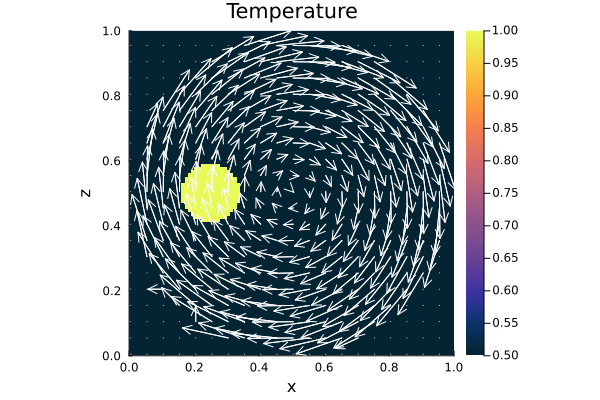
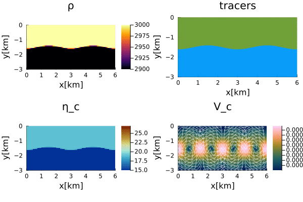

# GeoModBox.jl

The **Geod**ynamic **Mod**elling Tool**Box** is a Julia package primarily intended for teaching purposes. It provides various finite difference, staggered discretization schemes to numerically solve the governing equations of two-dimensional geodynamic problems. These include the conservation equations of:

1) [**Energy**](https://geosci-ffm.github.io/GeoModBox.jl/dev/man/DiffMain/), 
2) [**Momentum**](https://geosci-ffm.github.io/GeoModBox.jl/dev/man/MomentumMain/), 
3) [**Mass** and **Compositon**](https://geosci-ffm.github.io/GeoModBox.jl/dev/man/AdvectMain/). 

`GeoModBox.jl` includes a series of [exercises](./exercises/) and [examples](./examples/) of geodynamically well-defined problems. The exercises are provided as Jupyter notebooks for students to complete. The theoretical background is documented here.

The solvers for each governing equation can be used separately or in combination for dimensional or non-dimensional problems, with only minimal modifications when calling the functions. For more informations on how to use the individual functions please see the [list of functions](https://geosci-ffm.github.io/GeoModBox.jl/dev/man/listoffunctions/) or individual [exmples](https://geosci-ffm.github.io/GeoModBox.jl/dev/man/Examples/). Some typical initial conditions, such as a linearly increasing temperature, are predefined and can be called using [specific functions](https://geosci-ffm.github.io/GeoModBox.jl/dev/man/Ini/). In the following a brief explenation is given regarding the governing equations and the numerical method to solve them within the `GeoModBox.jl`. For more detailed information see the individual documentations. 

## Staggered Finite Difference

To properly solve the governing equations, a staggered finite difference scheme is chosen for the *energy* and *momentum* equations. A staggered grid enables a correct and straightforward implementation of boundary conditions and ensures conservation of stress between nodes in cases of variable viscosity. This requires certain parameters to be defined on different grids. For more information regarding the physical and numerical background, please refer to [this](https://geosci-ffm.github.io/GeoModBox.jl/dev/man/GESolution/).

Within the `GeoModBox.jl`, temperature, density, pressure, normal deviatoric stresses, and heat production rate are defined on the *centroids*. The deviatoric shear stresses are defined on the *vertices*, and velocities are defined between the *vertices*. Viscosity is required on both.

For further details on the implementation in `GeoModBox.jl`, see the individual documentations for each governing equation. 

## Energy Conservation Equation

In geodynamics, the energy is described by the temperature and needs to be conserved within a closed system. Within the `GeoModBox.jl`, the *temperature conservation equation*, or *temperature equation*, is solved using an *operator splitting* method, that is, first the *advective* part of the temperature equation is solved, followed by the *diffusive* part. 

### [Heat Diffusion Equation](https://geosci-ffm.github.io/GeoModBox.jl/dev/man/DiffMain/)

`GeoModBox.jl` provides several finite difference schemes for solving the *diffusive part* of the time-dependent or steady-state temperature equation, including radioactive heating, in both [1-D](https://geosci-ffm.github.io/GeoModBox.jl/dev/man/DiffOneD/) and [2-D](https://geosci-ffm.github.io/GeoModBox.jl/dev/man/DiffTwoD/). The solvers are located in [src/HeatEquation](./src/HeatEquation/). Currently, only *Dirichlet* and *Neumann* thermal boundary conditions are supported. Most functions assume constant thermal parameters (with the exception of the 1-D solvers and the 2-D, iterative implicit solver, called **iterative defection correction method**).

### [Heat Advection Equation](https://geosci-ffm.github.io/GeoModBox.jl/dev/man/AdvectMain/)

`GeoModBox.jl` provides various methods to advect properties within the model domain. The routines are structured so that any property defined on *centroids* (including *ghost nodes* at all boundaries) can be advected using the described solvers. Using passive tracers, one may choose to advect either the absolute temperature or the phase ID.

## [Momentum Conservation Equation](https://geosci-ffm.github.io/GeoModBox.jl/dev/man/MomentumMain/)

On geological timescales, Earth's mantle and lithosphere deform slowly due to their high viscosity, allowing us to neglect inertial forces. This simplifies the Navier-Stokes equation into the **Stokes equation**. `GeoModBox.jl` provides two main methods to solve the Stokes equation in [1-D](https://geosci-ffm.github.io/GeoModBox.jl/dev/man/MomentumOneD/) and [2-D](https://geosci-ffm.github.io/GeoModBox.jl/dev/man/MomentumTwoD/): the direct method and the defection correction method, applicable for both constant and variable viscosity fields. Velocity and pressure are defined on a staggered grid, and ghost nodes are included to ensure proper implementation of free-slip and no-slip boundary conditions.

## [Benchmarks and Examples](./examples/)

The following are visualizations of selected examples provided by `GeoModBox.jl`. For further details, refer to the documentation linked in each title.

### [Gaussian Temperature Diffusion](./examples/DiffusionEquation/2D/Gaussian_Diffusion.jl)

**Figure 1. Gaussian Diffusion.** Time-dependent, diffusive solution of a 2-D Gaussian temperature anomaly at a resolution of 100 × 100, using the [Crank-Nicholson approach](./src/HeatEquation/2Dsolvers.jl),  compared to the analytical solution.  
Top Left: 2-D temperature field with numerical isotherms (solid black) and analytical isotherms (dashed yellow).  
Top Right: Total deviation from the analytical solution.  
Bottom Left: 1-D y-profile along $x = 0$.  
Bottom Right: Root Mean Square (RMS) total deviation over time.

**Figure 2. Resolution test.** Maximum RMS error $\varepsilon$, maximum temperature, and mean temperature for various finite difference schemes and resolutions for the diffusion example shown above.

---

### [Rigid-Body-Rotation](./examples/AdvectionEquation/2D_Advection.jl)

 
 
 
 

**Figure 3. Rigid-Body-Rotation.** Time-dependent advection of a rotating circular temperature anomaly using the **upwind (top)**, **semi-Lagrangian (middle)**, and **tracer (bottom)** methods on a 100 × 100 grid. Within a circular region, the velocity field follows rigid rotation; outside, it is zero. Temperature for tracers is interpolated to the grid for visualization but not updated on the tracers.

---

### [Falling Block](./examples/StokesEquation/2D/FallingBlockBenchmark.jl)

**Figure 4. Isoviscous Falling Block.** Time-dependent simulation of an isoviscous falling block at 50 × 50 resolution with 9 tracers per cell. The solver handles variable viscosities. Tracers advect the phase ID, which is used to interpolate density and viscosity on centroids and vertices, respectively.

**Figure 5. Falling Block Sinking Velocity.** Block sinking velocity vs. initial viscosity ratio $\eta_r$, using the same setup as above. 

**Figure 6. Falling Block Benchmark.** Tracer distribution at the final stage for selected viscosity ratios $\eta_r \ge 0$.

--- 

### [Rayleigh-Taylor Instability](./examples/StokesEquation/2D/RTI.jl)

**Figure 7. Rayleigh-Taylor Instability.** Evolution of two-layered Rayleigh-Taylor instability. 

---

### [Thermal Convection](./examples/MixedHeatedConvection)

**Figure 8. Bottom-Heated, Isoviscous Convection for Ra = $10^6$, resolution 400 × 100.**  
TOP: Transient temperature field with velocity vectors.  
BOTTOM: Horizontally averaged temperature–depth profiles at each time step.  
Solvers: defect correction (momentum), semi-Lagrangian (advection), Crank-Nicolson (heat diffusion).  
Boundary conditions: Dirichlet (top/bottom), Neumann (sides), free-slip (velocity, all sides).

**Figure 9. Internally Heated Convection for $Ra_Q = 1.5 \cdot 10^6$, resolution 400 × 100.**  
Same setup as above, but with Neumann boundary at the bottom (zero heat flux) and constant internal volumetric heat production $Q \approx 15$.

**Figure 10. Mixed-Heated Convection for Ra = $...$, resolution 400 × 100.**  
Combination of the above two setups (bottom heating + internal heating).

------------------

<!-- # References

Gerya, T. (2019). Introduction to numerical geodynamic modelling. Cambridge University Press.

Spiegelman, M. (2004). Myths and methods in modeling. Columbia University Course Lecture Notes, available online at http://www. ldeo. columbia. edu/~ mspieg/mmm/course. pdf, accessed, 6, 2006.

Becker, T.W., and Kaus, B.J.P., 2016, Numerical modeling of Earth systems, an introduction to computational methods with focus on solid Earth applications of continuum mechanics: University of Southern California Lecture Notes, http://www-udc.ig.utexas.edu/external/becker/preprints/Geodynamics557.pdf (last accessed June 2025).

W. H. Press, B. P. Flannery, S. A. Teukolsky, and W. T. Vetterling, Numerical Recipes 1986, (Cambridge Univ. Press, Cambridge, 1986).

Becker, T., & Faccenna, C. (2025). Tectonic Geodynamics. Princeton University Press.

# References

Spiegelman, M. (2004). Myths and methods in modeling. Columbia University Course Lecture Notes, available online at http://www. ldeo. columbia. edu/~ mspieg/mmm/course. pdf, accessed, 6, 2006.

W. H. Press, B. P. Flannery, S. A. Teukolsky, and W. T. Vetterling, Numerical Recipes 1986, (Cambridge Univ. Press, Cambridge, 1986).
-->

<!--
- Blanckenbach
- Channel Flow (2D)
- Falling Block, check! 
- Gauss Diffusion, check! 
- RTI 
- Rigid Body Rotation, check! 
- Viscous Inclusion
-->
