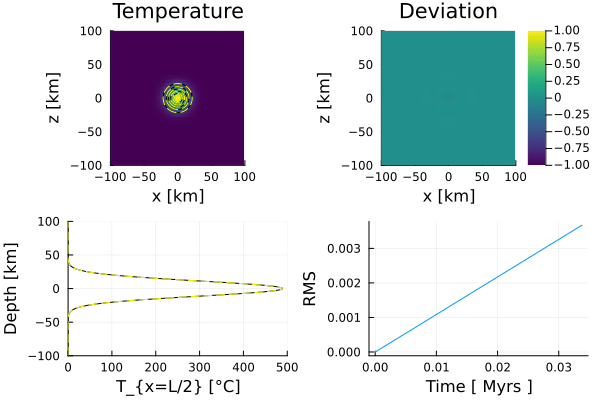
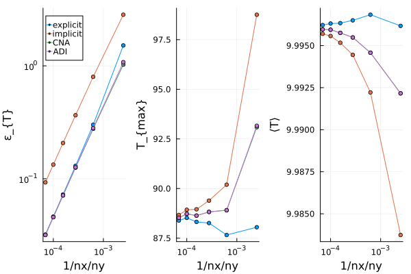
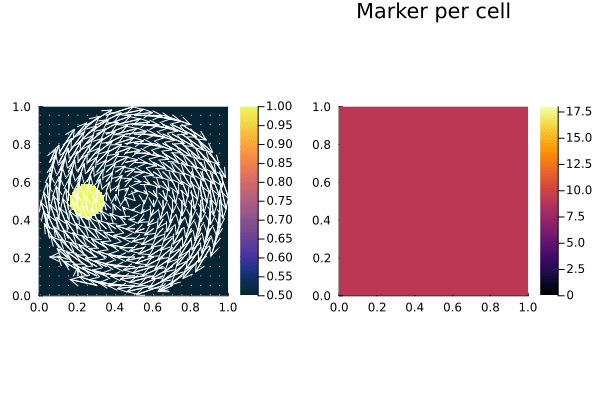
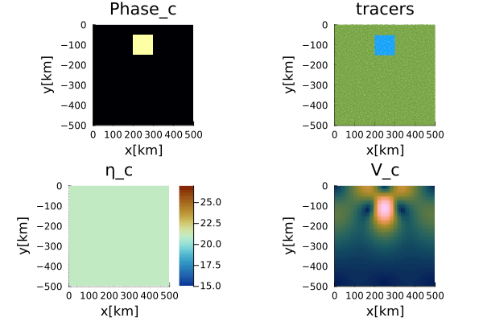
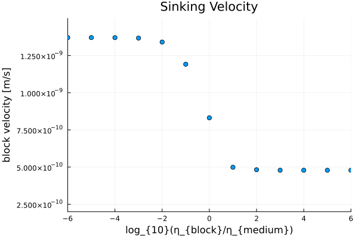
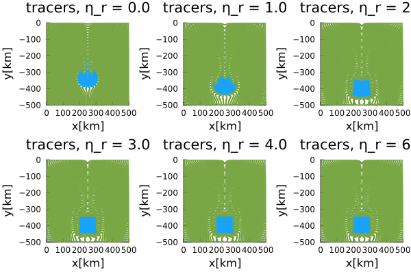

[](https://lukasfuchs.github.io/GeoModBox.jl/)

# GeoModBox.jl
The **Geod**ynamic **Mod**elling Tool**Box** is a julia package mainly used for teaching purposes. The package provides different finite difference, staggered, discretization schemes to numerically solve the governing equations for a two-dimensional geodynamic problem. The governing equations are the conservation equations of 
1) [**energy**](/examples/HeatEquation/README.md), 
2) [**momentum**](/examples/...), 
3)  [**mass** and **compositon**](/examples/AdvectionEquation/README.md). 

The ```GeoModBox.jl``` includes a series of [exercises](/exercises/) and [examples](/examples/) of different geodynamically well defined problems. The exercises are given as Jupyter notebooks for the students to complete. The theoretical background and detailed explenations of the functions is mainly given in the [documentation](https://lukasfuchs.github.io/GeoModBox.jl/).

<!-- I will add some question directly here for the time beeing: I would like to add similar informations to this package as I did in my [FDCSGm repository](https://github.com/LukasFuchs/FDCSGm). However, I am not familiar with the doc option in github yet, that's why I added all the information in a README.md file for each module etc. I guess the doc option would be more suitable to add the details and simply add some figures and general information in the README.md. Have you ever worked with doc in github? -->

------------------
------------------
## Staggered Finite Difference 
<!--- brief general description of a staggered finite difference scheme
- Energy equation
- Momentum equation
- add Figure of FD-Grid including all variables... 
-->
------------------
------------------
## [Energy Conservation Equation](./examples/DiffusionEquation/README.md)
&emsp; In geodynamics, the energy is described by the temperature and needs to be conserved within a closed system. Here, we solve the *temperature conservation equation*, or *temperature equation*, using an operator splitting method, that is, we first solve the *advective* part of the *temperature equation*, followed by the *diffusive* part. 
<!-- - General formulation of the energy equation (advection + diffusion term + radiogenic heating)
- Operator splitting
- Solution of the conductive part -->
------------------
### [Heat Diffusion Equation](./examples/DiffusionEquation/1D/README.md)
&emsp; The **GeoModBox** provides different finite difference (**FD**) schemes (e.g., [forward](./src/HeatEquation/ForwardEuler.jl) and [backward](./src/HeatEquation/BackwardEuler.jl) Euler, [Crank-Nicholson approach](./src/HeatEquation/CNA.jl), [ADI](./src/HeatEquation/ADI.jl)) to solve the *diffusive part* of the time-dependent or steady-state *temperature equation* including radioactive heating, in [1-D](./examples/DiffusionEquation/1D/README.md) and [2-D](./examples/DiffusionEquation/2D/README.md). The solvers are located in [src/HeatEquation](./src/HeatEquation/). So far, only *Dirichlet* and *Neumann* thermal boundary conditions are available. Currently, most of the functions assume constant thermal parameters (except for the 1-D solvers). 

The examples of solving the *heat diffusion equation* include, amongst others: 
- the determination of an [oceanic](./examples/DiffusionEquation/1D/OceanicGeotherm_1D.jl) and [continental](./examples/DiffusionEquation/1D/ContinentalGeotherm_1D.jl) 1-D geotherm profile, 
- [a comparison of the different **FD**-schemes applied on a 1-D gaussian temperature anomaly](./examples/DiffusionEquation/1D/Heat_1D_discretization.jl), 
- [a 2-D resolution test for each **FD**-scheme using a gaussian temperature anomaly](./examples/DiffusionEquation/2D/Gaussian_Diffusion.jl), and
- [a resolution test for a 2-D poisson problem](./examples/DiffusionEquation/2D/Poisson_ResTest.jl). 

For more examples see the [example folder](./examples/DiffusionEquation/). The [exercises](./exercises/) include solving 
- the 1-D diffusion equation using the [forward](./exercises/02_1D_Heat_explicit.ipynb) and [backward](./exercises/03_1D_Heat_implicit.ipynb) Euler methods, 
- [a 2-D poisson problem](./exercises/04_2D_Diffusion_Stationary.ipynb), and
- a time-dependent temperature distribution within the lithosphere assuming a [plume](./exercises/05_2D_Diffusion_TD_Plume.ipynb) or [sill](./exercises/05_2D_Diffusion_TD_Sill.ipynb).

<!-- #### Numerical Schemes

All numerical schemes methods can be used in the [thermal convection code]() and the [Blankenbach Benchmark]() and are generally available to chose in the code. 
------------------ -->

### [Heat Advection Equation](./examples/AdvectionEquation/README.md)

&emsp; To solve the *advective part* of the *temperature equation*, the ```GeoModBox.jl``` provides the following different methods: 
- an upwind scheme,
- the staggered -leaped frog scheme, 
- a semi-lagrangian advection, and
- passive tracers/markers. 

The solvers for a the tracer advection method are located in [./src/Tracers](./src/Tracers/), where the remaining advection routines are located in [./src/AdvectionEquation](./src/AdvectionEquation/). The routines are structured in such a way, that any property, as long as the property is defined on the *centroids* including *ghost nodes* on all boundaries, can be advected with the first **three** advection methods listed above. Using passive tracers, one can so far choose to either advect the temperature or to advect the phases. In case of advecting phases, one can define a certain rheology ($\eta$) or density ($\rho$) associated to each phase. The phase ID is used to interpolate the corresponding property from the tracers to the *centroids*. 

&emsp; A key aspect for the advection equation is the conservation of the **amplitude** and the **shape** of an anomaly. Depending on the method, numerical diffusion or interpolation effects lead to strong deviations of the initial anomaly. For more details see [here](./examples/AdvectionEquation/README.md). The ```GeoModBox.jl``` contains several [routines](./src/InitialCondition/2Dini.jl) to setup a certain initial anomaly, either for properties defined on their correspondig grid (i.e., temperature, velocity, or phase) or for tracers advecting (so far) a certain temperature or phase. Within the examples and the exercise one can choose differen initial temperature and velocity conditions.

&emsp; The examples for a two dimensional advection problem include:
- [a 2-D advection, assuming a constant velocity field (e.g., a rigid body rotation)](./examples/AdvectionEquation/2D_Advection.jl), and
- [a resolution test of the same advection example](./examples/AdvectionEquation/2D_Advection_ResolutionTest.jl). 

&emsp; The exercises include a: 
- [1-D advection of a gaussian or block anomaly](./exercises/06_1D_Advection.ipynb), and
- [a 2-D advection coupled with the solution of the diffusion equation](./exercises/07_2D_Energy_Equation.ipynb).

<!-- 
- Different properties can be advected! 
### Discretization Schemes
#### Upwind 
#### Staggered Leap Frog (SLF)
#### Semi-Lagrangian
#### Passive Tracers -->
------------------
------------------
## [Momentum Conservation Equation](./examples/StokesEquation/README.md)

<!--
- Constant viscosity
- Variable viscosity
- Coefficients assembly 
- Right-hand side updates
- Direct solution 
- Defect correction
-->

------------------
------------------
## Code Structure

### Initial Conditions 

<!---
- IniTemperature, IniVelocity, IniPhase,
- Tracer Initialization
- ...
-->

### Scaling

------------------
------------------
## [Benchmarks](./examples/)

### [Gaussian Temperature Diffusion](./examples/DiffusionEquation/2D/Gaussian_Diffusion.jl)
 <br>
**Figure 1. Gaussian Diffusion.** Time-dependent, diffusive solution of a 2-D Gaussian temperature anomaly using the [Crank-Nicholson approach](./src/HeatEquation/CNA.jl) in comparison to its analytical solution. Top Left: 2-D temperature field of the numerical solution and isotherms lines of the numerical (solid black) and analytical (dashed yellow) solution. Top Right: Total deviation to the analytical solution. Bottom Left: 1-D y-profile along x=0. Bottom Right: Root Mean Square total devation of the temperature over time. 


 <br>
**Figure 2. Resolution test.** Maximum *RMS* $\varepsilon$, maximum, and mean temperature for each **FD**-scheme and multiple resolutions. 

### [Rigid-Body-Rotation](./examples/AdvectionEquation/2D_Advection.jl)

 
 
 
<br>

**Figure 3. Rigid-Body-Rotation.** Time-dependent solution of a rotating circular temperature anomaly using the **upwind (first)**, **semi-lagrangian (second)**, and **tracer (third)** method. Within a circular area of our model domain the velocity is set to the velocity of a rigid rotation and outside euqal to zero. The temperature is scaled by the maximum temperature of the anomaly. 

### [Falling Block](./examples/StokesEquation/2D/FallingBlockBenchmark.jl)

 <br>

**Figure 4. Isoviscous Falling Block.** Time-dependent solution of an isoviscous falling block example. The problem is solved with a solver for variable viscosities. The tracers advect the phase ID, which is used to interpolate the density and viscosity on the centroids and vertices, respectively. 

 <br>

**Figure 5. Falling Block Sinking Velocity.** Sinking velocity of the block with respect to the viscosity ratio $\eta_r$ at the initial condition. 

 <br>

**Figure 6. Falling Block Benchmark.** Final tracers distribution for specific cases with $\eta_r \ge 0$. 

------------------
------------------

<!--
- Blanckenbach
- Channel Flow
- Falling Block
- Gauss Diffusion, check! 
- RTI 
- Rigid Body Rotation, check! 
- Viscous Inclusion
-->
