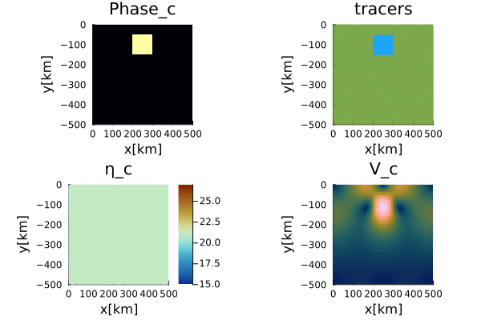

# GeoModBox.jl

The **Geod**ynamic **Mod**elling Tool**Box** is a julia package mainly used for teaching purposes. The package provides different finite difference, staggered, discretization schemes to numerically solve the governing equations for a two-dimensional geodynamic problem. The governing equations are the conservation equations of 

1) [**energy**](./man/DiffMain.md), 
2) [**momentum**](./man/MomentumMain.md), 
3) [**mass** and **compositon**](./man/AdvectMain.md). 

The ```GeoModBox.jl``` includes a series of [exercises](https://github.com/GeoSci-FFM/GeoModBox.jl/blob/main/exercises/) and [examples](https://github.com/GeoSci-FFM/GeoModBox.jl/blob/main/examples/) of different geodynamically well defined problems. The exercises are given as Jupyter notebooks for the students to complete. The theoretical background is mainly given here in the documentation.

The solvers for each governing equation can be used seperately or in combination for dimensional or non-dimensional problems with only minimal modifications when calling the functions. Some typical initial conditions, like a linear increasing temperature, are predifined and can be called using [certain functions](./man/Ini.md).

For more details on how this is implemented please see this [documentation](./man/GESolution.md).

## Staggered Finite Difference

To properly solve the governing equations, a staggered finite difference scheme is choosen for the *energy* and *momentum* equations. A staggered grid enables a correct, straight forward implementation of certain boundary conditions and enables the conservation of stress between the nodes in case of a variable viscosity. This requires that certain parameters are defined on different grids. 

Here, the temperature, density, pressure, normal deviatoric stresses, and heat production rate are defined on the *centroids*, the deviatoric shear stresses are defined on the *vertices*, the velocities are defined in between the *vertices*. The viscosity is needed on both. 

For more details on how this is used in the ```GeoModBox.jl``` see [here](./man/GESolution.md).

## Energy Conservation Equation

In geodynamics, the energy is described by the temperature and needs to be conserved within a closed system. Here, we solve the *temperature conservation equation*, or *temperature equation*, using an *operator splitting* method, that is, we first solve the *advective* part of the temperature equation, followed by the *diffusive* part. 

### [Heat Diffusion Equation](./man/DiffMain.md)

The ```GeoModBox.jl``` provides different finite difference schemes to solve the *diffusive part* of the time-dependent or steady-state temperature equation including radioactive heating, in [1-D](./man/DiffOneD.md) and [2-D](./man/DiffTwoD.md). The solvers are located in [src/HeatEquation](https://github.com/GeoSci-FFM/GeoModBox.jl/blob/main/src/HeatEquation/). So far, only *Dirichlet* and *Neumann* thermal boundary conditions are available. Most of the functions assume constant thermal parameters (except for the 1-D solvers and the 2-D defect correction solver). 

### [Heat Advection Equation](./man/AdvectMain.md)

The ```GeoModBox.jl``` provides different methods to advect certain properties within the model domain. The corresponding routines are structured in such a way, that any property can be advected with the described advection solvers, as long as the property is defined on the *centroids* including *ghost nodes* at all boundaries. Using passive tracers, one can, so far, choose to either advect the absolute temperature or the phase ID. 

## [Momentum Conservation Equation](./man/MomentumMain.md)

On a geological time scale, Earth's mantle and the lithosphere creep slowly due to its high viscosity and one can neglect the inertial forces. This simplifie the Navier-Stokes equation and one obtains the so called **Stokes equation**. The ```GeoModBox.jl``` provides mainly two different methods, the direct method and the defect correction method, to solve the Stokes equation in [1-D](./man/MomentumOneD.md) and [2-D](./man/MomentumTwoD.md) assuming both a constant and variable viscosity field. The velocity and the pressure are thereby defined on a staggered grid and ghost nodes are also defined to properly implement free slip and no slip boundary condtions. 

## [Benchmarks and Examples](https://github.com/GeoSci-FFM/GeoModBox.jl/blob/main/examples/)

Here are the resulting visualizations of some of the examples provided by the ```GeoModBox.jl```. For more details on the examples, please refer to the [individual documentation of the examples](./man/Examples.md). The title of each example is linked to the source code of the example. 

### [Gaussian Temperature Diffusion](https://github.com/GeoSci-FFM/GeoModBox.jl/blob/main/examples/DiffusionEquation/2D/Gaussian_Diffusion.jl)


**Figure 1. Gaussian Diffusion.** Time-dependent, diffusive solution of a 2-D Gaussian temperature anomaly for a resolution of 100 x 100 using the [Crank-Nicholson approach](https://github.com/GeoSci-FFM/GeoModBox.jl/blob/main/src/HeatEquation/2Dsolvers.jl) in comparison to its analytical solution. Top Left: 2-D temperature field of the numerical solution and isotherms lines of the numerical (solid black) and analytical (dashed yellow) solution. Top Right: Total deviation to the analytical solution. Bottom Left: 1-D y-profile along x=0. Bottom Right: Root Mean Square total devation of the temperature over time. 


**Figure 2. Resolution test.** Maximum *RMS* $\varepsilon$, maximum, and mean temperature for each finite difference scheme and multiple resolutions for the above shown diffusion example.

---

### [Rigid-Body-Rotation](https://github.com/GeoSci-FFM/GeoModBox.jl/blob/main/examples/AdvectionEquation/2D_Advection.jl)


**Figure 3. Rigid-Body-Rotation.** Time-dependent solution of a rotating circular temperature anomaly using the **upwind (first)**, **semi-lagrangian (second)**, and **tracer (third)** method for a resolution of 100 x 100. Within a circular area of our model domain the velocity is set to the velocity of a rigid rotation and outside euqal to zero. The temperature is scaled by the maximum temperature of the anomaly. Temperature distribution for the tracers is only interpolated back to the grid for visualization purposes and not updated on the tracers.

---

### [Falling Block](https://github.com/GeoSci-FFM/GeoModBox.jl/blob/main/examples/StokesEquation/2D/FallingBlockBenchmark.jl)



**Figure 4. Isoviscous Falling Block.** Time-dependent solution of an isoviscous falling block example for a resolution of 50 x 50 and 9 tracers per cell. The problem is solved with a solver for variable viscosities. The tracers advect the phase ID, which is used to interpolate the density and viscosity on the centroids and vertices, respectively. 


**Figure 5. Falling Block Sinking Velocity.** Sinking velocity of the block with respect to the viscosity ratio $\eta_r$ at the initial condition. Same setup as in the previous figure. 


**Figure 6. Falling Block Benchmark.** Final tracers distribution for certain cases with $\eta_r \ge 0 $. 

---

### [Thermal Convection](https://github.com/GeoSci-FFM/GeoModBox.jl/blob/main/examples/MixedHeatedConvection)


**Figure 7. Bottom Heated, isoviscous Convection for Ra = $10^6$ and a resolution of 400 x 100.** TOP: Transient behavior of the temperature field overlain with the velocity vectors. BOTTOM: Horizonatlly averaged temperature-depth profiles for each time step. The model is solved using the defect correction method for the momentum equation, semi-lagrangian advection scheme, and Crank-Nicolson approach for the heat diffusion. The thermal boundary conditions are Dirichlet at the top and bottom and Neumann at the sides. The velocity boundary conditions are free slip along all sides. For more details see the [example documentations](./man/Examples.md).


**Figure 8. Internally heated, isoviscous Convection for $Ra_Q$ = $1.5 \cdot 10^6$ and a resolution of 400 x 100.** The model parameters are the same as in the previous example, except for *Neumann* boundary conditions at the bottom (zero heat flux) and a constant internal, non-dimensional volumetric heat production rate of $Q \approx 15$. The solvers, boundary, and initial condition as the same as used in the previous example. 


**Figure 9. Mixed heated, isoviscous Convection for Ra = $...$ and a resolution of 400 x 100.** Same solvers, boundary, and initial condition used as in the previous figure.

------------------