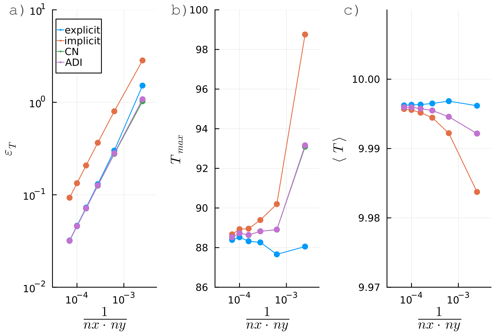
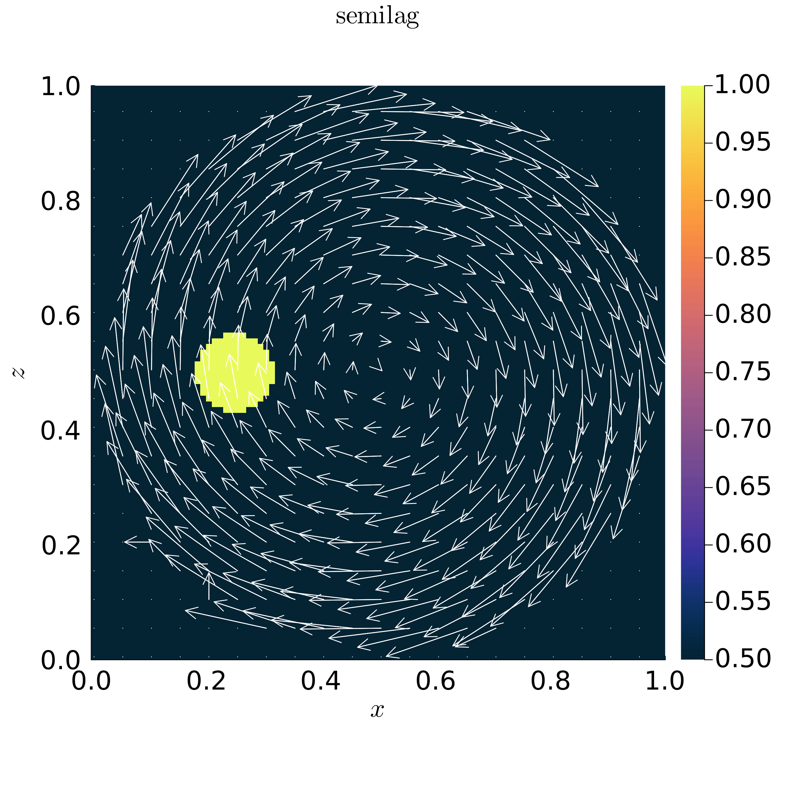
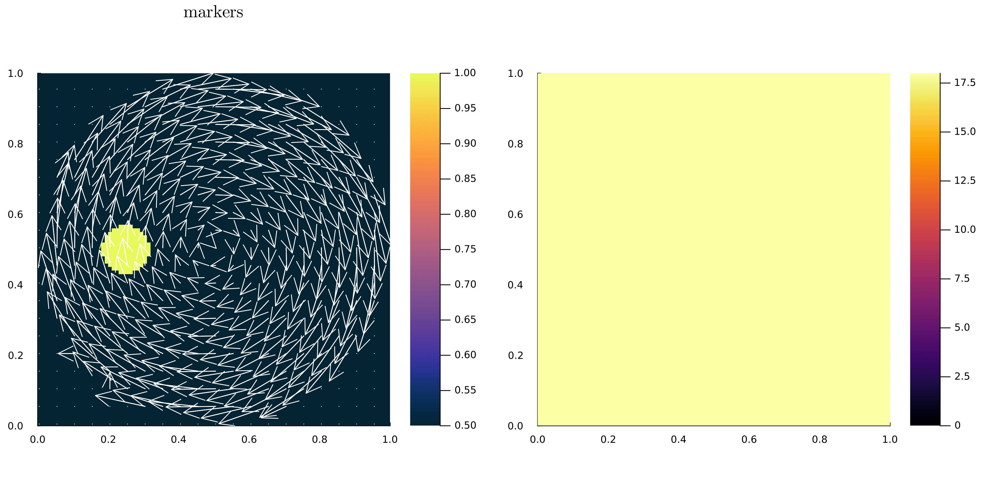
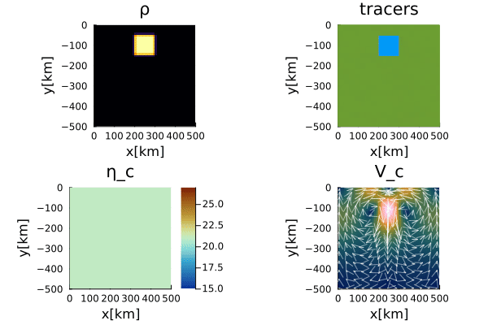
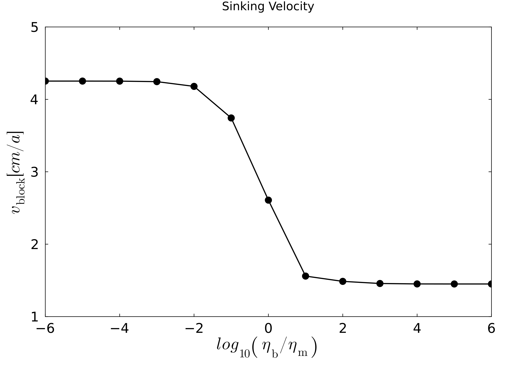
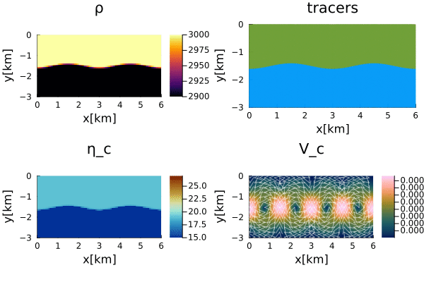
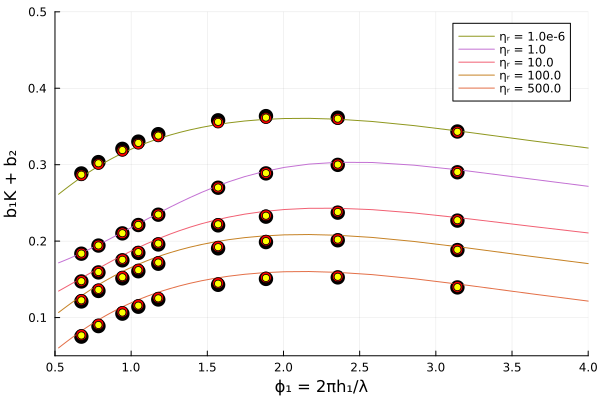
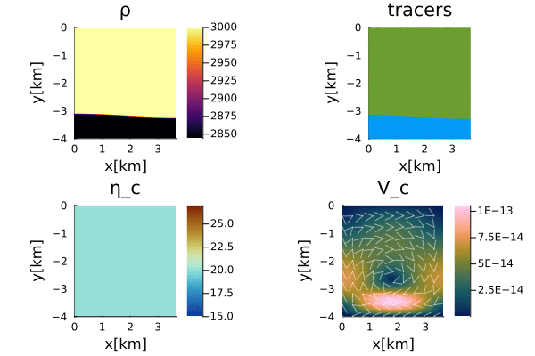
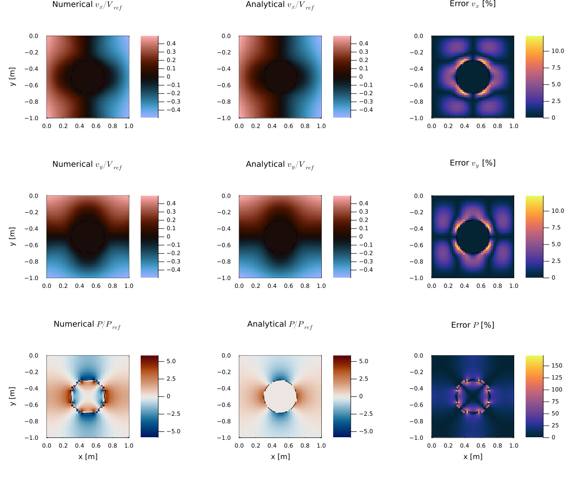
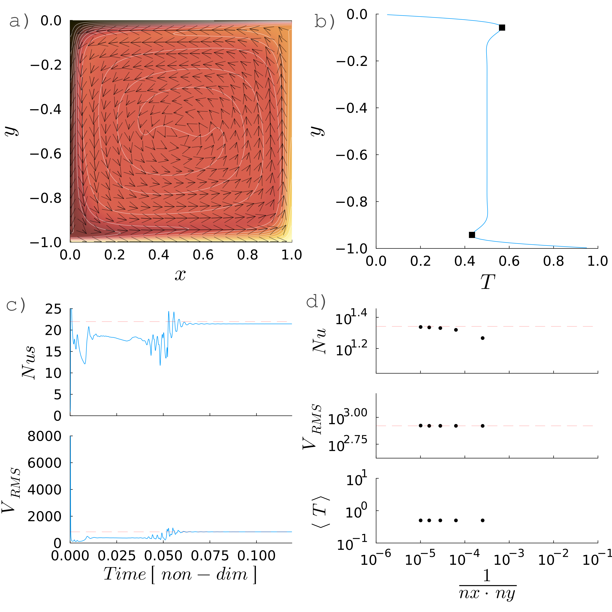

# GeoModBox.jl

The **Geod**ynamic **Mod**elling Tool**Box** is a Julia package primarily intended for teaching purposes. It provides various finite difference, staggered discretization schemes to numerically solve the governing equations of two-dimensional geodynamic problems. These include the conservation equations of:

1) [**Energy**](./man/theory/DiffMain.md), 
2) [**Momentum**](./man/theory/MomentumMain.md), 
3) [**Mass** and **Composition**](./man/theory/AdvectMain.md). 

`GeoModBox.jl` includes a series of [exercises](./man/exercises/Exercises.md) and [examples](./man/examples/Examples.md) of geodynamically well-defined problems. The exercises are provided as Jupyter notebooks for students to complete. The theoretical background is documented here.

The solvers for each governing equation can be used separately or in combination for dimensional or non-dimensional problems, with only minimal modifications when calling the functions. For more information on how to use the individual functions please see the [list of functions](./man/listoffunctions.md) or individual [examples](./man/examples/Examples.md). Some typical initial conditions, such as a linearly increasing temperature, are predefined and can be called using [specific functions](./man/Ini.md). In the following a brief explanation is given regarding the governing equations and the numerical method to solve them within the `GeoModBox.jl` framework. For more detailed information see the individual documentations. 

## Installation

`GeoModBox.jl` can be installed directly through the Julia package manager or cloned from GitHub to access the complete repository, including the examples, exercises, and documentation.

> **Important:** `GeoModBox.jl` uses separate Julia environments for the core package, examples, exercises, and documentation. When running examples or exercises, the corresponding `examples` or `exercises` environment must be activated first.

For detailed instructions on installing Julia and `GeoModBox.jl`, setting up the required environments, and using the package as a user, student, or developer, see the [Installation](./man/Installation.md) guide.

## Staggered Finite Difference

To properly solve the governing equations, a staggered finite difference scheme is chosen for the *energy* and *momentum* equations. A staggered grid enables a correct and straightforward implementation of boundary conditions and ensures conservation of stress between nodes in cases of variable viscosity. This requires certain parameters to be defined on different grids. For more information regarding the physical and numerical background, please refer to [general solution documentation](./man/theory/GESolution.md).

Within `GeoModBox.jl`, temperature, density, pressure, normal deviatoric stresses, and heat production rate are defined on the *centroids*. The deviatoric shear stresses are defined on the *vertices*, and velocities are defined between the *vertices*. Viscosity is required on both.

For further details on the implementation in `GeoModBox.jl`, see the individual documentations for each governing equation. 

## Energy Conservation Equation

In geodynamics, the energy is described by the temperature and needs to be conserved within a closed system. Within `GeoModBox.jl`, the *temperature conservation equation*, or *temperature equation*, is solved using an *operator splitting* method, that is, first the *advective* part of the temperature equation is solved, followed by the *diffusive* part. 

### [Heat Diffusion Equation](./man/theory/DiffMain.md)

`GeoModBox.jl` provides several finite difference schemes for solving the *diffusive part* of the time-dependent or steady-state temperature equation, including radioactive heating, in both [1-D](./man/theory/DiffOneD.md) and [2-D](./man/theory/DiffTwoD.md). The solvers are located in [src/HeatEquation](https://github.com/GeoSci-FFM/GeoModBox.jl/blob/main/src/HeatEquation/). Currently, only *Dirichlet* and *Neumann* thermal boundary conditions are supported. Most functions assume constant thermal parameters (with the exception of the 1-D solvers and the 2-D, iterative implicit solver, called **iterative defect correction method**).

### [Heat Advection Equation](./man/theory/AdvectMain.md)

`GeoModBox.jl` provides various methods to advect properties within the model domain. The routines are structured so that any property defined on *centroids* (including *ghost nodes* at all boundaries) can be advected using the described solvers. Using passive tracers, one may choose to advect either temperature or the phase ID.

## [Momentum Conservation Equation](./man/theory/MomentumMain.md)

On geological timescales, Earth's mantle and lithosphere deform slowly due to their high viscosity, allowing us to neglect inertial forces. This simplifies the Navier-Stokes equation into the **Stokes equation**. `GeoModBox.jl` provides two main methods to solve the Stokes equation in [1-D](./man/theory/MomentumOneD.md) and [2-D](./man/theory/MomentumTwoD.md): the direct method and the defect correction method, applicable for both constant and variable viscosity fields. Velocity and pressure are defined on a staggered grid, and ghost nodes are included to ensure proper implementation of the kinematic boundary conditions. 

## [Benchmarks and Examples](./man/examples/Examples.md)

The following are visualizations of selected examples provided by `GeoModBox.jl`. For further details, refer to the documentation linked in each title. Each runtime can be found in the documentation of the [examples](./man/examples/Examples.md) and [exercises](./man/exercises/Exercises.md).

### [Gaussian Temperature Diffusion](./man/examples/Diffusion/GaussianDiffusion2D.md)

```@raw html
    
```

**Figure 1. Gaussian Diffusion.** Time-dependent, diffusive solution of a 2-D Gaussian temperature anomaly at a resolution of 120 × 120, using the direct, special-case, solver with the [Crank-Nicholson discretization](./man/theory/DiffTwoD.md), compared to the analytical solution. a) 2-D temperature field with numerical isotherms (solid black) and analytical isotherms (dashed yellow). b) Total deviation from the analytical solution. c) 1-D z-profile along $x = 0$. d) Root Mean Square (RMS) total deviation over time.

```@raw html
    
```

**Figure 2. Resolution test.** a) Maximum RMS error $\varepsilon$, b) maximum temperature, and c) mean temperature for various finite difference schemes and resolutions using the special case, linear solver (single left-matrix division) for the diffusion example shown above.

---

### [Rigid-Body-Rotation](./man/examples/Advection/Advection2D.md)

```@raw html
    
```

```@raw html
    
```

```@raw html
    
```

**Figure 3. Rigid-Body-Rotation.** Time-dependent advection of a rotating circular temperature anomaly using the **upwind (top)**, **semi-Lagrangian (middle)**, and **tracer (bottom)** methods on a 100 × 100 grid. Within a circular region, the velocity field follows rigid rotation; outside, it is zero.

---

### [Falling Block](./man/examples/Stokes/FallingBlockBenchmark.md)

```@raw html
    
```

**Figure 4. Isoviscous Falling Block.** Time-dependent simulation of an isoviscous falling block at 50 × 50 resolution with 9 tracers per cell. The solver handles variable viscosities. Tracers advect the phase ID, which is used to interpolate density and viscosity on centroids and vertices, respectively.

```@raw html
    
```

**Figure 5. Falling Block Sinking Velocity.** Block sinking velocity vs. initial viscosity ratio $\eta_r$, using the same setup as above. 

```@raw html
    
```

**Figure 6. Falling Block Benchmark.** Tracer distribution at the final stage for selected viscosity ratios $\eta_r \ge 0$.

--- 

### [Rayleigh-Taylor Instability (RTI)](./man/examples/Stokes/RTI.md)

#### [RTI Growth-rate Benchmark (Ramberg, 1968)](./man/examples/Stokes/RTI_growth_rate.md)

```@raw html
    
```

**Figure 7. Rayleigh-Taylor Instability.** Evolution of two-layered Rayleigh-Taylor instability. 

```@raw html
    
```

**Figure 8.** Growth rate of an initial cosinusoidal perturbation in a two-layer system across various wavelengths $\lambda$. The growth rate is arbitrarily scaled using $b_1$ and $b_2$ for visualization, following the approach of Gerya (2019). The lines are the analytical solutions for different viscosity ratios $\eta_r$ and the markers show the corresponding numerical results for models with decreasing amplitudes (black - 100 m, red - 10 m, yellow - 1 m).

#### [RTI Benchmark (Van Keken et al., 1997)](./man/examples/Stokes/VanKekenBenchmark.md)

```@raw html
    
```

**Figure 9.** Evolution of the dimensional Van Keken benchmark. The panels show the density field, tracer distribution, viscosity, and velocity magnitude together with the velocity vectors. The initially perturbed interface evolves into the characteristic Rayleigh-Taylor instability.

---

### [Viscous Inclusion Benchmark](./man/examples/Stokes/ViscousInclusion.md)

```@raw html
    
```

**Figure 10.** Comparison between the numerical and analytical solutions for the horizontal velocity, vertical velocity, and pressure fields. The third column shows the corresponding relative error distributions. The largest errors are localized at the viscosity interface, where the material properties are discontinuous, while excellent agreement is obtained throughout the remainder of the domain.

---

### [Thermal Convection Models](./man/examples/Convection/Overview_Convection.md)

#### [Blankenbach Benchmark (Blankenbach et al., 1989)](./man/exercises/13_Blankenbach_Benchmark.md)

```@raw html
    
```

**Figure 11.** Isoviscous, bottom-heated thermal convection for $Ra_b = 10^6$ with a resolution of 100×100.  
The initial condition is a sinusoidally perturbed conductive temperature field.  
The background color shows the non-dimensional temperature, overlaid by temperature isolines (every 0.05) and centroid velocity vectors. Heat diffusion is solved using the defect correction with a **Crank-Nicolson** discretization, the Stokes equation using the **defect correction** method, and temperature advection with the **semi-Lagrangian** method.  

```@raw html
    
```

**Figure 12.** Summary of the resolution study for a basal Rayleigh number of $Ra_b = 10^6$. (a) Final dimensionless temperature field with superimposed velocity vectors and temperature contours for the third model. (b) Vertical temperature profile through the center of the model. The black squares denote the published locations of the minimum and maximum temperatures reported by Blankenbach et al. (1989). (c) Evolution of the Nusselt number ($Nu$) and root-mean-square velocity ($V_{\mathrm{RMS}}$) toward steady state. The dashed red lines indicate the benchmark values. (d) Grid convergence of the Nusselt number, root-mean-square velocity, and mean temperature as a function of the inverse number of grid cells, $1/(n_x n_y)$. The dashed red lines correspond to the benchmark values.

```@raw html
    
```

**Figure 13.** Evolution of the two-dimensional Blankenbach benchmark with temperature-dependent viscosity for a resolution of $100 \times 100$. The left panel shows the dimensionless temperature field with superimposed velocity vectors, while the right panel displays the logarithm of the normalized viscosity, $\log_{10}(\eta/\eta_0)$. As the initially conductive state becomes unstable, cold, highly viscous material accumulates beneath the upper boundary, whereas the hot interior develops a pronounced low-viscosity region that promotes vigorous convection.

#### [Mixed Thermal Convection Models](./man/examples/Convection/Overview_Convection.md)

##### [Bottom Heated Convection](./man/examples/Convection/BottomHeatedConvection.md)

```@raw html
    
```

**Figure 14. Bottom-Heated, Isoviscous Convection for $Ra_b = 10^6$, resolution 400 × 100.**  
Solvers: defect correction(momentum), semi-Lagrangian (advection), defect correction + Crank-Nicolson discretization (heat diffusion).  
Boundary conditions: Dirichlet (top/bottom), Neumann (sides), free-slip (velocity, all sides).

##### [Internally Heated Convection](./man/examples/Convection/InternallyHeatedConvection.md)

```@raw html
    
```

**Figure 15. Internally Heated Convection for $Ra_Q \approx 1.5 \cdot 10^7$, resolution 400 × 100.**  
Same setup as above, but with Neumann boundary at the bottom (zero heat flux) and constant internal volumetric heat production $Q \approx 15$.

##### [Mixed Heated Convection](./man/examples/Convection/MixedHeatedConvection.md)

```@raw html
    
```

**Figure 16. Mixed-Heated Convection for a basal and internal-heating Rayleigh number of $Ra_b = 10^6, Ra_Q \approx 1.5 \cdot 10^7$, resolution 400 × 100.**  
Combination of the above two setups (bottom heating + internal heating).

#### [Bottom Heated with temperature-dependent viscosity](./man/examples/Convection/BottomHeatedConvection_VE.md)

```@raw html
    
```

**Figure 17. Bottom-Heated, variable viscosity convection for $Ra_b = 10^6$, resolution 400 × 100.** Same setup as above, but with a temperature-dependent, Arrhenius-like viscosity resulting in a viscosity contrast of five orders of magnitude in a non-dimensional temperature range of 0-1.

---

### [Thermo-mechanical Shear Localization (Duretz et al., 2014)](./man/examples/StrainLocalization/ShearBands.md)

```@raw html
    
```

**Figure 18.** Evolution of thermo-mechanical shear localization in the pure-shear benchmark using shear heating. The model employs the general defect correction energy solver with a Crank-Nicolson discretization ($\theta = 0.5$), tracer-based temperature advection, and a grid resolution of $200 \times 100$ cells. Temperature-dependent, non-linear dislocation-creep viscosities are combined using arithmetic averaging for the phase mixing, centroid-to-vertex interpolation, and marker-to-grid interpolation. The animation shows the evolution of the second invariant of the strain-rate field (background colors), the weak inclusion (black contour), the evolving shear band (white contour), and the fixed diagnostic profile (red line) used to quantify strain-rate amplification, shear-band thickness, and shear-heating-induced temperature increase.

```@raw html
    
```

**Figure 19.** Evolution and quantitative characterization of thermo-mechanical shear localization for the fixed-profile diagnostic with arithmetic phase and vertex viscosity averaging. Panels (a)-(c) show the second invariant of the strain-rate field at approximately 5%, 15%, and 25% bulk shortening, including the weak inclusion and the profile used to evaluate localization. Panels (d)-(f) show the the strain-rate amplification, temperature increase, shear-band orientation, and shear-band thickness as functions of bulk shortening. Line color distinguishes the upwind, semi-Lagrangian, and tracer advection methods, while line style distinguishes backward Euler (θ = 0), Crank-Nicolson (θ = 0.5), and forward Euler (θ = 1) within the general defect correction formulation.

------------------

# References

Blankenbach, B., Busse, F., Christensen, U., Cserepes, L., Gunkel, D., Hansen, U., ... & Schnaubelt, T. (1989). A benchmark comparison for mantle convection codes. Geophysical Journal International, 98(1), 23-38.

Duretz, T., Schmalholz, S. M., Podladchikov, Y. Y., & Yuen, D. A. (2014). Physics‐controlled thickness of shear zones caused by viscous heating: Implications for crustal shear localization. Geophysical Research Letters, 41(14), 4904-4911.

Gerya, T. (2019). Introduction to numerical geodynamic modelling. Cambridge University Press.

Ramberg, H. (1968). Instability of layered systems in the field of gravity. I. Physics of the Earth and Planetary Interiors, 1(7), 427-447.

van Keken, P. V., King, S. D., Schmeling, H., Christensen, U. R., Neumeister, D., & Doin, M. P. (1997). A comparison of methods for the modeling of thermochemical convection. Journal of Geophysical Research: Solid Earth, 102(B10), 22477-22495.
