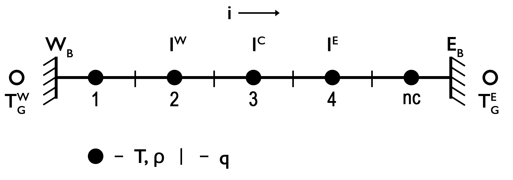

# Temperature Equation (1D)

In one dimension, the conductive component of the *temperature equation* is expressed as follows, assuming only radiogenic heat sources:

$\begin{equation}
\frac{\partial T}{\partial t} = -\frac{\partial q_x}{\partial x} + \rho H.
\end{equation}$ 

By incorporating Fourier’s law and allowing for spatially variable thermal properties, the equation becomes:

$\begin{equation}
\frac{\partial T}{\partial t} = \frac{\partial}{\partial x} k_x \frac{\partial T}{\partial x} + \rho H. 
\end{equation}$

Assuming constant thermal properties, Equation (2) simplifies to:

$\begin{equation}
\frac{\partial T}{\partial t} = \kappa \frac{\partial^2 T}{\partial x^2} + \frac{Q}{\rho c_p},
\end{equation}$
  
where $\kappa = k/\rho/c_p$ is the thermal diffusivity [m²/s], and $Q = \rho H$ is the volumetric heat production rate [W/m³].  

Equation (3) is classified as a *parabolic partial differential equation* (PDE), which can be solved numerically given appropriate initial and boundary conditions.

## Discretization and Numerical Schemes

To solve Equation (3) numerically, the spatial domain must be discretized, assigning physical parameters to their corresponding grid locations.

> **Note**: Although thermal conductivity is currently assumed to be constant, a *conservative gridding* approach is employed to ensure physical consistency. In this scheme, temperature $T$ is defined at **cell centers** (centroids), while heat flux $q$ is defined at **cell interfaces** (vertices).

**Figure 1. 1D Discretization.** Conservative finite difference grid used to solve the 1D conductive part of the temperature equation. Temperature is defined at centroids, while heat flux is defined at vertices. *Ghost nodes* are introduced to implement *Dirichlet* and *Neumann* boundary conditions.

The example script [Heat_1D_discretization.jl](https://github.com/GeoSci-FFM/GeoModBox.jl/blob/main/examples/DiffusionEquation/1D/Heat_1D_discretization.jl) demonstrates various numerical schemes for solving the conductive part of the temperature equation, including *explicit*, *implicit*, *Crank–Nicolson*, and *defect correction* methods. Below, we briefly describe these well-known schemes and highlight their respective strengths and limitations.

### Explicit Finite Difference Scheme (FTCS; Forward Euler)

A fundamental and intuitive approach to solving the 1D heat conduction equation is the **Forward in Time and Centered in Space (FTCS)** scheme, implemented in an **explicit** manner.

This method approximates the continuous PDE on a discrete grid and converges to the analytical solution as the spatial ($\Delta x$) and temporal ($\Delta t$) resolutions are refined. Its main advantages are **simplicity** and **computational efficiency**.

However, the FTCS scheme is **conditionally stable**. Its stability is governed by the *heat diffusion stability criterion*, which can be derived via *Von Neumann* analysis. This assesses how numerical perturbations grow or decay over time.

For a uniform grid, the stability condition is:

$\begin{equation}
\Delta t < \frac{\Delta{x^2}}{2 \kappa}.
\end{equation}$ 

Consequently, the maximum allowable time step is constrained by the spatial resolution.

Discretizing Equation (3) with the FTCS scheme gives:

$\begin{equation}
\frac{T_{i}^{n+1} - T_{i}^{n} }{\Delta t} = \kappa \frac{T_{i-1}^{n} - 2T_{i}^{n} + T_{i+1}^{n}}{\Delta{x^2}} + \frac{Q_{i}^n}{\rho c_p},
\end{equation}$ 

where 
$i$ is the spatial grid index,
$n$ is the time step index,
$\Delta x$ is the grid spacing,
$\Delta t$ is the time step, and
$Q_i^n$ is the heat production rate at node $i$ and time $n$.

Solving for $T_i^{n+1}$:

$\begin{equation}
T_{i}^{n+1} = T_{i}^{n} + a \left(T_{i-1}^{n} - 2T_{i}^{n} + T_{i+1}^{n} \right) + \frac{Q_{i}^n \Delta t}{\rho c_p}, 
\end{equation}$

where $a = \frac{\kappa \Delta t}{\Delta x^2}$.

Equation (6) is solved for all interior nodes at each time step, assuming initial and boundary conditions are specified.

For implementation details, see the [source code](https://github.com/GeoSci-FFM/GeoModBox.jl/blob/main/src/HeatEquation/1Dsolvers.jl).

### Boundary Conditions 

Boundary conditions are implemented using ghost nodes. Here, we consider the two most common thermal boundary conditions: Dirichlet and Neumann.

**Dirichlet Boundary Condition**

The Dirichlet condition specifies a fixed temperature at the boundary. The temperature at the left (West) and right (East) ghost nodes is given by:

$\begin{equation}
T_{G,W} = 2T_{BC,W} - T_{1},
\end{equation}$

$\begin{equation}
T_{G,E} = 2T_{BC,E} - T_{nc},
\end{equation}$

where 
$T_{BC,W}$ and $T_{BC,E}$ are the prescribed boundary temperatures,
$T_1$ and $T_{nc}$ are the temperatures at the first and last interior centroids,
$T_{G,W}$ and $T_{G,E}$ are the ghost node temperatures on the west and east boundaries, and
$nc$ is the number of centroids.

**Neumann Boundary Condition**

The Neumann condition specifies a fixed gradient (e.g., a heat flux or temperature gradient) at the boundary. The ghost node temperatures are defined as:

$\begin{equation}
T_{G,W} = T_{1} - c_{W} \Delta{x},
\end{equation}$

$\begin{equation}
T_{G,E} = T_{nc} + c_{E} \Delta{x},
\end{equation}$

with:  

$\begin{equation}
\left. c_{W} = \frac{\partial{T}}{\partial{x}} \right\vert_{W},\ \textrm{and}\ \left. c_{E} = \frac{\partial{T}}{\partial{x}} \right\vert_{E}, 
\end{equation}$

where $c_W$ and $c_E$ are the prescribed temperature gradients on the west and east boundaries, respectively.

These ghost node definitions are substituted into the numerical scheme to consistently enforce the boundary conditions at each time step.

### Implicit Scheme (Backward Euler)

The fully implicit finite difference scheme, also known as the **Backward Euler** method, is **unconditionally stable**, allowing time steps larger than those permitted by the diffusion stability criterion.

In 1D, the temperature equation becomes:

$\begin{equation}
\frac{T_{i}^{n+1}-T_{i}^n}{\Delta t} = \kappa \frac{T_{i-1}^{n+1}-2T_{i}^{n+1}+T_{i+1}^{n+1}}{\Delta{x^2}} + \frac{Q_{i}^n}{\rho c_p},
\end{equation}$

where 
$i$ is the spatial index,
$n$ and $n+1$ are the current and next time steps,
$\Delta t$ is the time step, and
$\Delta x$ is the spatial grid spacing. 

Rearranging into known (right-hand side) and unknown (left-hand side) terms yields a linear system:

$\begin{equation}
-a T_{i-1}^{n+1} + \left(2a + b \right) T_{i}^{n+1} - a T_{i+1}^{n+1} = b T_{i}^n + \frac{Q_{i}^n}{\rho c_p},
\end{equation}$

with 
$a = \dfrac{\kappa}{\Delta x^2}$ and
$b = \dfrac{1}{\Delta t}$.

This equation results in a tridiagonal system of the form:

$\begin{equation}
\mathbf{A} \cdot \overrightharpoon{x} = \overrightharpoon{\text{rhs}}
\end{equation}$

where $\mathbf{A}$ is the coefficient matrix (with three non-zero diagonals), $\overrightharpoon{x}$ is the unknown temperature vector at time $n+1$, and $\overrightharpoon{\text{rhs}}$ is the known right-hand side.

The coefficients are arranged to match the matrix structure used in the *defect correction* method, preserving modularity.

> **Note**: While the implicit method is unconditionally stable, very large time steps may still yield inaccurate results, particularly for resolving small-scale thermal gradients.

### Boundary Conditions

The temperature at ghost nodes is defined as before (see Equations (7)-(10)). However, to maintain symmetry in the coefficient matrix and ensure consistent discretization near boundaries, both the **matrix coefficients** and the **right-hand side** must be modified for the nodes adjacent to the boundaries.

**Dirichlet Boundary Condition**

**West boundary**

$\begin{equation}
\left(3 a + b\right) T_{1}^{n+1} - a T_{2}^{n+1} = b T_{1}^{n} + 2 a T_{BC,W},
\end{equation}$

**East boundary**

$\begin{equation}
-a T_{nc-1}^{n+1} + \left(3 a + b\right) T_{nc}^{n+1}  = b T_{nc}^{n} + 2 a T_{BC,E}, 
\end{equation}$

**Neumann Boundary Condition**

**West boundary**

$\begin{equation}
\left(a + b\right) T_{1}^{n+1} - a T_{2}^{n+1} = b T_{1}^{n} - a c_{W} \Delta{x},
\end{equation}$

**East boundary**

$\begin{equation}
-a T_{nc-1}^{n+1} + \left(a + b\right) T_{nc}^{n+1}  = b T_{nc}^{n} + a c_{E} \Delta{x}, 
\end{equation}$

where 
$T_{BC,W}$, $T_{BC,E}$ are the prescribed boundary temperatures,
$c_W$, $c_E$ are the prescribed temperature gradients at the west and east boundaries, and
$nc$ is the number of centroids.

These adjustments ensure that the boundary conditions are enforced consistently while preserving the symmetry and stability of the implicit solver.

### Defect Correction Method

The **defect correction method** is an iterative scheme that progressively reduces the residual of the conductive part of the temperature equation using a correction term. If the system is linear, one iteration is sufficient to obtain the exact solution.

### Theory

The conductive part of the temperature equation, in implicit form, can be written as:

$\begin{equation}
\mathbf{K} \cdot T - b = R, 
\end{equation}$

where 
$\mathbf{K}$ is the coefficient matrix,
$T$ is the temperature at the new time step,
$b$ is a known term that includes contributions from the previous time step and internal heat sources, and
$R$ is the residual (or defect).

Given an initial temperature guess $T_i$, the residual is:

$\begin{equation}
R_i = \mathbf{K} \cdot T_i - b.
\end{equation}$

To reduce the residual, we define a correction $\delta T$ such that:

$\begin{equation}
0 = \mathbf{K} \left(T_i + \delta{T} \right) - b = \mathbf{K} T_i - b + \mathbf{K} \delta{T} = R_i + \mathbf{K} \delta{T}.
\end{equation}$

Rearranging gives: 

$\begin{equation}
R_i = -\mathbf{K} \delta{T}, 
\end{equation}$

and hence: 

$\begin{equation}
\delta{T} = -\mathbf{K}^{-1} R_i. 
\end{equation}$

Thus, the updated solution becomes: 

$\begin{equation}
T_{i+1} = T_i + \delta T.
\end{equation}$

In the linear case, this yields the exact solution in a single step. For nonlinear problems, the process is repeated iteratively until the residual is sufficiently small.

#### Coefficient Matrix

The matrix $\mathbf{K}$ can be derived from the discretized form of the temperature equation:

$\begin{equation}
\frac{\partial{T}}{\partial{t}} - \kappa \frac{\partial^2{T}}{\partial{x}^2} = R, 
\end{equation}$

which discretizes to: 

$\begin{equation}
\frac{T_i^{n+1}-T_i^{n}}{\Delta{t}} - \kappa \frac{T_{i-1}^{n+1} - 2 T_{i}^{n+1} + T_{i+1}^{n+1}}{\Delta{x}^2} = R,
\end{equation}$

or equivalently:

$\begin{equation}
-a T_{i-1}^{n+1} + \left(2 a + b \right) T_{i}^{n+1} - a T_{i+1}^{n+1} - b T_{i}^{n} = R, 
\end{equation}$

where:

$\begin{equation}
a = \frac{\kappa}{\Delta{x}^2},\ \textrm{and} \ b = \frac{1}{\Delta{t}}. 
\end{equation}$

This structure defines the coefficients in $\mathbf{K}$.

### Boundary Conditions

As in the implicit FTCS method, the coefficients in $\mathbf{K}$ must be adjusted for centroids adjacent to the boundaries (see Equations (14)–(17)). However, **the right-hand side vector $b$ remains unchanged** during these modifications.

This makes the defect correction method efficient and modular, especially when reusing the same matrix structure across iterations or solver variants.

### Crank-Nicolson approach (CNA)

The fully implicit FTCS method is unconditionally stable but only first-order accurate in time. To improve temporal accuracy while retaining stability, the **Crank-Nicolson scheme** can be used. This method employs a time-centered (implicit) discretization and is second-order accurate in time.

In one dimension, the Crank-Nicolson discretization of the conductive part of the temperature equation (Equation (3)) becomes:

$\begin{equation}
\frac{T_{i}^{n+1} - T_{i}^{n}}{\Delta t} = \frac{\kappa}{2}\frac{(T_{i-1}^{n+1}-2T_{i}^{n+1}+T_{i+1}^{n+1})+(T_{i-1}^{n}-2T_{i}^{n}+T_{i+1}^{n})}{\Delta{x^2}}. 
\end{equation}$

Rearranging into known and unknown terms yields a linear system of the form:

$\begin{equation}
-aT_{i-1}^{n+1} + \left(b+2a\right)T_{i}^{n+1} - a T_{i+1}^{n+1} = aT_{i-1}^{n} + \left(b-2a\right)T_{i}^{n} + a T_{i+1}^{n},
\end{equation}$

where:

$a = \frac{\kappa}{2\Delta{x^2}} \textrm{and} b = \frac{1}{\Delta{t}}$. 

### Boundary Conditions

To obtain a symmetric coefficient matrix, both the matrix and the right-hand side vector must be modified at the boundaries. The equations for centroids adjacent to the boundaries are:

**Dirichlet Boundary Conditions**

**West boundary**

$\begin{equation}
\left(b + 3 a \right) T_{1}^{n+1} - a T_{2}^{n+1} = \left( b - 3 a \right) T_{1}^{n} + a T_{2}^{n} + 4 a T_{BC,W}
\end{equation}$

**East boundary**

$\begin{equation}
-a T_{nc-1}^{n+1} + \left(b + 3 a \right) T_{nc}^{n+1} = a T_{nc-1}^{n} + \left( b - 3 a \right) T_{nc}^{n} + 4 a T_{BC,E}
\end{equation}$

**Neumann Boundary Conditions**

**West boundary**

$\begin{equation}
\left(b+a\right)T_{1}^{n+1} - a T_{2}^{n+1} = \left(b-a\right)T_{1}^{n} + a T_{2} - 2ac_{W} \Delta{x}
\end{equation}$

**East boundary**

$\begin{equation}
-a T_{nc-1}^{n+1} + \left(b+a\right)T_{nc}^{n+1}  = a T_{nc-1}^{n} + \left(b-a\right)T_{nc}^{n} + 2ac_{E} \Delta{x}
\end{equation}$

The resulting coefficient matrix remains tridiagonal, preserving computational efficiency. However, memory requirements increase with finer spatial resolution due to the larger size of the linear system, making this method more memory-intensive.

For implementation details, refer to the [source code](https://github.com/GeoSci-FFM/GeoModBox.jl/blob/main/src/HeatEquation/1Dsolvers.jl).

---

### Temperature Field Management

For the **explicit solver** and the **defect correction method**, the full temperature field—including ghost nodes—is used to evaluate the temperature equation. The old temperature field is assigned to the centroids of the extended grid to compute the new temperature.

For the **implicit methods** (Backward Euler, Crank-Nicolson), the current temperature at the centroids is assigned to the right-hand side vector. The coefficient matrix is then assembled, and the new temperature is computed by solving the resulting linear system.

### Summary

While the **explicit FTCS scheme** is simple and efficient for small time steps, **implicit methods** like Backward Euler and Crank-Nicolson are preferred for their unconditional stability. The Crank-Nicolson scheme further improves accuracy with its second-order time discretization. The **defect correction method** provides a flexible framework for both linear and nonlinear problems, allowing for iterative refinement when needed.

---

## Variable Thermal Parameters 

To solve the conductive component of the 1D temperature equation with **spatially variable thermal properties**, a conservative finite difference scheme is employed. In this formulation, temperature is defined at centroids, while heat flux and thermal conductivity are defined at vertices (see Figure 1).

The governing equation is:

$\begin{equation}
\rho c_{p} \frac{\partial{T}}{\partial{t}} = \frac{\partial{}}{\partial{y}}\left(k \frac{\partial{T}}{\partial{y}}\right) + \rho H,
\end{equation}$ 

where
$\rho$ is the density [kg/m³],
$c_p$ is the specific heat capacity [J/kg/K],
$T$ is the temperature [K],
$t$ is the time [s],
$k$ is the thermal conductivity [W/m/K], 
$H$ is the internal heat generation rate per unit mass [W/kg], and
$y$ is the vertical coordinate (depth) [m]

### Discretization

In a conservative scheme, the vertical conductive heat flux $q_y$ is defined on vertices, as:

$\begin{equation}
\left. q_{y,m} = -k_m \frac{\partial T}{\partial y}\right\vert_{m},\ \textrm{for}\ m = 1:nv, 
\end{equation}$

where $n_v$ is the number of *vertices*.

### Explicit Finite Difference Formulation

Using the above discretization, the time evolution of temperature at each centroid is computed from:

$\begin{equation}
\rho_j c_{p,j} \frac{T_{j}^{n+1} - T_{j}^{n}}{\Delta{t}} = -\frac{q_{y,j+1}^{n} - q_{y,j}^{n} }{\Delta{y}} + \rho_j H_j,\ \textrm{for}\ j = 1:nc, 
\end{equation}$

where 
$T$ is evaluated at centroids,
$q_y$ and $k$ are evaluated at vertices,
$\Delta t$ is the time step, and
$\Delta y$ is the spatial grid resolution.

Substituting the expression for $q_y$ gives:

$\begin{equation}
\rho_j c_{p,j} \frac{T_{j}^{n+1} - T_{j}^{n}}{\Delta{t}} = \frac{ k_{j+1} \frac{T_{j+1}^{n} - T_{j}^{n}}{\Delta{y}} - k_{j} \frac{T_{j}^{n} - T_{j-1}^{n}}{\Delta{y}} }{\Delta{y}} + \rho_j H_j.
\end{equation}$

Rewriting this into an explicit update formula for $T_j^{n+1}$:

$\begin{equation}
T_{j}^{n+1} = ak_{j}T_{j-1}^{n} + \left(1-a\left(k_{j+1}+k_{j}\right)\right)T_{j}^{n} + ak_{j+1}T_{j+1}^{n} + \frac{H_j\Delta{t}}{c_{p,j}},
\end{equation}$

where:

$\begin{equation}
a = \frac{\Delta{t}}{\Delta{y^2} \rho c_{p_{j}}}.
\end{equation}$

### Boundary Conditions

For centroids adjacent to the boundaries, ghost nodes are used to evaluate the temperature gradient consistently with the chosen thermal boundary condition (Dirichlet or Neumann). These ghost node values are computed according to equations (7)–(10).

---

For implementation details, refer to the [source code](https://github.com/GeoSci-FFM/GeoModBox.jl/blob/main/src/HeatEquation/1Dsolvers.jl).