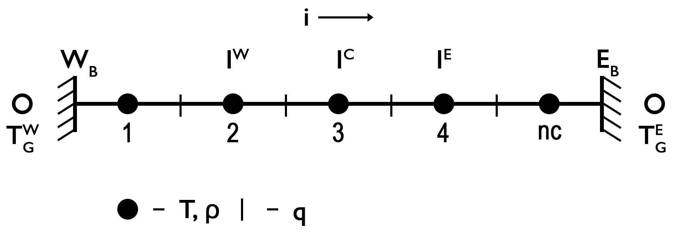

# Heat Diffusion Equation (1D)

In one spatial dimension, the diffusive component of the *temperature conservation equation* (assuming radiogenic heat production only) is given by:

$\begin{equation}
\rho c_p\frac{\partial T}{\partial t} = -\frac{\partial q_x}{\partial x} + Q,
\end{equation}$ 

where $\rho$ is the density [kg/m³], $c_p$ is the specific heat capacity [J/kg/K], $T$ is the temperature [K], $t$ is time [s], $q_x$ is the conductive heat flux in the $x$-direction [W/m²], and $Q$ is the volumetric heat production rate [W/m³], related to the mass-specific heat production $H$ via $Q = \rho H$. By incorporating Fourier’s law and allowing for spatially variable thermal properties, the equation becomes:

$\begin{equation}
\rho c_p\frac{\partial T}{\partial t} = \frac{\partial}{\partial x} \left( k_x \frac{\partial T}{\partial x} \right) + Q, 
\end{equation}$

where $k_x$ is the thermal conductivity [W/m/K] in the $x$-direction. If thermal properties are assumed constant, Equation (2) simplifies to:

$\begin{equation}
\frac{\partial T}{\partial t} = \kappa \frac{\partial^2 T}{\partial x^2} + \frac{Q}{\rho_0 c_p},
\end{equation}$
  
where $\kappa = k/\rho_0/c_p$ is the thermal diffusivity [m²/s] and $\rho_0$ is a reference density [kg/m³].  

Equation (3) is a *parabolic partial differential equation* (PDE) that can be solved numerically given appropriate initial and boundary conditions.

# Discretization and Numerical Schemes

To solve Equation (3) numerically, the spatial domain is discretized and physical parameters are assigned to the corresponding grid locations.

> **Note:** Although thermal conductivity is currently assumed to be constant, a *conservative, staggered-grid* approach is employed to ensure physical consistency. In this scheme, temperature $T$ is defined at cell centers (centroids), while the heat flux $q$ is defined at cell interfaces (vertices).

**Figure 1. 1D Discretization.** Staggered finite difference grid for solving the 1D heat diffusion equation. Temperature is defined at centroids, while heat flux is defined at vertices. *Ghost nodes* are introduced to implement *Dirichlet* and *Neumann* boundary conditions.

To evaluate the equation at each centroid using a finite difference (FD) discretization, temperature values at adjacent points must be included. For the 1D heat diffusion equation, a three-point stencil is used, consisting of the central point (reference centroid) and the points to the West and East. 

The indices of these points define the coefficient locations in the coefficient matrix for each equation in the system. The global indexing of the central reference point $I$ follows the convention introduced in the [general solution section](./GESolution.md). For a three-point stencil, the indices are:

$\begin{equation}\begin{split}
I^\textrm{W} & = I^\textrm{C} - 1,\\\   
I^\textrm{C} & = I, \\\
I^\textrm{E} & = I^\textrm{C} + 1,
\end{split}\end{equation}$

where $I$ is the equation number (corresponding to the local index $i$ and the central stencil position $C$), and $I^\textrm{W}$ and $I^\textrm{E}$ denote the points West and East of the central point, respectively. These indices are used in the discretized FD equations below.

A detailed implementation of various numerical schemes for solving a linear problem is provided in the example script [Heat_1D_discretization.jl](./examples/GaussianDiffusion1D.md). This example demonstrates several discretization methods for solving the 1D heat diffusion equation using the special-case formulation for linear problems (i.e., a single left-matrix division):

- Explicit scheme
- Implicit scheme
- Crank–Nicolson approach

The numerical results are compared with the analytical solution of a Gaussian temperature distribution to assess accuracy and performance. Additional scripts demonstrate how to solve the 1D heat diffusion equation using the general, combined formulation for non-linear problems with defect correction. These scripts end with `*_dc.jl`. Below, the schemes are briefly described and their main strengths and limitations are highlighted.

## Temperature Field Management

Within `GeoModBox.jl`, a distinction is made between the centroid field and the extended field, which includes ghost nodes.

The extended field is used for the linear explicit (forward Euler) scheme and for residual evaluation in the non-linear solution using defect correction. For these solvers, ghost node temperatures are computed internally from the prescribed boundary conditions, and the extended field is used to evaluate the discrete operators.

For solvers that involve a coefficient matrix (e.g., linear implicit schemes and non-linear solutions for constant and variable thermal properties), only the centroid values enter the system. Consequently, the size of the coefficient matrix is determined by the number of centroids. After solving the PDE, these solvers update the centroid temperatures in the extended field accordingly.

## Boundary Conditions 

Boundary conditions are imposed using ghost nodes located at $\frac{\Delta x}{2}$ outside the domain boundaries. Within `GeoModBox.jl`, the two most common thermal boundary conditions are currently supported: Dirichlet and Neumann.

**Dirichlet Boundary Condition**

The Dirichlet condition prescribes a fixed boundary temperature. The temperatures at the left (West) and right (East) ghost nodes, $T_{\textrm{G}}^W$ and $T_{\textrm{G}}^E$, are:

$\begin{equation}
T_{\textrm{G}}^W = 2T_{\textrm{BC}}^W - T_{1},
\end{equation}$

$\begin{equation}
T_{\textrm{G}}^E = 2T_{\textrm{BC}}^E - T_{\textrm{nc}},
\end{equation}$

where $T_{\textrm{BC}}^W$ and $T_{\textrm{BC}}^E$ are the prescribed boundary temperatures, $T_1$ and $T_{\textrm{nc}}$ are the temperatures at the first and last centroids, and $\textrm{nc}$ is the number of centroids.

**Neumann Boundary Condition**

The Neumann condition prescribes a fixed temperature gradient (or, equivalently, a heat flux when combined with Fourier’s law). The ghost node temperatures are defined as:

$\begin{equation}
T_{\textrm{G}}^W = T_{1} - c^{W} \Delta{x},
\end{equation}$

$\begin{equation}
T_{\textrm{G}}^E = T_{\textrm{nc}} + c^{E} \Delta{x},
\end{equation}$

with  

$\begin{equation}
\left. c^{W} = \frac{\partial{T}}{\partial{x}} \right\vert_{W},\ \textrm{and}\ \left. c^{E} = \frac{\partial{T}}{\partial{x}} \right\vert_{E}, 
\end{equation}$

where $c^W$ and $c^E$ are the prescribed temperature gradients at the West and East boundaries, respectively. These ghost node values can be substituted into the discretized heat diffusion equation for the centroids adjacent to the boundaries. Using ghost nodes enforces the boundary conditions at each time step and preserves the second-order treatment of the spatial stencil (e.g. Duretz et al., 2011).

## Explicit Finite Difference Scheme (FTCS; Forward Euler)

A fundamental and intuitive approach for solving the 1D heat diffusion equation is the FTCS scheme, implemented explicitly. This method approximates the continuous PDE on a discrete grid and converges to the analytical solution as the spatial ($\Delta x$) and temporal ($\Delta t$) resolutions are refined. Its main advantages are simplicity and computational efficiency; however, the FTCS scheme is conditionally stable. Stability is governed by the *heat diffusion stability criterion*, which can be derived via *Von Neumann* analysis. For a uniform one-dimensional grid, the condition is:

$\begin{equation}
\Delta t < \frac{\Delta{x^2}}{2 \kappa}.
\end{equation}$ 

Consequently, the maximum allowable time step is constrained by the spatial resolution. Here, the FTCS scheme combines a three-point stencil in space with a two-point stencil in time. Discretizing Equation (3) gives:

$\begin{equation}
\frac{T_{I^\textrm{C}}^{n+1} - T_{I^\textrm{C}}^{n} }{\Delta t} = \kappa \frac{T_{I^\textrm{W}}^{n} - 2T_{I^\textrm{C}}^{n} + T_{I^\textrm{E}}^{n}}{\Delta{x^2}} + \frac{Q_{I^\textrm{C}}^n}{\rho_0 c_p},
\end{equation}$ 

where $I^\textrm{C}$ is the central reference centroid, $n$ is the time step index, $\Delta x$ is the grid spacing, and $\Delta t$ is the time step.

Solving for $T_{I^\textrm{C}}^{n+1}$ yields:

$\begin{equation}
T_{I^\textrm{C}}^{n+1} = T_{I^\textrm{C}}^{n} + a \left(T_{I^\textrm{W}}^{n} - 2T_{I^\textrm{C}}^{n} + T_{I^\textrm{E}}^{n} \right) + \frac{Q_{I^\textrm{C}}^n \Delta t}{\rho_0 c_p}, 
\end{equation}$

where

$\begin{equation} 
a = \frac{\kappa \Delta t}{\Delta x^2}.
\end{equation}$

Equation (12) is evaluated for all centroids at each time step, given initial and boundary conditions. Boundary conditions are applied by substituting ghost node values (Equations (5)–(8)) into the discrete equations for centroids adjacent to the boundaries. For implementation details, see the [source code](https://github.com/GeoSci-FFM/GeoModBox.jl/blob/main/src/HeatEquation/1Dsolvers.jl).

## Implicit Scheme (Backward Euler)

The fully implicit finite difference scheme (Backward Euler) is unconditionally stable, allowing time steps larger than those permitted by the diffusion stability criterion.

In 1D and based on a three-point stencil, the discretized heat diffusion equation becomes:

$\begin{equation}
\frac{T_{I^\textrm{C}}^{n+1}-T_{I^\textrm{C}}^n}{\Delta t} = \kappa \frac{T_{I^\textrm{W}}^{n+1}-2T_{I^\textrm{C}}^{n+1}+T_{I^\textrm{E}}^{n+1}}{\Delta{x^2}} + \frac{Q_{I^\textrm{C}}^n}{\rho_0 c_p}.
\end{equation}$

Rearranging into known (right-hand side) and unknown (left-hand side) terms yields a system of equations over all centroids:

$\begin{equation}
-a T_{I^\textrm{W}}^{n+1} + \left(2a + b \right) T_{I^\textrm{C}}^{n+1} - a T_{I^\textrm{E}}^{n+1} = b T_{I^\textrm{C}}^n + \frac{Q_{I^\textrm{C}}^n}{\rho_0 c_p},
\end{equation}$

with 

$\begin{equation}\begin{split}
a & = \dfrac{\kappa}{\Delta x^2}, \\
b & = \dfrac{1}{\Delta t}.
\end{split}\end{equation}$

These equations form a tridiagonal system:

$\begin{equation}
\mathbf{K} \cdot \bm{x} = \bm{b}
\end{equation}$

where $\mathbf{K}$ is the coefficient matrix (three non-zero diagonals), $\bm{x}$ is the unknown temperature vector at time step $n+1$, and $\bm{b}$ is the known right-hand side.

### General Solution

A general approach for solving this system is defect correction. The heat diffusion equation is reformulated by introducing a residual term $\bm{r}$, which quantifies the deviation from the exact solution and can be reduced iteratively through successive correction steps. In implicit form, Equation (17) can be rewritten as:

$\begin{equation}
\mathbf{K} \cdot \bm{x} - \bm{b} = \bm{r}, 
\end{equation}$

where $\bm{r}$ is the residual (or defect). The matrix coefficients are identical to those in Equation (16), but can also be obtained from the Jacobian of $\bm{r}$:

$\begin{equation}
{K_{ij}}=\frac{\partial{{r}_i}}{\partial{{x}_j}}.
\end{equation}$

The method proceeds by assuming an initial temperature guess $\bm{T}^k$, computing the residual $\bm{r}^k$, and applying a correction $\delta \bm{T}$. For non-linear problems, this process is repeated until the residual is sufficiently small; for linear problems, a single iteration yields the exact solution.

Given $\bm{T}^k$, the residual is:

$\begin{equation}
\bm{r}^k = \mathbf{K} \cdot \bm{T}^k - \bm{b}.
\end{equation}$

A correction term $\delta \bm{T}$ is defined such that:

$\begin{equation}
0 = \bm{K} \left(\bm{T}^k + \delta \bm{T} \right) - \bm{b} = \bm{K} \bm{T}^k - \bm{b} + \bm{K} \delta \bm{T} = \bm{r}^k + \bm{K} \delta \bm{T}.
\end{equation}$

Rearranging gives:

$\begin{equation}
\bm{r}^k = -\mathbf{K} \delta \bm{T}, 
\end{equation}$

and hence:

$\begin{equation}
\delta \bm{T} = -\mathbf{K}^{-1} \bm{r}^k. 
\end{equation}$

The updated solution is then:

$\begin{equation}
\bm{T}^{k+1} = \bm{T}^k + \delta \bm{T},
\end{equation}$

where $\bm{T}^{k+1}$ denotes the temperature after one iteration step.

Within `GeoModBox.jl`, the residual $\bm{r}$ is evaluated at the centroids using the extended temperature field (including ghost nodes) from the current time step as an initial guess:

$\begin{equation}
\frac{\partial{T_{\textrm{ext,I}}}}{\partial{t}} - \kappa \frac{\partial^2{T_{\textrm{ext,I}}}}{\partial{x^2}} - \frac{Q_I}{\rho_0 c_p} = r_{I},  
\end{equation}$

and, in discretized implicit finite-difference form:

$\begin{equation}
\frac{T_{\textrm{ext},I^\textrm{C}}^{n+1} - T_{\textrm{ext},I^\textrm{C}}^{n}}{\Delta{t}} - \kappa \frac{T_{\textrm{ext},I^\textrm{W}}^{n+1} - 2 T_{\textrm{ext},I^\textrm{C}}^{n+1} + T_{\textrm{ext},I^\textrm{E}}^{n+1}}{\Delta{x^2}} - \frac{Q_{I^\textrm{C}}^n}{\rho_0 c_p}= r_{I}, 
\end{equation}$

where $I^\textrm{C}=2:(nc+1)$ denotes centroid indices in the extended field and $I=1:nc$ is the equation number. Rewriting Equation (26) and substituting the coefficients from Equation (16) yields:

$\begin{equation}
-aT_{\textrm{ext},I^\textrm{W}}^{n+1}
+\left(2a+b\right)T_{\textrm{ext},I^\textrm{C}}^{n+1}
-aT_{\textrm{ext},I^\textrm{E}}^{n+1}
-bT_{\textrm{ext},I^\textrm{C}}^n
-\frac{Q_{I^\textrm{C}}^n}{\rho_0 c_p}=r_{I},
\end{equation}$

which corresponds to the matrix form of Equation (18), where $T_{\textrm{ext},I^\textrm{C}}^{n+1}$ is the unknown vector $x$, $-bT_{\textrm{ext},I^\textrm{C}}^n -\frac{Q_{I^\textrm{C}}^n}{\rho_0 c_p}$ is the known vector $b$, and $-a$ and $2a+b$ are the coefficients of the non-zero diagonals of the coefficient matrix. With $\bm{r}$ and $\bm{K}$, the correction term can be computed via Equation (23).

### Boundary Condition 

Boundary conditions are applied using ghost node temperatures (Equations (5)-(8)). To maintain symmetry in the coefficient matrix, the matrix coefficients must be modified for centroids adjacent to the boundaries. This is achieved by substituting the ghost node relations into the discrete equations at the boundary-adjacent centroids. The resulting equations are:

**Dirichlet Boundary Condition**

**West Boundary**

$\begin{equation}
-aT_{\textrm{G}}^W
+\left(2a+b\right)T_{\textrm{ext},I^\textrm{C}}^{n+1}
-aT_{\textrm{ext},I^\textrm{E}}^{n+1}
-bT_{\textrm{ext},I^\textrm{C}}^n
-\frac{Q_{I^\textrm{C}}^n}{\rho_0 c_p}=r_{I},
\end{equation}$

$\begin{equation}
-a\left(2T_{\textrm{BC}}^W-T_{\textrm{ext},I^\textrm{C}}^{n+1}\right)
+\left(2a+b\right)T_{\textrm{ext},I^\textrm{C}}^{n+1}
-aT_{\textrm{ext},I^\textrm{E}}^{n+1}
-bT_{\textrm{ext},I^\textrm{C}}^n
-\frac{Q_{I^\textrm{C}}^n}{\rho_0 c_p}=r_{I},
\end{equation}$

$\begin{equation}
\left(3a+b\right)T_{\textrm{ext},I^\textrm{C}}^{n+1}
-aT_{\textrm{ext},I^\textrm{E}}^{n+1}
-bT_{\textrm{ext},I^\textrm{C}}^n
-2aT_{\textrm{BC}}^W
-\frac{Q_{I^\textrm{C}}^n}{\rho_0 c_p}=r_{I},
\end{equation}$

**East Boundary**

$\begin{equation}
-aT_{\textrm{ext},I^\textrm{W}}^{n+1}
+\left(2a+b\right)T_{\textrm{ext},I^\textrm{C}}^{n+1}
-aT_{\textrm{G}}^E
-bT_{\textrm{ext},I^\textrm{C}}^n
-\frac{Q_{I^\textrm{C}}^n}{\rho_0 c_p}=r_{I},
\end{equation}$

$\begin{equation}
-aT_{\textrm{ext},I^\textrm{W}}^{n+1}
+\left(2a+b\right)T_{\textrm{ext},I^\textrm{C}}^{n+1}
-a\left(2T_{\textrm{BC}}^E-T_{\textrm{ext},I^\textrm{C}}^{n+1}\right)
-bT_{\textrm{ext},I^\textrm{C}}^n
-\frac{Q_{I^\textrm{C}}^n}{\rho_0 c_p}=r_{I},
\end{equation}$

$\begin{equation}
-aT_{\textrm{ext},I^\textrm{W}}^{n+1}
+\left(3a+b\right)T_{\textrm{ext},I^\textrm{C}}^{n+1}
-bT_{\textrm{ext},I^\textrm{C}}^n
-2aT_{\textrm{BC}}^E
-\frac{Q_{I^\textrm{C}}^n}{\rho_0 c_p}=r_{I},
\end{equation}$

**Neumann Boundary Conditions**

**West Boundary**

$\begin{equation}
-aT_{\textrm{G}}^W
+\left(2a+b\right)T_{\textrm{ext},I^\textrm{C}}^{n+1}
-aT_{\textrm{ext},I^\textrm{E}}^{n+1}
-bT_{\textrm{ext},I^\textrm{C}}^n
-\frac{Q_{I^\textrm{C}}^n}{\rho_0 c_p}=r_{I}, 
\end{equation}$

$\begin{equation}
-a\left(T_{\textrm{ext},I^\textrm{C}}^{n+1} - c^{W} \Delta{x}\right)
+\left(2a+b\right)T_{\textrm{ext},I^\textrm{C}}^{n+1}
-aT_{\textrm{ext},I^\textrm{E}}^{n+1}
-bT_{\textrm{ext},I^\textrm{C}}^n
-\frac{Q_{I^\textrm{C}}^n}{\rho_0 c_p}=r_{I}, 
\end{equation}$

$\begin{equation}
+\left(a+b\right)T_{\textrm{ext},I^\textrm{C}}^{n+1}
-aT_{\textrm{ext},I^\textrm{E}}^{n+1}
-bT_{\textrm{ext},I^\textrm{C}}^n
+a c^{W} \Delta{x}
-\frac{Q_{I^\textrm{C}}^n}{\rho_0 c_p}=r_{I}, 
\end{equation}$

**East Boundary**

$\begin{equation}
-aT_{\textrm{ext},I^\textrm{W}}^{n+1}
+\left(2a+b\right)T_{\textrm{ext},I^\textrm{C}}^{n+1}
-aT_{\textrm{G}}^E
-bT_{\textrm{ext},I^\textrm{C}}^n
-\frac{Q_{I^\textrm{C}}^n}{\rho_0 c_p}=r_{I},
\end{equation}$

$\begin{equation}
-aT_{\textrm{ext},I^\textrm{W}}^{n+1}
+\left(2a+b\right)T_{\textrm{ext},I^\textrm{C}}^{n+1}
-a\left(T_{\textrm{ext},I^\textrm{C}}^{n+1} + c^{E} \Delta{x}\right)
-bT_{\textrm{ext},I^\textrm{C}}^n
-\frac{Q_{I^\textrm{C}}^n}{\rho_0 c_p}=r_{I},
\end{equation}$

$\begin{equation}
-aT_{\textrm{ext},I^\textrm{W}}^{n+1}
+\left(a+b\right)T_{\textrm{ext},I^\textrm{C}}^{n+1}
-bT_{\textrm{ext},I^\textrm{C}}^n
-ac^{E} \Delta{x}
-\frac{Q_{I^\textrm{C}}^n}{\rho_0 c_p}=r_{I},
\end{equation}$

where $T_{\textrm{BC}}^W$ and $T_{\textrm{BC}}^E$ are the prescribed boundary temperatures and $c^W$ and $c^E$ are the prescribed temperature gradients at the West and East boundaries, respectively. These adjustments ensure that boundary conditions are enforced consistently while preserving the symmetry of the implicit solver.

### Special Case - A Linear Problem 

If the problem is linear and the exact solution is reached within a single iteration, the system reduces to Equation (17). The temperatures can then be obtained directly via a *left matrix division*:

$\begin{equation}
\bf{x} = \mathbf{K}^{-1} \bm{b}. 
\end{equation}$

The coefficient matrix remains unchanged for the given boundary conditions; however, the right-hand side must be updated accordingly (setting $\bm{r}=0$ and incorporating known boundary contributions). The resulting boundary-adjacent equations are:

**Dirichlet Boundary Condition**

**West boundary**

$\begin{equation}
\left(3 a + b\right) T_{I^\textrm{C}}^{n+1} - a T_{I^\textrm{E}}^{n+1} = b T_{I^\textrm{C}}^{n} + 2 a T_{\textrm{BC}}^W,
\end{equation}$

**East boundary**

$\begin{equation}
-a T_{I^\textrm{W}}^{n+1} + \left(3 a + b\right) T_{I^\textrm{C}}^{n+1}  = b T_{I^\textrm{C}}^{n} + 2 a T_{\textrm{BC}}^E, 
\end{equation}$

**Neumann Boundary Condition**

**West boundary**

$\begin{equation}
\left(a + b\right) T_{I^\textrm{C}}^{n+1} - a T_{I^\textrm{E}}^{n+1} = b T_{I^\textrm{C}}^{n} - a c^{W} \Delta{x},
\end{equation}$

**East boundary**

$\begin{equation}
-a T_{I^\textrm{W}}^{n+1} + \left(a + b\right) T_{I^\textrm{C}}^{n+1}  = b T_{I^\textrm{C}}^{n} + a c^{E} \Delta{x}. 
\end{equation}$

## Crank-Nicolson approach (CNA)

The Backward Euler scheme is unconditionally stable but only first-order accurate in time. To improve temporal accuracy while retaining stability, the Crank–Nicolson scheme can be used. This method employs a time-centered discretization and is second-order accurate in time.

In 1D, the Crank-Nicolson discretization becomes:

$\begin{equation}
\frac{T_{I^\textrm{C}}^{n+1} - T_{I^\textrm{C}}^{n}}{\Delta t} = \frac{\kappa}{2}\frac{(T_{I^\textrm{W}}^{n+1}-2T_{I^\textrm{C}}^{n+1}+T_{I^\textrm{E}}^{n+1})+(T_{I^\textrm{W}}^{n}-2T_{I^\textrm{C}}^{n}+T_{I^\textrm{E}}^{n})}{\Delta{x^2}} + \frac{Q_{I^\textrm{C}}}{\rho_0 c_p}. 
\end{equation}$

Rearranging into known and unknown terms yields:

$\begin{equation}
-aT_{I^\textrm{W}}^{n+1} + \left(2a+b\right)T_{I^\textrm{C}}^{n+1} - a T_{I^\textrm{E}}^{n+1} = aT_{I^\textrm{W}}^{n} - \left(2a-b\right)T_{I^\textrm{C}}^{n} + a T_{I^\textrm{E}}^{n} + \frac{Q_{I^\textrm{C}}}{\rho_0 c_p},
\end{equation}$

with:

$\begin{equation}\begin{split}
a & = \frac{\kappa}{2\Delta{x^2}},\\
b & = \frac{1}{\Delta{t}}.
\end{split}\end{equation}$

These equations form a tridiagonal system:

$\begin{equation}
\mathbf{K_1}\cdot{x}=\mathbf{K_2}\cdot{T^n}+b,
\end{equation}$

where $\mathbf{K_i}$ are the coefficient matrices (three non-zero diagonals), $x$ is the unknown temperature vector at time step $n+1$, and $b$ is the heat generation term.

> **Note:** Here, $\bm{b}$ only contains radiogenic heat sources. Additional heat sources (e.g., shear heating, adiabatic heating, or latent heating) can be added to this term.

### General Solution

For Crank-Nicolson, the residual at the centroids is:

$\begin{equation}
\mathbf{K_1}\cdot{\bm{x}}-\mathbf{K_2}\cdot{T_{}^n}-\bm{b}=\bm{r}.
\end{equation}$

The correction and update steps follow the implicit defect-correction formulation (Equations (23) and (24)).

Within `GeoModBox.jl`, the residual is evaluated using the extended temperature field (including ghost nodes), yielding:

$\begin{equation}\begin{gather*}
& -aT_{\textrm{ext},I^\textrm{W}}^{n+1}+\left(2a + b\right)T_{\textrm{ext},I^\textrm{C}}^{n+1} -aT_{\textrm{ext},I^\textrm{E}}^{n+1} \\ & -aT_{\textrm{ext},I^\textrm{W}}^{n}+\left(2a - b\right)T_{\textrm{ext},I^\textrm{C}}^{n} -aT_{\textrm{ext},I^\textrm{E}}^{n}- \frac{Q_{I^\textrm{C}}}{\rho_0 c_p} = \bm{r}_{I},
\end{gather*}\end{equation}$

where $I^\textrm{C}$ is the central reference point of the three-point stencil on the extended field and $I$ is the equation number (in 1D, these are equivalent). This corresponds to the matrix form of Equation (49).

### Boundary Conditions

As in the implicit method, symmetry of the coefficient matrices is preserved by modifying the coefficients for centroids adjacent to the boundaries. The resulting equations are:

**Dirichlet Boundary Conditions**

**West boundary**

$\begin{equation}\begin{gather*}
& \left(3a + b\right) T_{\textrm{ext},I^\textrm{C}}^{n+1} 
-a T_{\textrm{ext},I^\textrm{E}}^{n+1} \\ &
+\left( 3a - b\right)T_{\textrm{ext},I^\textrm{C}}^{n} - a T_{\textrm{ext},I^\textrm{E}}^{n} - 4 a T_{\textrm{BC}}^W - \frac{Q_{I^\textrm{C}}}{\rho_0 c_p} = \rm{r}_{I},
\end{gather*}\end{equation}$

**East boundary**

$\begin{equation}\begin{gather*}
& - a T_{\textrm{ext},I^\textrm{W}}^{n+1} +
\left(3a + b\right) T_{\textrm{ext},I^\textrm{C}}^{n+1} \\ & 
-a T_{\textrm{ext},I^\textrm{W}}^{n} +
\left( 3a - b \right)T_{\textrm{ext},I^\textrm{C}}^{n} - 4 a T_{\textrm{BC}}^E - \frac{Q_{I^\textrm{C}}}{\rho_0 c_p}=\bm{r}_{I},
\end{gather*}\end{equation}$

**Neumann Boundary Conditions**

**West boundary**

$\begin{equation}\begin{gather*}
& \left(a + b \right) T_{\textrm{ext},I^\textrm{C}}^{n+1} - a T_{\textrm{ext},I^\textrm{E}}^{n+1} \\ &
+\left( a - b\right) T_{\textrm{ext},I^\textrm{C}}^{n} - a T_{\textrm{ext},I^\textrm{E}}^{n} + 2 a c^W \Delta{x} - \frac{Q_{I^\textrm{C}}}{\rho_0 c_p} = \bm{r}_{I},
\end{gather*}\end{equation}$

**East boundary**

$\begin{equation}\begin{gather*}
& -a T_{\textrm{ext},I^\textrm{W}}^{n+1} + \left(a + b\right) T_{\textrm{ext},I^\textrm{C}}^{n+1} \\ &
-a T_{\textrm{ext},I^\textrm{W}}^{n} + \left( a - b \right) T_{\textrm{ext},I^\textrm{C}}^{n}- 2 a c^E \Delta{x} - \frac{Q_{I^\textrm{C}}}{\rho_0 c_p} = \bm{r}_{I},
\end{gather*}\end{equation}$

For implementation details, refer to the [source code](https://github.com/GeoSci-FFM/GeoModBox.jl/blob/main/src/HeatEquation/1Dsolvers.jl).

Similar to the pure implicit scheme, there is a *special case* for solving this system when the problem is linear. In that case, the heat diffusion equation reduces to Equation (48) and can be solved directly via *left matrix division*. The coefficient matrices remain unchanged for the given boundary conditions, but the right-hand side must be updated accordingly (setting $\bm{r}=0$ and adding the known parameters to the right-hand side).

Within `GeoModBox.jl`, the general solution to a non-linear system using the *explicit*, *implicit*, or *Crank–Nicolson* discretization scheme (constant thermal properties; extended field including ghost nodes) is implemented in the combined form:

$\begin{equation}
\frac{\partial{T}}{\partial{t}} 
-\kappa\left(
    \left(1-\mathbb{C}\right)\frac{\partial^2{T_{\textrm{ext}}^{n+1}}}{\partial{x^2}} 
    +\mathbb{C}\frac{\partial^2{T_{\textrm{ext}}^{n}}}{\partial{x^2}}\right)
-\frac{Q}{\rho_0 c_p}=\bm{r}, 
\end{equation}$

where $\mathbb{C}$ defines the discretization approach:

$\begin{equation}
\mathbb{C} = \begin{cases}
    0\text{, for implicit} \\
    0.5\text{, for CNA} \\ 
    1\text{, for explicit}
\end{cases}.
\end{equation}$

Fully expanded and separating known and unknown terms yields:

$\begin{equation}\begin{gather*}
& -aT_{\textrm{ext},I^\textrm{W}}^{n+1}+bT_{\textrm{ext},I^\textrm{C}}^{n+1} -aT_{\textrm{ext},I^\textrm{E}}^{n+1} \\ & -cT_{\textrm{ext},I^\textrm{W}}^{n}+dT_{\textrm{ext},I^\textrm{C}}^{n} -cT_{\textrm{ext},I^\textrm{E}}^{n} - \frac{Q_{I^\textrm{C}}}{\rho_0 c_p} = \bm{r}_{I},
\end{gather*}\end{equation}$

with coefficients:

$\begin{equation}\begin{split}
    \begin{split}
        a & = \frac{\left(1-\mathbb{C}\right)\kappa}{\Delta{x^2}} \\ 
        b & = 2a+\frac{1}{\Delta{t}} \\ \end{split} 
    \quad\quad \begin{split}
        c & = \frac{\mathbb{C}\kappa}{\Delta{x^2}} \\ 
        d & = 2c-\frac{1}{\Delta{t}} \\ \end{split}
\end{split}.\end{equation}$

Equation (57) corresponds to the matrix form of Equation (49). With $\bm{r}$ and $\bm{K_1}$, the correction term can be computed via Equation (23). For implementation details, see the [source code](https://github.com/GeoSci-FFM/GeoModBox.jl/blob/main/src/HeatEquation/1Dsolvers.jl). An example for using the combined solver is provided [here](https://github.com/GeoSci-FFM/GeoModBox.jl/blob/main/examples/DiffusionEquation/1D/Heat_1D_dc.jl).

## Summary

The explicit FTCS scheme is simple and efficient for small time steps but is constrained by stability. Implicit methods such as Backward Euler and Crank-Nicolson are preferred when larger time steps are required. Defect correction provides a unified framework for linear and non-linear problems through iterative residual reduction, while Crank-Nicolson improves temporal accuracy via second-order time discretization.

---

# Variable Thermal Properties 

To solve the 1D heat diffusion equation with variable thermal properties, we consider the general combined formulation:

$\begin{equation}
\rho c_p \frac{\partial{T}}{\partial{t}} 
+\left(1-\mathbb{C}\right)\frac{\partial{q_x^{n+1}}}{\partial{x}} 
+\mathbb{C}\frac{\partial{q_x}^{n}}{\partial{x}}
-Q=\bm{r}.
\end{equation}$

Here $q_x$ is the conductive heat flux and is defined as:

$\begin{equation}
q_x = - k_x\frac{\partial{T}}{\partial{x}},
\end{equation}$

where $k_x$ is the thermal conductivity in the $x$-direction. This formulation enables solution using the *explicit*, *implicit*, or *CNA* discretization scheme.

Discretizing in space and time yields:

$\begin{equation}\begin{gather*}
& \rho_{I^\textrm{C}} c_{p,I^\textrm{C}}\left(\frac{T_{I^\textrm{C}}^{n+1} - T_{I^\textrm{C}}^{n}}{\Delta{t}}\right) \\ &
+\left(1-\mathbb{C}\right)\left(
    \frac{q_{x,I^\textrm{E}}^{n+1} - q_{x,I^\textrm{C}}^{n+1}}{\Delta{x}} 
    \right) 
+\mathbb{C}\left(
    \frac{q_{x,I^\textrm{E}}^{n} - q_{x,I^\textrm{C}}^{n}}{\Delta{x}} 
    \right) \\ &
-Q_{I^\textrm{C}} = r_{I}, 
\end{gather*}\end{equation}$

where $I$ is the equation number and $I^\textrm{C}$ is the central reference point of the numerical stencil (Figure 1). Using Fourier’s law gives:

$\begin{equation}\begin{gather*}
& \rho_{I^\textrm{C}} c_{p,I^\textrm{C}}\left(
    \frac{T_{I^\textrm{C}}^{n+1} - T_{I^\textrm{C}}^{n}}{\Delta{t}}\right) + \\ &
+\left(1-\mathbb{C}\right)\left(
        \frac{-k_{x,I^\textrm{E}}\frac{T_{I^\textrm{E}}^{n+1}-T_{I^\textrm{C}}^{n+1}}{\Delta{x}} 
        +k_{x,I^\textrm{C}}\frac{T_{I^\textrm{C}}^{n+1}-T_{I^\textrm{W}}^{n+1}}{\Delta{x}}}
        {\Delta{x}}
\right) \\ &
+\mathbb{C}\left(
        \frac{-k_{x,I^\textrm{E}}\frac{T_{I^\textrm{E}}^{n}-T_{I^\textrm{C}}^{n}}{\Delta{x}} 
        +k_{x,I^\textrm{C}}\frac{T_{I^\textrm{C}}^{n}-T_{I^\textrm{W}}^{n}}{\Delta{x}}}
        {\Delta{x}}
\right) \\ &
-Q_{I^\textrm{C}} = r_{I}.
\end{gather*}\end{equation}$

Rewriting in a matrix-compatible form yields:

$\begin{equation}\begin{gather*}
& -aT_{I^\textrm{W}}^{n+1} 
+bT_{I^\textrm{C}}^{n+1} 
-cT_{I^\textrm{E}}^{n+1} \\ &
-dT_{I^\textrm{W}}^{n} 
+eT_{I^\textrm{C}}^{n} 
-fT_{I^\textrm{E}}^{n} \\ &
-Q_{I^\textrm{C}} = r_{I}
\end{gather*},\end{equation}$

which corresponds to the matrix form of Equation (49). The coefficients of $\mathbf{K_1}$ (for the unknown $\bm{x}$) are:

$\begin{equation}\begin{split}
a & = \frac{\left(1-\mathbb{C}\right)k_{x,I^\textrm{C}}}{\Delta{x^2}} \\ 
b & = \frac{\rho_{I^\textrm{C}} c_{p,I^\textrm{C}}}{\Delta{t}}  
+\left(1-\mathbb{C}\right)\left(\frac{k_{x,I^\textrm{E}}}{\Delta{x^2}} + \frac{k_{x,I^\textrm{C}}}{\Delta{x^2}}\right) \\ 
c & = \frac{\left(1-\mathbb{C}\right)k_{x,I^\textrm{E}}}{\Delta{x^2}} \\ 
\end{split}\end{equation}$

and the coefficients of $\mathbf{K_2}$ (for the known $T^n$) are:

$\begin{equation}\begin{split}
d & = \frac{\mathbb{C}k_{x,I^\textrm{C}}}{\Delta{x^2}} \\ 
e & = -\frac{\rho_{I^\textrm{C}} c_{p,I^\textrm{C}}}{\Delta{t}}  
+\mathbb{C}\left(\frac{k_{x,I^\textrm{E}}}{\Delta{x^2}} + \frac{k_{x,I^\textrm{C}}}{\Delta{x^2}}\right) \\ 
f & = \frac{\mathbb{C}k_{x,I^\textrm{E}}}{\Delta{x^2}} \\ 
\end{split}.\end{equation}$

With $\bm{r}$ and $\mathbf{K_1}$, the correction term can be computed via Equation (23). The correction is then used to update the initial temperature guess, and the procedure is repeated until the residual is sufficiently small.

### Boundary Conditions

For centroids adjacent to the boundaries, ghost nodes are used to evaluate the temperature gradient consistently with the chosen thermal boundary condition (Dirichlet or Neumann). Ghost node values are computed according to Equations (5)-(8) and substituted into the discrete equations for boundary-adjacent centroids (see previous examples). For implementation details, refer to the [source code](https://github.com/GeoSci-FFM/GeoModBox.jl/blob/main/src/HeatEquation/1Dsolvers.jl).