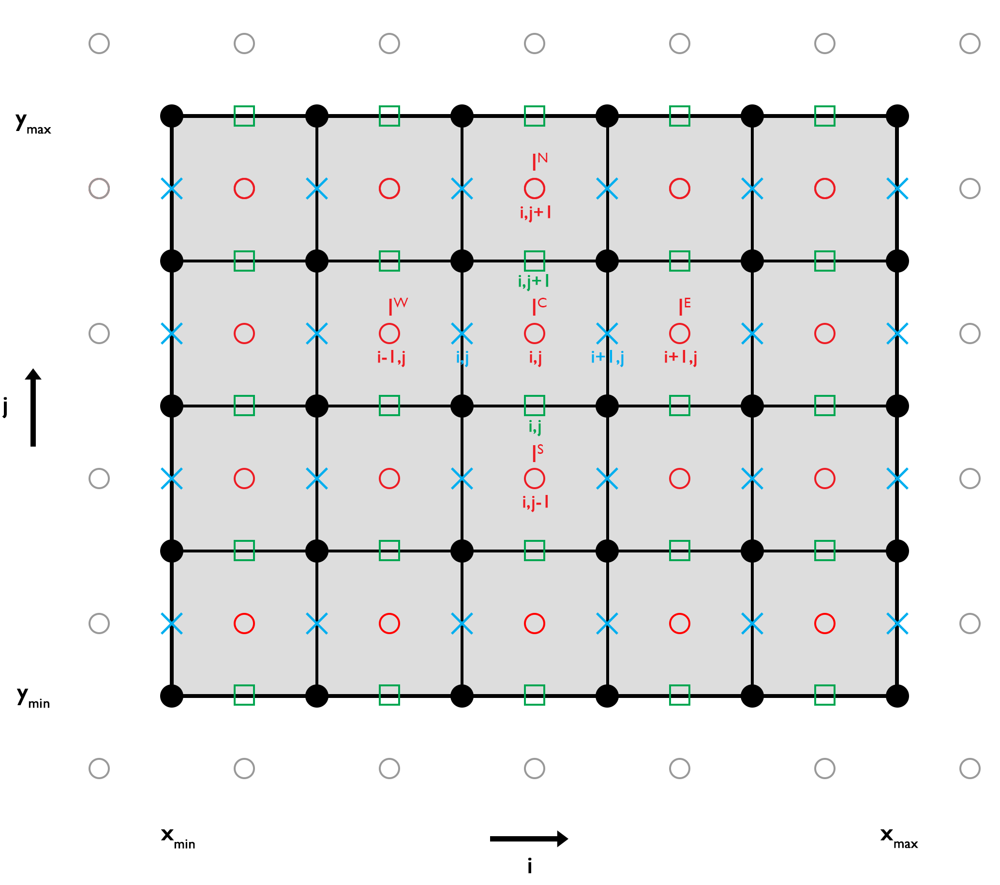

# Heat Diffusion Equation (2D)

In two spatial dimensions ($x$ and $y$), the diffusive part of the temperature evolution equation, assuming only radiogenic heat production, is given by:

$\begin{equation}
\rho c_p \frac{\partial T}{\partial t} = -\frac{\partial q_x}{\partial x} -\frac{\partial q_y}{\partial y} + Q,
\end{equation}$

where 
$\rho$ is the density [kg/m³],
$c_p$ is the specific heat capacity [J/kg/K],
$T$ is the temperature [K],
$t$ is time [s],
$q_x$ and $q_y$ are the components of the conductive heat flux vector in the $x$- and $y$-directions [W/m²], and
$Q$ is the volumetric heat production rate [W/m³], related to the mass-specific heat production $H$ via $Q = \rho H$.

By applying Fourier’s law and allowing for spatially variable thermal conductivity $k_x$ and $k_y$ [W/m/K], the equation becomes

$\begin{equation}
\rho c_p \frac{\partial T}{\partial t} = \frac{\partial}{\partial x}\left(k_x \frac{\partial T}{\partial x}\right) + \frac{\partial}{\partial y}\left(k_y \frac{\partial T}{\partial y}\right) + Q.
\end{equation}$

If the thermal properties are assumed constant, this simplifies to

$\begin{equation}
\frac{\partial T}{\partial t} = \kappa \left(\frac{\partial^2 T}{\partial x^2} + \frac{\partial^2 T}{\partial y^2}\right) + \frac{Q}{\rho_0 c_p},
\end{equation}$
  
where 
$\kappa = k / \rho_0 / c_p$ is the thermal diffusivity [m²/s] and $\rho_0$ is a reference density [kg/m³].

# Discretization and Numerical Schemes

To numerically solve Equation (3), the spatial domain must be discretized and the relevant thermal properties assigned to the appropriate computational nodes.

**Figure 1. 2D Discretization.** *Staggered finite difference grid* for solving the 2D heat diffusion equation. Temperature values are defined at the *centroids* (red circles), while heat fluxes are computed at the points between the *vertices* (black circles; horizontal flux: blue crosses; vertical flux: green squares). *Ghost nodes* (grey circles) are used to implement *Dirichlet* and *Neumann* boundary conditions.

To solve the equation at each centroid, the temperature values at adjacent points must also be considered. The locations of these points in a finite difference (FD) scheme are determined by the numerical stencil (Figure 1). For the 2D heat diffusion equation, we employ a five-point stencil consisting of a central point (the reference centroid) and neighboring points to the North, East, South, and West.

This spatial discretization relies on central finite differences to approximate both the temperature gradient and the flux divergence. The resulting five-point stencil therefore provides second-order accuracy in space.

The indices of these points, which also determine the positions of the coefficients in the coefficient matrix for each equation in the resulting linear system, can be expressed using the local indices $i$ and $j$ of the numerical grid. These local indices describe the position of the centroids in the horizontal and vertical directions, respectively.

The equation number $I$ in the system of equations, which also represents the central reference centroid assuming a horizontal numbering of the stencil across the model domain, is defined as

$\begin{equation}
I = I^\textrm{C} = \left(j-1\right)\cdot{nc_x}+i,
\end{equation}$

where $I$ is the equation number (corresponding to the centroid at stencil position $C$) and $nc_x$ is the number of centroids in the horizontal direction.

In `GeoModBox.jl`, each staggered field (e.g., $T$, $q_x$, $q_y$) is stored on its own grid and numbered consecutively on that grid. Unless stated otherwise, $I^\textrm{C}$ denotes the global index on the grid of the variable currently being discretized. It is obtained from that variable’s local indices $(i,j)$ using the corresponding $nc_x$ and $nc_y$.

The indices of the points in the numerical five-point stencil are then defined as

$\begin{equation}\begin{split}
I^\textrm{S} & = I^\textrm{C} - nc_x,\\
I^\textrm{W} & = I^\textrm{C} - 1,\\
I^\textrm{E} & = I^\textrm{C} + 1,\\
I^\textrm{N} & = I^\textrm{C} + nc_x,
\end{split}\end{equation}$

where $I^\textrm{S}$, $I^\textrm{W}$, $I^\textrm{E}$, and $I^\textrm{N}$ denote the points South, West, East, and North of the central node, respectively. These indices correspond to the global indices of the five-point stencil used in the discretized FD equations below.

When discretizing flux divergences, the indices $I^\textrm{C}$ and $I^\textrm{E}$ refer to the two adjacent flux degrees of freedom on the corresponding flux grid (the west and east faces of the control volume surrounding $T_{I^\textrm{C}}$), consistent with the staggered layout shown in Figure 1.

A detailed implementation of several numerical schemes for solving a linear problem using a single left-matrix division is provided in the example script [Gaussian_Diffusion.jl](./examples/GaussianDiffusion2D.md).

This example demonstrates the application of several discretization methods for solving the 2D heat diffusion equation:

- Explicit scheme
- Implicit scheme
- Crank–Nicolson approach
- Alternating Direction Implicit (ADI) method

The numerical results are compared with the analytical solution of a Gaussian temperature distribution to assess accuracy and performance. Additional [scripts](https://github.com/GeoSci-FFM/GeoModBox.jl/blob/main/examples/DiffusionEquation/2D/GeneralSolverTest.jl) test the general, combined solution on the Gaussian diffusion problem (for more details on the different solvers, see the description below).

Each numerical scheme is briefly outlined in the following sections. For further details regarding the numerical background, refer to the [1D solver documentation](DiffOneD.md).

## Temperature Field Management

Within `GeoModBox.jl`, it is necessary to distinguish between the centroid field and the extended field, which includes ghost nodes.

The extended field is used in the linear solution of the explicit (forward Euler) scheme and in the residual calculation for the non-linear solution using defect correction. For these solvers, the ghost node temperature values are computed internally based on the prescribed thermal boundary conditions, and the extended field is used to numerically solve the PDE.

For solvers that involve a coefficient matrix (e.g., linear implicit schemes and non-linear solutions for constant and variable thermal properties), only the centroid values are used. In this case, the size of the coefficient matrix is determined by the total number of centroids. After solving the PDE, these solvers internally update the centroid temperatures of the extended field.

For more details, please see the following sections or refer to the [source code](https://github.com/GeoSci-FFM/GeoModBox.jl/blob/main/src/HeatEquation/2Dsolvers.jl).

## Boundary Conditions

To correctly impose boundary conditions at all boundaries, ghost nodes located at $\frac{\Delta{x}}{2}$ and $\frac{\Delta{y}}{2}$ outside the domain are used. The temperature values at these ghost nodes are directly included in the discretized FD formulations for the centroids adjacent to the boundaries.

Within `GeoModBox.jl`, the two most common thermal boundary conditions are currently implemented: Dirichlet and Neumann.

**Dirichlet Boundary Conditions**

*Dirichlet* conditions impose a fixed temperature value along the boundary. The ghost node temperatures are calculated as:

**West boundary**

$\begin{equation}
T_{\textrm{G}}^W = 2T_{\textrm{BC}}^W - T_{1,:}
\end{equation}$

**East boundary**

$\begin{equation}
T_{\textrm{G}}^E = 2T_{\textrm{BC}}^E - T_{nc_x,:}
\end{equation}$

**South boundary**

$\begin{equation}
T_{\textrm{G}}^S = 2T_{\textrm{BC}}^S - T_{:,1}
\end{equation}$

**North boundary**

$\begin{equation}
T_{\textrm{G}}^N = 2T_{\textrm{BC}}^N - T_{:,nc_y}
\end{equation}$

Here, $T_{\textrm{BC}}^W$, $T_{\textrm{BC}}^E$, $T_{\textrm{BC}}^S$, and $T_{\textrm{BC}}^N$ are the prescribed boundary temperatures on the West, East, South, and North boundaries, respectively. The notation $T_{i,:}$ and $T_{:,j}$ denotes slices along rows and columns.

**Neumann Boundary Conditions**

*Neumann* conditions impose a prescribed temperature gradient (or heat flux) across the boundary. Ghost node temperatures are computed as:

**West boundary**

$\begin{equation}
T_{\textrm{G}}^W = T_{1,:} - c^{W} \Delta{x},
\end{equation}$

**East boundary**

$\begin{equation}
T_{\textrm{G}}^E = T_{nc_x,:} + c^{E} \Delta{x},
\end{equation}$

**South boundary**

$\begin{equation}
T_{\textrm{G}}^S = T_{:,1} - c^{S} \Delta{y},
\end{equation}$

**North boundary**

$\begin{equation}
T_{\textrm{G}}^N = T_{:,nc_y} + c^{N} \Delta{y},
\end{equation}$

where

$\begin{equation}
\left. c^{W} = \frac{\partial{T}}{\partial{x}} \right\vert_{W}, \left. c^{E} = \frac{\partial{T}}{\partial{x}} \right\vert_{E}, 
\left. c^{S} = \frac{\partial{T}}{\partial{y}} \right\vert_{S},
\left. c^{N} = \frac{\partial{T}}{\partial{y}} \right\vert_{N},
\end{equation}$

are the specified temperature gradients (or fluxes) at each boundary.

> **Note:** If variable thermal properties are assumed, the thermal conductivity $k$ should be included in the flux definition.

## Explicit Scheme (Forward Time, Centered Space; FTCS)

For an explicit FD discretization, the numerical stability criterion in 2D (heat diffusion condition) is given by:

$\begin{equation}
\Delta{t} < \frac{1}{2 \kappa \left(\frac{1}{\Delta{x^2}}+\frac{1}{\Delta{y^2}}\right)}.
\end{equation}$

Here, $\Delta t$ is the time step size, and $\Delta x$ and $\Delta y$ denote the grid spacings in the $x$- and $y$-directions, respectively. This condition must be satisfied to ensure numerical stability of the explicit scheme.

In two dimensions, Equation (3) is discretized using an explicit FTCS scheme as

$\begin{equation}
\frac{T_{I^\textrm{C}}^{n+1} - T_{I^\textrm{C}}^{n} }{\Delta t} = \kappa \left( \frac{T_{I^\textrm{W}}^{n} - 2T_{I^\textrm{C}}^{n} + T_{I^\textrm{E}}^{n}}{\Delta{x}^2} + \frac{T_{I^\textrm{S}}^{n} - 2T_{I^\textrm{C}}^{n} + T_{I^\textrm{N}}^{n}}{\Delta{y^2}} \right) + \frac{Q_{I^\textrm{C}}^n}{\rho_0 c_p}, 
\end{equation}$

where $n$ denotes the time-step index. Rearranging the equation to solve for the temperature at the next time step yields

$\begin{equation}
T_{I^\textrm{C}}^{n+1} = T_{I^\textrm{C}}^{n} + a\left(T_{I^\textrm{W}}^{n} - 2T_{I^\textrm{C}}^{n} + T_{I^\textrm{E}}^{n}\right) + b\left(T_{I^\textrm{S}}^{n} - 2T_{I^\textrm{C}}^{n} + T_{I^\textrm{N}}^{n}\right) + \frac{Q_{I^\textrm{C}}^n \Delta{t}}{\rho_0 c_p}, 
\end{equation}$

with

$\begin{equation}
a = \frac{\kappa \Delta{t}}{\Delta{x^2}}, \quad 
b = \frac{\kappa \Delta{t}}{\Delta{y^2}}.
\end{equation}$

Equation (17) is evaluated for all centroids at each time step, assuming prescribed initial and boundary conditions. The boundary conditions are imposed using the ghost-node temperatures (Equations (6)–(13)). For implementation details, see the [source code](https://github.com/GeoSci-FFM/GeoModBox.jl/blob/main/src/HeatEquation/2Dsolvers.jl).

## Implicit Scheme (Backward Euler)

In two dimensions, and using a five-point stencil, the heat diffusion equation (assuming constant properties and radiogenic heat sources only) can be discretized using the implicit (Backward Euler) method as

$\begin{equation}
\frac{T_{I^\textrm{C}}^{n+1}-T_{I^\textrm{C}}^n}{\Delta t} = 
\kappa \left( 
    \frac{T_{I^\textrm{W}}^{n+1}-2T_{I^\textrm{C}}^{n+1}+T_{I^\textrm{E}}^{n+1}}{\Delta x^2} + 
    \frac{T_{I^\textrm{S}}^{n+1}-2T_{I^\textrm{C}}^{n+1}+T_{I^\textrm{N}}^{n+1}}{\Delta y^2} 
    \right) + 
\frac{Q_{I^\textrm{C}}^n}{\rho_0 c_p},
\end{equation}$

where $n+1$ denotes the next time step. Rearranging into a form that separates known and unknown terms yields a linear system of the form

$\begin{equation}
-b T_{I^\textrm{S}}^{n+1} - a T_{I^\textrm{W}}^{n+1} + 
\left(2a + 2b + c \right) T_{I^\textrm{C}}^{n+1} - 
a T_{I^\textrm{E}}^{n+1} - b T_{I^\textrm{N}}^{n+1} = 
c T_{I^\textrm{C}}^n + \frac{Q_{I^\textrm{C}}^n}{\rho_0 c_p},
\end{equation}$

with

$\begin{equation}\begin{split}
a & = \frac{\kappa}{\Delta{x^2}}, \\
b & = \frac{\kappa}{\Delta{y^2}}, \\ 
c & = \frac{1}{\Delta{t}}.
\end{split}\end{equation}$ 

These equations form a five-diagonal system:

$\begin{equation}
\mathbf{K} \cdot \mathbf{x} = \mathbf{b}
\end{equation}$

where $\mathbf{K}$ is the coefficient matrix (with five non-zero diagonals), $\mathbf{x}$ is the unknown solution vector (the temperatures at the centroids at time step $n+1$), and $\mathbf{b}$ is the known right-hand side.

### General Solution

Similar to the 1D problem, the system of equations can be solved in a general way using defect correction. The heat diffusion equation is reformulated by introducing a residual term $r$, which quantifies the deviation from the true solution and can be reduced iteratively to improve accuracy through successive correction steps. In implicit form, the residual can be calculated as

$\begin{equation}
\mathbf{K} \cdot \mathbf{x} - \mathbf{b} = \mathbf{r}, 
\end{equation}$

which, following some [algebra](DiffOneD.md), results in the correction term of the initial temperature guess:

$\begin{equation}
\delta \mathbf{T} = -\mathbf{K}^{-1} \mathbf{r}^k 
\end{equation}$

and the updated temperature after one iteration step:

$\begin{equation}
\mathbf{T}^{k+1} = \mathbf{T}^k + \delta \mathbf{T}.
\end{equation}$

Within `GeoModBox.jl`, the residual $\mathbf{r}$ is calculated at the **centroids** using the extended temperature field of the current time step, which includes the ghost node temperature values, as an initial temperature guess:

$\begin{equation}
\frac{\partial{T_{\textrm{ext},I}}}{\partial{t}} - \kappa \left( \frac{\partial^2{T_{\textrm{ext},I}}}{\partial{x}^2} + \frac{\partial^2{T_{\textrm{ext},I}}}{\partial{y}^2} \right) - \frac{Q_{I}}{\rho_0 c_p} = \mathbf{r}_{I}.
\end{equation}$

Discretizing the equation in space and time using implicit FDs yields:

$\begin{equation}
\frac{T_{\textrm{ext},I^\textrm{C}}^{n+1}-T_{\textrm{ext},I^\textrm{C}}^{n}}{\Delta{t}} - \kappa 
\left( \frac{T_{\textrm{ext},I^\textrm{W}}^{n+1} - 2 T_{\textrm{ext},I^\textrm{C}}^{n+1} + T_{\textrm{ext},I^\textrm{E}}^{n+1}}{\Delta{x}^2} + \frac{T_{\textrm{ext},I^\textrm{S}}^{n+1} - 2 T_{\textrm{ext},I^\textrm{C}}^{n+1} + T_{\textrm{ext},I^\textrm{N}}^{n+1}}{\Delta{y}^2}  
\right) - \frac{Q_{I^\textrm{C}}^n}{\rho_0 c_p} = \bm{r}_{I},
\end{equation}$

Rewriting Equation (27) and substituting the coefficients using Equation (21) results in:

$\begin{equation}
-b T_{\textrm{ext},I^\textrm{S}}^{n+1} - a T_{\textrm{ext},I^\textrm{W}}^{n+1} + 
\left(2a + 2b + c \right) T_{\textrm{ext},I^\textrm{C}}^{n+1} - 
a T_{\textrm{ext},I^\textrm{E}}^{n+1} - b T_{\textrm{ext},I^\textrm{N}}^{n+1} - 
c T_{\textrm{ext},I^\textrm{C}}^n - \frac{Q_{I^\textrm{C}}^n}{\rho_0 c_p} = 
\bm{r}_{I},
\end{equation}$

which corresponds to the matrix form of Equation (23), where $T_{\textrm{ext},I}^{n+1}$ is the unknown vector $\mathbf{x}$ (only using the centroids), $-cT_{\textrm{ext},I}^n -\frac{Q_{I^\textrm{C}}^n}{\rho_0 c_p}$ is the known vector $\mathbf{b}$, and $-a$, $-b$, and $\left(2a+2b+c\right)$ are the coefficients of the non-zero diagonals of the coefficient matrix $\mathbf{K}$. With the residual vector $\mathbf{r}$ and the coefficient matrix $\mathbf{K}$ one can calculate the correction term for the temperature via Equation (24). The correction is then used to update the initial temperature guess (Equation (25)). This procedure is repeated until the residual is considered sufficiently small.

> **Note:** The residual is calculated only at the centroids, using the extended temperature field including the ghost node values. For centroids adjacent to the boundary, the ghost node temperatures must be used, which leads to a modification of the coefficients in the coefficient matrix. Thus, the unknown vector $\mathbf{x}$ has the dimension of the number of equations, corresponding to the temperatures at the centroids.

For implementation details, refer to the [source code](https://github.com/GeoSci-FFM/GeoModBox.jl/blob/main/src/HeatEquation/2Dsolvers.jl).

### Boundary Conditions

The boundary conditions are implemented using the temperature values at the ghost nodes (see Equations (6)-(13)). To maintain symmetry in the coefficient matrix, the coefficients must be modified for nodes adjacent to the boundaries. The equations for the centroids adjacent to the boundary are then given by:

**Dirichlet Boundary Conditions**

**West boundary**

$\begin{equation}
-b T_{\textrm{ext},I^\textrm{S}}^{n+1} 
+\left(3 a + 2b + c\right) T_{\textrm{ext},I^\textrm{C}}^{n+1} 
-a T_{\textrm{ext},I^\textrm{E}}^{n+1}  
-b T_{\textrm{ext},I^\textrm{N}}^{n+1} - c T_{\textrm{ext},I^\textrm{C}}^{n} - 2 a T_{\textrm{BC}}^W - \frac{Q_{I^\textrm{C}}^n}{\rho_0 c_p} = 
r_{I},
\end{equation}$

**East boundary**

$\begin{equation}
-b T_{\textrm{ext},I^\textrm{S}}^{n+1} 
-aT_{\textrm{ext},I^\textrm{W}}^{n+1} 
+\left(3 a + 2b + c\right) T_{\textrm{ext},I^\textrm{C}}^{n+1} 
-b T_{\textrm{ext},I^\textrm{N}}^{n+1} 
-c T_{\textrm{ext},I^\textrm{C}}^{n} 
-2 a T_{\textrm{BC}}^E 
-\frac{Q_{I^\textrm{C}}^n}{\rho_0 c_p}=
r_{I},
\end{equation}$

**South boundary**

$\begin{equation}
-a T_{\textrm{ext},I^\textrm{W}}^{n+1} 
+\left(2a + 3b + c\right) T_{\textrm{ext},I^\textrm{C}}^{n+1} 
-a T_{\textrm{ext},I^\textrm{E}}^{n+1} 
-bT_{\textrm{ext},I^\textrm{N}}^{n+1} 
-c T_{\textrm{ext},I^\textrm{C}}^{n} 
-2 b T_{\textrm{BC}}^S
-\frac{Q_{I^\textrm{C}}^n}{\rho_0 c_p}=
r_{I},
\end{equation}$

**North boundary**

$\begin{equation}
-b T_{\textrm{ext},I^\textrm{S}}^{n+1} 
-aT_{\textrm{ext},I^\textrm{W}}^{n+1} 
+\left(2a + 3b + c\right) T_{\textrm{ext},I^\textrm{C}}^{n+1} 
-a T_{\textrm{ext},I^\textrm{E}}^{n+1} 
-c T_{\textrm{ext},I^\textrm{C}}^{n} 
-2 b T_{\textrm{BC}}^N 
-\frac{Q_{I^\textrm{C}}^n}{\rho_0 c_p}=
r_{I},
\end{equation}$

**Neumann Boundary Conditions**

**West boundary**

$\begin{equation}
-b T_{\textrm{ext},I^\textrm{S}}^{n+1} 
+\left(a + 2b + c\right) T_{\textrm{ext},I^\textrm{C}}^{n+1} 
-a T_{\textrm{ext},I^\textrm{E}}^{n+1}  
-b T_{\textrm{ext},I^\textrm{N}}^{n+1} 
-c T_{\textrm{ext},I^\textrm{C}}^{n} 
+a c^W \Delta{x} 
-\frac{Q_{I^\textrm{C}}^n}{\rho_0 c_p}=
r_{I},
\end{equation}$

**East boundary**

$\begin{equation}
-b T_{\textrm{ext},I^\textrm{S}}^{n+1} 
-aT_{\textrm{ext},I^\textrm{W}}^{n+1} 
+\left(a + 2b + c\right) T_{\textrm{ext},I^\textrm{C}}^{n+1} 
-b T_{\textrm{ext},I^\textrm{N}}^{n+1} 
-c T_{\textrm{ext},I^\textrm{C}}^{n} 
-a c^E \Delta{x} 
-\frac{Q_{I^\textrm{C}}^n}{\rho_0 c_p}=
r_{I},
\end{equation}$

**South boundary**

$\begin{equation}
-a T_{\textrm{ext},I^\textrm{W}}^{n+1} 
+\left(2a + b + c\right) T_{\textrm{ext},I^\textrm{C}}^{n+1} 
-a T_{\textrm{ext},I^\textrm{E}}^{n+1} 
-bT_{\textrm{ext},I^\textrm{N}}^{n+1} 
-c T_{\textrm{ext},I^\textrm{C}}^{n} 
+b c^S \Delta{y} 
-\frac{Q_{I^\textrm{C}}^n}{\rho_0 c_p}=
r_{I},
\end{equation}$

**North boundary**

$\begin{equation}
-b T_{\textrm{ext},I^\textrm{S}}^{n+1} 
-aT_{\textrm{ext},I^\textrm{W}}^{n+1} 
+\left(2a + b + c\right) T_{\textrm{ext},I^\textrm{C}}^{n+1} 
-a T_{\textrm{ext},I^\textrm{E}}^{n+1} 
-c T_{\textrm{ext},I^\textrm{C}}^{n} 
-b c^N \Delta{y} 
-\frac{Q_{I^\textrm{C}}^n}{\rho_0 c_p}=
r_{I},
\end{equation}$

where $T_{\textrm{BC}}^W$, $T_{\textrm{BC}}^E$, $T_{\textrm{BC}}^S$, and $T_{\textrm{BC}}^N$ are the prescribed boundary temperatures, and $c^W$, $c^E$, $c^S$, and $c^N$ are the prescribed temperature gradients at the West, East, South, and North boundaries, respectively.

While rewriting the entire equations is mathematically correct, the boundary conditions are implemented within `GeoModBox.jl` by directly using the ghost-node temperature values to calculate the residual for the centroids adjacent to the boundaries. Equations (29)-(36) are shown here to highlight the modified coefficients of the matrix. These adjustments ensure that the boundary conditions are enforced consistently while preserving the symmetry of the implicit solver.

### Special Case - A Linear Problem

If the problem is linear and the exact solution is reached within a single iteration step, the system of equations reduces to Equation (22). Thus, one can solve the system directly via a *left matrix division*:

$\begin{equation}
\bf{x} = \mathbf{K}^{-1} \mathbf{b}. 
\end{equation}$

### Boundary Conditions

The coefficient matrix remains unchanged in the presence of the boundary conditions. However, the right-hand side must be updated accordingly (by setting $\mathbf{r}=0$ and adding the known boundary contributions to the right-hand side). The equations for the centroids adjacent to the boundaries are then given by:

**Dirichlet Boundary Conditions**

**West boundary**

$\begin{equation}
-b T_{\textrm{ext},I^\textrm{S}}^{n+1} 
+\left(3 a + 2b + c\right) T_{\textrm{ext},I^\textrm{C}}^{n+1} 
-a T_{\textrm{ext},I^\textrm{E}}^{n+1}  
-b T_{\textrm{ext},I^\textrm{N}}^{n+1} = 
c T_{\textrm{ext},I^\textrm{C}}^{n} 
+2 a T_{\textrm{BC}}^W 
+\frac{Q_{I^\textrm{C}}^n}{\rho_0 c_p}
\end{equation}$

**East boundary**

$\begin{equation}
-b T_{\textrm{ext},I^\textrm{S}}^{n+1} 
-aT_{\textrm{ext},I^\textrm{W}}^{n+1} 
+\left(3 a + 2b + c\right) T_{\textrm{ext},I^\textrm{C}}^{n+1} 
-b T_{\textrm{ext},I^\textrm{N}}^{n+1} = 
c T_{\textrm{ext},I^\textrm{C}}^{n} 
+2 a T_{\textrm{BC}}^E +
\frac{Q_{I^\textrm{C}}^n}{\rho_0 c_p}
\end{equation}$

**South boundary**

$\begin{equation}
-a T_{\textrm{ext},I^\textrm{W}}^{n+1} 
+\left(2a + 3b + c\right) T_{\textrm{ext},I^\textrm{C}}^{n+1} 
-a T_{\textrm{ext},I^\textrm{E}}^{n+1} 
-bT_{\textrm{ext},I^\textrm{N}}^{n+1} = 
c T_{\textrm{ext},I^\textrm{C}}^{n} 
+2 b T_{\textrm{BC}}^S 
+\frac{Q_{I^\textrm{C}}^n}{\rho_0 c_p}
\end{equation}$

**North boundary**

$\begin{equation}
-b T_{\textrm{ext},I^\textrm{S}}^{n+1} 
-aT_{\textrm{ext},I^\textrm{W}}^{n+1} 
+\left(2a + 3b + c\right) T_{\textrm{ext},I^\textrm{C}}^{n+1} 
-a T_{\textrm{ext},I^\textrm{E}}^{n+1} = 
c T_{\textrm{ext},I^\textrm{C}}^{n} 
+2 b T_{\textrm{BC}}^N 
+\frac{Q_{I^\textrm{C}}^n}{\rho_0 c_p}
\end{equation}$

**Neumann Boundary Conditions**

**West boundary**

$\begin{equation}
-b T_{\textrm{ext},I^\textrm{S}}^{n+1} 
+\left(a + 2b + c\right) T_{\textrm{ext},I^\textrm{C}}^{n+1} 
-a T_{\textrm{ext},I^\textrm{E}}^{n+1}  
-b T_{\textrm{ext},I^\textrm{N}}^{n+1} = 
c T_{\textrm{ext},I^\textrm{C}}^{n} 
-a c^W \Delta{x} 
+\frac{Q_{I^\textrm{C}}^n}{\rho_0 c_p}
\end{equation}$

**East boundary**

$\begin{equation}
-b T_{\textrm{ext},I^\textrm{S}}^{n+1} 
-aT_{\textrm{ext},I^\textrm{W}}^{n+1} 
+\left(a + 2b + c\right) T_{\textrm{ext},I^\textrm{C}}^{n+1} 
-b T_{\textrm{ext},I^\textrm{N}}^{n+1} = 
c T_{\textrm{ext},I^\textrm{C}}^{n} 
+a c^E \Delta{x} 
+\frac{Q_{I^\textrm{C}}^n}{\rho_0 c_p}
\end{equation}$

**South boundary**

$\begin{equation}
-a T_{\textrm{ext},I^\textrm{W}}^{n+1} 
+\left(2a + b + c\right) T_{\textrm{ext},I^\textrm{C}}^{n+1} 
-a T_{\textrm{ext},I^\textrm{E}}^{n+1} 
-bT_{\textrm{ext},I^\textrm{N}}^{n+1} = 
c T_{\textrm{ext},I^\textrm{C}}^{n} 
-b c^S \Delta{y} 
+\frac{Q_{I^\textrm{C}}^n}{\rho_0 c_p}
\end{equation}$

**North boundary**

$\begin{equation}
-b T_{\textrm{ext},I^\textrm{S}}^{n+1} 
-aT_{\textrm{ext},I^\textrm{W}}^{n+1} 
+\left(2a + b + c\right) T_{\textrm{ext},I^\textrm{C}}^{n+1} 
-a T_{\textrm{ext},I^\textrm{E}}^{n+1} = 
c T_{\textrm{ext},I^\textrm{C}}^{n} 
+b c^N \Delta{y} 
+\frac{Q_{I^\textrm{C}}^n}{\rho_0 c_p}
\end{equation}$

## Crank-Nicolson Approach (CNA)

In 2D, the heat diffusion equation (Equation (3)) using the Crank–Nicolson discretization is written as:

$\begin{equation}\begin{gather*}
& \frac{T_{I^\textrm{C}}^{n+1} - T_{I^\textrm{C}}^{n}}{\Delta t} = \\ &
\frac{\kappa}{2}\frac{(T_{I^\textrm{W}}^{n+1}-2T_{I^\textrm{C}}^{n+1}+T_{I^\textrm{E}}^{n+1})+(T_{I^\textrm{W}}^{n}-2T_{I^\textrm{C}}^{n}+T_{I^\textrm{E}}^{n})}{\Delta x^2} + \\ &
\frac{\kappa}{2}\frac{(T_{I^\textrm{S}}^{n+1}-2T_{I^\textrm{C}}^{n+1}+T_{I^\textrm{N}}^{n+1})+(T_{I^\textrm{S}}^{n}-2T_{I^\textrm{C}}^{n}+T_{I^\textrm{N}}^{n})}{\Delta y^2} + \frac{Q_{I^\textrm{C}}^n}{\rho_0 c_p}
\end{gather*}\end{equation}$

Rearranging into a form that separates known and unknown variables gives the linear system of equations:

$\begin{equation}\begin{gather*}
& -b T_{I^\textrm{S}}^{n+1} -aT_{I^\textrm{W}}^{n+1}+\left(2a + 2b + c\right)T_{I^\textrm{C}}^{n+1} -aT_{I^\textrm{E}}^{n+1} -b T_{I^\textrm{N}}^{n+1} = \\ &b T_{I^\textrm{S}}^{n} +aT_{I^\textrm{W}}^{n}-\left(2a + 2b - c\right)T_{I^\textrm{C}}^{n} +aT_{I^\textrm{E}}^{n} +b T_{I^\textrm{N}}^{n} + \frac{Q_{I^\textrm{C}}^n}{\rho_0 c_p}
\end{gather*}\end{equation}$

where the coefficients are:

$\begin{equation}\begin{split}
a & = \frac{\kappa}{2\Delta{x^2}}, \\
b & = \frac{\kappa}{2\Delta{y^2}}, \\
c & = \frac{1}{\Delta{t}}.
\end{split}\end{equation}$ 

These equations form a five-diagonal system:

$\begin{equation}
\mathbf{K_1}\cdot{\mathbf{x}}=\mathbf{K_2}\cdot{T^n}+b,
\end{equation}$

where $\mathbf{K_i}$ are the coefficient matrices (with five non-zero diagonals), $\mathbf{x}$ is the unknown solution vector (the temperature at time step $n+1$), and $b$ is the heat generation term.

> **Note:** Here, $\mathbf{b}$ only contains radiogenic heat sources. Additional heat sources, such as shear heating, adiabatic heating, or latent heating, can be added directly to this vector.

### General Solution

The residual at the centroids using the Crank–Nicolson discretization is calculated via:

$\begin{equation}
\mathbf{K_1}\cdot{\mathbf{x}}-\mathbf{K_2}\cdot{T_{}^n}-\mathbf{b}=\mathbf{r}.
\end{equation}$

The correction term and the updated temperature within the iteration are computed as in the implicit general solution (Equations (24) and (25)).

Within `GeoModBox.jl`, the extended temperature field is used to discretize the equation in space and time and to evaluate the residual at the centroids, leading to:

$\begin{equation}\begin{gather*}
& -b T_{\textrm{ext},I^\textrm{S}}^{n+1} -aT_{\textrm{ext},I^\textrm{W}}^{n+1}+\left(2a + 2b + c\right)T_{\textrm{ext},I^\textrm{C}}^{n+1} -aT_{\textrm{ext},I^\textrm{E}}^{n+1} -b T_{\textrm{ext},I^\textrm{N}}^{n+1} \\ & -b T_{\textrm{ext},I^\textrm{S}}^{n} -aT_{\textrm{ext},I^\textrm{W}}^{n}+\left(2a + 2b - c\right)T_{\textrm{ext},I^\textrm{C}}^{n} -aT_{\textrm{ext},I^\textrm{E}}^{n} -b T_{\textrm{ext},I^\textrm{N}}^{n} - \frac{Q_{I^\textrm{C}}^n}{\rho_0 c_p} = \bm{r}_{I},
\end{gather*}\end{equation}$

where $I^\textrm{C}$ is the global central reference point of the five-point stencil on the extended centroid grid and $I$ is the equation number. This corresponds to the matrix form of Equation (50).

### Boundary Conditions

As with the implicit method, to maintain symmetry in the coefficient matrices, the coefficients must be modified for the nodes adjacent to the boundaries. The equations for the centroids adjacent to the boundary are then given by:

**Dirichlet Boundary Conditions**

**West boundary**

$\begin{equation}\begin{gather*}
& -b T_{\textrm{ext},I^\textrm{S}}^{n+1} +
\left(3a + 2b + c \right) T_{\textrm{ext},I^\textrm{C}}^{n+1} 
-a T_{\textrm{ext},I^\textrm{E}}^{n+1} - b T_{\textrm{ext},I^\textrm{N}}^{n+1} \\ &
-b T_{\textrm{ext},I^\textrm{S}}^{n} +
\left( 3a + 2b - c \right)T_{\textrm{ext},I^\textrm{C}}^{n} - a T_{\textrm{ext},I^\textrm{E}}^{n} - b T_{\textrm{ext},I^\textrm{N}}^{n} - 4 a T_{\textrm{BC}}^W - \frac{Q_{I^\textrm{C}}^n}{\rho_0 c_p} = \rm{r}_{I},
\end{gather*}\end{equation}$

**East boundary**

$\begin{equation}\begin{gather*}
& -b T_{\textrm{ext},I^\textrm{S}}^{n+1} - a T_{\textrm{ext},I^\textrm{W}}^{n+1} +
\left(3a + 2b + c \right) T_{\textrm{ext},I^\textrm{C}}^{n+1} 
-b T_{\textrm{ext},I^\textrm{N}}^{n+1} \\ & 
-b T_{\textrm{ext},I^\textrm{S}}^{n} - a T_{\textrm{ext},I^\textrm{W}}^{n} +
\left( 3a + 2b - c \right)T_{\textrm{ext},I^\textrm{C}}^{n} - b T_{\textrm{ext},I^\textrm{N}}^{n} - 4 a T_{\textrm{BC}}^E - \frac{Q_{I^\textrm{C}}^n}{\rho_0 c_p}=\bm{r}_{I},
\end{gather*}\end{equation}$

**South boundary**

$\begin{equation}\begin{gather*}
& -a T_{\textrm{ext},I^\textrm{W}}^{n+1} +
\left(2a + 3b + c \right) T_{\textrm{ext},I^\textrm{C}}^{n+1} - a T_{\textrm{ext},I^\textrm{E}}^{n+1} - b T_{\textrm{ext},I^\textrm{N}}^{n+1} \\ & 
-a T_{\textrm{ext},I^\textrm{W}}^{n} + \left( 2a + 3b - c \right) T_{\textrm{ext},I^\textrm{C}}^{n} - a T_{\textrm{ext},I^\textrm{E}}^{n} - b T_{\textrm{ext},I^\textrm{N}}^{n} - 4 b T_{\textrm{BC}}^S - \frac{Q_{I^\textrm{C}}^n}{\rho_0 c_p} = \bm{r}_{I},
\end{gather*}\end{equation}$

**North boundary**

$\begin{equation}\begin{gather*}
& -b T_{\textrm{ext},I^\textrm{S}}^{n+1} + a T_{\textrm{ext},I^\textrm{W}}^{n+1} + \left(2a + 3b + c \right) T_{\textrm{ext},I^\textrm{C}}^{n+1} - a T_{\textrm{ext},I^\textrm{E}}^{n+1} \\ &
-b T_{\textrm{ext},I^\textrm{S}}^{n} - a T_{\textrm{ext},I^\textrm{W}}^{n} + \left( 2a + 3b - c \right) T_{\textrm{ext},I^\textrm{C}}^{n} - a T_{\textrm{ext},I^\textrm{E}}^{n} - 4 b T_{\textrm{BC}}^N - \frac{Q_{I^\textrm{C}}^n}{\rho_0 c_p} = \bm{r}_{I}.
\end{gather*}\end{equation}$

**Neumann Boundary Conditions**

**West boundary**

$\begin{equation}\begin{gather*}
& -b T_{\textrm{ext},I^\textrm{S}}^{n+1} + \left(a + 2b + c \right) T_{\textrm{ext},I^\textrm{C}}^{n+1} - a T_{\textrm{ext},I^\textrm{E}}^{n+1} - b T_{\textrm{ext},I^\textrm{N}}^{n+1} \\ &
-b T_{\textrm{ext},I^\textrm{S}}^{n} + \left( a + 2b - c \right) T_{\textrm{ext},I^\textrm{C}}^{n} - a T_{\textrm{ext},I^\textrm{E}}^{n} - b T_{\textrm{ext},I^\textrm{N}}^{n} + 2 a c^W \Delta{x} - \frac{Q_{I^\textrm{C}}^n}{\rho_0 c_p} = \bm{r}_{I},
\end{gather*}\end{equation}$

**East boundary**

$\begin{equation}\begin{gather*}
& -b T_{\textrm{ext},I^\textrm{S}}^{n+1} - a T_{\textrm{ext},I^\textrm{W}}^{n+1} + \left(a + 2b + c \right) T_{\textrm{ext},I^\textrm{C}}^{n+1} - b T_{\textrm{ext},I^\textrm{N}}^{n+1} \\ &
-b T_{\textrm{ext},I^\textrm{S}}^{n} - a T_{\textrm{ext},I^\textrm{W}}^{n} + \left( a + 2b - c \right) T_{\textrm{ext},I^\textrm{C}}^{n} - b T_{\textrm{ext},I^\textrm{N}}^{n} - 2 a c^E \Delta{x} - \frac{Q_{I^\textrm{C}}^n}{\rho_0 c_p} = \bm{r}_{I},
\end{gather*}\end{equation}$

**South boundary**

$\begin{equation}\begin{gather*}
& -a T_{\textrm{ext},I^\textrm{W}}^{n+1} + \left(2a + b + c \right) T_{\textrm{ext},I^\textrm{C}}^{n+1} - a T_{\textrm{ext},I^\textrm{E}}^{n+1} - b T_{\textrm{ext},I^\textrm{N}}^{n+1} \\ &
-a T_{\textrm{ext},I^\textrm{W}}^{n} + \left( 2a + b - c \right) T_{\textrm{ext},I^\textrm{C}}^{n} - a T_{\textrm{ext},I^\textrm{E}}^{n} - b T_{\textrm{ext},I^\textrm{N}}^{n} + 2 b c^S \Delta{y} - \frac{Q_{I^\textrm{C}}^n}{\rho_0 c_p} = \bm{r}_{I},
\end{gather*}\end{equation}$

**North boundary**

$\begin{equation}\begin{gather*}
& -b T_{\textrm{ext},I^\textrm{S}}^{n+1} + a T_{\textrm{ext},I^\textrm{W}}^{n+1} + \left(2a + b + c \right) T_{\textrm{ext},I^\textrm{C}}^{n+1} - a T_{\textrm{ext},I^\textrm{E}}^{n+1} \\ &
-b T_{\textrm{ext},I^\textrm{S}}^{n} - a T_{\textrm{ext},I^\textrm{W}}^{n} + \left( 2a + b - c \right) T_{\textrm{ext},I^\textrm{C}}^{n} - a T_{\textrm{ext},I^\textrm{E}}^{n} - 2 b c^N \Delta{y} - \frac{Q_{I^\textrm{C}}^n}{\rho_0 c_p} = \bm{r}_{I}.
\end{gather*}\end{equation}$

For implementation details, refer to the [source code](https://github.com/GeoSci-FFM/GeoModBox.jl/blob/main/src/HeatEquation/2Dsolvers.jl).

Similar to the pure implicit scheme, there is a *special case* for solving this system of equations when the system is linear. In that case, the heat diffusion equation reduces to Equation (49) and can be solved directly via *left matrix division*. The coefficient matrices remain the same, even for the given boundary conditions. However, the right-hand side must be updated accordingly by setting $\mathbf{r}=0$ and adding the known terms to the right-hand side of the equations.

Within `GeoModBox.jl`, the general solution of a non-linear system using the *explicit*, *implicit*, or *Crank–Nicolson* discretization scheme, assuming constant thermal properties and using the extended temperature field (including ghost nodes), is implemented in the combined form:

$\begin{equation}
\frac{\partial{T}}{\partial{t}} 
-\kappa\left(
    \left(1-\mathbb{C}\right)\frac{\partial^2{T_{\textrm{ext}}^{n+1}}}{\partial{x_i^2}} 
    +\mathbb{C}\frac{\partial^2{T_{\textrm{ext}}^{n}}}{\partial{x_i^2}}\right)
-\frac{Q_{I^\textrm{C}}^n}{\rho_0 c_p}=\bm{r}, 
\end{equation}$

where $\mathbb{C}$ is a constant defining the discretization approach:

$\begin{equation}
\mathbb{C} = \begin{cases}
    0\text{, for implicit} \\
    0.5\text{, for CNA} \\ 
    1\text{, for explicit}
\end{cases}.
\end{equation}$

Fully expanded and separating known and unknown terms leads to:

$\begin{equation}\begin{gather*}
& -b T_{\textrm{ext},I^\textrm{S}}^{n+1} -aT_{\textrm{ext},I^\textrm{W}}^{n+1}+cT_{\textrm{ext},I^\textrm{C}}^{n+1} -aT_{\textrm{ext},I^\textrm{E}}^{n+1} -b T_{\textrm{ext},I^\textrm{N}}^{n+1} \\ & -e T_{\textrm{ext},I^\textrm{S}}^{n} -dT_{\textrm{ext},I^\textrm{W}}^{n}+fT_{\textrm{ext},I^\textrm{C}}^{n} -dT_{\textrm{ext},I^\textrm{E}}^{n} -e T_{\textrm{ext},I^\textrm{N}}^{n} - \frac{Q_{I^\textrm{C}}^n}{\rho_0 c_p} = \bm{r}_{I},
\end{gather*}\end{equation}$

where the coefficients are:

$\begin{equation}\begin{split}
    \begin{split}
        a & = \frac{\left(1-\mathbb{C}\right)\kappa}{\Delta{x^2}} \\ 
        b & = \frac{\left(1-\mathbb{C}\right)\kappa}{\Delta{y^2}} \\ 
        c & = 2a+2b+\frac{1}{\Delta{t}} \\ \end{split} 
    \quad\quad \begin{split}
        d & = \frac{\mathbb{C}\kappa}{\Delta{x^2}} \\ 
        e & = \frac{\mathbb{C}\kappa}{\Delta{y^2}} \\
        f & = 2e+2d-\frac{1}{\Delta{t}} \\ \end{split}
\end{split}.\end{equation}$

Equation (62) corresponds to the matrix form of Equation (50). With the residual vector $\mathbf{r}$ and the coefficient matrix $\mathbf{K_1}$, the correction term for the temperature can be computed via Equation (24). For implementation details, see the [source code](https://github.com/GeoSci-FFM/GeoModBox.jl/blob/main/src/HeatEquation/2Dsolvers.jl). An example showing how to use the general, combined solver is provided [here](https://github.com/GeoSci-FFM/GeoModBox.jl/blob/main/examples/DiffusionEquation/2D/GeneralSolverTest.jl).

## Alternating-Direction Implicit (ADI)

For simplicity—and because most 2D diffusion problems in `GeoModBox.jl` are linear—the *special-case* formulation is used for the ADI method. In 2D, the heat diffusion equation (Equation (3)) is discretized with an Alternating-Direction Implicit (ADI) scheme by splitting each time step into two fractional steps. The resulting systems for the two half-steps are:

### First half-step (implicit in $y$, explicit in $x$)

$\begin{equation}
\frac{T_{I^\textrm{C}}^{n+1/2}-T_{I^\textrm{C}}^n}{\Delta t/2} = 
\kappa 
    \left( 
    \frac{T_{I^\textrm{W}}^n-2T_{I^\textrm{C}}^n+T_{I^\textrm{E}}^n}{\Delta x^2} +
    \frac{T_{I^\textrm{S}}^{n+1/2}-2T_{I^\textrm{C}}^{n+1/2}+T_{I^\textrm{N}}^{n+1/2}}{\Delta y^2}
    \right) + \frac{Q_{I^\textrm{C}}^n}{\rho_0 c_p}
\end{equation}$

### Second half-step (implicit in $x$, explicit in $y$)

$\begin{equation}
\frac{T_{I^\textrm{C}}^{n+1}-T_{I^\textrm{C}}^{n+1/2}}{\Delta t/2} = 
\kappa 
    \left( 
    \frac{T_{I^\textrm{W}}^{n+1}-2T_{I^\textrm{C}}^{n+1}+T_{I^\textrm{E}}^{n+1}}{\Delta x^2} + 
    \frac{T_{I^\textrm{S}}^{n+1/2}-2T_{I^\textrm{C}}^{n+1/2}+T_{I^\textrm{N}}^{n+1/2}}{\Delta y^2}
    \right) + \frac{Q_{I^\textrm{C}}^n}{\rho_0 c_p}
\end{equation}$

Each fractional step results in a tridiagonal linear system, alternating between the $x$- and $y$-directions. This decomposition reduces the computational cost compared to a fully coupled 2D implicit solve while retaining the stability benefits of implicit schemes. In practice, each half-step corresponds to a set of independent tridiagonal solves along one coordinate direction.

As in the other implicit schemes for linear problems, the coefficients and right-hand side vectors must be adjusted to account for the prescribed boundary conditions (Dirichlet or Neumann); see the previous sections for examples of boundary treatment.

For implementation details, refer to the [source code](https://github.com/GeoSci-FFM/GeoModBox.jl/blob/main/src/HeatEquation/2Dsolvers.jl).

# Variable Thermal Properties

To solve the 2D heat diffusion equation including variable thermal properties, we focus on the general solution in a combined form, given by:

$\begin{equation}
\rho c_p \frac{\partial{T}}{\partial{t}} 
+\left(1-\mathbb{C}\right)\frac{\partial{q_{i}^{n+1}}}{\partial{x_i}} 
+\mathbb{C}\frac{\partial{q_{i}}^{n}}{\partial{x_i}}
-Q=\mathbf{r}.
\end{equation}$

Here, $q_i$ denotes the heat flux in direction $i$ and is defined as

$\begin{equation}
q_i = - k_i\frac{\partial{T}}{\partial{x_i}},
\end{equation}$

where $k_i$ is the thermal conductivity in direction $i$. This combined formulation of the heat diffusion equation enables the use of either the *explicit*, *implicit*, or *Crank–Nicolson* discretization scheme.

Discretizing the equation in space and time yields

$\begin{equation}\begin{gather*}
& \rho_{I^\textrm{C}} c_{p,I^\textrm{C}}\left(\frac{T_{I^\textrm{C}}^{n+1} - T_{I^\textrm{C}}^{n}}{\Delta{t}}\right) \\ &
+\left(1-\mathbb{C}\right)\left(
    \frac{q_{x,I^\textrm{E}}^{n+1} - q_{x,I^\textrm{C}}^{n+1}}{\Delta{x}} 
    +\frac{q_{y,I^\textrm{N}}^{n+1} - q_{y,I^\textrm{C}}^{n+1}}{\Delta{y}}\right) \\ &
+\mathbb{C}\left(
    \frac{q_{x,I^\textrm{E}}^{n} - q_{x,I^\textrm{C}}^{n}}{\Delta{x}} 
    +\frac{q_{y,I^\textrm{N}}^{n} - q_{y,I^\textrm{C}}^{n}}{\Delta{y}}\right) \\ &
-Q_{I^\textrm{C}}^n = r_{I}, 
\end{gather*}\end{equation}$

where $I$ is the equation number and $I^\textrm{C}$ is the central reference point of the numerical stencil of the corresponding field (see Figure 1). Applying Fourier's law yields

$\begin{equation}\begin{gather*}
& \rho_{I^\textrm{C}} c_{p,I^\textrm{C}}\left(
    \frac{T_{I^\textrm{C}}^{n+1} - T_{I^\textrm{C}}^{n}}{\Delta{t}}\right) + \\ &
+\left(1-\mathbb{C}\right)\left(
        \frac{-k_{x,I^\textrm{E}}\frac{T_{I^\textrm{E}}^{n+1}-T_{I^\textrm{C}}^{n+1}}{\Delta{x}} 
        +k_{x,I^\textrm{C}}\frac{T_{I^\textrm{C}}^{n+1}-T_{I^\textrm{W}}^{n+1}}{\Delta{x}}}
        {\Delta{x}}
    +\frac{-k_{y,I^\textrm{N}}\frac{T_{I^\textrm{N}}^{n+1}-T_{I^\textrm{C}}^{n+1}}{\Delta{y}} 
        +k_{y,I^\textrm{C}}\frac{T_{I^\textrm{C}}^{n+1}-T_{I^\textrm{S}}^{n+1}}{\Delta{y}}}
        {\Delta{y}}
\right) \\ &
+\mathbb{C}\left(
        \frac{-k_{x,I^\textrm{E}}\frac{T_{I^\textrm{E}}^{n}-T_{I^\textrm{C}}^{n}}{\Delta{x}} 
        +k_{x,I^\textrm{C}}\frac{T_{I^\textrm{C}}^{n}-T_{I^\textrm{W}}^{n}}{\Delta{x}}}
        {\Delta{x}}
    +\frac{-k_{y,I^\textrm{N}}\frac{T_{I^\textrm{N}}^{n}-T_{I^\textrm{C}}^{n}}{\Delta{y}} 
        +k_{y,I^\textrm{C}}\frac{T_{I^\textrm{C}}^{n}-T_{I^\textrm{S}}^{n}}{\Delta{y}}}
        {\Delta{y}}
\right) \\ &
-Q_{I^\textrm{C}}^n = r_{I}.
\end{gather*}\end{equation}$

Rewriting this expression in a matrix-compatible form gives

$\begin{equation}\begin{gather*}
& -aT_{I^\textrm{S}}^{n+1} 
-bT_{I^\textrm{W}}^{n+1} 
+cT_{I^\textrm{C}}^{n+1} 
-dT_{I^\textrm{E}}^{n+1} 
-eT_{I^\textrm{N}}^{n+1} \\ &
-fT_{I^\textrm{S}}^{n} 
-gT_{I^\textrm{W}}^{n} 
+hT_{I^\textrm{C}}^{n} 
-iT_{I^\textrm{E}}^{n} 
-jT_{I^\textrm{N}}^{n} \\ &
-Q_{I^\textrm{C}}^n = r_{I}
\end{gather*},\end{equation}$

which corresponds to the matrix form of Equation (50):

$\begin{equation}
\mathbf{K_1}\cdot{\mathbf{x}}-\mathbf{K_2}\cdot{T^n}-\mathbf{b}=\mathbf{r}.
\end{equation}$

The coefficients of the matrix $\mathbf{K_1}$ associated with the unknown $\mathbf{x}$ are

$\begin{equation}\begin{split}
a & = \frac{\left(1-\mathbb{C}\right)k_{y,I^\textrm{C}}}{\Delta{y^2}} \\ 
b & = \frac{\left(1-\mathbb{C}\right)k_{x,I^\textrm{C}}}{\Delta{x^2}} \\ 
c & = \frac{\rho_{I^\textrm{C}} c_{p,I^\textrm{C}}}{\Delta{t}}  
+\left(1-\mathbb{C}\right)\left(\frac{k_{x,I^\textrm{E}}}{\Delta{x^2}} + \frac{k_{x,I^\textrm{C}}}{\Delta{x^2}} 
+\frac{k_{y,I^\textrm{N}}}{\Delta{y^2}} + \frac{k_{y,I^\textrm{C}}}{\Delta{y^2}}\right) \\ 
d & = \frac{\left(1-\mathbb{C}\right)k_{x,I^\textrm{E}}}{\Delta{x^2}} \\ 
e & = \frac{\left(1-\mathbb{C}\right)k_{y,I^\textrm{N}}}{\Delta{y^2}} \\
\end{split}\end{equation}$

and the coefficients of the matrix $\mathbf{K_2}$ associated with the known temperatures $T^n$ are

$\begin{equation}\begin{split}
f & = \frac{\mathbb{C}k_{y,I^\textrm{C}}}{\Delta{y^2}} \\ 
g & = \frac{\mathbb{C}k_{x,I^\textrm{C}}}{\Delta{x^2}} \\ 
h & = -\frac{\rho_{I^\textrm{C}} c_{p,I^\textrm{C}}}{\Delta{t}}  
+\mathbb{C}\left(\frac{k_{x,I^\textrm{E}}}{\Delta{x^2}} + \frac{k_{x,I^\textrm{C}}}{\Delta{x^2}} 
+\frac{k_{y,I^\textrm{N}}}{\Delta{y^2}} + \frac{k_{y,I^\textrm{C}}}{\Delta{y^2}}\right) \\ 
i & = \frac{\mathbb{C}k_{x,I^\textrm{E}}}{\Delta{x^2}} \\ 
j & = \frac{\mathbb{C}k_{y,I^\textrm{N}}}{\Delta{y^2}} \\
\end{split}.\end{equation}$

With the residual vector $\mathbf{r}$ and the coefficient matrix $\mathbf{K_1}$, the correction term for the temperature can be calculated via Equation (24). The correction is then used to update the initial temperature guess. This procedure is repeated until the residual is considered sufficiently small.

# Steady-State Solution

In steady state, the temperature field does not vary with time (i.e., $\partial T/\partial t = 0$), and the heat diffusion equation reduces to an *elliptic partial differential equation*, commonly referred to as the *Poisson equation*.

## Poisson Equation (constant $k$)

For constant thermal conductivity, the steady-state heat diffusion equation is given by

$\begin{equation}
0 = \left( 
    \frac{\partial^2 T}{\partial x^2} + \frac{\partial^2 T}{\partial y^2}
    \right) + \frac{Q}{k}.
\end{equation}$

Using central finite differences to approximate the spatial derivatives yields

$\begin{equation}
0 = \left( 
\frac{T_{I^\textrm{W}} - 2T_{I^\textrm{C}} + T_{I^\textrm{E}}}{\Delta x^2} + \frac{T_{I^\textrm{S}} - 2T_{I^\textrm{C}} + T_{I^\textrm{N}}}{\Delta y^2}
\right) + \frac{Q_{I^\textrm{C}}}{k},
\end{equation}$

where $I^\textrm{C}$ is the global central reference point of the five-point stencil on the extended temperature field for the centroids.

Rearranging the terms yields a system of equations of the form

$\begin{equation} 
bT_{I^\textrm{S}} + aT_{I^\textrm{W}} - 2(a+b)T_{I^\textrm{C}} + aT_{I^\textrm{E}} + bT_{I^\textrm{N}} = -\frac{Q_{I^\textrm{C}}}{k},
\end{equation}$

with

$\begin{equation}
a = \frac{1}{\Delta x^2}, \quad
b = \frac{1}{\Delta y^2}.
\end{equation}$

### Boundary Conditions

Boundary conditions are enforced using ghost nodes, which requires modifications to both the coefficient matrix and the right-hand side vector.

**Dirichlet Boundary Conditions**

**West boundary**

$\begin{equation}
bT_{I^\textrm{S}} - (3a + 2b)T_{I^\textrm{C}} + bT_{I^\textrm{N}} + aT_{I^\textrm{E}} = -\frac{Q_{I^\textrm{C}}}{k_{I^\textrm{C}}} - 2aT_{\textrm{BC}}^W.
\end{equation}$

**East boundary**

$\begin{equation}
aT_{I^\textrm{W}} + bT_{I^\textrm{S}} - (3a + 2b)T_{I^\textrm{C}} + bT_{I^\textrm{N}} = -\frac{Q_{I^\textrm{C}}}{k_{I^\textrm{C}}} - 2aT_{\textrm{BC}}^E.
\end{equation}$

**South boundary**

$\begin{equation}
aT_{I^\textrm{S}} - (2a + 3b)T_{I^\textrm{C}} + bT_{I^\textrm{N}} + aT_{I^\textrm{E}} = -\frac{Q_{I^\textrm{C}}}{k_{I^\textrm{C}}} - 2bT_{\textrm{BC}}^S.
\end{equation}$

**North boundary**

$\begin{equation}
aT_{I^\textrm{W}} + bT_{I^\textrm{S}} - (2a + 3b)T_{I^\textrm{C}} + aT_{I^\textrm{E}} = -\frac{Q_{I^\textrm{C}}}{k_{I^\textrm{C}}} - 2bT_{\textrm{BC}}^N.
\end{equation}$

**Neumann Boundary Conditions**

**West boundary**

$\begin{equation}
bT_{I^\textrm{S}} - (a + 2b)T_{I^\textrm{C}} + bT_{I^\textrm{N}} + aT_{I^\textrm{E}} = -\frac{Q_{I^\textrm{C}}}{k_{I^\textrm{C}}} + ac^W\Delta{x}.
\end{equation}$

**East boundary**

$\begin{equation}
aT_{I^\textrm{W}} + bT_{I^\textrm{S}} - (a + 2b)T_{I^\textrm{C}} + bT_{I^\textrm{N}} = -\frac{Q_{I^\textrm{C}}}{k_{I^\textrm{C}}} - ac^E\Delta{x}.
\end{equation}$

**South boundary**

$\begin{equation}
aT_{I^\textrm{W}} - (2a + b)T_{I^\textrm{C}} + bT_{I^\textrm{N}} + aT_{I^\textrm{E}} = -\frac{Q_{I^\textrm{C}}}{k_{I^\textrm{C}}} + bc^S\Delta{y}.
\end{equation}$

**North boundary**

$\begin{equation}
aT_{I^\textrm{W}} + bT_{I^\textrm{S}} - (2a + b)T_{I^\textrm{C}} + aT_{I^\textrm{E}} = -\frac{Q_{I^\textrm{C}}}{k_{I^\textrm{C}}} - bc^N\Delta{y}.
\end{equation}$

For implementation details, refer to the [source code](https://github.com/GeoSci-FFM/GeoModBox.jl/blob/main/src/HeatEquation/2Dsolvers.jl).

## Poisson Equation (variable $k$)

For spatially varying thermal conductivity, the steady-state heat equation in 2D is given by

$\begin{equation} 
0 = \frac{\partial}{\partial x}\left(k_x\frac{\partial T}{\partial x}\right) + 
\frac{\partial}{\partial y}\left(k_y\frac{\partial T}{\partial y}\right) + Q. 
\end{equation}$

To discretize this equation conservatively, a staggered finite-difference scheme is used. The heat flux $q_i = -k_i \frac{\partial T}{\partial i}$ is defined **between** centroids, while the temperature is defined **at** the centroids (see Figure 1).

This leads to the discretized form

$\begin{equation} 
b k_{y;I^\textrm{C}} T_{I^\textrm{S}} + a k_{x;I^\textrm{C}} T_{I^\textrm{W}} + c T_{I^\textrm{C}} + a k_{x;I^\textrm{E}} T_{I^\textrm{E}} + b k_{y;I^\textrm{N}} T_{I^\textrm{N}} + Q_{I^\textrm{C}} = 0,  
\end{equation}$

where

$\begin{equation}
a = \frac{1}{\Delta{x^2}}, \quad
b = \frac{1}{\Delta{y^2}}, \quad
c = -a\left(k_{x;I^\textrm{E}}+k_{x;I^\textrm{C}}\right) - b\left(k_{y;I^\textrm{N}}+k_{y;I^\textrm{C}}\right).
\end{equation}$

For further implementation details, see the [source code](https://github.com/GeoSci-FFM/GeoModBox.jl/blob/main/src/HeatEquation/2Dsolvers.jl).