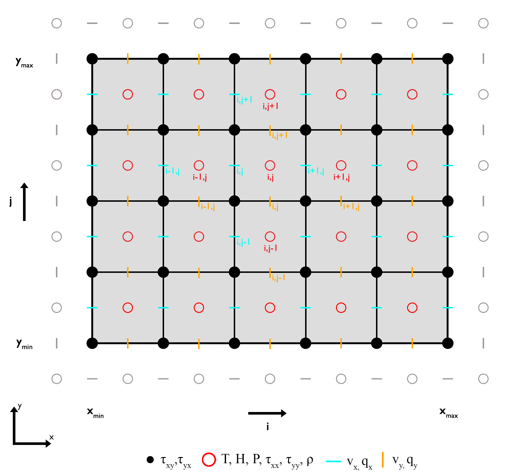

# Solving Differential Equations

## Governing Equations

The general governing equations for solving a geodynamical problem, neglecting adiabatic effects and assuming only radioactive heat source, are the conservation equations of 

**Momentum**

$\begin{equation}
\rho \left(\frac{\partial{v_{i}}}{\partial{t}} + v_{j}\frac{\partial{v_{i}}}{\partial{x_{j}}}\right) = -\frac{\partial{P}}{\partial{x_{i}}} + \frac{\tau_{ij}}{\partial{x_j}} + \rho g_{i},
\end{equation}$

where 
$\rho$ is the density [kg/m³], 
$v_i$ is the velocity in the $i$-th direction [m/s],
$t$ is time [s],
$\partial/\partial{t}$ is the time derivative, 
$\partial/\partial x_i$ is a directional derivative in $i$, 
$P$ the total pressure [Pa], 
$\tau_{ij}$ is the deviatoric stress tensor [Pa], and 
$\boldsymbol{g}$ is the gravitational acceleration vector [m/s²]. 

**Energy**

$\begin{equation}
\rho c_p \left(\frac{\partial T}{\partial t} + v_j\frac{\partial{T}}{\partial{x_j}}\right) = -\frac{\partial q_i}{\partial x_i} + \rho H,
\end{equation}$

where 
$c_p$ is the specific heat capacity [J/kg/K],
$T$ is temperature [K],
$q_i$ is the heat flux [W/m²] in direction $i$,
$H$ is the internal heat production per unit mass [W/kg]. 

**Mass**

$\begin{equation}
\frac{\partial{v_i}}{\partial{x_i}} = 0.
\end{equation}$

Repeated indices imply summation.

---

Ordinary and partial differential equations (ODEs and PDEs) can be solved through various approaches—occasionally *analytically*, but more commonly *numerically* due to their inherent complexity. Among numerical methods, prominent techniques include *integral*-based methods, such as the *finite element* and *spectral* methods, as well as the *finite difference* method.

The ```GeoModBox.jl``` framework primarily employs the **finite difference method**. While each numerical approach has its own strengths and limitations, the choice often depends on the user's familiarity and comfort with the method. Nonetheless, the finite difference method is relatively straightforward and pedagogically advantageous, as its discretized form closely resembles the original differential equations. Furthermore, it is computationally efficient, making it well-suited for performance-critical applications.

In general, the finite difference method aims to approximate **differential operators** using finite differences derived from a Taylor series expansion. For further details, refer to the [lecture notes](https://lukasfuchs.wordpress.com/numerical-methods-in-geophysics/) or see the reference below.

## Staggered Finite Difference

... *finite difference approximation* ...

To solve differential equations within a given domain using the finite difference method, it is first necessary to generate a *numerical grid* on which finite differences can be computed. The most straightforward approach is to discretize the domain using a *regular*, *uniform* grid, where the spacing between grid points is constant and all variables are defined at the same locations. Such grids are commonly used to solve equations like the Poisson equation, the heat equation, or advective transport equations.

However, in many cases, certain limitations or physical constraints require a different arrangement of variable locations to ensure numerical stability and the conservation of physical properties. For instance, solving the *momentum equation* with **variable viscosity** typically requires a *fully staggered grid* to correctly preserve stress continuity across adjacent grid points. A similar consideration applies to the *temperature equation* when using **variable thermal conductivity**.

Staggered grids also offer advantages in implementing boundary conditions. For example, with *Neumann* thermal boundary conditions, the heat flux across a boundary can be naturally evaluated at staggered points using so-called *ghost points*. These ghost points can also be employed to impose *Dirichlet* boundary conditions. This approach helps maintain consistent accuracy and order of the finite difference scheme both at internal and boundary points. 

For these reasons, `GeoModBox.jl` adopts a staggered grid for solving the *temperature equation*. The complete grid structure used for the governing equations in `GeoModBox.jl` is illustrated below:



# Initial Conditions 

... *tba* ...

# Thermal convection

The equations discussed here are used to solve for pressure and velocity in two-dimensional thermal convection systems. While support for variable thermodynamic parameters—such as density ( $\rho$ ), specific heat capacity ( $c_p$ ), and thermal conductivity ( $k$ )—is forthcoming, simplifications are often employed to make the problem more tractable.

### Approximations 

A commonly used simplification in thermal convection modeling is the *Boussinesq* approximation. This approximation assumes that all thermodynamic properties remain constant, and adiabatic temperature effects are neglected in the *temperature equation*. Spatial density variations are assumed to be small and are only retained in the buoyancy term of the *momentum equation*. Under this framework, density becomes a function of temperature and is described using an *equation of state*.

### Equation of State

Several forms of the *equation of state* exist. For the current analysis, a linear approximation is used to describe density as a function of temperature:

$\begin{equation}
\rho = \rho_0 (1-\alpha T),
\end{equation}$

where $\rho_0$ is the reference density [kg/m³], and $\alpha$ is the thermal expansion coefficient [1/K].

Substituting this relation into the buoyancy term on the right-hand side of the *momentum equation* and using the definition of total pressure,

$\begin{equation}
P_t = P_{\text{dyn}} + P_{\text{hydr}},
\end{equation}$

where $P_{\text{dyn}}$ and $P_{\text{hydr}}$ denote the dynamic and hydrostatic pressure, respectively, along with the gradient of hydrostatic pressure,

$\begin{equation}
\frac{\partial{P_{\text{hydr}}}}{\partial{y}}=\rho_0 g,
\end{equation}$

yields a modified form of the $y$-component of the dimensional *momentum equation*.

**Governing equations**

The following dimensional equations govern thermal convection under the *Boussinesq* approximation:

**Momentum equation**

*$x$-component*

$\begin{equation}
0 = -\frac{\partial{P_{\text{dyn}}}}{\partial{x}}+\frac{\partial{\tau_{xj}}}{\partial{x_j}},
\end{equation}$

*$y$-component*

$\begin{equation}
0 = -\frac{\partial{P_{\text{dyn}}}}{\partial{y}}+\frac{\partial{\tau_{yj}}}{\partial{x_j}} - \rho_0 g \alpha T,
\end{equation}$

where $P_{\text{dyn}}$ is the dynamic pressure [Pa], $\tau_{ij}$ is the deviatoric stress tensor [Pa], $\rho_0$ is the reference density [kg/m³], $g$ is the gravitational acceleration [m/s²], $\alpha$ is the thermal expansion coefficient [1/K], and $T$ is the absolute temperature [K].

**Temperature equation**

$\begin{equation}
\left(\frac{\partial{T}}{\partial{t}} + v_j \frac{\partial{T}}{\partial{x_j}}\right) = \kappa \frac{\partial^2{T}}{\partial{x^2_i}} + \frac{Q}{\rho_0 c_p},
\end{equation}$

where $t$ is time [s], $v_j$ is the velocity in the $j$-th direction [m/s], $\kappa = \frac{k}{\rho c_p}$ is the thermal diffusivity [m²/s], $Q$ is the volumetric heat production rate [W/m³], and $c_p$ is the specific heat capacity [J/kg/K]. For implementation details, refer to the [thermal convection examples](https://github.com/GeoSci-FFM/GeoModBox.jl/blob/main/examples/MixedHeatedConvection/).

**Continuity equation**

$\begin{equation}
\frac{\partial{v_i}}{\partial{x_i}} = 0.
\end{equation}$

# Scaling

In geodynamic modeling, it is common practice to non-dimensionalize the governing equations to generalize results across different physical scales and to enable experimental modeling (e.g., in laboratory settings). To non-dimensionalize equations (7)–(10), we introduce *scaling constants* and derive the associated *scaling laws*.

### Scaling Constants

Several schemes exist for non-dimensionalization. In this case, the following set of scaling constants is used:

$\begin{equation}\begin{split}
h_{sc} & = h, \\ 
t_{sc} & = \frac{h^2}{\kappa}, \\
v_{sc} & = \frac{\kappa}{h}, \\
\tau_{sc} & = \frac{\eta_0 \kappa}{h^2}, \\
T_{sc} & = \Delta{T}, \\
Q_{sc} & = \frac{\Delta{T}\kappa \rho_0 c_p}{h^2}, 
\end{split}\end{equation}$

where $h$ is the model height [m], $\kappa$ is the thermal diffusivity [m²/s], $\eta_0$ is the reference viscosity [Pa·s], $\Delta T$ is the temperature difference between the top and bottom boundaries [K], $\rho_0$ is the reference density [kg/m³], and $c_p$ is the specific heat capacity [J/kg/K].

### Scaling laws

These constants are applied to transform dimensional quantities into their non-dimensional counterparts:

$\begin{equation}\begin{split}
h & = h' \cdot h_{sc}, \\ 
t & = t' \cdot t_{sc}, \\
v & = v' \cdot v_{sc}, \\
\tau & = \tau' \cdot \tau_{sc}, \\
T & = T' \cdot T_{sc}, \\
Q & = Q' \cdot Q_{sc}.
\end{split}\end{equation}$

When applied, many of the constants cancel out, resulting in non-dimensional equations that structurally resemble the dimensional ones.
**Note:** This simplification is only valid under the assumptions and approximations discussed above. Any remaining scaling terms can often be grouped into key dimensionless parameters.

### Rayleigh Number

The primary remaining dimensionless parameter is the Rayleigh number ($Ra$), which characterizes the convective behavior and replaces the buoyancy term in the *momentum equation*:

$\begin{equation}
Ra = \frac{\rho_0 g \alpha \Delta{T} h^3}{\eta_0 \kappa}.
\end{equation}$

### Non-Dimensional Governing Equations

**Momentum equation**

*$x$-component*

$\begin{equation}
-\frac{\partial{P'}}{\partial{x'}}+\frac{\partial{\tau_{xj}'}}{\partial{x_j'}} = 0,
\end{equation}$

Or in terms of velocity: 

$\begin{equation}
-\frac{\partial{P'}}{\partial{x'}}+2\frac{\partial}{\partial{x'}}\eta'\frac{\partial{v_x'}}{\partial{x'}}+\frac{\partial}{\partial{y'}}\eta'\left(\frac{\partial{v_x'}}{\partial{y'}}+\frac{\partial{v_y'}}{\partial{x'}}\right) = 0.
\end{equation}$

*$y$-component*

$\begin{equation}
-\frac{\partial{P'}}{\partial{y'}}+\frac{\partial{\tau_{yj}'}}{\partial{x_j'}} = Ra T',
\end{equation}$

Or in terms of velocity: 

$\begin{equation}
-\frac{\partial{P'}}{\partial{y'}}+2\frac{\partial}{\partial{y'}}\eta'\frac{\partial{v_{y}'}}{\partial{y'}} +\frac{\partial}{\partial{x'}}\eta'\left(\frac{\partial{v_{y}'}}{\partial{x'}} + \frac{\partial{v_{x}'}}{\partial{y'}}\right) = Ra T'.
\end{equation}$

**Temperature equation**

$\begin{equation}
\left(\frac{\partial{T'}}{\partial{t'}} + v_j' \frac{\partial{T'}}{\partial{x_j'}}\right) = \frac{\partial^2{T'}}{\partial{x^{'2}_i}} + Q'.
\end{equation}$

**Continuity equation**

$\begin{equation}
\frac{\partial{v'_x}}{\partial{x}} + \frac{\partial{v'_y}}{\partial{y'}} = 0.
\end{equation}$

When interpreting or analyzing non-dimensional models, it is essential to keep track of the scaling constants and reference values used in the transformation.

Compared to the dimensional equations, the non-dimensional (scaled) forms differ only slightly in structure. As a result, the same numerical solver can be used for both dimensional and non-dimensional formulations, requiring only minimal modifications when specifying the parameters. 

For an implementation example, see the [thermal convection examples](https://github.com/GeoSci-FFM/GeoModBox.jl/blob/main/examples/MixedHeatedConvection/).

# Mutable Structures 

... *tba* ...

