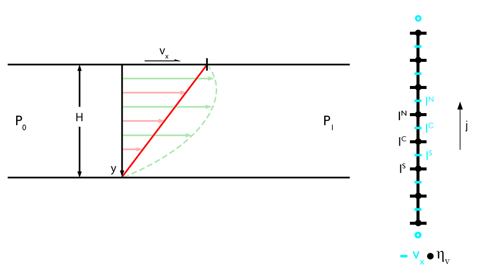

# Stokes Equation (1D)

Before solving the Stokes equation in two dimensions, let's first start with a rather simple, one-dimensional problem: an uniaxial Stokes flow in a horizontal channel and a known pressure gradient. A flow like this is a very good, first order approximation of a flow in a magma or subduction channel. The Stokes equation in one dimension is defined as (e.g., in the $x$-direction):  

*$x$-component*

$\begin{equation}
0 = -\frac{\partial{P}}{\partial{x}} + \frac{\partial{\tau_{xy}}}{\partial{y}},
\end{equation}$

where $P$ is the pressure [ $Pa$ ], $\frac{\partial}{\partial{x_i}}$ is the partial derivative in the $i$-th direction, and $\tau_{xy}$ is the horizontal shear stress [ $Pa$ ] and given by: 

$\begin{equation}
\tau_{xy} = 2 \eta \dot{\varepsilon}_{xy},
\end{equation}$

where $\eta$ is the viscosity [ $Pa s$ ] and $\dot{\varepsilon}_{xy}$ is the shear strain-rate and given by: 

$\begin{equation}
\dot{\varepsilon}_{xy} = \frac{1}{2} \frac{\partial{v_x}}{\partial{y}}.
\end{equation}$

## Discretization 



**Figure 1.** **Channel flow setup and FD grid.** *Left*: Sketch of an uniaxial channel flow driven by a constant velocity on top ($v_x$) and/or a horizontal pressure gradient $\left(\frac{\Delta{P}}{\Delta{x}} = P_1 - P_0 \right)$, that is a Couette, Poiseuille, or Couette-Poiseuille flow. *Right*: Finite difference grid using a conservative gridding, that is the viscosity is defined on the *vertices* and the horizontal velocity in between.

The finite difference grid shown in Figure 1 is a conservative gridding, that is the horizontal shear stress is conserved between two adjacent grid points and is defined on the *vertices*. A conservative gridding is required in case the viscosity does vary with depth. 

***Constant Viscosity***

In case the viscosity is constant, a conservative gridding is not necessary. Equation $(1)$ is then given by: 

$\begin{equation}
0 = -\frac{\partial{P}}{\partial{x}} + \eta\frac{\partial^2{v_x}}{\partial{y^2}}.
\end{equation}$

Using the finite difference approximations for the partial derivatives (second derivative, central differences) equation $(4)$ is given as (assuming the horizontal pressure gradient is constant and known): 

$\begin{equation}
\frac{\partial{P}}{\partial{x}} = \eta \left( \frac{v_{x,j-1} - 2v_{x,j} + v_{x,j+1}}{\Delta{x^2}} \right),
\end{equation}$

which can be simplified to: 

$\begin{equation}
\frac{\partial{P}}{\partial{x}}=av_{x,j-1}+bv_{x,j}+cv_{x,j+1}, 
\end{equation}$

where

$a = c = \frac{\eta}{\Delta{y^2}},\ \textrm{and}\ b = -\frac{2\eta}{\Delta{y^2}}.$

This is a linear system of equations in the form of $\bold{K} \cdot \overrightharpoon{v_x} = \overrightharpoon{rhs}$ with a three-diagonal coefficient matrix $\bold{K}$. The pressure gradient and the velocities at the boundaries define the known right-hand side and the horizontal velocity inbetween the *vertices* are the unknown vector. For the sake of simplicity, no additional solver for the constant velocity case is included in the ```GeoModBox.jl```, thus the viscosity needs to be treated numerically as an array and not as a scalar. For more information on how this is implemented see the [source code](https://github.com/GeoSci-FFM/GeoModBox.jl/blob/main/src/MomentumEquation/1Dsolvers.jl).

***Variable Viscosity***

In case of a variable viscosity, equation $(1)$ is given by: 

$\begin{equation}
0 = -\frac{\partial{P}}{\partial{x}} + \frac{\partial}{\partial{y}}\left(\eta\frac{\partial{v_x}}{\partial{y}}\right).
\end{equation}$

The partial difference operators in Equation $(7)$ are approximated using central finite differences, where the horizontal shear stress $\tau_{xy}$ and the viscosity is defined at the *vertices* and the velocity in between (for the sake of simplcity, let's call it the *centroids* in the 1-D case). 

Using central difference for the shear stress, Equation $(7)$ is given by: 

$\begin{equation}
\frac{\partial{P}}{\partial{x}}=\frac{\eta_{j+1}\frac{\partial{v_x}}{\partial{y}}\vert_{j+1}-\eta_{j}\frac{\partial{v_x}}{\partial{y}}\vert_{j}}{\Delta{y}},\ \textrm{for}\ j = 1:nc.
\end{equation}$

Approximating the partial derivatives for the velocity results in: 

$\begin{equation}
\frac{\partial{P}}{\partial{x}}=\frac{\eta_{j+1}\frac{v_{x,j+1}-v_{x,j}}{\Delta{y}}-\eta_{j}\frac{v_{x,j}-v_{x,j-1}}{\Delta{y}}\vert_{j}}{\Delta{y}}.
\end{equation}$

**Note**: The index $j$ goes from $1$ to $nc$, but the viscosity is defined on the *vertices* and the velocity on the *centroids*! In terms of the unknown velocity, equation $(9)$ can be rewritten as: 

$\begin{equation}
\frac{\partial{P}}{\partial{x}}=av_{x,j-1}+bv_{x,j}+cv_{x,j+1}, 
\end{equation}$

where

$\begin{equation}
a = \frac{\eta_j}{\Delta{y^2}}, b = -\frac{\eta_j+\eta_{j+1}}{\Delta{y^2}},\ \textrm{and}\ c = \frac{\eta_{j+1}}{\Delta{y^2}}. 
\end{equation}$

Again, this is a linear system of equations with a three-diagonal coefficient matrix.  

### Boundary Conditions

To solve the equations, one needs to define boundary conditions. To properly implement *Dirichlet* and *Neumann* boundary conditions, one needs to describe the velocity at the *ghost nodes* again. Similar to the thermal boundary conditions, the value for the velocity at the *ghost nodes* can be defined assuming a constant velocity at the boundary (i.e., *Dirichlet*) or a constant velocity gradient across the boundary (i.e., *Neumann*). The velocites are then defined as: 

**Dirichlet**

*Bottom* ($j=1$)

$\begin{equation}
V_{G,S} = 2V_{BC,S} - v_{x,1}
\end{equation}$

*Top* ($j=nc$)

$\begin{equation}
V_{G,N} = 2V_{BC,N} - v_{x,nc}
\end{equation}$

**Neumann**

*Bottom* ($j=1$)

$\begin{equation}
V_{G,S} = v_{x,1} - c_s\Delta{y},
\end{equation}$

*Top* ($j=nc$)

$\begin{equation}
V_{G,N}=v_{x,nc} + c_N\Delta{y},
\end{equation}$

where 

$\begin{equation}
c_S = \frac{dv_x}{dy}\vert_{j=1},\ \textrm{and}\ c_N=\frac{dv_x}{dy}\vert_{j=nc}
\end{equation}$

To obtain a symmetric coefficient matrix one needs to adjust the coefficients for the *centroids* adjacent to the boundary and the corresponding right-hand side. The equations at the top and bottom are then given by:  

**Dirichlet**

*Bottom* ($j=1$)

$\begin{equation}
\left(b-a\right)v_{x,1}+cv_{x,2} = \frac{\partial{P}}{\partial{x}} - 2aV_{BC,S}
\end{equation}$

*Top* ($j=nc$)

$\begin{equation}
av_{x,nc-1}+\left(b-c\right)v_{x,nx} = \frac{\partial{P}}{\partial{x}} - 2cV_{BC,N}
\end{equation}$

**Neumann**

*Bottom* ($j=1$)

$\begin{equation}
\left(b+a\right)v_{x,1}+cv_{x,2} = \frac{\partial{P}}{\partial{x}} + ac_SΔy
\end{equation}$

*Top* ($j=nc$)

$\begin{equation}
av_{x,nc-1}+\left(b+c\right)v_{x,nx} = \frac{∂P}{∂x} - cc_NΔy
\end{equation}$

### Solution 

There are different ways to solve the linear system of equations. The most convinient one would be a direct solution using the right division of the coefficient matrix by the right-hand side. 

#### Direct

$\begin{equation}
v_x = \bold{K} ∖ rhs
\end{equation}$

Similar to the thermal problem, one can also solve the linear system of equations using the defect correction method. This is very helpful, once the system is non-linear and one can simply iterate to reduce the residual. 

#### Defect Correction 

Here, one first calculates the residual of the governing equations: 

$\begin{equation}
R = -\frac{∂P}{∂x} + \frac{∂τ_{xy}}{∂y},
\end{equation}$

or in form of the unknown horizontal velocity:

$\begin{equation}
R = -\frac{∂P}{∂x} + \bold{K} \cdot v_x. 
\end{equation}$

Assuming an initial guess for the horizontal velocity $v_{x,i}$ one obtains an initial residual $R_i$: 

$\begin{equation}
R_i = -\frac{∂P}{∂x} + \bold{K_i} \cdot v_{x,i}.
\end{equation}$

Let's assume that the initial guess leads to the exact solution, i.e. the residual is zero, by adding a correction term $\delta{v_x}$. with a little algebra one finds: 

$\begin{equation}
0 = -\frac{∂P}{∂x} + \bold{K}\left(v_{x,i}+ \delta{v_x} \right) = \bold{K}\cdot v_{x,i} -\frac{∂P}{∂x} + \bold{K}\cdot \delta{v_x} = R_i + \bold{K} \cdot \delta{v_x}.
\end{equation}$

Rearanging the equation to: 

$\begin{equation}
R_i = -\bold{K}\cdot{\delta{v_x}}, 
\end{equation}$

one can solve for the correction term: 

$\begin{equation}
\delta{v_x} = -\bold{K}^{-1}R_i. 
\end{equation}$

Finally, adding the correction term to the initial guess gives the solution: 

$\begin{equation}
v_x^n = v_{x,i} + \delta{v_x}.
\end{equation}$

In case the system is linear, this would be the solution for the problem. For a non-linear problem, one needs to iterate over the equation until the residual is small enough. For more information on how this is implemented see the [source code](https://github.com/GeoSci-FFM/GeoModBox.jl/blob/main/src/MomentumEquation/1Dsolvers.jl).

How to solve the channel flow problem using the defect correctio method is given within the [examples](https://github.com/GeoSci-FFM/GeoModBox.jl/blob/main/examples/StokesEquation/1D/ChannelFlow_1D.jl). 

Solving the same issue using the direct solution is part of the [exercises](https://github.com/GeoSci-FFM/GeoModBox.jl/blob/main/exercises/08_1D_Stokes.ipynb).
