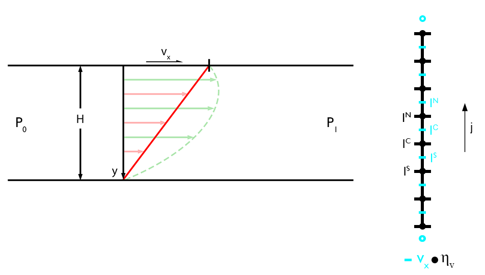

# Stokes Equation (1D)

Before solving the *Stokes equation* in two dimensions, we consider a simpler one-dimensional problem: uniaxial Stokes flow in a horizontal channel driven by a known horizontal pressure gradient. This configuration provides a useful first-order approximation for flows in magma channels or subduction channels. The one-dimensional Stokes equation in the $x$-direction is given by:

*$x$-component*

$\begin{equation}
0 = -\frac{\partial{P}}{\partial{x}} + \frac{\partial{\tau_{xy}}}{\partial{y}},
\end{equation}$

where  

$P$ is the pressure [Pa],  
$\frac{\partial}{\partial x_i}$ denotes the partial derivative in the $i$-th direction, and  
$\tau_{xy}$ is the horizontal shear stress [Pa], defined as

$\begin{equation}
\tau_{xy} = 2 \eta \dot{\varepsilon}_{xy},
\end{equation}$

with $\eta$ the viscosity [Pa·s] and $\dot{\varepsilon}_{xy}$ the shear strain-rate [1/s], given by

$\begin{equation}
\dot{\varepsilon}_{xy} = \frac{1}{2} \frac{\partial{v_x}}{\partial{y}}.
\end{equation}$

In this 1D formulation, the horizontal pressure gradient is prescribed and acts as a known forcing term; only the horizontal velocity $v_x(y)$ is solved for. Under the assumption of unidirectional flow $v_x(y)$, incompressibility is automatically satisfied, so only the $x$-momentum equation must be solved.

> **Note:** For the $y$-component of the Stokes equation, gravitational acceleration $g_y$ must be included.

# Discretization

**Figure 1. Channel flow setup and finite difference grid.**  
*Left:* Sketch of uniaxial channel flow driven by either a constant velocity at the top ($v_x$) and/or a horizontal pressure gradient $\left(\frac{\Delta P}{\Delta x} = P_1 - P_0\right)$, representing Couette, Poiseuille, or Couette–Poiseuille flow.  
*Right:* Finite difference grid with conservative gridding—viscosity is defined at *vertices*, while horizontal velocity is defined between them. The open circles at the top represent *ghost nodes* for horizontal velocity.

To evaluate the equation at a horizontal velocity point using a finite difference (FD) discretization, velocity values at adjacent points must be included. For the 1D Stokes equation, a three-point stencil is used, consisting of the central point (reference point) and the points to the South and North.

The indices of these points define the coefficient locations in the coefficient matrix for each equation in the system. The global indexing of the central reference point $I$ follows the convention introduced in the [general solution section](./GESolution.md). For a three-point stencil, the indices are:

$\begin{equation}\begin{split}
I^\textrm{S} & = I^\textrm{C} - 1,\\\   
I^\textrm{C} & = I, \\\
I^\textrm{N} & = I^\textrm{C} + 1,
\end{split}\end{equation}$

where $I$ is the equation number corresponding to the central stencil position $C$. The equation number $I$ is associated with the local grid index $j$ shown in Figure 1. The indices $I^\textrm{S}$ and $I^\textrm{N}$ denote the points South and North of the central point, respectively. These indices are used in the discretized FD equations below.

When discretizing the stress divergence, the indices $I^\textrm{C}$ and $I^\textrm{N}$ refer to the two adjacent stress degrees of freedom on the corresponding stress grid.

The finite difference grid employs a conservative scheme where velocity and viscosity are defined at staggered nodes. This ensures the horizontal shear stress is conserved across adjacent grid points, with stress values defined at the *vertices*. Such conservative gridding is essential when viscosity varies with depth. To build intuition, we first consider the simpler case of constant viscosity before addressing depth-dependent viscosity.

## Constant Viscosity

For constant viscosity, the conservative staggered arrangement is not strictly required mathematically, but it is retained for consistency with the general implementation. This case is mainly useful for introducing the discretization and for comparison with analytical channel-flow solutions. Equation (1) simplifies to

$\begin{equation}
0 = -\frac{\partial{P}}{\partial{x}} + \eta\frac{\partial^2{v_x}}{\partial{y^2}}.
\end{equation}$

Applying a central finite difference approximation to the second derivative, and assuming a constant and known horizontal pressure gradient, gives

$\begin{equation}
\frac{\partial{P}}{\partial{x}} = \eta \left( \frac{v_{x,I^{\textrm{S}}} - 2v_{x,I^{\textrm{C}}} + v_{x,I^{\textrm{N}}}}{\Delta{y^2}} \right).
\end{equation}$

Equation (6) can be written in compact form as

$\begin{equation}
\frac{\partial{P}}{\partial{x}}=av_{x,I^{\textrm{S}}}+bv_{x,I^{\textrm{C}}}+cv_{x,I^{\textrm{N}}}, 
\end{equation}$

where

$a = c = \frac{\eta}{\Delta{y^2}},\quad \textrm{and} \quad b = -\frac{2\eta}{\Delta{y^2}}.$

This results in a linear system of equations of the form

$\begin{equation}
\mathbf{K} \cdot \mathbf{v_x} = \mathbf{rhs}.
\end{equation}$

Here $\mathbf{K}$ is a tridiagonal coefficient matrix, $\mathbf{v_x}$ is the vector of unknown horizontal velocities between the vertices, and $\mathbf{rhs}$ is the known right-hand side defined by the pressure gradient and boundary velocities.

For simplicity, no separate solver for the constant-viscosity case is implemented in `GeoModBox.jl`. Instead, viscosity is always treated numerically as an array, even for isoviscous problems. Implementation details can be found in the [source code](https://github.com/GeoSci-FFM/GeoModBox.jl/blob/main/src/MomentumEquation/1Dsolvers.jl).

## Variable Viscosity

For variable viscosity, Equation (1) becomes

$\begin{equation}
0 = -\frac{\partial{P}}{\partial{x}} + \frac{\partial{\tau_{xy}}}{\partial{y}} = -\frac{\partial{P}}{\partial{x}} + \frac{\partial}{\partial{y}}\left(\eta\frac{\partial{v_x}}{\partial{y}}\right).
\end{equation}$

The spatial derivatives are approximated using central finite differences. In this discretization, the shear stress $\tau_{xy}$ and viscosity $\eta$ are defined at the vertices, while the velocity $v_x$ is defined at the midpoints between adjacent vertices in 1D.

Using a central difference approximation for the shear stress gives

$\begin{equation}
\frac{\partial{P}}{\partial{x}}=\frac{\tau_{xy,I^{\textrm{N}}}-\tau_{xy,I^{\textrm{C}}}}{\Delta{y}}.
\end{equation}$

Expressed in terms of velocity,

$\begin{equation}
\frac{\partial{P}}{\partial{x}}=\frac{\eta_{I^{\textrm{N}}}\frac{\partial{v_x}}{\partial{y}}\vert_{I^{\textrm{N}}}-\eta_{I^{\textrm{C}}}\frac{\partial{v_x}}{\partial{y}}\vert_{I^{\textrm{C}}}}{\Delta{y}}.
\end{equation}$

Approximating the velocity derivatives using central differences yields

$\begin{equation}
\frac{\partial{P}}{\partial{x}}=\frac{\eta_{I^{\textrm{N}}}\frac{v_{x,I^{\textrm{N}}}-v_{x,I^{\textrm{C}}}}{\Delta{y}}-\eta_{I^{\textrm{C}}}\frac{v_{x,I^{\textrm{C}}}-v_{x,I^{\textrm{S}}}}{\Delta{y}}}{\Delta{y}}.
\end{equation}$

> **Note:** The indices $I^\textrm{S}$, $I^\textrm{C}$, and $I^\textrm{N}$ refer to the South, Central, and North nodes of the corresponding variable grid, which is different for the viscosity and the velocity.

Rewriting the equation in terms of the unknown velocities gives

$\begin{equation}
\frac{\partial{P}}{\partial{x}}=av_{x,I^{\textrm{S}}}+bv_{x,I^{\textrm{C}}}+cv_{x,I^{\textrm{N}}}.
\end{equation}$

with

$\begin{equation}
a = \frac{\eta_{I^{\textrm{C}}}}{\Delta{y^2}}, \quad 
b = -\frac{\eta_{I^{\textrm{C}}}+\eta_{I^{\textrm{N}}}}{\Delta{y^2}},\ \textrm{and}\ \quad 
c = \frac{\eta_{I^{\textrm{N}}}}{\Delta{y^2}}.
\end{equation}$

This again produces a linear system with a tridiagonal coefficient matrix.

## Boundary Conditions

Boundary conditions must be specified to solve the system. For both *Dirichlet* and *Neumann* boundary conditions, velocity values at the ghost nodes must be defined. Similar to the thermal problem, ghost node velocities are determined either by prescribing a constant velocity at the boundary (Dirichlet) or by imposing a constant velocity gradient across the boundary (Neumann).

**Dirichlet Boundary Conditions**

**Bottom**

$\begin{equation}
V_{G}^S = 2V_{BC}^S - v_{x,1}
\end{equation}$

**Top**

$\begin{equation}
V_{G}^N = 2V_{BC}^N - v_{x,nc}
\end{equation}$

**Neumann Boundary Conditions**

**Bottom**

$\begin{equation}
V_{G}^S = v_{x,1} - c^S\Delta{y}
\end{equation}$

**Top**

$\begin{equation}
V_{G}^N = v_{x,nc} + c^N\Delta{y}
\end{equation}$

where

$\begin{equation}
c^S = \frac{dv_x}{dy}\vert_{S},\ \textrm{and}\ c^N=\frac{dv_x}{dy}\vert_{N}.
\end{equation}$

To preserve symmetry of the coefficient matrix, the equations for centroids adjacent to the boundaries must be modified. The resulting discretized equations become

**Dirichlet Boundary Conditions**

**Bottom**

$\begin{equation}
\left(b-a\right)v_{x,1}+cv_{x,2} = \frac{\partial{P}}{\partial{x}} - 2aV_{BC}^S
\end{equation}$

**Top**

$\begin{equation}
av_{x,nc-1}+\left(b-c\right)v_{x,nc} = \frac{\partial{P}}{\partial{x}} - 2cV_{BC}^N
\end{equation}$

**Neumann Boundary Conditions**

**Bottom**

$\begin{equation}
\left(b+a\right)v_{x,1}+cv_{x,2} = \frac{\partial{P}}{\partial{x}} + ac^S\Delta y
\end{equation}$

**Top**

$\begin{equation}
av_{x,nc-1}+\left(b+c\right)v_{x,nc} = \frac{\partial{P}}{\partial{x}} - cc^N\Delta y
\end{equation}$

## Solution

The resulting linear system can be solved in several ways. The most straightforward approach is a direct matrix solution.

### Direct Solution

$\begin{equation}
\mathbf{v_x} = \mathbf{K}^{-1} \mathbf{rhs}
\end{equation}$

Similar to the thermal diffusion problem, the system can also be solved using the defect correction method. This approach is particularly useful for non-linear systems, as it allows iterative reduction of the residual.

### Defect Correction

The residual of the governing equation is first computed as

$\begin{equation}
\mathbf{R} = -\frac{\partial{P}}{\partial{x}} + \frac{\partial{τ_{xy}}}{\partial{y}}.
\end{equation}$

or, expressed in terms of velocity,

$\begin{equation}
\mathbf{R} = -\frac{\partial{P}}{\partial{x}} + \mathbf{K} \cdot \mathbf{v_x}.
\end{equation}$

Assuming an initial guess for the velocity $\mathbf{v_{x}^k}$, the initial residual is

$\begin{equation}
\mathbf{R^k} = -\frac{\partial{P}}{\partial{x}} + \mathbf{K^k} \cdot \mathbf{v_{x}^k}.
\end{equation}$

Introducing a correction term $\delta \mathbf{v_x}$ and rearranging yields

$\begin{equation}
0 = -\frac{\partial{P}}{\partial{x}} + \mathbf{K}\left(\mathbf{v_{x}^k}+ \delta{\mathbf{v_x}} \right) = \mathbf{K}\cdot \mathbf{v_{x}^k} -\frac{\partial{P}}{\partial{x}} + \mathbf{K}\cdot \delta{\mathbf{v_{x}}} = \mathbf{R^k} + \mathbf{K} \cdot \delta{\mathbf{v_{x}}}.
\end{equation}$

Rearranging gives

$\begin{equation}
\mathbf{R^k} = -\mathbf{K}\cdot{\delta{\mathbf{v_{x}}}}.
\end{equation}$

Thus the correction term becomes

$\begin{equation}
\delta{\mathbf{v_x}} = -\mathbf{K}^{-1}\mathbf{R^k}.
\end{equation}$

The updated solution is then

$\begin{equation}
\mathbf{v_x^{k+1}} = \mathbf{v_{x}^k} + \delta{\mathbf{v_x}}.
\end{equation}$

For linear systems, this procedure converges in a single iteration. For non-linear problems, the correction step must be repeated until the residual becomes sufficiently small.

Implementation details can be found in the [source code](https://github.com/GeoSci-FFM/GeoModBox.jl/blob/main/src/MomentumEquation/1Dsolvers.jl).

An example of solving channel flow using the defect correction method is provided in the [examples](https://github.com/GeoSci-FFM/GeoModBox.jl/blob/main/examples/StokesEquation/1D/ChannelFlow_1D.jl).

Solving the same problem using the direct method is part of the [exercises](https://github.com/GeoSci-FFM/GeoModBox.jl/blob/main/exercises/08_1D_Stokes.ipynb).