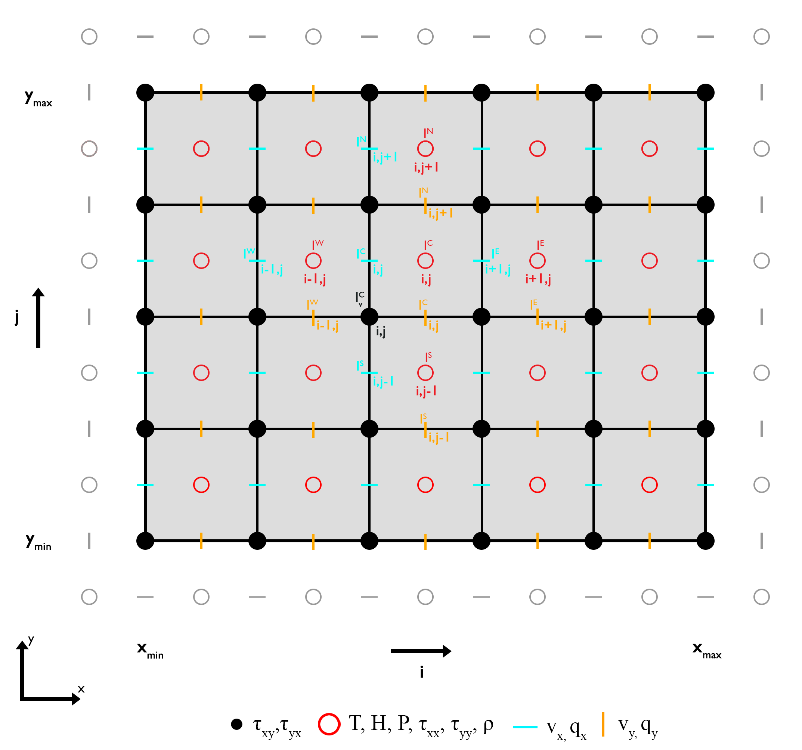
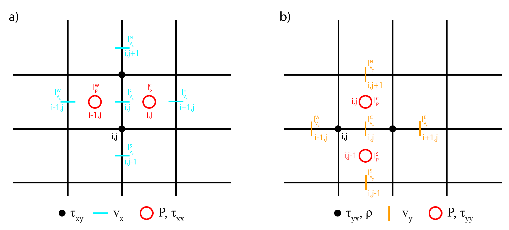
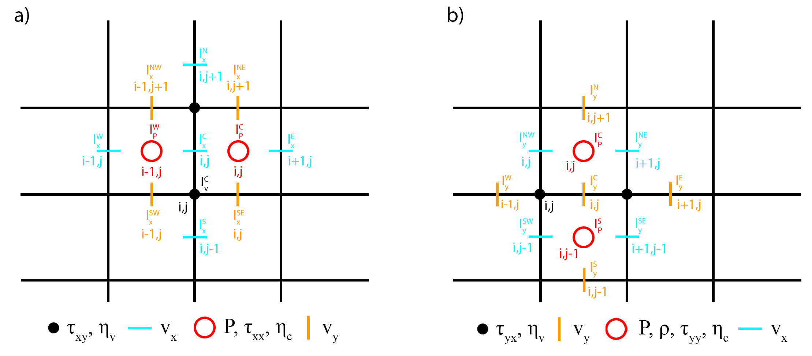
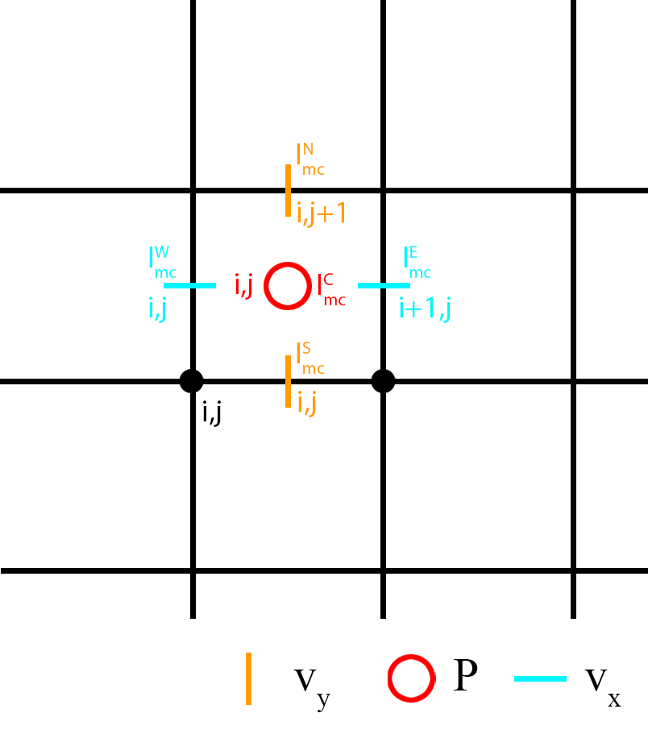
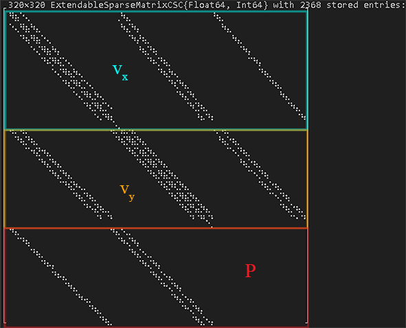

# Stokes Equation (2D)

The Stokes equation in two dimensions is defined as: 

$\begin{equation}
0 = -\frac{\partial{P}}{\partial{x_i}} + \frac{\partial}{\partial{x_j}}\tau_{ij} + \rho g_i, 
\end{equation}$

where $P$ is the total pressure in [ $Pa$ ],  $\rho$ is the density in [ $kg/m^3$ ], $g_i$ the gravitational acceleration vector in [ $m/s^2$ ], $\frac{\partial}{\partial{x_i}}$ the spatial derivative in the direction of $x_i$, and $\tau_{ij}$ is the deviatoric stress tensor in [ $Pa$ ] and defined as: 

$\begin{equation}
\tau_{ij} = 2\eta \dot{\varepsilon}_{ij}, 
\end{equation}$

where $\eta$ is the dynamic viscosity in [ $Pa s$ ] and $\dot{\varepsilon}_{ij}$ is the strain-rate tensor in [ $1/s$ ] and given as: 

$\begin{equation}
\dot{\varepsilon}_{ij} = \frac{1}{2} \left( \frac{\partial{v_i}}{\partial{x_j}} + \frac{\partial{v_j}}{\partial{x_i}} \right),
\end{equation}$

where $v_i$ is the velocity in [ $m/s$ ] in the $i$-th direction. 

The stokes equation provides two equations for three unknowns, $v_x$, $v_y$, and $P$. Thus, to solve for the third unknown one needs an additional equation, the *mass conservation equation*. 

The *conservation equation of mass* is defined as (assuming an incompressible medium): 

$\begin{equation}
div\left(\overrightharpoon{v} \right) = \left(\frac{\partial{v_i}}{\partial{x_i}}+\frac{\partial{v_j}}{\partial{x_j}}\right) = 0.
\end{equation}$ 

## Discretization 

The conservation equations of *momentum* and *mass* are solved properly in two dimensions ($x$ and $y$) using a staggered finite difference grid, where the horizontal (*cyan dashes*) and vertical (*orange dashes*) velocities are defined in between the regular grid points or *vertices*, and the pressure (*red circles*) within a finite difference cells or *centroids* (Figure 1). A staggered grid enables the conservation of the stress between adjacent grid points and care needs to be taken where the corresponding parameters are defined. 

**Figure 1. Staggered finite difference grid for the momentum equation.** Discretization of the conservation equations of *momemtum* and *mass*. The horizontal and vertical velocities require *ghost nodes* at the **North**, **South**, **East**, and **West** boundary, respectively.

---------------------
---------------------

## Constant Viscosity

Let's first assume a special case of the Stokes equation, a **constant viscosity**, which simplifies equation $(1)$ to: 

$\begin{equation}
0 = -\frac{\partial{P}}{\partial{x_i}} + 2\eta\frac{\partial^2{v_i}}{\partial{x_i^2}} + \eta\left(\frac{\partial^2{v_i}}{\partial{x_j^2}}+\frac{\partial^2{v_j}}{\partial{x_i^2}}\right) + \rho g_i. 
\end{equation}$

Using equation $(4)$ and neglecting a horizontal graviational acceleration, equation $(5)$ can further be simplified to: 

*$x$-component* 

$\begin{equation}
-\frac{\partial{P}}{\partial{x}} + \eta\frac{\partial^2{v_x}}{\partial{x^2}} + \eta\frac{\partial^2{v_x}}{\partial{y^2}} = 0, 
\end{equation}$

*$y$-component*

$\begin{equation}
-\frac{\partial{P}}{\partial{y}} + \eta\frac{\partial^2{v_y}}{\partial{y^2}} + \eta\frac{\partial^2{v_y}}{\partial{x^2}} = - \rho g_y. 
\end{equation}$

For each equation, one can define a so-called numerical stencil which highlights the position of the required parameters with respect to a central point $(i,j)$, where $i$ and $j$ are the indices in the horizontal and vertical direction, respectively, for each parameter dimension. The central point also corresponds to the number of the equation in the linear system of equations. 

### Stencil

The stencils for the *momentum equation* assuming a constant viscosity show the grid points (parameter) required to solve the equations for each component of the *momentum equation* using the finite difference approach (Figure 2). 

**Figure 2. Numerical stencils for a constant viscosity.** a) *$x$-component*. b) *$y$-component*.

Using the finite difference approximations for the partial derivatives, equations $(6)$ and $(7)$ are defined as: 

*$x$-component*

$\begin{equation}\begin{gather*}
& -\frac{P_{i,j}-P_{i-1,j}}{\Delta{x}} + \\ & \eta\frac{v_{x,(i-1,j)}-2v_{x,(i,j)}+v_{x,(i+1,j)}}{\Delta{x^2}} + \\ &  \eta\frac{v_{x,(i,j-1)}-2v_{x,(i,j)}+v_{x,(i,j+1)}}{\Delta{y^2}} = 0.
\end{gather*}\end{equation}$

Rearranging and sorting the variables results in: 

$\begin{equation}\begin{gather*}
& P_CP_{i,j} + P_WP_{i-1,j} + \\ & Sv_{x,(i,j-1)} +  Wv_{x,(i-1,j)} + \\ & Cv_{x,(i,j)} + \\ & E v_{x,(i+1,j)} + N v_{x,(i,j+1)} = 0, 
\end{gather*}\end{equation}$

where 

$\begin{equation}
\begin{split}
P_C & = -\frac{1}{\Delta{x}},  \\
P_W & = \frac{1}{\Delta{x}}, \\
S & = \frac{\eta}{\Delta{y^2}}, \\
W & = \frac{\eta}{\Delta{x^2}}, \\
C & = -2\eta\left(\frac{1}{\Delta{x^2}}+\frac{1}{\Delta{y^2}}\right), \\
E & = \frac{\eta}{\Delta{x^2}}, \\
N & = \frac{\eta}{\Delta{y^2}}. \\
\end{split}
\end{equation}$

*$y$-component*

$\begin{equation}\begin{gather*}
& -\frac{P_{i,j}-P_{i,j-1}}{\Delta{y}} + \\ & \eta\frac{v_{y,(i,j-1)}-2v_{y,(i,j)}+v_{x,(i,j+1)}}{\Delta{y^2}} + \\ & \eta\frac{v_{y,(i-1,j)}-2v_{y,(i,j)}+v_{y,(i+1,j)}}{\Delta{x^2}} = \\ & -\frac{\rho_{i,j}+\rho_{i+1,j}}{2} g_y.
\end{gather*}\end{equation}$

Rearranging and sorting the variables results in: 

$\begin{equation}\begin{gather*}
& P_SP_{i,j-1} + P_CP_{i,j} + \\ & Sv_{y,(i,j-1)} + Wv_{y,(i-1,j)} + \\ & Cv_{y,(i,j)} + \\ & E v_{y,(i+1,j)} + N v_{y,(i,j+1)} = \\ & -\frac{\rho_{i,j}+\rho_{i+1,j}}{2} g_y, 
\end{gather*}\end{equation}$

where 

$\begin{equation}
\begin{split}
P_S & = \frac{1}{\Delta{y}},  \\
P_C & = -\frac{1}{\Delta{y}}, \\
S & = \frac{\eta}{\Delta{y^2}}, \\
W & = \frac{\eta}{\Delta{x^2}}, \\
C & = -2\eta\left(\frac{1}{\Delta{x^2}}+\frac{1}{\Delta{y^2}}\right), \\
E & = \frac{\eta}{\Delta{x^2}}, \\
N & = \frac{\eta}{\Delta{y^2}}. \\
\end{split}
\end{equation}$

### Boundary Conditions

The most common boundary conditions for the *momentum equation* are a combination of *Dirichlet* and *Neumann* velocity boundary conditions: **free slip** and **no slip** boundary condition. 

---------------------

**Free slip** 

*Free slip* boundary conditions allow the fluid to move along the boundary assuming **no shear stress** and **no orthogonal velocity** along the boundary. That is, for the lateral boundaries **(East, West)** the conditions are: 

$\begin{equation}
\begin{split}
v_x = 0, \\
\frac{\partial{v_{y}}}{\partial{x}}=0,
\end{split}
\end{equation}$

and for the horizontal bounaries **(North, South)** the conditions are: 

$\begin{equation}
\begin{split}
v_y = 0, \\
\frac{\partial{v_{x}}}{\partial{y}}=0.
\end{split}
\end{equation}$

Solving the system of equations using a direct solution, one needs to modify the coefficients of the required points adjacent to the boundaries using the velocities defined at the *ghost nodes* **and** the right-hand side. 

*$x$-component*

For *free slip* boundary conditions one needs to define the horizontal velocity $v_x$ for the *ghost nodes* at the upper (**North**) and lower (**South**) boundary which are defined as (see equation $(15)$ ): 

*South*

$\begin{equation}
v_{x,(i,GS)} = v_{x,(i,1)},
\end{equation}$

*North*

$\begin{equation}
v_{x,(i,GN)} = v_{x,(i,ncy)}.
\end{equation}$

Along the lateral boundaries (**East**, **West**) we can simply set the velocity $v_x$ to zero (see equation $(14)$ ).

*$y$-component*

For the vertical velocity $v_y$ one needs to define the velocity at the *ghost nodes* for the left (**West**) and right (**East**) boundary as (see equation $(14)$ ): 

*West*

$\begin{equation}
v_{y,(GW,j)} = v_{y,(1,j)},
\end{equation}$

*East*

$\begin{equation}
v_{y,(GE,j)} = v_{y,(ncx,j)}.
\end{equation}$

Along the horizontal boundaries (**North**, **South**), we can simply set the velocity $v_y$ to zero (see equation $(15)$ ). 

Using the equations $(16)$ - $(19)$ the coefficients of the equations adjacent to the corresponding boundaries changes (the right-hand side actually does not change for *free slip* boundary conditions) to: 

*$x$-component* 

*South*

$\begin{equation}\begin{gather*}
& P_WP_{i-1,j}+P_CP_{i,j}+ \\ & Wv_{x,(i-1,j)}+ \\ & Cv_{x,(i,j)}+ \\ & Ev_{x,(i+1,j)}+Nv_{x,(i,j+1)} = 0,
\end{gather*}\end{equation}$

where 

$\begin{equation}C = -\frac{2\eta}{\Delta{x^2}}-\frac{\eta}{\Delta{y^2}}.\end{equation}$

*North*

$\begin{equation}\begin{gather*}
& P_WP_{i-1,j}+P_CP_{i,j}+ \\ & Sv_{x,(i,j-1)}+ Wv_{x,(i-1,j)}+ \\ & Cv_{x,(i,j)}+ \\ & Ev_{x,(i+1,j)} = 0,
\end{gather*}\end{equation}$

where 

$\begin{equation}C = -\frac{2\eta}{\Delta{x^2}}-\frac{\eta}{\Delta{y^2}}.\end{equation}$

Along the lateral boundaries (**East**, **West**), $C=1$ and the remaining coefficients are equal to zero.

*$y$-component* 

*West*

$\begin{equation}\begin{gather*}
& P_SP_{i,j-1}+P_CP_{i,j}+ \\ & Sv_{y,(i,j-1)}+ \\ & Cv_{y,(i,j)}+ \\ & Ev_{y,(i+1,j)}+ Nv_{y,(i,j+1)} = \\ & -\frac{\rho_{i,j}+\rho_{i+1,j}}{2} g_y,
\end{gather*}\end{equation}$

where 

$\begin{equation}C = -\frac{\eta}{\Delta{x^2}}-\frac{2\eta}{\Delta{y^2}}.\end{equation}$

*East*

$\begin{equation}\begin{gather*}
& P_SP_{i,j-1}+P_CP_{i,j}+ \\ & Sv_{y,(i,j-1)}+ Wv_{y,(i-1,j)}+ \\ & Cv_{y,(i,j)}+ \\ & Nv_{y,(i,j+1)} = \\ & -\frac{\rho_{i,j}+\rho_{i+1,j}}{2} g_y,
\end{gather*}\end{equation}$

where 

$\begin{equation}C = -\frac{\eta}{\Delta{x^2}}-\frac{2\eta}{\Delta{y^2}}.\end{equation}$

Along the horizontal boundaries (**North**, **South**), $C=1$ and the remaining coefficients are equal to zero.

--------------

**No slip** 

*No slip* boundary conditions fix the fluid along the boundary and set the horizontal and vertical velocity equal to zero. 

That is, for all boundaries (**East**, **West**, **South**, **North**) the conditions are: 

$\begin{equation}
\begin{split}
v_x = 0, \\
v_y = 0.
\end{split}
\end{equation}$

*$x$-component*

One needs the velocity at the *ghost nodes* for the horizontal velocity $v_x$ at the lower (**South**) and upper (**North**) boundary which are defined as: 

*South*

$\begin{equation}
v_{x,(i,GS)} = 2V_{BC,S} - v_{x,(i,1)},
\end{equation}$

where $V_{BC,S}$ is the velocity along the boundary (here 0).

*North*

$\begin{equation}
v_{x,(i,GN)} = 2V_{BC,N} - v_{x,(i,ncy)},
\end{equation}$

where $V_{BC,N}$ is the velocity along the boundary (here 0). 

Along the lateral boundaries (**East**, **West**) we can simply set the horizontal velocity $v_x$ to zero (as in the *free slip* case). 

*$y$-component* 

For the vertical velocity $v_y$ one needs to define the velocity at the *ghost nodes* for the left (**West**) and right (**East**) boundary as: 

*West*

$\begin{equation}
v_{y,(GW,j)} = 2V_{BC,W} - v_{y,(1,j)},
\end{equation}$

where $V_{BC,W}$ is the velocity along the boundary (here 0).

*East*

$\begin{equation}
v_{y,(GE,j)} = 2V_{BC,E} - v_{y,(ncx,j)},
\end{equation}$

where $V_{BC,E}$ is the velocity along the boundary (here 0). 

Along the horizontal boundaries (**North**, **South**), we can simply set the vertical velocity $v_y$ to zero (as in the *free slip* case). 

Using the equations $(29)$ - $(32)$ the coefficients of the equations adjacent to the corresponding boundaries and the right-hand side changes to: 

*$x$-component* 

*South*

$\begin{equation}\begin{gather*}
& P_WP_{i-1,j}+P_CP_{i,j}+ \\ & Wv_{x,(i-1,j)}+ \\ & Cv_{x,(i,j)}+ \\ & Ev_{x,(i+1,j)}+Nv_{x,(i,j+1)} = \\ & -2\frac{\eta}{\Delta{y^2}}V_{BC,S},
\end{gather*}\end{equation}$

where 

$\begin{equation}C = -\frac{2\eta}{\Delta{x^2}}-\frac{3\eta}{\Delta{y^2}}.\end{equation}$

*North*

$\begin{equation}\begin{gather*}
& P_WP_{i-1,j}+P_CP_{i,j}+ \\ & Sv_{x,(i,j-1)}+Wv_{x,(i-1,j)}+ \\ & Cv_{x,(i,j)}+ \\ & Ev_{x,(i+1,j)} = \\ & -2\frac{\eta}{\Delta{y^2}}V_{BC,N},
\end{gather*}\end{equation}$

where 

$\begin{equation}C = -\frac{2\eta}{\Delta{x^2}}-\frac{3\eta}{\Delta{y^2}}.\end{equation}$

Along the lateral boundaries (**East**, **West**), $C=1$ and the remaining coefficients and the right-hand side are equal to zero.

*$y$-component* 

*West*

$\begin{equation}\begin{gather*}
& P_SP_{i,j-1}+P_CP_{i,j}+ \\ & Sv_{y,(i,j-1)}+ \\ & Cv_{y,(i,j)}+ \\ & Ev_{y,(i+1,j)}+Nv_{y,(i,j+1)} = \\ & -\frac{\rho_{i,j} + \rho_{i+1,j}}{2} g_y - 2\frac{\eta}{\Delta{x^2}}V_{BC,W},
\end{gather*}\end{equation}$

where 

$\begin{equation}C = -\frac{3\eta}{\Delta{x^2}}-\frac{2\eta}{\Delta{y^2}}.\end{equation}$

*East*

$\begin{equation}\begin{gather*}
& P_SP_{i,j-1}+P_CP_{i,j}+ \\ & Sv_{y,(i,j-1)}+Wv_{y,(i-1,j)}+ \\ & Cv_{y,(i,j)}+ \\ & Nv_{y,(i,j+1)} = \\ & -\frac{\rho_{i,j} + \rho_{i+1,j}}{2} g_y - 2\frac{\eta}{\Delta{x^2}}V_{BC,W},
\end{gather*}\end{equation}$

where 

$\begin{equation}C = -\frac{3\eta}{\Delta{x^2}}-\frac{2\eta}{\Delta{y^2}}.\end{equation}$

Along the horizontal boundaries (**East**, **West**), $C=1$ and the remaining coefficients and the right-hand side are equal to zero.

For more details on how this is implemented, please see the [source code](https://github.com/GeoSci-FFM/GeoModBox.jl/blob/main/src/MomentumEquation/2Dsolvers.jl).

-------------
-------------

## Variable Viscosity

In case of a variable viscosity, equation $(1)$ is given in the form of the unknowns as: 

*$x$-component*

$\begin{equation}
-\frac{\partial{P}}{\partial{x}} + \frac{\partial{}}{\partial{x}}\left(2\eta_c\frac{\partial{v_x}}{\partial{x}}\right)+\frac{\partial{}}{\partial{y}}\left( \eta_v\left(\frac{\partial{v_x}}{\partial{y}} + \frac{\partial{v_y}}{\partial{x}}\right)\right) = 0,
\end{equation}$

and

*$y$-component*

$\begin{equation}
-\frac{\partial{P}}{\partial{y}} + \frac{\partial{}}{\partial{y}}\left(2\eta_c\frac{\partial{v_y}}{\partial{y}}\right)+\frac{\partial{}}{\partial{x}}\left( \eta_v\left(\frac{\partial{v_y}}{\partial{x}} + \frac{\partial{v_x}}{\partial{y}}\right)\right) = -\frac{\rho_{i,j}+\rho_{i+1,j}}{2}g_y,
\end{equation}$

where $\eta_c$ is the viscosity at the *centroids* and $\eta_v$ the viscosity at the *vertices*. 

### Stencil

The stencils for the *momentum equation* assuming a variable viscosity show the grid points (parameter) required to solve the equations for each component of the *momentum equation* using the finite difference approach (Figure 3).

**Figure 3.** **Numerical stencils for a variable viscosity.** a) *$x$-component*, b) *$y$-component*.  

**Note**: In the following, the index $(i,j)$ for each parameter $\left(v_x, v_y, P, \eta_c,\ \textrm{and}\  \eta_v\right)$ is always referring to the central point of the stencil of each parameter grid (see Figure 3). 

Using the finite difference approximations for the partial derivatives, equations $(41)$ and $(42)$ are defined as: 

*$x$-component*

$\begin{equation}
-\frac{P_{i,j}-P_{i-1,j}}{\Delta{x}}+\frac{\tau_{xx,(i,j)} -\tau_{xx,(i-1,j)}}{\Delta{x}} + \frac{\tau_{xy,(i,j+1)}-\tau_{xy,(i,j)}}{\Delta{y}} = 0,
\end{equation}$

or

$\begin{equation}\begin{gather*}
& -\frac{P_{i,j}-P_{i-1,j}}{\Delta{x}}+\\ & \frac{2\eta_{c,(i,j)}\frac{\partial{v_x}}{\partial{x}}\vert_{i,j} -2\eta_{c,(i-1,j)}\frac{\partial{v_x}}{\partial{x}}\vert_{i-1,j}}{\Delta{x}} + \\ & \frac{\eta_{v,(i,j+1)}\left(\frac{\partial{v_x}}{\partial{y}}\vert_{i,j+1}+\frac{\partial{v_y}}{\partial{x}}\vert_{i,j+1}\right)-\eta_{v,(i,j)}\left(\frac{\partial{v_x}}{\partial{y}}\vert_{i,j}+\frac{\partial{v_y}}{\partial{x}}\vert_{i,j}\right)}{\Delta{y}} = 0,
\end{gather*}\end{equation}$

and in the form of the unknowns: 

$\begin{equation}\begin{gather*}
& -\frac{P_{i,j}-P_{i-1,j}}{\Delta{x}}+ \\ & \frac{2\eta_{c,(i,j)}}{\Delta{x}}\left(\frac{v_{x,(i+1,j)}-v_{x,(i,j)}}{\Delta{x}}\right) - \\ & \frac{2\eta_{c,(i-1,j)}}{\Delta{x}}\left(\frac{v_{x,(i,j)}-v_{x,(i-1,j)}}{\Delta{x}}\right)+ \\ & \frac{\eta_{v,(i,j+1)}}{\Delta{y}}\left(\frac{v_{x,(i,j+1)}-v_{x,(i,j)}}{\Delta{y}} + \frac{v_{y,(i,j+1)}-v_{y,(i-1,j+1)}}{\Delta{x}}\right) - \\ &  \frac{\eta_{v,(i,j)}}{\Delta{y}}\left(\frac{v_{x,(i,j)}-v_{x,(i,j-1)}}{\Delta{y}} + \frac{v_{y,(i,j)}-v_{y,(i-1,j)}}{\Delta{x}}\right) = 0.
\end{gather*}\end{equation}$

Rearranging and sorting the variables results in: 

$\begin{equation}\begin{gather*}
& P_WP_{i-1,j}+P_CP_{i,j} + \\ & Sv_{x,(i,j-1)}+SWv_{y,(i-1,j)}+SEv_{y,(i,j)}+Wv_{x,(i-1,j)}+ \\ & Cv_{x,(i,j)} + \\ & Ev_{x,(i+1,j)} + NWv_{y,(i-1,j+1)} + NEv_{y,(i,j+1)} + Nv_{x,(i,j+1)} = \\ & 0, 
\end{gather*}\end{equation}$

where

$\begin{equation}\begin{split}
P_W & = \frac{1}{\Delta{x}} ,\\
P_C & = -\frac{1}{\Delta{x}}, \\
S & = \frac{\eta_{v,(i,j)}}{\Delta{y^2}},\\
SW & = \frac{\eta_{v,(i,j)}}{\Delta{x}\Delta{y}},\\
SE & = -\frac{\eta_{v,(i,j)}}{\Delta{x}\Delta{y}},\\
W & = \frac{2\eta_{c,(i-1,j)}}{\Delta{x^2}},\\
C & = -\frac{2}{\Delta{x^2}}\left(\eta_{c,(i,j)}+\eta_{c,(i-1,j)}\right)-\frac{1}{\Delta{y^2}}\left(\eta_{v,(i,j+1)} + \eta_{v,(i,j)} \right), \\
E & = \frac{2\eta_{c,(i,j)}}{\Delta{x^2}},\\
NW & = -\frac{\eta_{v,(i,j+1)}}{\Delta{x}\Delta{y}},\\
NE & = \frac{\eta_{v,(i,j+1)}}{\Delta{x}\Delta{y}},\\
N & = \frac{\eta_{v,(i,j+1)}}{\Delta{y^2}}.\\
\end{split}\end{equation}$

*$y$-component*

$\begin{equation}
-\frac{P_{i,j}-P_{i,j-1}}{\Delta{y}}+\frac{\tau_{yy,(i,j)} - \tau_{yy,(i,j-1)}}{\Delta{y}} + \frac{\tau_{yx,(i+1,j)}-\tau_{yx,(i,j)}}{\Delta{x}} = -\frac{\rho_{i,j}+\rho_{i+1,j}}{2} g_y,
\end{equation}$

or 

$\begin{equation}\begin{gather*}
& -\frac{P_{i,j}-P_{i,j-1}}{\Delta{y}}+ \\ & \frac{2\eta_{c,(i,j)}\frac{\partial{v_y}}{\partial{y}}\vert_{i,j} -2\eta_{c,(i,j-1)}\frac{\partial{v_y}}{\partial{y}}\vert_{i,j-1}}{\Delta{y}} + \\ & \frac{\eta_{v,(i+1,j)}\left(\frac{\partial{v_y}}{\partial{x}}\vert_{i+1,j}+\frac{\partial{v_x}}{\partial{y}}\vert_{i+1,j}\right)-\eta_{v,(i,j)}\left(\frac{\partial{v_y}}{\partial{x}}\vert_{i,j}+\frac{\partial{v_x}}{\partial{y}}\vert_{i,j}\right)}{\Delta{x}} = \\ & -\frac{\rho_{i,j}+\rho_{i+1,j}}{2} g_y,
\end{gather*}\end{equation}$

and in the form of the unknowns: 

$\begin{equation}\begin{gather*}
& -\frac{P_{i,j}-P_{i,j-1}}{\Delta{y}}+ \\ & \frac{2\eta_{c,(i,j)}}{\Delta{y}}\left(\frac{v_{y,(i,j+1)}-v_{y,(i,j)}}{\Delta{y}}\right) - \\ & \frac{2\eta_{c,(i,j-1)}}{\Delta{y}}\left(\frac{v_{y,(i,j)}-v_{y,(i,j-1)}}{\Delta{y}}\right)+ \\ & \frac{\eta_{v,(i+1,j)}}{\Delta{x}}\left(\frac{v_{y,(i+1,j)}-v_{y,(i,j)}}{\Delta{x}} + \frac{v_{x,(i+1,j)}-v_{x,(i+1,j-1)}}{\Delta{y}}\right) - \\ & \frac{\eta_{v,(i,j)}}{\Delta{x}}\left(\frac{v_{y,(i,j)}-v_{y,(i-1,j)}}{\Delta{x}} + \frac{v_{x,(i,j)}-v_{x,(i,j-1)}}{\Delta{y}}\right) = \\ & -\frac{\rho_{i,j}+\rho_{i+1,j}}{2} g_y.
\end{gather*}\end{equation}$

Rearranging and sorting the variables results in: 

$\begin{equation}\begin{gather*}
& P_CP_{i,j}+P_SP_{i,j-1} + \\ & Sv_{y,(i,j-1)}+SWv_{x,(i,j-1)}+SEv_{x,(i+1,j-1)}+Wv_{y,(i-1,j)}+ \\ & Cv_{y,(i,j)} + \\ & Ev_{y,(i+1,j)} + NWv_{x,(i,j)} + NEv_{x,(i+1,j)} + Nv_{y,(i,j+1)} = \\ & -\frac{\rho_{i,j}+\rho_{i+1,j}}{2} g_y, 
\end{gather*}\end{equation}$

where

$\begin{equation}\begin{split}
P_S & = \frac{1}{\Delta{y}}, \\
P_C & = -\frac{1}{\Delta{y}}, \\
S & = \frac{2\eta_{c,(i,j-1)}}{\Delta{y^2}},\\
SW & = \frac{\eta_{v,(i,j)}}{\Delta{x}\Delta{y}},\\
SE & = -\frac{\eta_{v,(i+1,j)}}{\Delta{x}\Delta{y}},\\
W & = \frac{\eta_{v,(i,j)}}{\Delta{x^2}},\\
C & = -\frac{2}{\Delta{y^2}}\left(\eta_{c,(i,j)}+\eta_{c,(i,j-1)}\right)-\frac{1}{\Delta{x^2}}\left(\eta_{v,(i+1,j)} + \eta_{v,(i,j)} \right), \\
E & = \frac{\eta_{v,(i+1,j)}}{\Delta{x^2}},\\
NW & = -\frac{\eta_{v,(i,j)}}{\Delta{x}\Delta{y}},\\
NE & = \frac{\eta_{v,(i+1,j)}}{\Delta{x}\Delta{y}},\\
N & = \frac{2\eta_{c,(i,j)}}{\Delta{y^2}}.\\
\end{split}\end{equation}$

### Boundary Conditions

The velocities for the *ghost nodes* to define the different velocity boundary conditions are the same as described for the constant viscosity case.

-------------

**Free Slip**

Using the equations $(16)$ - $(19)$ the coefficients of the equations adjacent to the corresponding boundaries changes (the right-hand side actually does not change for *free slip* boundary conditions) to: 

*$x$-component* 

*South*

$\begin{equation}\begin{gather*}
& P_WP_{i-1,j}+P_CP_{i,j} +\\ & SWv_{y,(i-1,j)}+SEv_{y,(i,j)}+Wv_{x,(i-1,j)}+\\ & Cv_{x,(i,j)}+\\ & Ev_{x,(i+1,j)}+NWv_{y,(i-1,j+1)}+NEv_{y,(i,j+1)}+Nv_{x,(i,j+1)} = 0,
\end{gather*}\end{equation}$

where 

$\begin{equation}C = -\frac{2}{\Delta{x^2}} \left( \eta_{c,(i,j)} + \eta_{c,(i-1,j)} \right) - \frac{\eta_{v,(i,j+1)}}{\Delta{y^2}}.\end{equation}$

*North*

$\begin{equation}\begin{gather*}
& P_WP_{i-1,j}+P_CP_{i,j}+\\ & Sv_{x,(i,j-1)}+SWv_{y,(i-1,j)}+SEv_{y,(i,j)}+Wv_{x,(i-1,j)}+\\ & Cv_{x,(i,j)}+ \\ & Ev_{x,(i+1,j)}+NWv_{y,(i-1,j+1)}+NEv_{y,(i,j+1)} = 0,
\end{gather*}\end{equation}$

where 

$\begin{equation}C = -\frac{2}{\Delta{x^2}}\left(\eta_{c,(i,j)}+\eta_{c,(i-1,j)}\right)-\frac{\eta_{v,(i,j)}}{\Delta{y^2}}.\end{equation}$

Along the lateral boundaries (**East**, **West**), $C=1$ and the remaining coefficients are equal to zero.

*$y$-component* 

*West* 

$\begin{equation}\begin{gather*}
& P_CP_{i,j}+P_SP_{i,j-1} + \\ & Sv_{y,(i,j-1)} + SWv_{x,(i,j-1)} + SEv_{x,(i+1,j-1)} + \\ & Cv_{y,(i,j)} + \\ & Ev_{y,(i+1,j)} + NWv_{x,(i,j)} + NEv_{x,(i+1,j)} + Nv_{y,(i,j+1)} = \\ & -\frac{\rho_{i,j}+\rho_{i+1,j}}{2} g_y, 
\end{gather*}\end{equation}$

where 

$\begin{equation}C = -\frac{2}{\Delta{y^2}}\left(\eta_{c,(i,j)}+\eta_{c,(i,j-1)}\right)-\frac{\eta_{v,(i+1,j)}}{\Delta{x^2}}.\end{equation}$

*East* 

$\begin{equation}\begin{gather*}
& P_CP_{i,j} + P_SP_{i,j-1} + \\ & Sv_{y,(i,j-1)} + SWv_{x,(i,j-1)} + SEv_{x,(i+1,j-1)} + Wv_{y,(i-1,j)} + \\ & Cv_{y,(i,j)} + \\ & NWv_{x,(i,j)} + NEv_{x,(i+1,j)} + Nv_{y,(i,j+1)} = \\ & -\frac{\rho_{i,j}+\rho_{i+1,j}}{2} g_y, 
\end{gather*}\end{equation}$

where 

$\begin{equation}C = -\frac{2}{\Delta{y^2}}\left(\eta_{c,(i,j)}+\eta_{c,(i,j-1)}\right)-\frac{\eta_{v,(i,j)}}{\Delta{x^2}}.\end{equation}$

Along the horizontal boundaries (**North**, **South**), $C=1$ and the remaining coefficients are equal to zero.

-------------

**No Slip**

Using the equations $(29)$ - $(32)$ the coefficients of the equations adjacent to the corresponding boundaries and the right-hand side changes to: 

*$x$-component* 

*South*

$\begin{equation}\begin{gather*}
& P_WP_{i-1,j}+P_CP_{i,j}+ \\ & SWv_{y,(i-1,j)}+SEv_{y,(i,j)}+Wv_{x,(i-1,j)}+ \\ & Cv_{x,(i,j)}+ \\ & Ev_{x,(i+1,j)}+NWv_{y,(i-1,j+1)}+NEv_{y,(i,j+1)}+Nv_{x,(i,j+1)} = \\ & -2\frac{\eta_{v,(i,j)}}{\Delta{y^2}}V_{BC,S},
\end{gather*}\end{equation}$

where 

$\begin{equation}C = -\frac{2}{\Delta{x^2}}\left(\eta_{c,(i,j)}+\eta_{c,(i-1,j)}\right)-\frac{\eta_{v,(i,j+1)}}{\Delta{y^2}}-\frac{2\eta_{v,(i,j)}}{\Delta{y^2}}.\end{equation}$

*North* 

$\begin{equation}\begin{gather*}
& P_WP_{i-1,j}+P_CP_{i,j}+ \\ & Sv_{x,(i,j-1)}+SWv_{y,(i-1,j)}+SEv_{y,(i,j)}+Wv_{x,(i-1,j)}+ \\ & Cv_{x,(i,j)}+ \\ & Ev_{x,(i+1,j)}+NWv_{y,(i-1,j+1)}+NEv_{y,(i,j+1)} = \\ & -2\frac{\eta_{v,(i,j+1)}}{\Delta{y^2}}V_{BC,N},
\end{gather*}\end{equation}$

where 

$\begin{equation}C = -\frac{2}{\Delta{x^2}}\left(\eta_{c,(i,j)}+\eta_{c,(i-1,j)}\right)-\frac{2\eta_{v,(i,j+1)}}{\Delta{y^2}}-\frac{\eta_{v,(i,j)}}{\Delta{y^2}}.\end{equation}$

Along the lateral boundaries (**East**, **West**), $C=1$ and the remaining coefficients and the right-hand side are equal to zero.

*$y$-component* 

*West* 

$\begin{equation}\begin{gather*}
& P_CP_{i,j} + P_SP_{i,j-1} + \\ & Sv_{y,(i,j-1)} + SWv_{x,(i,j-1)} + SEv_{x,(i+1,j-1)} + \\ & Cv_{y,(i,j)} + \\ & Ev_{y,(i+1,j)} + NWv_{x,(i,j)} + NEv_{x,(i+1,j)} + Nv_{y,(i,j+1)} = \\ & -\frac{\rho_{i,j}+\rho_{i+1,j}}{2} g_y - 2\frac{\eta_{v,(i,j)}}{\Delta{x^2}}V_{BC,W}, 
\end{gather*}\end{equation}$

where 

$\begin{equation}C = -\frac{2}{\Delta{y^2}}\left(\eta_{c,(i,j)}+\eta_{c,(i,j-1)}\right)-\frac{\eta_{v,(i+1,j)}}{\Delta{x^2}}-2\frac{\eta_{v,(i,j)}}{\Delta{x^2}}.\end{equation}$

*East*

$\begin{equation}\begin{gather*}
& P_CP_{i,j} + P_SP_{i,j-1} + \\ & Sv_{y,(i,j-1)} + SWv_{x,(i,j-1)} + SEv_{x,(i+1,j-1)} + Wv_{y,(i-1,j)} + \\ & Cv_{y,(i,j)} + \\ & NWv_{x,(i,j)} + NEv_{x,(i+1,j)} + Nv_{y,(i,j+1)} = \\ & -\frac{\rho_{i,j}+\rho_{i+1,j}}{2} g_y -2\frac{\eta_{v,(i+1,j)}}{\Delta{x^2}}V_{BC,E}, 
\end{gather*}\end{equation}$

where 

$\begin{equation}C = -\frac{2}{\Delta{y^2}}\left(\eta_{c,(i,j)}+\eta_{c,(i,j-1)}\right)-\frac{2\eta_{v,(i+1,j)}}{\Delta{x^2}}-\frac{\eta_{v,(i,j)}}{\Delta{x^2}}.\end{equation}$

Along the horizontal boundaries (**North**, **South**), $C=1$ and the remaining coefficients and the right-hand side are equal to zero.

For more details on how this is implemented, please see the [source code](https://github.com/GeoSci-FFM/GeoModBox.jl/blob/main/src/MomentumEquation/2Dsolvers.jl).

-------------
-------------

## Continuum Equation 

The continuum equation provides a third equation helping to solve for the third unknown $P$. 

### Stencil

The corresponding numerical stencil only includes the horizontal and vertical velocity (Fig. 4).

**Figure 4. Numerical stencil for the continuum equation.** 

Using the finite difference operators equations $(3)$ is defined as: 

$\begin{equation}
\frac{v_{x,(i+1,j)}-v_{x,(i,j)}}{\Delta{x}} + \frac{v_{y,(i,j+1)}-v_{y,(i,j)}}{\Delta{y}} = 0,
\end{equation}$

$\begin{equation}
C_xv_{x,(i,j)} + E_xv_{x,(i+1,j)} + C_yv_{y,(i,j)} + N_yv_{y,(i,j+1)} = 0,
\end{equation}$

where 

$\begin{equation}
\begin{split}
-C_x = E_x = \frac{1}{\Delta{x}}, \\
-C_y = N_y = \frac{1}{\Delta{y}}.
\end{split}
\end{equation}$

## Solution 

To solve the linear system of equations, one needs to collect the coefficients for the coefficient matrix $\bold{K}$ and set up the righ-hand side $\overrightharpoon{rhs}$ (at least for the direct solution). 

To set up the coefficient matrix $\bold{K}$, one needs to use a consecutive numbering for each unknown variable grid point, corresponding to one equation. Here, we first number the equations of each corresponding central reference point $(i,j)$ for the *$x$-component* of the *momentum equation* (that is for the unknown $v_x$), followed by its *$y$-component* (the unknown $v_y$), and at last the equations of the *conservation of mass* (for the unknown $P$). 

The numbering for each equation is then defined as: 

*$x$-compnent* ($v_x$) 

$\begin{equation}
ii_x = 1\ \textrm{--}\ \left(nv_x \cdot nc_y\right),
\end{equation}$

*$y$-component* ($v_y$)

$\begin{equation}
ii_y = \left(nv_x \cdot nc_y + 1 \right)\ \textrm{--}\ \left(nv_x \cdot nc_y + nc_x \cdot nv_y\right),
\end{equation}$

*conituum equation* ($P$)

$\begin{equation}
ii_p = \left(nv_x \cdot nc_y + nc_x \cdot nv_y + 1\right)\ \textrm{--}\ \left(nv_x \cdot nc_y + nc_x \cdot nv_y + nc_x \cdot nc_y\right),
\end{equation}$

where $nc_i$ and $nv_i$ are the numbers of *centroids* and *vertices* in the $i$-th direction, respectively. 

Each *line* $(ii)$ of the coefficient matrix $\bold{K}$ belongs to an equation. The coefficients $K[ii_j,i_k]$ for the grid points of the unknown variables in the numerical stencils (Fig. 2-4) are located in the corresponding columns $i_k$ of each line (relative to the central point $\left[ii_j,i_c\right]$). The numbering of the coefficients remains the same independent of the state of the viscosity, however, if the viscosity is variable additional coefficients for the *momentum equation* are added to the matrix.

*Constant Viscosity*

*$x$-component*

$\begin{equation}\begin{split}
i_S & = ii_x - nv_x, \\
i_W & = ii_x - 1, \\
i_C & = ii_x, \\
i_E & = ii_x + 1, \\
i_N & = ii_x + nv_x. 
\end{split}\end{equation}$

*$y$-component*

$\begin{equation}\begin{split}
i_S & = ii_y - nc_x, \\
i_W & = ii_y - 1, \\
i_C & = ii_y, \\
i_E & = ii_y + 1, \\
i_N & = ii_y + nc_x. 
\end{split}\end{equation}$

*Variable Viscosity*

*$x$-component*

$\begin{equation}\begin{split}
i_S & = ii_x - nv_x, \\
i_{SW} & = ii_y - 1, \\
i_{SE} & = ii_y, \\
i_W & = ii_x - 1, \\
i_C & = ii_x, \\
i_E & = ii_x + 1, \\
i_{NW} & = ii_y + nc_x, \\
i_{NE} & = ii_y + nc_x + 1, \\
i_N & = ii_x + nv_x. 
\end{split}\end{equation}$

*$y$-component*

$\begin{equation}\begin{split}
i_S & = ii_y - nc_x, \\
i_{SW} & = ii_x - nv_x, \\
i_{SE} & = ii_x - nv_x + 1, \\
i_W & = ii_y - 1, \\
i_C & = ii_y, \\
i_E & = ii_y + 1, \\
i_{NW} & = ii_x, \\
i_{NE} & = ii_x + 1, \\
i_N & = ii_y + nc_x. 
\end{split}\end{equation}$

The coefficients for the *conservation of mass* remain the same independent of the state of the viscosity. 

*continuum (P)*

$\begin{equation}\begin{split}
i_S & = ii_y, \\
i_W & = ii_x, \\
i_C & = ii_p, \\
i_E & = ii_x + 1, \\
i_N & = ii_y + nc_x. 
\end{split}\end{equation}$

This results in a coefficient matrix $\bold{K[ii_j,i_k]}$ in the form of: 

**Figure 5. Coefficient matrix, constant viscosity.** Non-zero entries of a coefficient matrix for a resolution of $nc_x=nc_y=10$ and a constant viscosity. Highlighted are the areas for the different equations: $v_x$ - *$x$-component* of the momentum equation, $v_y$ - *$y$-component* of the momentum equation, $P$ - continuum equation. 

**Figure 6. Coefficient matrix, variable viscosity.** Non-zero entries of a coefficient matrix for a resolution of $nc_x=nc_y=10$ and a variable viscosity. Highlighted are the areas for the different equations: $v_x$ - *$x$-component* of the momentum equation, $v_y$ - *$y$-component* of the momentum equation, $P$ - continuum equation. 

The right-hand side vector $\overrightharpoon{rhs}$ is given by the boundary and initial conditions (see equations $(13)$ - $(31)$ ). 

### Direct 

Using a direct solution method, one needs to do a right division of the coefficient matrix by the right-hand side to obtain the solution vector: 

$\begin{equation}
\bold{K} \backslash \overrightharpoon{rhs} = \overrightharpoon{x}.
\end{equation}$

### Defect Correction

The defect correction method is very helpful, in case the system is non-linear. First, one needs to calculate the residual for each equation, where the unknowns are given by an initial guess (usually all equal to zero and the boundary conditions): 

*Residual calculation* 

$\begin{equation}\begin{split}
R_x & = \frac{\partial{\tau_{xx}}}{\partial{x}} + \frac{\partial{\tau_{xy}}}{\partial{y}} - \frac{\partial{P}}{\partial{x}}, \\
R_y & = \frac{\partial{\tau_{yy}}}{\partial{y}} + \frac{\partial{\tau_{yx}}}{\partial{x}} - \frac{\partial{P}}{\partial{y}} + \rho g_y, \\
R_p & = \frac{\partial{v_x}}{\partial{x}} + \frac{\partial{v_y}}{\partial{y}},
\end{split}\end{equation}$

and in form of the finite difference operators: 

$\begin{equation}\begin{split}
R_x & = \frac{\tau_{xx,(i,j)}-\tau_{xx,(i-1,j)}}{\Delta{x}} + \frac{\tau_{xy,(i,j+1)}-\tau_{xy,(i,j)}}{\Delta{y}} - \frac{P_{i,j}-P_{i-1,j}}{\Delta{x}}, \\
R_y & = \frac{\tau_{yy,(i,j)}-\tau_{yy,(i,j-1)}}{\Delta{y}} + \frac{\tau_{yx,(i+1,j)}-\tau_{yx,(i,j)}}{\Delta{x}} - \frac{P_{i,j}-P_{i,j-1}}{\Delta{y}} + \frac{\rho_{i,j}+\rho_{i+1,j}}{2} g_y, \\
R_p & = \frac{v_{x,(i+1,j)}-v_{x,(i,j)}}{\Delta{x}} + \frac{v_{y,(i,j+1)}-v_{y,(i,j)}}{\Delta{y}}.
\end{split}\end{equation}$

If the velocities do not lie directly on the boundaries, they can be calculated via equations $(16)$ - $(19)$ for *free slip* and via equations $(29)$ - $(32)$ for *no slip* boundary condtions. The stresses are either calculated via the viscosity at the *vertices* or the *centroids*. Similar to the direct method, the residuals $R_x, R_y, \textrm{ and }, R_p$ are stored in a vector $R$ with the numbering of each equation as shown in equations $(75)$ - $(79)$. The coefficient matrix $\bold{K}$ is the same as described before. For more details on the defect correction method for the stokes equation see the [1-D documentation](./MomentumOneD.md).

The correction term is calculated via the residual and the coefficient matrix as: 

$\begin{equation}
\delta=- \bold{K} \backslash R.
\end{equation}$

$\delta$ is a vector with the dimensions $\left(nv_x \cdot nc_y + nc_x \cdot nv_y + nc_x \cdot nc_y\right)$, that is the total number of equations of all unknowns $\left(v_x, v_y, P\right)$. Finally one needs to update the inital guess by the correction term: 

$\begin{equation}\begin{split}
v_x & = v_{x,i} + \delta{v_x}, \\
v_y & = v_{y,i} + \delta{v_y}, \\
P & = P_{i} + \delta{P},
\end{split}\end{equation}$

where the indices of the vector $\delta$ correspond to the indices of the unknowns $\left(v_x, v_y, P\right)$ as shown in equations $(72)$ - $(74)$.

**Note:** To updated the array of the unknowns $v_x, v_y, P$, one need to assign the elements of the one-dimensional vector $\delta$ to the two-dimensional array following the numbering shown in equations $(72)$ -$(74)$.

For more information on how both methods are implemented see the [examples](https://github.com/GeoSci-FFM/GeoModBox.jl/blob/main/examples/StokesEquation/2D/).