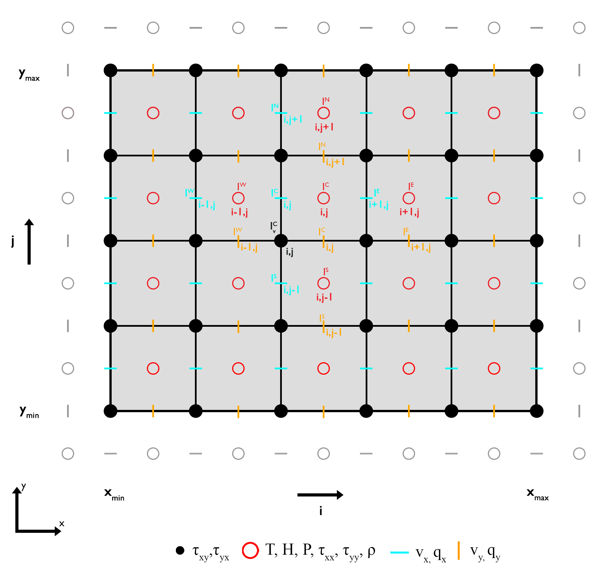
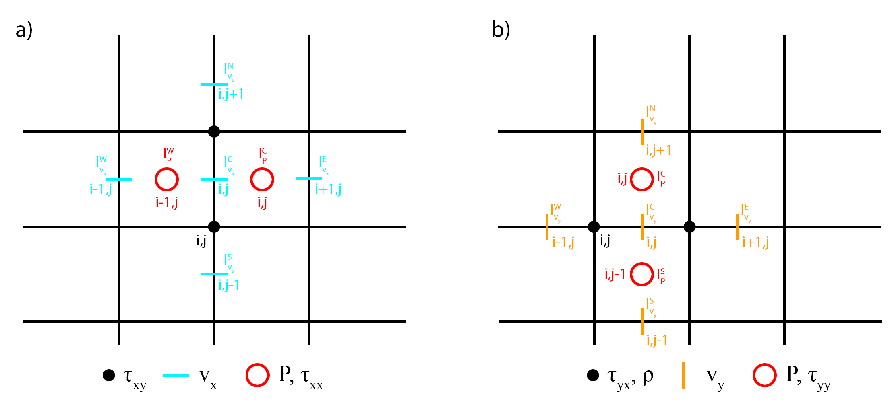
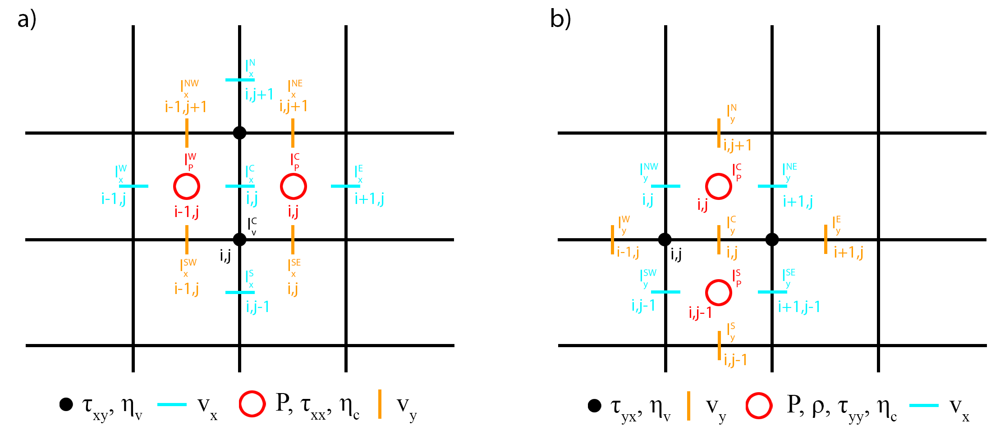
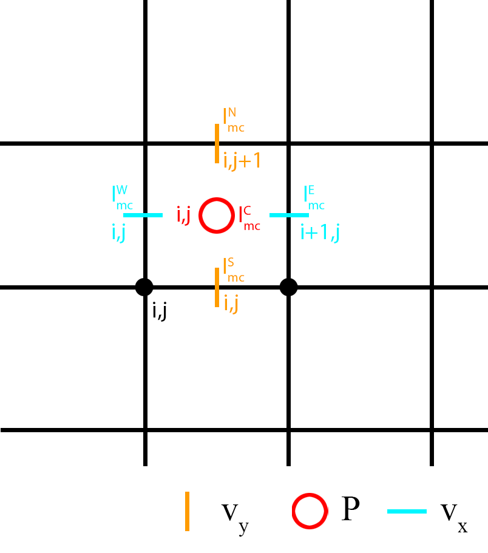
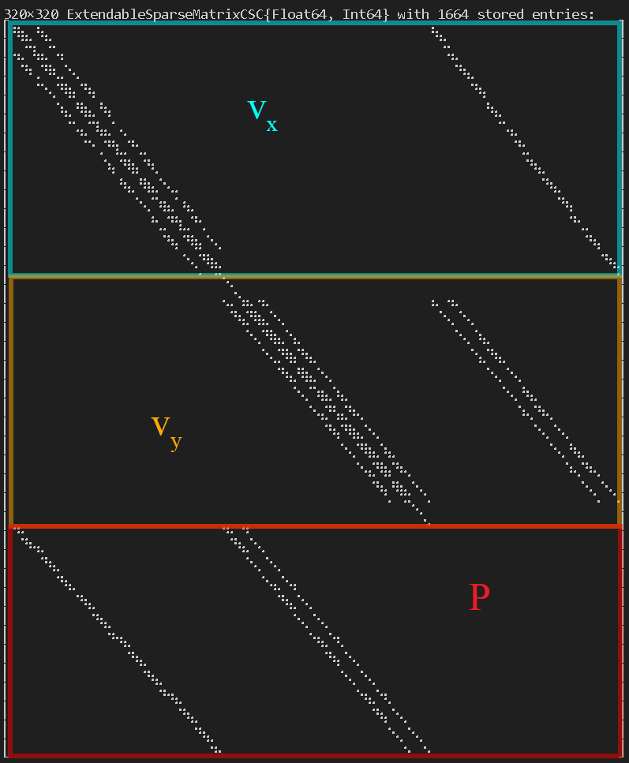
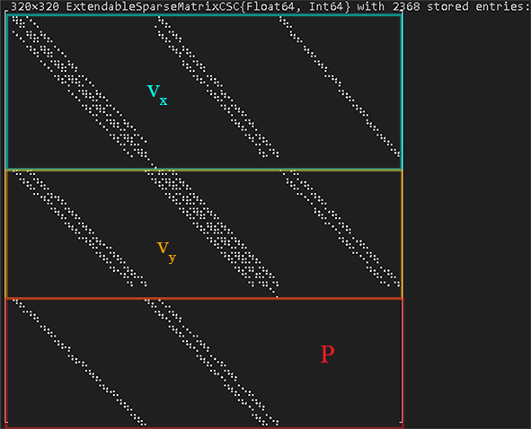

# Stokes Equation (2D)

The Stokes equation in two dimensions is defined as:

$\begin{equation}
0 = -\frac{\partial{P}}{\partial{x_i}} + \frac{\partial{\tau_{ij}}}{\partial{x_j}} + \rho g_i, 
\end{equation}$

where 

- $P$ is the pressure [Pa], 
- $\rho$ is the density [kg/m³], 
- $g_i$ is the gravitational acceleration [m/s²], 
- $\frac{\partial}{\partial x_i}$ is the spatial derivative in the $x_i$-direction, and 
- $\tau_{ij}$ is the deviatoric stress tensor [Pa], defined as:

$\begin{equation}
\tau_{ij} = 2\eta \dot{\varepsilon}_{ij}, 
\end{equation}$

where 

- $\eta$ is the dynamic viscosity [Pa·s], and 
- $\dot{\varepsilon}_{ij}$ is the strain-rate tensor [1/s], given by:

$\begin{equation}
\dot{\varepsilon}_{ij} = \frac{1}{2} \left( \frac{\partial{v_i}}{\partial{x_j}} + \frac{\partial{v_j}}{\partial{x_i}} \right),
\end{equation}$

where 

- $v_i$ is the velocity [m/s] in the $i$-th direction.

The Stokes equation yields two equations for the three unknowns $v_x$, $v_y$, and $P$. An additional equation is therefore required: the mass conservation equation.

The conservation of mass (assuming an incompressible medium) is defined as:

$\begin{equation}
\frac{\partial{v_i}}{\partial{x_i}} = 0.
\end{equation}$ 

# Discretization 

To numerically solve Equations (1) and (4), the spatial domain must be discretized and the relevant properties assigned to the appropriate computational nodes. Thus, the equations are discretized on a staggered finite difference grid, where the horizontal (cyan dashes) and vertical (orange dashes) velocities are defined between the regular grid points (vertices), and the pressure (red circles) within finite difference cells (centroids), as shown in Figure 1.

**Figure 1. Staggered finite difference grid for the momentum equation and mass conservation equation.** The horizontal and vertical velocities require *ghost nodes* at the North, South, East, and West boundaries, respectively.

A staggered grid enables conservation of stress between adjacent grid points and requires careful placement of the associated variables. Each equation is evaluated at the central node of its respective variable grid, requiring values from neighboring nodes defined by the numerical stencil. The locations of these points in a finite difference scheme are determined by a numerical stencil. 

For the 2D Stokes equation in combination with the 2D mass conservation equation, different numerical stencils need to be considered, especially for cases of constant and variable viscosity. The stencils for each equation assuming constant or variable viscosity are discussed in more detail below. The spatial discretization relies on central finite differences to approximate both the velocity and pressure gradients.

The indices of the adjacent points, which determine the positions of the coefficients in the coefficient matrix, can be expressed using the local indices $i$ and $j$ of each numerical grid. Because a staggered grid is used, each variable field ($v_x$, $v_y$, $P$, $\tau_{ij}$, $\eta$, and $\rho$) is defined on its own grid and therefore possesses its own local indices $(i,j)$ and a variable-specific global index. The local indices describe the position of the computational node of each corresponding variable grid in the horizontal and vertical directions, respectively. The global indices assume a horizontal numbering through the model domain; that is, the numbering proceeds row by row from the bottom to the top. The index for the adjacent centroid points follows the indexing convention described in the [2D heat diffusion equation](./DiffTwoD.md). 

For clarity, two types of global indices are used below:

- variable-specific global indices, which number the nodes of a single grid (e.g. centroids or vertices), 
- system global indices, which number the unknowns in the assembled linear system.

The variable-specific global indices indicate the position relative to the central reference point (e.g., $N$, $S$).

The global index for density is defined by consecutively numbering the centroids: 

$\begin{equation}
I^\textrm{C}_c = \left(j-1\right) nc_x + i, 
\end{equation}$

where $i$ and $j$ are the local indices in the horizontal and vertical direction, respectively, and $nc_x$ is the total number of centroids in the horizontal direction. Here, it is important to distinguish between the centroid index used for density and the system index used for pressure, because pressure is part of the consecutively numbered unknowns in the assembled system of equations (see below). 

The global index for the shear stress is defined by consecutively numbering the vertices:

$\begin{equation}
I^\textrm{C}_v = \left(j-1\right) nv_x + i,
\end{equation}$

where $i$ and $j$ are the local indices in the horizontal and vertical direction, respectively, and  $nv_x$ is the total number of vertices in the horizontal direction. 

The global indexing for the unknown variables in the system of equations proceeds by:

1. Enumerating all equations for the $x$-component of momentum (unknown $v_x$),

2. Followed by the $y$-component of momentum (unknown $v_y$),

3. And finally the mass conservation equations (unknown $P$).

The numbering $I$ for each equation is then defined as: 

**$x$-component** ($v_x$) 

$\begin{equation}
I^\textrm{C}_{x} = 1 : \left(nv_x \cdot nc_y\right),
\end{equation}$

**$y$-component** ($v_y$)

$\begin{equation}
I^\textrm{C}_{y} = \left(nv_x \cdot nc_y + 1 \right) : \left(nv_x \cdot nc_y + nc_x \cdot nv_y\right),
\end{equation}$

**Mass Conservation** ($P$)

$\begin{equation}
I^\textrm{C}_{p} = \left(nv_x \cdot nc_y + nc_x \cdot nv_y + 1\right) : \left(nv_x \cdot nc_y + nc_x \cdot nv_y + nc_x \cdot nc_y\right).
\end{equation}$

This results in a consecutive global numbering of the system of equations for the $x$- and $y$-component of the momentum and the mass conservation equation. Each discretized equation corresponds to a row $I^\textrm{C}_{x,y,p}$ in the coefficient matrix. 

> Note: The index $I^\textrm{C}_{x,y,p}$ for the system of equations is not the same as the consecutive numbering of the velocity and pressure nodes $I^j$, which only considers the global numbering for one single variable. 

The nonzero entries within a given matrix row appear at column positions corresponding to the neighboring variables involved in the stencil. These column indices are denoted by $I^k_{x,y,mc}$, where $k \in \{\textrm{S}, \textrm{SW}, \textrm{SE}, \textrm{W}, \textrm{C}, \textrm{E}, \textrm{NW}, \textrm{NE}, \textrm{N}\}$. The column index of each coefficient is computed relative to the central row index $I^\textrm{C}_{x,y,p}$. Thereby, the coefficient indices slightly vary for constant and variable viscosity cases. Note that cross terms involving $v_y$ and $v_x$ are indexed using the $y$- and $x$-component system indices, reflecting the staggered grid arrangement.

**Constant Viscosity**

**$x$-component**

$\begin{equation}\begin{split}
I^\textrm{S}_{x} & = I^\textrm{C}_{x} - nv_x, \\
I^\textrm{W}_{x} & = I^\textrm{C}_{x} - 1, \\
I^\textrm{E}_{x} & = I^\textrm{C}_{x} + 1, \\
I^\textrm{N}_{x} & = I^\textrm{C}_{x} + nv_x,
\end{split}\end{equation}$

and for the pressure gradient

$\begin{equation}
I^\textrm{W}_p  = I^\textrm{C}_p - 1.
\end{equation}$

**$y$-component**

$\begin{equation}\begin{split}
I^\textrm{S}_{y} & = I^\textrm{C}_{y} - nc_x, \\
I^\textrm{W}_{y} & = I^\textrm{C}_{y} - 1, \\
I^\textrm{E}_{y} & = I^\textrm{C}_{y} + 1, \\
I^\textrm{N}_{y} & = I^\textrm{C}_{y} + nc_x, 
\end{split}\end{equation}$

and for the pressure gradient

$\begin{equation}
I^\textrm{S}_p  = I^\textrm{C}_p - nc_x.
\end{equation}$

**Variable Viscosity**

**$x$-component**

$\begin{equation}\begin{split}
I^\textrm{S}_{x} & = I^\textrm{C}_{x} - nv_x, \\
I^\textrm{SW}_{x} & = I^\textrm{C}_{y} - 1, \\
I^\textrm{SE}_{x} & = I^\textrm{C}_{y}, \\
I^\textrm{W}_{x} & = I^\textrm{C}_{x} - 1, \\
I^\textrm{E}_{x} & = I^\textrm{C}_{x} + 1, \\
I^\textrm{NW}_{x} & = I^\textrm{C}_{y} + nc_x, \\
I^\textrm{NE}_{x} & = I^\textrm{C}_{y} + nc_x + 1, \\
I^\textrm{N}_{x} & = I^\textrm{C}_{x} + nv_x, 
\end{split}\end{equation}$

and for the pressure gradient

$\begin{equation}
I^\textrm{W}_p  = I^\textrm{C}_p - 1.
\end{equation}$

**$y$-component**

$\begin{equation}\begin{split}
I^\textrm{S}_{y} & = I^\textrm{C}_{y} - nc_x, \\
I^\textrm{SW}_{y} & = I^\textrm{C}_{x} - nv_x, \\
I^\textrm{SE}_{y} & = I^\textrm{C}_{x} - nv_x + 1, \\
I^\textrm{W}_{y} & = I^\textrm{C}_{y} - 1, \\
I^\textrm{E}_{y} & = I^\textrm{C}_{y} + 1, \\
I^\textrm{NW}_{y} & = I^\textrm{C}_{x}, \\
I^\textrm{NE}_{y} & = I^\textrm{C}_{x} + 1, \\
I^\textrm{N}_{y} & = I^\textrm{C}_{y} + nc_x,
\end{split}\end{equation}$

and for the pressure gradient

$\begin{equation}
I^\textrm{S}_p  = I^\textrm{C}_p - nc_x.
\end{equation}$

The coefficients for the conservation of mass remain the same independent of the state of the viscosity. 

**Mass Conservation (mc)**

$\begin{equation}\begin{split}
I^\textrm{S}_{mc} & = I^\textrm{C}_{y}, \\
I^\textrm{W}_{mc} & = I^\textrm{C}_{x}, \\
I^\textrm{C}_{mc} & = I^\textrm{C}_{p}, \\
I^\textrm{E}_{mc} & = I^\textrm{E}_{x}, \\
I^\textrm{N}_{mc} & = I^\textrm{N}_{y}. 
\end{split}\end{equation}$

---

## Field Management

For evaluating the Stokes equation in `GeoModBox.jl`, a staggered velocity grid is used. Velocity ghost nodes are introduced for the horizontal velocity component at the North and South boundaries and for the vertical velocity component at the East and West boundaries of the model domain. Consequently, each velocity field is extended in the direction for which no velocity node lies directly on the boundary.

The residual used in the defect correction method is evaluated at the velocity and pressure nodes using the corresponding stress, pressure, and density gradients. The residual is not evaluated for velocity nodes located directly on the domain boundaries because these nodes are prescribed by the boundary conditions (e.g. no-slip or free-slip). For these nodes, the residual is set to zero. For nodes adjacent to the boundary, ghost-node velocity values are required to evaluate the stress divergence and to compute the residual.

Within `GeoModBox.jl`, the residual is calculated separately for each 2D variable field using the corresponding local indices. The residuals of the individual fields are then assembled into a single 1D residual vector following the global indexing defined in Equations (7)–(9). The dimension of the system of equations, and therefore the size of the coefficient matrix, is determined by the total number of equations. The coefficients of the matrix are modified directly according to the prescribed boundary conditions. The correction terms are then added to the initial guess, where the unknowns $v_x$, $v_y$, and $P$ are likewise stored in a single 1D solution vector. In the following, the global index always refers to this total 1D vector.

For the special-case solution using a single left-matrix division, the dimension of the coefficient matrix remains unchanged. In this case, the solver modifies only the right-hand side of the system according to the boundary conditions.

## Boundary Conditions

To correctly impose boundary conditions at all boundaries, ghost nodes located at $\frac{\Delta{x}}{2}$ and $\frac{\Delta{y}}{2}$ outside the domain are used. However, ghost nodes for the velocities are only required in the direction where the corresponding velocity component is located at a cell face rather than directly on the boundary (see Figure 1). The velocity values at these ghost nodes are directly included in the discretized FD formulations for the nodes adjacent to the boundaries.

Within `GeoModBox.jl`, the most commonly applied boundary conditions for the momentum equation are combinations of *Dirichlet* and *Neumann* velocity boundary conditions. These are typically referred to as *free-slip* and *no-slip* boundary conditions.

### Free-slip 

Free-slip boundary conditions allow fluid motion along the boundary while enforcing zero shear stress and no flow across the boundary. For the lateral boundaries (East, West), this translates to:

$\begin{equation}
\begin{split}
v_x = 0, \\
\frac{\partial{v_{y}}}{\partial{x}}=0.
\end{split}
\end{equation}$

For the horizontal boundaries (North, South), the conditions are:

$\begin{equation}
\begin{split}
v_y = 0, \\
\frac{\partial{v_{x}}}{\partial{y}}=0.
\end{split}
\end{equation}$

**$x$-component**

For the free-slip condition, the horizontal velocity $v_x$ at the ghost nodes along the South and North boundaries is then defined as

*South*

$\begin{equation}
v_{x,G^S} = v_{x,(:,1)},
\end{equation}$

*North*

$\begin{equation}
v_{x,G^N} = v_{x,(:,nc_y)}.
\end{equation}$

At the lateral boundaries (East, West), the horizontal velocity nodes fall directly on the boundary and thus $v_x$ is set to zero.

**$y$-component**

The vertical velocity $v_y$ at the ghost nodes for the West and East boundaries is defined as:

*West*

$\begin{equation}
v_{y,G^W} = v_{y,(1,:)},
\end{equation}$

*East*

$\begin{equation}
v_{y,G^E} = v_{y,(nc_x,:)}.
\end{equation}$

Along the North and South boundaries, the vertical velocity nodes fall directly on the boundary and thus $v_y$ is set to zero.

### No-slip

No-slip boundary conditions enforce zero velocity along the boundary, effectively "fixing" the fluid to the boundary. That is, for all boundaries (East, West, South, North), the velocity components satisfy:

$\begin{equation}
\begin{split}
v_x = 0, \\
v_y = 0.
\end{split}
\end{equation}$

**$x$-component**

For the horizontal velocity $v_x$, values at the ghost nodes adjacent to the South and North boundaries are defined as:

*South*

$\begin{equation}
v_{x,G^S} = 2V_{BC}^S - v_{x,(:,1)},
\end{equation}$

*North*

$\begin{equation}
v_{x,G^N} = 2V_{BC}^N - v_{x,(:,nc_y)},
\end{equation}$

where $V_{BC}^S$ and $V_{BC}^N$ are the prescribed boundary velocities (typically zero for no-slip).

At the lateral boundaries (East, West), the velocity nodes fall directly on the boundary and thus, $v_x$ is set to zero, as in the free-slip case.

**$y$-component**

For the vertical velocity $v_y$, the ghost nodes adjacent to the West and East boundaries are defined as:

*West*

$\begin{equation}
v_{y,G^W} = 2V_{BC}^W - v_{y,(1,:)},
\end{equation}$

*East*

$\begin{equation}
v_{y,G^E} = 2V_{BC}^E - v_{y,(nc_x,:)},
\end{equation}$

where $V_{BC}^W$ and $V_{BC}^E$ are the prescribed boundary velocities (again typically zero).

Along the North and South boundaries, the velocity nodes fall directly on the boundary and thus, $v_y$ is set to zero, consistent with the free-slip implementation.

## Constant Viscosity

Let us first consider the special case of constant viscosity, for which Equation (1) simplifies to:

$\begin{equation}
0 = -\frac{\partial{P}}{\partial{x_i}} + 2\eta\frac{\partial^2{v_i}}{\partial{x_i^2}} + \eta\left(\frac{\partial^2{v_i}}{\partial{x_j^2}}+\frac{\partial^2{v_j}}{\partial{x_i^2}}\right) + \rho g_i. 
\end{equation}$

By applying equation (4) and neglecting horizontal gravitational acceleration, equation (30) simplifies to the component-wise forms:

**$x$-component** 

$\begin{equation}
-\frac{\partial{P}}{\partial{x}} + \eta\frac{\partial^2{v_x}}{\partial{x^2}} + \eta\frac{\partial^2{v_x}}{\partial{y^2}} = 0, 
\end{equation}$

**$y$-component**

$\begin{equation}
-\frac{\partial{P}}{\partial{y}} + \eta\frac{\partial^2{v_y}}{\partial{y^2}} + \eta\frac{\partial^2{v_y}}{\partial{x^2}} = - \rho g_y. 
\end{equation}$

To discretize these equations, we define a numerical stencil indicating the grid points involved in the finite difference approximation. Each stencil is centered on the point $(i,j)$, where $i$ and $j$ denote indices in the horizontal and vertical directions, respectively. The central point corresponds to the equation's location in the global linear system.

### Stencil

The numerical stencils for the constant-viscosity momentum equations are shown in Figure 2. These stencils illustrate the neighboring grid points required to evaluate each component using a finite difference scheme.

**Figure 2. Numerical stencils for constant viscosity.** a) *$x$-component*; b) *$y$-component*.

By applying finite difference approximations to the partial derivatives, equations (31) and (32) become:

**$x$-component**

$\begin{equation}\begin{gather*}
& -\frac{P_{I^{\textrm{C}}_p}-P_{I^{\textrm{W}}_p}}{\Delta{x}} + \\ & \eta\frac{v_{x,I^{\textrm{W}}_{x}}-2v_{x,I^{\textrm{C}}_{x}}+v_{x,I^{\textrm{E}}_{x}}}{\Delta{x^2}} + \\ &  \eta\frac{v_{x,I^{\textrm{S}}_{x}}-2v_{x,I^{\textrm{C}}_{x}}+v_{x,I^{\textrm{N}}_{x}}}{\Delta{y^2}} = 0.
\end{gather*}\end{equation}$

Rearranging and grouping terms, we obtain:

$\begin{equation}\begin{gather*}
& W_pP_{I^{\textrm{W}}_{p}} + C_pP_{I^{\textrm{C}}_{p}} + \\ & S_xv_{x,I^{\textrm{S}}_{x}} +  W_xv_{x,I^{\textrm{W}}_{x}} + \\ & C_xv_{x,I^{\textrm{C}}_{x}} + \\ & E_xv_{x,I^{\textrm{E}}_{x}} + N_xv_{x,I^{\textrm{N}}_{x}} = 0, 
\end{gather*}\end{equation}$

where the coefficients are defined as:

$\begin{equation}
\begin{split}
W_p & = \frac{1}{\Delta{x}}, \\
C_p & = -\frac{1}{\Delta{x}},  \\
S_x & = \frac{\eta}{\Delta{y^2}}, \\
W_x & = \frac{\eta}{\Delta{x^2}}, \\
C_x & = -2\eta\left(\frac{1}{\Delta{x^2}}+\frac{1}{\Delta{y^2}}\right), \\
E_x & = \frac{\eta}{\Delta{x^2}}, \\
N_x & = \frac{\eta}{\Delta{y^2}}. \\
\end{split}
\end{equation}$

**$y$-component**

$\begin{equation}\begin{gather*}
& -\frac{P_{I^{\textrm{C}}_{p}}-P_{I^{\textrm{S}}_{p}}}{\Delta{y}} + \\ & \eta\frac{v_{y,I^{\textrm{S}}_{y}}-2v_{y,I^{\textrm{C}}_{y}}+v_{y,I^{\textrm{N}}_{y}}}{\Delta{y^2}} + \\ & \eta\frac{v_{y,I^{\textrm{W}}_{y}}-2v_{y,I^{\textrm{C}}_{y}}+v_{y,I^{\textrm{E}}_{y}}}{\Delta{x^2}} = \\ & -\frac{\rho_{I^{\textrm{C}}_c}+\rho_{I^{\textrm{S}}_c}}{2} g_y.
\end{gather*}\end{equation}$

Rearranging and grouping terms, we obtain:

$\begin{equation}\begin{gather*}
& S_pP_{I^{\textrm{S}}_{p}} + C_pP_{I^{\textrm{C}}_{p}} + \\ & S_yv_{y,I^{\textrm{S}}_{y}} + W_yv_{y,I^{\textrm{W}}_{y}} + \\ & C_yv_{y,I^{\textrm{C}}_{y}} + \\ & E_yv_{y,I^{\textrm{E}}_{y}} + N_y v_{y,I^{\textrm{N}}_{y}} = \\ & -\frac{\rho_{I^{\textrm{C}}_c}+\rho_{I^{\textrm{S}}_c}}{2} g_y, 
\end{gather*}\end{equation}$

with coefficients defined as:

$\begin{equation}
\begin{split}
S_p & = \frac{1}{\Delta{y}},  \\
C_p & = -\frac{1}{\Delta{y}}, \\
S_y & = \frac{\eta}{\Delta{y^2}}, \\
W_y & = \frac{\eta}{\Delta{x^2}}, \\
C_y & = -2\eta\left(\frac{1}{\Delta{x^2}}+\frac{1}{\Delta{y^2}}\right), \\
E_y & = \frac{\eta}{\Delta{x^2}}, \\
N_y & = \frac{\eta}{\Delta{y^2}}. \\
\end{split}
\end{equation}$

## Variable Viscosity

For variable viscosity, the momentum equation can be written in component form as

**$x$-component**

$\begin{equation}
-\frac{\partial{P}}{\partial{x}} + \frac{\partial{}}{\partial{x}}\left(2\eta_c\frac{\partial{v_x}}{\partial{x}}\right)+\frac{\partial{}}{\partial{y}}\left( \eta_v\left(\frac{\partial{v_x}}{\partial{y}} + \frac{\partial{v_y}}{\partial{x}}\right)\right) = 0,
\end{equation}$

**$y$-component**

$\begin{equation}
-\frac{\partial{P}}{\partial{y}} + \frac{\partial{}}{\partial{y}}\left(2\eta_c\frac{\partial{v_y}}{\partial{y}}\right)+\frac{\partial{}}{\partial{x}}\left( \eta_v\left(\frac{\partial{v_y}}{\partial{x}} + \frac{\partial{v_x}}{\partial{y}}\right)\right) = -\frac{\rho_{I^{\textrm{C}}_c}+\rho_{I^{\textrm{S}}_c}}{2}g_y,
\end{equation}$

where $\eta_c$ denotes the viscosity defined at the *centroids*, and $\eta_v$ denotes the viscosity defined at the *vertices*.

### Stencil

The stencils for the variable-viscosity momentum equations illustrate the grid points required to discretize each velocity component using finite differences (Figure 3).

**Figure 3.** **Numerical stencils for variable viscosity.** a) *$x$-component*; b) *$y$-component*.  

Using finite difference approximations, the momentum equations become:

**$x$-component**

$\begin{equation}
-\frac{P_{I^\textrm{C}_p}-P_{I^\textrm{W}_p}}{\Delta{x}}+\frac{\tau_{xx,I^\textrm{C}_c} -\tau_{xx,I^\textrm{W}_c}}{\Delta{x}} + \frac{\tau_{xy,I^\textrm{N}_v}-\tau_{xy,I^\textrm{C}_v}}{\Delta{y}} = 0,
\end{equation}$

or, explicitly in terms of partial derivatives:

$\begin{equation}\begin{gather*}
& -\frac{P_{I^\textrm{C}_p}-P_{I^\textrm{W}_p}}{\Delta{x}}+\\ & \frac{2\eta_{c,I^\textrm{C}_c}\frac{\partial{v_x}}{\partial{x}}\vert_{I^\textrm{C}_c} -2\eta_{c,I^\textrm{W}_c}\frac{\partial{v_x}}{\partial{x}}\vert_{I^\textrm{W}_c}}{\Delta{x}} + \\ & \frac{\eta_{v,I^\textrm{N}_v}\left(\frac{\partial{v_x}}{\partial{y}}\vert_{I^\textrm{N}_v}+\frac{\partial{v_y}}{\partial{x}}\vert_{I^\textrm{N}_v}\right)-\eta_{v,I^\textrm{C}_v}\left(\frac{\partial{v_x}}{\partial{y}}\vert_{I^\textrm{C}_v}+\frac{\partial{v_y}}{\partial{x}}\vert_{I^\textrm{C}_v}\right)}{\Delta{y}} = 0,
\end{gather*}\end{equation}$

and in terms of the discrete velocity unknowns:

$\begin{equation}\begin{gather*}
& -\frac{P_{I^\textrm{C}_p}-P_{I^\textrm{W}_p}}{\Delta{x}}+ \\ & \frac{2\eta_{c,I^\textrm{C}_c}}{\Delta{x}}\left(\frac{v_{x,I^\textrm{E}_x}-v_{x,I^\textrm{C}_x}}{\Delta{x}}\right) - \\ & \frac{2\eta_{c,I^\textrm{W}_c}}{\Delta{x}}\left(\frac{v_{x,I^\textrm{C}_x}-v_{x,I^\textrm{W}_x}}{\Delta{x}}\right)+ \\ & \frac{\eta_{v,I^\textrm{N}_v}}{\Delta{y}}\left(\frac{v_{x,I^\textrm{N}_x}-v_{x,I^\textrm{C}_x}}{\Delta{y}} + \frac{v_{y,I^\textrm{NE}_x}-v_{y,I^\textrm{NW}_x}}{\Delta{x}}\right) - \\ &  \frac{\eta_{v,I^\textrm{C}_v}}{\Delta{y}}\left(\frac{v_{x,I^\textrm{C}_x}-v_{x,I^\textrm{S}_x}}{\Delta{y}} + \frac{v_{y,I^\textrm{SE}_x}-v_{y,I^\textrm{SW}_x}}{\Delta{x}}\right) = 0.
\end{gather*}\end{equation}$

Rearranging and grouping terms yields:

$\begin{equation}\begin{gather*}
& W_PP_{I^\textrm{W}_p}+C_PP_{I^\textrm{C}_p} + \\ & S_xv_{x,I^\textrm{S}_x}+SW_xv_{y,I^\textrm{SW}_x}+SE_xv_{y,I^\textrm{SE}_x}+W_xv_{x,I^\textrm{W}_x}+ \\ & C_xv_{x,I^\textrm{C}_x} + \\ & E_xv_{x,I^\textrm{E}_x} + NW_xv_{y,I^\textrm{NW}_x} + NE_xv_{y,I^\textrm{NE}_x} + N_xv_{x,I^\textrm{N}_x} = \\ & 0, 
\end{gather*}\end{equation}$

with coefficients defined as:

$\begin{equation}\begin{split}
W_P & = \frac{1}{\Delta{x}} ,\\
C_P & = -\frac{1}{\Delta{x}}, \\
S_x & = \frac{\eta_{v,I^\textrm{C}_v}}{\Delta{y^2}},\\
SW_x & = \frac{\eta_{v,I^\textrm{C}_v}}{\Delta{x}\Delta{y}},\\
SE_x & = -\frac{\eta_{v,I^\textrm{C}_v}}{\Delta{x}\Delta{y}},\\
W_x & = \frac{2\eta_{c,I^\textrm{W}_c}}{\Delta{x^2}},\\
C_x & = -\frac{2}{\Delta{x^2}}\left(\eta_{c,I^\textrm{C}_c}+\eta_{c,I^\textrm{W}_c}\right)-\frac{1}{\Delta{y^2}}\left(\eta_{v,I^\textrm{N}_v} + \eta_{v,I^\textrm{C}_v} \right), \\
E_x & = \frac{2\eta_{c,I^\textrm{C}_c}}{\Delta{x^2}},\\
NW_x & = -\frac{\eta_{v,I^\textrm{N}_v}}{\Delta{x}\Delta{y}},\\
NE_x & = \frac{\eta_{v,I^\textrm{N}_v}}{\Delta{x}\Delta{y}},\\
N_x & = \frac{\eta_{v,I^\textrm{N}_v}}{\Delta{y^2}}.\\
\end{split}\end{equation}$

**$y$-component**

$\begin{equation}
-\frac{P_{I^\textrm{C}_p}-P_{I^\textrm{S}_p}}{\Delta{y}}+\frac{\tau_{yy,I^\textrm{C}_c} - \tau_{yy,I^\textrm{S}_c}}{\Delta{y}} + \frac{\tau_{yx,I^\textrm{E}_v}-\tau_{yx,I^\textrm{C}_v}}{\Delta{x}} = -\frac{\rho_{I^\textrm{C}_c}+\rho_{I^\textrm{S}_c}}{2} g_y,
\end{equation}$

or, expanded:

$\begin{equation}\begin{gather*}
& -\frac{P_{I^\textrm{C}_p}-P_{I^\textrm{S}_p}}{\Delta{y}}+ \\ & \frac{2\eta_{c,I^\textrm{C}_c}\frac{\partial{v_y}}{\partial{y}}\vert_{I^\textrm{C}_c} -2\eta_{c,I^\textrm{S}_c}\frac{\partial{v_y}}{\partial{y}}\vert_{I^\textrm{S}_c}}{\Delta{y}} + \\ & \frac{\eta_{v,I^\textrm{E}_v}\left(\frac{\partial{v_y}}{\partial{x}}\vert_{I^\textrm{E}_v}+\frac{\partial{v_x}}{\partial{y}}\vert_{I^\textrm{E}_v}\right)-\eta_{v,I^\textrm{C}_v}\left(\frac{\partial{v_y}}{\partial{x}}\vert_{I^\textrm{C}_v}+\frac{\partial{v_x}}{\partial{y}}\vert_{I^\textrm{C}_v}\right)}{\Delta{x}} = \\ & -\frac{\rho_{I^\textrm{C}_c}+\rho_{I^\textrm{S}_c}}{2} g_y,
\end{gather*}\end{equation}$

which becomes in discrete form:

$\begin{equation}\begin{gather*}
& -\frac{P_{I^\textrm{C}_p}-P_{I^\textrm{S}_p}}{\Delta{y}}+ \\ & \frac{2\eta_{c,I^\textrm{C}_c}}{\Delta{y}}\left(\frac{v_{y,I^\textrm{N}_y}-v_{y,I^\textrm{C}_y}}{\Delta{y}}\right) - \\ & \frac{2\eta_{c,I^\textrm{S}_c}}{\Delta{y}}\left(\frac{v_{y,I^\textrm{C}_y}-v_{y,I^\textrm{S}_y}}{\Delta{y}}\right)+ \\ & \frac{\eta_{v,I^\textrm{E}_v}}{\Delta{x}}\left(\frac{v_{y,I^\textrm{E}_y}-v_{y,I^\textrm{C}_y}}{\Delta{x}} + \frac{v_{x,I^\textrm{NE}_y}-v_{x,I^\textrm{SE}_y}}{\Delta{y}}\right) - \\ & \frac{\eta_{v,I^\textrm{C}_v}}{\Delta{x}}\left(\frac{v_{y,I^\textrm{C}_y}-v_{y,I^\textrm{W}_y}}{\Delta{x}} + \frac{v_{x,I^\textrm{NW}_y}-v_{x,I^\textrm{SW}_y}}{\Delta{y}}\right) = \\ & -\frac{\rho_{I^\textrm{C}_c}+\rho_{I^\textrm{S}_c}}{2} g_y.
\end{gather*}\end{equation}$

Reorganized:

$\begin{equation}\begin{gather*}
& C_PP_{I^\textrm{C}_p}+S_PP_{I^\textrm{S}_p} + \\ & S_yv_{y,I^\textrm{S}_y}+SW_yv_{x,I^\textrm{SW}_y}+SE_yv_{x,I^\textrm{SE}_y}+W_yv_{y,I^\textrm{W}_y}+ \\ & C_yv_{y,I^\textrm{C}_y} + \\ & E_yv_{y,I^\textrm{E}_y} + NW_yv_{x,I^\textrm{NW}_y} + NE_yv_{x,I^\textrm{NE}_y} + N_yv_{y,I^\textrm{N}_y} = \\ & -\frac{\rho_{I^\textrm{C}_c}+\rho_{I^\textrm{S}_c}}{2} g_y, 
\end{gather*}\end{equation}$

with coefficients:

$\begin{equation}\begin{split}
S_P & = \frac{1}{\Delta{y}}, \\
C_P & = -\frac{1}{\Delta{y}}, \\
S_y & = \frac{2\eta_{c,I^\textrm{S}_c}}{\Delta{y^2}},\\
SW_y & = \frac{\eta_{v,I^\textrm{C}_v}}{\Delta{x}\Delta{y}},\\
SE_y & = -\frac{\eta_{v,I^\textrm{E}_v}}{\Delta{x}\Delta{y}},\\
W_y & = \frac{\eta_{v,I^\textrm{C}_v}}{\Delta{x^2}},\\
C_y & = -\frac{2}{\Delta{y^2}}\left(\eta_{c,I^\textrm{C}_c}+\eta_{c,I^\textrm{S}_c}\right)-\frac{1}{\Delta{x^2}}\left(\eta_{v,I^\textrm{E}_v} + \eta_{v,I^\textrm{C}_v} \right), \\
E_y & = \frac{\eta_{v,I^\textrm{E}_v}}{\Delta{x^2}},\\
NW_y & = -\frac{\eta_{v,I^\textrm{C}_v}}{\Delta{x}\Delta{y}},\\
NE_y & = \frac{\eta_{v,I^\textrm{E}_v}}{\Delta{x}\Delta{y}},\\
N_y & = \frac{2\eta_{c,I^\textrm{C}_c}}{\Delta{y^2}}.\\
\end{split}\end{equation}$

For more details on the implementation, please refer to the [source code](https://github.com/GeoSci-FFM/GeoModBox.jl/blob/main/src/MomentumEquation/2Dsolvers.jl).

# Continuity Equation 

The mass conservation equation provides the additional constraint required to solve for the pressure field.

## Stencil

The corresponding numerical stencil involves only the horizontal and vertical velocity components (Figure 4).

**Figure 4. Numerical stencil for the continuity equation.** 

Using the finite difference operators, equation (4) is defined as:

$\begin{equation}
\frac{v_{x,I^\textrm{E}_{mc}}-v_{x,I^\textrm{W}_{mc}}}{\Delta{x}} + \frac{v_{y,I^\textrm{N}_{mc}}-v_{y,I^\textrm{S}_{mc}}}{\Delta{y}} = 0,
\end{equation}$

$\begin{equation}
W_{mc}v_{x,I^\textrm{W}_{mc}} + E_{mc}v_{x,I^\textrm{E}_{mc}} + S_{mc}v_{y,I^\textrm{S}_{mc}} + N_{mc}v_{y,I^\textrm{N}_{mc}} = 0,
\end{equation}$

with 

$\begin{equation}
\begin{split}
W_{mc} = -\frac{1}{\Delta{x}}, \qquad E_{mc} = \frac{1}{\Delta{x}}, \\
S_{mc} = -\frac{1}{\Delta{y}}, \qquad N_{mc} = \frac{1}{\Delta{y}}.
\end{split}
\end{equation}$

# Solution

Following the discretization described above, the equations form a linear system with 7 non-zero diagonals for constant viscosity and 11 non-zero diagonals for variable viscosity:

$\begin{equation}
\mathbf{K} \cdot \mathbf{x} = \mathbf{b},
\end{equation}$ 

where 

- $\mathbf{K}$ is the coefficient matrix,
- $\mathbf{x}$ is the solution vector, and 
- $\mathbf{b}$ is the known right-hand side.

The solution vector contains the horizontal and vertical velocity as well as the pressure field, whose ordering follows the global numbering of $I^\textrm{C}_x$, $I^\textrm{C}_y$, and $I^\textrm{C}_p$ as defined in Equations (7)–(9). The right-hand side contains the buoyancy term for the $y$-component of the momentum equation. Depending on the chosen solution strategy, it may also include contributions from the boundary conditions. 

The coefficient matrix $\mathbf{K_{I^\textrm{C}_{i},I^k_{j}}}$ varies depending on the state of the viscosity. The structure of the coefficient matrix for a certain grid resolution and boundary condition is shown in Figures (5) and (6).  

**Figure 5. Coefficient matrix, constant viscosity.** Non-zero entries of a coefficient matrix for a resolution of $nc_x=nc_y=10$, a constant viscosity, and free-slip boundaries. Highlighted are the areas for the different equations: $v_x$ - *$x$-component* of the momentum equation, $v_y$ - *$y$-component* of the momentum equation, $P$ - continuity equation. 

**Figure 6. Coefficient matrix, variable viscosity.** Non-zero entries of a coefficient matrix for a resolution of $nc_x=nc_y=10$, a variable viscosity, and free-slip boundaries. Highlighted are the areas for the different equations: $v_x$ - *$x$-component* of the momentum equation, $v_y$ - *$y$-component* of the momentum equation, $P$ - continuity equation. 

## General Solution - Defect Correction

The system of equations can be solved in a general way using the defect correction. The equations are reformulated by introducing a residual term $\mathbf{r}$, which quantifies the deviation from the true solution and can be reduced iteratively to improve accuracy through successive correction steps. The defect correction method is particularly effective when solving non-linear systems. 

First, the residual is calculated for each equation. If the velocity nodes required to calculate the residual are not located directly on the boundary, the corresponding ghost-node velocity values defined in Equations (19)–(24) for free-slip and Equations (25)–(29) for no-slip conditions are used. The stresses are either calculated via the shear (vertices) or the normal viscosity (centroids). 

The residuals $r_x$, $r_y$, and $r_p$ denote the local residuals at the corresponding central reference nodes of each variable grid. To solve the system of equations, the residuals are stored in a vector $\mathbf{r}$ with the global indexing as shown in equations (7)-(9). 

The local residual at the central reference node is defined as:  

**Residual calculation**

$\begin{equation}\begin{split}
r_x & = \frac{\partial{\tau_{xx}}}{\partial{x}} + \frac{\partial{\tau_{xy}}}{\partial{y}} - \frac{\partial{P}}{\partial{x}}, \\
r_y & = \frac{\partial{\tau_{yy}}}{\partial{y}} + \frac{\partial{\tau_{yx}}}{\partial{x}} - \frac{\partial{P}}{\partial{y}} + \rho g_y, \\
r_p & = \frac{\partial{v_x}}{\partial{x}} + \frac{\partial{v_y}}{\partial{y}},
\end{split}\end{equation}$

and in the form the finite difference operators:

$\begin{equation}\begin{split}
r_{I^\textrm{C}_x} & = \frac{\tau_{xx,I^\textrm{C}_c}-\tau_{xx,I^\textrm{W}_c}}{\Delta{x}} + \frac{\tau_{xy,I^\textrm{N}_v}-\tau_{xy,I^\textrm{C}_v}}{\Delta{y}} - \frac{P_{I^\textrm{C}_p}-P_{I^\textrm{W}_p}}{\Delta{x}}, \\
r_{I^\textrm{C}_y} & = \frac{\tau_{yy,I^\textrm{C}_c}-\tau_{yy,I^\textrm{S}_c}}{\Delta{y}} + \frac{\tau_{yx,I^\textrm{E}_v}-\tau_{yx,I^\textrm{C}_v}}{\Delta{x}} - \frac{P_{I^\textrm{C}_p}-P_{I^\textrm{S}_p}}{\Delta{y}} + \frac{\rho_{I^\textrm{C}_c}+\rho_{I^\textrm{S}_c}}{2} g_y, \\
r_{I^\textrm{C}_p} & = \frac{v_{x,I^\textrm{E}_{mc}}-v_{x,I^\textrm{W}_{mc}}}{\Delta{x}} + \frac{v_{y,I^\textrm{N}_{mc}}-v_{y,I^\textrm{S}_{mc}}}{\Delta{y}}.
\end{split}\end{equation}$

Or in the terms of the unknown variables: 

**Constant Viscosity**

*$x$-component*

$\begin{equation}\begin{gather*}
& r_{I^\textrm{C}_x} = C_pP_{I^{\textrm{C}}_{p}} + W_pP_{I^{\textrm{W}}_{p}} + \\ & S_xv_{x,I^{\textrm{S}}_{x}} +  W_xv_{x,I^{\textrm{W}}_{x}} + C_xv_{x,I^{\textrm{C}}_{x}} + E_xv_{x,I^{\textrm{E}}_{x}} + N_xv_{x,I^{\textrm{N}}_{x}}, 
\end{gather*}\end{equation}$

*$y$-component*

$\begin{equation}\begin{gather*}
& r_{I^\textrm{C}_y} = S_pP_{I^{\textrm{S}}_{p}} + C_pP_{I^{\textrm{C}}_{p}} + \\ &  S_yv_{y,I^{\textrm{S}}_{y}} + W_yv_{y,I^{\textrm{W}}_{y}} + C_yv_{y,I^{\textrm{C}}_{y}} + E_yv_{y,I^{\textrm{E}}_{y}} + N_y v_{y,I^{\textrm{N}}_{y}} +\frac{\rho_{I^{\textrm{C}}_c}+\rho_{I^{\textrm{S}}_c}}{2} g_y, 
\end{gather*}\end{equation}$

**Variable Viscosity**

*$x$-component* 

$\begin{equation}\begin{gather*}
& r_{I^\textrm{C}_x} = W_PP_{I^\textrm{W}_p}+C_PP_{I^\textrm{C}_p} + \\ &  S_xv_{x,I^\textrm{S}_x}+SW_xv_{y,I^\textrm{SW}_x}+SE_xv_{y,I^\textrm{SE}_x}+W_xv_{x,I^\textrm{W}_x}+ C_xv_{x,I^\textrm{C}_x} + E_xv_{x,I^\textrm{E}_x} + NW_xv_{y,I^\textrm{NW}_x} + NE_xv_{y,I^\textrm{NE}_x} + N_xv_{x,I^\textrm{N}_x}, 
\end{gather*}\end{equation}$

*$y$-component* 

$\begin{equation}\begin{gather*}
& r_{I^\textrm{C}_y} = C_PP_{I^\textrm{C}_p}+S_PP_{I^\textrm{S}_p} + \\ & S_yv_{y,I^\textrm{S}_y}+SW_yv_{x,I^\textrm{SW}_y}+SE_yv_{x,I^\textrm{SE}_y}+W_yv_{y,I^\textrm{W}_y}+ C_yv_{y,I^\textrm{C}_y} + E_yv_{y,I^\textrm{E}_y} + NW_yv_{x,I^\textrm{NW}_y} + NE_yv_{x,I^\textrm{NE}_y} + N_yv_{y,I^\textrm{N}_y} + \frac{\rho_{I^\textrm{C}_c}+\rho_{I^\textrm{S}_c}}{2} g_y, 
\end{gather*}\end{equation}$

**Continuity Equation**

$\begin{equation}
r_{I^\textrm{C}_p} = W_{mc}v_{x,I^\textrm{W}_{mc}} + E_{mc}v_{x,I^\textrm{E}_{mc}} + S_{mc}v_{y,I^\textrm{S}_{mc}} + N_{mc}v_{y,I^\textrm{N}_{mc}}.
\end{equation}$

For more details on the defect correction method for the Stokes equation see the [1-D Stokes equation documentation](./MomentumOneD.md).

The correction vector $\delta$ for the velocity components and the pressure, is obtained by solving the linear system: 

$\begin{equation}
\mathbf{\delta}=- \mathbf{K}^{-1} \mathbf{r}.
\end{equation}$

The vector $\delta$ has a length equal to the total number of unknowns, i.e., $\left(nv_x \cdot nc_y + nc_x \cdot nv_y + nc_x \cdot nc_y\right)$, corresponding to $v_x$, $v_y$, and $P$ across the domain.

Finally one needs to update the initial guess by the correction term: 

$\begin{equation}\begin{split}
v_{x,I^\textrm{C}_x}^{k+1} & = v_{x,I^\textrm{C}_x}^k + \delta_{I^\textrm{C}_x}, \\
v_{y,I^\textrm{C}_y}^{k+1} & = v_{y,I^\textrm{C}_y}^k + \delta_{I^\textrm{C}_y}, \\
P_{I^\textrm{C}_p}^{k+1} & = P_{I^\textrm{C}_p}^k + \delta_{I^\textrm{C}_p},
\end{split}\end{equation}$

where the index of the vector $\delta$ corresponds to the global index for the variables as shown in equations (7)-(9).

### Boundary Conditions

The boundary conditions are implemented using the velocity values at the ghost nodes (see Equations (19)-(29)). To maintain symmetry in the coefficient matrix, the coefficients must be modified for nodes adjacent to the boundaries. The equations for the centroids adjacent to the boundary are then given by:

#### Constant Viscosity 

**Free-slip**

Using equations (19)-(24), the discretized system of equations is updated accordingly. For free-slip boundaries, the right-hand side remains unchanged, but the coefficients are modified.

**$x$-component**

*South*

$\begin{equation}\begin{gather*}
& r_{I^\textrm{C}_x} =  W_pP_{I^{\textrm{W}}_{p}}+C_pP_{I^{\textrm{C}}_{p}}+ \\ & W_xv_{x,I^{\textrm{W}}_{x}} + C_xv_{x,I^{\textrm{C}}_{x}}+ E_xv_{x,I^{\textrm{E}}_{x}}+N_xv_{x,I^{\textrm{N}}_{x}},
\end{gather*}\end{equation}$

with 

$\begin{equation}C_x = -\frac{2\eta}{\Delta{x^2}}-\frac{\eta}{\Delta{y^2}}.\end{equation}$

*North*

$\begin{equation}\begin{gather*}
& r_{I^\textrm{C}_x} = W_pP_{I^{\textrm{W}}_{p}}+C_pP_{I^{\textrm{C}}_{p}}+ \\ & S_xv_{x,I^{\textrm{S}}_{x}}+ W_xv_{x,I^{\textrm{W}}_{x}}+ C_xv_{x,I^{\textrm{C}}_{x}} + E_xv_{x,I^{\textrm{E}}_{x}} ,
\end{gather*}\end{equation}$

with 

$\begin{equation}C_x = -\frac{2\eta}{\Delta{x^2}}-\frac{\eta}{\Delta{y^2}}.\end{equation}$

On the lateral boundaries (East, West), the central coefficient is set to:

$\begin{equation}
C_x = 1,
\end{equation}$

and all other coefficients are set to zero.

**$y$-component**

*West*

$\begin{equation}\begin{gather*}
& r_{I^\textrm{C}_y} = S_pP_{I^{\textrm{S}}_{p}}+C_pP_{I^{\textrm{C}}_{p}}+ \\ & S_yv_{y,I^{\textrm{S}}_{y}} + C_yv_{y,I^{\textrm{C}}_{y}}+ E_yv_{y,I^{\textrm{E}}_{y}}+ N_yv_{y,I^{\textrm{N}}_{y}} + \frac{\rho_{I^{\textrm{C}}_c}+\rho_{I^{\textrm{S}}_c}}{2} g_y,
\end{gather*}\end{equation}$

with 

$\begin{equation}C_y = -\frac{\eta}{\Delta{x^2}}-\frac{2\eta}{\Delta{y^2}}.\end{equation}$

*East*

$\begin{equation}\begin{gather*}
& r_{I^\textrm{C}_y} = S_pP_{I^{\textrm{S}}_{p}}+C_pP_{I^{\textrm{C}}_{p}}+ \\ & S_yv_{y,I^{\textrm{S}}_{y}}+ W_yv_{y,I^{\textrm{W}}_{y}}+ C_yv_{y,I^{\textrm{C}}_{y}} + N_yv_{y,I^{\textrm{N}}_{y}} + \frac{\rho_{I^{\textrm{C}}_c}+\rho_{I^{\textrm{S}}_c}}{2} g_y,
\end{gather*}\end{equation}$

with 

$\begin{equation}C_y = -\frac{\eta}{\Delta{x^2}}-\frac{2\eta}{\Delta{y^2}}.\end{equation}$

On the North and South boundaries, the central coefficient is:

$\begin{equation}
C_y = 1,
\end{equation}$

and all other coefficients are zero.

**No-slip**

Using equations (25)-(29), the system coefficients and the right-hand side of the discretized equations are modified accordingly.

**$x$-component**

*South*

$\begin{equation}\begin{gather*}
& r_{I^\textrm{C}_x} = W_pP_{I^{\textrm{W}}_{p}}+C_pP_{I^{\textrm{C}}_{p}}+ \\ & W_xv_{x,I^{\textrm{W}}_{x}} + C_xv_{x,I^{\textrm{C}}_{x}}+ E_xv_{x,I^{\textrm{E}}_{x}}+N_xv_{x,I^{\textrm{N}}_{x}} + 2\frac{\eta}{\Delta{y^2}}V_{BC}^S,
\end{gather*}\end{equation}$

with 

$\begin{equation}C_x = -\frac{2\eta}{\Delta{x^2}}-\frac{3\eta}{\Delta{y^2}}.\end{equation}$

*North*

$\begin{equation}\begin{gather*}
& r_{I^\textrm{C}_x} = W_pP_{I^{\textrm{W}}_{p}}+C_pP_{I^{\textrm{C}}_{p}}+ \\ & S_xv_{x,I^{\textrm{S}}_{x}}+W_xv_{x,I^{\textrm{W}}_{x}}+ C_xv_{x,I^{\textrm{C}}_{x}} + E_xv_{x,I^{\textrm{E}}_{x}} + 2\frac{\eta}{\Delta{y^2}}V_{BC}^N,
\end{gather*}\end{equation}$

with 

$\begin{equation}C_x = -\frac{2\eta}{\Delta{x^2}}-\frac{3\eta}{\Delta{y^2}}.\end{equation}$

On the lateral boundaries (East, West), set:

$\begin{equation}
C_x = 1,
\end{equation}$

with all other coefficients and the right-hand side equal to zero.

**$y$-component**

*West*

$\begin{equation}\begin{gather*}
& r_{I^\textrm{C}_y} = S_pP_{I^{\textrm{S}}_{p}}+C_pP_{I^{\textrm{C}}_{p}}+ \\ & S_yv_{y,I^{\textrm{S}}_{y}}+ C_yv_{y,I^{\textrm{C}}_{y}}+ E_yv_{y,I^{\textrm{E}}_{y}}+N_yv_{y,I^{\textrm{N}}_{y}} + \frac{\rho_{I^{\textrm{C}}_c} + \rho_{I^{\textrm{S}}_c}}{2} g_y + 2\frac{\eta}{\Delta{x^2}}V_{BC}^W,
\end{gather*}\end{equation}$

with 

$\begin{equation}C_y = -\frac{3\eta}{\Delta{x^2}}-\frac{2\eta}{\Delta{y^2}}.\end{equation}$

*East*

$\begin{equation}\begin{gather*}
& r_{I^\textrm{C}_y} = S_pP_{I^{\textrm{S}}_{p}}+C_pP_{I^{\textrm{C}}_{p}}+ \\ & S_yv_{y,I^{\textrm{S}}_{y}}+W_yv_{y,I^{\textrm{W}}_{y}}+ C_yv_{y,I^{\textrm{C}}_{y}} + N_yv_{y,I^{\textrm{N}}_{y}} + \frac{\rho_{I^{\textrm{C}}_c} + \rho_{I^{\textrm{S}}_c}}{2} g_y + 2\frac{\eta}{\Delta{x^2}}V_{BC}^E,
\end{gather*}\end{equation}$

with 

$\begin{equation}C_y = -\frac{3\eta}{\Delta{x^2}}-\frac{2\eta}{\Delta{y^2}}.\end{equation}$

On the horizontal boundaries (North, South), set:

$\begin{equation}
C_y = 1,
\end{equation}$

and all other coefficients and the right-hand side to zero.

For implementation details, please refer to the [source code](https://github.com/GeoSci-FFM/GeoModBox.jl/blob/main/src/MomentumEquation/2Dsolvers.jl).

#### Variable Viscosity 

**Free-slip**

Using equations (19)-(24), the coefficients of the equations adjacent to the corresponding boundaries are modified accordingly. Note that the right-hand side does not change for free-slip boundary conditions.

**$x$-component**

*South*

$\begin{equation}\begin{gather*}
& r_{I^{\textrm{C}}_x} = W_PP_{I^{\textrm{W}}_p} + C_PP_{I^{\textrm{C}}_p} +\\ & SW_xv_{y,I^{\textrm{SW}}_x}+SE_xv_{y,I^{\textrm{SE}}_x}+W_xv_{x,I^{\textrm{W}}_x}+\\ & C_xv_{x,I^{\textrm{C}}_x}+ E_xv_{x,I^{\textrm{E}}_x}+NW_xv_{y,I^{\textrm{NW}}_x}+NE_xv_{y,I^{\textrm{NE}}_x}+N_xv_{x,I^{\textrm{N}}_x},
\end{gather*}\end{equation}$

with 

$\begin{equation}C_x = -\frac{2}{\Delta{x^2}} \left( \eta_{c,I^{\textrm{C}}_c} + \eta_{c,I^{\textrm{W}}_c} \right) - \frac{\eta_{v,I^{\textrm{N}}_v}}{\Delta{y^2}}.\end{equation}$

*North*

$\begin{equation}\begin{gather*}
& r_{I^{\textrm{C}}_x} = W_PP_{I^{\textrm{W}}_p}+C_PP_{I^{\textrm{C}}_p}+\\ & S_xv_{x,I^{\textrm{S}}_x}+SW_xv_{y,I^{\textrm{W}}_x}+SE_xv_{y,I^{\textrm{C}}_x}+W_xv_{x,I^{\textrm{W}}_x}+ C_xv_{x,I^{\textrm{C}}_x}+ E_xv_{x,I^{\textrm{E}}_x}+NW_xv_{y,I^{\textrm{NW}}_x}+NE_xv_{y,I^{\textrm{NE}}_x},
\end{gather*}\end{equation}$

with 

$\begin{equation}C_x = -\frac{2}{\Delta{x^2}}\left(\eta_{c,I^{\textrm{C}}_c}+\eta_{c,I^{\textrm{W}}_c}\right)-\frac{\eta_{v,I^{\textrm{C}}_v}}{\Delta{y^2}}.\end{equation}$

Along the lateral boundaries (East, West), the central coefficient is set to:

$\begin{equation}
C_x = 1,
\end{equation}$

and all other coefficients are set to zero.

**$y$-component**

*West* 

$\begin{equation}\begin{gather*}
& r_{I^{\textrm{C}}_y} = C_PP_{I^{\textrm{C}}_p}+S_PP_{I^{\textrm{S}}_p} + \\ & S_yv_{y,I^{\textrm{S}}_y} + SW_yv_{x,I^{\textrm{SW}}_y} + SE_yv_{x,I^{\textrm{SE}}_y} + C_yv_{y,I^{\textrm{C}}_y} + E_yv_{y,I^{\textrm{E}}_y} + NW_yv_{x,I^{\textrm{NW}}_y} + NE_yv_{x,I^{\textrm{NE}}_y} + N_yv_{y,I^{\textrm{N}}_y} + \frac{\rho_{I^{\textrm{C}}_c}+\rho_{I^{\textrm{S}}_c}}{2} g_y, 
\end{gather*}\end{equation}$

with 

$\begin{equation}C_y = -\frac{2}{\Delta{y^2}}\left(\eta_{c,I^{\textrm{C}}_c}+\eta_{c,I^{\textrm{S}}_c}\right)-\frac{\eta_{v,I^{\textrm{E}}_v}}{\Delta{x^2}}.\end{equation}$

*East* 

$\begin{equation}\begin{gather*}
& r_{I^{\textrm{C}}_y} = C_PP_{I^{\textrm{C}}_p} + S_PP_{I^{\textrm{S}}_p} + \\ & S_yv_{y,I^{\textrm{S}}_y} + SW_yv_{x,I^{\textrm{SW}}_y} + SE_yv_{x,I^{\textrm{SE}}_y} + W_yv_{y,I^{\textrm{W}}_y} + C_yv_{y,I^{\textrm{C}}_y} + NW_yv_{x,I^{\textrm{NW}}_y} + NE_yv_{x,I^{\textrm{NE}}_y} + N_yv_{y,I^{\textrm{N}}_y} + \frac{\rho_{I^{\textrm{C}}_c}+\rho_{I^{\textrm{S}}_c}}{2} g_y, 
\end{gather*}\end{equation}$

with 

$\begin{equation}C_y = -\frac{2}{\Delta{y^2}}\left(\eta_{c,I^{\textrm{C}}_c}+\eta_{c,I^{\textrm{S}}_c}\right)-\frac{\eta_{v,I^{\textrm{C}}_v}}{\Delta{x^2}}.\end{equation}$

Along the horizontal boundaries (North, South), the central coefficient is set to:

$\begin{equation}
C_y = 1,
\end{equation}$

and all other coefficients are set to zero.

**No-slip**

Using equations (25)-(29), the coefficients of the equations adjacent to the corresponding boundaries and the right-hand side change as

**$x$-component**

*South*

$\begin{equation}\begin{gather*}
& r_{I^{\textrm{C}}_x} = W_PP_{I^{\textrm{W}}_p}+C_PP_{I^{\textrm{C}}_p}+ \\ & SW_xv_{y,I^{\textrm{SW}}_x}+SE_xv_{y,I^{\textrm{SE}}_x}+W_xv_{x,I^{\textrm{W}}_x}+ C_xv_{x,I^{\textrm{C}}_x}+ E_xv_{x,I^{\textrm{E}}_x}+NW_xv_{y,I^{\textrm{NW}}_x}+NE_xv_{y,I^{\textrm{NE}}_x}+N_xv_{x,I^{\textrm{N}}_x} + 2\frac{\eta_{v,I^{\textrm{C}}_v}}{\Delta{y^2}}V_{BC}^S,
\end{gather*}\end{equation}$

with 

$\begin{equation}C_x = -\frac{2}{\Delta{x^2}}\left(\eta_{c,I^{\textrm{C}}_c}+\eta_{c,I^{\textrm{W}}_c}\right)-\frac{\eta_{v,I^{\textrm{N}}_v}}{\Delta{y^2}}-\frac{2\eta_{v,I^{\textrm{C}}_v}}{\Delta{y^2}}.\end{equation}$

*North* 

$\begin{equation}\begin{gather*}
& r_{I^{\textrm{C}}_x} = W_PP_{I^{\textrm{W}}_p}+C_PP_{I^{\textrm{C}}_p}+ \\ & S_xv_{x,I^{\textrm{S}}_x}+SW_xv_{y,I^{\textrm{SW}}_x}+SE_xv_{y,I^{\textrm{SE}}_x}+W_xv_{x,I^{\textrm{W}}_x}+ C_xv_{x,I^{\textrm{C}}_x}+ E_xv_{x,I^{\textrm{E}}_x}+NW_xv_{y,I^{\textrm{NW}}_x}+NE_xv_{y,I^{\textrm{NE}}_x} + 2\frac{\eta_{v,I^{\textrm{N}}_v}}{\Delta{y^2}}V_{BC}^N,
\end{gather*}\end{equation}$

with 

$\begin{equation}C_x = -\frac{2}{\Delta{x^2}}\left(\eta_{c,I^{\textrm{C}}_c}+\eta_{c,I^{\textrm{W}}_c}\right)-\frac{2\eta_{v,I^{\textrm{N}}_v}}{\Delta{y^2}}-\frac{\eta_{v,I^{\textrm{C}}_v}}{\Delta{y^2}}.\end{equation}$

Along the lateral boundaries (East, West), the central coefficient is set to:

$\begin{equation}
C_x = 1,
\end{equation}$

and all other coefficients are set to zero.

**$y$-component**

*West* 

$\begin{equation}\begin{gather*}
& r_{I^{\textrm{C}}_y} = C_PP_{I^{\textrm{C}}_p} + S_PP_{I^{\textrm{S}}_p} + \\ & S_yv_{y,I^{\textrm{S}}_y} + SW_yv_{x,I^{\textrm{SW}}_y} + SE_yv_{x,I^{\textrm{SE}}_y} + C_yv_{y,I^{\textrm{C}}_y} + E_yv_{y,I^{\textrm{E}}_y} + NW_yv_{x,I^{\textrm{NW}}_y} + NE_yv_{x,I^{\textrm{NE}}_y} + N_yv_{y,I^{\textrm{N}}_y} + \frac{\rho_{I^{\textrm{C}}_c}+\rho_{I^{\textrm{S}}_c}}{2} g_y + 2\frac{\eta_{v,I^{\textrm{C}}_v}}{\Delta{x^2}}V_{BC}^W, 
\end{gather*}\end{equation}$

with 

$\begin{equation}C_y = -\frac{2}{\Delta{y^2}}\left(\eta_{c,I^{\textrm{C}}_c}+\eta_{c,I^{\textrm{S}}_c}\right)-\frac{\eta_{v,I^{\textrm{E}}_v}}{\Delta{x^2}}-2\frac{\eta_{v,I^{\textrm{C}}_v}}{\Delta{x^2}}.\end{equation}$

*East*

$\begin{equation}\begin{gather*}
& r_{I^{\textrm{C}}_y} = C_PP_{I^{\textrm{C}}_p} + S_PP_{I^{\textrm{S}}_p} + \\ & S_yv_{y,I^{\textrm{S}}_y} + SW_yv_{x,I^{\textrm{SW}}_y} + SE_yv_{x,I^{\textrm{SE}}_y} + W_yv_{y,I^{\textrm{W}}_y} + C_yv_{y,I^{\textrm{C}}_y} + NW_yv_{x,I^{\textrm{NW}}_y} + NE_yv_{x,I^{\textrm{NE}}_y} + N_yv_{y,I^{\textrm{N}}_y} + \frac{\rho_{I^{\textrm{C}}_c}+\rho_{I^{\textrm{S}}_c}}{2} g_y + 2\frac{\eta_{v,I^{\textrm{E}}_v}}{\Delta{x^2}}V_{BC}^E, 
\end{gather*}\end{equation}$

with 

$\begin{equation}C_y = -\frac{2}{\Delta{y^2}}\left(\eta_{c,I^{\textrm{C}}_c}+\eta_{c,I^{\textrm{S}}_c}\right)-\frac{2\eta_{v,I^{\textrm{E}}_v}}{\Delta{x^2}}-\frac{\eta_{v,I^{\textrm{C}}_v}}{\Delta{x^2}}.\end{equation}$

Along the horizontal boundaries (North, South), the central coefficient is set to:

$\begin{equation}
C_y = 1,
\end{equation}$

and all other coefficients are set to zero.

While rewriting the entire equations is mathematically correct, the boundary conditions are implemented within `GeoModBox.jl` by directly using the ghost-node velocity values to calculate the residual for the nodes adjacent to the boundaries. Equations (64)-(103) are shown here to highlight the modified coefficients of the matrix. These adjustments ensure that the boundary conditions are enforced consistently while preserving the symmetry of the linear system.

## Special-case Solution 

There is also a *special case* for solving this system of equations when the system is linear. In that case, the system of equations reduces to Equation (54) and can be solved directly via *left-matrix division*. The coefficient matrices remain the same, even for the given boundary conditions. However, the right-hand side must be updated accordingly by setting $\mathbf{r}=0$ and adding the known terms to the right-hand side of the equations.

For more information on how both methods are implemented see the [examples](https://github.com/GeoSci-FFM/GeoModBox.jl/blob/main/examples/StokesEquation/2D/).