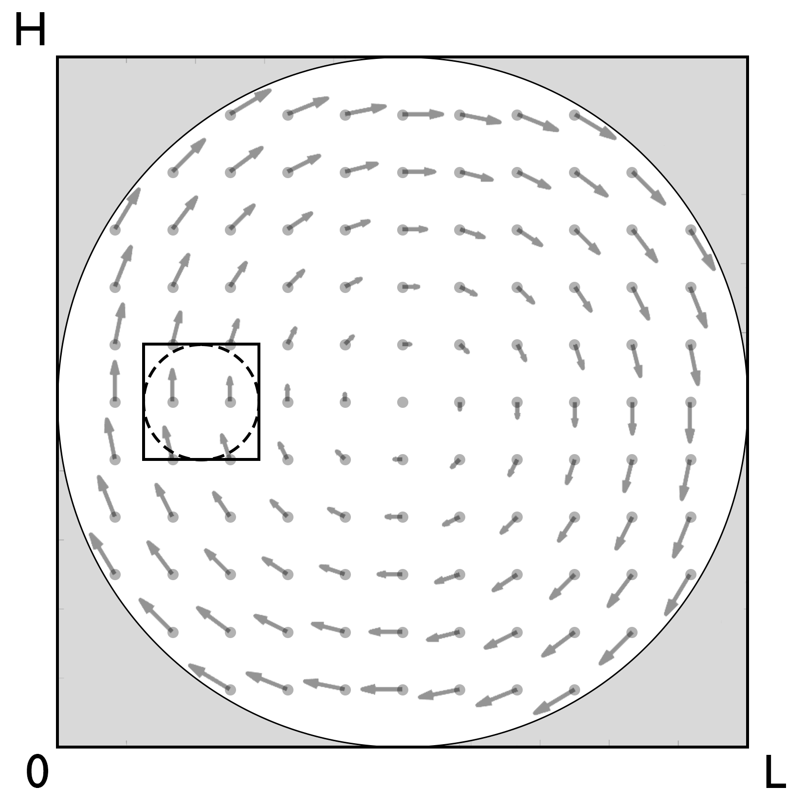

# [Advection Problem (2D)](https://github.com/GeoSci-FFM/GeoModBox.jl/blob/main/examples/AdvectionEquation/2D_Advection.jl)

This example evaluates the accuracy of the advection solvers implemented for two-dimensional problems. The available solvers are: 

- upwind 
- staggered leapfrog
- semi-lagrangian 
- tracers

The first three solvers can advect any property defined at the cell centroids, including the corresponding extended field containing ghost nodes. For this purpose, the staggered velocity components are interpolated to the cell centroids. Tracers are used to advect temperature. Changes in the grid-based temperature field are transferred to the tracers by calculating the temperature increment between the current and previous grid fields. This increment is interpolated to the tracers and added to their temperatures. The increment is then interpolated from the grid to the markers and added to the marker temperatures. The temperature at the centroids is subsequently computed using an arithmetic averaging scheme. For more implementation details please see the [documentation](../../theory/AdvectMain.md).

The initial temperature condition can be defined using one of the following anomalies: 

- a rectangular block 
- a Gaussian temperature distribution
- a circle

>**Note:** The anomaly is here defined as a temperature anomaly. However, one could also assume a similar density anomaly. 

Two different velocity fields can be used as initial conditions: 

- a rigid body rotation 
- an analytical shear cell velocity

The shear-cell velocity field is primarily intended for testing advection schemes, but it may also be used as an analytical initial condition for thermal-convection problems.

In this example, rigid body rotation is the preferred initial velocity condition. Rigid body rotation provides a useful benchmark for testing advection scheme accuracy, as it applies pure rotation, displacing the anomaly without deformation. After one complete revolution, the shape and amplitude of the anomaly should ideally match the initial condition. Any deviation from the initial condition indicates either numerical diffusion (as in the upwind method) or interpolation error, particularly for sharp gradients. 



**Figure 1. Rigid Body Rotation.** Initial configuration for rigid-body rotation with either a circular anomaly (dashed outline) or a rectangular anomaly (solid outline). The velocity field, indicated by the gray arrows, is set to zero outside the inner circular region shown in gray to minimize boundary effects.

**Initial Velocity Condition**

The velocity is assumed to be constant and calculated on the staggered grid. For advection, the velocity on the cendroids is used, except for the tracers. The analytical velocity for the here given velocity fields is given as

**Rigid Body Rotation**

$\begin{equation}\begin{split}
v_x & = \frac{y_c-\frac{H}{2}}{H}, \\
v_y & = -\frac{x_c-\frac{L}{2}}{H},
\end{split}\end{equation}$

and

**Shear Cell** 

$\begin{equation}\begin{split}
v_x & = -\text{sin}\left(\pi \frac{x_v}{L}\right)*\text{cos}\left(\pi \frac{y_c}{H}\right), \\
v_y & = \text{cos}\left(\pi \frac{x_c}{L}\right)*\text{sin}\left(\pi \frac{y_v}{H}\right).
\end{split}\end{equation}$

---

First one needs to load the required packages: 

```Julia 
using Plots, Interpolations
using GeoModBox.AdvectionEquation.TwoD, GeoModBox.Tracers.TwoD
using GeoModBox.InitialCondition
using Base.Threads
using Printf, TimerOutputs, LaTeXStrings, Measures
```

In the following one can define the advection scheme as well as the initial conditions. Additionally, several plotting parameters are defined in the very beginning as well. 

```Julia
@printf("Running on %d thread(s)\n", nthreads())

save_fig    =   1

# Define Numerical Scheme ============================================ #
# Advection ---
#   1) upwind, 2) slf, 3) semilag, 4) markers
FD          =   (Method     = (Adv=:upwind,),)
# -------------------------------------------------------------------- #
# Define Initial Condition =========================================== #
# Temperature --- 
#   1) circle, 2) gaussian, 3) block, 4) linear
# Velocity ---
#   1) RigidBody, 2) ShearCell
Ini         =   (T=:circle,V=:RigidBody,) 
# -------------------------------------------------------------------- #
# Plot constants ===================================================== #
Pl  =   (
    inc         =   5,
    sc          =   1.0e9,
    Minc        =   1, 
    Msz         =   0.2,
)
# -------------------------------------------------------------------- #
```

Now, one can define the geometry of the square model domain. 

```Julia
# Model Constants ==================================================== #
M   =   (
    xmin    =   0.0,
    xmax    =   1.0,
    ymin    =   0.0,
    ymax    =   1.0,
)
# -------------------------------------------------------------------- #
 ``` 

In the following the numerical grid and its coordinates are defined. 

 ```Julia
BC  =   ()  # dummy
# Numerical Constants ================================================ #
NC  =   (
    x       =   100,        # Number of horizontal centroids
    y       =   100,        # Number of vertical centroids
)
NV =   (
    x       =   NC.x + 1,   # Number of horizontal vertices
    y       =   NC.y + 1,   # Number of vertical vertices
)
Δ   =   (
    x   =   (abs(M.xmin)+M.xmax)/NC.x,
    y   =   (abs(M.ymin)+M.ymax)/NC.y,
)
# -------------------------------------------------------------------- #
# Grid =============================================================== #
x   =   (
    c       =   LinRange(M.xmin + Δ.x/2.0, M.xmax - Δ.x/2.0, NC.x),
    ce      =   LinRange(M.xmin - Δ.x/2.0, M.xmax + Δ.x/2.0, NC.x+2),
    v       =   LinRange(M.xmin, M.xmax , NV.x)    
)
y       = (
    c       =   LinRange(M.ymin + Δ.y/2.0, M.ymax - Δ.y/2.0, NC.y),
    ce      =   LinRange(M.ymin - Δ.y/2.0, M.ymax + Δ.y/2.0, NC.y+2),
    v       =   LinRange(M.ymin, M.ymax, NV.y),    
)
x1      =   ( 
    c2d     =   x.c .+ 0*y.c',
    v2d     =   x.v .+ 0*y.v', 
    vx2d    =   x.v .+ 0*y.ce',
    vy2d    =   x.ce .+ 0*y.v',
)
x   =   merge(x,x1)
y1      =   (
    c2d     =   0*x.c .+ y.c',
    v2d     =   0*x.v .+ y.v',
    vx2d    =   0*x.v .+ y.ce',
    vy2d    =   0*x.ce .+ y.v',
)
y   =   merge(y,y1)
# -------------------------------------------------------------------- #
```

To visualize the result, the path and filename for the GIF animation are defined. Additional, the memory for the required data fields is initialized. 

```Julia
# Animationsettings ================================================== #
path        =   string("./examples/AdvectionEquation/Results/")
anim        =   Plots.Animation(path, String[] )
filename    =   string("2D_advection_",Ini.T,"_",Ini.V,
                        "_",FD.Method.Adv)
# -------------------------------------------------------------------- #
# Initialize Array =================================================== #
D       =   (
    T       =   zeros(Float64,(NC.x,NC.y)),
    T_ex    =   zeros(Float64,(NC.x+2,NC.y+2)),
    T_exo   =   zeros(Float64,(NC.x+2,NC.y+2)),
    Told_ex =   zeros(Float64,(NC.x+2,NC.y+2)),
    vx      =   zeros(Float64,(NV.x,NV.y+1)),
    vy      =   zeros(Float64,(NV.x+1,NV.y)),    
    vxc     =   zeros(Float64,(NC.x,NC.y)),
    vyc     =   zeros(Float64,(NC.x,NC.y)),
    vc      =   zeros(Float64,(NC.x,NC.y)),
    wt      =   zeros(Float64,(NC.x,NC.y)),
    wte     =   zeros(Float64,(NC.x+2,NC.y+2)),
    wtv     =   zeros(Float64,(NV...)),
    Tmax    =   [0.0],
    Tmin    =   [0.0],
    Tmean   =   [0.0],
)
# -------------------------------------------------------------------- #
```

Now, one can calculate the initial conditions. Here, the built-in functions for the initial temperature and velocity conditions, `IniTemperature!()` and `IniVelocity!()`, respectively, are used. For more informaion please refer to the [documentation](../../Ini.md). Following the velocity initialization, one can calculate the velocity on the centroids. 

```Julia
# Initial Conditions ================================================= #
# Temperature ---
IniTemperature!(Ini.T,M,NC,D,x,y)
if FD.Method.Adv==:slf
    D.T_exo    .=  D.T_ex
end
D.Tmax[1]   =   maximum(D.T_ex)
D.Tmin[1]   =   minimum(D.T_ex)
D.Tmean[1]  =   (D.Tmax[1]+D.Tmin[1])/2
# Velocity ---
IniVelocity!(Ini.V,D,BC,NV,Δ,M,x,y)            # [ m/s ]
# Get the velocity on the centroids ---
@threads for i = 1:NC.x
    for j = 1:NC.y
        D.vxc[i,j]  = (D.vx[i,j+1] + D.vx[i+1,j+1])/2
        D.vyc[i,j]  = (D.vy[i+1,j] + D.vy[i+1,j+1])/2
    end
end
@. D.vc        = sqrt(D.vxc^2 + D.vyc^2)
# -------------------------------------------------------------------- #
```

Now, one needs to define the time parameter. Here, the maximum simulation time is chosen such that the anomaly completes one full revolution. 

```Julia
# Time =============================================================== #
T   =   ( 
    tmax    =   [0.0],  
    Δfac    =   1.0,    # Courant time factor, i.e. dtfac*dt_courant
    Δ       =   [0.0],
)
T.tmax[1]   =   π*((M.xmax-M.xmin)-2*Δ.x)/maximum(D.vc)   # t = U/v [ s ]
T.Δ[1]      =   T.Δfac * minimum((Δ.x,Δ.y)) / 
            (sqrt(maximum(abs.(D.vx))^2 + maximum(abs.(D.vy))^2))
nt          =   ceil(Int,T.tmax[1]/T.Δ[1])
# -------------------------------------------------------------------- #
```

If tracer are used one needs to initialize them in the following. For more information please refer to the [documentation](../../Ini.md).

```Julia
# Tracer Advection =================================================== #
if FD.Method.Adv==:markers 
    # Tracer Initialization ---
    nmx,nmy     =   5,5
    noise       =   1
    nmark       =   nmx*nmy*NC.x*NC.y
    Aparam      =   :thermal
    MPC         =   (
        c       =   zeros(Float64,(NC.x,NC.y)),
        v       =   zeros(Float64,(NV.x,NV.y)),
        th      =   zeros(Float64,(nthreads(),NC.x,NC.y)),
        thv     =   zeros(Float64,(nthreads(),NV.x,NV.y)),
    )
    MAVG        = (
        PC_th   =   [similar(D.wte) for _ = 1:nthreads()],  # per thread
        PV_th   =   [similar(D.wtv) for _ = 1:nthreads()],   # per thread
        wte_th  =   [similar(D.wte) for _ = 1:nthreads()],  # per thread
        wtv_th  =   [similar(D.wtv) for _ = 1:nthreads()],  # per thread
    )
    Ma      =   IniTracer2D(Aparam,nmx,nmy,Δ,M,NC,noise,0,0)
    # RK4 weights ---
    rkw     =   1.0/6.0*[1.0 2.0 2.0 1.0]   # for averaging
    rkv     =   1.0/2.0*[1.0 1.0 2.0 2.0]   # for time stepping
    # Interpolate on centroids ---
    @threads for k = 1:nmark
        Ma.T[k] =   FromCtoM(D.T_ex, k, Ma, x, y, Δ, NC)
    end
    ΔT_grid     =   zeros(Float64,(NC.x+2,NC.y+2))
    # Count marker per cell ---
    CountMPC(Ma,nmark,MPC,M,x,y,Δ,NC,NV)
end
# -------------------------------------------------------------------- #
```

Let's visualize the initial condition first. 

```Julia
# Visualize initial condition ======================================== #
if FD.Method.Adv==:markers
    p = heatmap(x.c,y.c,(D.T./D.Tmax)',color=:thermal, 
            aspect_ratio=:equal,xlims=(M.xmin, M.xmax), 
            ylims=(M.ymin, M.ymax),clims=(0.5, 1.0),
                    colorbar=true, size = (1200,600), dpi = 300,
                                        title= latexstring("\\mathrm{", string(FD.Method.Adv), "}"),
                    layout=(1,2),subplot=1)
    quiver!(p,x.c2d[1:Pl.inc:end,1:Pl.inc:end],
            y.c2d[1:Pl.inc:end,1:Pl.inc:end],
            quiver=(D.vxc[1:Pl.inc:end,1:Pl.inc:end].*Pl.sc,
                    D.vyc[1:Pl.inc:end,1:Pl.inc:end].*Pl.sc),        
                    color="white",
                    layout=(1,2),subplot=1)
    heatmap!(p,x.c,y.c,MPC.c',color=:inferno, 
                    aspect_ratio=:equal,
                    xlims=(M.xmin, M.xmax), 
                    ylims=(M.ymin, M.ymax),
                    colorbar=true,clims=(0.0, 18.0),
            layout=(1,2),subplot=2)
else
    p = heatmap(x.c , y.c, (D.T./D.Tmax)', 
            color=:thermal, colorbar=true, aspect_ratio=:equal, 
                    xlabel= L"x", ylabel= L"z", 
                    title= latexstring("\\mathrm{", string(FD.Method.Adv), "}"),
                    xlims=(M.xmin, M.xmax), 
                    ylims=(M.ymin, M.ymax), 
                    clims=(0.5, 1.0),
                    size = (900,900), dpi = 300,
                    guidefontsize = 20, tickfontsize = 20,
                    right_margin = 10mm,
                    titlefontsize = 20,
                    )
    quiver!(p,x.c2d[1:Pl.inc:end,1:Pl.inc:end],y.c2d[1:Pl.inc:end,1:Pl.inc:end],
            quiver=(D.vxc[1:Pl.inc:end,1:Pl.inc:end].*Pl.sc,
                    D.vyc[1:Pl.inc:end,1:Pl.inc:end].*Pl.sc),        
            color="white")
end
if save_fig == 1
    Plots.frame(anim)
elseif save_fig == 0
    display(p)
end
# -------------------------------------------------------------------- #
```


**Figure 2. Initial condition.** Initial rigid-body rotation setup with a circular temperature anomaly. The temperature is normalized by its initial maximum value, such that the maximum anomaly temperature equals one. 

Now, one can start the time loop and the advection. 

```Julia
# Time Loop ========================================================== #
for i=2:nt
    @printf("Time step: #%04d\n ",i)

    # Advection ===
    @timeit to "Advection" begin
    if FD.Method.Adv==:upwind
        upwindc2D!(D.T,D.T_ex,D.vxc,D.vyc,NC,T.Δ[1],Δ.x,Δ.y)
    elseif FD.Method.Adv==:slf
        slfc2D!(D.T,D.T_ex,D.T_exo,D.vxc,D.vyc,NC,T.Δ[1],Δ.x,Δ.y)
    elseif FD.Method.Adv==:semilag
        semilagc2D!(D.T,D.T_ex,D.vxc,D.vyc,D.vxc,D.vyc,x,y,T.Δ[1])
    elseif FD.Method.Adv==:markers
        @. ΔT_grid     =   D.T_ex - D.Told_ex
        @threads for k = 1:nmark
            local ΔTm       =   FromCtoM(ΔT_grid, k, Ma, x, y, Δ, NC)
            Ma.T[k]     += ΔTm
        end
        # Advect markers ---
        AdvectTracer2D(Ma,nmark,D,x,y,T.Δ[1],Δ,NC,rkw,rkv)
        CountMPC(Ma,nmark,MPC,M,x,y,Δ,NC,NV)
        # Interpolate temperature from markers to grid ---
        Markers2Cells(Ma,nmark,MAVG.PC_th,D.T_ex,MAVG.wte_th,D.wte,x,y,Δ,Aparam,0)           
        D.T     .=  D.T_ex[2:end-1,2:end-1]
    end
    end
    display(string("ΔT = ",((maximum(filter(!isnan,D.T))-D.Tmax[1])/D.Tmax[1])*100))

    # Plot Solution ---
    if mod(i,10) == 0 || i == nt
        if FD.Method.Adv==:markers
            p = heatmap(x.c,y.c,(D.T./D.Tmax)',color=:thermal, 
                    aspect_ratio=:equal,xlims=(M.xmin, M.xmax), 
                    ylims=(M.ymin, M.ymax),clims=(0.5, 1.0),
                            colorbar=true, size = (1200,600), dpi = 300,
                                                title= latexstring("\\mathrm{", string(FD.Method.Adv), "}"),
                            layout=(1,2),subplot=1)
            quiver!(p,x.c2d[1:Pl.inc:end,1:Pl.inc:end],
                    y.c2d[1:Pl.inc:end,1:Pl.inc:end],
                    quiver=(D.vxc[1:Pl.inc:end,1:Pl.inc:end].*Pl.sc,
                            D.vyc[1:Pl.inc:end,1:Pl.inc:end].*Pl.sc),        
                            color="white",
                            layout=(1,2),subplot=1)
            heatmap!(p,x.c,y.c,MPC.c',color=:inferno, 
                            aspect_ratio=:equal,
                            xlims=(M.xmin, M.xmax), 
                            ylims=(M.ymin, M.ymax),
                            colorbar=true,clims=(0.0, 18.0),
                    layout=(1,2),subplot=2)
        else
            p = heatmap(x.c , y.c, (D.T./D.Tmax)', 
                    color=:thermal, colorbar=true, aspect_ratio=:equal, 
                            xlabel= L"x", ylabel= L"z", 
                            title= latexstring("\\mathrm{", string(FD.Method.Adv), "}"),
                            xlims=(M.xmin, M.xmax), 
                            ylims=(M.ymin, M.ymax), 
                            clims=(0.5, 1.0),
                            size = (900,900), dpi = 300,
                            guidefontsize = 20, tickfontsize = 20,
                            right_margin = 10mm,
                            titlefontsize = 20,
                            )
                    quiver!(p,x.c2d[1:Pl.inc:end,1:Pl.inc:end],y.c2d[1:Pl.inc:end,1:Pl.inc:end],
                        quiver=(D.vxc[1:Pl.inc:end,1:Pl.inc:end].*Pl.sc,
                                D.vyc[1:Pl.inc:end,1:Pl.inc:end].*Pl.sc),        
                    color="white")
        end
        if save_fig == 1
            Plots.frame(anim)
        elseif save_fig == 0
            display(p)                        
        end
    end
    if FD.Method.Adv == :markers
        # Update old temperature field ---
        @. D.Told_ex    =   D.T_ex
    end
end # End Time Loop
# -------------------------------------------------------------------- #
```

In the end, the GIF animation is generated. 

```Julia
# Save Animation ===================================================== #
if save_fig == 1
    # Write the frames to a GIF file
    Plots.gif(anim, string( path, filename, ".gif" ), fps = 15)
    foreach(rm, filter(startswith(string(path,"00")), readdir(path,join=true)))
elseif save_fig == 0
    display(plot(p))
end
# -------------------------------------------------------------------- #
```


**Figure 3. Rigid Body Rotation using the Upwind Scheme.**


**Figure 4. Rigid Body Rotation using Tracers.** Left: Temperature field interpolated from tracers onto the centroids. Right: Tracer density per cell. The simulation was performed using a single CPU thread. 