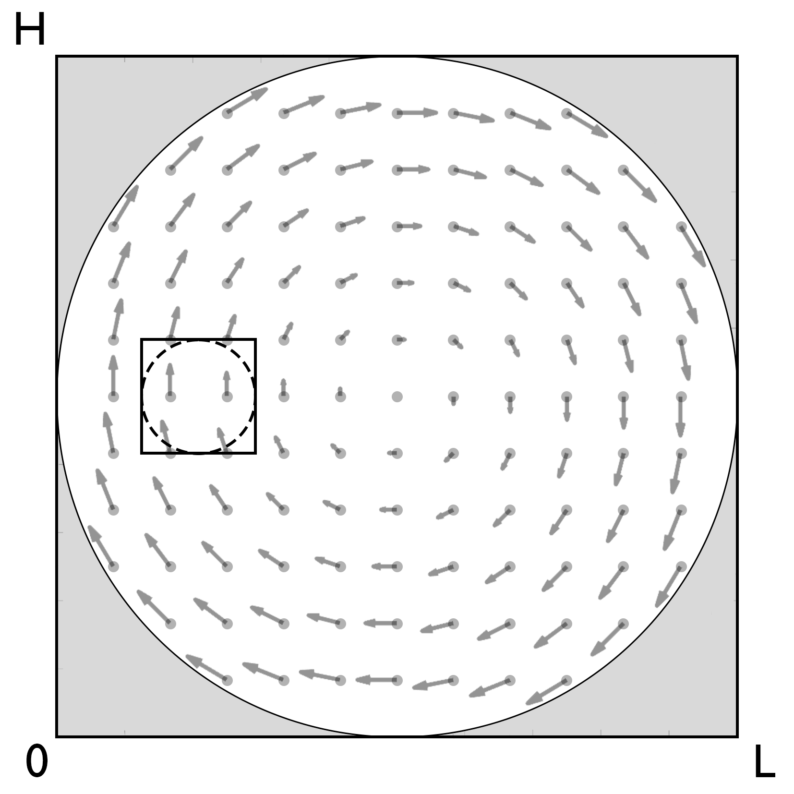
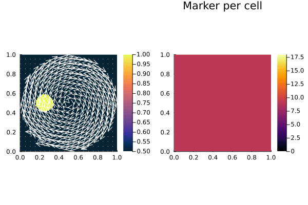

# [Advection Problem (2D)](https://github.com/GeoSci-FFM/GeoModBox.jl/blob/main/examples/AdvectionEquation/2D_Advection.jl)


This is an example to test the quality of the advection solver in two dimensions. The available solvers are: 

- upwind 
- staggered leapfrog
- semi-lagrangian 
- tracers

The first three solvers are designed in such a way, that any property defined on the centroids including ghost nodes can be advected with the interpolated centroid velocity from the staggered grid. The tracers are here used to advect the initial temperature anomaly, without updating the information on the tracers; that is, the temperature is interpolated on the centroids every time step. For more implementation details please see the [documentation](../AdvectMain.md).

As initial temperature condition, one can use three different anomalies, which are: 

- a rectangular block 
- a Gaussian temperature distribution
- a circle

>**Note:** The anomaly is here defined on the temperature field. However, one could also assume a similar density anomaly. This might even be more applicable for the tracer advection test. 

As initial velocity condition, one can use two different fields: 

- a rigid body rotation 
- an analytical shear cell velocity

The second field is simply applicable to test the code or might also be used as initial velocity condition for a thermal convection. 

For the given example, the rigid body rotation should actually be choosed as initial velocity. A rigid body rotation is a very good benchmark to test the efficiency of the advection scheme, since only rotation is applied which results in a simple displacment of an anomaly without deformation. Thus, the shape and intensity of the anomaly should be the same as in the initial condition. Any deviation thereof is a result of either numerical diffusion (e.g., for the upwind case) or an interpolation error, especially for sharp gradient anomalies. 



**Figure 1. Rigid Body Rotation.** Initial setup for a rigid body rotation with a circular (dashed line) or rectangular (solid line) anomaly. The velocity (gray arrows) within the square model domain is set to zero outside the inner circle area (gray shaped) to avoid boundary effects. 

**Initial Velocity Condtion**

The velocity is assumed to be constant and calculated on the staggered grid. For advection, the velocity on the cenroids is used, except for the tracers. The analytical velocity for the here given velocity fields is given as

**Rigid Body Rotation**

$\begin{equation}\begin{split}
v_x & = \frac{y_c-\frac{H}{2}}{H}, \\
v_y & = -\frac{x_c-\frac{L}{2}}{L},
\end{split}\end{equation}$

and

**Shear Cell** 

$\begin{equation}\begin{split}
v_x & = -\text{sin}\left(\pi \frac{x_v}{L}\right)*\text{cos}\left(\pi \frac{y_c}{H}\right), \\
v_y & = \text{cos}\left(\pi \frac{x_c}{L}\right)*\text{sin}\left(\pi \frac{y_v}{H}\right).
\end{split}\end{equation}$

---

First one needs to load the required packages: 

```Julia 
using Plots, Interpolations
using GeoModBox.AdvectionEquation.TwoD, GeoModBox.Tracers.TwoD
using GeoModBox.InitialCondition
using Base.Threads
using Printf
```

In the following one can define the advection scheme as well as the initial conditions. Additional some plot parameters are defined in the very beginning as well. 

```Julia
@printf("Running on %d thread(s)\n", nthreads())

save_fig    =   1

# Define Numerical Scheme ============================================ #
# Advection ---
#   1) upwind, 2) slf, 3) semilag, 4) tracers
FD          =   (Method     = (Adv=:tracers,),)
# -------------------------------------------------------------------- #
# Define Initial Condition =========================================== #
# Temperature --- 
#   1) circle, 2) gaussian, 3) block
# Velocity ---
#   1) RigidBody, 2) ShearCell
Ini         =   (T=:circle,V=:RigidBody,) 
# -------------------------------------------------------------------- #
# Plot constants ===================================================== #
Pl  =   (
    inc         =   5,
    sc          =   1.0e9,
    Minc        =   1, 
    Msz         =   0.2,
)
# -------------------------------------------------------------------- #
```

Now, one can define the geometry of the squared model domain. 

```Julia
# Model Constants ==================================================== #
M   =   (
    xmin    =   0.0,
    xmax    =   1.0,
    ymin    =   0.0,
    ymax    =   1.0,
)
# -------------------------------------------------------------------- #
# Numerical Constants ================================================ #
NC  =   (
    x       =   100,        # Number of horizontal centroids
    y       =   100,        # Number of vertical centroids
)
NV =   (
    x       =   NC.x + 1,   # Number of horizontal vertices
    y       =   NC.y + 1,   # Number of vertical vertices
)
Δ   =   (
    x   =   (abs(M.xmin)+M.xmax)/NC.x,
    y   =   (abs(M.ymin)+M.ymax)/NC.y,
)
# -------------------------------------------------------------------- #
# Grid =============================================================== #
x   =   (
    c       =   LinRange(M.xmin + Δ.x/2.0, M.xmax - Δ.x/2.0, NC.x),
    ce      =   LinRange(M.xmin - Δ.x/2.0, M.xmax + Δ.x/2.0, NC.x+2),
    v       =   LinRange(M.xmin, M.xmax , NV.x)    
)
y       = (
    c       =   LinRange(M.ymin + Δ.y/2.0, M.ymax - Δ.y/2.0, NC.y),
    ce      =   LinRange(M.ymin - Δ.x/2.0, M.ymax + Δ.x/2.0, NC.y+2),
    v       =   LinRange(M.ymin, M.ymax, NV.y),    
)
x1      =   ( 
    c2d     =   x.c .+ 0*y.c',
    v2d     =   x.v .+ 0*y.v', 
    vx2d    =   x.v .+ 0*y.ce',
    vy2d    =   x.ce .+ 0*y.v',
)
x   =   merge(x,x1)
y1      =   (
    c2d     =   0*x.c .+ y.c',
    v2d     =   0*x.v .+ y.v',
    vx2d    =   0*x.v .+ y.ce',
    vy2d    =   0*x.ce .+ y.v',
)
y   =   merge(y,y1)
# -------------------------------------------------------------------- #
# Animationsettings ================================================== #
path        =   string("./examples/AdvectionEquation/Results/")
anim        =   Plots.Animation(path, String[] )
filename    =   string("2D_advection_",Ini.T,"_",Ini.V,
                        "_",FD.Method.Adv)
# -------------------------------------------------------------------- #
# Initialize Array =================================================== #
D       =   (
    T       =   zeros(Float64,(NC.x,NC.y)),
    T_ex    =   zeros(Float64,(NC.x+2,NC.y+2)),
    T_exo   =   zeros(Float64,(NC.x+2,NC.y+2)),
    vx      =   zeros(Float64,(NV.x,NV.y+1)),
    vy      =   zeros(Float64,(NV.x+1,NV.y)),    
    vxc     =   zeros(Float64,(NC.x,NC.y)),
    vyc     =   zeros(Float64,(NC.x,NC.y)),
    vc      =   zeros(Float64,(NC.x,NC.y)),
    wt      =   zeros(Float64,(NC.x,NC.y)),
    wtv     =   zeros(Float64,(NV...)),
    Tmax    =   [0.0],
    Tmin    =   [0.0],
    Tmean   =   [0.0],
)
# -------------------------------------------------------------------- #
# Initial Conditions ================================================= #
# Temperature ---
IniTemperature!(Ini.T,M,NC,Δ,D,x,y)
if FD.Method.Adv==:slf
    D.T_exo    .=  D.T_ex
end
# Velocity ---
IniVelocity!(Ini.V,D,NV,Δ,M,x,y)            # [ m/s ]
# Get the velocity on the centroids ---
@threads for i = 1:NC.x
    for j = 1:NC.y
        D.vxc[i,j]  = (D.vx[i,j+1] + D.vx[i+1,j+1])/2
        D.vyc[i,j]  = (D.vy[i+1,j] + D.vy[i+1,j+1])/2
    end
end
@. D.vc        = sqrt(D.vxc^2 + D.vyc^2)
# -------------------------------------------------------------------- #
# Time =============================================================== #
T   =   ( 
    tmax    =   [0.0],  
    Δfac    =   1.0,    # Courant time factor, i.e. dtfac*dt_courant
    Δ       =   [0.0],
)
T.tmax[1]   =   π*((M.xmax-M.xmin)-Δ.x)/maximum(D.vc)   # t = U/v [ s ]
T.Δ[1]      =   T.Δfac * minimum((Δ.x,Δ.y)) / 
            (sqrt(maximum(abs.(D.vx))^2 + maximum(abs.(D.vy))^2))
nt          =   ceil(Int,T.tmax[1]/T.Δ[1])
# -------------------------------------------------------------------- #
# Tracer Advection =================================================== #
if FD.Method.Adv==:tracers 
    # Tracer Initialization ---
    nmx,nmy     =   3,3
    noise       =   1
    nmark       =   nmx*nmy*NC.x*NC.y
    Aparam      =   :thermal
    MPC         =   (
        c       =   zeros(Float64,(NC.x,NC.y)),
        v       =   zeros(Float64,(NV.x,NV.y)),
        th      =   zeros(Float64,(nthreads(),NC.x,NC.y)),
        thv     =   zeros(Float64,(nthreads(),NV.x,NV.y)),
    )
    MPC1        = (
        PG_th   =   [similar(D.T) for _ = 1:nthreads()],    # per thread
        PV_th   =   [similar(D.wtv) for _ = 1:nthreads()],   # per thread
        wt_th   =   [similar(D.wt) for _ = 1:nthreads()],   # per thread
        wtv_th  =   [similar(D.wtv) for _ = 1:nthreads()],  # per thread
    )
    MPC     =   merge(MPC,MPC1)
    Ma      =   IniTracer2D(Aparam,nmx,nmy,Δ,M,NC,noise,0,0)
    # RK4 weights ---
    rkw     =   1.0/6.0*[1.0 2.0 2.0 1.0]   # for averaging
    rkv     =   1.0/2.0*[1.0 1.0 2.0 2.0]   # for time stepping
    # Interpolate on centroids ---
    @threads for k = 1:nmark
        Ma.T[k] =   FromCtoM(D.T_ex, k, Ma, x, y, Δ, NC)
    end
    # Count marker per cell ---
    CountMPC(Ma,nmark,MPC,M,x,y,Δ,NC,NV,1)
end
# -------------------------------------------------------------------- #
# Visualize initial condition ======================================== #
if FD.Method.Adv==:tracers
    p = heatmap(x.c,y.c,(D.T./D.Tmax)',color=:thermal, 
            aspect_ratio=:equal,xlims=(M.xmin, M.xmax), 
            ylims=(M.ymin, M.ymax),clims=(0.5, 1.0),
            colorbar=true,layout=(1,2),subplot=1)
    quiver!(p,x.c2d[1:Pl.inc:end,1:Pl.inc:end],
            y.c2d[1:Pl.inc:end,1:Pl.inc:end],
            quiver=(D.vxc[1:Pl.inc:end,1:Pl.inc:end].*Pl.sc,
                    D.vyc[1:Pl.inc:end,1:Pl.inc:end].*Pl.sc),        
            color="white",layout=(1,2),subplot=1)
    heatmap!(p,x.c,y.c,MPC.c',color=:inferno, 
            aspect_ratio=:equal,xlims=(M.xmin, M.xmax), ylims=(M.ymin, M.ymax),
            colorbar=true,clims=(0.0, 18.0),title=:"Marker per cell",
            layout=(1,2),subplot=2)
else
    p = heatmap(x.c , y.c, (D.T./D.Tmax)', 
            color=:thermal, colorbar=true, aspect_ratio=:equal, 
            xlabel="x", ylabel="z", 
            title="Temperature", 
            xlims=(M.xmin, M.xmax), ylims=(M.ymin, M.ymax), 
            clims=(0.5, 1.0))
    quiver!(p,x.c2d[1:Pl.inc:end,1:Pl.inc:end],y.c2d[1:Pl.inc:end,1:Pl.inc:end],
            quiver=(D.vxc[1:Pl.inc:end,1:Pl.inc:end].*Pl.sc,
                    D.vyc[1:Pl.inc:end,1:Pl.inc:end].*Pl.sc),        
            color="white")
end
if save_fig == 1
    Plots.frame(anim)
elseif save_fig == 0
    display(p)
end
# -------------------------------------------------------------------- #
# Time Loop ========================================================== #
for i=2:nt
    @printf("Time step: #%04d\n ",i)

    # Advection ===
    if FD.Method.Adv==:upwind
        upwindc2D!(D.T,D.T_ex,D.vxc,D.vyc,NC,T.Δ[1],Δ.x,Δ.y)
    elseif FD.Method.Adv==:slf
        slfc2D!(D.T,D.T_ex,D.T_exo,D.vxc,D.vyc,NC,T.Δ[1],Δ.x,Δ.y)
    elseif FD.Method.Adv==:semilag
        semilagc2D!(D.T,D.T_ex,D.vxc,D.vyc,[],[],x,y,T.Δ[1])
    elseif FD.Method.Adv==:tracers
        # Advect tracers ---
        AdvectTracer2D(Ma,nmark,D,x,y,T.Δ[1],Δ,NC,rkw,rkv,1)
        # CountMPC(Ma,nmark,MPC,M,x,y,Δ,NC,i)
        CountMPC(Ma,nmark,MPC,M,x,y,Δ,NC,NV,i)
        
        # Interpolate temperature from tracers to grid ---
        Markers2Cells(Ma,nmark,MPC.PG_th,D.T,MPC.wt_th,D.wt,x,y,Δ,Aparam,0)           
        D.T_ex[2:end-1,2:end-1]     .= D.T
    end
    
    display(string("ΔT = ",((maximum(filter(!isnan,D.T))-D.Tmax[1])/D.Tmax[1])*100))

    # Plot Solution ---
    if mod(i,10) == 0 || i == nt
        if FD.Method.Adv==:tracers
            p = heatmap(x.c,y.c,(D.T./D.Tmax)',color=:thermal, 
                    aspect_ratio=:equal,xlims=(M.xmin, M.xmax), 
                    ylims=(M.ymin, M.ymax),clims=(0.5, 1.0),
                    colorbar=true,layout=(1,2),subplot=1)
            quiver!(p,x.c2d[1:Pl.inc:end,1:Pl.inc:end],
                    y.c2d[1:Pl.inc:end,1:Pl.inc:end],
                    quiver=(D.vxc[1:Pl.inc:end,1:Pl.inc:end].*Pl.sc,
                            D.vyc[1:Pl.inc:end,1:Pl.inc:end].*Pl.sc),        
                    color="white",layout=(1,2),subplot=1)
            heatmap!(p,x.c,y.c,MPC.c',color=:inferno, 
                    aspect_ratio=:equal,xlims=(M.xmin, M.xmax), ylims=(M.ymin, M.ymax),
                    colorbar=true,clims=(0.0, 18.0),title=:"Marker per cell",
                    layout=(1,2),subplot=2)
        else
            p = heatmap(x.c , y.c, (D.T./D.Tmax)', 
                    color=:thermal, colorbar=true, aspect_ratio=:equal, 
                    xlabel="x", ylabel="z", 
                    title="Temperature", 
                    xlims=(M.xmin, M.xmax), ylims=(M.ymin, M.ymax), 
                    clims=(0.5, 1.0))
            quiver!(p,x.c2d[1:Pl.inc:end,1:Pl.inc:end],
                        y.c2d[1:Pl.inc:end,1:Pl.inc:end],
                        quiver=(D.vxc[1:Pl.inc:end,1:Pl.inc:end].*Pl.sc,
                                D.vyc[1:Pl.inc:end,1:Pl.inc:end].*Pl.sc),        
                    color="white")
        end
        if save_fig == 1
            Plots.frame(anim)
        elseif save_fig == 0
            display(p)                        
        end
    end
end # End Time Loop
# -------------------------------------------------------------------- #
# Save Animation ===================================================== #
if save_fig == 1
    # Write the frames to a GIF file
    Plots.gif(anim, string( path, filename, ".gif" ), fps = 15)
    foreach(rm, filter(startswith(string(path,"00")), readdir(path,join=true)))
elseif save_fig == 0
    display(plot(p))
end
# -------------------------------------------------------------------- #
```


**Figure 3. Rigid Body Rotation using Upwind. ***



**Figure 4. Rigid Body Rotation using Tracers.** Left: Temperature field interpolated from the tracers onto the centroids. Right: Tracers density per cell. The problem was solved on one cpu. 