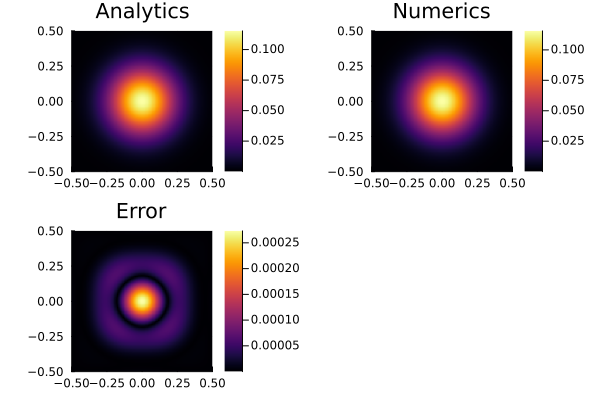

# [Diffusion Equation (Backward Euler)](https://github.com/GeoSci-FFM/GeoModBox.jl/blob/main/examples/DiffusionEquation/2D/BackwardEuler.jl)

This is a straight forward example to solve the conductive part of the 2-D temperature conservation equation using the defect correction method. The focus lies on the

- application of the expanded temperature field and boundary conditions,
- set up of the coefficient matrix and residual vector,
- implementation of the analytical solution (```ExactFieldSolution.jl```), and
- application of the defect correction method. 

The example calculates the numerical solution of a transient diffusion of an initial, Gaussian 2-D temperature distribution. The peak $T0$ of the Gaussian anomaly is located in the center of the model domain with a certain width $\sigma$. The diffusion is controlled by the diffusion coefficient (thermal conductivity) $K$. 

The accuracy of the numerical solution is checked with its analytical solution. The results are plotet for ever ```nout``` time step in a single figure. 

---

First one needs to load the required packages: 

```Julia 
using GeoModBox.HeatEquation.TwoD
using ExactFieldSolutions, LinearAlgebra, Plots, Printf
```

Now, one needs to define the geometry and the numerical parameters. 

```julia
# Spatial domain
xlim = (min=-1/2, max=1/2)
ylim = (min=-1/2, max=1/2)
nc   = (x=100, y=100)
nv   = (x=nc.x+1, y=nc.y+1)
nc   = (x=nc.x+0, y=nc.y+0)
nv   = (x=nv.x+0, y=nv.y+0)
Δ    = (x=(xlim.max-xlim.min)/nc.x, y=(ylim.max-ylim.min)/nc.y)
x    = (c=LinRange(xlim.min+Δ.x/2, xlim.max-Δ.x/2, nc.x), v=LinRange(xlim.min, xlim.max, nv.x))
y    = (c=LinRange(ylim.min+Δ.y/2, ylim.max-Δ.y/2, nc.y), v=LinRange(ylim.min, ylim.max, nv.y))
```

Now, one needs to define the time parameters and parameters for the solution iteration. 

```Julia
# Time domain
nt   = 500
t    = 0.
nout = 10 
# Iterations
niter = 10
ϵ     = 1e-10
```

In the following, all fields and parameter arrays are initialized. 

```Julia
# Primitive variables
T_ex  = zeros(nc.x+2, nc.y+2)
T     = zeros(nc...)
T0    = zeros(nc...)
Te    = zeros(nc...)
# Derived fields
∂T    = (∂x=zeros(nv.x, nc.x), ∂y=zeros(nc.x, nv.x))
q     = (x=zeros(nv.x, nc.x), y=zeros(nc.x, nv.x))
# Material parameters
ρ     = zeros(nc...)
Cp    = zeros(nc...)
k     = (x=zeros(nv.x, nc.x), y=zeros(nc.x, nv.x))
# Residuals
R     = zeros(nc...)
```

Here, the boundary conditions are defined, using a named tuple ```BC```. The tuple contains the type (*Dirichlet* or *Neumann*) and the value of each boundary (North, East, South, West). Additionally, the array for the numbering of the equation is initialized. 

```Julia
# Boundary conditions
BC   = (
    type = (W=:Dirichlet, E=:Dirichlet, S=:Dirichlet, N=:Dirichlet),
    # type = (W=:Neumann, E=:Neumann, S=:Neumann, N=:Neumann),
    val  = (W=zeros(nc.y), E=zeros(nc.y), S=zeros(nc.x), N=zeros(nc.x)))
# Numbering 
Num    = (T=reshape(1:nc.x*nc.y, nc.x, nc.y),)
```

As initial condition, the analytical solution for the time $t=0$ is choosen. Also, the values for the physical parameter are assigned. Here, all parameters are non-dimensional. 

```Julia
# Initial conditions
AnalyticalSolution2D!(T, x.c, y.c, t,(T0=1.0,K=1e-6,σ=0.1))
@. k.x = 1e-6 
@. k.y = 1e-6
@. ρ   = 1.0
@. Cp  = 1.0
Δt = max(Δ...)^2/(maximum(k.x)/minimum(ρ)/minimum(Cp))/4.1
```

Now, the time loop can start. Within the time loop, the time, the analytical solution and the value for the boundaries is calculated within the following. 

```Julia
# Time integration Loop
for it=1:nt
    @printf("Time step = %05d\n", it)
    t += Δt
    @. T0 = T
    # Exact solution on cell centroids
    AnalyticalSolution2D!(Te, x.c, y.c, t,(T0=1.0,K=1e-6,σ=0.1))
    # Exact solution on cell boundaries
    BoundaryConditions2D!(BC, x.c, y.c, t,(T0=1.0,K=1e-6,σ=0.1))
```

The temperature conservation equation is solved in the following using the defect correction method. Therefore, one first needs to determine the residual (```ComputeResiduals2D!()```) of the system of equations, assuming an initial guess. If the residual is small enough (```ϵ```), the solution iteration is stopped. 

> **Note:** The iteration is only necessary, if the system is non-linear. Here, the final solution is found after one iteration. 

For more details on the defect correction method, please refer to the [documentation](../DiffOneD.md).

```Julia
    # Iteration loop
    for iter=1:niter
        # Evaluate residual
        ComputeResiduals2D!(R, T, T_ex, T0, ∂T, q, ρ, Cp, k, BC, Δ, Δt)
        @printf("||R|| = %1.4e\n", norm(R)/length(R))
        norm(R)/length(R) < ϵ ? break : nothing
        # Assemble linear system
        K  = AssembleMatrix2D(ρ, Cp, k, BC, Num, nc, Δ, Δt)
        # Solve for temperature correction: Cholesky factorisation
        Kc = cholesky(K.cscmatrix)
        # Solve for temperature correction: Back substitutions
        δT = -(Kc\R[:])
        # Update temperature
        @. T += δT[Num.T]
    end
```

Finally, the analytical and numerical solution and its error are plotted for each ```nout``` time step. 

```Julia
    # Visualisation
    if mod(it, nout)==0
        p1 = plot(aspect_ratio=1, xlims=(xlim...,), ylims=(ylim...,))
        p1 = heatmap!(x.c, y.c, Te', title="Analytics")
        p2 = plot(aspect_ratio=1, xlims=(xlim...,), ylims=(ylim...,))
        p2 = heatmap!(x.c, y.c, T', title="Numerics")
        p3 = plot(aspect_ratio=1, xlims=(xlim...,), ylims=(ylim...,))
        p3 = heatmap!(x.c, y.c, (abs.(T-Te))', title="Error")
        display(plot(p1, p2, p3, layout=(2,2)))
    end
end
```



**Figure 1.** Final plot for the backward Euler solution using the defect correction method. 