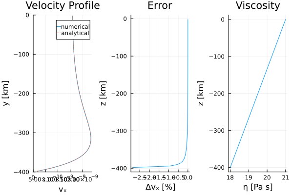

# [Channel Flow; Defect correction (1D)](https://github.com/GeoSci-FFM/GeoModBox.jl/blob/main/examples/StokesEquation/1D/ChannelFlow_1D.jl)

Assuming a constant horizontal pressure gradient, and that the flow within the channel is driven solely by pressure and/or a prescribed horizontal velocity at the surface (or bottom, or both), the 1D Stokes equation describes the horizontal flow velocity within a channel and simplifies to: 

$\begin{equation}
0 = -\frac{\partial{P}}{\partial{x}} + \frac{\partial{\tau_{xy}}}{\partial{y}},
\end{equation}$

where $P$ is the pressure [Pa], $\frac{\partial}{\partial x_i}$ denotes the partial derivative in the $i$-th direction, and $\tau_{xy}$ is the horizontal shear stress [Pa], defined by:

$\begin{equation}
\tau_{xy} = 2 \eta \dot{\varepsilon}_{xy},
\end{equation}$

with $\eta$ the viscosity [Pa·s] and $\dot{\varepsilon}_{xy}$ the shear strain-rate [1/s], given by:

$\begin{equation}
\dot{\varepsilon}_{xy} = \frac{1}{2} \frac{\partial{v_x}}{\partial{y}}.
\end{equation}$

In this setup, the vertical velocity is assumed to be zero, reducing the problem to the $x$-component of the Stokes equation.

This example computes the horizontal velocity for a 1D Couette–Poiseuille channel flow with either constant or depth-dependent logarithmic viscosity. To compare with the analytical solution, the depth-dependent viscosity is defined as: 

$\begin{equation}
\eta = \eta_0 exp\left(-log(m) \frac{y_v}{H}\right),
\end{equation}$

where $m$ is the viscosity ratio of $\frac{\eta_1}{\eta_0}$, $\eta_0$ and $\eta_1$ are the bottom and surface viscosities, respectively, $H$ is the model height, and $y$ the depth. 

Based on the viscosity definition in equation (4), the analytical velocity solution is derived by integrating the $x$-component of the 1D Stokes equation twice. of the horizontal velocity from the 1D Stokes equation in $x$-direction by twice integrating equation (1). The analytical solution with depth depends on the viscosity ratio $m$, the horizontal pressure gradient $\frac{\partial P}{\partial x}$, and the shear velocity at the surface $v_{x,0}$. The analytical solution is given as: 

$\begin{equation}
v_{x,ana} =\frac{1}{2 \eta_0} \frac{\partial{P}}{\partial{x}} \left(y^2 + Hy\right) + v_{x,0}\frac{y}{H} + v_{x,0}\quad \text{if } m = 1,
\end{equation}$

and

$\begin{equation}
v_{x,ana} = 
-\frac{\partial{P}}{\partial{x}} \frac{H}{\eta_0 log(m) (m-1)} 
\left(-y 
( m^{\frac{y+H}{H}} - 
m^{\frac{y}{H}} ) + 
H ( m^{\frac{y}{H}}-1 ) 
\right) +
\frac{v_{x,0}}{m-1}\left(m^{\frac{y+H}{H}} - 1\right) \quad \text{if } m \neq 1.
\end{equation}$ 

For more details on how the equations are solved using the defect correction method, please refer to the [documentation](../MomentumOneD.md)

---

First, one needs to load the required moduls.

```Julia
using Plots, ExtendableSparse, Printf, LinearAlgebra
using GeoModBox.MomentumEquation.OneD
```

Begin by defining the model geometry and physical constants of the problem. 

```Julia
# Model Parameter ------------------------------------------------------- #
M   =   (
    ymin        =   -400.0e3,           #   Depth [ m ]
    ymax        =   0.0e3,              
)
I   =   (
    vₓ₀         =   5/100/31536000,     #   Velocity top [ m/s ]
    η₀          =   1.0e21,             #   Viscosity top [ Pa s ]
    η₁          =   1.0e18,             #   Viscosity bottom [ Pa s ]
    ∂P∂x        =   -0.1e1,             #   horizontal pressure gradient [ Pa/m ]
)
I1  =   (
    m           =   I.η₁ / I.η₀,        #   Viscosity ratio
)
I   =   merge(I,I1)
# ----------------------------------------------------------------------- #
```

The following section defines the numerical parameters. 

```Julia
# Numerical Parameter --------------------------------------------------- #
NC  =   (
    y   =   100,                        #   Number of centroids
)
NV  =   (
    y   =   NC.y + 1,                   #   Number of vertices
)
Δ   =   (
    y   =   (M.ymax-M.ymin)/NC.y,       #   Grid resolution
)
# Grid ---
y   =   (
    c   =   LinRange(M.ymin+Δ.y/2,M.ymax-Δ.y/2,NC.y),
    v   =   LinRange(M.ymin,M.ymax,NV.y),
)
# Iterations ---
niter   =   10
ϵ       =   1e-10
# ----------------------------------------------------------------------- #
# Allocations ----------------------------------------------------------- #
D   =   (
    η       =   zeros(NC.y+1),
    vₓ      =   zeros(NC...),
    vₓₐ     =   zeros(NC...),
    Δvₓ     =   zeros(NC...),
    vₓₑ     =   zeros(NC.y+2),
    δvₓ     =   zeros(NC...),
    R       =   zeros(NC...),
    ∂τxy∂y  =   zeros(NC...),
    τxy     =   zeros(NV...),
    ∂vₓ∂y   =   zeros(NV...),
)
# ----------------------------------------------------------------------- #
```

Next, compute the viscosity profile and the analytical velocity solution. 

```Julia
# Viscosity ------------------------------------------------------------- #
@. D.η  =   I.η₀ * exp(-log(I.m)* y.v / (M.ymax-M.ymin))
# ----------------------------------------------------------------------- #
# Analytical Solution --------------------------------------------------- #
if I.m  == 1.0
    @. D.vₓₐ    =   1.0/2.0/I.η₀ * I.∂P∂x * 
                    (y.c^2 + (M.ymax-M.ymin).*y.c) + 
                    I.vₓ₀*y.c/(M.ymax-M.ymin) + I.vₓ₀
else
    @. D.vₓₐ    =   -I.∂P∂x * (M.ymax-M.ymin) / I.η₀ / log(I.m) / (I.m-1) * 
        (-y.c * 
            (I.m^((y.c + (M.ymax-M.ymin))/(M.ymax-M.ymin)) - 
            I.m^(y.c/(M.ymax-M.ymin))) + 
            (M.ymax-M.ymin)*(I.m^(y.c/(M.ymax-M.ymin)) - 1) 
        ) + 
        I.vₓ₀ / (I.m-1) * (I.m ^ ((y.c+(M.ymax-M.ymin))/(M.ymax-M.ymin)) - 1)
end
# ----------------------------------------------------------------------- #
```

Define the boundary conditions for the velocity. 

```Julia
# Boundary Conditions --------------------------------------------------- #
VBC     =   (
    type    = (S=:Dirichlet, N=:Dirichlet),
    val     = (S=0.0,N=I.vₓ₀)
)
# ----------------------------------------------------------------------- #
```

Define the arrays required to construct the linear system of equations. 

```Julia
# Coeffficientmatrix ---------------------------------------------------- #
Num     =   (Vx=1:NC.y,)
ndof    =   maximum(Num.Vx)
K       =   ExtendableSparseMatrix(ndof,ndof)
# ----------------------------------------------------------------------- #
```

Solve the linear system using the defect correction method. 

```Julia
# Solution -------------------------------------------------------------- #
for iter=1:niter
    # Evaluate residual ---
    ComputeStokesResiduals1D!(D, I.∂P∂x, Δ.y, VBC)
    @printf("||R|| = %1.4e\n", norm(D.R)/length(D.R))
    norm(D.R)/length(D.R) < ϵ ? break : nothing
    # Assemble linear system ---
    K  = AssembleStokesMatrix1D(NC.y, D.η, Δ.y, VBC, K)
    # Solve for temperature correction: Back substitutions ---
    D.δvₓ .= -(K\D.R[:]) 
    # Update temperature ---
    @. D.vₓ += D.δvₓ[Num.Vx]
end
# ----------------------------------------------------------------------- #
```

Finally, compute the relative deviation from the analytical solution and generate a multi-panel plot of the results. 

```Julia
# Deviation from the analytical solution -------------------------------- #
@. D.Δvₓ    =   ((D.vₓₐ - D.vₓ) / D.vₓₐ) * 100.0
# ----------------------------------------------------------------------- #
# Plotting -------------------------------------------------------------- #
q   =   plot(D.vₓ,y.c./1e3,label="numerical",
            xlabel="vₓ", ylabel="y [km]",
            title="Velocity Profile",
            xlim=(0,I.vₓ₀*1.5),ylim=(M.ymin/1e3,M.ymax/1e3),
            layout=(1,3),subplot=1)
plot!(q,D.vₓₐ,y.c./1e3,label="analytical",linestyle=:dash,
        subplot=1)
plot!(q,D.Δvₓ,y.c./1e3,label="",
        xlabel="Δvₓ [%]",ylabel="z [km]",
        title="Error",
        subplot=2)
plot!(q,log10.(D.η),y.v./1e3,label="",
        xlabel="η [Pa s]",ylabel="z [km]",
        title="Viscosity",
        subplot=3)
display(q)
# ----------------------------------------------------------------------- #
savefig("./examples/StokesEquation/1D/Results/ChannelFlow.png")
```



**Figure 1. 1D Poiseuille–Couette Flow.** Velocity profiles (left), relative deviation between analytical and numerical solutions (center), and depth-dependent viscosity (right) for a 1D channel flow simulation. 
