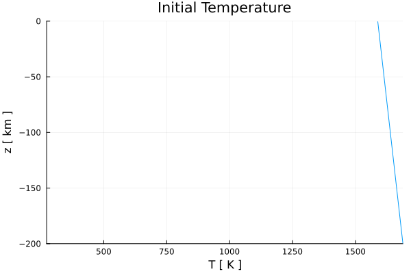
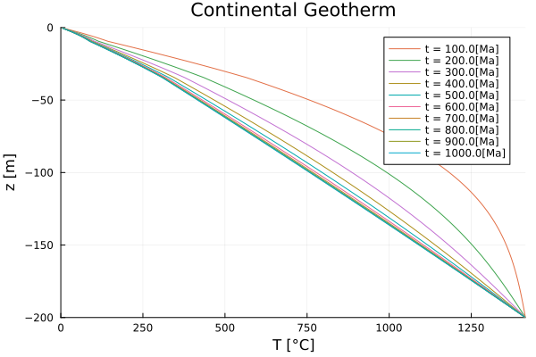
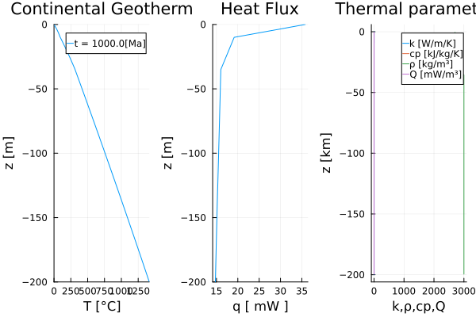

# [Continental Geotherm](https://github.com/GeoSci-FFM/GeoModBox.jl/blob/main/examples/DiffusionEquation/1D/ContinentalGeotherm_1D.jl) 

The 1-D temperature profile of a continental geotherm can be calculated by solving the conductive part of the 1-D *temperature equation* using variable thermal parameters within a conservative finite difference scheme (currently only including a radiogenic heat source). We use the 1-D solver for variable thermal parameters, since the thermal conductivity varies within each lithospheric layer. 

In a conservative 1-D finite difference scheme, temperature is defined at the *centroids*, while the vertical heat flux and thermal conductivity $k$ are defined at the *vertices*.

The 1-D temperature equation is given by: 

$\begin{equation}
\rho c_{p} \frac{\partial{T}}{\partial{t}} = \frac{\partial{q_y}}{\partial{y}} + \rho H,
\end{equation}$ 

where the heat flux $q_y$ is defined as:

$\begin{equation}
\left. q_{y,m} = -k_m \frac{\partial T}{\partial y}\right\vert_{m},\ \textrm{for}\ m = 1:nv, 
\end{equation}$

where $\rho$, $c_{p}$, $T$, $t$, $k$, $H$, $y$, and $nv$ represent the density [kg/m³], the specific heat capacity [J/kg/K], the temperature [K], the time [s], the thermal conductivity [W/m/K], the heat generation rate per mass [W/kg], the depth [m], and the number of vertices, respectively. 

For more details on how to discretize the equation using an explicit, forward Euler finite difference scheme see the [documentation](../DiffOneD.md).

---

First one needs to load the required packages: 

```Julia 
using Plots
using GeoModBox.HeatEquation.OneD
```

Let's start with the definition of the geometrical, numerical, and physical constants: 

```Julia 
# Constants --------------------------------------------------------- #
H           =   200e3               #   Hight of the model [ m ]
yUC         =   10e3                #   Depth of the upper crust [ m ]
yLC         =   35e3                #   Depth of the lower crust [ m ]
        
nc          =   200                 #   Number of grid points
Δy          =   H/nc                #   Grid resolution

# Depth [m] ---
yc          =   LinRange(-H + Δy/2.0,0.0 - Δy/2.0,nc)     
yv          =   LinRange(-H,0,nc+1)
        
Py  =   (
    # Mantle properties ---
    ρM      =   3000,               #   Density [ kg/m^3 ]
    cpM     =   1000,               #   Heat capacity [ J/kg/K ]
    kM      =   2.3,                #   Conductivity [ W/m/K ]
    HM      =   2.3e-12,            #   Heat generation rate [W/kg]; Q = ρ*H;2.3e-12
        
    # Upper crust properties ---
    ρUC     =   2700,               #   [ kg/m^3 ]
    kUC     =   3.0,                #   [ W/m/K ]
    HUC     =   617e-12,            #   [ W/kg ]
    cpUC    =   1000,
        
    # Lower crust properties ---
    ρLC     =   2900,               #   [ kg/m^3 ]
    kLC     =   2.0,                #   [ W/m/K ]
    HLC     =   43e-12,             #   [ W/kg ]
    cpLC    =   1000,
)                
# ------------------------------------------------------------------- #
```

In the following, one needs to define the initial and boundary condition: 

1. Temperature at the surface and bottom.
2. Linear increasing temperature profile assuming a certain adiabatic gradient and potential mantle temperature.


```Julia
# Initial Condition ------------------------------------------------- #
T   =   (
    Tpot    =   1315 + 273.15,      #   Potential temperautre [ K ]
    ΔTadi   =   0.5,                #   Adiabatic temperature gradient [ K/km ]
    Ttop    =   273.15,             #   Surface temperature [ K ]
    T_ex    =   zeros(nc+2,1),    
)
T1  =   (
    Tbot    =   T.Tpot + T.ΔTadi*abs(H/1e3),    # Bottom temperature [ K ]
    T       =   T.Tpot .+ abs.(yc./1e3).*T.ΔTadi,   # Initial T-profile [ K ]
)
T   =   merge(T,T1)

Tini                =   zeros(nc,1)
Tini                .=   T.T
T.T_ex[2:end-1]     .=  T.T
# ------------------------------------------------------------------- #
```

Either *Dirichlet* or *Neumann* thermal boundary conditions can be applied at the surface and bottom. 

```Julia 
# Boundary conditions ----------------------------------------------- #
BC      =   (
    type    = (N=:Dirichlet, S=:Dirichlet),
    val     = (N=T.Ttop,S=T.Tbot)
)
# If Neumann boundary conditions are choosen, the following values result in the given heatflux for the given thermal conductivity k. 
# S      =   -0.03;          # c     =   -k/q -> 90 mW/m^2
# N      =   -0.0033;        # c     =   -k/q -> 10 mW/m^2
# ------------------------------------------------------------------- #
```

Now, one needs to define the multiplication factor ```fac``` of the *diffusion stability criterion* for the explicit thermal solver. This factor controls the stability criterion. If `fac` exceeds 1, the solver becomes unstable.  

```Julia
# Time stability criterion ------------------------------------------ #
fac     =   0.9                 #   Courant criterion
tmax    =   1000                 #   Lithosphere age [ Ma ]
tsca    =   60*60*24*365.25     #   Seconds per year

age     =   tmax*1e6*tsca        #   Age in seconds    
# ------------------------------------------------------------------- #
```

To verify that the initial and boundary conditions are properly defined by plotting the temperature profile. 

```Julia
# Plot Initial condition -------------------------------------------- #
p = plot(T.T,yc./1e3, 
    label="", 
    xlabel="T [ K ]", ylabel="z [ km ]", 
    title="Initial Temperature",
    xlim=(T.Ttop,T.Tbot),ylim=(-H/1e3,0))
display(p)
# ------------------------------------------------------------------- #
```



**Figure 1. Initial temperature profile.**

Define the fields for the thermal parameters and assign the corresponding values of each lithospheric layer (upper and lower crust, and lithospheric mantle) to them. Additionally, the thermal diffusivity $\kappa$ and initialize the vertical heat flux ```q``` need to be defined. 

```Julia
# Setup fields ------------------------------------------------------ #
Py1     =   (
    k            =   zeros(nc+1,1),
    ρ            =   zeros(nc,1),
    cp           =   zeros(nc,1),
    H            =   zeros(nc,1),
    )
Py  = merge(Py,Py1)
    
# Upper Crust ---
Py.k[yv.>=-yUC]     .=   Py.kUC
Py.ρ[yc.>=-yUC]     .=   Py.ρUC
Py.cp[yc.>=-yUC]    .=   Py.cpUC
Py.H[yc.>=-yUC]     .=   Py.HUC    
# Lower Crust ---
Py.k[yv.>=-yLC .&& yv.<-yUC]     .=   Py.kLC
Py.ρ[yc.>=-yLC .&& yc.<-yUC]     .=   Py.ρLC
Py.cp[yc.>=-yLC .&& yc.<-yUC]    .=   Py.cpLC
Py.H[yc.>=-yLC .&& yc.<-yUC]     .=   Py.HLC   
# Mantle ---
Py.k[yv.<-yLC]  .=   Py.kM
Py.ρ[yc.<-yLC]  .=   Py.ρM
Py.cp[yc.<-yLC] .=   Py.cpM
Py.H[yc.<-yLC]  .=   Py.HM

Py2     =   (
    # Thermal diffusivity [ m^2/s ] 
    κ       =  maximum(Py.k)/minimum(Py.ρ)/minimum(Py.cp),     
    )
Py  =   merge(Py,Py2)
T2  =   (
    q   =   zeros(nc+1,1),
    )
T   =   merge(T,T2)  
# ------------------------------------------------------------------- #
```

Now, one can calculate the time stability criterion. 


```Julia
# Time stability criterion ------------------------------------------ #
Δtexp   =   Δy^2/2/Py.κ             #   Stability criterion for explicit
Δt      =   fac*Δtexp               #   total time step

nit     =   ceil(Int64,age/Δt)      #   Number of iterations    

time    =   zeros(1,nit)            #   Time array
# ------------------------------------------------------------------- #
```

With all parameters and constants defined to solve the 1-D temperature equation for each time step in a ```for``` loop. 

The temperature conservation equation is solved via the function ```ForwardEuler1D!()```, which updates the temperature profile ```T.T``` for each time step using the extended temperautre field ```T.T_ex```, which include the ghost nodes. The temperature profile is plotted for a certain time.  

```Julia
# Time Loop --------------------------------------------------------- #
count   =   1
for i = 1:nit
    if i > 1
        time[i]     =   time[i-1] + Δt
    elseif time[i] > age
        Δt          =   age - time[i-1]
        time[i]     =   time[i-1] + Δt
    end
    ForwardEuler1D!(T,Py,Δt,Δy,nc,BC)
    if i == nit || abs(time[i]/1e6/tsca - count*100.0) < Δt/1e6/tsca        
        println(string("i = ",i,", time = ", time[i]/1e6/tsca))                    
        p = plot!(T.T.-T.Ttop,yc./1e3, 
            label=string("t = ",ceil(time[i]/1e6/tsca),"[Ma]"), 
            xlabel="T [°C]", ylabel="z [m]", 
            title="Continental Geotherm",
            xlim=(0,T.Tbot-T.Ttop),ylim=(-H/1e3,0))
        display(p)
        count = count + 1
    end
end
# ------------------------------------------------------------------- #
```



**Figure 2. Evolution of the temperature profile with depth in 5 Ma steps.**

For the final time step, a depth profile for the vertical heat flux is calculated. Therefore, one needs to update the temperature at the ghost nodes to calculate the heat flux at the boundary. 

```Julia
# Calculate heaf flow ----------------------------------------------- #
# South ---
T.T_ex[1]   =   (BC.type.S==:Dirichlet) * (2 * BC.val.S - T.T_ex[2]) + 
                (BC.type.S==:Neumann) * (T.T_ex[2] - BC.val.S*Δy)
# North ---
T.T_ex[end] =   (BC.type.N==:Dirichlet) * (2 * BC.val.N - T.T_ex[nc+1]) +
                (BC.type.N==:Neumann) * (T.T_ex[nc+1] + BC.val.N*Δy)
if size(Py.k,1)==1
    for j=1:nc+1
        T.q[j]  =   -Py.k * 
            (T.T_ex[j+1] - T.T_ex[j])/Δy
    end    
else
    for j=1:nc+1
        T.q[j]  =   -Py.k[j] * 
            (T.T_ex[j+1] - T.T_ex[j])/Δy
    end
end
# ------------------------------------------------------------------- #
```

Finally, compute the temperature profile for a continental geotherm using the analytical expression of an infinite half-space cooling model for a certain age. The analytical solution is plotted in the final figure, together with the final numerical temperature profile and the heat flux profile. 

```Julia
# Plot profile if requested ----------------------------------------- #
q = plot(T.T.-T.Ttop,yc./1e3, 
        label=string("t = ",ceil(maximum(time)/1e6/tsca),"[Ma]"), 
        xlabel="T [°C]", ylabel="z [m]",
        title="Continental Geotherm",
        xlim=(0,T.Tbot-T.Ttop),ylim=(-H/1e3,0),
        layout=(1,3),subplot=1)    
q = plot!(T.q.*1e3,yv./1e3, 
        label="", 
        xlabel="q [ mW ]", ylabel="z [m]", 
        title="Heat Flux",
        ylim=(-H/1e3,0),
        subplot=2) 
q = plot!(Py.k,yv./1e3,label="k [W/m/K]",
        xlabel="k,ρ,cp,Q", ylabel="z [km]",
        title="Thermal parameters",
        subplot=3)       
q = plot!(Py.cp./1e3,yc./1e3,label="cp [kJ/kg/K]",
        subplot=3)
q = plot!(Py.ρ,yc./1e3,label="ρ [kg/m³]",                
        subplot=3)
q = plot!(Py.H.*(Py.ρ./1e3),yc./1e3,label="Q [mW/m³]",
        subplot=3)
display(q)
# Save figures ---
savefig(q,"./examples/DiffusionEquation/1D/Results/ContinentalGeotherm_1D.png")
savefig(p,"./examples/DiffusionEquation/1D/Results/ContinentalGeotherm_1D_evolve.png")
# ======================================================================= #
```


**Figure 3. Final temperature, heat flux, and thermal parameter depth profiles.**