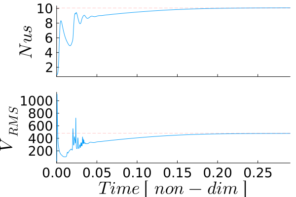

# [Blankenbach Benchmark with Variable Viscosity](https://github.com/GeoSci-FFM/GeoModBox.jl/blob/main/examples/ThermalConvection/Blankenbach_var_eta.jl) 

This example reproduces the **Blankenbach et al. (1989) thermal convection benchmark** including a strongly temperature-dependent viscosity. In contrast to the corresponding isoviscous benchmark exercise, the viscosity varies by more than four orders of magnitude across the imposed temperature range, resulting in a substantially more realistic and challenging thermo-mechanical problem.

The viscosity is described by

$\begin{equation}
\eta = \eta_0 \exp\left(
-b\frac{T-T_{\textrm{top}}}
{T_{\textrm{bottom}}-T_{\textrm{top}}}
+
c\frac{y}{H}
\right),
\end{equation}$

where $\eta_0$ is the reference viscosity, while the coefficients $b$ and $c$ control the temperature and depth dependence of viscosity, respectively. For this example, the benchmark parameters are

$\begin{equation}
b=\ln(16384), \qquad c=0,
\end{equation}$

such that viscosity depends exclusively on temperature.

The introduction of temperature-dependent viscosity creates a nonlinear coupling between the momentum and energy equations. At each time step, the current temperature field determines the viscosity distribution, which is then treated as fixed during the solution of the Stokes equations. The resulting velocity field is subsequently used to advect and diffuse the temperature, modifying the viscosity distribution for the next time step. Although each individual Stokes solve is therefore linear, the complete thermo-mechanical evolution is nonlinear because temperature, viscosity, and velocity continuously influence one another.

The accuracy of the numerical solution is evaluated using the steady-state diagnostics reported by Blankenbach et al. (1989), including the **Nusselt number**, the **root mean square velocity**, the temperature gradients at the model corners, and the extrema of the vertical temperature profile through the centre of the model.

Compared with the isoviscous benchmark, this example develops a markedly asymmetric convection pattern. Cold material near the upper boundary becomes highly viscous and forms a stiff thermal boundary layer, whereas the warmer interior remains comparatively weak and deforms more readily. This results in localized downwellings, broader upwellings, and a significantly more heterogeneous flow field than in the isoviscous case.

The example therefore serves both as a verification of the variable-viscosity Stokes solver and as a demonstration of nonlinear thermo-mechanical coupling in mantle convection.

The example makes use of the general momentum, heat diffusion, and semi-Lagrangian advection solvers provided by `GeoModBox.jl`. In addition, a helper function is introduced at the end of the script to compute a temperature-dependent viscosity field and interpolate it from cell centers to the grid vertices required by the variable-viscosity Stokes solver.

```Julia
using Plots, ExtendableSparse
using GeoModBox
using GeoModBox.InitialCondition, GeoModBox.MomentumEquation.TwoD
using GeoModBox.AdvectionEquation.TwoD, GeoModBox.HeatEquation.TwoD
using GeoModBox.Scaling
using Statistics, LinearAlgebra
using Printf, LaTeXStrings, Measures
```

The initial temperature field is selected together with the plotting parameters, animation directory, and output options. Because the viscosity varies strongly with temperature, this example is computationally more expensive than the isoviscous model, particularly because the momentum matrix must be reassembled and factorized whenever the viscosity field changes.

```Julia
# Define Initial Condition ============================================== #
# Temperature - 
#   1) circle, 2) gaussian, 3) block, 4) linear, 5) lineara, 
Ini         =   (T=:blankenbach,)
# ----------------------------------------------------------------------- #
# Plot Settings ========================================================= #
Pl  =   (
    qinc        =   10,
    qsc         =   2.0e-4
)
# Animation Settings ==================================================== #
path        =   string("./examples/ThermalConvection/Results/")
anim        =   Plots.Animation(path, String[] )
save_fig    =   1
# ----------------------------------------------------------------------- #
```

The benchmark values reported by Blankenbach et al. (1989) are stored for later comparison. During the simulation, the Nusselt number and the root-mean-square velocity are evaluated continuously and compared with these published reference values to verify the numerical implementation.

```Julia
# Benchmark Values ====================================================== # 
# Taken from Gerya (2019), Introduction to numerical geodynamic modelling
B       =   (
    Nr      =   4,
    # Nusselt Number at the top
    Nu      =   [4.8844,10.534,21.972,10.066,6.9229],   
    # Root Mean Square Velocity-scaled
    Vrms    =   [42.865,193.21,833.99,480.43,171.76],   
    # Non-dimensional temperature gradients in the model corner
    q1      =   [8.0593,19.079,45.964,17.531,18.484],
    q2      =   [0.5888,0.7228,0.8772,1.0085,0.1774],
    q3      =   [8.0593,19.079,45.964,26.809,14.168], 
    q4      =   [0.5888,0.7228,0.8772,0.4974,0.6177],
    # Local minimum along the central vertical temperature profile 
    Tmin    =   [0.4222,0.4284,0.4322,0.7405,0.3970],
    ymin    =   [0.2249,0.1118,0.0577,0.0623,0.1906],
    # Local maximum algon the central vertical temperature profile
    Tmax    =   [0.5778,0.5716,0.5678,0.8323,0.5758],
    ymax    =   [0.7751,0.8882,0.9423,0.8243,0.7837],
    b       =   [0,0,0,log(1e3),log(16384)],
    c       =   [0,0,0,0,log(64)],
)
# ----------------------------------------------------------------------- #
```

The physical model consists of a unit-aspect-ratio box heated from below and cooled from above. 

```Julia
# Geometry ============================================================== #
M   =   Geometry(
    xmin    =   0.0,                #   [ m ] 
    xmax    =   1000e3,             #   [ m ]
    ymin    =   -1000e3,            #   [ m ]
    ymax    =   0.0,                #   [ m ]
)
# ----------------------------------------------------------------------- #
# Referenzparameter ===================================================== #
P   =   Physics(
    g       =   10.0,               #   Graviational Acceleration [m/s^2]
    ρ₀      =   4000.0,             #   Reference Density [kg/m^3]
    k       =   5.0,                #   Thermal Conductivity [ W/m/K ]
    cp      =   1250.0,             #   Heat capacity [ J/kg/K ]
    α       =   2.5e-5,             #   THermal Expansion [ K^-1 ]
    η₀      =   1e23,               #   Reference Viscosity [ Pa*s ]
    ΔT      =   1000.0,             #   Temperature Difference
    # If Ra < 0, Ra will be calculated from the reference parameters.
    # If Ra is defined, the reference viscosity will be adjusted such that
    # the scaling parameters result in the given Ra.
    Ra      =   -9999,              #   Rayleigh number
)
# ----------------------------------------------------------------------- #
```

The scaling constants are derived from the dimensional geometry and physical parameters. They define the characteristic length, temperature, time, velocity, and viscosity scales used to transform the governing equations and model variables into nondimensional form.

```Julia
# Define Scaling Constants ============================================== # 
S   =   ScalingConstants!(M,P)
# ----------------------------------------------------------------------- #
```

Next, the staggered finite-difference grid and all required field variables are allocated. In addition to the temperature, velocity, pressure, and density fields, separate viscosity arrays are defined at cell centers and grid vertices, reflecting the variable placement required by the staggered Stokes discretization.

```Julia
# Numerical Grid ======================================================== #
NC  =   (
    x   =   50,
    y   =   50,
)
NV      =   (
    x   =   NC.x + 1,
    y   =   NC.y + 1,
)
Δ       =   GridSpacing(
    x   =   (M.xmax - M.xmin)/NC.x,
    y   =   (M.ymax - M.ymin)/NC.y,
)
# ----------------------------------------------------------------------- #
# Data Arrays =========================================================== #
D       =   DataFields(
    Q       =   zeros(Float64,(NC...)),
    T       =   zeros(Float64,(NC...)),
    T0      =   zeros(Float64,(NC...)),
    T_ex    =   zeros(Float64,(NC.x+2,NC.y+2)),
    T_ex0   =   zeros(Float64,(NC.x+2,NC.y+2)),
    Told_ex =   zeros(Float64,(NC.x+2,NC.y+2)),
    ρ       =   ones(Float64,(NC...)),
    vx      =   zeros(Float64,(NV.x,NV.y+1)),
    vy      =   zeros(Float64,(NV.x+1,NV.y)),    
    Pt      =   zeros(Float64,(NC...)),
    vxc     =   zeros(Float64,(NC...)),
    vyc     =   zeros(Float64,(NC...)),
    vxco    =   zeros(Float64,(NC...)),
    vyco    =   zeros(Float64,(NC...)),
    vc      =   zeros(Float64,(NC...)),
    ηc      =   zeros(Float64,NC...),
    η_ex    =   zeros(Float64,(NC.x+2,NC.y+2)),
    ηv      =   zeros(Float64,NV...),
    ΔTtop   =   zeros(Float64,NC.x),
    ΔTbot   =   zeros(Float64,NC.x),
)
# ----------------------------------------------------------------------- #
# Needed for the defect correction solution ---
divV        =   zeros(Float64,NC...)
ε           =   (
    xx      =   zeros(Float64,NC...), 
    yy      =   zeros(Float64,NC...), 
    xy      =   zeros(Float64,NV...),
)
τ           =   (
    xx      =   zeros(Float64,NC...), 
    yy      =   zeros(Float64,NC...), 
    xy      =   zeros(Float64,NV...),
)
# Residuals ---
Fm     =    (
    x       =   zeros(Float64,NV.x, NC.y), 
    y       =   zeros(Float64,NC.x, NV.y)
)
FPt         =   zeros(Float64,NC...)
# Heat Flux calculations ---
Tv1         =   zeros(NV.x,1)
Tv2         =   zeros(NV.x,1)
dTdy        =   zeros(NV.x,1)
# ----------------------------------------------------------------------- #
```

The time-stepping parameters are initialized together with arrays used to monitor the evolution of the benchmark. These diagnostics include the dimensionless time, Nusselt number, root-mean-square velocity, mean temperature, and the change in temperature between successive iterations, which is later used to detect steady state.

```Julia
# Time parameters ======================================================= #
T   =   TimeParameter(
    tmax    =   1000000.0,          #   [ Ma ]
    Δfacc   =   0.9,                #   Courant time factor
    Δfacd   =   0.9,                #   Diffusion time factor
    itmax   =   30000,              #   Maximum iterations
)
T.tmax      =   T.tmax*1e6*T.year   #   [ s ]
T.Δc        =   T.Δfacc * minimum((Δ.x,Δ.y)) / 
                    (sqrt(maximum(abs.(D.vx))^2 + maximum(abs.(D.vy))^2))
T.Δd        =   T.Δfacd * (1.0 / (2.0 * P.κ *(1.0/Δ.x^2 + 1/Δ.y^2)))

T.Δ         =   minimum([T.Δd,T.Δc])
# Statistics ------------------------------------------------------------ #
Time            =   zeros(T.itmax)
Nus             =   zeros(T.itmax)
meanV           =   zeros(T.itmax)
meanT           =   zeros(T.itmax)
ΔTsteady        =   fill(NaN, T.itmax)
find            =   0
final_step      =   0 
nsteady         =   0
nsteady_required =  100
# ----------------------------------------------------------------------- #
```

All dimensional model quantities are converted to their nondimensional equivalents. After this step, the numerical solver operates entirely with scaled coordinates, material properties, fields, and time increments.

```Julia
# Scaling laws ========================================================== #
ScaleParameters!(S,M,Δ,T,P,D)
# ----------------------------------------------------------------------- #
```

The computational coordinates are then generated for all staggered variable locations. Separate coordinate arrays are defined for centroids, vertices, and velocity nodes to simplify field interpolation, visualization, and finite-difference operations.

```Julia
# Coordinates =========================================================== #
x       =   (
    c   =   LinRange(M.xmin+Δ.x/2,M.xmax-Δ.x/2,NC.x),
    ce  =   LinRange(M.xmin - Δ.x/2.0, M.xmax + Δ.x/2.0, NC.x+2),
    v   =   LinRange(M.xmin,M.xmax,NV.x),
)
y       =   (
    c   =   LinRange(M.ymin+Δ.y/2,M.ymax-Δ.y/2,NC.y),
    ce  =   LinRange(M.ymin - Δ.y/2.0, M.ymax + Δ.y/2.0, NC.y+2),
    v   =   LinRange(M.ymin,M.ymax,NV.y),
)
x1      =   (
    c2d     =   x.c .+ 0*y.c',
    v2d     =   x.v .+ 0*y.v', 
    vx2d    =   x.v .+ 0*y.ce',
    vy2d    =   x.ce .+ 0*y.v',
)
x   =   merge(x,x1)
y1      =   (
    c2d     =   0*x.c .+ y.c',
    v2d     =   0*x.v .+ y.v',
    vx2d    =   0*x.v .+ y.ce',
    vy2d    =   0*x.ce .+ y.v',
)
y   =   merge(y,y1)
# ----------------------------------------------------------------------- #
```

The initial conductive temperature profile is initialized using the Blankenbach benchmark perturbation. From this temperature field, the initial temperature-dependent viscosity is computed according to the prescribed exponential viscosity law.

```Julia
# Initial Condition ===================================================== #
# Temperature ------
IniTemperature!(Ini.T,M,NC,D,x,y;Tb=P.Tbot,Ta=P.Ttop)
# Initialize Viscosity ---
TdepViscosity!(D,B.b[B.Nr],B.c[B.Nr],y)
# ----------------------------------------------------------------------- #
```

Boundary conditions are prescribed for both the temperature and velocity fields. The model employs fixed temperatures at the upper and lower boundaries, insulating sidewalls, and free-slip mechanical boundary conditions, matching the original benchmark specification.

```Julia
# Boundary Conditions =================================================== #
# Temperature ------
TBC     = (
    type    = (W=:Neumann, E=:Neumann,N=:Dirichlet,S=:Dirichlet),
    val     = (W=zeros(NC.y),E=zeros(NC.y),
                    N=P.Ttop.*ones(NC.x),S=P.Tbot.*ones(NC.x)))
# Velocity ------
VBC     =   (
    type    =   (E=:freeslip,W=:freeslip,S=:freeslip,N=:freeslip),
    val     =   (E=zeros(NV.y),W=zeros(NV.y),S=zeros(NV.x),N=zeros(NV.x),
                    vyS=0.0,vyN=0.0,vxW=0.0,vxE=0.0),
)
# ----------------------------------------------------------------------- #
```

If the Rayleigh number is specified explicitly, the reference viscosity is automatically adjusted to reproduce the desired value.

```Julia
# Rayleigh Number ======================================================= #
if P.Ra < 0
    P.Ra     =   P.ρ₀*P.g*P.α*P.ΔT*S.hsc^3/P.η₀/P.κ
else
    P.η₀     =   P.ρ₀*P.g*P.α*P.ΔT*S.hsc^3/P.Ra/P.κ
end
filename    =   string("Blankenbach_VarEta_",@sprintf("%.2e",P.Ra),
                        "_",NC.x,"_",NC.y,
                        "_",Ini.T)
# ----------------------------------------------------------------------- #
```

The sparse linear systems required by the momentum and energy equations are assembled next. The Stokes equations are solved using the general defect-correction solver, whereas the transient heat equation is solved using a Crank-Nicolson discretization together with the same iterative defect-correction strategy.

```Julia
# Linear System of Equations ============================================ #
# Momentum Conservation Equation (MCE) ------
niterM      =   50
atolM       =   1e-8        #   Absolute tolerance
rtolM       =   1e-5        #   Relative tolerance; r = atolM0/atolM
RM          =   0.0         #   Initialize absolute residual    
RMrel       =   0.0         #   Initialize relative residual 
off    = [  NV.x*NC.y,                          # vx
            NV.x*NC.y + NC.x*NV.y,              # vy
            NV.x*NC.y + NC.x*NV.y + NC.x*NC.y ] # Pt
Num    =    (
    Vx  =   reshape(1:NV.x*NC.y, NV.x, NC.y), 
    Vy  =   reshape(off[1]+1:off[1]+NC.x*NV.y, NC.x, NV.y), 
    Pt  =   reshape(off[2]+1:off[2]+NC.x*NC.y,NC...),
    T   =   reshape(1:NC.x*NC.y, NC.x, NC.y),
)
ndofM   =   maximum(Num.Pt)     
KM      =   ExtendableSparseMatrix(ndofM,ndofM)      
δx      =   zeros(maximum(Num.Pt))
F       =   zeros(maximum(Num.Pt))
# Energy Conservation Equation (ECE) ------------------------------------ #
niterT  =   10
ϵT      =   1e-12
RE      =   0.0
ndofT   =   maximum(Num.T)     
KT      =   ExtendableSparseMatrix(ndofT,ndofT)
δT      =   zeros(maximum(Num.T))
RT      =   zeros(Float64,NC...)
∂2T     =   (∂x2=zeros(NC.x, NC.y), ∂y2=zeros(NC.x, NC.y),
                ∂x20=zeros(NC.x, NC.y), ∂y20=zeros(NC.x, NC.y))
# ----------------------------------------------------------------------- #
```

The main time loop advances the coupled thermo-mechanical solution. At each step, the current model time is updated and detailed terminal output is restricted to selected intervals to reduce the cost of printing and plotting during the long variable-viscosity calculation.

```Julia
# Time Loop ============================================================= #
for it = 1:T.itmax
    R0      =   0.0
    # Reduce screen output ---
    verbose_step    =   mod(it, 500) == 0 || it == 1
    if it>1
        Time[it]  =   Time[it-1] + T.Δ
    end
    verbose_step && @printf(
        "Time step: #%04d, Time [non-dim]: %04e\n",
        it, Time[it]
    )
```

Each iteration consists of four main steps. First, the temperature-dependent viscosity is updated and the Stokes equations are solved to obtain the velocity and pressure fields. The resulting velocity field is then used to evaluate the benchmark diagnostics before advancing the temperature through semi-Lagrangian advection and implicit Crank-Nicolson diffusion. Finally, the convergence criteria are evaluated to determine whether a steady state has been reached.

```Julia
    # ------ MCE ------
    verbose_step && @printf("---Momentum Calculation ---\n")
    if it == 1
        D.vx[2:end-1,:]    .=  0.0
        D.vy[:,1:end-1]    .=  0.0
        D.Pt               .=  0.0
    end
    # Residual Calculation ------
    @. D.ρ  =   -P.Ra*D.T
    # Viscosity Calculations --- 
    TdepViscosity!(D,B.b[B.Nr],B.c[B.Nr],y)
    KM      =   Assembly(NC, NV, Δ, D.ηc, D.ηv, VBC, Num)
    KMfac   =   lu(KM.cscmatrix)
    for iter = 1:niterM
      # Residuals2Dc!(D,VBC,ε,τ,divV,Δ,1.0,1.0,Fm,FPt)
        Residuals2D!(D,VBC,ε,τ,divV,Δ,D.ηc,D.ηv,1.0,Fm,FPt)
        F[Num.Vx]   .=  Fm.x
        F[Num.Vy]   .=  Fm.y
        F[Num.Pt]   .=  FPt
        RM          =   norm(F)/length(F)
        if iter == 1
            R0 = max(RM, eps())
        end
        RMrel       =   RM/R0
        if verbose_step
            @printf("   MCE %2d: ||R|| = %1.4e, ||R||/||R₀|| = %1.4e\n",iter,RM,RMrel)
        end
        (RM < atolM || RM/R0 < rtolM) && break
        # Solving Linear System of Equations ------
        δx      .=   -(KMfac \ F)
        # Update unknown variables ------
        D.vx[:,2:end-1]     .+=  δx[Num.Vx]
        D.vy[2:end-1,:]     .+=  δx[Num.Vy]
        D.Pt                .+=  δx[Num.Pt]
    end
    # ======
    # Calculate Velocity on the Centroids ------
    for i = 1:NC.x
        for j = 1:NC.y
            D.vxc[i,j]  = (D.vx[i,j+1] + D.vx[i+1,j+1])/2
            D.vyc[i,j]  = (D.vy[i+1,j] + D.vy[i+1,j+1])/2
        end
    end
    @. D.vc        = sqrt(D.vxc^2 + D.vyc^2)
```

Once the velocity field has converged, the benchmark diagnostics are evaluated. The Nusselt number is computed from the temperature gradient at the upper boundary, while the root-mean-square velocity and the mean temperature provide additional measures of the convective vigor and thermal evolution.

```Julia
    # Nusselt Number ==================================================== #
    # Grid structure at the surface ---
    #   o - Centroids
    #   x - Vertices 
    #   □ - Ghost Nodes
    #
    #   □          □           □            □
    #   
    #        x --------- x --------- x
    #        |           |           |
    #   □    |     o     |     o     |      □ 
    #        |           |           |
    #        x --------- x --------- x      
    #        |           |           |
    #   □    |     o     |     o     |      □
    # --- 
    # Get temperature at the vertices 
    @. Tv1  =   (D.T_ex[1:end-1,end] + D.T_ex[2:end,end] + 
                    D.T_ex[1:end-1,end-1] + D.T_ex[2:end,end-1])/4
    @. Tv2  =   (D.T_ex[1:end-1,end-1] + D.T_ex[2:end,end-1] + 
                    D.T_ex[1:end-1,end-2] + D.T_ex[2:end,end-2])/4
    # Calculate temperature gradient --- 
    @. dTdy =   -(Tv1 - Tv2)/Δ.y
    # Calculate Nusselt number ---
    Nus[it]     =   0.0
    # Trapezoidal integration -
    for i = 1:NV.x
        if i == 1 || i == NV.x
            afac = 1
        else
            afac = 2
        end
        Nus[it]     += afac * dTdy[i]
    end
    Nus[it]     *=   Δ.x/2
    # Mean Temperature ---
    meanT[it]   =   mean(D.T)
    # Root Mean Square Velocity ---
    meanV[it]   =   sqrt(mean(D.vxc.^2 .+ D.vyc.^2))
    # ------------------------------------------------------------------- #
```

The next stable time step is determined from both the Courant-Friedrichs-Lewy (CFL) criterion and the thermal diffusion stability criterion. If the remaining simulation time is smaller than the computed time step, the time step is reduced to terminate the simulation exactly at the prescribed final time.

```Julia
    # Calculate time stepping =========================================== #
    T.Δc        =   T.Δfacc * minimum((Δ.x,Δ.y)) / 
            (sqrt(maximum(abs.(D.vx))^2 + maximum(abs.(D.vy))^2))
    T.Δd        =   T.Δfacd * (1.0 / (2.0 *(1.0/Δ.x^2 + 1/Δ.y^2)))
    T.Δ         =   minimum([T.Δd,T.Δc])
    if Time[it] + T.Δ >= T.tmax
        T.Δ        = T.tmax - Time[it]
        final_step = 1
    end
```

The temperature, velocity, and viscosity are visualized at selected time steps. The left panel of the figure shows the temperature field and the right panel shows $\log_{10}(\eta/\eta_0)$. Frames are either stored for the final animation or displayed interactively.

```Julia
    # Plot ============================================================== #
    if verbose_step
        p = plot(layout=(1,2),size=(1900,800),dpi = 300,
                guidefontsize = 28, tickfontsize = 18,
                titlefontsize = 28)
        heatmap!(p,x.c,y.c,D.T',
                xlabel= L"x",ylabel= L"y",colorbar=true,
                color=cgrad(:lajolla),
                aspect_ratio=:equal,xlims=(M.xmin, M.xmax),
                ylims=(M.ymin, M.ymax), title= L"Temperature",
                left_margin=20mm,
                subplot=1)
        contour!(p,x.c,y.c,D.T',lw=1,
                color="white",
                alpha=0.5,subplot=1)
        quiver!(p,x.c2d[1:Pl.qinc:end,1:Pl.qinc:end],
            y.c2d[1:Pl.qinc:end,1:Pl.qinc:end],
            quiver=(D.vxc[1:Pl.qinc:end,1:Pl.qinc:end].*Pl.qsc,
                    D.vyc[1:Pl.qinc:end,1:Pl.qinc:end].*Pl.qsc),
                    la=0.5,color="black",
                    alpha=0.5,subplot=1)
        heatmap!(p,x.c,y.c,log10.(D.ηc'),
            xlabel=L"x",colorbar=true,
            yformatter= _ -> "",
            title= L"Viscosity",color=reverse(cgrad(:roma)),
            aspect_ratio=:equal,xlims=(M.xmin, M.xmax),
            ylims=(M.ymin, M.ymax),
            subplot=2)
        if save_fig == 1
            Plots.frame(anim)
        elseif save_fig == 0
            display(p)
        end
    end
    # ------------------------------------------------------------------- #
```

The temperature field is then advected using the semi-Lagrangian method. The velocity field from the previous time step is retained to evaluate the characteristic trajectories required by the midpoint integration scheme.

```Julia
    # Advection ========================================================= #
    if it == 1
        @. D.vxco   =   D.vxc
        @. D.vyco   =   D.vyc
    end
    semilagc2D!(D.T,D.T_ex,D.vxc,D.vyc,D.vxco,D.vyco,x,y,T.Δ)
    @. D.vxco  =   D.vxc
    @. D.vyco  =   D.vyc
    # ------------------------------------------------------------------- #
```

Following advection, thermal diffusion is solved using the Crank-Nicolson discretization. The defect-correction iterations continue until the temperature residual satisfies the prescribed convergence tolerance, completing one fully coupled thermo-mechanical time step.

```Julia
    # Diffusion ========================================================= #
    verbose_step && @printf("---Energy Calculation---\n")
    @. D.T0 =   D.T
    # Assemble linear system ---
    KT      =   AssembleMatrix2Dc(1.0, TBC, Num, NC, Δ, T.Δ[1];C=0.5)
    # Solve for temperature correction: Cholesky factorisation
    KTc      =   cholesky(KT.cscmatrix)
    for iter = 1:niterT
        # Evaluate residual
        ComputeResiduals2Dc!( RT, D.T, D.T_ex, D.T0, D.T_ex0, ∂2T, 
                1.0, TBC, Δ, T.Δ[1]; C = 0.5 )
        RE      =   norm(RT)/length(RT)
        if verbose_step
            @printf("   ECE %2d: ||RE|| = %1.4e\n", iter, RE)
        end
        RE < ϵT ? break : nothing
        # Solve for temperature correction: Back substitutions
        δT .= -(KTc\RT[:])
        # Update temperature
        @. D.T += δT[Num.T]
    end
    # Update extended field for advection scheme --- 
    D.T_ex[2:end-1,2:end-1]     .=  D.T
    # ------------------------------------------------------------------- #
```

Finally, the change in temperature between successive iterations is evaluated. Once this change remains below a prescribed tolerance for a sufficient number of consecutive time steps, the simulation is considered to have reached steady state and the time integration terminates.

```Julia
    # Check break ======================================================= #
    # If the maximum time is reached or if the models reaches steady 
    # state the time loop is stoped! 
    ΔTsteady[it]    =   norm(D.T_ex.-D.Told_ex)./sqrt(length(D.T_ex))
    if Time[it] > 0.05
        epsC    =   1e-8
        if ΔTsteady[it] <= epsC
            nsteady += 1
        else
            nsteady = 0
        end
        find    =   it
        verbose_step && @printf(
            "ΔTᵣₘₛ = %1.4e, εT = %1.4e, consecutive steps = %i\n",
            ΔTsteady[it], epsC, nsteady
        )
        if Time[it] >= T.tmax
            @printf("Maximum time reached!\n")
            break
        elseif nsteady >= nsteady_required
            @printf(
                "Convection reached steady state at iteration %i: ΔTᵣₘₛ = %1.4e\n",
                it, ΔTsteady[it]
            )
            break
        end
    end
    @. D.Told_ex       =    D.T_ex
    # --------------------------------------------------------------- #
    verbose_step && @printf("\n")
end
```

After the simulation has finished, the final temperature and viscosity fields, together with the convergence history, are saved. Additional benchmark diagnostics are then generated to facilitate comparison with the published reference solution.

```Julia
# Save Animation ---
if save_fig == 1
    # Write the frames to a GIF file
    Plots.gif(anim, string( path, filename, ".gif" ), fps = 10)
    foreach(rm, filter(startswith(string(path,"00")), readdir(path,join=true)))
end
valid   =   findall(isfinite, ΔTsteady)
k   = plot(
        valid,
        log10.(ΔTsteady[valid]),
        xlabel = "it",
        ylabel = L"log_{10} ΔT_{rms}",
        label = "",
        markershape = :circle,
        markercolor = :black,
)
# Save final figure ================================================= #
p2 = plot(layout=(1,2),size=(1900,800),dpi = 300,
        guidefontsize = 28, tickfontsize = 18,
        titlefontsize = 28)
heatmap!(p2,x.c,y.c,D.T',
        xlabel= L"x",ylabel= L"y",colorbar=true,
        color=cgrad(:lajolla),
            aspect_ratio=:equal,xlims=(M.xmin, M.xmax),
        ylims=(M.ymin, M.ymax), title= L"Temperature",
        left_margin=20mm,
        subplot=1)
    contour!(p2,x.c,y.c,D.T',lw=1,
        color="white",
        alpha=0.5,subplot=1)
    quiver!(p2,x.c2d[1:Pl.qinc:end,1:Pl.qinc:end],
            y.c2d[1:Pl.qinc:end,1:Pl.qinc:end],
            quiver=(D.vxc[1:Pl.qinc:end,1:Pl.qinc:end].*Pl.qsc,
                    D.vyc[1:Pl.qinc:end,1:Pl.qinc:end].*Pl.qsc),
            la=0.5,color="black",
            alpha=0.5,subplot=1)
heatmap!(p2,x.c,y.c,log10.(D.ηc'),
    xlabel=L"x",colorbar=true,
    yformatter= _ -> "",
    title= L"Viscosity",color=reverse(cgrad(:roma)),
            aspect_ratio=:equal,xlims=(M.xmin, M.xmax),
            ylims=(M.ymin, M.ymax),
    subplot=2)
if save_fig == 1
    savefig(k,string("./examples/ThermalConvection/Results/Blankenbach_var_eta_iterations_",@sprintf("%.2e",P.Ra),
            "_",NC.x,"_",NC.y,
            "_",Ini.T,".png"))
    savefig(p2,string("./examples/ThermalConvection/Results/Blankenbach_var_eta_Final_Stage_",@sprintf("%.2e",P.Ra),
            "_",NC.x,"_",NC.y,"_it_",find,"_",
            Ini.T,".png"))
elseif save_fig == 0
    display(p2)
    display(k)
end
# ----------------------------------------------------------------------- #
# Plot time serieses ==================================================== #
q2  =   plot(layout=(2,1),size=(1200,900),dpi = 300)
@show size(Time), size(Nus)
q2  =   plot(Time[1:find],Nus[1:find],
            xlabel= "", ylabel= L"Nus",label="",
            xformatter = _ -> "",
            xlims=(0,Time[find]),
            guidefontsize = 24, tickfontsize = 18,
            titlefontsize = 24,grid = false,
            layout=(2,1),subplot=1)
plot!(q2,Time[1:find],B.Nu[B.Nr].*ones(find,1),
            lw=0.5,color="red",linestyle=:dash,alpha=0.5,label="",
            layout=(2,1),subplot=1)
plot!(q2,Time[1:find],meanV[1:find],
            xlabel= L"Time\ [\ non-dim\ ]", ylabel= L"V_{RMS}",label="",
            xformatter =:auto,
            guidefontsize = 24, tickfontsize = 18,
            titlefontsize = 24,grid = false,
            xlims=(0,Time[find]),
            layout=(2,1),subplot=2)
plot!(q2,Time[1:find],B.Vrms[B.Nr].*ones(find,1),
            lw=0.5,color="red",linestyle=:dash,alpha=0.5,label="",
            layout=(2,1),subplot=2)
if save_fig == 1
    savefig(q2,string("./examples/ThermalConvection/Results/Blankenbach_var_eta_TimeSeries_",@sprintf("%.2e",P.Ra),
                        "_",NC.x,"_",NC.y,"_",Ini.T,".png"))
elseif save_fig == 0
    display(q2)
end
# ----------------------------------------------------------------------- #
# Vertical temperature profiles ========================================= #
ind1    =   Int64(floor((M.xmax-M.xmin)/2/Δ.x)+1)
ind2    =   Int64(floor((M.xmax-M.xmin)/2/Δ.x))
Tprof   =   (D.T[ind1,:]+D.T[ind2,:])/2
q3  =   plot(Tprof,y.c,
            xlabel= L"T",ylabel= L"y",label=false,
            size=(1100,900),dpi=300,grid = false,
            ylims=(M.ymin,M.ymax),xlims=(0.0,1.0),
            guidefontsize = 28, tickfontsize = 18,
            titlefontsize = 28,right_margin=5mm,
            left_margin=5mm)
scatter!(q3,(B.Tmin[B.Nr],-(1-B.ymin[B.Nr])),
                markershape=:rect,markersize=6,
            markercolor=:black,label=false)
scatter!(q3,(B.Tmax[B.Nr],-(1-B.ymax[B.Nr])),
                markershape=:rect,markersize=6,
            markercolor=:black,label=false)
if save_fig == 1
    savefig(q3,string("./examples/ThermalConvection/Results/Blankenbach_var_eta_Profiles_",@sprintf("%.2e",P.Ra),
                        "_",NC.x,"_",NC.y,"_",Ini.T,".png"))
elseif save_fig == 0
    display(q3)
end
# ----------------------------------------------------------------------- 
```


**Figure 1.** Evolution of the two-dimensional Blankenbach benchmark with temperature-dependent viscosity for a resolution of $100 \times 100$. The left panel shows the dimensionless temperature field with superimposed velocity vectors, while the right panel displays the logarithm of the normalized viscosity, $\log_{10}(\eta/\eta_0)$. As the initially conductive state becomes unstable, cold, highly viscous material accumulates beneath the upper boundary, whereas the hot interior develops a pronounced low-viscosity region that promotes vigorous convection.



**Figure 2.** Evolution of the dimensionless Nusselt number ($Nu$) and root-mean-square velocity ($V_{\mathrm{RMS}}$) for the temperature-dependent Blankenbach benchmark. The dashed horizontal lines indicate the published benchmark values, demonstrating the convergence of the numerical solution toward the reference solution after the initial transient adjustment.

---

The helper function below evaluates the exponential temperature-dependent viscosity law and interpolates the resulting cell-centered viscosities to the grid vertices. Several averaging schemes are available, although the geometric average is used throughout this benchmark because it provides the most accurate representation for strongly varying viscosities.

```Julia
# ======================================================================= #
# Helper Function ======================================================= # 
# ======================================================================= #
function TdepViscosity!(D,b,c,y;avg_v=:geometric)
    
    # Non-dimensional - assuming η is scaled by P.η₀
    @. D.ηc     =   exp(-b*D.T + c*(1.0 + y.c2d))

    # --- Extended Centroids-
    D.η_ex[2:end-1,2:end-1]     .=  D.ηc
    D.η_ex[1,:]     .=  D.η_ex[2,:]
    D.η_ex[end,:]   .=  D.η_ex[end-1,:]
    D.η_ex[:,1]     .=  D.η_ex[:,2]
    D.η_ex[:,end]   .=  D.η_ex[:,end-1]
    # --- Vertices -
    if avg_v == :arithmetic
        @. D.ηv =
            0.25*(
                D.η_ex[1:end-1,1:end-1] + 
                D.η_ex[2:end  ,1:end-1] + 
                D.η_ex[1:end-1,2:end  ] + 
                D.η_ex[2:end  ,2:end  ]
            )
    elseif avg_v == :harmonic
        @. D.ηv =
            4.0/(
                1/D.η_ex[1:end-1,1:end-1] + 
                1/D.η_ex[2:end  ,1:end-1] + 
                1/D.η_ex[1:end-1,2:end  ] + 
                1/D.η_ex[2:end  ,2:end  ]
            )
    elseif avg_v == :geometric
        @. D.ηv =
            exp(0.25*(
                log(D.η_ex[1:end-1,1:end-1]) + 
                log(D.η_ex[2:end  ,1:end-1]) + 
                log(D.η_ex[1:end-1,2:end  ]) + 
                log(D.η_ex[2:end  ,2:end  ])
            ))
    else
        error("Unknown viscosity averaging: $(avg_v)")
    end
end
```