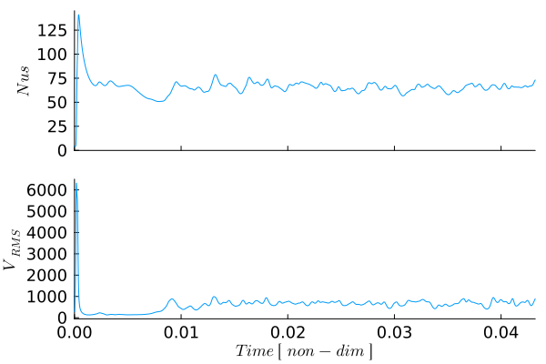

# [Bottom Heated Convection](https://github.com/GeoSci-FFM/GeoModBox.jl/blob/main/examples/ThermalConvection/BottomHeated.jl) 

This example demonstrates the simulation of two-dimensional thermal convection in a bottom-heated fluid using the finite-difference solvers provided by `GeoModBox.jl`. Temperature variations generate buoyancy forces that drive flow through the incompressible Stokes equations, while the temperature field evolves through advection and thermal diffusion.

The model combines many of the numerical components introduced throughout the previous examples. In particular, it demonstrates the coupling between the momentum and energy equations, adaptive time stepping, semi-Lagrangian advection, and implicit heat diffusion. Throughout the simulation, several diagnostic quantities, including the Nusselt number, root-mean-square velocity, and mean temperature profile, are evaluated to monitor the evolution of the convective system.

This example considers bottom-heated convection with a basal Rayleigh number of 

$$\begin{equation}
Ra_b = 10^6.
\end{equation}$$

The example uses the momentum, advection, and heat-equation solvers of `GeoModBox.jl` together with standard Julia packages for sparse linear algebra, visualization, and performance measurements.

```Julia
using Plots, ExtendableSparse
using GeoModBox
using GeoModBox.InitialCondition, GeoModBox.MomentumEquation.TwoD
using GeoModBox.AdvectionEquation.TwoD, GeoModBox.HeatEquation.TwoD
using GeoModBox.Scaling
using Statistics, LinearAlgebra
using Printf, TimerOutputs, LaTeXStrings, Measures
```

The following section specifies the initial temperature distribution together with several visualization parameters used to generate animations and diagnostic figures during the simulation.

```Julia
to      =   TimerOutput()
# Define Initial Condition ========================================== #
# Temperature - 
#   1) circle, 2) gaussian, 3) block, 4) linear, 5) lineara
# !!! Gaussian is not working!!! 
Ini         =   (T=:lineara,)
# ------------------------------------------------------------------- #
# Plot Einstellungen ================================================ #
Pl  =   (
    qinc        =   10,
    qsc         =   1.0e-4
)
# Animationssettings ================================================ #
path        =   string("./examples/ThermalConvection/Results/")
anim        =   Plots.Animation(path, String[] )
save_fig    =   1
# ------------------------------------------------------------------- #
```

The computational domain and the dimensional material properties are defined next. The Rayleigh number may either be prescribed directly or computed automatically from the dimensional parameters. If a Rayleigh number is specified, the reference viscosity is adjusted accordingly.

```Julia
@timeit to "Ini" begin
# Modellgeometrie Konstanten ======================================== #
M   =   Geometry(
    xmin    =   0.0,                #   [ m ] 
    xmax    =   11600e3,            #   [ m ]
    ymin    =   -2900e3,            #   [ m ]
    ymax    =   0.0,                #   [ m ]
)
# ------------------------------------------------------------------- #
# Referenzparameter ================================================= #
P   =   Physics(
    g       =   9.81,               #   Schwerebeschleunigung [m/s^2]
    ρ₀      =   3300.0,             #   Hintergunddichte [kg/m^3]
    k       =   4.125,              #   Thermische Leitfaehigkeit [ W/m/K ]
    cp      =   1250.0,             #   Heat capacity [ J/kg/K ]
    α       =   2.0e-5,             #   Thermischer Expnasionskoef. [ K^-1 ]
    Q₀      =   0.0,                #   Waermeproduktionsrate pro Volumen [W/m^3]
    η₀      =   3.947725485e23,     #   Viskositaet [ Pa*s ] [1.778087025e21]
    ΔT      =   2500.0,             #   Temperaturdifferenz
    # Falls Ra < 0 gesetzt ist, dann wird Ra aus den obigen Parametern
    # berechnet. Falls Ra gegeben ist, dann wird die Referenzviskositaet so
    # angepasst, dass die Skalierungsparameter die gegebene Rayleigh-Zahl
    # ergeben.
    Ra      =   1.0e6,              #   Rayleigh number
    Ttop    =   273.15,             #   Temperatur an der Oberfläche [ K ]
)
# ------------------------------------------------------------------- #
```

The governing equations are solved in non-dimensional form. Therefore, characteristic scaling parameters are computed from the physical model and subsequently used to non-dimensionalize all variables.

```Julia
# Definiere Skalierungskonstanten =================================== # 
S   =   ScalingConstants!(M,P)
# ------------------------------------------------------------------- #
```

The computational grid consists of a staggered finite-difference mesh with pressure and temperature stored at cell centers and velocity components located on the corresponding cell faces.

```Julia
# Gittereinstellungen =============================================== #
NC  =   (
    x   =   400,
    y   =   100,
)
NV      =   (
    x   =   NC.x + 1,
    y   =   NC.y + 1,
)
Δ       =   GridSpacing(
    x   =   (M.xmax - M.xmin)/NC.x,
    y   =   (M.ymax - M.ymin)/NC.y,
)
# ------------------------------------------------------------------- #
```

All numerical fields required during the simulation are allocated. In addition to the primary solution variables, auxiliary arrays are created for defect-correction iterations, strain-rate and stress calculations, residual evaluation, and diagnostic quantities.

```Julia
# Initialisierung der Datenfelder =================================== #
D       =   DataFields(
    Q       =   zeros(Float64,(NC...)),
    T       =   zeros(Float64,(NC...)),
    T0      =   zeros(Float64,(NC...)),
    T_ex    =   zeros(Float64,(NC.x+2,NC.y+2)),
    T_ex0   =   zeros(Float64,(NC.x+2,NC.y+2)),
    Told_ex =   zeros(Float64,(NC.x+2,NC.y+2)),
    ρ       =   ones(Float64,(NC...)),
    vx      =   zeros(Float64,(NV.x,NV.y+1)),
    vy      =   zeros(Float64,(NV.x+1,NV.y)),    
    Pt      =   zeros(Float64,(NC...)),
    vxc     =   zeros(Float64,(NC...)),
    vyc     =   zeros(Float64,(NC...)),
    vxco    =   zeros(Float64,(NC...)),
    vyco    =   zeros(Float64,(NC...)),
    vc      =   zeros(Float64,(NC...)),
    ΔTtop   =   zeros(Float64,NC.x),
    ΔTbot   =   zeros(Float64,NC.x),
)
# ------------------------------------------------------------------- #
# Needed for the defect correction solution ---
divV        =   zeros(Float64,NC...)
ε           =   (
    xx      =   zeros(Float64,NC...), 
    yy      =   zeros(Float64,NC...), 
    xy      =   zeros(Float64,NV...),
)
τ           =   (
    xx      =   zeros(Float64,NC...), 
    yy      =   zeros(Float64,NC...), 
    xy      =   zeros(Float64,NV...),
)
# Residuals ---
Fm     =    (
    x       =   zeros(Float64,NV.x, NC.y), 
    y       =   zeros(Float64,NC.x, NV.y)
)
FPt         =   zeros(Float64,NC...)
# Heat Flux calculations ---
Tv1         =   zeros(NV.x,1)
Tv2         =   zeros(NV.x,1)
dTdy        =   zeros(NV.x,1)
# ------------------------------------------------------------------- #
```

The simulation time, stability factors for the Courant and diffusion criteria, and arrays used to store diagnostic quantities are initialized. During the simulation, the time step is adjusted automatically according to the most restrictive stability criterion.

```Julia
# Zeitparameter ===================================================== #
T   =   TimeParameter(
    tmax    =   1000000.0,          #   [ Ma ]
    Δfacc   =   0.9,                #   Courant time factor
    Δfacd   =   0.9,                #   Diffusion time factor
    itmax   =   10000,              #   Maximum iterations
)
T.tmax      =   T.tmax*1e6*T.year    #   [ s ]
T.Δc        =   T.Δfacc * minimum((Δ.x,Δ.y)) / 
                    (sqrt(maximum(abs.(D.vx))^2 + maximum(abs.(D.vy))^2))
T.Δd        =   T.Δfacd * (1.0 / (2.0 * P.κ *(1.0/Δ.x^2 + 1/Δ.y^2)))

T.Δ         =   minimum([T.Δd,T.Δc])
# Statistics -------------------------------------------------------- #
Time            =   zeros(T.itmax)
Nus             =   zeros(T.itmax)
meanV           =   zeros(T.itmax)
meanT           =   zeros(T.itmax,NC.y+2)
epsV_history    =   fill(NaN, T.itmax)
find            =   0
count           =   0
epsV0           =   0
final_step      =   0 
# ------------------------------------------------------------------- #
```

Once the scaling constants have been determined, all dimensional model parameters are converted into their corresponding non-dimensional values used by the numerical solvers.

```Julia
# Skalierungsgesetze ================================================ #
ScaleParameters!(S,M,Δ,T,P,D)
# ------------------------------------------------------------------- #
```

Finally, one- and two-dimensional coordinate arrays are generated for the staggered grid. These coordinates are used throughout the simulation for interpolation, visualization, and evaluation of the finite-difference operators.

```Julia
# Koordinaten ======================================================= #
x       =   (
    c   =   LinRange(M.xmin+Δ.x/2,M.xmax-Δ.x/2,NC.x),
    ce  =   LinRange(M.xmin - Δ.x/2.0, M.xmax + Δ.x/2.0, NC.x+2),
    v   =   LinRange(M.xmin,M.xmax,NV.x),
)
y       =   (
    c   =   LinRange(M.ymin+Δ.y/2,M.ymax-Δ.y/2,NC.y),
    ce  =   LinRange(M.ymin - Δ.y/2.0, M.ymax + Δ.y/2.0, NC.y+2),
    v   =   LinRange(M.ymin,M.ymax,NV.y),
)
x1      =   (
    c2d     =   x.c .+ 0*y.c',
    v2d     =   x.v .+ 0*y.v', 
    vx2d    =   x.v .+ 0*y.ce',
    vy2d    =   x.ce .+ 0*y.v',
)
x   =   merge(x,x1)
y1      =   (
    c2d     =   0*x.c .+ y.c',
    v2d     =   0*x.v .+ y.v',
    vx2d    =   0*x.v .+ y.ce',
    vy2d    =   0*x.ce .+ y.v',
)
y   =   merge(y,y1)
# ------------------------------------------------------------------- #
end
```

The initial temperature field is generated according to the selected configuration. Several predefined initial perturbations are available.

```Julia
# Anfangsbedingungen ================================================ #
@timeit to "IniCondition" begin
IniTemperature!(Ini.T,M,NC,D,x,y;Tb=P.Tbot,Ta=P.Ttop)
end
# ------------------------------------------------------------------- #
```

Dirichlet boundary conditions prescribe the temperatures at the upper and lower boundaries, while insulating side walls are implemented using homogeneous Neumann conditions. Free-slip velocity boundary conditions are applied along all boundaries.

```Julia
# Randbedingungen =================================================== #
@timeit to "BoundaryCondition" begin
# Temperatur ------
TBC     = (
    type    = (W=:Neumann, E=:Neumann,N=:Dirichlet,S=:Dirichlet),
    val     = (W=zeros(NC.y),E=zeros(NC.y),
                    N=P.Ttop.*ones(NC.x),S=P.Tbot.*ones(NC.x)))
# Geschwindigkeit ------
VBC     =   (
    type    =   (E=:freeslip,W=:freeslip,S=:freeslip,N=:freeslip),
    val     =   (E=zeros(NV.y),W=zeros(NV.y),S=zeros(NV.x),N=zeros(NV.x),
                    vyS=0.0,vyN=0.0,vxW=0.0,vxE=0.0),
)
end
# ------------------------------------------------------------------- # 
```

The specified Rayleigh number is enforced by adjusting the reference viscosity whenever necessary.

```Julia
# Rayleigh Zahl Bedingungen ========================================= #
if P.Ra < 0
    # Falls die Rayleigh Zahl nicht explizit angegeben wird, dann 
    # wird sie hier berechnet
    P.Ra     =   P.ρ₀*P.g*P.α*P.ΔT*S.hsc^3/P.η₀/P.κ
else
    # Falls die Rayleigh Zahl explizit angegeben ist, dann wird hier 
    # die Referenzviskositaet η₀ angepasst. 
    P.η₀     =   P.ρ₀*P.g*P.α*P.ΔT*S.hsc^3/P.Ra/P.κ
end
filename    =   string("Bottom_Heated_",P.Ra[1],
                        "_",NC.x,"_",NC.y,
                        "_",Ini.T)
# =================================================================== #
```

Before entering the time loop, the matrices and work arrays required by the momentum and energy solvers are allocated. Since the viscosity is constant in this example, the momentum matrix only needs to be assembled and factorized once, significantly reducing the computational cost.

```Julia
# Lineares Gleichungssystem ========================================= #
@timeit to "EquationSetup" begin
# Momentum Conservation Equation (MCE) ------
niterM     =   50
atolM      =   1e-8        #   Absolute tolerance
rtolM      =   1e-5        #   # Relative convergence tolerance (RM/R0)
RM         =   0.0         #   Initialize absolute residual    
RMrel      =   0.0         #   Initialize relative residual 
# Numbering, without ghost nodes! ---
off     = [ NV.x*NC.y,                          # vx
            NV.x*NC.y + NC.x*NV.y,              # vy
            NV.x*NC.y + NC.x*NV.y + NC.x*NC.y ] # Pt

Num    =    (
    Vx  =   reshape(1:NV.x*NC.y, NV.x, NC.y), 
    Vy  =   reshape(off[1]+1:off[1]+NC.x*NV.y, NC.x, NV.y), 
    Pt  =   reshape(off[2]+1:off[2]+NC.x*NC.y,NC...),
    T   =   reshape(1:NC.x*NC.y, NC.x, NC.y),
)
ndofM   =   maximum(Num.Pt)     
KM      =   ExtendableSparseMatrix(ndofM,ndofM)      
δx      =   zeros(maximum(Num.Pt))
F       =   zeros(maximum(Num.Pt))   
# Assemble Matrix for momentum equation ---
# Optimization outside time loop since viscosity is constant ---
KM      =   Assemblyc(NC, NV, Δ, 1.0, VBC, Num)
KMfac   =   lu(KM.cscmatrix)
# Energieerhaltung (EEG) ------
niterT  =   10
ϵT      =   1e-12
RE      =   0.0
ndofT   =   maximum(Num.T)     
KT      =   ExtendableSparseMatrix(ndofT,ndofT)
δT      =   zeros(maximum(Num.T))
RT      =   zeros(Float64,NC...)
∂2T     =   (∂x2=zeros(NC.x, NC.y), ∂y2=zeros(NC.x, NC.y),
                ∂x20=zeros(NC.x, NC.y), ∂y20=zeros(NC.x, NC.y))
end
# ------------------------------------------------------------------- #
```

The simulation proceeds by repeatedly solving the coupled momentum and energy equations. At every time step, the Stokes equations are solved first to obtain the velocity field, which is subsequently used to advect the temperature. Thermal diffusion is then evaluated implicitly before advancing to the next time step.

```Julia
# Zeitschleife ====================================================== #
@timeit to "Time Loop" begin
for it = 1:T.itmax
    find = it
    R0      =   0.0
    verbose_step    =   mod(it, 500) == 0 || it == 1 || final_step == 1
    if it>1
        Time[it]  =   Time[it-1] + T.Δ
    end
```

The incompressible Stokes equations are solved using a defect-correction iteration. Since the system matrix remains constant for isoviscous convection, only the residual vector changes between iterations.

```Julia
    verbose_step && @printf("Time step: #%04d, Time [non-dim]: %04e\n ",it,
                    Time[it])
    verbose_step && @printf("---Momentum Calculation ---\n")
    # ------ MCE ------
    if it == 1
        D.vx[2:end-1,:]    .=  0.0
        D.vy[:,1:end-1]    .=  0.0
        D.Pt               .=  0.0
    end
    # Residual Calculation ------
    @. D.ρ  =   -P.Ra*D.T
    @timeit to "Residual Iteration" begin
    for iter = 1:niterM
        @timeit to "Residual" begin
        Residuals2Dc!(D,VBC,ε,τ,divV,Δ,1.0,1.0,Fm,FPt)
        F[Num.Vx]    .=   Fm.x
        F[Num.Vy]    .=   Fm.y
        F[Num.Pt]    .=   FPt
        RM          =   norm(F)/length(F)
        if iter == 1
            R0 = max(RM, eps())
        end
        RMrel       =   RM/R0
        if verbose_step
            @printf("   MCE %2d: ||R|| = %1.4e, ||R||/||R₀|| = %1.4e\n",iter,RM,RMrel)
        end
        (RM < atolM || RM/R0 < rtolM) && break
        end
        # Lösen des lineare Gleichungssystems ------
        @timeit to "Solution" begin
        δx      .=   -(KMfac \ F)
        end
        # Update unbekante Variablen ------
        @timeit to "Update Solution" begin
        D.vx[:,2:end-1]     .+=  δx[Num.Vx]
        D.vy[2:end-1,:]     .+=  δx[Num.Vy]
        D.Pt                .+=  δx[Num.Pt]
        end
    end
    end
    # ======
    # Berechnung der Geschwindikeit auf den Centroids ------
    for i = 1:NC.x
        for j = 1:NC.y
            D.vxc[i,j]  = (D.vx[i,j+1] + D.vx[i+1,j+1])/2
            D.vyc[i,j]  = (D.vy[i+1,j] + D.vy[i+1,j+1])/2
        end
    end
    @. D.vc        = sqrt(D.vxc^2 + D.vyc^2)
```

After the velocity solution has converged, the face-centered velocities are interpolated to the cell centers and several diagnostic quantities are evaluated. These include the Nusselt number, the root-mean-square velocity, and the horizontally averaged temperature profile.

```Julia
    # Wärmefluss an der Oberfläche ================================== #
    # Get temperature at the vertices         
    @. Tv1  =   (D.T_ex[1:end-1,end] + D.T_ex[2:end,end] + 
                    D.T_ex[1:end-1,end-1] + D.T_ex[2:end,end-1])/4
    @. Tv2  =   (D.T_ex[1:end-1,end-1] + D.T_ex[2:end,end-1] + 
                    D.T_ex[1:end-1,end-2] + D.T_ex[2:end,end-2])/4
    # Calculate temperature gradient --- 
    @. dTdy =   -(Tv1 - Tv2)/Δ.y
    # Calculate Nusselt number ---
    Nus[it]     =   0.0
    # Trapezoidal integration -
    for i = 1:NV.x
        if i == 1 || i == NV.x
            afac = 1
        else
            afac = 2
        end
        Nus[it]     += afac * dTdy[i]
    end
    Nus[it]     *=   Δ.x/2
    meanT[it,:] =   mean(D.T_ex,dims=1)
    meanV[it] = sqrt(mean(D.vxc.^2 .+ D.vyc.^2))
    # --------------------------------------------------------------- #
```

The current state of the simulation is visualized periodically. The resulting figure combines the temperature field, velocity vectors, and the horizontally averaged temperature profile, providing a concise overview of the evolving convection pattern.

```Julia
    # Plot ========================================================== #
    if verbose_step
        p = PlotFieldProfile(Pl, M, D, x, y, @view(meanT[it, :]))

        if save_fig == 1
            Plots.frame(anim,p)
        elseif save_fig == 0
            p !== nothing && display(p)
        end
    end
    if final_step == 1
        @printf(" Maximum Time reached!\n")
        break
    end
    # --------------------------------------------------------------- #
```

An adaptive time step is computed from both the Courant stability criterion and the thermal diffusion criterion. If the next step would exceed the prescribed maximum simulation time, the time step is reduced accordingly so that the simulation terminates exactly at the requested final time.

```Julia
    # Berechnung der Zeitschrittlänge =============================== #
    T.Δc        =   T.Δfacc * minimum((Δ.x,Δ.y)) / 
            (sqrt(maximum(abs.(D.vx))^2 + maximum(abs.(D.vy))^2))
    T.Δd        =   T.Δfacd * (1.0 / (2.0 *(1.0/Δ.x^2 + 1/Δ.y^2)))
    T.Δ         =   minimum([T.Δd,T.Δc])
    if Time[it] + T.Δ >= T.tmax
        T.Δ        = T.tmax - Time[it]
        final_step = 1
    end
    # --------------------------------------------------------------- #
```

The temperature field is transported using the semi-Lagrangian advection scheme. The velocity field from the current Stokes solution is used to trace the departure points of the fluid parcels.

```Julia
    # Advektion ===================================================== #
    if it == 1
        @. D.vxco   =   D.vxc
        @. D.vyco   =   D.vyc
    end
    @timeit to "Advection" begin
    semilagc2D!(D.T,D.T_ex,D.vxc,D.vyc,D.vxco,D.vyco,x,y,T.Δ)
    end
    @. D.vxco  =   D.vxc
    @. D.vyco  =   D.vyc
    # --------------------------------------------------------------- #
```

Following advection, thermal diffusion is solved implicitly using a Crank–Nicolson discretization and a defect-correction iteration. This completes one fully coupled thermo-mechanical time step.

```Julia
    # Diffusion ===================================================== #
    @timeit to "Diffusion" begin
    verbose_step && @printf("---Energy Calculation---\n")
    # Update temperature field --- 
    @. D.T0     =   D.T
    # Assemble linear system
    KT      =   AssembleMatrix2Dc(1.0, TBC, Num, NC, Δ, T.Δ[1];C=0.5)
    # Solve for temperature correction: Cholesky factorisation
    KTc     =   cholesky(KT.cscmatrix)
    for iter = 1:niterT
        # Evaluate residual
        ComputeResiduals2Dc!( RT, D.T, D.T_ex, D.T0, D.T_ex0, ∂2T, 
                1.0, TBC, Δ, T.Δ[1]; C = 0.5 )
        RE      =   norm(RT)/length(RT)
        if verbose_step
            @printf("   ECE %2d: ||RE|| = %1.4e\n", iter, RE)
        end
        RE < ϵT ? break : nothing
        # Solve for temperature correction: Back substitutions
        δT .= -(KTc\RT[:])
        # Update temperature
        @. D.T += δT[Num.T]
    end
    # Update extended field for advection scheme --- 
    D.T_ex[2:end-1,2:end-1]     .=  D.T
    end
    # --------------------------------------------------------------- #
```

After each time step, the simulation is checked for termination. The computation stops either when the prescribed maximum simulation time has been reached or when the temporal variations of the root-mean-square velocity indicate that a statistically steady convective state has been achieved.

```Julia
    # Check break =================================================== #
    # If the maximum time is reached or if the models reaches steady 
    # state the time loop is stoped! 
    if Time[it] > 0.0038
        epsC    =   0.001
            ind = searchsortedfirst(@view(Time[1:it]), Time[it] - 0.05)
            epsV    =   std(@view meanV[ind:it])
            if count == 0
                epsV0   = max(epsV, eps(Float64))
                count   += 1
            end
            epsV        /= epsV0
            epsV_history[it] = epsV
            find    =   it
            verbose_step && @printf("ε_Vr = %g, ε_Cr = %g \n",epsV,epsC)
            if Time[it] >= T.tmax
                @printf("Maximum time reached!\n")
                find    =   it
                break
            elseif (epsV <= epsC)
                @printf("Convection reaches steady state at %i!\n",it)
                find    =   it
                break
            end
    end
    # --------------------------------------------------------------- #
    verbose_step && @printf("\n")
end
end
```

After the simulation has finished, the generated animation and several diagnostic figures are written to disk. These include the convergence history, the final convection pattern, the temporal evolution of the Nusselt number and RMS velocity, and the mean temperature profile.

```Julia
if save_fig == 1
    # Write the frames to a GIF file
    Plots.gif(anim, string( path, filename, ".gif" ), fps = 15)
    foreach(rm, filter(startswith(string(path,"00")), readdir(path,join=true)))
end
valid   =   findall(isfinite, epsV_history)
k   = plot(
        valid,
        log10.(epsV_history[valid]),
        xlabel = "it",
        ylabel = "log₁₀(εᵥ/εᵥ₀)",
        label = "",
        markershape = :circle,
        markercolor = :black,
)
# Save final figure ===================================================== #
p2 = PlotFieldProfile(Pl, M, D, x, y, @view(meanT[find, :]))
if save_fig == 1
    savefig(k,string("./examples/ThermalConvection/Results/Bottom_Heated_Iterations",P.Ra,
            "_",NC.x,"_",NC.y,
            "_",Ini.T,".png"))
    savefig(p2,string("./examples/ThermalConvection/Results/Bottom_Heated_Final_Stage",P.Ra,
            "_",NC.x,"_",NC.y,"_it_",find,"_",
            Ini.T,"_",".png"))
elseif save_fig == 0
    display(p2)
    display(k)
end
# ----------------------------------------------------------------------- #
# Plot time serieses ==================================================== #
q2  =   plot(layout=(2,1),size=(1200,900),dpi = 300)
q2  =   plot(Time[1:find],Nus[1:find],
            xlabel= "", ylabel= L"Nus",label="",
            xformatter = _ -> "",
            xlims=(0,Time[find]),
            guidefontsize = 12, tickfontsize = 12,
            titlefontsize = 12, grid = false,
            layout=(2,1),subplot=1)
plot!(q2,Time[1:find],meanV[1:find],
            xlabel= L"Time\ [\ non-dim\ ]", ylabel= L"V_{RMS}",label="",
            xformatter =:auto,
            guidefontsize = 12, tickfontsize = 12,
            titlefontsize = 12,grid = false,
            xlims=(0,Time[find]),
            layout=(2,1),subplot=2)
if save_fig == 1
    savefig(q2,string("./examples/ThermalConvection/Results/Bottom_Heated_TimeSeries",P.Ra,
                        "_",NC.x,"_",NC.y,"_",Ini.T,"_",".png"))
elseif save_fig == 0
    display(q2)
end
# ======================================================================= #
# Plot Mean temperature profile over time =============================== #
q3  =   plot(mean(meanT[1:find,:],dims=1)',y.ce,
        xlabel=L"⟨T⟩",ylabel=L"y",title=L"Mean Temperature",
        xlims=(0,1),ylims=(-1,0),
        label="",aspect_ratio=1)
if save_fig == 1
    savefig(q3,string("./examples/ThermalConvection/Results/Bottom_Heated_TProfile",P.Ra,
                        "_",NC.x,"_",NC.y,"_",Ini.T,"_",".png"))
elseif save_fig == 0
    display(q3)
end
display(to)
# ======================================================================= #
```


**Figure 1.** Evolution of bottom-heated thermal convection at a Rayleigh number of $Ra_b = 10^6$. The animation illustrates the transition from the initial conductive temperature field to a convective state driven by basal heating. Each frame shows the temperature field, velocity vectors, and the horizontally averaged temperature profile. Hot material rises from the lower boundary, while cold material sinks from the surface, resulting in a characteristic convection-cell pattern.



**Figure 2.** Temporal evolution of the Nusselt number ($Nu$) and the root-mean-square velocity ($V_\mathrm{RMS}$). The Nusselt number quantifies the efficiency of convective heat transport relative to pure conduction, whereas the RMS velocity measures the overall vigor of the convective flow. Both quantities evolve from the initial conductive state toward statistically steady convection.

---

The following helper function generates the main visualization used throughout the example. It combines the temperature field, velocity vectors, and the horizontally averaged temperature profile into a single figure.

```Julia
# ======================================================================= #
# Helper function ======================================================= #
# ======================================================================= #
function PlotFieldProfile(Pl,M,D,x,y,Tmean)
    # ---------------------------------------------------------------------------
    # Combined temperature field and mean-temperature profile
    # ---------------------------------------------------------------------------
    p = nothing

    # Width of the physical model domain
    Lx  =   M.xmax - M.xmin

    # Geometry of the profile strip
    profile_gap     =   0.08Lx       # Gap between field and profile
    profile_width   =   0.22Lx       # Width assigned to the profile

    xprofile_min    =   M.xmax + profile_gap
    xprofile_max    =   xprofile_min + profile_width

    # # Mean-temperature profile at the current time step
    # Tmean           =   meanT[it, :]

    # Map <T> = 0...1 onto the profile strip
    xprofile        =   xprofile_min .+ profile_width .* Tmean

    # Full horizontal extent of the combined figure
    xmax_plot       =   xprofile_max + 0.04Lx

    p = plot(
        size            = (1900, 500),
        dpi             = 300,
        guidefontsize   = 28,
        tickfontsize    = 18,
        titlefontsize   = 28,
        legend          = false,
        framestyle      = :box,
        left_margin     = 20mm,
        right_margin    = 10mm,
        bottom_margin   = 15mm,
        top_margin      = 8mm,
    )

    # ---------------------------------------------------------------------------
    # Temperature field
    # ---------------------------------------------------------------------------

    heatmap!(
        p,
        x.c,
        y.c,
        D.T',
        xlabel       = L"x",
        ylabel       = L"y",
        title        = L"Temperature",
        color        = cgrad(:lajolla),
        colorbar     = true,
        aspect_ratio = :equal,
        xlims        = (M.xmin, xmax_plot),
        ylims        = (M.ymin, M.ymax),
    )

    contour!(
        p,
        x.c,
        y.c,
        D.T',
        linewidth = 1,
        color     = "white",
        alpha     = 0.5,
    )

    quiver!(
        p,
        x.c2d[1:Pl.qinc:end, 1:Pl.qinc:end],
        y.c2d[1:Pl.qinc:end, 1:Pl.qinc:end],
        quiver = (
            D.vxc[1:Pl.qinc:end, 1:Pl.qinc:end] .* Pl.qsc,
            D.vyc[1:Pl.qinc:end, 1:Pl.qinc:end] .* Pl.qsc,
        ),
        linewidth = 1,
        linealpha = 0.5,
        color     = "black",
    )

    # ---------------------------------------------------------------------------
    # Mean-temperature profile
    # ---------------------------------------------------------------------------

    # White background for the profile strip
    plot!(
        p,
        Shape(
            [xprofile_min, xprofile_max, xprofile_max, xprofile_min],
            [M.ymin, M.ymin, M.ymax, M.ymax],
        ),
        fillcolor   = :white,
        fillalpha   = 1.0,
        linecolor   = :black,
        linewidth   = 1.5,
    )

    # Optional horizontal reference lines
    for ytick in range(M.ymin, M.ymax, length=6)
        plot!(
            p,
            [xprofile_min, xprofile_max],
            [ytick, ytick],
            color     = :gray,
            alpha     = 0.25,
            linewidth = 0.8,
        )
    end

    # Mean-temperature profile
    plot!(
        p,
        xprofile,
        y.ce,
        color     = :black,
        linewidth = 4,
    )

    # Separator between field and profile
    vline!(
        p,
        [xprofile_min],
        color     = :black,
        linewidth = 1.5,
    )

    # Profile title
    annotate!(
        p,
        (
            0.5 * (xprofile_min + xprofile_max),
            M.ymax + 0.055 * (M.ymax - M.ymin),
            text(L"\langle T\rangle", 24, :center),
        ),
    )

    # Profile-axis labels: 0, 0.5, 1
    for (Ttick, label) in zip((0.0, 0.5, 1.0), ("0", "0.5", "1"))
        xtick = xprofile_min + profile_width * Ttick

        # Small tick mark
        plot!(
            p,
            [xtick, xtick],
            [M.ymin, M.ymin + 0.018 * (M.ymax - M.ymin)],
            color     = :black,
            linewidth = 1.2,
        )

        # Tick label
        annotate!(
            p,
            (
                xtick,
                M.ymin - 0.055 * (M.ymax - M.ymin),
                text(label, 16, :center),
            ),
        )
    end
    return p
end
```