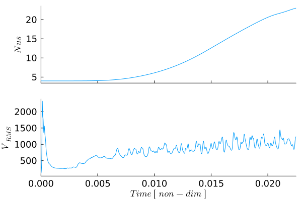

# [Bottom-Heated Convection with Variable Viscosity](https://github.com/GeoSci-FFM/GeoModBox.jl/blob/main/examples/ThermalConvection/BottomHeated_VarEta.jl) 

This example extends the constant-viscosity bottom-heated convection model by introducing a temperature-dependent viscosity. Temperature variations therefore affect the system in two ways: they generate buoyancy forces in the incompressible Stokes equations and modify the local resistance to deformation. Cold material near the surface becomes comparatively strong, whereas hot material near the lower boundary remains weak.

The numerical workflow remains closely related to the isoviscous example. The momentum and energy equations are coupled through the temperature field, the temperature is transported using a semi-Lagrangian advection scheme, and thermal diffusion is discretized in time using the Crank-Nicolson method. The resulting momentum and energy systems are solved using the general defect-correction framework.

This example considers bottom-heated convection with a basal Rayleigh number of

$$\begin{equation}
Ra_b = 10^6.
\end{equation}$$

The viscosity is normalized by the reference viscosity used to define the Rayleigh number and varies according to an Arrhenius-like temperature dependence. The evolving viscosity field is evaluated at every time step and enters the variable-coefficient momentum equations. In addition to the Nusselt number, root-mean-square velocity, and mean temperature profile, the viscosity field and its horizontally averaged logarithmic profile are monitored throughout the simulation.

---

The example uses the momentum, advection, and heat-equation solvers of `GeoModBox.jl` together with standard Julia packages for sparse linear algebra, visualization, and performance measurements.

```Julia
using Plots, ExtendableSparse
using GeoModBox
using GeoModBox.InitialCondition, GeoModBox.MomentumEquation.TwoD
using GeoModBox.AdvectionEquation.TwoD, GeoModBox.HeatEquation.TwoD
using GeoModBox.Scaling
using Statistics, LinearAlgebra
using Printf, TimerOutputs, LaTeXStrings, Measures
```

A timer is initialized to measure the computational cost of the individual model components. The initial temperature field is selected together with the plotting parameters, animation directory, and output options. Because the viscosity varies strongly with temperature, this example is computationally more expensive than the isoviscous model, particularly because the momentum matrix must be reassembled and factorized whenever the viscosity field changes. For more information on the runtime of the model, please refer to [here](../Examples.md). 

```Julia
to      =   TimerOutput()
# Define Initial Condition ========================================== #
# Temperature - 
#   1) circle, 2) gaussian, 3) block, 4) linear, 5) lineara
# !!! Gaussian is not working!!! 
Ini         =   (T=:lineara,)
# ------------------------------------------------------------------- #
# Plot Einstellungen ================================================ #
Pl  =   (
    qinc        =   10,
    qsc         =   5.0e-5
)
# Animationssettings ================================================ #
path        =   string("./examples/ThermalConvection/Results/")
anim        =   Plots.Animation(path, String[] )
save_fig    =   1
# ------------------------------------------------------------------- #
```

The dimensional model geometry and reference material properties are defined next. The domain represents a layer with an aspect ratio of four, while the prescribed temperature difference determines the buoyancy contrast across the layer. No internal heat production is included, so convection is driven exclusively by heating from below. The dimensional reference viscosity is either used to calculate the Rayleigh number or adjusted to reproduce a prescribed value.

```Julia
@timeit to "Ini" begin
# Modellgeometrie Konstanten ======================================== #
M   =   Geometry(
    xmin    =   0.0,                #   [ m ] 
    xmax    =   11600e3,            #   [ m ]
    ymin    =   -2900e3,            #   [ m ]
    ymax    =   0.0,                #   [ m ]
)
# ------------------------------------------------------------------- #
# Referenzparameter ================================================= #
P   =   Physics(
    g       =   9.81,               #   Schwerebeschleunigung [m/s^2]
    ρ₀      =   3300.0,             #   Hintergunddichte [kg/m^3]
    k       =   4.125,              #   Thermische Leitfaehigkeit [ W/m/K ]
    cp      =   1250.0,             #   Heat capacity [ J/kg/K ]
    α       =   2.0e-5,             #   Thermischer Expnasionskoef. [ K^-1 ]
    Q₀      =   0.0,                #   Waermeproduktionsrate pro Volumen [W/m^3]
    η₀      =   3.947725485e23,     #   Viskositaet [ Pa*s ] [1.778087025e21]
    ΔT      =   2500.0,             #   Temperaturdifferenz
    # Falls Ra < 0 gesetzt ist, dann wird Ra aus den obigen Parametern
    # berechnet. Falls Ra gegeben ist, dann wird die Referenzviskositaet so
    # angepasst, dass die Skalierungsparameter die gegebene Rayleigh-Zahl
    # ergeben.
    Ra      =   1.0e6,              #   Rayleigh number
    Ttop    =   273.15,             #   Surface temperature [ K ]
)
# ------------------------------------------------------------------- #
```

The scaling constants are derived from the dimensional geometry and physical parameters. They define the characteristic length, temperature, time, velocity, and viscosity scales used to transform the governing equations and model variables into nondimensional form.

```Julia
# Definiere Skalierungskonstanten =================================== # 
S   =   ScalingConstants!(M,P)
# ------------------------------------------------------------------- #
```

The computational domain is discretized using a regular staggered finite-difference grid. Scalar quantities, including temperature, pressure, density, and centroid viscosity, are stored at cell centers, whereas the velocity components and shear viscosity are defined at their corresponding staggered locations.

```Julia
# Gittereinstellungen =============================================== #
NC  =   (
    x   =   400,
    y   =   100,
)
NV      =   (
    x   =   NC.x + 1,
    y   =   NC.y + 1,
)
Δ       =   GridSpacing(
    x   =   (M.xmax - M.xmin)/NC.x,
    y   =   (M.ymax - M.ymin)/NC.y,
)
# ------------------------------------------------------------------- #
```

The required solution fields, auxiliary arrays, residuals, strain-rate components, and stress components are allocated before entering the time loop. In contrast to the constant-viscosity example, additional arrays store the viscosity at cell centers, extended cell centers, and vertices. These fields are required to assemble the variable-coefficient momentum equations consistently on the staggered grid.

```Julia
# Initialisierung der Datenfelder =================================== #
D       =   DataFields(
    Q       =   zeros(Float64,(NC...)),
    T       =   zeros(Float64,(NC...)),
    T0      =   zeros(Float64,(NC...)),
    T_ex    =   zeros(Float64,(NC.x+2,NC.y+2)),
    T_ex0   =   zeros(Float64,(NC.x+2,NC.y+2)),
    Told_ex =   zeros(Float64,(NC.x+2,NC.y+2)),
    ρ       =   ones(Float64,(NC...)),
    vx      =   zeros(Float64,(NV.x,NV.y+1)),
    vy      =   zeros(Float64,(NV.x+1,NV.y)),    
    Pt      =   zeros(Float64,(NC...)),
    vxc     =   zeros(Float64,(NC...)),
    vyc     =   zeros(Float64,(NC...)),
    vxco    =   zeros(Float64,(NC...)),
    vyco    =   zeros(Float64,(NC...)),
    vc      =   zeros(Float64,(NC...)),
    ΔTtop   =   zeros(Float64,NC.x),
    ΔTbot   =   zeros(Float64,NC.x),
    ηc      =   ones(Float64,(NC...)),
    η_ex    =   ones(Float64,(NC.x+2,NC.y+2)),
    ηv      =   ones(Float64,(NV...)),
)
# ------------------------------------------------------------------- #
# Needed for the defect correction solution ---
divV        =   zeros(Float64,NC...)
ε           =   (
    xx      =   zeros(Float64,NC...), 
    yy      =   zeros(Float64,NC...), 
    xy      =   zeros(Float64,NV...),
)
τ           =   (
    xx      =   zeros(Float64,NC...), 
    yy      =   zeros(Float64,NC...), 
    xy      =   zeros(Float64,NV...),
)
# Residuals ---
Fm     =    (
    x       =   zeros(Float64,NV.x, NC.y), 
    y       =   zeros(Float64,NC.x, NV.y)
)
FPt         =   zeros(Float64,NC...)
# Heat Flux calculations ---
Tv1         =   zeros(NV.x,1)
Tv2         =   zeros(NV.x,1)
dTdy        =   zeros(NV.x,1)
# ------------------------------------------------------------------- #
```

The maximum model time, Courant factor, diffusion factor, and maximum number of time steps are specified next. Initial estimates of the advection- and diffusion-controlled time-step limits are calculated, and the smaller value is selected. Arrays are also initialized for the temporal diagnostics and for the normalized variability criterion used to identify a statistically steady convective state.

```Julia
# Zeitparameter ===================================================== #
T   =   TimeParameter(
    tmax    =   1000000.0,          #   [ Ma ]
    Δfacc   =   0.9,                #   Courant time factor
    Δfacd   =   0.9,                #   Diffusion time factor
    itmax   =   10000,              #   Maximum iterations
)
T.tmax      =   T.tmax*1e6*T.year    #   [ s ]
T.Δc        =   T.Δfacc * minimum((Δ.x,Δ.y)) / 
                    (sqrt(maximum(abs.(D.vx))^2 + maximum(abs.(D.vy))^2))
T.Δd        =   T.Δfacd * (1.0 / (2.0 * P.κ *(1.0/Δ.x^2 + 1/Δ.y^2)))

T.Δ         =   minimum([T.Δd,T.Δc])
# Statistics -------------------------------------------------------- #
Time            =   zeros(T.itmax)
Nus             =   zeros(T.itmax)
meanV           =   zeros(T.itmax)
meanT           =   zeros(T.itmax,NC.y+2)
epsV_history    =   fill(NaN, T.itmax)
find            =   0
count           =   0
epsV0           =   0
final_step      =   0 
# ------------------------------------------------------------------- #
```

All dimensional model quantities are converted to their nondimensional equivalents. After this step, the numerical solver operates entirely with scaled coordinates, material properties, fields, and time increments.

```Julia
# Skalierungsgesetze ================================================ #
ScaleParameters!(S,M,Δ,T,P,D)
# ------------------------------------------------------------------- #
```

One-dimensional and two-dimensional coordinate arrays are constructed for cell centers, vertices, and the staggered velocity locations. These arrays are used by the finite-difference operators, the semi-Lagrangian advection scheme, and the visualization routines.

```Julia
# Koordinaten ======================================================= #
x       =   (
    c   =   LinRange(M.xmin+Δ.x/2,M.xmax-Δ.x/2,NC.x),
    ce  =   LinRange(M.xmin - Δ.x/2.0, M.xmax + Δ.x/2.0, NC.x+2),
    v   =   LinRange(M.xmin,M.xmax,NV.x),
)
y       =   (
    c   =   LinRange(M.ymin+Δ.y/2,M.ymax-Δ.y/2,NC.y),
    ce  =   LinRange(M.ymin - Δ.y/2.0, M.ymax + Δ.y/2.0, NC.y+2),
    v   =   LinRange(M.ymin,M.ymax,NV.y),
)
x1      =   (
    c2d     =   x.c .+ 0*y.c',
    v2d     =   x.v .+ 0*y.v', 
    vx2d    =   x.v .+ 0*y.ce',
    vy2d    =   x.ce .+ 0*y.v',
)
x   =   merge(x,x1)
y1      =   (
    c2d     =   0*x.c .+ y.c',
    v2d     =   0*x.v .+ y.v',
    vx2d    =   0*x.v .+ y.ce',
    vy2d    =   0*x.ce .+ y.v',
)
y   =   merge(y,y1)
# ------------------------------------------------------------------- #
end
```

The initial temperature field consists of a conductive profile between the hot lower boundary and the cold upper boundary, supplemented by the perturbation defined by the selected initial-condition type. This perturbation breaks the lateral symmetry and allows convective instabilities to develop.

```Julia
# Anfangsbedingungen ================================================ #
@timeit to "IniCondition" begin
IniTemperature!(Ini.T,M,NC,D,x,y;Tb=P.Tbot,Ta=P.Ttop)
end
# ------------------------------------------------------------------- #
```

The thermal boundary conditions prescribe fixed temperatures at the upper and lower boundaries and zero horizontal heat flux through the side walls. Free-slip velocity conditions are applied on all boundaries, preventing normal flow while allowing tangential motion.

```Julia
# Randbedingungen =================================================== #
@timeit to "BoundaryCondition" begin
# Temperatur ------
TBC     = (
    type    = (W=:Neumann, E=:Neumann,N=:Dirichlet,S=:Dirichlet),
    val     = (W=zeros(NC.y),E=zeros(NC.y),
                    N=P.Ttop.*ones(NC.x),S=P.Tbot.*ones(NC.x)))
# Geschwindigkeit ------
VBC     =   (
    type    =   (E=:freeslip,W=:freeslip,S=:freeslip,N=:freeslip),
    val     =   (E=zeros(NV.y),W=zeros(NV.y),S=zeros(NV.x),N=zeros(NV.x),
                    vyS=0.0,vyN=0.0,vxW=0.0,vxE=0.0),
)
end
# ------------------------------------------------------------------- # 
```

The basal Rayleigh number is either calculated from the dimensional material properties or prescribed directly. When a target value is specified, the dimensional reference viscosity is adjusted accordingly. In the nondimensional momentum equations, this reference viscosity is absorbed into the Rayleigh number, while the spatially varying viscosity is represented by the normalized ratio $\eta/\eta_0$.

```Julia
# Rayleigh Zahl Bedingungen ========================================= #
if P.Ra < 0
    # Falls die Rayleigh Zahl nicht explizit angegeben wird, dann 
    # wird sie hier berechnet
    P.Ra     =   P.ρ₀*P.g*P.α*P.ΔT*S.hsc^3/P.η₀/P.κ
else
    # Falls die Rayleigh Zahl explizit angegeben ist, dann wird hier 
    # die Referenzviskositaet η₀ angepasst. 
    P.η₀     =   P.ρ₀*P.g*P.α*P.ΔT*S.hsc^3/P.Ra/P.κ
end
filename    =   string("Bottom_Heated_VE_",P.Ra[1],
                        "_",NC.x,"_",NC.y,
                        "_",Ini.T)
# =================================================================== #
```

The rheological parameters define the Arrhenius-like temperature dependence of viscosity. The reference value is set to unity because the momentum equations use nondimensional viscosity. The selected parameters produce a strong viscosity contrast between the cold upper boundary and the hot lower boundary, allowing the formation of a mechanically strong surface layer.

```Julia
# Rheological Parameters ============================================ #
# Compute the reference viscosity required to obtain the
# prescribed Rayleigh number.
#
# The momentum equation is solved using η/η₀,
# therefore R.η₀ = 1.
R       =   (
    Ea      =   log(1e5^2),
    TO      =   1.0, 
    TE      =   0.5, 
    η₀      =   1.0,
)
# =================================================================== #
```

The global numbering of the velocity and pressure unknowns is established, and sparse matrices and correction vectors are allocated for the momentum and energy equations. The momentum solve uses absolute and relative convergence tolerances, whereas the Crank-Nicolson heat equation is solved iteratively until the energy residual falls below the prescribed tolerance.

```Julia
# Lineares Gleichungssystem ========================================= #
@timeit to "EquationSetup" begin
# Momentum Conservation Equation (MCE) ------
niterM     =   50
atolM      =   1e-8        #   Absolute tolerance
rtolM      =   1e-5        #   # Relative convergence tolerance (RM/R0)
RM         =   0.0         #   Initialize absolute residual    
RMrel      =   0.0         #   Initialize relative residual 
# Numbering, without ghost nodes! ---
off     = [ NV.x*NC.y,                          # vx
            NV.x*NC.y + NC.x*NV.y,              # vy
            NV.x*NC.y + NC.x*NV.y + NC.x*NC.y ] # Pt

Num    =    (
    Vx  =   reshape(1:NV.x*NC.y, NV.x, NC.y), 
    Vy  =   reshape(off[1]+1:off[1]+NC.x*NV.y, NC.x, NV.y), 
    Pt  =   reshape(off[2]+1:off[2]+NC.x*NC.y,NC...),
    T   =   reshape(1:NC.x*NC.y, NC.x, NC.y),
)
ndofM   =   maximum(Num.Pt)     
KM      =   ExtendableSparseMatrix(ndofM,ndofM)      
δx      =   zeros(maximum(Num.Pt))
F       =   zeros(maximum(Num.Pt))   
# Energieerhaltung (EEG) ------
niterT  =   10
ϵT      =   1e-12
RE      =   0.0
ndofT   =   maximum(Num.T)     
KT      =   ExtendableSparseMatrix(ndofT,ndofT)
δT      =   zeros(maximum(Num.T))
RT      =   zeros(Float64,NC...)
∂2T     =   (∂x2=zeros(NC.x, NC.y), ∂y2=zeros(NC.x, NC.y),
                ∂x20=zeros(NC.x, NC.y), ∂y20=zeros(NC.x, NC.y))
end
# ------------------------------------------------------------------- #
```

The main time loop advances the coupled thermo-mechanical solution. At each step, the current model time is updated and detailed terminal output is restricted to selected intervals to reduce the cost of printing and plotting during the long variable-viscosity calculation.

```Julia
# Zeitschleife ====================================================== #
@timeit to "Time Loop" begin
for it = 1:T.itmax
    find = it
    R0      =   0.0
    verbose_step    =   mod(it, 400) == 0 || it == 1 || final_step == 1
    if it>1
        Time[it]  =   Time[it-1] + T.Δ
    end
    verbose_step && @printf("Time step: #%04d, Time [non-dim]: %04e\n ",it,
                    Time[it])
```

At the beginning of each time step, the cell-centered viscosity is recalculated from the current temperature field and interpolated to the grid vertices. The minimum, maximum, and total viscosity contrast provide useful diagnostics of the evolving rheological structure. Because the viscosity changes with temperature, the momentum matrix is reassembled and factorized before solving the Stokes equations.

The buoyancy term is calculated from the nondimensional temperature, and the momentum residuals are evaluated using the current centroid and vertex viscosities. The defect-correction iteration repeatedly solves for velocity and pressure corrections until either the absolute or relative momentum tolerance is reached. The staggered velocity components are then interpolated to cell centers for advection, diagnostics, and visualization.

```Julia
    verbose_step && @printf("---Momentum Calculation ---\n")
    # Calculate Viscosity --- 
    TdepViscosity!(D,R,:Arrhenius)
    verbose_step && @printf(
        "ηmin = %.2e, ηmax = %.2e, contrast = %.2e\n",
        minimum(D.ηc),
        maximum(D.ηc),
        maximum(D.ηc)/minimum(D.ηc)
    )
    # ---
    # Update K ------
    @timeit to "Assembly" begin
    KM       =   Assembly(NC, NV, Δ, D.ηc, D.ηv, VBC, Num)
    KMfac   =   lu(KM.cscmatrix)
    end
    # ------ MCE ------
    if it == 1
        D.vx[2:end-1,:]    .=  0.0
        D.vy[:,1:end-1]    .=  0.0
        D.Pt               .=  0.0
    end
    # Residual Calculation ------
    @. D.ρ  =   -P.Ra*D.T
    @timeit to "Residual Iteration" begin
    for iter = 1:niterM
        @timeit to "Residual" begin
        Residuals2D!(D,VBC,ε,τ,divV,Δ,D.ηc,D.ηv,1.0,Fm,FPt)
        F[Num.Vx]    .=   Fm.x
        F[Num.Vy]    .=   Fm.y
        F[Num.Pt]    .=   FPt
        RM          =   norm(F)/length(F)
        if iter == 1
            R0 = max(RM, eps())
        end
        RMrel       =   RM/R0
        if verbose_step
            @printf("   MCE %2d: ||R|| = %1.4e, ||R||/||R₀|| = %1.4e\n",iter,RM,RMrel)
        end
        (RM < atolM || RM/R0 < rtolM) && break
        end
        # Lösen des lineare Gleichungssystems ------
        @timeit to "Solution" begin
        δx      .=   -(KMfac \ F)
        end
        # Update unbekante Variablen ------
        @timeit to "Update Solution" begin
        D.vx[:,2:end-1]     .+=  δx[Num.Vx]
        D.vy[2:end-1,:]     .+=  δx[Num.Vy]
        D.Pt                .+=  δx[Num.Pt]
        end
    end
    end
    # ======
    # Berechnung der Geschwindikeit auf den Centroids ------
    for i = 1:NC.x
        for j = 1:NC.y
            D.vxc[i,j]  = (D.vx[i,j+1] + D.vx[i+1,j+1])/2
            D.vyc[i,j]  = (D.vy[i+1,j] + D.vy[i+1,j+1])/2
        end
    end
    @. D.vc        = sqrt(D.vxc^2 + D.vyc^2)
```

The surface heat flux is obtained from the vertical temperature gradient at the upper boundary. Integrating this gradient across the model width gives the Nusselt number, which measures the efficiency of convective heat transport relative to conduction. The root-mean-square velocity quantifies the overall vigor of convection, while the horizontally averaged temperature profile records the evolving thermal structure of the layer.

```Julia
    # Surface heat flux ================================================= #
    # Get temperature at the vertices         
    @. Tv1  =   (D.T_ex[1:end-1,end] + D.T_ex[2:end,end] + 
                    D.T_ex[1:end-1,end-1] + D.T_ex[2:end,end-1])/4
    @. Tv2  =   (D.T_ex[1:end-1,end-1] + D.T_ex[2:end,end-1] + 
                    D.T_ex[1:end-1,end-2] + D.T_ex[2:end,end-2])/4
    # Calculate temperature gradient --- 
    @. dTdy =   -(Tv1 - Tv2)/Δ.y
    # Calculate Nusselt number ---
    Nus[it]     =   0.0
    # Trapezoidal integration -
    for i = 1:NV.x
        if i == 1 || i == NV.x
            afac = 1
        else
            afac = 2
        end
        Nus[it]     += afac * dTdy[i]
    end
    Nus[it]     *=   Δ.x/2
    meanT[it,:] =   mean(D.T_ex,dims=1)
    meanV[it] = sqrt(mean(D.vxc.^2 .+ D.vyc.^2))
    # --------------------------------------------------------------- #
```

The temperature, velocity, viscosity, and horizontally averaged profiles are visualized at selected time steps. The upper row of the figure shows the temperature field and mean temperature profile, while the lower row shows $\log_{10}(\eta/\eta_0)$ and its horizontal mean. Frames are either stored for the final animation or displayed interactively.

```Julia
    # Plot ========================================================== #
    if verbose_step
        p = PlotFieldProfile(Pl, M, D, x, y, @view(meanT[it, :]))

        if save_fig == 1
            Plots.frame(anim,p)
        elseif save_fig == 0
            p !== nothing && display(p)
        end
    end
    if final_step == 1
        @printf(" Maximum Time reached!\n")
        break
    end
    # --------------------------------------------------------------- #
```

The time step is recalculated from the current velocity field. The Courant limit controls the semi-Lagrangian transport step, while the diffusion estimate provides an additional conservative bound. Although the Crank-Nicolson diffusion scheme is unconditionally stable for the linear diffusion equation, retaining this limit helps control temporal accuracy and keeps the treatment consistent with the preceding examples.

```Julia
    # Berechnung der Zeitschrittlänge =============================== #
    T.Δc        =   T.Δfacc * minimum((Δ.x,Δ.y)) / 
            (sqrt(maximum(abs.(D.vx))^2 + maximum(abs.(D.vy))^2))
    T.Δd        =   T.Δfacd * (1.0 / (2.0 *(1.0/Δ.x^2 + 1/Δ.y^2)))
    T.Δ         =   minimum([T.Δd,T.Δc])
    if Time[it] + T.Δ >= T.tmax
        T.Δ        = T.tmax - Time[it]
        final_step = 1
    end
    # --------------------------------------------------------------- #
```

Temperature is advected using the two-dimensional semi-Lagrangian scheme. Departure points are reconstructed from the current and previous centroid velocities, allowing the advected temperature field to be evaluated without the restrictive stability limit of a fully Eulerian explicit advection method.

```Julia
    # Advektion ===================================================== #
    if it == 1
        @. D.vxco   =   D.vxc
        @. D.vyco   =   D.vyc
    end
    @timeit to "Advection" begin
    semilagc2D!(D.T,D.T_ex,D.vxc,D.vyc,D.vxco,D.vyco,x,y,T.Δ)
    end
    @. D.vxco  =   D.vxc
    @. D.vyco  =   D.vyc
    # --------------------------------------------------------------- #
```

Following advection, the heat equation is discretized in time using the Crank-Nicolson scheme. The corresponding sparse matrix is assembled and factorized, and the temperature field is updated through defect-correction iterations. After convergence, the extended temperature field is refreshed so that the boundary conditions and ghost-cell values are available for the next advection step.

```Julia
    # Diffusion ===================================================== #
    @timeit to "Diffusion" begin
    verbose_step && @printf("---Energy Calculation---\n")
    # Update temperature field --- 
    @. D.T0     =   D.T
    # Assemble linear system
    KT      =   AssembleMatrix2Dc(1.0, TBC, Num, NC, Δ, T.Δ[1];C=0.5)
    # Solve for temperature correction: Cholesky factorisation
    KTc     =   cholesky(KT.cscmatrix)
    for iter = 1:niterT
        # Evaluate residual
        ComputeResiduals2Dc!( RT, D.T, D.T_ex, D.T0, D.T_ex0, ∂2T, 
                1.0, TBC, Δ, T.Δ[1]; C = 0.5 )
        RE      =   norm(RT)/length(RT)
        if verbose_step
            @printf("   ECE %2d: ||RE|| = %1.4e\n", iter, RE)
        end
        RE < ϵT ? break : nothing
        # Solve for temperature correction: Back substitutions
        δT .= -(KTc\RT[:])
        # Update temperature
        @. D.T += δT[Num.T]
    end
    # Update extended field for advection scheme --- 
    D.T_ex[2:end-1,2:end-1]     .=  D.T
    end
    # --------------------------------------------------------------- #
```

The simulation is terminated when either the prescribed maximum time is reached or the variation of the RMS velocity falls below the convergence threshold. The latter criterion evaluates the standard deviation of $V_\mathrm{RMS}$ over a moving time window and normalizes it by an initial reference value. This provides a practical measure of whether the convective system has approached a statistically steady state.

```Julia
    # Check break =================================================== #
    # If the maximum time is reached or if the models reaches steady 
    # state the time loop is stoped! 
    if Time[it] > 0.0038
        epsC    =   0.001
            ind = searchsortedfirst(@view(Time[1:it]), Time[it] - 0.05)
            epsV    =   std(@view meanV[ind:it])
            if count == 0
                epsV0   = max(epsV, eps(Float64))
                count   += 1
            end
            epsV        /= epsV0
            epsV_history[it] = epsV
        find    =   it
            verbose_step && @printf("ε_Vr = %g, ε_Cr = %g \n",epsV,epsC)
        if Time[it] >= T.tmax
            @printf("Maximum time reached!\n")
            find    =   it
            break
        elseif (epsV <= epsC)
                @printf("Convection reaches steady state at %i!\n",it)
            find    =   it
            break
        end
    end
    # --------------------------------------------------------------- #
    verbose_step && @printf("\n")
end
end
```

After the time loop, the stored frames are written to an animation and the final model state is plotted. Additional figures show the convergence history, the temporal evolution of the Nusselt number and RMS velocity, and the time-averaged mean temperature profile. The timer summary provides an overview of the computational cost of assembly, factorization, residual evaluation, advection, and diffusion.

```Julia
if save_fig == 1
    # Write the frames to a GIF file
    Plots.gif(anim, string( path, filename, ".gif" ), fps = 10)
    foreach(rm, filter(startswith(string(path,"00")), readdir(path,join=true)))
end
valid   =   findall(isfinite, epsV_history)
k   = plot(
        valid,
        log10.(epsV_history[valid]),
        xlabel = "it",
        ylabel = "log₁₀(εᵥ/εᵥ₀)",
        label = "",
        markershape = :circle,
        markercolor = :black,
)
# Save final figure ===================================================== #
p2 = PlotFieldProfile(Pl, M, D, x, y, @view(meanT[find, :]))
if save_fig == 1
    savefig(k,string("./examples/ThermalConvection/Results/Bottom_Heated_VE_Iterations",P.Ra,
            "_",NC.x,"_",NC.y,
            "_",Ini.T,".png"))
    savefig(p2,string("./examples/ThermalConvection/Results/Bottom_Heated_VE_Final_Stage",P.Ra,
            "_",NC.x,"_",NC.y,"_it_",find,"_",
            Ini.T,"_",".png"))
elseif save_fig == 0
    display(p2)
    display(k)
end
# ----------------------------------------------------------------------- #
# Plot time serieses ==================================================== #
q2  =   plot(layout=(2,1),size=(1200,900),dpi = 300)
q2  =   plot(Time[1:find],Nus[1:find],
            xlabel= "", ylabel= L"Nus",label="",
            xformatter = _ -> "",
            xlims=(0,Time[find]),
            guidefontsize = 12, tickfontsize = 12,
            titlefontsize = 12, grid = false,
            layout=(2,1),subplot=1)
plot!(q2,Time[1:find],meanV[1:find],
            xlabel= L"Time\ [\ non-dim\ ]", ylabel= L"V_{RMS}",label="",
            xformatter =:auto,
            guidefontsize = 12, tickfontsize = 12,
            titlefontsize = 12,grid = false,
            xlims=(0,Time[find]),
            layout=(2,1),subplot=2)
if save_fig == 1
    savefig(q2,string("./examples/ThermalConvection/Results/Bottom_Heated_VE_TimeSeries",P.Ra,
                        "_",NC.x,"_",NC.y,"_",Ini.T,"_",".png"))
elseif save_fig == 0
    display(q2)
end
# ======================================================================= #
# Plot Mean temperature profile over time =============================== #
q3  =   plot(mean(meanT[1:find,:],dims=1)',y.ce,
        xlabel=L"⟨T⟩",ylabel=L"y",title=L"Mean\ Temperature",
        xlims=(0,1),ylims=(-1,0),
        label="",aspect_ratio=1)
if save_fig == 1
    savefig(q3,string("./examples/ThermalConvection/Results/Bottom_Heated_VE_TProfile",P.Ra,
                        "_",NC.x,"_",NC.y,"_",Ini.T,"_",".png"))
elseif save_fig == 0
    display(q3)
end
display(to)
# ======================================================================= #
```


**Figure 1.** Evolution of two-dimensional bottom-heated thermal convection with temperature-dependent viscosity ($Ra_b = 10^6$). The upper row shows the temperature field together with the horizontally averaged temperature profile, while the lower row shows the logarithm of the normalized viscosity, $\log_{10}(\eta/\eta_0)$, and its corresponding horizontal mean profile. Velocity vectors are superimposed on the temperature field. The viscosity evolves according to an Arrhenius-like law, producing a strong, cold upper boundary layer and a comparatively weak, hot lower mantle, which results in a dynamically evolving viscosity contrast throughout the simulation.



**Figure 2.** Temporal evolution of the Nusselt number (top) and the root-mean-square velocity, $V_{\mathrm{RMS}}$ (bottom), for the bottom-heated convection model with temperature-dependent viscosity. The Nusselt number quantifies the efficiency of convective heat transport relative to pure conduction, while $V_{\mathrm{RMS}}$ measures the overall vigor of the convective flow. Both quantities approach nearly constant values as the model evolves toward a statistically steady convective state.

---

The temperature-dependent viscosity function evaluates the normalized centroid viscosity from the current temperature field. Ghost-cell values are filled by constant extrapolation, after which the viscosity is interpolated to the grid vertices. Arithmetic, harmonic, and geometric averaging are available, allowing the influence of the interpolation rule on the variable-viscosity momentum equations to be examined.


```Julia
# ======================================================================= #
# Helper function ======================================================= #
# ======================================================================= #
function TdepViscosity!(D,R,type;avg=:arithmetic)
    if type==:Arrhenius
        # Arrhenius like Tackley (2000)
        @. D.ηc    =    R.η₀ * exp(R.Ea/(D.T + R.TO) - R.Ea/(R.TE + R.TO))
    else 
        error("Rheology not defined!")
    end

    # Viscosity ---
    # --- Extended Centroids-
    D.η_ex[2:end-1,2:end-1]     .=  D.ηc
    D.η_ex[1,:]     .=  D.η_ex[2,:]
    D.η_ex[end,:]   .=  D.η_ex[end-1,:]
    D.η_ex[:,1]     .=  D.η_ex[:,2]
    D.η_ex[:,end]   .=  D.η_ex[:,end-1]
    # --- Vertices -
    if avg == :arithmetic
        @. D.ηv =
            0.25*(
                D.η_ex[1:end-1,1:end-1] + 
                D.η_ex[2:end  ,1:end-1] + 
                D.η_ex[1:end-1,2:end  ] + 
                D.η_ex[2:end  ,2:end  ]
            )
    elseif avg == :harmonic
        @. D.ηv =
            4.0/(
                1/D.η_ex[1:end-1,1:end-1] + 
                1/D.η_ex[2:end  ,1:end-1] + 
                1/D.η_ex[1:end-1,2:end  ] + 
                1/D.η_ex[2:end  ,2:end  ]
            )
    elseif avg == :geometric
        @. D.ηv =
            exp(0.25*(
                log(D.η_ex[1:end-1,1:end-1]) + 
                log(D.η_ex[2:end  ,1:end-1]) + 
                log(D.η_ex[1:end-1,2:end  ]) + 
                log(D.η_ex[2:end  ,2:end  ])
            ))
    else
        error("Unknown viscosity averaging: $(avg)")
    end
    # return D
end
```

The plotting helper combines the principal thermal and rheological diagnostics in a single four-panel figure. Temperature and velocity are displayed together with the horizontally averaged temperature profile, while the lower panels show the logarithmic viscosity field and the corresponding horizontal mean. Averaging $\log_{10}(\eta/\eta_0)$ is equivalent to plotting the logarithm of the horizontal geometric-mean viscosity and is therefore well suited to fields spanning several orders of magnitude.

```Julia
function PlotFieldProfile(Pl, M, D, x, y, Tmean)
    # ------------------------------------------------------------------- #
    # Temperature and viscosity fields with horizontal mean profiles
    # ------------------------------------------------------------------- #

    # Logarithmic cell-centred viscosity
    logη    =   log10.(D.ηc)

    # Horizontal mean of log10(viscosity)
    #
    # This is consistent with the quantity shown in the viscosity
    # heatmap. It is generally not identical to log10(mean(viscosity)).
    logηmean = vec(mean(logη, dims=1))

    # Explicit layout:
    #   top left:     temperature field
    #   top right:    mean-temperature profile
    #   bottom left:  log10-viscosity field
    #   bottom right: mean log10-viscosity profile
    layout = @layout [
        a{0.78w} b{0.22w}
        c{0.78w} d{0.22w}
    ]

    p = plot(
        layout          = layout,
        size            = (1900, 900),
        dpi             = 300,
        guidefontsize   = 24,
        tickfontsize    = 16,
        titlefontsize   = 24,
        legend          = false,
        framestyle      = :box,
        left_margin     = 15mm,
        right_margin    = 8mm,
        bottom_margin   = 10mm,
        top_margin      = 8mm,
    )

    # =================================================================== #
    # 1. Temperature field
    # =================================================================== #
    heatmap!(
        p,
        x.c,
        y.c,
        D.T',
        subplot      = 1,
        xlabel       = "",
        ylabel       = L"y",
        title        = L"Temperature",
        color        = cgrad(:lajolla),
        colorbar     = true,
        aspect_ratio = :equal,
        clims        = (0.0, 1.0),
        xlims        = (M.xmin, M.xmax),
        ylims        = (M.ymin, M.ymax),
        xformatter   = _ -> "",
    )

    contour!(
        p,
        x.c,
        y.c,
        D.T',
        subplot   = 1,
        linewidth = 1,
        color     = :white,
        alpha     = 0.5,
    )

    quiver!(
        p,
        x.c2d[1:Pl.qinc:end, 1:Pl.qinc:end],
        y.c2d[1:Pl.qinc:end, 1:Pl.qinc:end],
        subplot = 1,
        quiver = (
            D.vxc[1:Pl.qinc:end, 1:Pl.qinc:end] .* Pl.qsc,
            D.vyc[1:Pl.qinc:end, 1:Pl.qinc:end] .* Pl.qsc,
        ),
        linewidth = 1,
        linealpha = 0.5,
        color     = :black,
    )

    # =================================================================== #
    # 2. Horizontally averaged temperature
    # =================================================================== #
    plot!(
        p,
        Tmean,
        y.ce,
        subplot      = 2,
        xlabel       = "",
        ylabel       = "",
        title        = L"\langle T\rangle",
        color        = :black,
        linewidth    = 3,
        xlims        = (0.0, 1.0),
        ylims        = (M.ymin, M.ymax),
        xticks       = (0.0:0.5:1.0),
        xformatter   = :auto, #_ -> "",
        yformatter   = :auto, #_ -> "",
        grid         = false,
    )

    # =================================================================== #
    # 3. Log10-viscosity field
    # =================================================================== #
    heatmap!(
        p,
        x.c,
        y.c,
        logη',
        subplot      = 3,
        xlabel       = L"x",
        ylabel       = L"y",
        title        = L"\log_{10}(\eta/\eta_0)",
        color        = reverse(cgrad(:roma)),
        colorbar     = true,
        aspect_ratio = :equal,
        clims        = (-1.7,3.5),
        xlims        = (M.xmin, M.xmax),
        ylims        = (M.ymin, M.ymax),
    )

    contour!(
        p,
        x.c,
        y.c,
        logη',
        subplot   = 3,
        linewidth = 1,
        color     = :white,
        alpha     = 0.35,
    )

    # =================================================================== #
    # 4. Horizontally averaged log10-viscosity
    # =================================================================== #
    plot!(
        p,
        logηmean,
        y.c,
        subplot      = 4,
        # xlabel       = L"\langle\log_{10}(\eta/\eta_0)\rangle",
        ylabel       = "",
        title        = L"\langle\log_{10}(\eta/\eta_0)\rangle",
        color        = :black,
        linewidth    = 3,
        ylims        = (M.ymin, M.ymax),
        xlims        = (-1.7,3.5),
        yformatter   = :auto, #_ -> "",
        grid         = false,
    )

    return p
end
# ======================================================================= #
```