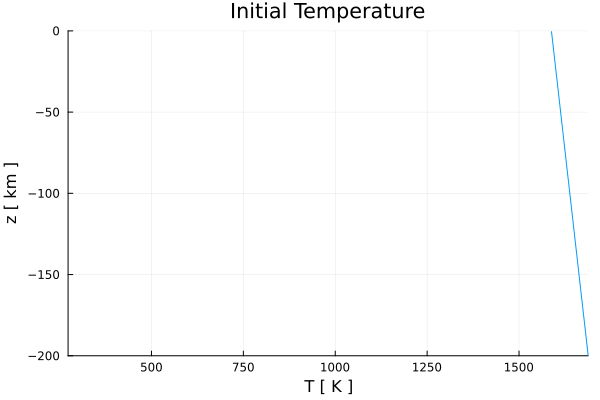
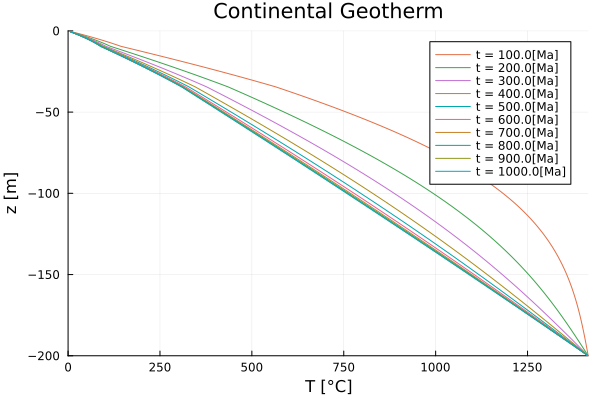
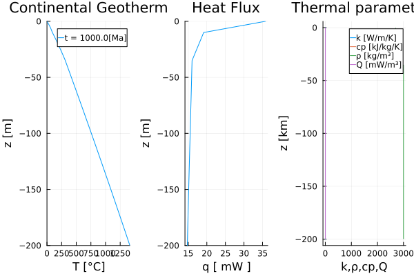

# [Continental Geotherm](https://github.com/GeoSci-FFM/GeoModBox.jl/blob/main/examples/DiffusionEquation/1D/ContinentalGeotherm_1D.jl) 

The one-dimensional continental geotherm is computed by solving the conductive heat equation using a conservative finite-difference discretization with spatially variable thermal conductivity, density, specific heat capacity, and radiogenic heat production. We use the 1-D special case solver for variable thermal properties, since the thermal conductivity varies within each lithospheric layer.

In a conservative 1-D finite difference scheme, temperature is defined at the *centroids*, while the vertical heat flux and thermal conductivity $k$ are defined at the *vertices*. This arrangement ensures that heat is conserved locally by evaluating the divergence of the heat flux across the boundaries of each control volume, which is particularly important when thermal conductivity varies spatially.

The 1-D temperature equation is given by: 

$\begin{equation}
\rho c_{p} \frac{\partial{T}}{\partial{t}} = \frac{\partial{q_y}}{\partial{y}} + \rho H,
\end{equation}$ 

where the heat flux $q_y$ is defined as:

$\begin{equation}
\left. q_{y,m} = -k_m \frac{\partial T}{\partial y}\right\vert_{m},\ \textrm{for}\ m = 1:nv, 
\end{equation}$

where $\rho$, $c_{p}$, $T$, $t$, $k$, $H$, $y$, and $nv$ represent the density [kg/m³], the specific heat capacity [J/kg/K], the temperature [K], the time [s], the thermal conductivity [W/m/K], the heat generation rate per mass [W/kg], the depth [m], and the number of vertices, respectively. 

For more details on how to discretize the equation using an explicit, forward Euler finite difference scheme see the [documentation](../../theory/DiffOneD.md).

An additional script on how to solve the 1D heat diffusion equation using the combined, general solution (choosable discretization between *explicit*, *implicit*, and *cna*) for variable thermal properties can be found [here](https://github.com/GeoSci-FFM/GeoModBox.jl/blob/main/examples/DiffusionEquation/1D/ContinentalGeotherm_1D_dc.jl).

---

First one needs to load the required packages: 

```Julia 
using Plots
using GeoModBox.HeatEquation.OneD
```

Let's start with the definition of the geometrical, numerical, and physical constants: 

```Julia 
# Constants --------------------------------------------------------- #
H           =   200e3               #   Height of the model [ m ]
yUC         =   10e3                #   Depth of the upper crust [ m ]
yLC         =   35e3                #   Depth of the lower crust [ m ]
        
nc          =   200                 #   Number of grid points
Δy          =   H/nc                #   Grid resolution

# Depth [m] ---
yc          =   LinRange(-H + Δy/2.0,0.0 - Δy/2.0,nc)     
yv          =   LinRange(-H,0,nc+1)
        
Py  =   (
    # Mantle properties ---
    ρM      =   3000,               #   Density [ kg/m^3 ]
    cpM     =   1000,               #   Heat capacity [ J/kg/K ]
    kM      =   2.3,                #   Conductivity [ W/m/K ]
    HM      =   2.3e-12,            #   Heat generation rate [W/kg]; Q = ρ*H;2.3e-12
        
    # Upper crust properties ---
    ρUC     =   2700,               #   [ kg/m^3 ]
    kUC     =   3.0,                #   [ W/m/K ]
    HUC     =   617e-12,            #   [ W/kg ]
    cpUC    =   1000,
        
    # Lower crust properties ---
    ρLC     =   2900,               #   [ kg/m^3 ]
    kLC     =   2.0,                #   [ W/m/K ]
    HLC     =   43e-12,             #   [ W/kg ]
    cpLC    =   1000,
)                
# ------------------------------------------------------------------- #
```

In the following, one needs to define the initial and boundary condition: 

1. Temperature at the surface and bottom.
2. Linearly increasing temperature profile assuming a certain adiabatic gradient and potential mantle temperature.


```Julia
# Initial Condition ------------------------------------------------- #
T   =   (
    Tpot    =   1315 + 273.15,      #   Potential temperature [ K ]
    ΔTadi   =   0.5,                #   Adiabatic temperature gradient [ K/km ]
    Ttop    =   273.15,             #   Surface temperature [ K ]
    T_ex    =   zeros(nc+2,1),    
)
T1  =   (
    Tbot    =   T.Tpot + T.ΔTadi*abs(H/1e3),    # Bottom temperature [ K ]
    T       =   T.Tpot .+ abs.(yc./1e3).*T.ΔTadi,   # Initial T-profile [ K ]
)
T   =   merge(T,T1)

Tini                =   zeros(nc,1)
Tini                .=   T.T
T.T_ex[2:end-1]     .=  T.T
# ------------------------------------------------------------------- #
```

Either *Dirichlet* or *Neumann* thermal boundary conditions can be applied at the surface and bottom. Dirichlet boundary conditions are used in this example. 

```Julia 
# Boundary conditions ----------------------------------------------- #
BC      =   (
    type    = (N=:Dirichlet, S=:Dirichlet),
    val     = (N=T.Ttop,S=T.Tbot)
)
# If Neumann boundary conditions are chosen, the following values result in the given heatflux for the given thermal conductivity k. 
# S      =   -0.03;          # c     =   -k/q -> 90 mW/m^2
# N      =   -0.0033;        # c     =   -k/q -> 10 mW/m^2
# ------------------------------------------------------------------- #
```

Now, one needs to define the multiplication factor ```fac``` of the *diffusion stability criterion* for the explicit thermal solver. This factor controls the stability criterion. If `fac` exceeds 1, the solver becomes unstable.  

```Julia
# Time stability criterion ------------------------------------------ #
fac     =   0.9                 
tmax    =   1000                 #   Lithosphere age [ Ma ]
tsca    =   60*60*24*365.25     #   Seconds per year

age     =   tmax*1e6*tsca        #   Age in seconds    
# ------------------------------------------------------------------- #
```

The initial temperature profile is plotted to verify that the initial and boundary conditions have been specified correctly.

```Julia
# Plot Initial condition -------------------------------------------- #
p = plot(T.T,yc./1e3, 
    label="", 
    xlabel="T [ K ]", ylabel="z [ km ]", 
    title="Initial Temperature",
    xlim=(T.Ttop,T.Tbot),ylim=(-H/1e3,0))
display(p)
# ------------------------------------------------------------------- #
```



**Figure 1. Initial temperature profile.**

Define the fields for the thermal properties and assign the corresponding values of each lithospheric layer (upper and lower crust, and lithospheric mantle) to them.Additionally, the maximum thermal diffusivity κ and the vertical heat-flux field q are initialized. The maximum thermal diffusivity is computed conservatively using the largest thermal conductivity and the smallest density and heat capacity. This value is used solely to determine a stable explicit time step. 

```Julia
# Setup fields ------------------------------------------------------ #
Py1     =   (
    k            =   zeros(nc+1,1),
    ρ            =   zeros(nc,1),
    cp           =   zeros(nc,1),
    H            =   zeros(nc,1),
    )
Py  = merge(Py,Py1)
    
# Upper Crust ---
Py.k[yv.>=-yUC]     .=   Py.kUC
Py.ρ[yc.>=-yUC]     .=   Py.ρUC
Py.cp[yc.>=-yUC]    .=   Py.cpUC
Py.H[yc.>=-yUC]     .=   Py.HUC    
# Lower Crust ---
Py.k[yv.>=-yLC .&& yv.<-yUC]     .=   Py.kLC
Py.ρ[yc.>=-yLC .&& yc.<-yUC]     .=   Py.ρLC
Py.cp[yc.>=-yLC .&& yc.<-yUC]    .=   Py.cpLC
Py.H[yc.>=-yLC .&& yc.<-yUC]     .=   Py.HLC   
# Mantle ---
Py.k[yv.<-yLC]  .=   Py.kM
Py.ρ[yc.<-yLC]  .=   Py.ρM
Py.cp[yc.<-yLC] .=   Py.cpM
Py.H[yc.<-yLC]  .=   Py.HM

Py2     =   (
    # Thermal diffusivity [ m^2/s ] 
    κ       =  maximum(Py.k)/minimum(Py.ρ)/minimum(Py.cp),     
    )
Py  =   merge(Py,Py2)
T2  =   (
    q   =   zeros(nc+1,1),
    )
T   =   merge(T,T2)  
# ------------------------------------------------------------------- #
```

Now, one can calculate the time stability criterion. 


```Julia
# Time stability criterion ------------------------------------------ #
Δtexp   =   Δy^2/2/Py.κ             #   Stability criterion for explicit
Δt      =   fac*Δtexp               #   total time step

nit     =   ceil(Int64,age/Δt)      #   Number of iterations    

time    =   zeros(1,nit)            #   Time array
# ------------------------------------------------------------------- #
```

With all parameters and constants defined to solve the 1-D temperature equation for each time step in a ```for``` loop. 

The temperature conservation equation is solved via the function ```ForwardEuler1D!()```, which updates the temperature profile ```T.T``` for each time step using the extended temperature field ```T.T_ex```, which include the ghost nodes. The temperature profile is plotted every 100 Myr to illustrate the evolution of the continental geotherm toward steady state.

```Julia
# Time Loop --------------------------------------------------------- #
count   =   1
for i = 1:nit
    if i > 1
        time[i]     =   time[i-1] + Δt
    elseif time[i] > age
        Δt          =   age - time[i-1]
        time[i]     =   time[i-1] + Δt
    end
    ForwardEuler1D!(T,Py,Δt,Δy,nc,BC)
    if i == nit || abs(time[i]/1e6/tsca - count*100.0) < Δt/1e6/tsca        
        println(string("i = ",i,", time = ", time[i]/1e6/tsca))                    
        p = plot!(T.T.-T.Ttop,yc./1e3, 
            label=string("t = ",ceil(time[i]/1e6/tsca),"[Ma]"), 
            xlabel="T [°C]", ylabel="z [m]", 
            title="Continental Geotherm",
            xlim=(0,T.Tbot-T.Ttop),ylim=(-H/1e3,0))
        display(p)
        count = count + 1
    end
end
# ------------------------------------------------------------------- #
```



**Figure 2. Evolution of the temperature profile with depth in 100 Ma steps.**

Since the heat flux is defined at the grid vertices, the ghost-node temperatures are first updated to satisfy the prescribed boundary conditions. The vertical heat flux is then computed using Fourier's law.

```Julia
# Calculate heat flow ----------------------------------------------- #
# South ---
T.T_ex[1]   =   (BC.type.S==:Dirichlet) * (2 * BC.val.S - T.T_ex[2]) + 
                (BC.type.S==:Neumann) * (T.T_ex[2] - BC.val.S*Δy)
# North ---
T.T_ex[end] =   (BC.type.N==:Dirichlet) * (2 * BC.val.N - T.T_ex[nc+1]) +
                (BC.type.N==:Neumann) * (T.T_ex[nc+1] + BC.val.N*Δy)
if size(Py.k,1)==1
    for j=1:nc+1
        T.q[j]  =   -Py.k * 
            (T.T_ex[j+1] - T.T_ex[j])/Δy
    end    
else
    for j=1:nc+1
        T.q[j]  =   -Py.k[j] * 
            (T.T_ex[j+1] - T.T_ex[j])/Δy
    end
end
# ------------------------------------------------------------------- #
```

Finally, the numerical temperature profile, vertical heat-flux profile, and thermal properties are plotted for the final simulation time. 

```Julia
# Plot profile if requested ----------------------------------------- #
q = plot(T.T.-T.Ttop,yc./1e3, 
        label=string("t = ",ceil(maximum(time)/1e6/tsca),"[Ma]"), 
        xlabel="T [°C]", ylabel="z [m]",
        title="Continental Geotherm",
        xlim=(0,T.Tbot-T.Ttop),ylim=(-H/1e3,0),
        layout=(1,3),subplot=1)    
q = plot!(T.q.*1e3,yv./1e3, 
        label="", 
        xlabel="q [ mW ]", ylabel="z [m]", 
        title="Heat Flux",
        ylim=(-H/1e3,0),
        subplot=2) 
q = plot!(Py.k,yv./1e3,label="k [W/m/K]",
        xlabel="k,ρ,cp,Q", ylabel="z [km]",
        title="Thermal properties",
        subplot=3)       
q = plot!(Py.cp./1e3,yc./1e3,label="cp [kJ/kg/K]",
        subplot=3)
q = plot!(Py.ρ,yc./1e3,label="ρ [kg/m³]",                
        subplot=3)
q = plot!(Py.H.*(Py.ρ./1e3),yc./1e3,label="Q [mW/m³]",
        subplot=3)
display(q)
# Save figures ---
savefig(q,"./examples/DiffusionEquation/1D/Results/ContinentalGeotherm_1D.png")
savefig(p,"./examples/DiffusionEquation/1D/Results/ContinentalGeotherm_1D_evolve.png")
# ======================================================================= #
```



**Figure 3. Final temperature, heat flux, and thermal parameter depth profiles.**