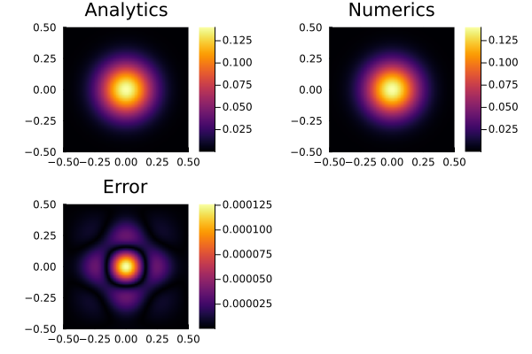

# [Diffusion Equation (Forward Euler)](https://github.com/GeoSci-FFM/GeoModBox.jl/blob/main/examples/DiffusionEquation/2D/ForwardEuler.jl)

This example demonstrates the numerical solution of the conductive part of the two-dimensional temperature conservation equation using the explicit **Forward Euler** method. The example introduces

- the application of the expanded temperature field and boundary conditions,
- the implementation of the analytical solution provided by `ExactFieldSolutions.jl`, and
- the application of the Forward Euler method.

The example calculates the transient diffusion of an initially Gaussian two-dimensional temperature distribution. The peak temperature $T_0$ of the Gaussian anomaly is located at the center of the model domain and is characterized by a width $\sigma$.

The transient diffusion of the temperature anomaly is governed by the thermal diffusivity $K$. In the numerical model, the thermal conductivity is prescribed at the cell faces. Since the density and heat capacity are both set to unity, the thermal conductivity and thermal diffusivity have identical numerical values in this example.

The numerical solution is compared with the corresponding analytical solution. The analytical solution, the numerical solution, and the corresponding absolute error are visualized every `nout` time steps.

---

First, load the required packages:

```julia
using GeoModBox.HeatEquation.TwoD
using Plots
using ExactFieldSolutions
```

Next, define the computational domain and its spatial discretization.

```julia
# Spatial domain
xlim = (min=-1/2, max=1/2)
ylim = (min=-1/2, max=1/2)
nc   = (x=100, y=100)
nv   = (x=nc.x+1, y=nc.y+1)
Δ    = (x=(xlim.max-xlim.min)/nc.x, y=(ylim.max-ylim.min)/nc.y)

x = (
    c = LinRange(xlim.min + Δ.x/2, xlim.max - Δ.x/2, nc.x),
    v = LinRange(xlim.min, xlim.max, nv.x)
)

y = (
    c = LinRange(ylim.min + Δ.y/2, ylim.max - Δ.y/2, nc.y),
    v = LinRange(ylim.min, ylim.max, nv.y)
)
```

Now define the time-stepping parameters.

```julia
# Time domain
nt   = 400
t    = 0.0
nout = 10
```

The following arrays store the temperature field, the expanded temperature field including ghost nodes, the analytical reference solution, the temperature gradients, the conductive heat fluxes, and the material properties.

```julia
# Primitive variables
T_ex = zeros(nc.x+2, nc.y+2)
T    = zeros(nc...)
Te   = zeros(nc...)

# Derived fields
∂T = (
    ∂x = zeros(nv.x, nc.y),
    ∂y = zeros(nc.x, nv.y)
)

q = (
    x = zeros(nv.x, nc.y),
    y = zeros(nc.x, nv.y)
)

# Material parameters
ρ  = zeros(nc...)
Cp = zeros(nc...)

k = (
    x = zeros(nv.x, nc.y),
    y = zeros(nc.x, nv.y)
)
```

The boundary conditions are stored in the named tuple `BC`, which contains the boundary-condition type (*Dirichlet* or *Neumann*) together with the prescribed value for each side of the computational domain.

```julia
# Boundary conditions
BC = (
    type = (
        W = :Dirichlet,
        E = :Dirichlet,
        S = :Dirichlet,
        N = :Dirichlet
    ),
    val = (
        W = zeros(nc.y),
        E = zeros(nc.y),
        S = zeros(nc.x),
        N = zeros(nc.x)
    )
)
```

The initial temperature field is initialized from the analytical solution at $t=0$. For simplicity, the density and heat capacity are both set to unity, such that the thermal conductivity and thermal diffusivity have identical numerical values.

The time step is selected according to the explicit stability criterion for the two-dimensional Forward Euler method.

```julia
# Initial conditions
AnalyticalSolution2D!(T, x.c, y.c, t, (T0=1.0, K=1e-6, σ=0.1))

@. k.x = 1e-6
@. k.y = 1e-6
@. ρ   = 1.0
@. Cp  = 1.0

κmax = max(maximum(k.x), maximum(k.y)) /
       (minimum(ρ) * minimum(Cp))

Δt = 1 / (2.05 * κmax * (1/Δ.x^2 + 1/Δ.y^2))
```

The simulation proceeds by advancing the temperature field in time. At the beginning of each time step, the Dirichlet boundary values are updated from the analytical solution at the current time level. The centroid temperatures are then copied into the expanded temperature field, after which the ghost-node temperatures are updated according to the prescribed boundary conditions.

Once the expanded temperature field has been constructed, temperature gradients are evaluated at the cell faces using central finite differences. Fourier's law is then used to compute the conductive heat fluxes, whose divergence is evaluated at the cell centroids. Finally, the temperature field is advanced explicitly using the Forward Euler method.

The expanded temperature field contains one layer of ghost nodes surrounding the physical domain. These ghost nodes allow the same finite-difference operators to be applied throughout the computational domain, including cells adjacent to the model boundaries.

For more details on the finite-difference discretization of the diffusion equation, please refer to the [theory section](../../theory/DiffMain.md).

```julia
# Time integration
@views for it = 1:nt

    # Exact solution on the model boundaries
    BoundaryConditions2D!(BC, x.c, y.c, t, (T0=1.0, K=1e-6, σ=0.1))

    # Copy centroid temperatures to expanded grid
    @. T_ex[2:end-1,2:end-1] = T

    # Update ghost nodes
    @. T_ex[1,2:end-1] =
        (BC.type.W == :Dirichlet) *
        (2*BC.val.W - T_ex[2,2:end-1])

    @. T_ex[end,2:end-1] =
        (BC.type.E == :Dirichlet) *
        (2*BC.val.E - T_ex[end-1,2:end-1])

    @. T_ex[2:end-1,1] =
        (BC.type.S == :Dirichlet) *
        (2*BC.val.S - T_ex[2:end-1,2])

    @. T_ex[2:end-1,end] =
        (BC.type.N == :Dirichlet) *
        (2*BC.val.N - T_ex[2:end-1,end-1])

    # Temperature gradients
    @. ∂T.∂x =
        (T_ex[2:end,2:end-1] -
         T_ex[1:end-1,2:end-1]) / Δ.x

    @. ∂T.∂y =
        (T_ex[2:end-1,2:end] -
         T_ex[2:end-1,1:end-1]) / Δ.y

    # Conductive heat fluxes
    @. q.x = -k.x * ∂T.∂x
    @. q.y = -k.y * ∂T.∂y

    # Forward Euler update
    @. T -= Δt / (ρ * Cp) * (
        (q.x[2:end,:] - q.x[1:end-1,:]) / Δ.x +
        (q.y[:,2:end] - q.y[:,1:end-1]) / Δ.y
    )

    # Advance time
    t += Δt

    # Analytical solution on the cell centroids
    AnalyticalSolution2D!(Te, x.c, y.c, t, (T0=1.0, K=1e-6, σ=0.1))

    # Visualisation
    if mod(it, nout) == 0
        p1 = plot(aspect_ratio=1, xlims=(xlim...,), ylims=(ylim...,))
        p1 = heatmap!(x.c, y.c, Te', title="Analytical")

        p2 = plot(aspect_ratio=1, xlims=(xlim...,), ylims=(ylim...,))
        p2 = heatmap!(x.c, y.c, T', title="Numerics")

        p3 = plot(aspect_ratio=1, xlims=(xlim...,), ylims=(ylim...,))
        p3 = heatmap!(x.c, y.c, abs.(T .- Te)', title="Error")

        display(plot(p1, p2, p3, layout=(2,2)))
    end

end
```



**Figure 1.** Comparison between the analytical solution, the numerical solution obtained using the Forward Euler method, and the corresponding absolute error.