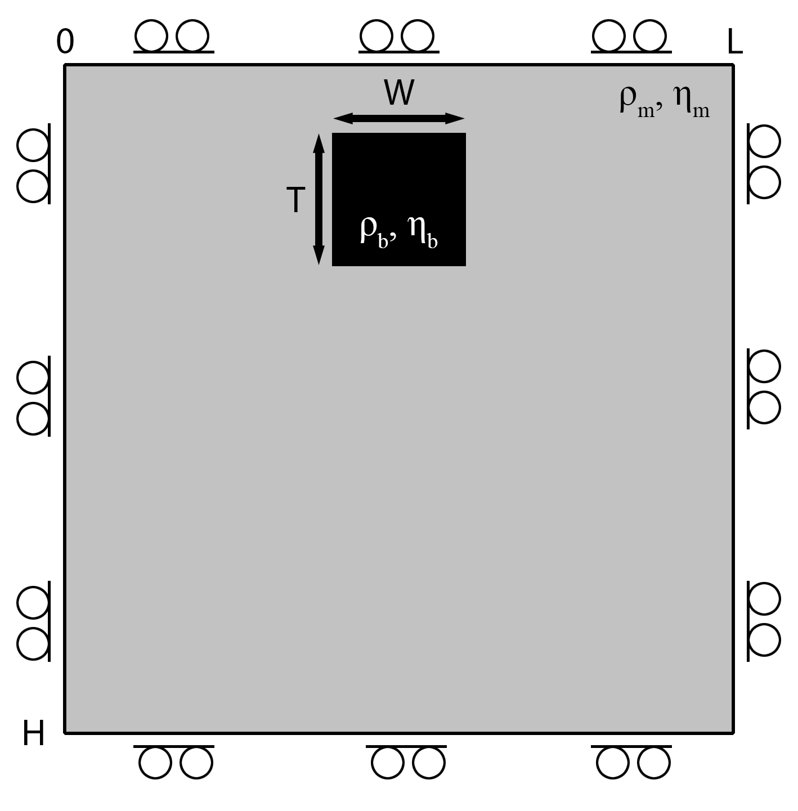

# [Falling Block Benchmark](https://github.com/GeoSci-FFM/GeoModBox.jl/blob/main/examples/StokesEquation/2D/FallingBlockBenchmark.jl)

The falling block benchmark is a well-established test for assessing the accuracy of the momentum solver and the efficiency of the advection scheme, particularly under strong viscosity and density contrasts. The model setup (Figure 1) is defined by a rectangular block with a certain viscosity and density within a matrix of a different viscosity and density. Due to the density contrast, the block sinks. If the block is less viscous than the surrounding matrix, it deforms during descent. Conversely, highly viscous blocks remain largely undeformed as they sink. 



**Figure 1. Falling Block Setup.** 

The purpose of this benchmark is twofold: 

1. Accuracy of the variable viscosity momentum solver. Solving the momentum equation for the initial state, one can calculate the sinking velocity of the block, which follows a characteristic trend as a function of the viscosity contrast between the block and the matrix. 

2. Accuracy of the advection scheme. Assuming a time-dependent problem, one can test the efficiency of the advection scheme. Here, all four different advection schemes can be choosen: 
    - Upwind
    - Staggered leapfrog
    - Semilagrangian 
    - Tracers

>**Note:** In the current state, the staggered leapfrog and semilagrangian scheme are highly ineffective to advect the density and viscosity simultaneously. Viscosity overshoots—arising from contrasts of up to six orders of magnitude—can lead to unphysical negative viscosities at the centroids. Thus, the solution of the momemtum equation is not correct anymore. This issue may be mitigated by advecting phase IDs only, then assigning viscosity and density based on the interpolated phase distribution. However, this approach requires either rounding the phase field to the nearest integer or applying weighted averaging to determine physical properties. 

This example solves the falling block benchmark across a viscosity contrast range spanning six orders of magnitude (from $10^{-6}$ to $10^6$). 
The simulation yields either the block’s initial sinking velocity (for steady-state problems), or its final position (for time-dependent problems with a viscosity ratio $\eta_r \geq 0$). For additional information on the benchmark, please refer to the [exercise](https://github.com/GeoSci-FFM/GeoModBox.jl/blob/main/exercises/09_2D_Falling_Block.ipynb)

Again, the output of the script depends on the definition of the parameters `save_fig`. 

- `save_fig = 0` - Output every plot for each time step and model (not recommended!)
- `save_fig = 1` - Save the animations for each model and store the final position (if the issue is steady state, this stores the sinking velocity plot) 
- `save_fig = -1` - Only store the final position for a time-dependent problem 

---

Let's first load the required modules. 

```Julia
using Plots
using ExtendableSparse
using GeoModBox.InitialCondition, GeoModBox.MomentumEquation.TwoD
using GeoModBox.AdvectionEquation.TwoD
using GeoModBox.Tracers.TwoD
using Base.Threads
using Printf
```

In the following, one can define the range of the viscosity ratios to be calculated and the maximum time is set for each model assuming a viscosity ratio from -6 to 6 orders of magnitude. Additionally, one can define it the problem should be steady-state or time-dependent. 

```Julia
# Make it time-dependent (1) or steady-state (0)
td      =   0   
# Benchmark parameter =============================================== #
ηᵣ      =   LinRange(-6.0,6.0,13)       #   Viscosity ratio
sv      =   zeros(length(ηᵣ))           #   Sinking Velocity
tmax    =   [7.115094, 7.114844, 7.256534, 7.377311, 7.738412, 
                7.673613, 9.886, 15.446, 19.623, 20.569, 20.569,
                20.569, 20.589]
# ------------------------------------------------------------------- #
```

In the following, one can define the advection scheme and the initial configuration. For more details on how the initial condition is implement in `GeoModBox.jl`, please refere to the [documentaion](../Ini.md).

```Julia
# Define Numerical Scheme =========================================== #
# Advection ---
#   1) upwind, 2) slf, 3) semilag, 4) tracers
#   Attention: Tracers are the only method that work well.
FD          =   (Method     = (Adv=:semilag,),)
# ------------------------------------------------------------------- #
# Define Initial Condition ========================================== #
# Density --- 
#   1) block
Ini         =   (p=:block,) 
# ------------------------------------------------------------------- #
```

Now, one can set the directory to safe the animaion to and some plotting parameters. 

```Julia
# Animation and Plot Settings ======================================= #
path        =   string("./examples/StokesEquation/2D/Results/")
save_fig    =   1
p2          =   plot(0,0,layout=(2,3))
count       =   Int64(0)
# ------------------------------------------------------------------- #
# Plot Settings ===================================================== #
Pl  =   (
    qinc    =   1,
    qsc     =   100*(60*60*24*365.25)*5e1
)
# ------------------------------------------------------------------- #
```

In the following, one defines the model geometry and the numerical grid parameters. 

```Julia
# Geometry ========================================================== #
M       =   (
    xmin    =   0.0,
    xmax    =   500.0e3,    # [ m ]
    ymin    =   -500.0e3,   # [ m ]
    ymax    =   0.0,
)
# ------------------------------------------------------------------- #
# Grid ============================================================== #
NC      =   (
    x   =   50, 
    y   =   50,
)
NV      =   (
    x   =   NC.x + 1,
    y   =   NC.y + 1,
)
Δ       =   (
    x   =   (M.xmax - M.xmin)/NC.x,
    y   =   (M.ymax - M.ymin)/NC.y,
)
x       =   (
    c   =   LinRange(M.xmin+Δ.x/2,M.xmax-Δ.x/2,NC.x),
    ce  =   LinRange(M.xmin - Δ.x/2.0, M.xmax + Δ.x/2.0, NC.x+2),
    v   =   LinRange(M.xmin,M.xmax,NV.x),
)
y       =   (
    c   =   LinRange(M.ymin+Δ.y/2,M.ymax-Δ.y/2,NC.y),
    ce  =   LinRange(M.ymin - Δ.x/2.0, M.ymax + Δ.x/2.0, NC.y+2),
    v   =   LinRange(M.ymin,M.ymax,NV.y),
)
x1      =   (
    c2d     =   x.c .+ 0*y.c',
    v2d     =   x.v .+ 0*y.v', 
    vx2d    =   x.v .+ 0*y.ce',
    vy2d    =   x.ce .+ 0*y.v',
)
x   =   merge(x,x1)
y1      =   (
    c2d     =   0*x.c .+ y.c',
    v2d     =   0*x.v .+ y.v',
    vx2d    =   0*x.v .+ y.ce',
    vy2d    =   0*x.ce .+ y.v',
)
y   =   merge(y,y1)
# ------------------------------------------------------------------- #
```

Now, one can set the physical constants of the problem. The arrays `ρ` and `phase` are used to advect the material. For more information on how this is implemented, please refer to the [documentation](../AdvectMain.md). Additionally, the velocity boundary conditions are set. 

```Julia
# Physics =========================================================== #
g       =   9.81                #   Gravitational Acceleration

η₀      =   1.0e21              #   Background Viscosity
   
ρ₀      =   3200.0              #   Background density
ρ₁      =   3300.0              #   Block density
ρ       =   [ρ₀,ρ₁]             #   Density for phases

phase   =   [0,1]               #   Phase ID
# ------------------------------------------------------------------- #
# Boundary Conditions =============================================== #
VBC     =   (
    type    =   (E=:freeslip,W=:freeslip,S=:freeslip,N=:freeslip),
    val     =   (E=zeros(NV.y),W=zeros(NV.y),S=zeros(NV.x),N=zeros(NV.x)),
)
# ------------------------------------------------------------------- #
```

Now, one can start the loop of the different viscosity ratio. 

```Julia
for mn in eachindex(ηᵣ)     #   Loop over ηᵣ
```

To store the animation of each model, the name of the gif file is defined in the following. 

```Julia
    anim        =   Plots.Animation(path, String[] )
    filename    =   string("Falling_",Ini.p,"_ηr_",round(ηᵣ[mn]),
                        "_",FD.Method.Adv)
    # --------------------------------------------------------------- #
```

Now, one can set the viscosity for the block and the viscosity array `η` for the advection scheme. 

```Julia
    # Physics ======================================================= #
    η₁      =   η₀ * 10^(ηᵣ[mn])    #   Block Viscosity
    η       =   [η₀,η₁]             #   Viscosity for phases
    @show η
    # --------------------------------------------------------------- #
```

In the following, the data arrays are initialized. 

```Julia
    # Allocation ==================================================== #
    D   =   (
        vx      =   zeros(Float64,NV.x,NC.y+2),
        vy      =   zeros(Float64,NC.x+2,NV.y),
        Pt      =   zeros(Float64,NC...),
        pv      =   zeros(Float64,NV...),
        p       =   zeros(Float64,NC...),
        p_ex    =   zeros(Float64,NC.x+2,NC.y+2),
        ρ       =   zeros(Float64,NC...),
        ρ_ex    =   zeros(Float64,NC.x+2,NC.y+2),
        ρ_exo   =   zeros(Float64,NC.x+2,NC.y+2),
        vxc     =   zeros(Float64,NC...),
        vyc     =   zeros(Float64,NC...),
        vc      =   zeros(Float64,NC...),
        wt      =   zeros(Float64,(NC.x,NC.y)),
        wtv     =   zeros(Float64,(NV.x,NV.y)),
        ηc      =   zeros(Float64,NC...),
        ηv      =   zeros(Float64,NV...),
        η_ex    =   zeros(Float64,NC.x+2,NC.y+2),
        η_exo   =   zeros(Float64,NC.x+2,NC.y+2),
    )
    # --------------------------------------------------------------- #
```

Now, one needs to initialize the time parameters. 

```Julia
    # Time ========================================================== #
    T   =   ( 
        tmax    =   [0.0],  
        Δfac    =   1.0,    # Courant time factor, i.e. dtfac*dt_courant
        Δ       =   [0.0],
        time    =   [0.0,0.0],
    )
    T.tmax[1]   =   tmax[mn] * 1e6 * (60*60*24*365.25)   # [ s ] 
    if td == 0
        nt = 1
    else
        nt  =   9999
    end
    # --------------------------------------------------------------- #
```

In case tracers are used, the tracers are initialized in the following. Alternatively, the initial density and viscosity are defined on the extended grid using the phase distribution. For more details on the initial conditions, please refer to the [documentation](../Ini.md). 

```Julia
    # Tracer Advection ============================================== #
    if FD.Method.Adv==:tracers 
        # Tracer Initialization ---
        nmx,nmy     =   3,3
        noise       =   0
        nmark       =   nmx*nmy*NC.x*NC.y
        Aparam      =   :phase
        MPC         =   (
            c       =   zeros(Float64,(NC.x,NC.y)),
            v       =   zeros(Float64,(NV.x,NV.y)),
            th      =   zeros(Float64,(nthreads(),NC.x,NC.y)),
            thv     =   zeros(Float64,(nthreads(),NV.x,NV.y)),
        )
        MPC1        = (
            PG_th   =   [similar(D.ρ) for _ = 1:nthreads()],    # per thread
            PV_th   =   [similar(D.ηv) for _ = 1:nthreads()],   # per thread
            wt_th   =   [similar(D.wt) for _ = 1:nthreads()],   # per thread
            wtv_th  =   [similar(D.wtv) for _ = 1:nthreads()],  # per thread
        )
        MPC     =   merge(MPC,MPC1)
        Ma      =   IniTracer2D(Aparam,nmx,nmy,Δ,M,NC,noise,Ini.p,phase)
        # RK4 weights ---
        rkw     =   1.0/6.0*[1.0 2.0 2.0 1.0]   # for averaging
        rkv     =   1.0/2.0*[1.0 1.0 2.0 2.0]   # for time stepping
        # Count marker per cell ---
        CountMPC(Ma,nmark,MPC,M,x,y,Δ,NC,NV,1)
        # Interpolate from markers to cell ---
        Markers2Cells(Ma,nmark,MPC.PG_th,D.ρ,MPC.wt_th,D.wt,x,y,Δ,Aparam,ρ)
        Markers2Cells(Ma,nmark,MPC.PG_th,D.p,MPC.wt_th,D.wt,x,y,Δ,Aparam,phase)
        Markers2Vertices(Ma,nmark,MPC.PV_th,D.ηv,MPC.wtv_th,D.wtv,x,y,Δ,Aparam,η)
        @. D.ηc     =   0.25 * (D.ηv[1:end-1,1:end-1] + 
                                D.ηv[2:end-0,1:end-1] + 
                                D.ηv[1:end-1,2:end-0] + 
                                D.ηv[2:end-0,2:end-0])
    else
        # ----------------------------------------------------------- #
        # Initial Condition ========================================= #
        IniPhase!(Ini.p,D,M,x,y,NC;phase)
        for i in eachindex(phase)
            D.ρ[D.p.==phase[i]] .= ρ[i]
            D.ηc[D.p.==phase[i]] .= η[i] 
        end
        # Density ---
        D.ρ_ex[2:end-1,2:end-1]     .=  D.ρ
        D.ρ_ex[1,:]     .=  D.ρ_ex[2,:]
        D.ρ_ex[end,:]   .=  D.ρ_ex[end-1,:]
        D.ρ_ex[:,1]     .=  D.ρ_ex[:,2]
        D.ρ_ex[:,end]   .=  D.ρ_ex[:,end-1]
        D.ρ_exo         .=  D.ρ_ex
        # Viscosity ---
        # --- Centroids -
        D.η_ex[2:end-1,2:end-1]     .=  D.ηc
        D.η_ex[1,:]     .=  D.η_ex[2,:]
        D.η_ex[end,:]   .=  D.η_ex[end-1,:]
        D.η_ex[:,1]     .=  D.η_ex[:,2]
        D.η_ex[:,end]   .=  D.η_ex[:,end-1]
        D.η_exo         .=  D.η_ex
        # --- Vertices -
        @. D.ηv     =   0.25 * (D.η_ex[1:end-1,1:end-1] + 
                                D.η_ex[2:end-0,1:end-1] + 
                                D.η_ex[1:end-1,2:end-0] + 
                                D.η_ex[2:end-0,2:end-0])
    end
    # --------------------------------------------------------------- #
```

Now, one needs to define the parameters for the linear system of equations of the momentum equation. 

```Julia
    # System of Equations =========================================== #
    # Numbering, without ghost nodes! ---
    off    = [  NV.x*NC.y,                          # vx
                NV.x*NC.y + NC.x*NV.y,              # vy
                NV.x*NC.y + NC.x*NV.y + NC.x*NC.y]  # Pt

    Num    =    (
        Vx  =   reshape(1:NV.x*NC.y, NV.x, NC.y), 
        Vy  =   reshape(off[1]+1:off[1]+NC.x*NV.y, NC.x, NV.y), 
        Pt  =   reshape(off[2]+1:off[2]+NC.x*NC.y,NC...),
    )
    # --------------------------------------------------------------- #
```

Let's start the time loop! 

```Julia
    # Time Loop ===================================================== #
    for it = 1:nt
```

First, the unknown and right-hand vector for the system of equations are defined. 

```Julia
        χ       =   zeros(maximum(Num.Pt))      #   Unknown Vector
        rhs     =   zeros(maximum(Num.Pt))      #   Right-hand Side
        # Update Time ---
        T.time[1]   =   T.time[2] 
        @printf("Time step: #%04d, Time [Myr]: %04e\n ",it,
                    T.time[1]/(60*60*24*365.25)/1.0e6)
```

Now, one can solve the system of equations, for example, using the direct method. For more information on how this is solved, please refer to the [documentation](../MomentumMain.md). To advect the material using the first three advection scheme, the centroid velocity is calculated. 

```Julia
        # Momentum Equation =======
        # Update K ---
        K       =   Assembly( NC, NV, Δ, D.ηc, D.ηv, VBC, Num )
        # Update RHS ---
        rhs     =   updaterhs( NC, NV, Δ, D.ηc, D.ηv, D.ρ, g, VBC, Num )
        # Solve System of Equations ---
        χ       =   K \ rhs
        # Update Unknown Variables ---
        D.vx[:,2:end-1]     .=  χ[Num.Vx]
        D.vy[2:end-1,:]     .=  χ[Num.Vy]
        D.Pt                .=  χ[Num.Pt]
        # ======
        # Get the velocity on the centroids ---
        for i = 1:NC.x
            for j = 1:NC.y
                D.vxc[i,j]  = (D.vx[i,j+1] + D.vx[i+1,j+1])/2
                D.vyc[i,j]  = (D.vy[i+1,j] + D.vy[i+1,j+1])/2
            end
        end
        @. D.vc        = sqrt(D.vxc^2 + D.vyc^2)
        # ---
        @show(maximum(D.vc))
        @show(minimum(D.Pt))
        @show(maximum(D.Pt))
        if it == 1
            sv[mn]  =   maximum(D.vc)
        end
        # ---
        if T.time[2] >= T.tmax[1]
            it = nt
        end
        # ---
```

In the following, the figures for each time step are ploted. The style of the plot varies depending on the advection scheme. 

```Julia
        if mod(it,2) == 0 || it == nt || it == 1
            if FD.Method.Adv==:tracers
                p = heatmap(x.c./1e3,y.c./1e3,D.p',color=:inferno,
                            xlabel="x[km]",ylabel="y[km]",colorbar=false,
                            title="Phase_c",
                            aspect_ratio=:equal,xlims=(M.xmin/1e3, M.xmax/1e3), 
                            ylims=(M.ymin/1e3, M.ymax/1e3),
                            layout=(2,2),subplot=1)
            else
                p = heatmap(x.v./1e3,y.v./1e3,log10.(abs.(D.ηv')),color=reverse(cgrad(:roma)),
                            xlabel="x[km]",ylabel="y[km]",title="η_v",
                            clims=(15,27),
                            aspect_ratio=:equal,xlims=(M.xmin/1e3, M.xmax/1e3), 
                            ylims=(M.ymin/1e3, M.ymax/1e3),colorbar=true,
                            layout=(2,2),subplot=1)
            end
            if FD.Method.Adv==:tracers
                scatter!(p,Ma.x[1:Pl.qinc:end]./1e3,Ma.y[1:Pl.qinc:end]./1e3,
                            ms=1,ma=0.5,mc=Ma.phase[1:Pl.qinc:end],markerstrokewidth=0.0,
                            xlabel="x[km]",ylabel="y[km]",colorbar=false,
                            title="tracers",label="",
                            aspect_ratio=:equal,xlims=(M.xmin/1e3, M.xmax/1e3), 
                            ylims=(M.ymin/1e3, M.ymax/1e3),
                            layout=(2,2),subplot=2)
            else
                heatmap!(p,x.c./1e3,y.c./1e3,D.ρ',color=:inferno,
                            xlabel="x[km]",ylabel="y[km]",colorbar=false,
                            title="Density",
                            aspect_ratio=:equal,xlims=(M.xmin/1e3, M.xmax/1e3), 
                            ylims=(M.ymin/1e3, M.ymax/1e3),
                            layout=(2,2),subplot=2)
            end
            heatmap!(p,x.c./1e3,y.c./1e3,D.vc',
                        xlabel="x[km]",ylabel="y[km]",colorbar=false,
                        title="V_c",color=cgrad(:batlow),
                        aspect_ratio=:equal,xlims=(M.xmin/1e3, M.xmax/1e3),
                        ylims=(M.ymin/1e3, M.ymax/1e3),
                        layout=(2,2),subplot=4)
            quiver!(p,x.c2d[1:Pl.qinc:end,1:Pl.qinc:end]./1e3,
                        y.c2d[1:Pl.qinc:end,1:Pl.qinc:end]./1e3,
                        quiver=(D.vxc[1:Pl.qinc:end,1:Pl.qinc:end].*Pl.qsc,
                                D.vyc[1:Pl.qinc:end,1:Pl.qinc:end].*Pl.qsc),        
                        la=0.5,color="white",layout=(1,3),subplot=3)
            heatmap!(p,x.c./1e3,y.c./1e3,log10.(abs.(D.ηc')),color=reverse(cgrad(:roma)),
                        xlabel="x[km]",ylabel="y[km]",title="η_c",
                        clims=(15,27),
                        aspect_ratio=:equal,xlims=(M.xmin/1e3, M.xmax/1e3), 
                        ylims=(M.ymin/1e3, M.ymax/1e3),colorbar=true,
                        layout=(2,2),subplot=3)
            if save_fig == 1
                Plots.frame(anim)
            elseif save_fig == 0
                display(p)
            end
        end
        if T.time[2] >= T.tmax[1]
            break
        end
```

Now, one needs to calculate the time step to advect the material.

```Julia
        # Calculate Time Stepping ---
        T.Δ[1]      =   T.Δfac * minimum((Δ.x,Δ.y)) / 
                            (sqrt(maximum(abs.(D.vx))^2 + maximum(abs.(D.vy))^2))
        # ---
        @printf("\n")
        # Calculate Time ---
        T.time[2]   =   T.time[1] + T.Δ[1]
        if T.time[2] > T.tmax[1] 
            T.Δ[1]      =   T.tmax[1] - T.time[1]
            T.time[2]   =   T.time[1] + T.Δ[1]
        end
```

In the following the advection is conducted. For more details on this, please refer to the [documentation](../AdvectMain.md).

```Julia
        # Advection ======
        if FD.Method.Adv==:upwind
            upwindc2D!(D.ρ,D.ρ_ex,D.vxc,D.vyc,NC,T.Δ[1],Δ.x,Δ.y)
            upwindc2D!(D.ηc,D.η_ex,D.vxc,D.vyc,NC,T.Δ[1],Δ.x,Δ.y)
        elseif FD.Method.Adv==:slf
            slfc2D!(D.ρ,D.ρ_ex,D.ρ_exo,D.vxc,D.vyc,NC,T.Δ[1],Δ.x,Δ.y)
            slfc2D!(D.ηc,D.η_ex,D.η_exo,D.vxc,D.vyc,NC,T.Δ[1],Δ.x,Δ.y)
        elseif FD.Method.Adv==:semilag
            semilagc2D!(D.ρ,D.ρ_ex,D.vxc,D.vyc,[],[],x,y,T.Δ[1])
            semilagc2D!(D.ηc,D.η_ex,D.vxc,D.vyc,[],[],x,y,T.Δ[1])
        elseif FD.Method.Adv==:tracers
            # Advect tracers ---
            @printf("Running on %d thread(s)\n", nthreads())  
            AdvectTracer2D(Ma,nmark,D,x,y,T.Δ[1],Δ,NC,rkw,rkv,1)
            CountMPC(Ma,nmark,MPC,M,x,y,Δ,NC,NV,it)
            # Interpolate phase from tracers to grid ---
            Markers2Cells(Ma,nmark,MPC.PG_th,D.ρ,MPC.wt_th,D.wt,x,y,Δ,Aparam,ρ)
            Markers2Cells(Ma,nmark,MPC.PG_th,D.p,MPC.wt_th,D.wt,x,y,Δ,Aparam,phase)
            Markers2Vertices(Ma,nmark,MPC.PV_th,D.ηv,MPC.wtv_th,D.wtv,x,y,Δ,Aparam,η)
            @. D.ηc     =   0.25 * (D.ηv[1:end-1,1:end-1] + 
                                D.ηv[2:end-0,1:end-1] + 
                                D.ηv[1:end-1,2:end-0] + 
                                D.ηv[2:end-0,2:end-0])
        end
        if FD.Method.Adv!=:tracers
            # --- Vertices -
            @. D.ηv     =   0.25 * (D.η_ex[1:end-1,1:end-1] + 
                                    D.η_ex[2:end-0,1:end-1] + 
                                    D.η_ex[1:end-1,2:end-0] + 
                                    D.η_ex[2:end-0,2:end-0])
        end
        @printf("\n")
    end     # End Time Loop
```

If requested, the final position of the blocks are plotted and stored in the following. 

```Julia
    if ηᵣ[mn] == 0.0 || ηᵣ[mn] == 1.0 || ηᵣ[mn] == 2.0 || 
                    ηᵣ[mn] == 3.0 || ηᵣ[mn] == 4.0 || ηᵣ[mn] == 6.0
        count = count + 1
        if FD.Method.Adv==:tracers
            p2  =   scatter!(p2,Ma.x[1:Pl.qinc:end]./1e3,Ma.y[1:Pl.qinc:end]./1e3,
                ms=1,ma=0.5,mc=Ma.phase[1:Pl.qinc:end],markerstrokewidth=0.0,
                xlabel="x[km]",ylabel="y[km]",colorbar=false,
                title=string("tracers, η_r = ",ηᵣ[mn]),label="",
                aspect_ratio=:equal,xlims=(M.xmin/1e3, M.xmax/1e3), 
                ylims=(M.ymin/1e3, M.ymax/1e3),
                layout=(2,3),subplot=count)
        else
            p2 = heatmap!(p2,x.c./1e3,y.c./1e3,D.ρ',color=:inferno,
                xlabel="x[km]",ylabel="y[km]",colorbar=false,
                title="Phase_c",
                aspect_ratio=:equal,xlims=(M.xmin/1e3, M.xmax/1e3), 
                ylims=(M.ymin/1e3, M.ymax/1e3),
                layout=(2,3),subplot=count)
        end
    end
    # Save Animation ---
    if save_fig == 1
        if td == 1
            # Write the frames to a GIF file
            Plots.gif(anim, string( path, filename, ".gif" ), fps = 15)
            foreach(rm, filter(startswith(string(path,"00")), readdir(path,join=true)))
        end
    end
end # End ηᵣ Loop
```

In case the problem is set to be steady-state, the sinking velocity is plotted. If the problem is time-dependent the final position is stored. 

```Julia
if td == 0
    q = scatter(ηᵣ,sv,marker=4,
                    ylabel="block velocity [m/s]",
                    xlabel="log_{10}(η_{block}/η_{medium})",
                    title="Sinking Velocity",
                    label=false,
                    ylims=(0.2e-9,1.5e-9),
                    xlims=(-6,6))
    if save_fig == 1
        savefig(q,string("./examples/StokesEquation/2D/Results/FallingBlock_SinkingVeloc",
                            "_",FD.Method.Adv,".png"))
        foreach(rm, filter(startswith(string(path,"00")), readdir(path,join=true)))
    else
        display(q)
    end
else
    if save_fig == -1 ||save_fig == 1
        savefig(p2,string("./examples/StokesEquation/2D/Results/FallingBlock_FinalStage",
                            "_",FD.Method.Adv,".png"))
    else
        display(p2)
    end
end
```