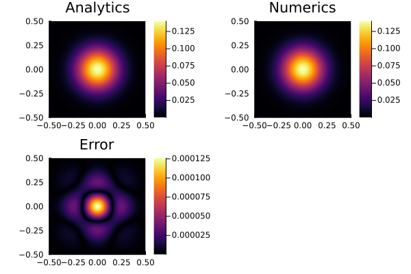

# [Diffusion Equation (Forward Euler)](https://github.com/GeoSci-FFM/GeoModBox.jl/blob/main/examples/DiffusionEquation/2D/ForwardEuler.jl)

This is a straight forward example to solve the conductive part of the 2-D temperature conservation equation using the forward euler method. The focus lies on the

- application of the expanded temperature field and boundary conditions,
- implementation of the analytical solution (```ExactFieldSolution.jl```), and
- application of the forward Euler method. 

The example calculates the numerical solution of a transient diffusion of an initial, Gaussian 2-D temperature distribution. The peak $T0$ of the Gaussian anomaly is located in the center of the model domain with a certain width $\sigma$. The diffusion is controlled by the diffusion coefficient (thermal conductivity) $K$. 

The accuracy of the numerical solution is checked with its analytical solution. The results are plotet for ever ```nout``` time step in a single figure. 

---

First one needs to define the geometry and the numerical parameters. 

```julia
# Spatial domain
xlim = (min=-1/2, max=1/2)
ylim = (min=-1/2, max=1/2)
nc   = (x=100, y=100)
nv   = (x=nc.x+1, y=nc.y+1)
nc   = (x=nc.x+0, y=nc.y+0)
nv   = (x=nv.x+0, y=nv.y+0)
Δ    = (x=(xlim.max-xlim.min)/nc.x, y=(ylim.max-ylim.min)/nc.y)
x    = (c=LinRange(xlim.min+Δ.x/2, xlim.max-Δ.x/2, nc.x), v=LinRange(xlim.min, xlim.max, nv.x))
y    = (c=LinRange(ylim.min+Δ.y/2, ylim.max-Δ.y/2, nc.y), v=LinRange(ylim.min, ylim.max, nv.y))
```

Now, one needs to define the time parameters. 

```julia
# Time domain
nt   = 400
t    = 0.
nout = 10 
```

In the following, all fields and parameter arrays are initialized. 

```julia
# Primitive variables
T_ex  = zeros(nc.x+2, nc.y+2)
T     = zeros(nc...)
Te    = zeros(nc...)
# Derived fields
∂T    = (∂x=zeros(nv.x, nc.x), ∂y=zeros(nc.x, nv.x))
q     = ( x=zeros(nv.x, nc.x),  y=zeros(nc.x, nv.x))
# Material parameters
ρ     = zeros(nc...)
Cp    = zeros(nc...)
k     = ( x=zeros(nv.x, nc.x), y=zeros(nc.x, nv.x))
```

Here, the boundary conditions are defined, using a named tuple ```BC```. The tuple contains the type (*Dirichlet* or *Neumann*) and the value of each boundary (North, East, South, West). 

```julia
# Boundary conditions
BC   = (
    type = (W=:Dirichlet, E=:Dirichlet, S=:Dirichlet, N=:Dirichlet),
    val  = (W=zeros(nc.y), E=zeros(nc.y), S=zeros(nc.x), N=zeros(nc.x)))
```

As initial condition, the analytical solution for the time $t=0$ is choosen. Also, the values for the physical parameter are assigned. Here, all parameters are non-dimensional. 

```julia
# Initial conditions
AnalyticalSolution2D!(T, x.c, y.c, t,(T0=1.0,K=1e-6,σ=0.1))
@. k.x = 1e-6 
@. k.y = 1e-6
@. ρ   = 1.0
@. Cp  = 1.0
Δt = max(Δ...)^2/(maximum(k.x)/minimum(ρ)/minimum(Cp))/4.1
```

Now, the time loop can start. Within the time loop, the time, the analytical solution and the value for the boundaries is calculated within the following. 

```julia
# Time integration
@views for it=1:nt
    t += Δt
    # Exact solution on cell centroids
    AnalyticalSolution2D!(Te, x.c, y.c, t,(T0=1.0,K=1e-6,σ=0.1))
    # Exact solution on cell boundaries
    BoundaryConditions2D!(BC, x.c, y.c, t,(T0=1.0,K=1e-6,σ=0.1))
```

In the following, the temperature conservation equation is solved using the forward euler method. That is, the temperature at the new time step is completly calculated from the temperature field of the old time step. To solve the equations for the centroids along the boundaries of the model domain, one needs to update the temperature of the *ghost nodes* according to the defined boundary condition. Once, the temperature is defined on the expanded grid, one can calculate the temperature flux using central finite differences and the given heat flux. The central differences of the heat flux determine the temperature a the new time step. For more details on the finit difference discretization of the temperature conservation equation, please refere to the [documentation](../DiffMain.md).

```julia
    @. T_ex[2:end-1,2:end-1] = T 
    @. T_ex[  1,2:end-1] = (BC.type.W==:Dirichlet) * (2*BC.val.W - T_ex[    2,2:end-1])# + (BC.type.W==:Neumann) * (T_ex[    2,2:end-1] - Δ.x/k.x[  1,:]*BC.val.W)
    @. T_ex[end,2:end-1] = (BC.type.E==:Dirichlet) * (2*BC.val.E - T_ex[end-1,2:end-1])# + (BC.type.E==:Neumann) * (T_ex[end-1,2:end-1] + Δ.x/k.x[end,:]*BC.val.E)
    @. T_ex[2:end-1,  1] = (BC.type.S==:Dirichlet) * (2*BC.val.S - T_ex[2:end-1,    2])# + (BC.type.S==:Neumann) * (T_ex[2:end-1,    2] - Δ.y/k.y[:,  1]*BC.val.S)
    @. T_ex[2:end-1,end] = (BC.type.N==:Dirichlet) * (2*BC.val.N - T_ex[2:end-1,end-1])# + (BC.type.N==:Neumann) * (T_ex[2:end-1,end-1] - Δ.y/k.y[:,end]*BC.val.N)
    @. ∂T.∂x = (T_ex[2:end,2:end-1] - T_ex[1:end-1,2:end-1])/Δ.x
    @. ∂T.∂y = (T_ex[2:end-1,2:end] - T_ex[2:end-1,1:end-1])/Δ.y
    @. q.x   = -k.x * ∂T.∂x
    @. q.y   = -k.y * ∂T.∂y
    @. T    -= Δt *( (q.x[2:end,:] - q.x[1:end-1,:])/Δ.x + (q.y[:,2:end] - q.y[:,1:end-1])/Δ.y )
```

Finally, the analytical and numerical solution and its error are plotted for each ```nout``` time step. 

```julia
    # Visualisation
    if mod(it, nout)==0
        p1 = plot(aspect_ratio=1, xlims=(xlim...,), ylims=(ylim...,))
        p1 = heatmap!(x.c, y.c, Te', title="Analytics")
        p2 = plot(aspect_ratio=1, xlims=(xlim...,), ylims=(ylim...,))
        p2 = heatmap!(x.c, y.c, T', title="Numerics")
        p3 = plot(aspect_ratio=1, xlims=(xlim...,), ylims=(ylim...,))
        p3 = heatmap!(x.c, y.c, (abs.(T-Te))', title="Error")
        display(plot(p1, p2, p3, layout=(2,2)))
    end
end
```

 

**Figure 1.** Final plot for the forward Euler solution.