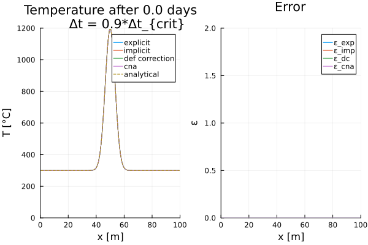

# [Gaussian Diffusion (1D)](https://github.com/GeoSci-FFM/GeoModBox.jl/blob/main/examples/DiffusionEquation/1D/Heat_1D_discretization.jl)

This examples shows the advantages and disadvantages for different finite difference discretization scheme solving the 1-D temperature conservation equation assuming constant thermal parameters and neglecting adiabatic pressure effects (i.e., a simple diffusion problem).

The following discretization scheme are used: 

- Forward Euler
- Backward Euler
- Crank-Nicolson
- Defect Correction

As initial condition, a Gaussian temperature distribution with a certain width and amplitude is assumed along a 1-D profile. The transient behavior of this temperature distribution can be described analytically. Thus, one can calculate the accuracy for each time step of each finite difference scheme using this analytical solution. The temperature distribution and error in percent are shown for each time step in a small animation. 

For more details regarding the model setup and physics or details on the different numerical discretization schemes, please see the [exercises](https://github.com/GeoSci-FFM/GeoModBox.jl/blob/main/exercises) or the [documentation](../DiffOneD.md).

---

First one needs to load the required packages: 

```Julia 
using Plots, Printf, LinearAlgebra, ExtendableSparse
using GeoModBox.HeatEquation.OneD
```

Now, one needs to define the geometrical and physical constants. 

```Julia
# Physical Parameters --------------------------------------------------- #
L           =   100.0               # Length [ m ]
Trock       =   300.0               # Background temperature [ C ]
Tmagma      =   1200.0              # Dike temperature [ C ]
W           =   5.0                 # Dike width [m]
κ           =   1.0e-6              # Diffusivity [ m²/s ]
# ----------------------------------------------------------------------- #
```

Now, the numerical constants.

```Julia
# Numerical Parameters -------------------------------------------------- #
nc          =   100                 # Number of cenroids
Δx          =   L/nc                # Grid spacing
xc          =   Δx/2:Δx:(L-Δx/2)    # Coordinates
# Iterations ---
niter       =   10  
ϵ           =   1.0e-10       
# ----------------------------------------------------------------------- #
```

All numerical schemes are solved consecutively for their individual temperature profile within the same time loop. Thus, the time step needs to satisfy the diffusion time stability criterion for the Backward Euler (explicit) numerical scheme. One can control the absolut time step via the multiplication factor ```fac```.

```Julia
# Time Parameters ------------------------------------------------------- #
day         =   3600.0*24.0         # Seconds per day
tmax        =   2.0*365.25*day      # Maximum time [ s ]
time        =   0.0                 # Initilalize time
# Explicit time stability criterion ---
Δtexp       =   Δx^2/κ/2.0
# Absolut time step ---
fac         =   0.9                 # Factorisation
Δt          =   fac*Δtexp           # Absolut time step
# Number of time steps ---
nt          =   ceil(Int,tmax/Δt)
# ----------------------------------------------------------------------- #
```

As initial condition, a Gaussian temperature distribution along the $x$-direction is defined, assuming a certain width $\sigma$ and its peak at the middle of the profile. The initial temperature distribution is assigned to an individual temperature field for each numerical sceheme. The temperature is not stored for each time step, but overwritten within the time loop. 

```Julia
# Initial condition ----------------------------------------------------- #
T           =   (ini = zeros(nc), ana = zeros(nc))
# Gaussian temperature distribution ---------
σ           =   5
xp          =   L/2.0
@. T.ini    =   Trock + (Tmagma-Trock)*exp(-((xc-xp)/σ)^2)
# Setting up field memroy ---
explicit    =   (T = zeros(nc), T_ex = zeros(nc+2), ε = zeros(nc))
implicit    =   (T = zeros(nc), rhs = zeros(nc), ε = zeros(nc))
dc          =   (T = zeros(nc), T0 = zeros(nc), T_ex = zeros(nc+2), 
                    ∂T2∂x2 = zeros(nc), R = zeros(nc), ε = zeros(nc))
cna         =   (T = zeros(nc), ε = zeros(nc))
# Assign initial temperature ---
explicit.T              .=  T.ini
explicit.T_ex[2:end-1]  .=  explicit.T
implicit.T              .=  T.ini
dc.T0                   .=  T.ini
cna.T                   .=  T.ini
# Analytical solution ---
@. T.ana    =   Trock + (Tmagma-Trock)/(sqrt(1+4*time*κ/σ^2))*
                        exp(-(xc-xp)^2/(σ^2 + 4*time*κ))
# ----------------------------------------------------------------------- #
```

Now, the thermal boundary conditions.

```Julia
# Boundary conditions --------------------------------------------------- #
BC          =   (
                    type = (W=:Dirichlet, E=:Dirichlet),
                    #type = (W=:Neumann, E=:Neumann),
                    val = (W=:300.0,E=:300.0)
)
# ----------------------------------------------------------------------- #
```

For the implicit numerical scheme, one also needs to define the coefficient matrices and the degrees of freedom ```ndof``` of the linear system of equations. 

```Julia
# Assemble Coefficient Matrix ------------------------------------------- #
ndof        =   length(T.ini)
K           =   ExtendableSparseMatrix(ndof,ndof)    
K1          =   ExtendableSparseMatrix(ndof,ndof)    
K2          =   ExtendableSparseMatrix(ndof,ndof)    
# ----------------------------------------------------------------------- #
```

To visualize the transient behavior, the temperature profile and the error are stored as a *gif*. 

> **Note:** If one wants to plot the solution for certain time steps the parameter ```save_fig``` needs to be set to 0. This setting does not result in the generation of a gif file and the single plots are not saved! 

```Julia
# Animationssettings ---------------------------------------------------- #
path        =   string("./examples/DiffusionEquation/1D/Results/")
anim        =   Plots.Animation(path, String[] )
filename    =   string("1D_comparison")
save_fig    =   1
# ----------------------------------------------------------------------- #

Let's plot the initial condition first. 

# Plot initial condition ------------------------------------------------ #
p = plot(xc, explicit.T, label="explicit", 
        xlabel="x [m]", ylabel="T [°C]", 
        title="Temperature after $(round(time / day, digits=1)) days
        Δt = $(round(Δt / Δtexp, digits=2))*Δt_{crit}",
        xlim=(0,L),ylim=(0, Tmagma),layout=(1,2))
plot!(p,xc, implicit.T,label="implicit",subplot=1)
plot!(p,xc, dc.T0,label="def correction",subplot=1)
plot!(p,xc, cna.T,label="cna",subplot=1)
plot!(p,xc, T.ana, linestyle=:dash, label="analytical",subplot=1)
plot!(p,xc, explicit.ε, xlabel="x [m]", ylabel="ε",
        title="Error",
        label="ε_exp",xlim=(0,L),ylim=(0,2.0),
        subplot=2)        
plot!(p,xc, implicit.ε, label="ε_imp",subplot=2)      
plot!(p,xc, dc.ε, label="ε_dc",subplot=2)  
plot!(p,xc, cna.ε, label="ε_cna",subplot=2)  

if save_fig == 1
    Plots.frame(anim)
else
    display(p)
end
# ----------------------------------------------------------------------- #
```



**Figure 1. Initial temperature distribution.**

Now, all parameter have been defined to solve the 1-D temperature conservation equation for each time step using a for loop. Within the time loop, the equation is solved seperately using each of the above mentioned numerical discretization schemes. 

If the temperature field is not explicitly updated within this script after the solver, the temperature is updated within the solver already. 

```Julia
# Time loop ------------------------------------------------------------- #
for n=1:nt
    println("Zeitschritt: ",n,", Time: $(round(time/day, digits=1)) [d]")
    # Explicit, Forward Euler ------------------------------------------- #
    ForwardEuler1Dc!( explicit, κ, Δx, Δt, nc, BC )
    # Implicit, Backward Euler ------------------------------------------ #
    BackwardEuler1Dc!( implicit, κ, Δx, Δt, nc, BC, K, implicit.rhs )
    # Defection correction method --------------------------------------- #
    for iter = 1:niter
        # Residual iteration
        ComputeResiduals1Dc!( dc, κ, Δx, Δt, BC )
        @printf("||R|| = %1.4e\n", norm(dc.R)/length(dc.R))            
        norm(dc.R)/length(dc.R) < ϵ ? break : nothing
        # Assemble linear system
        AssembleMatrix1Dc!( κ, Δx, Δt, nc, BC, K )
        # Solve for temperature correction: Cholesky factorisation
        Kc = cholesky(K.cscmatrix)
        # Solve for temperature correction: Back substitutions
        δT = -(Kc\dc.R[:])          
        # Update temperature            
        dc.T .= dc.T .+ δT            
    end        
    # Crank-Nicolson method --------------------------------------------- #
    CNA1Dc!( cna, κ, Δx, Δt, nc, BC, K1, K2 )
    # Update temperature ------------------------------------------------ #
    dc.T0           .=  dc.T
    # Update time ------------------------------------------------------- #
    time    =   time + Δt
    # Analytical Solution ----------------------------------------------- #
    @. T.ana    =   Trock + (Tmagma-Trock)/(sqrt(1+4*time*κ/σ^2))*
                        exp(-(xc-xp)^2/(σ^2 + 4*time*κ))
    # Error ------------------------------------------------------------- #
    @. explicit.ε   =   abs((T.ana-explicit.T)/T.ana)*100
    @. implicit.ε   =   abs((T.ana-implicit.T)/T.ana)*100
    @. dc.ε         =   abs((T.ana-dc.T0)/T.ana)*100
    @. cna.ε        =   abs((T.ana-cna.T)/T.ana)*100
    # Plot solution ----------------------------------------------------- #
    if n == 1 || n % 5 == 0 || n == nt
        # Subplot 1 ---
        p = plot(xc, explicit.T, label="explicit",
                xlim=(0,L),ylim=(0,1300),
                xlabel="x [m]",ylabel="T [°C]",
                title="Temperature after $(round(time / day, digits=1)) days
        Δt = $(round(Δt / Δtexp, digits=2))*Δt_{crit}",
                layout=(1,2))
        plot!(p, xc, implicit.T,linestyle=:dash, label="implicit",subplot=1)
        plot!(p, xc, dc.T,linestyle=:dash, label="def correction",subplot=1)
        plot!(p, xc, cna.T,linestyle=:dash, label="cna",subplot=1)
        plot!(p, xc, T.ana, linestyle=:dash, label="analytical",subplot=1)    
        # Subplot 2 ---
        plot!(p,xc, explicit.ε, label="ε_exp",
            xlim=(0,L),ylim=(0,2.0),
            xlabel="x [m]",ylabel="ε [%]",
            title="Error",
            subplot=2)
        plot!(p, xc, implicit.ε,linestyle=:dash, label="ε_imp",subplot=2)
        plot!(p, xc, dc.ε,linestyle=:dot, label="ε_dc",subplot=2)
        plot!(p, xc, cna.ε,linestyle=:dash, label="ε_cna",subplot=2)                
        # Display the plots ---    
        if save_fig == 1
            Plots.frame(anim)
        else
            display(p)
        end
    end
end
```


**Figure 2. Temperature evolution and corresponding error for each numerical scheme.** exp - Forward Euler, imp - Backward Euler, dc - Defect correction, cna - Crank-Nicolson. 

Finally, the plots are stored in an animation and the individual *png* files for the certain time steps are removed. 

```Julia
# Speicher Animation ---------------------------------------------------- #
if save_fig == 1
    # Write the frames to a GIF file
    Plots.gif(anim, string( path, filename, ".gif" ), fps = 15)
else
    display(plot(p))
end
foreach(rm, filter(startswith(string(path,"00")), readdir(path,join=true)))
# ----------------------------------------------------------------------- #
```