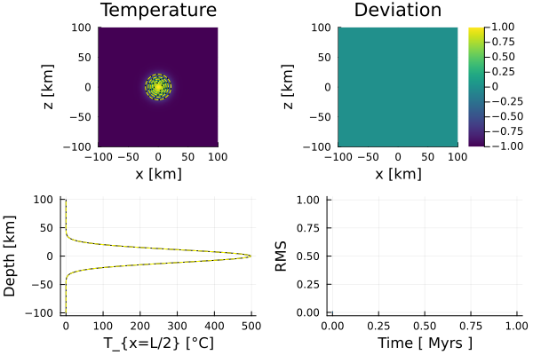

# [Gaussian Diffusion (2D)](https://github.com/GeoSci-FFM/GeoModBox.jl/blob/main/examples/DiffusionEquation/2D/Gaussian_Diffusion.jl)

This examples calculates are resolution test for different finite difference discretization scheme for the 2-D temperature conservation equation assuming constant thermal parameters and neglecting adiabatic pressure effects (i.e., a simple diffusion problem) using a Gaussian diffusion problem.

The following discretization scheme are used: 

- Forward Euler
- Backward Euler
- Crank-Nicolson
- Alternating-Direction Implicit
- Defect Correction

As initial condition, a Gaussian temperature distribution with a certain width and amplitude is assumed with it's peak at the center of the 2-D model domain. The transient behavior of this temperature distribution can be described analytically. Thus, one can calculate the accuracy for each time step of each finite difference scheme using this analytical solution. 

The 2-D analytical solution is caluclated using the julia package ```ExactFieldSolutions```. Using the analytical solution, the thermal boudnary conditions are updated for each time step. 

In this example, for the sake of simplicity, the 2-D temperature conservation equation is solved seperately over time for each finite difference scheme. After each time loop, the transient behavior for each solution is saved in a small *gif* animaion showing the temperature distribution, it's absolute deviation from the analytical solution, a vertical prolile through the middle of the model domain, and the RMS. 

For more details on the different numerical discretization schemes, please see the [documentation](../DiffTwoD.md).

---

First, let's define an array which includes the names of the different numerical schemes to be used. In the following, a loop is executed in which the individual scheme is called in the very beginning (via an if statement). Also, a mulitplication factor ```nrnxny``` is defined, which controlls the maximum resolution, that is ```nrnxny*20```. 

Within in each loop over the different numerical scheme, the resolution is consecutively increased up to the maximum defined resolution.

If ```save_fig = -1```, only the final plot for the resolution test is shown and stored. For ```save_fig = 0``` all fields are plotted, but not stored, and for ```save_fig = 1``` the transient behavior for each resolution of each numerical scheme is stored in a *gif* animation. 

```Julia
Schema  =   ["explicit","implicit","CNA","ADI","dc"]
# Schema      =   ["ADI"]
ns          =   size(Schema,1)
nrnxny      =   6
save_fig    =   -1
```

Now, one needs to define the geometrical and physical parameters for the problem. 

```Julia
# Physical Parameters ------------------------------------------------ #
P       = ( 
    L       =   200e3,          #   Length [ m ]
    H       =   200e3,          #   Height [ m ]
    k       =   3,              #   Thermal Conductivity [ W/m/K ]
    cp      =   1000,           #   Specific Heat Capacity [ J/kg/K ]
    ρ       =   3200,           #   Density [ kg/m^3 ]
    K0      =   273.15,         #   Kelvin at 0 °C
    Q0      =   0               #   Heat production rate
)
P1      = (
    κ       =   P.k/P.ρ/P.cp,   #   Thermal Diffusivity [ m^2/s ] 
    Tamp    =   500,            #   Temperaturamplitude [K]
    σ       =   20e3,           #   
    Xc      =   0.0,            #   x-Coordinate of the Anomalycenter
    Zc      =   0.0             #   y-Coordinate of the Anomalycenter
)
P       =   merge(P,P1)
# -------------------------------------------------------------------- #
```

Here, the arrays for the resolution test are initialized. 

```Julia
# Statistical Parameter ---------------------------------------------- #
St      = (
    ε           =   zeros(size(Schema,1),nrnxny),    
    nxny        =   zeros(size(Schema,1),nrnxny),
    Tmax        =   zeros(size(Schema,1),nrnxny),
    Tmean       =   zeros(size(Schema,1),nrnxny),
    Tanamax     =   [0.0],
    Tanamean    =   [0.0]
)
# -------------------------------------------------------------------- #
```

Now, one can start the loop over the different numerical discretization schemes (```m```) and over the different resolutions (```l```). 

```Julia
# Loop over different discretization schemes ------------------------- #
for m = 1:ns
    FDSchema = Schema[m]
    display(FDSchema)
    for l = 1:nrnxny
```

Within these loops, one needs to refine the grid parameter. 

```Julia
        # Numerical Parameters --------------------------------------- #
        NC  = (
            x       =   l*20,       #   Number of Centroids in x
            y       =   l*20        #   Number of Centroids in y
        )
        Δ   = (
            x       =   P.L/NC.x,   #   Grid spacing in x
            y       =   P.H/NC.y    #   Grid Spacing in y
        )
        display(string("nx = ",NC.x,", ny = ",NC.y))
        # ------------------------------------------------------------ #
```

Since the name of the animation does contain the resolution, one needs to define it here new as well. 

```Julia
        # Animationssettings ----------------------------------------- #
        path        =   string("./examples/DiffusionEquation/2D/Results/")
        anim        =   Plots.Animation(path, String[] )
        filename    =   string("Gaussian_Diffusion_",FDSchema,
                            "_nx_",NC.x,"_ny_",NC.y)
        # ------------------------------------------------------------ #
```

Also the grid corrdinates. 

```Julia
        # Grid coordinates ------------------------------------------- #
        x       = (
            c       =   LinRange(-P.L/2+ Δ.x/2.0, P.L/2 - Δ.x/2.0, NC.x),
        )
        y       = (
            c       =   LinRange(-P.H/2 + Δ.y/2.0, P.H/2 - Δ.y/2.0, NC.y),
        )
        # ------------------------------------------------------------ #
```

For the sake of simplicity, the calculation of the time step is kept the same for each numerical scheme. Thus, it needs to fulfill the diffusion stability criterion and needs to be newly defined within each resolution loop. 

```Julia
        # Time Parameters -------------------------------------------- #
        T       = (
            year        =   365.25*3600*24,     #   Seconds per year
            Δfac        =   1.0,                #   Factor for Explicit Stability Criterion
        )
        T1      = (
            tmax        =   10 * 1e6 * T.year,  #   Maximum Time in [ s ]
            Δ           =   [0.0]            
        )
        T       =   merge(T,T1)
        T.Δ[1]  =   T.Δfac * (1.0 / ( 2.0 * P.κ * ( 1 /Δ.x^2 + 1 / Δ.y^2 )))
        
        nt      =   ceil(Int,T.tmax/T.Δ[1])     #   Number of Time Steps
        time    =   zeros(1,nt)
        # ------------------------------------------------------------ #
```

Now, one can initialize the field arrays and the initial condtion. 

```Julia
        # Initial Conditions  ---------------------------------------- #
        D       = (
            Q           =   zeros(NC...),
            T           =   zeros(NC...),
            T0          =   zeros(NC...),
            T_ex        =   zeros(NC.x+2,NC.y+2),
            Tana        =   zeros(NC...),
            RMS         =   zeros(1,nt),
            εT          =   zeros(NC...),
            Tmax        =   zeros(1,nt),
            Tmean       =   zeros(1,nt),
            Tmaxa       =   zeros(1,nt),
            Tprofile    =   zeros(NC.y,nt),
            Tprofilea   =   zeros(NC.y,nt),
            ρ           =   zeros(NC...),
            cp          =   zeros(NC...)            
        )
        @. D.ρ  =   P.ρ
        # Initial conditions
        AnalyticalSolution2D!(D.T, x.c, y.c, time[1], (T0=P.Tamp,K=P.κ,σ=P.σ))
        @. D.Tana                   =   D.T
        @. D.T0                     =   D.T
        D.T_ex[2:end-1,2:end-1]     .=  D.T
```

For visualization purposes, the temperature profile throught the middle of the domain is stored. 

> **Note:** Even though we do not assume a radioactive heat source, one needs to initialize the field and set it to zero. This is required by the solver. 

```Julia    
        D.Tprofile[:,1]     .=  (D.T[convert(Int,NC.x/2),:] + 
                                    D.T[convert(Int,NC.x/2)+1,:]) / 2
        D.Tprofilea[:,1]    .=  (D.Tana[convert(Int,NC.x/2),:] + 
                                    D.Tana[convert(Int,NC.x/2)+1,:]) / 2
        # Heat production rate ---
        @. D.Q          = P.Q0
        # Visualize initial condition ---
        # subplot 1 ---
        p = heatmap(x.c ./ 1e3, y.c ./ 1e3, (D.T.-P.K0)', 
                color=:viridis, colorbar=false, aspect_ratio=:equal, 
                xlabel="x [km]", ylabel="z [km]", 
                title="Temperature", 
                xlims=(-P.L/2/1e3, P.L/2/1e3), ylims=(-P.H/2/1e3, P.H/2/1e3), 
                clims=(minimum(D.T.-P.K0), maximum(D.T.-P.K0)),layout=(2,2),
                subplot=1)
            contour!(p,x.c./1e3,y.c/1e3,D.T'.-P.K0,
                    levels=:5,linecolor=:black,subplot=1)
            contour!(p,x.c./1e3,y.c/1e3,D.Tana'.-P.K0,
                    levels=:5,linestyle=:dash,linecolor=:yellow,subplot=1)
        # subplot 2 ---
        heatmap!(p,x.c ./ 1e3, y.c ./ 1e3, D.εT', 
                color=:viridis, colorbar=true, aspect_ratio=:equal, 
                xlabel="x [km]", ylabel="z [km]", 
                title="Deviation", 
                xlims=(-P.L/2/1e3, P.L/2/1e3), ylims=(-P.H/2/1e3, P.H/2/1e3),  
                clims=(-1,1),layout=(2,2),
                subplot=2)
        # subplot 3 ---
        plot!(p,D.Tprofile[:,1],y.c./1e3,
                linecolor=:black,
                xlabel="T_{x=L/2} [°C]",ylabel="Depth [km]",
                label="",
                subplot=3)
        plot!(p,D.Tprofilea[:,1],y.c./1e3,
                linestyle=:dash,linecolor=:yellow,
                xlabel="T_{x=L/2} [°C]",ylabel="Depth [km]",
                label="",
                subplot=3)
        # subplot 4 ---
        plot!(p,time[1:end]./T.year./1e6,D.RMS[1:end],
                label="",
                xlabel="Time [ Myrs ]",ylabel="RMS",
                subplot=4)
        if save_fig == 0
            display(p)
        end
```



**Figure 1. Initial condition.** Top left: Numerical temperature distribution (background colored field and black contour lines) overlain by the analytical solution (yellow dashed contours). Top right: Absolut deviation of the numerical from the analytical solution. Bottom left: Vertical temperature profile along the middle of the domain; black solid - numerical, yellow dashed - analytical. Bottom right: RMS over time. 

Since the resolution does vary, one needs to define the boundary conditions wihitn the loop as well. 

```Julia
        # Boundary Conditions ---------------------------------------- #
        BC     = (type    = (W=:Dirichlet, E=:Dirichlet, 
                                N=:Dirichlet, S=:Dirichlet),
                    val     = (W=D.Tana[1,:],E=D.Tana[end,:],
                                N=D.Tana[:,end],S=D.Tana[:,1]))
        # ------------------------------------------------------------ #
```

Depending on the numerical method, one needs to define the coefficient matrix and degrees of freedom for the linear system of equations or the iterative parameters (for the defect correction method). 

```Julia
        if FDSchema == "implicit"
            # Linear System of Equations ----------------------------- #
            Num     =   (T=reshape(1:NC.x*NC.y, NC.x, NC.y),)
            ndof    =   maximum(Num.T)
            K       =   ExtendableSparseMatrix(ndof,ndof)
            rhs     =   zeros(ndof)
        end
        if FDSchema == "CNA"
            # Linear System of Equations ----------------------------- #
            Num     =   (T=reshape(1:NC.x*NC.y, NC.x, NC.y),)
            ndof    =   maximum(Num.T)
            K1      =   ExtendableSparseMatrix(ndof,ndof)
            K2      =   ExtendableSparseMatrix(ndof,ndof)
            rhs     =   zeros(ndof)
        end
        if FDSchema == "dc"
            niter       =   10
            ϵ           =   1e-10
            @. D.ρ      =   P.ρ
            @. D.cp     =   P.cp
            k           =   (x=zeros(NC.x+1,NC.x), y=zeros(NC.x,NC.x+1))
            @. k.x      =   P.k
            @. k.y      =   P.k
            Num         =   (T=reshape(1:NC.x*NC.y, NC.x, NC.y),)
            ndof        =   maximum(Num.T)
            K           =   ExtendableSparseMatrix(ndof,ndof)
            R           =   zeros(NC...)
            ∂T          =   (∂x=zeros(NC.x+1, NC.x), ∂y=zeros(NC.x, NC.x+1))
            q           =   (x=zeros(NC.x+1, NC.x), y=zeros(NC.x, NC.x+1))
        end
```

Now, all parameters are defined to solve the 2-D temperature conservation equation in a time loop using the corresponding numerical scheme. The analytical solution is calculated seperately. 

```Julia
        # Time Loop -------------------------------------------------- #
        for n = 1:nt
            if n>1
                if FDSchema == "explicit"
                    ForwardEuler2Dc!(D, P.κ, Δ.x, Δ.y, T.Δ[1], D.ρ, P.cp, NC, BC)
                elseif FDSchema == "implicit"
                    BackwardEuler2Dc!(D, P.κ, Δ.x, Δ.y, T.Δ[1], D.ρ, P.cp, NC, BC, rhs, K, Num)
                elseif FDSchema == "CNA"
                    CNA2Dc!(D, P.κ, Δ.x, Δ.y, T.Δ[1], D.ρ, P.cp, NC, BC, rhs, K1, K2, Num)
                elseif FDSchema == "ADI"
                    ADI2Dc!(D, P.κ, Δ.x, Δ.y, T.Δ[1], D.ρ, P.cp, NC, BC)
                elseif FDSchema == "dc"
                    for iter = 1:niter
                        # Evaluate residual
                        ComputeResiduals2D!(R, D.T, D.T_ex, D.T0, ∂T, q, D.ρ, D.cp, k, BC, Δ, T.Δ[1])
                        # @printf("||R|| = %1.4e\n", norm(R)/length(R))
                        norm(R)/length(R) < ϵ ? break : nothing
                        # Assemble linear system
                        K  = AssembleMatrix2D(D.ρ, D.cp, k, BC, Num, NC, Δ, T.Δ[1])
                        # Solve for temperature correction: Cholesky factorisation
                        Kc = cholesky(K.cscmatrix)
                        # Solve for temperature correction: Back substitutions
                        δT = -(Kc\R[:])
                        # Update temperature
                        @. D.T += δT[Num.T]
                    end
                    D.T0    .= D.T
                end
                time[n]     =   time[n-1] + T.Δ[1]
                if time[n] > T.tmax 
                    T.Δ[1]  =   T.tmax - time[n-1]
                    time[n] =   time[n-1] + T.Δ[1]
                end                
                # Exact solution on cell centroids
                AnalyticalSolution2D!(D.Tana, x.c, y.c, time[n], (T0=P.Tamp,K=P.κ,σ=P.σ))
                # Exact solution on cell boundaries
                BoundaryConditions2D!(BC, x.c, y.c, time[n], (T0=P.Tamp,K=P.κ,σ=P.σ)) 
            end
            # Maximum and Mean Temperature with time ---
            D.Tmax[n]   =   maximum(D.T)
            D.Tmean[n]  =   mean(D.T)
            # Vertical Profile along the Center of the Domain ---
            D.Tprofile[:,n]     .=  (D.T[convert(Int,NC.x/2),:] + 
                                        D.T[convert(Int,NC.x/2)+1,:]) / 2
            D.Tprofilea[:,n]    .=  (D.Tana[convert(Int,NC.x/2),:] + 
                                        D.Tana[convert(Int,NC.x/2)+1,:]) / 2
            # Deviation from the Analytical Solution ---
            @. D.εT     =   (D.Tana - D.T)
            # RMS ---
            D.RMS[n]    =   sqrt(sum(D.εT.^2)/(NC.x*NC.y))
            # Plot Solution ---
            if mod(n,2) == 0 || n == nt
                # subplot 1 ---
                p = heatmap(x.c ./ 1e3, y.c ./ 1e3, (D.T.-P.K0)', 
                    color=:viridis, colorbar=false, aspect_ratio=:equal, 
                    xlabel="x [km]", ylabel="z [km]", 
                    title="Temperature", 
                    xlims=(-P.L/2/1e3, P.L/2/1e3), ylims=(-P.H/2/1e3, P.H/2/1e3), 
                    clims=(minimum(D.T.-P.K0), maximum(D.T.-P.K0)),layout=(2,2),
                    subplot=1)

                contour!(p,x.c./1e3,y.c/1e3,D.T'.-P.K0,
                            levels=:5,linecolor=:black,subplot=1)
                contour!(p,x.c./1e3,y.c/1e3,D.Tana'.-P.K0,
                            levels=:5,linestyle=:dash,linecolor=:yellow,subplot=1)
                # subplot 2 ---
                heatmap!(p,x.c ./ 1e3, y.c ./ 1e3, D.εT', 
                        color=:viridis, colorbar=true, aspect_ratio=:equal, 
                        xlabel="x [km]", ylabel="z [km]", 
                        title="Deviation", 
                        xlims=(-P.L/2/1e3, P.L/2/1e3), ylims=(-P.H/2/1e3, P.H/2/1e3), 
                        clims=(-1,1),
                        subplot=2)
                # subplot 3 ---
                plot!(p,D.Tprofile[:,n],y.c./1e3,
                    linecolor=:black, ylim=(-P.H/2/1e3,P.H/2/1e3),
                    xlim=(0,P.Tamp),
                    xlabel="T_{x=L/2} [°C]",ylabel="Depth [km]",
                    label="",
                    subplot=3)
                plot!(p,D.Tprofilea[:,n],y.c./1e3,
                    linestyle=:dash,linecolor=:yellow,
                    xlabel="T_{x=L/2} [°C]",ylabel="Depth [km]",
                    label="",
                    subplot=3)
                # subplot 4 ---
                plot!(p,time[1:n]./T.year./1e6,D.RMS[1:n],
                    label="",
                    xlabel="Time [ Myrs ]",ylabel="RMS",
                    subplot=4)
                if save_fig == 1
                    Plots.frame(anim)
                elseif save_fig == 0
                    display(p)                        
                end
            end
            # End Time Loop ---
        end        
        display("Time loop finished ...")
        display("-> Use new grid size...")
```

Now, one can save the plots in a *gif* animation and store the values for the resolution test. 

```Julia
        # Save Animation ---
        if save_fig == 1
            # Write the frames to a GIF file
            Plots.gif(anim, string( path, filename, ".gif" ), fps = 15)
        elseif save_fig == 0
            display(plot(p))
        end
        foreach(rm, filter(startswith(string(path,"00")), readdir(path,join=true)))
        # ------------------------------------------------------------ #
        # Statistical Values for Each Scheme and Resolution ---
        St.ε[m,l]       =   maximum(D.RMS[:])
        St.nxny[m,l]    =   1/NC.x/NC.y
        St.Tmax[m,l]    =   D.Tmax[nt]
        St.Tmean[m,l]   =   D.Tmean[nt]
        St.Tanamax[1]   =   maximum(D.Tana)
        St.Tmean[1]     =   mean(D.Tana)
        # ------------------------------------------------------------ #
    end
end
```


**Figure 2. Final animation using the Crank-Nicolson approach for a resolution of 100 x 100.** Top left: Numerical solution of the transient temperature field (background colored field and black contours); yellow dashed contours - analytical solution. Top right: Absolut deviation of the numerical from the analytical solution. Bottom left: Vertical temperature profile along the middle of the domain. Bottom right: RMS over time. 

Finally, the results of the resolution test are plotted. 

```Julia
# Visualize Statistical Values --------------------------------------- #
q   =   plot(0,0,layout=(1,3))
for m = 1:ns
#    subplot(1,3,1)
    plot!(q,St.nxny[m,:],St.ε[m,:],
                marker=:circle,markersize=3,label=Schema[m],
                xaxis=:log,yaxis=:log,
                xlabel="1/nx/ny",ylabel="ε_{T}",layout=(1,3),
                subplot=1)
    plot!(q,St.nxny[m,:],St.Tmax[m,:],
                marker=:circle,markersize=3,label="",
                xaxis=:log,
                xlabel="1/nx/ny",ylabel="T_{max}",
                subplot=2)
    plot!(q,St.nxny[m,:],St.Tmean[m,:],
                marker=:circle,markersize=3,label="",
                xaxis=:log,
                xlabel="1/nx/ny",ylabel="⟨T⟩",
                subplot=3)
    display(q)
end
# --------------------------------------------------------------------- #
# Save Final Figure --------------------------------------------------- #
if save_fig == -1
    savefig(q,"./examples/DiffusionEquation/2D/Results/Gaussian_ResTest.png")
end
# --------------------------------------------------------------------- #
``` 

