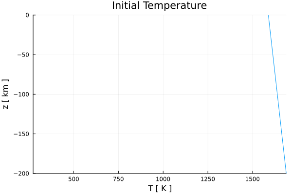
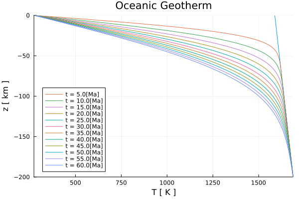
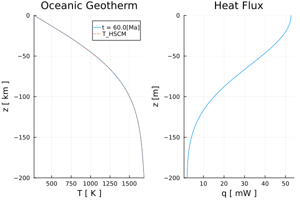

# [Oceanic Geotherm](https://github.com/GeoSci-FFM/GeoModBox.jl/blob/main/examples/DiffusionEquation/1D/OceanicGeotherm_1D.jl) 

The 1-D temperature profile of an oceanic geotherm can be calculated by solving the conductive part of the 1-D *temperature conservation equation* using variable thermal parameters with a conservative finite difference scheme (so far only including a radiogenic heat source). For the sake of continuity, we use the 1-D solver for variable thermal parameters, even though a constant thermal conductivity is assumed in this example.

In a conservative finite difference scheme for 1-D conduction, temperature is defined at the *centroids*, while vertical heat flux $q_y$ and thermal conductivity $k$ are defined at the *vertices*.

The 1-D temperature equation is given by: 

$\begin{equation}
\rho c_{p} \frac{\partial{T}}{\partial{t}} = \frac{\partial{q_y}}{\partial{y}} + \rho H,
\end{equation}$ 

where the heat flux is defined as:

$\begin{equation}
\left. q_{y,m} = -k_m \frac{\partial T}{\partial y}\right\vert_{m},\ \textrm{for}\ m = 1:nv, 
\end{equation}$

where $\rho$, $c_{p}$, $T$, $t$, $k$, $H$, $y$, and $nv$ denote the density [kg/m³], the specific heat capacity [J/kg/K], the temperature [K], the time [s], the thermal conductivity [W/m/K], the heat generation rate per mass [W/kg], the depth [m], and the number of vertices, respectively. 

For more details on how to discretize the equation using an explicit, forward Euler finite difference scheme, please see the [documentation](../DiffOneD.md).

---

First, one needs to load the required packages: 

```Julia
using Plots, SpecialFunctions
using GeoModBox.HeatEquation.OneD
```

Let's start with the definition of the geometrical, numerical, and physical constants: 

```Julia 
# Constants --------------------------------------------------------- #
H           =   200e3               #   Hight of the model [ m ]
nc          =   200                 #   Number of central grid points    
Δy          =   H/nc                #   Grid resolution

# Depth ---
yc          =   LinRange(-H + Δy/2.0,0.0 - Δy/2.0,nc)     
yv          =   LinRange(-H,0,nc+1)
    
Py  =   (
    ρm      =   3000,               #   Density [ kg/m^3 ]
    cpm     =   1000,               #   Heat capacity [ J/kg/K ]
    km      =   3.0,                #   Conductivity [ W/m/K ]
    HM      =   0,                  #   Heat generation rate [W/kg]; Q = ρ*H0
)    
# ------------------------------------------------------------------- #
```

In the following, one needs to define the initial and boundary condition: 

1. Temperature at the surface and bottom.
2. Linear increasing temperature profile assuming a certain adiabatic gradient and potential mantle temperature.


```Julia
# Initial Condition ------------------------------------------------- #
T   =   (
    Tpot    =   1315 + 273.15,      #   Potential temperautre [ K ]
    ΔTadi   =   0.5,                #   Adiabatic temperature gradient [ K/km ]
    Ttop    =   273.15,             #   Surface temperature [ K ]
    T_ex    =   zeros(nc+2,1),    
)
T1  =   (
    Tbot    =   T.Tpot + T.ΔTadi*abs(H/1e3),    # Bottom temperature [ K ]
    T       =   T.Tpot .+ abs.(yc./1e3).*T.ΔTadi,   # Initial T-profile [ K ]
)
T   =   merge(T,T1)
     
Tini                =   zeros(nc,1)
Tini                .=   T.T
T.T_ex[2:end-1]     .=   T.T
# ------------------------------------------------------------------- #
```

Either *Dirichlet* or *Neumann* thermal boundary conditions can be applied at the surface and bottom. 

```Julia 
# Boundary conditions ----------------------------------------------- #
BC      =   (
    type    = (N=:Dirichlet, S=:Dirichlet),
    val     = (N=T.Ttop[1],S=T.Tbot[1])
)
# If Neumann boundary conditions are choosen, the following values result in the given heatflux for the given thermal conductivity k. 
# S      =   -0.03;          # c     =   -k/q -> 90 mW/m^2
# N      =   -0.0033;        # c     =   -k/q -> 10 mW/m^2
# ------------------------------------------------------------------- #
```

Next, define the multiplicative factor `fac` for the *diffusion stability criterion* for the explicit thermal solver. This factor controls the stability criterion. If `fac` exceeds 1, the solver becomes unstable.  

```Julia
# Time stability criterion ------------------------------------------ #
fac     =   0.8                 #   Courant criterion
tmax    =   60                  #   Lithosphere age [ Ma ]
tsca    =   60*60*24*365.25     #   Seconds per year

age     =   tmax*1e6*tsca        #   Age in seconds    
# ------------------------------------------------------------------- #
```

To verify the initial and boundary conditions by plotting the temperature profile. 

```Julia
# Plot Initial condition -------------------------------------------- #
plotparam   =   1
q = plot(Tini,yc./1e3, 
    label="", 
    xlabel="T [ K ]", ylabel="z [ km ]", 
    title="Initial Temperature",
    xlim=(T.Ttop,T.Tbot),ylim=(-H/1e3,0))
display(q)
# ------------------------------------------------------------------- #
```



**Figure 1. Initial temperature profile.**

Since a thermal solver for variable thermal parameters is used, one needs to expand the scalar to a vector with the dimensions of the number of centroids ```nc```. Additionally, the thermal diffusivity $\kappa$ and initialize the vertical heat flux ```q``` need to be defined. 

```Julia
# Setup Fields ------------------------------------------------------ #
Py1     =   (
    ρ       =   Py.ρm.*ones(nc,1),
    cp      =   Py.cpm.*ones(nc,1),
    k       =   Py.km.*ones(nc+1,1),
    H       =   Py.HM.*ones(nc,1)
)
Py  =   merge(Py,Py1)
Py2     =   (
    # Thermal diffusivity [ m^2/s ] 
    κ       =  maximum(Py.k)/minimum(Py.ρ)/minimum(Py.cp),     
)
Py  =   merge(Py,Py2)
T2  =   (
    q   =   zeros(nc+1,1),
)
T   =   merge(T,T2)
# ------------------------------------------------------------------- #
```

Now, one can calculate the time stability criterion. 


```Julia
# Time stability criterion ------------------------------------------ #
Δtexp   =   Δy^2/2/Py.κ             #   Stability criterion for explicit
Δt      =   fac*Δtexp               #   total time step

nit     =   ceil(Int64,age/Δt)      #   Number of iterations    

time    =   zeros(1,nit)            #   Time array
# ------------------------------------------------------------------- #
```

With all parameters and constants defined, the equation can now be solved the 1-D temperature equation for each time step in a ```for``` loop. 

The temperature conservation equation is solved via the function ```ForwardEuler1D!()```, which updates the temperature profile `T.T` for each time step using the extended temperature field ```T.T_ex```, which include the ghost nodes. The temperature profile is plotted for a certain time.  

```Julia
# Calculate 1-D temperature profile --------------------------------- #
count   =   1
for i = 1:nit
    if i > 1
        time[i]     =   time[i-1] + Δt
    elseif time[i] > age
        Δt          =   age - time[i-1]
        time[i]     =   time[i-1] + Δt
    end
    ForwardEuler1D!(T,Py,Δt,Δy,nc,BC)
    if i == nit || abs(time[i]/1e6/tsca - count*5.0) < Δt/1e6/tsca        
        println(string("i = ",i,", time = ", time[i]/1e6/tsca))        
        q = plot!(T.T,yc./1e3, 
            label=string("t = ",ceil(time[i]/1e6/tsca),"[Ma]"), 
            xlabel="T [ K ]", ylabel="z [ km ]", 
            title="Oceanic Geotherm",
            xlim=(T.Ttop,T.Tbot),ylim=(-H/1e3,0))
        display(q)
        count = count + 1
    end
end
# ------------------------------------------------------------------- #
```



**Figure 2. Evolution of the temperature profile with depth in 5 Ma steps.**

For the final time step, a depth profile for the vertical heat flux is calculated. Therefore, one needs to update the temperature at the ghost nodes to calculate the heat flux at the boundary. 

```Julia
# Calculate heaf flow ----------------------------------------------- #
# South ---
T.T_ex[1]   =   (BC.type.S==:Dirichlet) * (2 * BC.val.S - T.T_ex[2]) + 
                (BC.type.S==:Neumann) * (T.T_ex[2] - BC.val.S*Δy)
# North ---
T.T_ex[end] =   (BC.type.N==:Dirichlet) * (2 * BC.val.N - T.T_ex[nc+1]) +
                (BC.type.N==:Neumann) * (T.T_ex[nc+1] + BC.val.N*Δy)
for j=1:nc+1
    T.q[j]  =   -Py.k[j] * 
        (T.T_ex[j+1] - T.T_ex[j])/Δy
end
# ------------------------------------------------------------------- #
```

Finally, compute the temperature profile for an oceanic geotherm using the analytical expression of an infinite half-space cooling model for a certain age. The analytical solution is shown in the final figure, alongside the final numerical temperature profile and the heat flux profile. 

```Julia
# Plot -------------------------------------------------------------- #
if BC.type.N==:Dirichlet && BC.type.S==:Dirichlet
    Tana    =   zeros(nc,1)
    Tana    .=   Tini .+ (T.Ttop - T.Tpot).*erfc.(-yc./(2*sqrt(age*Py.κ)))
    Tana[end] =   T.Ttop
end    
p = plot(T.T,yc./1e3, 
        label=string("t = ",ceil(maximum(time)/1e6/tsca),"[Ma]"), 
        xlabel="T [ K ]", ylabel="z [ km ]",
        title="Oceanic Geotherm",
        xlim=(T.Ttop,T.Tbot),ylim=(-H/1e3,0),
        layout=(1,2),subplot=1)        
if BC.type.N==:Dirichlet && BC.type.S==:Dirichlet
    plot!(p,Tana,yc./1e3, 
            label="T_HSCM",linestyle=:dash,
            layout=(1,2),subplot=1)        
end        
p = plot!(T.q.*1e3,yv./1e3, 
        label="", 
        xlabel="q [ mW ]", ylabel="z [m]", 
        title="Heat Flux",
        ylim=(-H/1e3,0),
        subplot=2)        
display(p)
savefig(p,"./examples/DiffusionEquation/1D/Results/OceanicGeotherm_1D.png")
savefig(q,"./examples/DiffusionEquation/1D/Results/OceanicGeotherm_1D_evolve.png")
# ======================================================================= #
```


**Figure 3. Final temperature and heat flux profiles.**