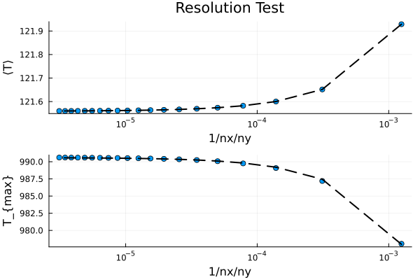

# [Poisson Problem (constant $k$)](https://github.com/GeoSci-FFM/GeoModBox.jl/blob/main/examples/DiffusionEquation/2D/Poisson_ResTest.jl)

This example conducts a resolution test for a steady state, 2-D temperarture conservation equation, i.e. a Poisson equation, assuming a constant thermal conductivity $k$. 

The maximum resolution is define by ```n*ncx x n*ncy```, where ```n``` needs to be defined in the very beginning. 

The temperature equation is solved for each resolution in a loop and the maximum and mean temperature is stored. In theory, the exact solution of the problem should be reached with increasing resolution. 

For more details on the model setup and the physics or the numerical scheme, please see the [exercise](https://github.com/GeoSci-FFM/GeoModBox.jl/blob/main/exercise/04_2D_Diffusion_Stationary.ipynb) or the [documentation](../DiffTwoD.md)

---

Let's first define the maximum resolution. 

```Julia
# Define the numer of differen resolutions ------------------------------ #
# Maximum resolution is defined as nx = n*40, ny = n*20 ---
n       =   20
```

Now, one can define the geometrical and physical constants. 

```Julia
# Physical Parameters --------------------------------------------------- #
P       = ( 
    L       =   4.0e3,      #   [m]
    H       =   2.0e3,      #   [m]
    k       =   5.6,        #   Conductivity, W/m/K
    # Define the region of the anomaly
    Wcave   =   200.0,      # Width [ m ]
    Hcave   =   200.0,      # Thickness [ m ]
    Dcave   =   1.0e3,      # Depth of center [ m ]
    Xcave   =   2.0e3,      # x-position of center [ m ]
    Q       =   0.3         # volumetric heat production rate [ W/m³ ]; Q = rho*H
)
# ----------------------------------------------------------------------- #
```

Dirichlet boundary conditions are assumed along all boundaries. 

```Julia
# Boundary conditions --------------------------------------------------- #
BC      =   (
    type    = (W=:Dirichlet, E=:Dirichlet, N=:Dirichlet, S=:Dirichlet),
    val     = (W=:0.0,E=:0.0,N=:0.0,S=:0.0)
)
# ----------------------------------------------------------------------- #
```

In the following, the parameters for the resolution test are initialized: 

- the reziprocal resolution 
- the maximum temperature
- the mean temperature

```Julia
# Define statistical parameters for visualization ---
ST      =   (
    x       =   zeros(n),       # Reziproc resolution 1/nx/ny
    Tmax    =   zeros(n),       # Maximum temperature
    Tmean   =   zeros(n)        # Mean temperature
)
# ----------------------------------------------------------------------- #
```

Now, one can start the loop over the given resolutions ($k$).

```Julia
# Loop over the resolutions --------------------------------------------- #
for k = 1:n
```

Within the loop, one needs to update the grid information. 

```Julia
    # Numerical Parameters ---------------------------------------------- #
    NC      = (
        x       =   k*40,        # Gitterpunkte in x-Richtung, Spalten
        y       =   k*20         # Gitterpunkte in y-Richtung, Zeilen    
    )
    println("Run ",k,", ncx = ",NC.x,", ncy = ",NC.y)
    # Initialize grid spacing ------------------------------------------- #
    Δ       = (
        x       =   P.L/NC.x,
        y       =   P.H/NC.y
    )
    # ------------------------------------------------------------------- #   
    ST.x[k]     =   1 / NC.x / NC.y
    # ------------------------------------------------------------------- #
    # Generate the grid ------------------------------------------------- #
    x       = (
        c       =   LinRange(0.0 + Δ.x[1]/2.0, P.L - Δ.x[1]/2.0, NC.x),
    )
    y       = (
        c       =   LinRange(-P.H + Δ.y[1]/2.0, 0.0 - Δ.y[1]/2.0, NC.y),
    )
    # ------------------------------------------------------------------- #
```

Now, one can initialize the required fields and setup the initial conditions. For the sake of simplicity, let's assume a constant background temperature of zero. 

```Julia
    # Initialcondition -------------------------------------------------- #
    D       = ( 
        Q       =   zeros(NC...),
        T       =   zeros(NC...),
    )
    # Heat production rate in the anomaly ---
    for i = 1:NC.x, j = 1:NC.y
        if x.c[i] >= (P.Xcave-P.Wcave/2.0) && x.c[i] <=(P.Xcave+P.Wcave/2.0) && 
            y.c[j] >= -P.Dcave-P.Hcave/2.0 && y.c[j] <= -P.Dcave+P.Hcave/2.0 
            D.Q[i,j]    = P.Q
        end
    end
    # ------------------------------------------------------------------- #
```

To solve the Poisson equation, one needs to define the coefficient matrix, the degrees of freedom of the linear system of equations, and the right-hand side. 

```Julia
    # Linear System of Equations ---------------------------------------- #
    Num     =   (T=reshape(1:NC.x*NC.y, NC.x, NC.y),)
    ndof    =   maximum(Num.T)
    K       =   ExtendableSparseMatrix(ndof,ndof)
    rhs     =   zeros(ndof)
    # ------------------------------------------------------------------- #
```

The linear system of equation is solve via the function ```Poisson2Dc!()``` for a constant thermal conductivity. The function updates the temperature field ```D.T``` with the solution. For each resolution, the parameters for the resolution test can be calculated. 

```Julia
    # Solve equation ---------------------------------------------------- #
    Poisson2Dc!(D,NC,P,BC,Δ,K,rhs,Num)
    # ------------------------------------------------------------------- #
    ST.Tmax[k]      =   maximum(D.T[:])
    ST.Tmean[k]     =   mean(D.T[:])
end
```

Following the loop over the entire given resolutions, one can linearly fit the mean and maximum temperature to determine the value for a theoretical, zero grid space, that is the exact solution of the problem.

```Julia
# Linear fit ------------------------------------------------------------ #
df_max      =   DataFrame(x = ST.x, Tmax = ST.Tmax)
df_mean     =   DataFrame(x = ST.x, Tmean = ST.Tmean)
# Fit linear models
linfitMAX   =   lm(@formula(Tmax ~ x), df_max)
linfitMEAN  =   lm(@formula(Tmean ~ x), df_mean)
# Extract coefficients
#coef1       =   coef(linfitMAX)
#coef2       =   coef(linfitMEAN)
# Calculate fitted values
linfit1     =   predict(linfitMAX)
linfit2     =   predict(linfitMEAN)
# ----------------------------------------------------------------------- #
```

Finally, one can plot the maximum and mean temperature over the reciprocal resolution and the linear fit. 

```Julia
# Plot solution --------------------------------------------------------- #
# Subplot 1 ---
p = scatter(ST.x, ST.Tmean, marker=:circle, markersize=4,label="",
        xlabel="1/nx/ny",ylabel="⟨T⟩",title="Resolution Test",
        xaxis=:log,
        layout=(2,1))
plot!(p,ST.x, linfit2, color="black", label="", 
            linestyle=:dash, linewidth=2)
## Add text for fitted minimum temperature
#annotate!(p,1e-4, 121.8, "T_{fit,mean} = $(coef2[1])")

# subplot 2 ---
scatter!(p,ST.x, ST.Tmax, marker=:circle, markersize=4,label="",
        xlabel="1/nx/ny",ylabel="T_{max}",
        subplot=2)
plot!(p,ST.x, linfit1, color="black", label="", 
            linestyle=:dash, linewidth=2,subplot=2)

# Show the plot
display(p)
savefig("./examples/DiffusionEquation/2D/Results/Poisson_ResTest.png")
# ----------------------------------------------------------------------- #
```

