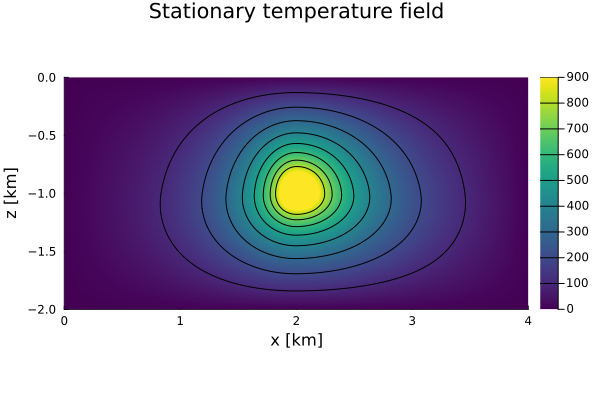
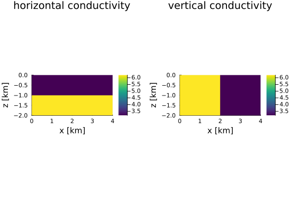

# [Poisson Problem (variable $k$)](https://github.com/GeoSci-FFM/GeoModBox.jl/blob/main/examples/DiffusionEquation/2D/Poisson_variable_k.jl)

This examples solves the steady-state, 2-D temperature equation, i.e. a Poisson equation, assuming a variable thermal conductivity $k$. 

For more details on the model setup and the physics or the numerical scheme, please see the [exercise](https://github.com/GeoSci-FFM/GeoModBox.jl/blob/main/exercise/04_2D_Diffusion_Stationary.ipynb) or the [documentation](../DiffTwoD.md)

---

First one needs to define the geometrical and physical constants. 

```Julia
# Physikalischer Parameter ---------------------------------------------- #
P       =   (
    L           =   4e3,      #   [m]
    H           =   2e3,      #   [m]
    k1          =   3.2,      #   Waermeleitfaehigkeit, W/m/K
    k2          =   6.2,      #   Waermeleitfaehigkeit, W/m/K
    Wcave       =   200,      #
    Hcave       =   200,      #
    Dcave       =   1e3,      # 
    Xcave       =   2.0e3, 
    Q           =   0.3       # W/m³ Q = rho*H
)
# ----------------------------------------------------------------------- #
```

Now, one needs the set up the grid and its coordinates.

```Julia
# Numerische Parameter -------------------------------------------------- #
NC      =   (
    x           =   641,      #   Gitterpunkte in x-Richtung
    y           =   321       #   Gitterpunkte in y-Richtung
)
NV      =   (
    x           =   NC.x + 1, 
    y           =   NC.y + 1
)
# Initialize grid spacing ----------------------------------------------- #
Δ       = (
    x       =   P.L/NC.x,
    y       =   P.H/NC.y
)
# ----------------------------------------------------------------------- #
# Generate the grid ----------------------------------------------------- #
x       = (
    c       =   LinRange(0.0 + Δ.x/2.0, P.L - Δ.x/2.0, NC.x),
    v       =   LinRange(0.0, P.L, NV.x)
)
y       = (
    c       =   LinRange(-P.H + Δ.y/2.0, 0.0 - Δ.y/2.0, NC.y),
    v       =   LinRange(-P.H, 0.0, NV.y)
)
# ----------------------------------------------------------------------- #
``` 

Dirichlet boudnary condition are assumed on all sides. 

```Julia
# Boundary conditions --------------------------------------------------- #
BC      =   (
    type    = (W=:Dirichlet, E=:Dirichlet, N=:Dirichlet, S=:Dirichlet),
    # type    = (W=:Dirichlet, E=:Dirichlet, N=:Dirichlet, S=:Dirichlet),
    val     = (W=zeros(NC.y,1),E=zeros(NC.y,1),N=zeros(NC.x,1),S=zeros(NC.x,1))
)
# ----------------------------------------------------------------------- #
```

In addition to the temperature and the heat source one needs to define two fields for the thermal conductivity, one for the horizontal and one for the vertical conductivity. The heat source and conductivity need to be assinged to the corresponding nodes. 

```Julia
# Initialcondition ------------------------------------------------------ #
D       = ( 
    Q       =   zeros(NC...),           # (row,col) 
    T       =   zeros(NC...),
    kx      =   zeros(NV.x,NC.y),
    ky      =   zeros(NC.x,NV.y)
)
# Heat production rate in the anomaly ---
for i = 1:NC.x, j = 1:NC.y
    if x.c[i] >= (P.Xcave-P.Wcave/2.0) && x.c[i] <=(P.Xcave+P.Wcave/2.0) && 
        y.c[j] >= -P.Dcave-P.Hcave/2.0 && y.c[j] <= -P.Dcave+P.Hcave/2.0 
        D.Q[i,j]    = P.Q
    end
end
D.kx[:,y.c.>=-P.H/2.0]      .=  P.k1
D.kx[:,y.c.<-P.H/2.0]       .=  P.k2
D.ky[x.c.>=P.L/2.0,:]       .=  P.k1
D.ky[x.c.<P.L/2.0,:]        .=  P.k2
# ----------------------------------------------------------------------- #
```

To solve the linear system of equations, one needs to define the coefficient matrix and its degree of freedom and initialized the right-hand side vector. 

```Julia
# Linear System of Equations -------------------------------------------- #
Num     =   (T=reshape(1:NC.x*NC.y, NC.x, NC.y),)
ndof    =   maximum(Num.T)
K       =   ExtendableSparseMatrix(ndof,ndof)
rhs     =   zeros(ndof)
# ----------------------------------------------------------------------- #
```

Now, all parameter are defined and one can solve the linear system of equations using the function ```Poisson2D!()```. 

```Julia
# Solve equation -------------------------------------------------------- #
Poisson2D!(D.T, D.Q, D.kx, D.ky, Δ.x, Δ.y, NC, BC, K, rhs, Num )
# ----------------------------------------------------------------------- #
```

Finally, one can plot the steady-state solution of the temperature conservation equation and, for clarity, the different thermal conductivities.  

```Julia
# Plot solution --------------------------------------------------------- #
p = heatmap(x.c ./ 1e3, y.c ./ 1e3, D.T', 
        color=:viridis, colorbar=true, aspect_ratio=:equal, 
        xlabel="x [km]", ylabel="z [km]", 
        title="Stationary temperature field", 
        xlims=(0, P.L/1e3), ylims=(-P.H/1e3, 0.0), 
        clims=(0, 900))

contour!(p, x.c ./ 1e3, y.c ./ 1e3, D.T', 
    levels=100:100:1500, linecolor=:black,subplot=1)

q = heatmap(x.v ./ 1e3, y.c ./ 1e3, D.kx', 
    color=:viridis, colorbar=true, aspect_ratio=:equal, 
    xlabel="x [km]", ylabel="z [km]", 
    title="horizontal conductivity", 
    xlims=(0, P.L/1e3), ylims=(-P.H/1e3, 0.0), 
    layout=(1,2),subplot=1)
heatmap!(q,x.c ./ 1e3, y.v ./ 1e3, D.ky', 
    color=:viridis, colorbar=true, aspect_ratio=:equal, 
    xlabel="x [km]", ylabel="z [km]", 
    title="vertical conductivity", 
    xlims=(0, P.L/1e3), ylims=(-P.H/1e3, 0.0), 
    subplot=2)

display(p)
display(q)

savefig(p,"./examples/DiffusionEquation/2D/Results/Poisson_variable_k_01.png")
savefig(q,"./examples/DiffusionEquation/2D/Results/Poisson_variable_k_02.png")
# ----------------------------------------------------------------------- #
```


**Figure 1. Temperature distribution for variable thermal parameters.**



**Figure 2. Thermal conductivity distribution.**