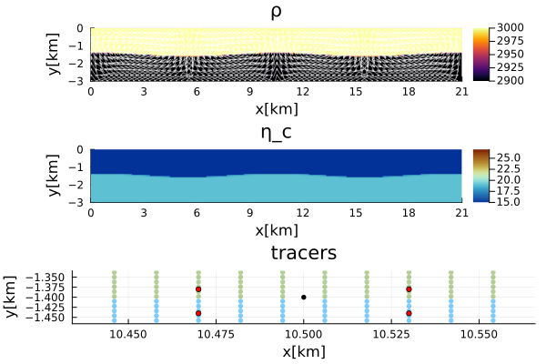

# [RTI - Growth Rate Benchmark](https://github.com/GeoSci-FFM/GeoModBox.jl/blob/main/examples/StokesEquation/2D/RTI_GrowthRate.jl)

This script benchmarks the **growth rate of a Rayleigh–Taylor instability**, following *Gerya (2009)*.  
The benchmark is based on the analytical solution by *Ramberg (1968)* and is used to evaluate the accuracy of the velocity field in a purely gravity-driven flow.  

The script calculates the **diapiric growth rate** at the tip of the perturbation for different **perturbation amplitudes** ($\delta A$), **wavelengths** ($\lambda$), and **viscosity ratios** ($\eta_r$).  
The numerical solution is plotted alongside the analytical one, which is arbitrarily scaled by certain constants for visualization purposes, following *Gerya (2009)*.  

The amplitude of the cosine perturbation is defined as:

$\begin{equation}
\delta A = \cos\left( 2\pi \frac{x_m - L/2}{\lambda} \right),
\end{equation}$

where $x_m$ is the x-coordinate of the marker, and $L$ is the length of the model domain.  
The perturbation is applied to the tracers by adding the perturbation amplitude to the y-coordinate of an initially equally distributed or randomly perturbed tracer field.  

Using a **bilinear interpolation scheme** to map tracer properties onto the regular numerical grid, one can test how accurately the Stokes solver reproduces the analytical growth rate of the diapiric instability.  
However, care must be taken when defining the initial tracer positions or when averaging tracer properties onto the grid to avoid numerical artifacts.  

--- 

Let's load the required modules first. 

```Julia
using Plots
using ExtendableSparse
using GeoModBox
using GeoModBox.InitialCondition, GeoModBox.MomentumEquation.TwoD
using GeoModBox.AdvectionEquation.TwoD
using GeoModBox.Tracers.TwoD
using Base.Threads
using Printf, LinearAlgebra
```

In the following some parameters regarding the visualization can be edited. 


```Julia
# Plot fields for each individual model - yes or no
plot_fields     =:no
# Save final figure
save_fig        = 1

Pl  =   (
    qinc    =   5, 
    qsc     =   100*(60*60*24*365.25)*5e1,
)
```

The parameters for an initial cosinusoidal tracer perturbation are defined for a two-layer model. For benchmarking purposes, a range of wavelengths is specified. One can define, if the density is interpolated from the tracers to the centroids or the vertices. 

```Julia
# Define Initial Condition ========================================== #
# Density Averaging ---
#   centroids or vertices
ρavg        =   :centroids
nm          =   5
Ini         =   (p=:RTI,) 
# Perturbation wavelength [ m ]
λᵣ          =   [1 3 4 5 6 8 10 12 14]*1e3
# ------------------------------------------------------------------- #
```

The physical parameters are now defined, including the range of viscosity ratios between the two layers. 

```Julia
# Physics =========================================================== #
g           =   9.81                    #   Gravitational acceleration [ m/s^2 ]
# Lower layer ---
ρ₁          =   2900.0                  #   Density composition 1 [ kg/m^3 ]
η₁          =   1e19                    #   Viscosity composition 1 [ Pa s]
# Upper layer --- 
ρ₀          =   3000.0                  #   Density composition 0 [ kg/m^3 ]
# ---
ρ           =   [ρ₀,ρ₁]                 #   Density for phases
ηᵣ          =   [1e-6 1 10 100 500]     #   Viscosity ratio
phase       =   [0,1]
# ------------------------------------------------------------------- #
```

In the following, the parameters for the analytical solution are initialized, some scaling parameters (b1 and b2) for the visualization, and the divisional factor for the perturbation wavelength (`delfac`)

```Julia
# Plotting factors following Gerya (2009) --------------------------- #
b1          =   [0.5 1 5 50 250]
b2          =   [0.2 0.15 0.1 0.05 0]
# Divisional factor of the amplitude following Gerya (2009) --------- #
delfac      =   [15 150 1500]
ms          =   zeros(3)
ms          =   [8,6,4,2]
mc          =   ["black","red","yellow","green"]
# Analytical Solution ----------------------------------------------- #
λₐ          =   collect(LinRange(0.5,18,51)).*1e3        # [ m ]
ϕ₁          =   zeros(length(λₐ))
ϕ₂          =   copy(ϕ₁)
c11         =   copy(ϕ₁)
d12         =   copy(ϕ₁)
i21         =   copy(ϕ₁)
j22         =   copy(ϕ₁)
# Arrays ---
PP  =   (
    ϕ       =   [0.0],
    K       =   [0.0],
    Q       =   [0.0],
    ϕₐ      =   zeros(length(λₐ)),
    Kₐ      =   zeros(length(λₐ),length(ηᵣ)),
)
# ------------------------------------------------------------------- #
# Plot Settings ===================================================== #
q   =   plot()
# ------------------------------------------------------------------- #
```

Define the geometry of the model domain. 

```Julia
# Geometry ========================================================== #
M       =   Geometry(
    ymin    =   -3.0e3,     # [ m ]
    ymax    =   0.0,
    xmin    =   0.0,
)
# ------------------------------------------------------------------- #
```

If multiple perturbation amplitudes are specified, a loop is initiated over them. For each amplitude, a nested loop iterates over different viscosity contrasts. Within that loop the viscosity for the upper layer is calculated. 

```Julia
for k in eachindex(delfac)
    @printf("δA = %g\n",delfac[k])
    for i in eachindex(ηᵣ)
        # Physics =================================================== #
        # 0 - upper layer; 1 - lower layer
        η₀      =   η₁*ηᵣ[i]        #   Viscosity composition 0 [ Pa s ]
        η       =   [η₀,η₁]         #   Viscosity for phases 
        @printf("   η₀ = %g\n",η₀)
        # ----------------------------------------------------------- #
```

The variables required for the analytical solution are calculated for each model configuration. 

```Julia
        # Analytical Solution ======================================= #
        @. ϕ₁      =   (2*π*((M.ymax-M.ymin)/2))/λₐ
        @. ϕ₂      =   (2*π*((M.ymax-M.ymin)/2))/λₐ
        @. c11     =   (η₀*2*ϕ₁^2)/
                        (η₁*(cosh(2*ϕ₁) - 1 - 2*ϕ₁^2)) - 
                        (2*ϕ₂^2)/
                        (cosh(2*ϕ₂) - 1 - 2*ϕ₂^2)
        @. d12     =   (η₀*(sinh(2*ϕ₁) - 2*ϕ₁))/
                        (η₁*(cosh(2*ϕ₁) - 1 - 2*ϕ₁^2)) + 
                        (sinh(2*ϕ₂) - 2*ϕ₂)/
                        (cosh(2*ϕ₂) - 1 - 2*ϕ₂^2)
        @. i21     =   (η₀*ϕ₂*(sinh(2*ϕ₁) + 2*ϕ₁))/
                        (η₁*(cosh(2*ϕ₁) - 1 - 2*ϕ₁^2)) + 
                        (ϕ₂*(sinh(2*ϕ₂) + 2*ϕ₂))/
                        (cosh(2*ϕ₂) - 1 - 2*ϕ₂^2)
        @. j22     =   (η₀*2*ϕ₁^2*ϕ₂)/
                        (η₁*(cosh(2*ϕ₁) - 1 - 2*ϕ₁^2)) - 
                        (2*ϕ₂^3)/
                        (cosh(2*ϕ₂) - 1 - 2*ϕ₂^2)
        
        @. PP.Kₐ[:,i]   =   -d12/(c11*j22 - d12*i21)
        @. PP.ϕₐ        =   ϕ₁
```

Because the analytical solution is independent of perturbation amplitude, the loop over different amplitudes is performed separately. Within that loop, both the model domain and perturbation amplitude are defined for each configuration. 

```Julia
        for j in eachindex(λᵣ)
            # Perturbation properties ---
            λ           =   λᵣ[j]                           #   [ m ]
            δA          =   -(M.ymax-M.ymin)/2/delfac[k]    #   Amplitude [ m ]
            @printf("δA = %g\n",δA)
            # ---
            ar          =   Int64(round(2 * λ / (M.ymax-M.ymin)))  #   aspect ratio
            M.xmax      =   (M.ymax-M.ymin)*ar
            @printf("       xmax: %g \n",M.xmax)
            @printf("       λ = %g\n",λ)
            # ------------------------------------------------------- #
            # Grid ================================================== # 
            NC  =   (
                x   =   50*ar,
                y   =   50,
            )
            NV  =   (
                x   =   NC.x + 1,
                y   =   NC.y + 1,
            )
            Δ       =   GridSpacing(
                x   =   (M.xmax - M.xmin)/NC.x,
                y   =   (M.ymax - M.ymin)/NC.y,
            )
            x       =   (
                c   =   LinRange(M.xmin+Δ.x/2,M.xmax-Δ.x/2,NC.x),
                ce  =   LinRange(M.xmin - Δ.x/2.0, M.xmax + Δ.x/2.0, NC.x+2),
                v   =   LinRange(M.xmin,M.xmax,NV.x),
            )
            y       =   (
                c   =   LinRange(M.ymin+Δ.y/2,M.ymax-Δ.y/2,NC.y),
                ce  =   LinRange(M.ymin - Δ.x/2.0, M.ymax + Δ.x/2.0, NC.y+2),
                v   =   LinRange(M.ymin,M.ymax,NV.y),
            )
            x1      =   (
                c2d     =   x.c .+ 0*y.c',
                v2d     =   x.v .+ 0*y.v', 
                vx2d    =   x.v .+ 0*y.ce',
                vy2d    =   x.ce .+ 0*y.v',
            )
            x   =   merge(x,x1)
            y1      =   (
                c2d     =   0*x.c .+ y.c',
                v2d     =   0*x.v .+ y.v',
                vx2d    =   0*x.v .+ y.ce',
                vy2d    =   0*x.ce .+ y.v',
            )
            y   =   merge(y,y1)
            # ------------------------------------------------------- #
```

Let's initialize all the required data array in the following. 

```Julia
            # Allocation ============================================ #
            D       =   (
                ρ       =   zeros(Float64,(NC...)),
                ρv      =   zeros(Float64,NV...),
                ρe      =   zeros(Float64,(NC.x+2,NC.y+2)),
                p       =   zeros(Float64,(NC...)),
                cp      =   zeros(Float64,(NC...)),
                vx      =   zeros(Float64,(NV.x,NV.y+1)),
                vy      =   zeros(Float64,(NV.x+1,NV.y)),    
                Pt      =   zeros(Float64,(NC...)),
                vxc     =   zeros(Float64,(NC...)),
                vyc     =   zeros(Float64,(NC...)),
                vc      =   zeros(Float64,(NC...)),
                wte     =   zeros(Float64,(NC.x+2,NC.y+2)),
                wtv     =   zeros(Float64,(NV.x,NV.y)),
                ηc      =   zeros(Float64,NC...),
                ηce     =   zeros(Float64,(NC.x+2,NC.y+2)),
                ηv      =   zeros(Float64,NV...),
            )
            # ------------------------------------------------------- #
            # Needed for the defect correction solution ---
            divV        =   zeros(Float64,NC...)
            ε           =   (
                xx      =   zeros(Float64,NC...), 
                yy      =   zeros(Float64,NC...), 
                xy      =   zeros(Float64,NV...),
            )
            τ           =   (
                xx      =   zeros(Float64,NC...), 
                yy      =   zeros(Float64,NC...), 
                xy      =   zeros(Float64,NV...),
            )
            # ------------------------------------------------------- #
```

Also one needs to set the velocity boudnary conditions. 

```Julia
            # Boundary Conditions =================================== #
            VBC     =   (
                type    =   (E=:freeslip,W=:freeslip,S=:noslip,N=:noslip),
                val     =   (E=zeros(NV.y),W=zeros(NV.y),S=zeros(NV.x),N=zeros(NV.x)),
            )
            # ------------------------------------------------------- #
```

To setup the perturbation, the markers are initialized in the following. 

```Julia
            # Tracer Advection ====================================== #
            nmx,nmy     =   nm,nm
            noise       =   0
            nmark       =   nmx*nmy*NC.x*NC.y
            Aparam      =   :phase
            MPC         =   (
                c       =   zeros(Float64,(NC.x,NC.y)),
                v       =   zeros(Float64,(NV.x,NV.y)),
                th      =   zeros(Float64,(nthreads(),NC.x,NC.y)),
                thv     =   zeros(Float64,(nthreads(),NV.x,NV.y)),
            )
            MAVG        = (
                PC_th   =   [similar(D.wte) for _ = 1:nthreads()],  # per thread
                PV_th   =   [similar(D.ηv) for _ = 1:nthreads()],   # per thread
                wte_th  =   [similar(D.wte) for _ = 1:nthreads()],  # per thread
                wtv_th  =   [similar(D.wtv) for _ = 1:nthreads()],  # per thread
            )
            # Initialize Tracer Position ---
            Ma      =   IniTracer2D(Aparam,nmx,nmy,Δ,M,NC,noise,Ini.p,phase;λ,δA)
            # Count tracer per cell ---
            CountMPC(Ma,nmark,MPC,M,x,y,Δ,NC,NV,1)
            # Interpolate density --- 
            if ρavg==:centroids
                # Interpolate density from markers to cell ---
                Markers2Cells(Ma,nmark,MAVG.PC_th,D.ρe,MAVG.wte_th,D.wte,x,y,Δ,Aparam,ρ)
                D.ρ     .=   D.ρe[2:end-1,2:end-1]  
            elseif ρavg==:vertices 
                # Interpolate density from markers to vertices ---
                Markers2Vertices(Ma,nmark,MAVG.PV_th,D.ρv,MAVG.wtv_th,D.wtv,x,y,Δ,Aparam,ρ)
                for i = 1:NC.x
                    D.ρ[i,:]    .=   (D.ρv[i,1:end-1] .+ 
                                        D.ρv[i,2:end,:] .+ 
                                        D.ρv[i+1,1:end-1] .+ 
                                        D.ρv[i+1,2:end])./4
                end
            end    
            # Interpolate Viscosity ---
            Markers2Cells(Ma,nmark,MAVG.PC_th,D.ηce,MAVG.wte_th,D.wte,x,y,Δ,Aparam,η)
            D.ηc    .=   D.ηce[2:end-1,2:end-1]
            Markers2Vertices(Ma,nmark,MAVG.PV_th,D.ηv,MAVG.wtv_th,D.wtv,x,y,Δ,Aparam,η) 
            # ------------------------------------------------------- #
```

The parameters for solving the linear system using the defect correction method are now defined. 

```Julia
            # System of Equations =================================== #
            # Iterations
            niter       =   50
            ϵ           =   1e-10
            # Numbering, without ghost nodes! ---
            off    = [  NV.x*NC.y,                          # vx
                        NV.x*NC.y + NC.x*NV.y,              # vy
                        NV.x*NC.y + NC.x*NV.y + NC.x*NC.y]  # Pt

            Num    =    (
                Vx  =   reshape(1:NV.x*NC.y, NV.x, NC.y), 
                Vy  =   reshape(off[1]+1:off[1]+NC.x*NV.y, NC.x, NV.y), 
                Pt  =   reshape(off[2]+1:off[2]+NC.x*NC.y,NC...),
                        )
            δx      =   zeros(maximum(Num.Pt))
            F       =   zeros(maximum(Num.Pt))
            # Residuals ---
            Fm     =    (
                x       =   zeros(Float64,NV.x, NC.y), 
                y       =   zeros(Float64,NC.x, NV.y)
            )
            FPt     =   zeros(Float64,NC...)      
            # ------------------------------------------------------- #
```

The momentum and mass conservation equations are now solved. 

```Julia
            # Momentum Equation ===
            D.vx    .=  0.0
            D.vy    .=  0.0
            D.Pt    .=  0.0
            for iter=1:niter
                # Initial Residual -------------------------------------- #
                Residuals2D!(D,VBC,ε,τ,divV,Δ,D.ηc,D.ηv,g,Fm,FPt)
                F[Num.Vx]   =   Fm.x[:]
                F[Num.Vy]   =   Fm.y[:]
                F[Num.Pt]   =   FPt[:]
                @printf("||R|| = %1.4e\n", norm(F)/length(F))
                norm(F)/length(F) < ϵ ? break : nothing
                # Assemble Coefficients ================================= #
                K       =   Assembly(NC, NV, Δ, D.ηc, D.ηv, VBC, Num)
                # ------------------------------------------------------- #
                # Solution of the linear system ========================= #
                δx      =   - K \ F
                # ------------------------------------------------------- #
                # Update Unknown Variables ============================== #
                D.vx[:,2:end-1]     .+=  δx[Num.Vx]
                D.vy[2:end-1,:]     .+=  δx[Num.Vy]
                D.Pt                .+=  δx[Num.Pt]
            end
```

For visualization purposes, the centroid velocities are computed.

```Julia
            # ------------------------------------------------------- #
            # Get the velocity on the centroids ---
            for i = 1:NC.x
                for j = 1:NC.y
                    D.vxc[i,j]  = (D.vx[i,j+1] + D.vx[i+1,j+1])/2
                    D.vyc[i,j]  = (D.vy[i+1,j] + D.vy[i+1,j+1])/2
                end
            end
            @. D.vc        = sqrt(D.vxc^2 + D.vyc^2)
            # ---
``` 

In the following, one defines the parameters to calculate the rising velocity at the tip of the perturbation in the center of the model domain. The vertical velocity at the perturbation tip is calculated using bilinear interpolation from surrounding velocity grid points. 

```Julia
            # Calculate diapir growth rate ---
            xwave       =   (M.xmax-M.xmin)/2  
            ywave       =   (M.ymax-M.ymin)/2 + δA

            xn          =   Int64(floor((xwave+Δ.x/2)/Δ.x))
            yn          =   Int64(floor(((M.ymax-M.ymin)-ywave)/Δ.y)) + 1

            dx          =   (xwave+Δ.x/2)/Δ.x - xn
            dy          =   abs(((M.ymax-M.ymin)-ywave)/Δ.y - yn)

            wvy     =   (1.0-dx)*(1.0-dy) * D.vy[xn+1,yn] + 
                            dx*(1.0-dy) * D.vy[xn+2,yn] + 
                            (1.0-dx)*dy * D.vy[xn+1,yn+1] + 
                            dx*dy * D.vy[xn+2,yn+1]

            PP.Q[1] =   (ρ₀-ρ₁)*(M.ymax-M.ymin)/2.0*g/2.0/η₁
            PP.K[1] =   abs(wvy)/abs(δA)/PP.Q[1]
            PP.ϕ[1] =   2*π*(M.ymax-M.ymin)/2/λ
```

If wanted, the density, tracer, and viscosity fields are plotted. To verify the position of the perturbation tip used in velocity interpolation, the tip (black circle) and surrounding vertical velocity grid points (red circles) are plotted on the tracer field. The plot is zoomed in for better visualization. 

```Julia
            if plot_fields==:yes
                p = heatmap(x.c./1e3,y.c./1e3,D.ρ',color=:inferno,
                            xlabel="x[km]",ylabel="y[km]",colorbar=true,
                            title="ρ",
                            aspect_ratio=:equal,xlims=(M.xmin/1e3, M.xmax/1e3),                             
                            ylims=(M.ymin/1e3, M.ymax/1e3),
                            layout=(3,1),subplot=1)
                quiver!(p,x.c2d[1:Pl.qinc:end,1:Pl.qinc:end]./1e3,
                    y.c2d[1:Pl.qinc:end,1:Pl.qinc:end]./1e3,
                    quiver=(D.vxc[1:Pl.qinc:end,1:Pl.qinc:end].*Pl.qsc,
                            D.vyc[1:Pl.qinc:end,1:Pl.qinc:end].*Pl.qsc),        
                    la=0.5,color="white",layout=(3,1),subplot=1)
                scatter!(p,Ma.x[1:end]./1e3,Ma.y[1:end]./1e3,
                    ms=3,ma=0.5,mc=Ma.phase[1:end],markerstrokewidth=0.0,
                    xlabel="x[km]",ylabel="y[km]",colorbar=true,
                    title="tracers",label="",
                    xlims=(xwave/1e3-Δ.x/1e3*1.1, xwave/1e3+Δ.x/1e3*1.1), 
                    ylims=(-ywave/1e3-Δ.y/1e3*1.1, -ywave/1e3+Δ.y/1e3*1.1),
                    layout=(3,1),subplot=3)
                heatmap!(p,x.c./1e3,y.c./1e3,log10.(abs.(D.ηc)'),
                            color=reverse(cgrad(:roma)),
                            xlabel="x[km]",ylabel="y[km]",title="η_c",
                            clims=(15,27),
                            aspect_ratio=:equal,xlims=(M.xmin/1e3, M.xmax/1e3),                             
                            ylims=(M.ymin/1e3, M.ymax/1e3),colorbar=true,
                            layout=(2,1),subplot=2)
                scatter!(p,(xwave/1.0e3,-ywave/1.0e3),
                        markersize=3,label="",color=:black,
                        layout=(3,1),subplot=3)
                scatter!(p,(x1.vy2d[xn+1,yn]/1e3,y1.vy2d[xn+1,yn]/1e3),
                        markersize=3,label="",color=:red,
                        layout=(3,1),subplot=3)
                scatter!(p,(x1.vy2d[xn+2,yn]/1e3,y1.vy2d[xn+2,yn]/1e3),
                        markersize=3,label="",color=:red,
                        layout=(3,1),subplot=3)
                scatter!(p,(x1.vy2d[xn+1,yn+1]/1e3,y1.vy2d[xn+1,yn+1]/1e3),
                        markersize=3,label="",color=:red,
                        layout=(3,1),subplot=3)
                scatter!(p,(x1.vy2d[xn+2,yn+1]/1e3,y1.vy2d[xn+2,yn+1]/1e3),
                        markersize=3,label="",color=:red,
                        layout=(3,1),subplot=3)
                display(p)
            end
            scatter!(q,(PP.ϕ[1],b1[i]*PP.K[1] + b2[i]),
                ms=ms[k],markershape=:circle,label="",
                color=:black)
        end # Loop λ - j
```



**Figure 1. Example of a RTI model.** Top: Centroid velocity arrows on top of the density field. Middle: Centroid viscosity. Bottom: Zoom of the tracer field on the tip of the perturbation at the center of the model domain. The black tracer marks the tip, and the red tracer mark the vertical velocity nodes from which the vertical velocity is interpolated onto the tip. This example uses a perturbation of $A = h_{1}/15$ and a wavelength of 12 km. The model includes 50 centroids in the vertical direction. The number of horizontal centroids is chosen such that the resolution remains consistent in both the horizontal and vertical directions for all benchmark models. 

Finally, the rising velocity is plotted over the analytical solution for the given range of viscosity contrasts. 

```Julia
        if k == 1
            plot!(q,PP.ϕₐ,b1[i].*PP.Kₐ[:,i] .+ b2[i],
                        xlabel="ϕ₁ = 2πh₁/λ",
                        ylabel="b₁K + b₂", 
                        title="",
                        xlims=(0.5,4),ylims=(0.05,0.5),
                        label=string("ηᵣ = ", ηᵣ[i]))
        end
    end # Loop ηᵣ - i 
end # Loop delfac - k 
```

The final figure is stored in the given directory. 

```Julia
if save_fig == 1
    savefig(q,string("./examples/StokesEquation/2D/Results/RTI_Growth_Rate_nmx_",nm,
                            "_nmy_",nm,".png"))
else
    display(q)
end
```


**Figure 2. RTI Growth Rate.** Growth rate of an initial cosinusoidal perturbation in a two-layer system across various wavelengths $\lambda$. The growth rate is arbitrarily scaled using $b_1$ and $b_2$ for visualization, following the approach of Gerya (2000). The lines are the analytical solutions for different viscosity ratios $\eta_r$ and the markers show the corresponding numerical results for models with decreasing amplitudes (black - scaled by 15, red - scaled by 150, yellow - scaled by 1500). The rising velocity is numerically calculated following the approach shown in Figure 1. 


**Figure 3. RTI Resolution Test.** Resolution test for the RTI growth rate using a fixed layer thickness (1500 km), a fixed wavelength $\lambda = 4000 \text{ km}$ and fixed number of markers per cell (5x5) for different horizontal and vertical grid resolutions $\left(nc_x,nc_y\right)$, different perturbation amplitudes $\left(\delta{A}\right)$ (colored markers), different viscosity ratios $\eta_r$, and without (top row) and with (bottom row) additional noise ontop of the initial marker position (before assigning the layer phases). The viscosity is interpolate from the tracers to the centroids and the vertices using an arithmetic mean. 