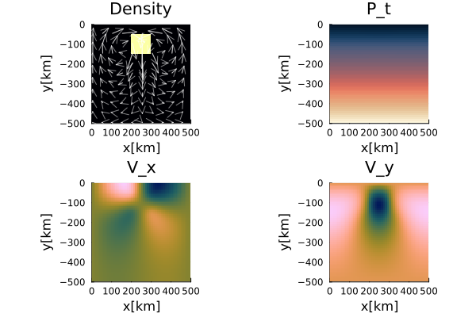

# Falling Block; Defect Correction

This documentation presents two examples illustrating the defect-correction solution procedure for the incompressible Stokes equations. The first example considers an instantaneous isoviscous problem and introduces the iterative solution strategy in its simplest form. The second example extends this approach to a time-dependent variable-viscosity problem with tracer-based material advection. Together, the examples demonstrate how the same defect-correction algorithm naturally extends from a linear benchmark to a heterogeneous, time-dependent flow problem. For more details on the falling block benchmark setup, please refer to the [documentation](./FallingBlockBenchmark.md). 

For more details on the defect correction method, please refer to the [momentum equation documentation](../../theory/MomentumMain.md). 

For more details on the tracer advection method, please refer to the [advection scheme documentation](../../theory/AdvectMain.md). 

For more details on initializing the model using tracers, please refer to the [initialization documentation](../../Ini.md). 

---

# [Falling Block - constant $\eta$](https://github.com/GeoSci-FFM/GeoModBox.jl/blob/main/examples/StokesEquation/2D/FallingBlockConstEta_DC.jl)

This is an example to solve the instantaneous falling block problem assuming a constant viscosity and using the defect correction method. Since the viscosity is spatially constant, the coefficient matrix of the Stokes system remains unchanged throughout the solution process. Consequently, the matrix needs to be assembled and factorized only once, making this example an ideal introduction to the defect-correction method.

---

First, one needs to load the corresponding modules. 

```Julia
using Plots, ExtendableSparse
using GeoModBox.InitialCondition, GeoModBox.MomentumEquation.TwoD
using Printf, LinearAlgebra
using TimerOutputs
```

Now one can define the parameters to setup the model and some plotting parameters.

```Julia
to          =   TimerOutput()
# =================================================================== #
# Script to solve the instantaneous solution of the falling block     #
# problem using the defect correction solution method.                #
# =================================================================== #
@timeit to "Ini" begin
# Define Initial Condition ========================================== #
# Density --- 
#   1) block
Ini         =   (p=:block,) 
# ------------------------------------------------------------------- #
# Plot Settings ===================================================== #
Pl  =   (
    qinc    =   5,
    qsc     =   100*(60*60*24*365.25)*5e1
)
# ------------------------------------------------------------------- #
```

In the following, one needs to define the model geometry and the numerical grid parameters. 

```Julia
# Geometry ========================================================== #
M       =   (
    xmin    =   0.0,
    xmax    =   500.0e3,    # [ m ]
    ymin    =   -500.0e3,   # [ m ]
    ymax    =   0.0,
)
# ------------------------------------------------------------------- #
# Grid ============================================================== #
NC      =   (
    x   =   50, 
    y   =   50,
)
NV      =   (
    x   =   NC.x + 1,
    y   =   NC.y + 1,
)
Δ       =   (
    x   =   (M.xmax - M.xmin)/NC.x,
    y   =   (M.ymax - M.ymin)/NC.y,
)
x       =   (
    c   =   LinRange(M.xmin+Δ.x/2,M.xmax-Δ.x/2,NC.x),
    ce  =   LinRange(M.xmin - Δ.x/2.0, M.xmax + Δ.x/2.0, NC.x+2),
    v   =   LinRange(M.xmin,M.xmax,NV.x),
)
y       =   (
    c   =   LinRange(M.ymin+Δ.y/2,M.ymax-Δ.y/2,NC.y),
    ce  =   LinRange(M.ymin - Δ.y/2.0, M.ymax + Δ.y/2.0, NC.y+2),
    v   =   LinRange(M.ymin,M.ymax,NV.y),
)
x1      =   (
    c2d     =   x.c .+ 0*y.c',
    v2d     =   x.v .+ 0*y.v', 
    vx2d    =   x.v .+ 0*y.ce',
    vy2d    =   x.ce .+ 0*y.v',
)
x   =   merge(x,x1)
y1      =   (
    c2d     =   0*x.c .+ y.c',
    v2d     =   0*x.v .+ y.v',
    vx2d    =   0*x.v .+ y.ce',
    vy2d    =   0*x.ce .+ y.v',
)
y   =   merge(y,y1)
# ------------------------------------------------------------------- #
```

Next, define the physical parameters of the problem and initialize the required data arrays. 

```Julia
# Physics =========================================================== #
g       =   9.81            #   Gravitational acceleration

η₀      =   1.0e21          #   Reference Viscosity

ρ₀      =   3200.0          #   Background density
ρ₁      =   3300.0          #   Block density
ρ       =   [ρ₀,ρ₁] 

phase   =   [0,1]
# ------------------------------------------------------------------- #
# Allocation ======================================================== #
D   =   (
    vx      =   zeros(Float64,NV.x,NC.y+2),
    vy      =   zeros(Float64,NC.x+2,NV.y),
    Pt      =   zeros(Float64,NC...),
    p       =   zeros(Float64,NC...),
    p_ex    =   zeros(Float64,NC.x+2,NC.y+2),
    ρ       =   zeros(Float64,NC...),
    vxc     =   zeros(Float64,NC...),
    vyc     =   zeros(Float64,NC...),
    vc      =   zeros(Float64,NC...),
)
# Needed for the defect correction solution ---
divV        =   zeros(Float64,NC...)
ε           =   (
    xx      =   zeros(Float64,NC...), 
    yy      =   zeros(Float64,NC...), 
    xy      =   zeros(Float64,NV...),
)
τ           =   (
    xx      =   zeros(Float64,NC...), 
    yy      =   zeros(Float64,NC...), 
    xy      =   zeros(Float64,NV...),
)
# ------------------------------------------------------------------- #
```

The velocity boundary conditions and the initial condition are set in the following. As this example computes only the instantaneous solution, tracers are not required, and the field is initialized using a predefined phase distribution function. 

```Julia
# Boundary Conditions =============================================== #
VBC     =   (
    type    =   (E=:freeslip,W=:freeslip,S=:freeslip,N=:freeslip),
    val     =   (E=zeros(NV.y),W=zeros(NV.y),S=zeros(NV.x),N=zeros(NV.x),
                vxE=zeros(NC.y),vxW=zeros(NC.y),vyS=zeros(NC.x),vyN=zeros(NC.x)),
)
# ------------------------------------------------------------------- #
# Initial Condition ================================================= #
IniPhase!(Ini.p,D,M,x,y,NC;phase)
for i in eachindex(phase)
    D.ρ[D.p.==phase[i]] .= ρ[i]
end
# ------------------------------------------------------------------- #
```

To solve the system of equations using the defect correction method, one needs to define the numbering of the nodes, the residual and correction vector. 

```Julia
# System of Equations =============================================== #
# Iterations --- 
niter      =   50
atol       =   1e-8        #   Absolute tolerance
rtol       =   1e-5        #   # Relative residual tolerance; RMrel = RM/R0
RM         =   0.0         #   Initialize absolute residual    
RMrel      =   0.0         #   Initialize relative residual 
# Numbering, without ghost nodes! ---
off    = [  NV.x*NC.y,                          # vx
            NV.x*NC.y + NC.x*NV.y,              # vy
            NV.x*NC.y + NC.x*NV.y + NC.x*NC.y]  # Pt

Num    =    (
Vx  =   reshape(1:NV.x*NC.y, NV.x, NC.y), 
Vy  =   reshape(off[1]+1:off[1]+NC.x*NV.y, NC.x, NV.y), 
Pt  =   reshape(off[2]+1:off[2]+NC.x*NC.y,NC...),
        )
ndof    =   maximum(Num.Pt)        
K       =   ExtendableSparseMatrix(ndof,ndof)      
δx      =   zeros(maximum(Num.Pt))
F       =   zeros(maximum(Num.Pt))
# Residuals ---
Fm     =    (
    x       =   zeros(Float64,NV.x, NC.y), 
    y       =   zeros(Float64,NC.x, NV.y)
)
FPt     =   zeros(Float64,NC...)  
R0      =   0
# ------------------------------------------------------------------- #
end
```

Before starting the defect-correction iterations, the coefficient matrix is assembled and factorized. The initial residual is then evaluated using the zero velocity and pressure fields. 

```Julia
@timeit to "Solution Iteration" begin
@timeit to "Assembly" begin
K       =   Assemblyc(NC, NV, Δ, η₀, VBC, Num)
Kfac    =   lu(K.cscmatrix)
end
# Initial Residual -------------------------------------------------- #
D.vx    .=  0.0
D.vy    .=  0.0
D.Pt    .=  0.0    
```

During each iteration, the residual (or defect) of the current solution is evaluated. Solving the linear system yields a correction vector that is added to the current velocity and pressure fields. The iterations continue until the absolute or relative residual satisfies the prescribed convergence criterion.

```Julia
for iter = 1:niter
    @timeit to "Residual" begin
    Residuals2Dc!(D,VBC,ε,τ,divV,Δ,η₀,g,Fm,FPt)
    F[Num.Vx]   =   Fm.x[:]
    F[Num.Vy]   =   Fm.y[:]
    F[Num.Pt]   =   FPt[:]
    RM          =   norm(F)/length(F)
    if iter == 1
        R0 = RM
    end
    RMrel       =   RM/R0
    @printf("   MCE %2d: ||R|| = %1.4e, ||R||/||R₀|| = %1.4e\n",iter,RM,RMrel)
    (RM < atol || RM/R0 < rtol) && break
    end
    @timeit to "Solution" begin
    δx      .=   - (Kfac \ F)
    end
    # --------------------------------------------------------------- #
    # Update Unknown Variables ====================================== #
    D.vx[:,2:end-1]     .+=  δx[Num.Vx]
    D.vy[2:end-1,:]     .+=  δx[Num.Vy]
    D.Pt                .+=  δx[Num.Pt]
end
end
```

For visualization purposes, the centroid velocity is calculated. Subsequently, the density, velocity components, and pressure fields of the instantaneous solution are plotted. The final figure is stored in the results directory. 

```Julia
# ------------------------------------------------------------------- #
# Get the velocity on the centroids ---
for i = 1:NC.x
    for j = 1:NC.y
        D.vxc[i,j]  = (D.vx[i,j+1] + D.vx[i+1,j+1])/2
        D.vyc[i,j]  = (D.vy[i+1,j] + D.vy[i+1,j+1])/2
    end
end
@. D.vc        = sqrt(D.vxc^2 + D.vyc^2)
# ---
p = heatmap(x.c./1e3,y.c./1e3,D.ρ',color=:inferno,
        xlabel="x[km]",ylabel="y[km]",colorbar=false,
        title="Density",
        aspect_ratio=:equal,xlims=(M.xmin/1e3, M.xmax/1e3), 
        ylims=(M.ymin/1e3, M.ymax/1e3),
        layout=(2,2),subplot=1)
quiver!(p,x.c2d[1:Pl.qinc:end,1:Pl.qinc:end]./1e3,
        y.c2d[1:Pl.qinc:end,1:Pl.qinc:end]./1e3,
        quiver=(D.vxc[1:Pl.qinc:end,1:Pl.qinc:end].*Pl.qsc,
        D.vyc[1:Pl.qinc:end,1:Pl.qinc:end].*Pl.qsc), 
        la=0.5,
        color="white",layout=(2,2),subplot=1)
heatmap!(p,x.c./1e3,y.c./1e3,D.vxc',
        xlabel="x[km]",ylabel="y[km]",colorbar=false,
        title="V_x",color=cgrad(:batlow),
        aspect_ratio=:equal,xlims=(M.xmin/1e3, M.xmax/1e3),
        ylims=(M.ymin/1e3, M.ymax/1e3),
        layout=(2,2),subplot=3)
heatmap!(p,x.c./1e3,y.c./1e3,D.vyc',
        xlabel="x[km]",ylabel="y[km]",colorbar=false,
        title="V_y",color=cgrad(:batlow),
        aspect_ratio=:equal,xlims=(M.xmin/1e3, M.xmax/1e3),
        ylims=(M.ymin/1e3, M.ymax/1e3),
        layout=(2,2),subplot=4)
heatmap!(p,x.c./1e3,y.c./1e3,D.Pt',
        xlabel="x[km]",ylabel="y[km]",colorbar=false,
        title="P_t",color=cgrad(:lipari),
        aspect_ratio=:equal,xlims=(M.xmin/1e3, M.xmax/1e3),
        ylims=(M.ymin/1e3, M.ymax/1e3),
        layout=(2,2),subplot=2)
display(p)

savefig(p,string("./examples/StokesEquation/2D/Results/FallingBlockConstEta_instantaneous_DC.png"))
display(to)
```



**Figure 1. Instantaneous solution of an isoviscous falling block problem.** 

---
---

# [Falling Block-variable $\eta$](https://github.com/GeoSci-FFM/GeoModBox.jl/blob/main/examples/StokesEquation/2D/FallingBlockVarEta_DC.jl)

This is an example to solve the falling block problem assuming a variable viscosity and using the defect correction method. The advection is performed using tracers

---

Let's load the necessary modules first. 

```Julia
using Plots
using ExtendableSparse
using GeoModBox.InitialCondition, GeoModBox.MomentumEquation.TwoD
using GeoModBox.AdvectionEquation.TwoD
using GeoModBox.Tracers.TwoD
using Base.Threads
using Printf, LinearAlgebra
using TimerOutputs
```

As in the previous example, one needs to define the initial configuration, some plotting parameters, the model geometry, and the numerical grid at first. 

```Julia
to          =   TimerOutput()
@timeit to "Ini" begin
# Define Initial Condition ========================================== #
#   1) block
Ini         =   (p=:block,) 
# ------------------------------------------------------------------- #
# Plot Settings ===================================================== #
Pl  =   (
    qinc    =   4,
    mainc   =   1,
    qsc     =   100*(60*60*24*365.25)*5e1
)
# ------------------------------------------------------------------- #
# Geometry ========================================================== #
M       =   (
    xmin    =   0.0,
    xmax    =   500.0e3,    # [ m ]
    ymin    =   -500.0e3,   # [ m ]
    ymax    =   0.0,
)
# -------------------------------------------------------------------- #
# Grid =============================================================== #
NC      =   (
    x   =   50, 
    y   =   50,
)
NV      =   (
    x   =   NC.x + 1,
    y   =   NC.y + 1,
)
Δ       =   (
    x   =   (M.xmax - M.xmin)/NC.x,
    y   =   (M.ymax - M.ymin)/NC.y,
)
x       =   (
    c   =   LinRange(M.xmin+Δ.x/2,M.xmax-Δ.x/2,NC.x),
    ce  =   LinRange(M.xmin - Δ.x/2.0, M.xmax + Δ.x/2.0, NC.x+2),
    v   =   LinRange(M.xmin,M.xmax,NV.x),
)
y       =   (
    c   =   LinRange(M.ymin+Δ.y/2,M.ymax-Δ.y/2,NC.y),
    ce  =   LinRange(M.ymin - Δ.y/2.0, M.ymax + Δ.y/2.0, NC.y+2),
    v   =   LinRange(M.ymin,M.ymax,NV.y),
)
x1      =   (
    c2d     =   x.c .+ 0*y.c',
    v2d     =   x.v .+ 0*y.v', 
    vx2d    =   x.v .+ 0*y.ce',
    vy2d    =   x.ce .+ 0*y.v',
)
x   =   merge(x,x1)
y1      =   (
    c2d     =   0*x.c .+ y.c',
    v2d     =   0*x.v .+ y.v',
    vx2d    =   0*x.v .+ y.ce',
    vy2d    =   0*x.ce .+ y.v',
)
y   =   merge(y,y1)
# -------------------------------------------------------------------- #
```

Unlike the previous example, the viscosity is no longer constant throughout the computational domain. Instead, it is determined by the spatial distribution of the two materials. Although the viscosity of each material remains constant, the viscosity field evolves because the tracers transport the material through the domain. For more information, please refer to the [documentation](../../Ini.md).

```Julia
# Physics ============================================================ #
g       =   9.81            #   Gravitational acceleration

η₀      =   1.0e21          #   Reference Viscosity
η₁      =   1.0e27          #   Block Viscosity
ηᵣ      =   log10(η₁/η₀)
η       =   [η₀,η₁]         #   Viscosity for phases

ρ₀      =   3200.0          #   Background density
ρ₁      =   3300.0          #   Block density
ρ       =   [ρ₀,ρ₁] 

phase   =   [0,1]
# ------------------------------------------------------------------- #
```

Next, define the output filename for the animation and initialize the data arrays. 

```Julia
# Animation and Plot Settings ======================================= #
path        =   string("./examples/StokesEquation/2D/Results/")
save_fig    =   1
anim        =   Plots.Animation(path, String[] )
filename    =   string("Falling_",Ini.p,"_ηr_",round(ηᵣ),
                        "_tracers_DC")
# ------------------------------------------------------------------- #
# Allocation ======================================================== #
D   =   (
    vx      =   zeros(Float64,NV.x,NC.y+2),
    vy      =   zeros(Float64,NC.x+2,NV.y),
    Pt      =   zeros(Float64,NC...),
    p       =   zeros(Float64,NC...),
    p_ex    =   zeros(Float64,(NC.x+2,NC.y+2)),
    ρ       =   zeros(Float64,NC...),
    ρ_ex    =   zeros(Float64,(NC.x+2,NC.y+2)),
    vxc     =   zeros(Float64,NC...),
    vyc     =   zeros(Float64,NC...),
    vc      =   zeros(Float64,NC...),
    wt      =   zeros(Float64,(NC.x,NC.y)),
    wte     =   zeros(Float64,(NC.x+2,NC.y+2)),
    wtv     =   zeros(Float64,(NV.x,NV.y)),
    ηc      =   zeros(Float64,NC...),
    η_ex    =   zeros(Float64,(NC.x+2,NC.y+2)),
    ηv      =   zeros(Float64,NV...),
)
# Needed for the defect correction solution ---
divV        =   zeros(Float64,NC...)
ε           =   (
    xx      =   zeros(Float64,NC...), 
    yy      =   zeros(Float64,NC...), 
    xy      =   zeros(Float64,NV...),
)
τ           =   (
    xx      =   zeros(Float64,NC...), 
    yy      =   zeros(Float64,NC...), 
    xy      =   zeros(Float64,NV...),
)
# ------------------------------------------------------------------- #
```

The velocity boundary conditions and time integration parameters are set in the following block. 

```Julia
# Boundary Conditions =============================================== #
VBC     =   (
    type    =   (E=:freeslip,W=:freeslip,S=:freeslip,N=:freeslip),
    val     =   (E=zeros(NV.y),W=zeros(NV.y),S=zeros(NV.x),N=zeros(NV.x),
                vxE=zeros(NC.y),vxW=zeros(NC.y),vyS=zeros(NC.x),vyN=zeros(NC.x)),
)
# ------------------------------------------------------------------- #
# Time ============================================================== #
T   =   ( 
    tmax    =   [0.0],  
    Δfac    =   1.0,    # Courant time factor, i.e. dtfac*dt_courant
    Δ       =   [0.0],
    time    =   [0.0,0.0],
)
T.tmax[1]   =   20.589 * 1e6 * (60*60*24*365.25)   # [ s ]
nt          =   9999
# ------------------------------------------------------------------- #
```

To advect the properties using tracers, one needs to initialize the tracers in the following. This defines the initial position of the tracers within the model domain and assigns the phases to the corresponding tracers ([`IniTracer2D()`](https://github.com/GeoSci-FFM/GeoModBox.jl/blob/main/src/Tracers/2Dsolvers.jl)). 

After the tracer positions have been initialized, the material properties are interpolated from the tracers to the numerical grid. Density is interpolated to the cell centroids, while viscosity is interpolated to both the centroids and vertices, providing the quantities required by the staggered-grid discretization of the momentum equations.

```Julia
# Tracer Advection ================================================== #
@timeit to "Tracer Ini" begin
nmx,nmy     =   5,5
noise       =   0
nmark       =   nmx*nmy*NC.x*NC.y
Aparam      =   :phase
MPC         =   (
        c       =   zeros(Float64,(NC.x,NC.y)),
        v       =   zeros(Float64,(NV.x,NV.y)),
        th      =   zeros(Float64,(nthreads(),NC.x,NC.y)),
        thv     =   zeros(Float64,(nthreads(),NV.x,NV.y)),
)
MAVG        = (
        PC_th   =   [similar(D.wte) for _ = 1:nthreads()],  # per thread
        PV_th   =   [similar(D.ηv) for _ = 1:nthreads()],   # per thread
        wte_th  =   [similar(D.wte) for _ = 1:nthreads()],  # per thread
        wtv_th  =   [similar(D.wtv) for _ = 1:nthreads()],  # per thread
)
Ma      =   IniTracer2D(Aparam,nmx,nmy,Δ,M,NC,noise,Ini.p,phase)
# RK4 weights ---
rkw     =   1.0/6.0*[1.0 2.0 2.0 1.0]   # for averaging
rkv     =   1.0/2.0*[1.0 1.0 2.0 2.0]   # for time step
# Count marker per cell ---
CountMPC(Ma,nmark,MPC,M,x,y,Δ,NC,NV)
# Interpolate from markers to cell ---
Markers2Cells(Ma,nmark,MAVG.PC_th,D.ρ_ex,MAVG.wte_th,D.wte,x,y,Δ,Aparam,ρ)
D.ρ     .=  D.ρ_ex[2:end-1,2:end-1]  
Markers2Cells(Ma,nmark,MAVG.PC_th,D.p_ex,MAVG.wte_th,D.wte,x,y,Δ,Aparam,phase)
D.p     .=  D.p_ex[2:end-1,2:end-1]
Markers2Cells(Ma,nmark,MAVG.PC_th,D.η_ex,MAVG.wte_th,D.wte,x,y,Δ,Aparam,η)
D.ηc    .=  D.η_ex[2:end-1,2:end-1]
Markers2Vertices(Ma,nmark,MAVG.PV_th,D.ηv,MAVG.wtv_th,D.wtv,x,y,Δ,Aparam,η)
end
```

To solve the linear system of equations, one needs to initialize the corresponding arrays as well. 

```Julia
# System of Equations =============================================== #
# Iterations --- 
niter      =   50
atol       =   1e-8        #   Absolute tolerance
rtol       =   1e-5        #   # Relative convergence tolerance (RM/R0)
RM         =   0.0         #   Initialize absolute residual    
RMrel      =   0.0         #   Initialize relative residual 
# Numbering, without ghost nodes! ---
off    = [  NV.x*NC.y,                          # vx
            NV.x*NC.y + NC.x*NV.y,              # vy
            NV.x*NC.y + NC.x*NV.y + NC.x*NC.y]  # Pt

Num    =    (
    Vx  =   reshape(1:NV.x*NC.y, NV.x, NC.y), 
    Vy  =   reshape(off[1]+1:off[1]+NC.x*NV.y, NC.x, NV.y), 
    Pt  =   reshape(off[2]+1:off[2]+NC.x*NC.y,NC...),
            )
ndof    =   maximum(Num.Pt)        
K       =   ExtendableSparseMatrix(ndof,ndof)      
δx      =   zeros(maximum(Num.Pt))
F       =   zeros(maximum(Num.Pt))
# Residuals ---
Fm     =    (
    x       =   zeros(Float64,NV.x, NC.y), 
    y       =   zeros(Float64,NC.x, NV.y)
)
FPt     =   zeros(Float64,NC...)      
# ------------------------------------------------------------------- #
end
```

Now, one can start the time loop. 

```Julia
# Time Loop ========================================================= #
@timeit to "Time Loop" begin
for it = 1:nt
        R0      =   0.0
    # Update Time ---
    T.time[1]   =   T.time[2] 
    @printf("Time step: #%04d, Time [Myr]: %04e\n ",it,
                T.time[1]/(60*60*24*365.25)/1.0e6)
```

First the momentum equation is solved. Because the viscosity field changes after every tracer-advection step, the coefficient matrix must be reassembled and factorized at every timestep.

```Julia
    # Momentum Equation ===
    # Initial Residual ---------------------------------------------- #
    D.vx    .=  0.0
    D.vy    .=  0.0
    D.Pt    .=  0.0
    @timeit to "Solution Iteration" begin
        @timeit to "Assembly" begin
            K       =   Assembly(NC, NV, Δ, D.ηc, D.ηv, VBC, Num)
            Kfac    =   lu(K.cscmatrix)
        end
        for iter = 1:niter
            @timeit to "Residual" begin
                Residuals2D!(D,VBC,ε,τ,divV,Δ,D.ηc,D.ηv,g,Fm,FPt)
                F[Num.Vx]   .=   Fm.x
                F[Num.Vy]   .=   Fm.y
                F[Num.Pt]   .=   FPt
                RM          =   norm(F)/length(F)
                if iter == 1
                R0 = max(RM, eps())
            end
                RMrel       =   RM/R0
                # if verbose_step
                @printf("   MCE %2d: ||R|| = %1.4e, ||R||/||R₀|| = %1.4e\n",iter,RM,RMrel)
                # end
                (RM < atol || RM/R0 < rtol) && break
            end
            # Solution of the linear system ============================= #
            @timeit to "Solution" begin
                δx      .=   - (Kfac \ F)
            end
            # ----------------------------------------------------------- #
            # Update Unknown Variables ================================== #
            D.vx[:,2:end-1]     .+=  δx[Num.Vx]
            D.vy[2:end-1,:]     .+=  δx[Num.Vy]
            D.Pt                .+=  δx[Num.Pt]
        end
    end
    # --------------------------------------------------------------- #
```

For visualization purposes, the centroid velocities are calculated. 

```Julia
    # Get the velocity on the centroids ---
    for i = 1:NC.x
        for j = 1:NC.y
            D.vxc[i,j]  = (D.vx[i,j+1] + D.vx[i+1,j+1])/2
            D.vyc[i,j]  = (D.vy[i+1,j] + D.vy[i+1,j+1])/2
        end
    end
    @. D.vc        = sqrt(D.vxc^2 + D.vyc^2)
    # ---
    if T.time[2] >= T.tmax[1]
        it = nt
    end
    # ---
```

At selected output times, the density, tracer distribution, viscosity, and absolute velocity are visualized in a single figure. These plots are used for the animation. 

```Julia
    if mod(it,2) == 0 || it == nt || it == 1
        p = heatmap(x.c./1e3,y.c./1e3,D.ρ',color=:inferno,
                    xlabel="x[km]",ylabel="y[km]",colorbar=false,
                    title="ρ",
                    aspect_ratio=:equal,xlims=(M.xmin/1e3, M.xmax/1e3),                             
                    ylims=(M.ymin/1e3, M.ymax/1e3),
                    layout=(2,2),subplot=1)
        scatter!(p,Ma.x[1:Pl.mainc:end]./1e3,Ma.y[1:Pl.mainc:end]./1e3,
                    ms=1,ma=0.5,mc=Ma.phase[1:Pl.mainc:end],markerstrokewidth=0.0,
                    xlabel="x[km]",ylabel="y[km]",colorbar=false,
                    title="tracers",label="",
                    aspect_ratio=:equal,xlims=(M.xmin/1e3, M.xmax/1e3), 
                    ylims=(M.ymin/1e3, M.ymax/1e3),
                    layout=(2,2),subplot=2)
        heatmap!(p,x.c./1e3,y.c./1e3,D.vc',
                    xlabel="x[km]",ylabel="y[km]",colorbar=false,
                    title="V_c",color=cgrad(:batlow),
                    aspect_ratio=:equal,xlims=(M.xmin/1e3, M.xmax/1e3),
                    ylims=(M.ymin/1e3, M.ymax/1e3),
                    layout=(2,2),subplot=4)
        quiver!(p,x.c2d[1:Pl.qinc:end,1:Pl.qinc:end]./1e3,
                    y.c2d[1:Pl.qinc:end,1:Pl.qinc:end]./1e3,
                    quiver=(D.vxc[1:Pl.qinc:end,1:Pl.qinc:end].*Pl.qsc,
                            D.vyc[1:Pl.qinc:end,1:Pl.qinc:end].*Pl.qsc),        
                    la=0.5,color="white",layout=(2,2),subplot=4)
        heatmap!(p,x.c./1e3,y.c./1e3,log10.(D.ηc'),color=reverse(cgrad(:roma)),
                    xlabel="x[km]",ylabel="y[km]",title="η_c",
                    clims=(15,27),
                    aspect_ratio=:equal,xlims=(M.xmin/1e3, M.xmax/1e3), 
                    ylims=(M.ymin/1e3, M.ymax/1e3),colorbar=true,
                    layout=(2,2),subplot=3)
        if save_fig == 1
            Plots.frame(anim)
        elseif save_fig == 0
            display(p)
        end
    end
    if T.time[2] >= T.tmax[1]
        break
    end
```

The timestep is determined from the maximum velocity magnitude using a Courant-type criterion. Since tracer advection is used, the timestep is selected to ensure that the marker trajectories remain sufficiently accurate during the Runge–Kutta integration.

```Julia
    # Calculate Time Step ---
    T.Δ[1]      =   T.Δfac * minimum((Δ.x,Δ.y)) / 
                        (sqrt(maximum(abs.(D.vx))^2 + maximum(abs.(D.vy))^2))
    @printf("\n")
    # Calculate Time ---
    T.time[2]   =   T.time[1] + T.Δ[1]
    if T.time[2] > T.tmax[1] 
        T.Δ[1]      =   T.tmax[1] - T.time[1]
        T.time[2]   =   T.time[1] + T.Δ[1]
    end
```

Finally, the tracers are advected using the updated velocity field. After advection, the material properties are interpolated back onto the numerical grid, producing the density and viscosity fields required for the next Stokes solve.

```Julia
    # Advection ===
    @timeit to "Tracer Advection" begin
    # Advect tracers ---
    @printf("Running on %d thread(s)\n", nthreads())  
    AdvectTracer2D(Ma,nmark,D,x,y,T.Δ[1],Δ,NC,rkw,rkv)
    CountMPC(Ma,nmark,MPC,M,x,y,Δ,NC,NV)
    @timeit to "Tracer Interpolation" begin
    # Interpolate phase from tracers to grid ---
    Markers2Cells(Ma,nmark,MAVG.PC_th,D.ρ_ex,MAVG.wte_th,D.wte,x,y,Δ,Aparam,ρ)
    D.ρ     .=   D.ρ_ex[2:end-1,2:end-1]  
    Markers2Cells(Ma,nmark,MAVG.PC_th,D.p_ex,MAVG.wte_th,D.wte,x,y,Δ,Aparam,phase)
    D.p     .=  D.p_ex[2:end-1,2:end-1]
    Markers2Cells(Ma,nmark,MAVG.PC_th,D.η_ex,MAVG.wte_th,D.wte,x,y,Δ,Aparam,η)
    D.ηc    .=   D.η_ex[2:end-1,2:end-1]
    Markers2Vertices(Ma,nmark,MAVG.PV_th,D.ηv,MAVG.wtv_th,D.wtv,x,y,Δ,Aparam,η)
    end
    end
end # End Time Loop
end
```

The animation is saved in the corresponding gif file. 

```Julia
# Save Animation ---
if save_fig == 1
    # Write the frames to a GIF file
    Plots.gif(anim, string( path, filename, ".gif" ), fps = 15)
    foreach(rm, filter(startswith(string(path,"00")), readdir(path,join=true)))
end
display(to)
```


**Figure 2. Time-dependent evolution of the falling block with a viscosity contrast of six orders of magnitude.**

These two examples illustrate the general defect-correction workflow implemented in GeoModBox.jl. The instantaneous isoviscous problem introduces the iterative solution strategy in its simplest form, while the time-dependent variable-viscosity example demonstrates how the same algorithm can be combined with tracer-based material advection. Together, they provide the foundation for solving more complex nonlinear Stokes-flow problems using the same modular solver infrastructure.