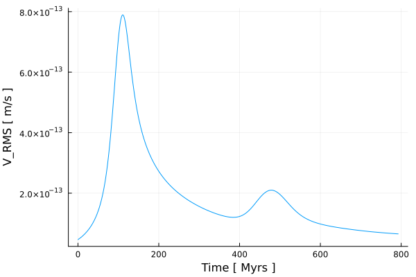
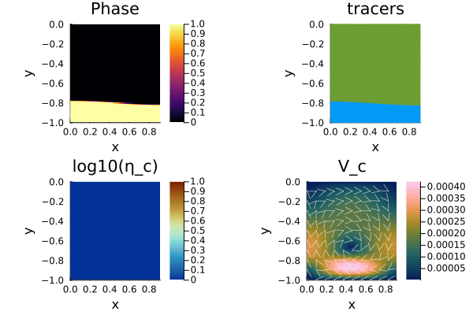
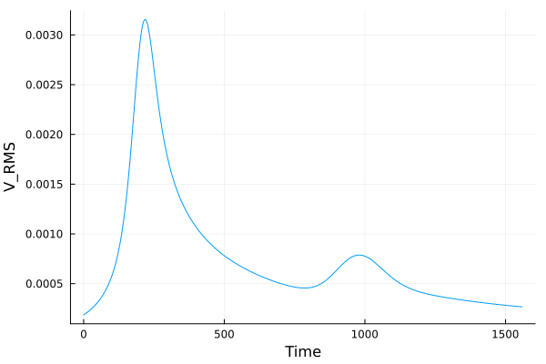

# [VanKeken Benchmark](https://github.com/GeoSci-FFM/GeoModBox.jl/blob/main/examples/StokesEquation/2D/VanKekenBenchmark.jl)

The Van Keken et al. (1997) benchmark is a classical Rayleigh-Taylor instability problem that evaluates the accuracy and robustness of Stokes flow solvers coupled with marker advection. An initially horizontal interface separates two layers of identical viscosity but slightly different density. A small sinusoidal perturbation triggers the instability, causing the denser material to sink while the lighter material rises. The benchmark therefore provides a convenient validation case for testing buoyancy-driven flow, tracer advection, interpolation schemes, and iterative Stokes solvers.

In this example, the benchmark is implemented in dimensional formulation. Material properties are specified in SI units, including viscosity, density, gravitational acceleration, and thermal diffusivity. The density contrast is chosen such that the buoyancy number is

$$\begin{equation}
R_b=\frac{\Delta \rho\,g\,H^3}{\eta\,\kappa}=1,
\end{equation}$$

where $H$ is the model height, $\eta$ is the reference viscosity, and $\kappa$ is the thermal diffusivity.

The example demonstrates the use of the defect-correction Stokes solver together with marker-based material advection. Material properties are interpolated from tracers to the Eulerian grid using the available averaging operators, while the interface evolution is represented by Lagrangian tracers. The resulting flow field reproduces the characteristic Rayleigh-Taylor instability and serves as a benchmark for both the momentum solver and the tracer advection routines.

In addition to the dimensional implementation presented here, *GeoModBox.jl* also provides a fully nondimensional version of the benchmark. The nondimensional implementation solves the same physical problem using appropriately scaled variables, where the reference viscosity, characteristic length, pressure, velocity, and density anomaly are normalized. Both formulations produce identical numerical solutions after appropriate rescaling. The nondimensional version therefore serves as an additional verification of the scaling framework implemented in *GeoModBox.jl*.

---

Let's first load the required modules. 

```Julia
using Plots
using ExtendableSparse
using GeoModBox
using GeoModBox.InitialCondition, GeoModBox.MomentumEquation.TwoD
using GeoModBox.AdvectionEquation.TwoD
using GeoModBox.Tracers.TwoD
using Base.Threads
using Printf, LinearAlgebra
using TimerOutputs
using Statistics
```

We begin by defining several general settings controlling the simulation, visualization, and output. These include the initial condition, interpolation method for material properties, and plotting parameters used throughout the benchmark.

```Julia
to          =   TimerOutput()
@timeit to "Ini" begin
save_fig    =   1
# Define Initial Condition ========================================== #
Ini         =   (p=:RTI,) 
avg         =   :arith
# ------------------------------------------------------------------- #
# Plot Settings ===================================================== #
Pl  =   (
    qinc    =   10,
    mainc   =   5,
    qsc     =   100*(60*60*24*365.25)*3
)
# ------------------------------------------------------------------- #
```

Next, we define the computational domain and discretize it using a staggered finite-difference grid. The model domain has a height of 4 km and an aspect ratio corresponding to the original Van Keken benchmark. The initial sinusoidal interface perturbation is defined by its wavelength and amplitude, while the staggered grid coordinates are constructed for cell centers, vertices, and ghost nodes.

```Julia
# Geometry ========================================================== #
M       =   Geometry(
    ymin    =   -4.0e3,     # [ m ]
    ymax    =   0.0,
    xmin    =   0.0,
)
λ           =   2*0.9142*(M.ymax-M.ymin)        #   Perturbation wavelength[ m ]
δA          =   -0.02*(M.ymax-M.ymin)            #   Amplitude [ m ]
ar          =   (λ / (M.ymax-M.ymin))/2       #   aspect ratio
M.xmax      =   (M.ymax-M.ymin)*ar
# -------------------------------------------------------------------- #
# Grid =============================================================== # 
NC  =   (
    x   =   100,
    y   =   100,
)
NV  =   (
    x   =   NC.x + 1,
    y   =   NC.y + 1,
)
Δ       =   GridSpacing(
    x   =   (M.xmax - M.xmin)/NC.x,
    y   =   (M.ymax - M.ymin)/NC.y,
)
x       =   (
    c   =   LinRange(M.xmin+Δ.x/2,M.xmax-Δ.x/2,NC.x),
    ce  =   LinRange(M.xmin - Δ.x/2.0, M.xmax + Δ.x/2.0, NC.x+2),
    v   =   LinRange(M.xmin,M.xmax,NV.x),
)
y       =   (
    c   =   LinRange(M.ymin+Δ.y/2,M.ymax-Δ.y/2,NC.y),
    ce  =   LinRange(M.ymin - Δ.y/2.0, M.ymax + Δ.y/2.0, NC.y+2),
    v   =   LinRange(M.ymin,M.ymax,NV.y),
)
x1      =   (
    c2d     =   x.c .+ 0*y.c',
    v2d     =   x.v .+ 0*y.v', 
    vx2d    =   x.v .+ 0*y.ce',
    vy2d    =   x.ce .+ 0*y.v',
)
x   =   merge(x,x1)
y1      =   (
    c2d     =   0*x.c .+ y.c',
    v2d     =   0*x.v .+ y.v',
    vx2d    =   0*x.v .+ y.ce',
    vy2d    =   0*x.ce .+ y.v',
)
y   =   merge(y,y1)
# -------------------------------------------------------------------- #
```

The material properties are then specified. Both layers are assigned identical viscosities, while a small density contrast is introduced to produce a buoyancy number of $R_b=1$. The interface separating the two materials is initially located at 80% of the model height.

```Julia
# Physics ============================================================ #
g       =   10.0                        #   Gravitational acceleration [ m/s^2 ]
# 0 - upper layer; 1 - lower layer
η₀      =   1e20                        #   Viscosity composition 0 [ Pa s ]
η₁      =   1e20                        #   Viscosity composition 1 [ Pa s]
ηᵣ      =   log10(η₁/η₀)
η       =   [η₀,η₁]                     #   Viscosity for phases 

hc      =   0.8
h₀      =   hc * (M.ymax-M.ymin)        # Thickness upper layer
h₁      =   (1-hc) * (M.ymax-M.ymin)    # Thickness lower layer
yc      =   abs(M.ymin + h₁)            # Layer interface depth

κ       =   1e-6
Rb      =   1
Δρ      =   Rb * κ * η₀ / (g * (M.ymax-M.ymin)^3)

ρ₀      =   3000.0              #   Density composition 0 [ kg/m^3 ]
ρ₁      =   ρ₀ - Δρ             #   Density composition 1 [ kg/m^3 ]
ρ       =   [ρ₀,ρ₁]             #   Density for phases

phase   =   [0,1]
# -------------------------------------------------------------------- #
# Animation and Plot Settings ======================================= #
path        =   string("./examples/StokesEquation/2D/Results/")
anim        =   Plots.Animation(path, String[] )
filename    =   string("VanKeKen_Benchmark_ηr_",round(ηᵣ),
                        "_tracers_DC_",avg)
# ------------------------------------------------------------------- #
```

Before solving the governing equations, memory is allocated for all primary variables, including velocity, pressure, density, viscosity, and auxiliary arrays required by the defect-correction Stokes solver.

```Julia
# Allocation ======================================================== #
D       =   (
    p       =   zeros(Float64,(NC...)),
    pe      =   zeros(Float64,(NC.x+2,NC.y+2)),
    ρ       =   zeros(Float64,(NC...)),  
    ρe      =   zeros(Float64,(NC.x+2,NC.y+2)),      
    cp      =   zeros(Float64,(NC...)),
    vx      =   zeros(Float64,(NV.x,NV.y+1)),
    vy      =   zeros(Float64,(NV.x+1,NV.y)),    
    Pt      =   zeros(Float64,(NC...)),
    vxc     =   zeros(Float64,(NC...)),
    vyc     =   zeros(Float64,(NC...)),
    vc      =   zeros(Float64,(NC...)),
    wt      =   zeros(Float64,(NC.x,NC.y)),
    wte     =   zeros(Float64,(NC.x+2,NC.y+2)),
    wtv     =   zeros(Float64,(NV.x,NV.y)),
    ηc      =   zeros(Float64,NC...),
    ηce     =   zeros(Float64,(NC.x+2,NC.y+2)),
    ηv      =   zeros(Float64,NV...),
)
# ------------------------------------------------------------------- #
# Needed for the defect correction solution ---
divV        =   zeros(Float64,NC...)
ε           =   (
    xx      =   zeros(Float64,NC...), 
    yy      =   zeros(Float64,NC...), 
    xy      =   zeros(Float64,NV...),
)
τ           =   (
    xx      =   zeros(Float64,NC...), 
    yy      =   zeros(Float64,NC...), 
    xy      =   zeros(Float64,NV...),
)
# ------------------------------------------------------------------- #
```

We also need to define the velocity boundary conditions, which are *free slip* at the lateral and *no slip* at the top and bottom boundary. 

```Julia
# Boundary Conditions =============================================== #
VBC     =   (
    type    =   (E=:freeslip,W=:freeslip,S=:noslip,N=:noslip),
    val     =   (E=zeros(NV.y),W=zeros(NV.y),S=zeros(NV.x),N=zeros(NV.x),
                    vyS=0.0,vyN=0.0,vxW=0.0,vxE=0.0),
)
# ------------------------------------------------------------------- #
```

In the following the time parameters are defined, including the maximum time, the courant time factor and the maximum number of iterations. 

```Julia
# Time ============================================================== #
T   =   TimeParameter(
    tmax    =   5000.0,         #   [ Ma ]
    Δfacc   =   1.0,            #   Courant time factor
    itmax   =   500,            #   Maximum iterations; 50
)
T.tmax      =   T.tmax*1e6*T.year    #   [ s ]
T.Δ         =   T.Δfacc * minimum((Δ.x,Δ.y)) / 
                    (sqrt(maximum(abs.(D.vx))^2 + maximum(abs.(D.vy))^2))

Time        =   zeros(T.itmax)
V_RMS       =   zeros(T.itmax)
final_step  =   0
# ------------------------------------------------------------------- #
```

The material interface is represented by Lagrangian tracers. After initializing the tracer distribution, the material properties are interpolated onto the Eulerian finite-difference grid, providing the density and viscosity fields required by the Stokes solver.

```Julia
# Tracer Advection ================================================== #
@timeit to "Tracer Ini" begin
nmx,nmy     =   5,5
noise       =   1
nmark       =   nmx*nmy*NC.x*NC.y
Aparam      =   :phase
MPC         =   (
        c       =   zeros(Float64,(NC.x,NC.y)),
        v       =   zeros(Float64,(NV.x,NV.y)),
        th      =   zeros(Float64,(nthreads(),NC.x,NC.y)),
        thv     =   zeros(Float64,(nthreads(),NV.x,NV.y)),
)
MAVG        = (
        PC_th   =   [similar(D.wte) for _ = 1:nthreads()],  # per thread
        PV_th   =   [similar(D.ηv) for _ = 1:nthreads()],   # per thread
        wte_th  =   [similar(D.wte) for _ = 1:nthreads()],  # per thread
        wtv_th  =   [similar(D.wtv) for _ = 1:nthreads()],  # per thread
)
Ma      =   IniTracer2D(Aparam,nmx,nmy,Δ,M,NC,noise,Ini.p,phase;
                        xc=0.0,yc=yc,λ,δA)
# RK4 weights ---
rkw     =   1.0/6.0*[1.0 2.0 2.0 1.0]   # for averaging
rkv     =   1.0/2.0*[1.0 1.0 2.0 2.0]   # for time stepping
# Count marker per cell ---
CountMPC(Ma,nmark,MPC,M,x,y,Δ,NC,NV)
# Interpolate from markers to cell ---
Markers2Cells(Ma,nmark,MAVG.PC_th,D.ρe,MAVG.wte_th,D.wte,x,y,Δ,Aparam,ρ)
D.ρ     .=   D.ρe[2:end-1,2:end-1]  
Markers2Cells(Ma,nmark,MAVG.PC_th,D.ηce,MAVG.wte_th,D.wte,x,y,Δ,Aparam,η;avgm=avg)
D.ηc    .=   D.ηce[2:end-1,2:end-1]
Markers2Vertices(Ma,nmark,MAVG.PV_th,D.ηv,MAVG.wtv_th,D.wtv,x,y,Δ,Aparam,η;avgm=avg)
end
# ------------------------------------------------------------------- #
```

The coefficient numbering and work arrays required by the defect-correction algorithm are constructed once before entering the time integration loop. These data structures are reused throughout the simulation.

```Julia
# System of Equations =============================================== #
# Iterations
niter       =   50
atol        =   1e-8        #   Absolute tolerance
rtol        =   1e-5        #   Relative tolerance; r = atolM0/atolM
RM          =   0.0         #   Initialize absolute residual    
RMrel       =   0.0         #   Initialize relative residual 
# Numbering, without ghost nodes! ---
off    = [  NV.x*NC.y,                          # vx
            NV.x*NC.y + NC.x*NV.y,              # vy
            NV.x*NC.y + NC.x*NV.y + NC.x*NC.y]  # Pt

Num    =    (
    Vx  =   reshape(1:NV.x*NC.y, NV.x, NC.y), 
    Vy  =   reshape(off[1]+1:off[1]+NC.x*NV.y, NC.x, NV.y), 
    Pt  =   reshape(off[2]+1:off[2]+NC.x*NC.y,NC...),
)
δx      =   zeros(maximum(Num.Pt))
F       =   zeros(maximum(Num.Pt))
# Residuals ---
Fm     =    (
    x       =   zeros(Float64,NV.x, NC.y), 
    y       =   zeros(Float64,NC.x, NV.y)
)
FPt     =   zeros(Float64,NC...)      
# ------------------------------------------------------------------- #
end
```

The simulation proceeds by repeatedly solving the incompressible Stokes equations, computing a stable Courant time step, advecting the Lagrangian tracers, and updating the material properties on the Eulerian grid. This process is repeated until the prescribed simulation time or maximum iteration is reached.

```Julia
# Time Loop ========================================================= #
@timeit to "Time Loop" begin
for it = 1:T.itmax
    R0      =   0.0
    # Update Time ---
    if it > 1
        Time[it]   =   Time[it-1] + T.Δ 
    end
    @printf("Time step: #%04d, Time [Myr]: %04e\n ",it,
                Time[it]/(60*60*24*365.25)/1.0e6)
    # Initial Residual ---------------------------------------------- #
    D.vx    .=  0.0
    D.vy    .=  0.0
    D.Pt    .=  1.0
    @timeit to "Solution Iteration" begin
    # Assemble Coefficients ========================================= #
    @timeit to "Assembly" begin
    K       =   Assembly(NC, NV, Δ, D.ηc, D.ηv, VBC, Num)
    Kfac    =   lu(K.cscmatrix)
    end
    for iter=1:niter
        @timeit to "Residual" begin
        Residuals2D!(D,VBC,ε,τ,divV,Δ,D.ηc,D.ηv,g,Fm,FPt)
        F[Num.Vx]   .=   Fm.x
        F[Num.Vy]   .=   Fm.y
        F[Num.Pt]   .=   FPt
        RM          =   norm(F)/length(F)
        if iter == 1
            R0 = RM
        end
        RMrel       =   RM/R0
        @printf("   MCE %2d: ||R|| = %1.4e, ||R||/||R₀|| = %1.4e\n",iter,RM,RMrel)
        (RM < atol || RM/R0 < rtol) && break
        end
        # --------------------------------------------------------------- #
        # Solution of the linear system ================================= #
        @timeit to "Solution" begin
        δx      =   - (Kfac \ F)
        end
        # --------------------------------------------------------------- #
        # Update Unknown Variables ====================================== #
        D.vx[:,2:end-1]     .+=  δx[Num.Vx]
        D.vy[2:end-1,:]     .+=  δx[Num.Vy]
        D.Pt                .+=  δx[Num.Pt]
    end
    end
    # --------------------------------------------------------------- #
    # Get the velocity on the centroids ---
    for i = 1:NC.x
        for j = 1:NC.y
            D.vxc[i,j]  = (D.vx[i,j+1] + D.vx[i+1,j+1])/2
            D.vyc[i,j]  = (D.vy[i+1,j] + D.vy[i+1,j+1])/2
        end
    end
    @. D.vc        = sqrt(D.vxc^2 + D.vyc^2)
    # ---
```

At regular intervals, the current solution is visualized by displaying the density field, tracer distribution, viscosity, and velocity magnitude together with the velocity vectors. These snapshots are collected to generate the final animation.

```Julia
    if mod(it,4) == 0 || final_step == 1 || it == 1
        p = heatmap(x.c./1e3,y.c./1e3,D.ρ',color=:inferno,
                    xlabel="x[km]",ylabel="y[km]",colorbar=true,
                    title="ρ",
                    aspect_ratio=:equal,xlims=(M.xmin/1e3, M.xmax/1e3),                             
                    ylims=(M.ymin/1e3, M.ymax/1e3),
                    layout=(2,2),subplot=1)
        scatter!(p,Ma.x[1:Pl.mainc:end]./1e3,Ma.y[1:Pl.mainc:end]./1e3,
                    ms=1,ma=0.5,mc=Ma.phase[1:Pl.mainc:end],markerstrokewidth=0.0,
                    xlabel="x[km]",ylabel="y[km]",colorbar=true,
                    title="tracers",label="",
                    aspect_ratio=:equal,xlims=(M.xmin/1e3, M.xmax/1e3), 
                    ylims=(M.ymin/1e3, M.ymax/1e3),
                    layout=(2,2),subplot=2)
        heatmap!(p,x.c./1e3,y.c./1e3,D.vc',
                    xlabel="x[km]",ylabel="y[km]",colorbar=true,
                    title="V_c",color=cgrad(:batlow),
                    aspect_ratio=:equal,xlims=(M.xmin/1e3, M.xmax/1e3),
                    ylims=(M.ymin/1e3, M.ymax/1e3),
                    layout=(2,2),subplot=4)
        quiver!(p,x.c2d[1:Pl.qinc:end,1:Pl.qinc:end]./1e3,
                    y.c2d[1:Pl.qinc:end,1:Pl.qinc:end]./1e3,
                    quiver=(D.vxc[1:Pl.qinc:end,1:Pl.qinc:end].*Pl.qsc,
                            D.vyc[1:Pl.qinc:end,1:Pl.qinc:end].*Pl.qsc),        
                    la=0.5,color="white",layout=(2,2),subplot=4)
        heatmap!(p,x.c./1e3,y.c./1e3,log10.(D.ηc'),color=reverse(cgrad(:roma)),
                    xlabel="x[km]",ylabel="y[km]",title="η_c",
                    clims=(15,27),
                    aspect_ratio=:equal,xlims=(M.xmin/1e3, M.xmax/1e3), 
                    ylims=(M.ymin/1e3, M.ymax/1e3),colorbar=true,
                    layout=(2,2),subplot=3)
        if save_fig == 1
            Plots.frame(anim)
        elseif save_fig == 0
            display(p)
        end
    end
    if final_step == 1
        @printf(" Maximum Time reached!\n")
        break
    end
```

After each Stokes solve, a new stable time step is computed from the Courant criterion using the maximum velocity magnitude in the domain. The tracers are then advected before the material properties are updated on the computational grid.


```Julia
    # Calculate Time Stepping ---
    T.Δ        =   T.Δfacc * minimum((Δ.x,Δ.y)) / 
            (sqrt(maximum(abs.(D.vx))^2 + maximum(abs.(D.vy))^2))
    if Time[it] >= T.tmax
        T.Δ         =   T.tmax - Time[it-1]
        Time[it]    =   Time[it-1] + T.Δ
        final_step  =   1
    end
    # Advection ===
    @timeit to "Tracer Advection" begin
    # Advect tracers ---
    @printf("Running on %d thread(s)\n", nthreads())  
    AdvectTracer2D(Ma,nmark,D,x,y,T.Δ,Δ,NC,rkw,rkv;style=1)
    CountMPC(Ma,nmark,MPC,M,x,y,Δ,NC,NV)
    # Interpolate phase from tracers to grid ---
    Markers2Cells(Ma,nmark,MAVG.PC_th,D.pe,MAVG.wte_th,D.wte,x,y,Δ,Aparam,phase)
    D.p     .=  D.pe[2:end-1,2:end-1]
    Markers2Cells(Ma,nmark,MAVG.PC_th,D.ρe,MAVG.wte_th,D.wte,x,y,Δ,Aparam,ρ)
    D.ρ     .=   D.ρe[2:end-1,2:end-1]  
    Markers2Cells(Ma,nmark,MAVG.PC_th,D.ηce,MAVG.wte_th,D.wte,x,y,Δ,Aparam,η;avgm=avg)
    D.ηc    .=   D.ηce[2:end-1,2:end-1]
    Markers2Vertices(Ma,nmark,MAVG.PV_th,D.ηv,MAVG.wtv_th,D.wtv,x,y,Δ,Aparam,η;avgm=avg)
    end
    V_RMS[it]   =   sqrt(mean(D.vxc.^2 .+ D.vyc.^2))
end # End Time Loop
end
```

After the simulation has finished, the recorded animation is written to disk together with a time series showing the evolution of the root-mean-square velocity. These diagnostics provide a convenient measure of the temporal development of the Rayleigh-Taylor instability.

```Julia
# Save Animation ---
if save_fig == 1
    # Write the frames to a GIF file
    Plots.gif(anim, string( path, filename, ".gif" ), fps = 15)
    foreach(rm, filter(startswith(string(path,"00")), readdir(path,join=true)))
end
# Plot time serieses ==================================================== #
p2  =   plot(Time./T.year./1e6,V_RMS,
            xlabel="Time [ Myrs ]", ylabel="V_RMS [ m/s ]",label="")
if save_fig == 1
    savefig(p2,string("./examples/StokesEquation/2D/Results/VanKekenBenchmark_TimeSeries_",
                        NC.x,"_",NC.y,"_",avg,".png"))
elseif save_fig == 0
    display(p2)
end
display(to)
```

---


**Figure 1.** Evolution of the dimensional Van Keken benchmark. The panels show the density field, tracer distribution, viscosity, and velocity magnitude together with the velocity vectors. The initially perturbed interface evolves into the characteristic Rayleigh-Taylor instability as the denser lower material sinks beneath the lighter upper layer.



**Figure 2.** Evolution of the root-mean-square (RMS) velocity for the dimensional benchmark. The rapid increase in RMS velocity reflects the growth of the Rayleigh-Taylor instability before gradually approaching a quasi-steady state.

---

As discussed above, GeoModBox.jl also provides a fully nondimensional implementation of the Van Keken benchmark. The governing equations, material properties, and boundary conditions are appropriately scaled, while the numerical algorithm remains unchanged. After converting the results back to physical units, both implementations produce identical solutions, demonstrating that the Stokes solver is independent of the choice of physical units.



**Figure 3.** Evolution of the nondimensional Van Keken benchmark. Although all variables are solved in nondimensional form, the predicted interface evolution, flow pattern, and velocity field are identical to those obtained using the dimensional formulation.



**Figure 4.** Root-mean-square (RMS) velocity obtained from the nondimensional benchmark. After appropriate scaling, the temporal evolution is identical to that of the dimensional implementation, confirming the consistency of the nondimensional scaling framework.