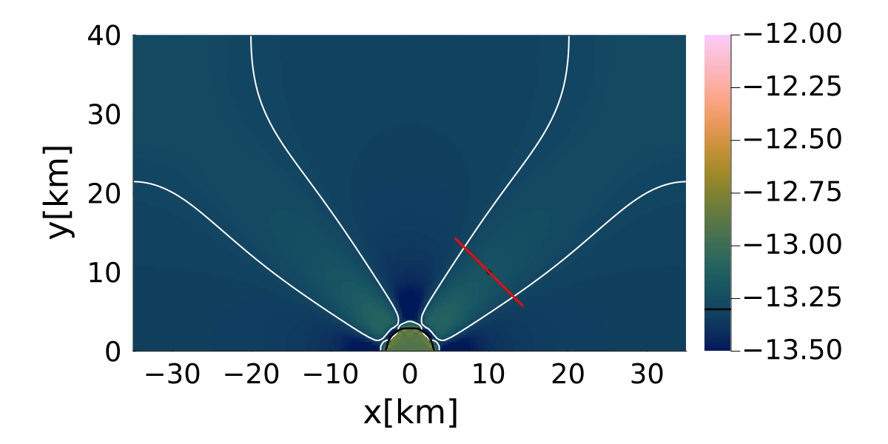
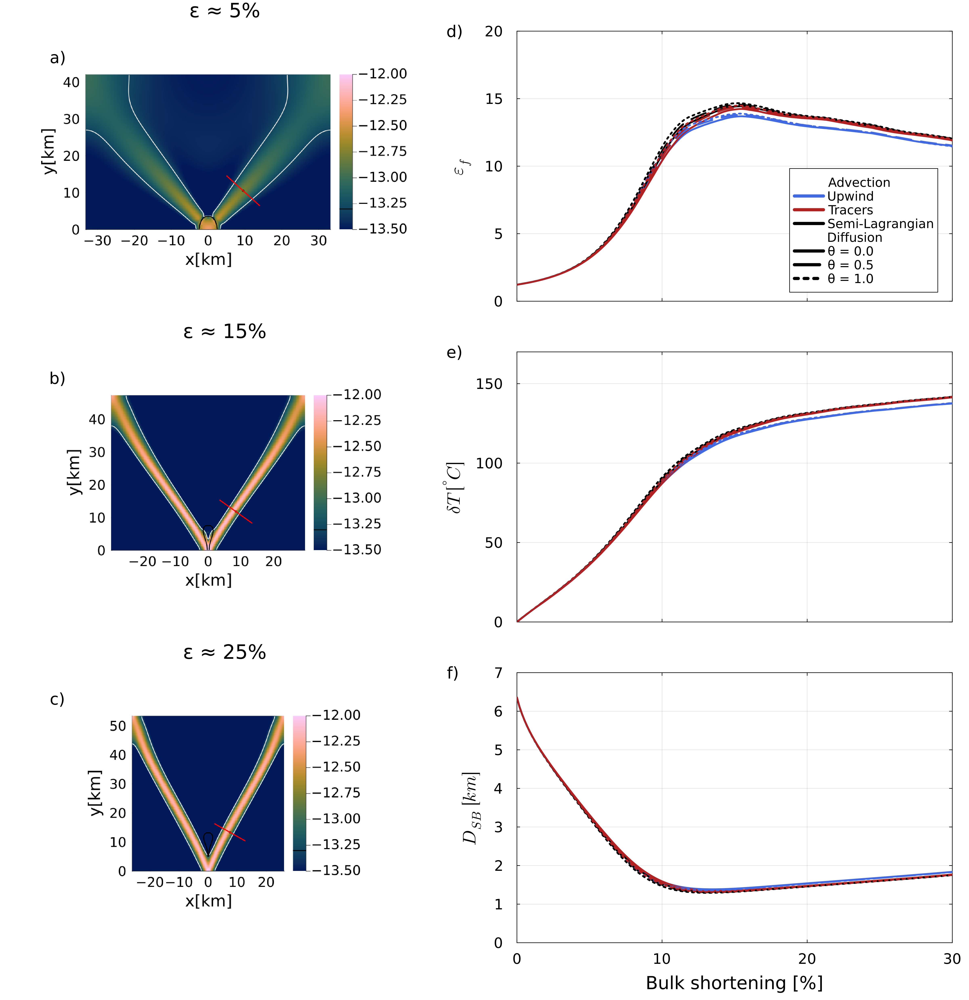

# [Thermo-mechanical Shear Localization](https://github.com/GeoSci-FFM/GeoModBox.jl/blob/main/examples/ShearHeating/2D/ShearHeatingShearBands.jl)

This example investigates thermo-mechanical shear localization in a deforming two-dimensional domain (Duretz et al., 2014). A weak circular inclusion is embedded in a stronger matrix and subjected to pure-shear shortening. The imposed deformation localizes strain around the inclusion, while viscous dissipation generates shear heating and progressively modifies the temperature-dependent, non-linear viscosity. The model therefore couples momentum conservation, power-law rheology, shear heating, heat diffusion, temperature advection, tracer transport, and continuous grid deformation.

The primary objective of this benchmark is not only to reproduce the formation of a localized shear band, but also to investigate how different numerical methods influence the predicted localization. The example compares several discretization strategies for the energy equation, different advection schemes, and different viscosity averaging methods. The evolution of the shear band is quantified using several diagnostic quantities, including the strain-rate amplification, temperature increase, shear-band thickness, and shear-band orientation. These quantities can be evaluated using different diagnostic approaches, such as a fixed profile, a moving profile fitted to the shear band, or a profile centred on the maximum strain rate.

The benchmark consists of three separate scripts:

- `ShearHeatingShearBands.jl` performs a single thermo-mechanical simulation for one selected combination of numerical methods.
- `GenerateData.jl` automatically executes a complete parameter study by repeatedly calling `ShearHeatingShearBands.jl` for all selected combinations of diffusion schemes, advection schemes, viscosity averaging methods, and diagnostic strategies.
- `PlotData.jl` reads the diagnostic files produced by the parameter study and generates the summary figures used to compare the different numerical approaches.

Depending on the selected options, `GenerateData.jl` may execute up to 81 individual simulations (3 diffusion schemes × 3 advection schemes × 3 averaging methods × 3 diagnostic methods). On the reference system used for the documentation, a single simulation requires approximately 1.3 hours, resulting in a total runtime of more than 100 hours for the complete benchmark suite. Users are therefore encouraged to first verify a single simulation before launching the complete parameter study.

The generated diagnostic files are written automatically during each simulation and can subsequently be processed by `PlotData.jl`. This post-processing script assembles the results from all completed simulations into the final comparison figures, allowing the influence of the numerical methods, viscosity averaging strategies, and diagnostic procedures on the predicted shear-band evolution to be assessed systematically.

----

The required GeoModBox modules and Julia packages are loaded first. The main function receives the selected diffusion method, θ-value, advection scheme, diagnostic strategy, and viscosity-averaging method. These options define one specific realization of the shear-localization experiment.

```Julia 
using Plots, ExtendableSparse, Base.Threads
using GeoModBox, GeoModBox.Tracers.TwoD
using GeoModBox.InitialCondition, GeoModBox.MomentumEquation.TwoD
using GeoModBox.AdvectionEquation.TwoD, GeoModBox.HeatEquation.TwoD
using Statistics
using Printf, LinearAlgebra, TimerOutputs, Interpolations, LsqFit
using Measures

to          =   TimerOutput()
@timeit to "Ini" begin
# Define Initial Condition ========================================== #
Ini         =   (T      = :const,               # Temperature
                    Tbg    = 400.0,                # [ °C ]
                    p      = :ShearBandSetting,    # Phasedistribution
                    radius = 3.0e3,                # [ m ]
                    V      = :ShearBandPS,         # Velocity
                    ε      = 5e-14,                # Background strain rate
) 
# ------------------------------------------------------------------- #
# Define numerical methods ========================================== #
# if FD.Method.Diff =: dc; θ-rule
#       θ = 0   -> implicit
#       θ = 0.5 -> CN discretization
#       θ = 1.0 -> explicit
FD  =   (Method = (
            Diff = Diff,
            Adv  = Adv,
            θ    = θ), 
)
# ------------------------------------------------------------------- #
```

The model geometry is discretized using a regular staggered finite-difference grid. Separate coordinate arrays are constructed for cell centers, vertices, extended cell centers, and the staggered velocity locations. Because the domain deforms throughout the experiment, the same coordinate construction is repeated after every remeshing step.

```Julia 
# Geometry ========================================================== #
M       =   Geometry(
    xmin    =   -35.0e3,    # [ m ]
    xmax    =   35.0e3,     # [ m ]
    ymin    =   0.0e3,      # [ m ]
    ymax    =   40.0e3,     # [ m ]
)
# -------------------------------------------------------------------- #
# Grid =============================================================== #
NC      =   (
    x   =   200, 
    y   =   100,
)
NV      =   (
    x   =   NC.x + 1,
    y   =   NC.y + 1,
)
Δ       =   GridSpacing(
    x   =   (M.xmax - M.xmin)/NC.x,
    y   =   (M.ymax - M.ymin)/NC.y,
)
x       =   (
    c   =   LinRange(M.xmin+Δ.x/2,M.xmax-Δ.x/2,NC.x),
    ce  =   LinRange(M.xmin - Δ.x/2.0, M.xmax + Δ.x/2.0, NC.x+2),
    v   =   LinRange(M.xmin,M.xmax,NV.x),
)
y       =   (
    c   =   LinRange(M.ymin+Δ.y/2,M.ymax-Δ.y/2,NC.y),
    ce  =   LinRange(M.ymin - Δ.y/2.0, M.ymax + Δ.y/2.0, NC.y+2),
    v   =   LinRange(M.ymin,M.ymax,NV.y),
)
x1      =   (
    c2d     =   x.c .+ 0*y.c',
    v2d     =   x.v .+ 0*y.v', 
    vx2d    =   x.v .+ 0*y.ce',
    vy2d    =   x.ce .+ 0*y.v',
)
x   =   merge(x,x1)
y1      =   (
    c2d     =   0*x.c .+ y.c',
    v2d     =   0*x.v .+ y.v',
    vx2d    =   0*x.v .+ y.ce',
    vy2d    =   0*x.ce .+ y.v',
)
y   =   merge(y,y1)
# -------------------------------------------------------------------- #
```

The physical parameters describe a gravity-free thermo-mechanical experiment in which deformation, rather than buoyancy, drives the flow. The matrix and weak inclusion follow distinct temperature- and strain-rate-dependent dislocation-creep laws. The selected averaging method is used both to combine the phase-dependent centroid viscosities and to interpolate viscosity from cell centers to vertices.

```Julia 
# Physics ============================================================ #
P   =   Physics(
    g       =   0.0,            #   Gravitational acceleration [m/s^2]
    ρ₀      =   2700.0,         #   Reference density [kg/m^3]
    k       =   2.5,            #   Thermal conductivity [ W/m/K ]
    cp      =   1050.0,         #   Heat capacity [ J/kg/K ]
)
# ------------------------------------------------------------------- #
# Define rheology paramters ========================================= #
Rhe     =   ( 
    #           [Matrix Inclusion]
    A       =   [3.2e-20 3.16e-26],     #   Pre-exponential factor
    n       =   [3.0 3.3],              #   Stress exponent
    Ea      =   [276e3 186e3],          #   Activation energy
    # Viscosity damping factor ---
    ω       =   0.5,
    # Lower cut off strain rate --- 
    εIImin  =   1e-20,
    # Initialize some arrays ---
    εIIeff  =   zeros(Float64,NC...),
    ηmat    =   zeros(Float64,NC...),
    ηinc    =   zeros(Float64,NC...),
    ηnew    =   zeros(Float64,NC...),
    avg_p   =   avg, 
    avg_v   =   avg,
)
# ------------------------------------------------------------------- #
# Define phase ID =================================================== #
phase       =   [0,1]
# ------------------------------------------------------------------- #
```

Output directories, animations, and the diagnostic file are initialized according to the selected numerical configuration. Including the diffusion, advection, averaging, and diagnostic options in the directory name allows the results of the larger model series to be stored and processed without ambiguity.

```Julia 
# Animation and Plot Settings ======================================= #
save_fig    =   1

path        =   string("./examples/ShearHeating/2D/Results/",
                        FD.Method.Diff,"_",FD.Method.θ,"_",
                        FD.Method.Adv,"_", NC.x,"_",
                        NC.y,"_",Rhe.avg_p,"_",Rhe.avg_v,"_",
                        style)
if save_fig == 1
    isdir(path) || mkpath(path)
    framepath2D   = joinpath(path, "frames_2D")
    framepathProf = joinpath(path, "frames_profiles")
    isdir(framepath2D)   || mkpath(framepath2D)
    isdir(framepathProf) || mkpath(framepathProf)
    anim2D      =   Plots.Animation(framepath2D, String[])
    animProf    =   Plots.Animation(framepathProf, String[])
    filename    =   string("/ShearHeatingBands")
    dfilen      =   string("Diagnostics_",FD.Method.Diff,"_",
                        FD.Method.θ,"_",FD.Method.Adv,"_",
                        NC.x,"_",NC.y,"_.txt")
    dfile       =   open("$path/$dfilen","w")
    println(dfile,"# it strain shortening ε_f δT D θ θc")
end
# ------------------------------------------------------------------- #
```

All primary solution fields and auxiliary work arrays are allocated before the simulation begins. In addition to temperature, velocity, pressure, phase, and density, the model stores viscosity at cell centers and vertices, strain-rate and stress components, and residual-velocity fields required by the Eulerian advection schemes.


```Julia 
# Allocation ======================================================== #
D   =   DataFields(
    T       =   zeros(Float64,(NC...)),
    Hs      =   zeros(Float64,NC...),
    T0      =   zeros(Float64,(NC...)),
    Told_ex =   zeros(Float64,(NC.x+2,NC.y+2)),
    T_ex    =   zeros(Float64,(NC.x+2,NC.y+2)),
    T_ex0   =   zeros(Float64,(NC.x+2,NC.y+2)),
    vx      =   zeros(Float64,NV.x,NC.y+2),
    vy      =   zeros(Float64,NC.x+2,NV.y),
    Pt      =   zeros(Float64,NC...),
    p       =   zeros(Float64,NC...),
    p_ex    =   zeros(Float64,(NC.x+2,NC.y+2)),
    ρ       =   zeros(Float64,NC...),
    ρ_ex    =   zeros(Float64,(NC.x+2,NC.y+2)),
    vxc     =   zeros(Float64,NC...),
    vyc     =   zeros(Float64,NC...),
    vxco    =   zeros(Float64,(NC...)),
    vyco    =   zeros(Float64,(NC...)),
    vc      =   zeros(Float64,NC...),
    wt      =   zeros(Float64,(NC.x,NC.y)),
    wte     =   zeros(Float64,(NC.x+2,NC.y+2)),
    wtv     =   zeros(Float64,(NV.x,NV.y)),
    ηc      =   zeros(Float64,NC...),
    η_ex    =   zeros(Float64,(NC.x+2,NC.y+2)),
    ηv      =   zeros(Float64,NV...),
)
# Needed for Euler advection schemes ---
vx_bg_c     =   zeros(Float64,NC...)
vy_bg_c     =   zeros(Float64,NC...)
vxc_res     =   zeros(Float64,NC...)
vyc_res     =   zeros(Float64,NC...)
vxco_res    =   zeros(Float64,NC...)
vyco_res    =   zeros(Float64,NC...)
# Needed for the defect correction solution ---
divV        =   zeros(Float64,NC...)
ε           =   (
    xx      =   zeros(Float64,NC...), 
    yy      =   zeros(Float64,NC...), 
    xy      =   zeros(Float64,NV...),
    xyc     =   zeros(Float64,NC...),
    II      =   zeros(Float64,NC...),
)
τ           =   (
    xx      =   zeros(Float64,NC...), 
    yy      =   zeros(Float64,NC...), 
    xy      =   zeros(Float64,NV...),
    xyc     =   zeros(Float64,NC...),
    II      =   zeros(Float64,NC...),
)
# ------------------------------------------------------------------- #
```

The mechanical boundary conditions impose origin-centered pure-shear deformation on the eastern, western, and northern boundaries, while the southern boundary remains free slip. Homogeneous Neumann conditions on all thermal boundaries make the domain thermally insulating, so temperature changes arise from shear heating, diffusion, and advection rather than imposed boundary temperatures.

```Julia 
# Boundary Conditions =============================================== #
VBC     =   (
    type    =   (E=:ps,W=:ps,S=:freeslip,N=:ps),
    val     =   (E=zeros(NV.y),W=zeros(NV.y),S=zeros(NV.x),N=zeros(NV.x),
                vxE=zeros(NC.y),vxW=zeros(NC.y),vyS=zeros(NC.x),vyN=zeros(NC.x)),
)
TBC     =   (
    type    =   (E=:Neumann,W=:Neumann,S=:Neumann,N=:Neumann),
    val     =   (E=zeros(NC.y),W=zeros(NC.y),S=zeros(NC.x),N=zeros(NC.x)),
)
# ------------------------------------------------------------------- #
```

The initial velocity boundary values are calculated from the prescribed background strain rate, and the model is initialized at a uniform temperature of 400 °C. The second invariant of the strain rate is initially set to the background value so that finite viscosities can be calculated before the first momentum solve.

```Julia 
# Initial Condition ================================================= #
# Velocity ---
IniVelocity!(Ini.V,D,VBC,NV,Δ,M,x,y;Ini.ε)
# Temperature --- 
IniTemperature!(Ini.T,M,NC,D,x,y;Tb=Ini.Tbg)
@. ε.II     =   Ini.ε
# ------------------------------------------------------------------- #
```

The time-step parameters define the Courant and diffusion safety factors and the maximum number of iterations. The initial stable time step is obtained from the imposed velocity field and the thermal diffusivity.

```Julia 
# Time ============================================================== #
T   =   TimeParameter( 
    Δfacc   =   0.9,                #   Courant time factor
    Δfacd   =   0.9,                #   Diffusion time factor
    itmax   =   400,                #   Maximum iterations
)
final_step = false
Time    =   zeros(T.itmax)
# Initialize Time Step ---
GetTimeStep!(T,Δ,P,D)
# ------------------------------------------------------------------- #
```

Arrays are allocated for the diagnostic quantities used to characterize the developing shear band. These include the strain-rate amplification, temperature increase, two estimates of the shear-band orientation, the fitted band thickness, accumulated strain, and bulk shortening. The selected diagnostic method determines how the profile through the localized zone is positioned.

```Julia 
# Diagnostics ======================================================= #
εf          =   zeros(T.itmax)
δTemp       =   zeros(T.itmax)
θsb         =   zeros(T.itmax)
θsb2        =   zeros(T.itmax)
Dsb         =   zeros(T.itmax)
strain      =   zeros(T.itmax)
shortening  =   zeros(T.itmax)
# Setup parameters -------------------------------------------------- #
phbd        =   0.01    # Phase boundary value
nprof       =   200     # Number of points in the profile
# Profile coordinates ---
xp          =   zeros(nprof)
yp          =   zeros(nprof)
#-------------------------------------------------------------------- #
end
```

Lagrangian tracers are initialized with three markers per cell in each coordinate direction. They always carry the phase distribution and additionally carry temperature when tracer-based thermal advection is selected. Thread-local accumulation and weighting arrays are used to interpolate tracer properties to cell centers and vertices without race conditions.

The initial tracer phase field is interpolated to the Eulerian grid, after which the initial density and non-linear viscosity fields are calculated. The weak inclusion is therefore represented materially by the tracers rather than by a fixed Eulerian phase field.

```Julia 
# Tracer Initialization ============================================= #
@timeit to "Tracer Ini" begin
nmx,nmy     =   3,3
noise       =   0
nmark       =   nmx*nmy*NC.x*NC.y
if FD.Method.Adv ==:tracers
    Aparam  =   :thermal
else
    Aparam  =   :phase
end
MPC         =   (
        c       =   zeros(Float64,(NC.x,NC.y)),
        v       =   zeros(Float64,(NV.x,NV.y)),
        th      =   zeros(Float64,(nthreads(),NC.x,NC.y)),
        thv     =   zeros(Float64,(nthreads(),NV.x,NV.y)),
)
MAVG        = (
        PC_th   =   [similar(D.wte) for _ = 1:nthreads()],  # per thread
        PV_th   =   [similar(D.ηv) for _ = 1:nthreads()],   # per thread
        wte_th  =   [similar(D.wte) for _ = 1:nthreads()],  # per thread
        wtv_th  =   [similar(D.wtv) for _ = 1:nthreads()],  # per thread
)
Ma      =   IniTracer2D(Aparam,nmx,nmy,Δ,M,NC,noise,Ini.p,phase;
                    ellA=Ini.radius)
# RK4 weights ---
rkw     =   1.0/6.0*[1.0 2.0 2.0 1.0]   # for averaging
rkv     =   1.0/2.0*[1.0 1.0 2.0 2.0]   # for time stepping
# Count marker per cell ---
CountMPC(Ma,nmark,MPC,M,x,y,Δ,NC,NV)
# Temperature --- 
if FD.Method.Adv==:tracers 
    @threads for k = 1:nmark
        Ma.T[k] =   FromCtoM(D.T_ex, k, Ma, x, y, Δ, NC)
    end
    ΔT_grid     =   zeros(Float64,(NC.x+2,NC.y+2))
end
# ------------------------------------------------------------------- #
# Update cell centroids and vertices (here only density and phase) -- #
# Update Centroids --- 
# Phase ---
Markers2Cells(Ma,nmark,MAVG.PC_th,D.p_ex,MAVG.wte_th,D.wte,x,y,Δ,:phase,phase)
D.p     .=  D.p_ex[2:end-1,2:end-1]
# Density ---
@. D.ρ     =   P.ρ₀*(1.0 - D.p) + P.ρ₀*D.p
D.ρ_ex[2:end-1,2:end-1]     .=  D.ρ
D.ρ_ex[1,:]     .=  D.ρ_ex[2,:]
D.ρ_ex[end,:]   .=  D.ρ_ex[end-1,:]
D.ρ_ex[:,1]     .=  D.ρ_ex[:,2]
D.ρ_ex[:,end]   .=  D.ρ_ex[:,end-1]
# Viscosity - Centroids and vertices ---
UpdateRheo!(ε,Rhe,D,P;ini=:yes)
# ------------------------------------------------------------------- #
end
```

Global equation numbers are assigned to the staggered velocity components, pressure, and temperature. The corresponding sparse matrices, residual arrays, and correction vectors are then allocated for the momentum and energy equations. The exact energy-system storage depends on whether an explicit, direct implicit, Crank–Nicolson, or defect-correction formulation is selected.

```Julia 
# System of Equations =============================================== #
# Numbering, without ghost nodes! ---
off    = [  NV.x*NC.y,                          # vx
            NV.x*NC.y + NC.x*NV.y,              # vy
            NV.x*NC.y + NC.x*NV.y + NC.x*NC.y]  # Pt
Num    =    (
    Vx  =   reshape(1:NV.x*NC.y, NV.x, NC.y), 
    Vy  =   reshape(off[1]+1:off[1]+NC.x*NV.y, NC.x, NV.y), 
    Pt  =   reshape(off[2]+1:off[2]+NC.x*NC.y,NC...),
    T   =   reshape(1:NC.x*NC.y, NC.x, NC.y),
)
ndofM       =   maximum(Num.Pt)  
# Momentum conservation (MCE) ---
# Iterations --- 
niterM      =   80          #   Number of iterations 
atolM       =   1e-8        #   Absolute tolerance
rtolM       =   1e-5        #   Relative tolerance; r = atolM0/atolM
RM          =   0.0         #   Initialize absolute residual    
RMrel       =   0.0         #   Initialize relative residual 
KM          =   ExtendableSparseMatrix(ndofM,ndofM)
# Residuals ---
Fm     =    (
    x       =   zeros(Float64,NV.x, NC.y), 
    y       =   zeros(Float64,NC.x, NV.y)
)
FPt     =   zeros(Float64,NC...)
δx      =   zeros(Float64,ndofM)
F       =   zeros(Float64,ndofM)
# Energy conservation (ECE) ---
ndofT   =   maximum(Num.T)
if FD.Method.Diff==:implicit || FD.Method.Diff==:CN
    if FD.Method.Diff==:CN
        K1      =   ExtendableSparseMatrix(ndofT,ndofT)
        K2      =   ExtendableSparseMatrix(ndofT,ndofT)
    else
        K       =   ExtendableSparseMatrix(ndofT,ndofT)
    end
    rhs         =   zeros(ndofT)
elseif FD.Method.Diff==:dc
    niter       =   10
    ϵ           =   1e-20
    K           =   ExtendableSparseMatrix(ndofT,ndofT)
    R           =   zeros(Float64,NC...)
    ∂2T         =   (∂x2=zeros(NC.x, NC.y), ∂y2=zeros(NC.x, NC.y),
                    ∂x20=zeros(NC.x, NC.y), ∂y20=zeros(NC.x, NC.y))
end
# ------------------------------------------------------------------- #
```

The coupled solution is advanced until the maximum iteration count or the prescribed bulk shortening is reached. At the beginning of each iteration, model time, accumulated logarithmic strain, and bulk shortening are updated. Terminal output and figure generation are restricted to selected steps and the final state.

```Julia 
# Time Loop ========================================================= #
@timeit to "Time Loop" begin
for it = 1:T.itmax
    R0      =   0.0
    # Update Time ---
    if it>1
        Time[it]    =   Time[it-1] + T.Δ    
        strain[it]  =   strain[it-1] + Ini.ε * T.Δ
    end
    shortening[it]  =   100 .* (1 .- exp.(-strain[it]))
    if shortening[it] >= 35 
        final_step = true
    end
    verbose_step    =   mod(it, 10) == 0 || it == 1 || final_step
    # ---
    verbose_step && @printf("\nTime step: #%04d, Time [Myr]: %04e, Shortening: %2.2f\n ",it,
                Time[it]/(60*60*24*365.25)/1.0e6,shortening[it])
```

The incompressible Stokes equations are solved using defect correction with a non-linear rheological update. At each iteration, the momentum and continuity residuals are assembled, the variable-viscosity matrix is constructed, and corrections are applied to velocity and pressure. The strain-rate invariants and phase-dependent viscosities are then recalculated before the next iteration.

After convergence, strain rate, stress, and their second invariants are evaluated once more from the final velocity field. The staggered velocity components are also interpolated to cell centers for diagnostics, visualization, and temperature advection.

```Julia 
    # Momentum Conservation Equation ================================ #
    # Initial Residual ---
    if it == 1
        # D.vx[2:end-1,:]    .=  0.0
        # D.vy[:,1:end-1]    .=  0.0
        # D.Pt               .=  0.0
        D.vx[:, 2:end-1] .= 0.0
        D.vy[2:end-1, :] .= 0.0
        D.Pt             .= 0.0
    end
    @timeit to "Solution Iteration" begin
    verbose_step && @printf("---Momentum Calculation ---\n")        
    for iter = 1:niterM
        @timeit to "Residual" begin
        Residuals2D!(D,VBC,ε,τ,divV,Δ,D.ηc,D.ηv,P.g,Fm,FPt)
        F[Num.Vx]   .=   Fm.x
        F[Num.Vy]   .=   Fm.y
        F[Num.Pt]   .=   FPt
        RM          =   norm(F)/length(F)
        if iter == 1
            R0 = max(RM, eps())
        end
        RMrel       =   RM/R0
        verbose_step && @printf("it: %i, ||R|| = %1.4e, ||R||/||R₀|| = %1.4e\n",iter,RM,RMrel)
        (RM < atolM || RM/R0 < rtolM) && break
        end
        # Assemble Coefficients --
        @timeit to "Assembly" begin
        KM      =   Assembly(NC, NV, Δ, D.ηc, D.ηv, VBC, Num)
        end
        # ---
        # Solution of the linear system --
        @timeit to "Solution" begin
        δx      .=   - KM \ F
        end
        # ---
        # Update Unknown Variables ---
        D.vx[:,2:end-1]     .+=  δx[Num.Vx]
        D.vy[2:end-1,:]     .+=  δx[Num.Vy]
        D.Pt                .+=  δx[Num.Pt]
        # ---
        # recompute ε and τ for the updated velocity field ---
        ComputeStrainStress2D!(D,ε,τ,divV,Δ)
        # ---
        # Get second invariants ---
        GetSecondInvariants!(ε,τ)
        # ---
        # Update Rheology ---
        UpdateRheo!(ε,Rhe,D,P)
        # ---
    end
    # Ensure that strain rate, stress, and invariants correspond to
    # the final velocity and viscosity fields
    ComputeStrainStress2D!(D, ε, τ, divV, Δ)
    GetSecondInvariants!(ε, τ)
    end
    # Get the velocity on the centroids --- 
    # For visualization purposes and Euler advection methods ---
    for i = 1:NC.x
        for j = 1:NC.y
            D.vxc[i,j]  = (D.vx[i,j+1] + D.vx[i+1,j+1])/2
            D.vyc[i,j]  = (D.vy[i+1,j] + D.vy[i+1,j+1])/2
        end
    end
    @. D.vc        = sqrt(D.vxc^2 + D.vyc^2)
    # --------------------------------------------------------------- #
```

The shear-band diagnostics are evaluated before advancing the temperature and material fields. Depending on the selected strategy, the profile is fixed in material coordinates, fitted to the evolving shear band, or centered on its maximum strain rate. The resulting amplification, temperature increase, orientation, and thickness are written to the diagnostic file at every step.

```Julia 
    # Diagnostics =================================================== #
    pp,r    =   Diagnostics!(phbd,nprof,
                    M,T,D,Ini,x,y,ε,
                    θsb,θsb2,Dsb,εf,δTemp,strain,style,
                    xp,yp,it,verbose_step)
    # Save diagnostics on file ---
    if save_fig == 1
        @printf(dfile,
            "%d %.6e %.6e %.6e %.6e %.6e %.6e %.6e\n",
            it,
            strain[it],
            shortening[it],
            εf[it],
            δTemp[it],
            Dsb[it],
            θsb[it]*180/π,
            θsb2[it]*180/π)
        flush(dfile)   # immediately write to disk
    end
    # --------------------------------------------------------------- #
```

The stable time step is recalculated from the current grid spacing, velocity magnitude, and thermal diffusivity. Taking the smaller of the advective and diffusive estimates keeps the different energy and advection formulations on a common time-step sequence.

```Julia 
    # Update time stepping ========================================== #
    GetTimeStep!(T,Δ,P,D)
    # --------------------------------------------------------------- #
```

Viscous dissipation is evaluated from the contracted stress and strain-rate tensors. The resulting shear-heating field acts as a spatially variable volumetric source in the energy equation and provides the positive feedback between localization, heating, and rheological weakening.

```Julia 
    # Energy Conservation Equation ================================== #
    # Shear heating ---
    @. D.Hs =   τ.xx .* ε.xx .+ τ.yy .* ε.yy .+ 2.0 .* τ.xyc .* ε.xyc
    # ---
```

Thermal diffusion and shear heating are integrated using the selected temporal scheme. When the general defect-correction formulation is used, the θ-parameter recovers backward Euler for θ = 0, Crank–Nicolson for θ = 0.5, and forward Euler for θ = 1. The temperature corrections are applied iteratively until the energy residual satisfies the prescribed tolerance.

```Julia 
    # Temperature diffusion --- 
    verbose_step && @printf("---Energy Calculation---\n")
    if FD.Method.Diff==:explicit
        ForwardEuler2Dc!(D, P.κ, Δ.x, Δ.y, T.Δ, NC, TBC;
                    ρ = P.ρ₀, cp = P.cp, Qₛ = D.Hs)
    elseif FD.Method.Diff==:implicit
        BackwardEuler2Dc!(D, P.κ, Δ.x, Δ.y, T.Δ, NC, TBC, rhs, K, Num; 
                    ρ = P.ρ₀, cp = P.cp, Qₛ = D.Hs)
    elseif FD.Method.Diff==:CN
        CNA2Dc!(D, P.κ, Δ.x, Δ.y, T.Δ, NC, TBC, rhs, K1, K2, Num; 
                    ρ = P.ρ₀, cp = P.cp, Qₛ = D.Hs)
    elseif FD.Method.Diff==:dc
        D.T0        .=  D.T
        for iter = 1:niter
            # Evaluate residual
            ComputeResiduals2Dc!(R, D.T, D.T_ex, D.T0, D.T_ex0, ∂2T, 
                    P.κ, TBC, Δ, T.Δ;
                    C = FD.Method.θ, ρ = P.ρ₀, cp = P.cp, Qₛ = D.Hs)
            verbose_step && @printf("||R|| = %1.4e\n", norm(R)/length(R))
            norm(R)/length(R) < ϵ ? break : nothing
            # Assemble linear system
            K  = AssembleMatrix2Dc(P.κ, TBC, Num, NC, Δ, T.Δ;C=FD.Method.θ)
            # Solve for temperature correction: Cholesky factorisation
            Kc = cholesky(K.cscmatrix)
            # Solve for temperature correction: Back substitutions
            δT = -(Kc\R[:])
            # Update temperature
            @. D.T += δT[Num.T]
        end
        D.T_ex[2:end-1,2:end-1]     .=  D.T
    end
    # ---
```

Temperature is subsequently transported using the selected advection method. For tracer advection, the temperature change generated by diffusion and shear heating is interpolated from the grid to the tracers before tracer motion. For the Eulerian upwind and semi-Lagrangian schemes, the analytical background pure-shear velocity is removed so that only the residual flow is used to advect temperature on the continuously remeshed grid.

Irrespective of the thermal advection method, all tracers are advanced using a fourth-order Runge–Kutta scheme to preserve the evolving phase geometry.

```Julia 
    # Temperature advection ---
    if FD.Method.Adv==:tracers 
        # Update tracer info from grid ---
        # Calculate temperature difference ---
        @. ΔT_grid     =   D.T_ex - D.Told_ex
        # Δtdiff =  P.cp*P.ρ/(P.k*(2/Δ.x^2 + 2/Δ.y^2))
        # Update tracer temperature ---
        @threads for k = 1:nmark
        # for k = 1:nmark
            local ΔTm       =   FromCtoM(ΔT_grid, k, Ma, x, y, Δ, NC)
            # Calculate subgrid diffusion on tracers ---
            # local Tm        =   FromCtoM(D.T_Ex, k, Ma, x, y, Δ, NC)
            # local ΔTmsg     =   (Tm - Ma.T[k])*(1-exp(-dsg*T.Δ/Δtdiff))
            # Interpolate subgrid diffuison to the grid ---
            # Distance to the upper right corner ---
            # # Get the column:
            # dstx  =   Ma.x[k] - x.ce[1]
            # i     =   ceil(Int64, dstx / Δ.x) + 1                   
            # # Get the line:
            # dsty  =   Ma.y[k] - y.ce[1]
            # j     =   ceil(Int64, dsty /  Δ.y) + 1 
            # # Relative distances
            # Δxm   =   abs(x.ce[i] - Ma.x[k])/Δ.x
            # Δym   =   abs(y.ce[j] - Ma.y[k])/Δ.y
            # # Increment cell counts
            # ΔTsg[i-1,j-1] += ΔTmsg * Δxm * Δym
            # ΔTsg[i  ,j-1] += ΔTmsg * (1.0 - Δxm) * Δym
            # ΔTsg[i-1,j  ] += ΔTmsg * Δxm * (1.0 - Δym)
            # ΔTsg[i  ,j  ] += ΔTmsg * (1.0 - Δxm) * (1.0 - Δym)
            
            # wTsg[i-1,j-1] += Δxm * Δym
            # wTsg[i  ,j-1] += (1.0 - Δxm) * Δym
            # wTsg[i-1,j  ] += Δxm * (1.0 - Δym)
            # wTsg[i  ,j  ] += (1.0 - Δxm) * (1.0 - Δym)
            Ma.T[k]     += ΔTm
        end
        # @. ΔTsg   /= wTsg
        # Calculate remaining temperature difference on the grid ---
        # @. ΔTr    =   ΔT_grid - ΔTsg
        # Interpolate remaining T on tracers ---
        # Calculate corrected temperature difference on tracers ---
        # for k = 1:nmark
        #   ΔTmsg   =   FromCtoM(ΔTsg, k, Ma, x, y, Δ, NC)
        #   ΔTmr    =   FromCtoM(ΔTr, k, Ma, x, y, Δ, NC)
        #   Ma.T[k] +=  ΔTmsg + ΔTmr
        # end
    else
        # Advect temperature, Eulerian schemes ---
        # Correct velocity for eulerian advection schemes ---
        @. vx_bg_c  =   -Ini.ε .* x.c2d
        @. vy_bg_c  =   Ini.ε .* y.c2d
        @. vxc_res  =   D.vxc - vx_bg_c 
        @. vyc_res  =   D.vyc - vy_bg_c
        if it == 1
            @. vxco_res    =   D.vxc - vx_bg_c 
            @. vyco_res    =   D.vyc - vy_bg_c 
        end
        if FD.Method.Adv==:upwind
            upwindc2D!(D.T,D.T_ex,vxc_res,vyc_res,NC,T.Δ,Δ.x,Δ.y)
        elseif FD.Method.Adv==:semilag
            semilagc2D!(D.T,D.T_ex,vxc_res,vyc_res,vxco_res,vyco_res,x,y,T.Δ)
            vxco_res    .=   vxc_res
            vyco_res    .=   vyc_res
        end
    end
    # ---
    # Advection of tracers ---
    verbose_step && @printf("Running on %d thread(s)\n", nthreads())  
    AdvectTracer2D(Ma,nmark,D,x,y,T.Δ,Δ,NC,rkw,rkv)
    # --------------------------------------------------------------- #
    if verbose_step
        if save_fig == 1
            pp !== nothing && Plots.frame(animProf, pp)
            r  !== nothing && Plots.frame(anim2D, r)
        else
            pp !== nothing && display(pp)
            r  !== nothing && display(r)
        end
    end
```

The computational domain is deformed analytically according to the imposed pure-shear strain rate. Horizontal shortening and vertical extension are applied exponentially, after which the regular grid spacing and all staggered coordinate arrays are reconstructed for the updated geometry.

```Julia 
    # Deform and remesh grid ======================================== #
    # Effectively the new time step --- !!! ---
    # Calculate new xmin, xmax and ymax ---
    M.xmin  =   M.xmin * exp(-Ini.ε * T.Δ)
    M.xmax  =   M.xmax * exp(-Ini.ε * T.Δ)
    M.ymax  =   M.ymax * exp(Ini.ε * T.Δ)
    # Remeshing ---
    Δ       =   GridSpacing(
        x   =   (M.xmax - M.xmin)/NC.x,
        y   =   (M.ymax - M.ymin)/NC.y,
    )
    x       =   (
        c   =   LinRange(M.xmin+Δ.x/2,M.xmax-Δ.x/2,NC.x),
        ce  =   LinRange(M.xmin - Δ.x/2.0, M.xmax + Δ.x/2.0, NC.x+2),
        v   =   LinRange(M.xmin,M.xmax,NV.x),
    )
    y       =   (
        c   =   LinRange(M.ymin+Δ.y/2,M.ymax-Δ.y/2,NC.y),
        ce  =   LinRange(M.ymin - Δ.y/2.0, M.ymax + Δ.y/2.0, NC.y+2),
        v   =   LinRange(M.ymin,M.ymax,NV.y),
    )
    x1      =   (
        c2d     =   x.c .+ 0*y.c',
        v2d     =   x.v .+ 0*y.v', 
        vx2d    =   x.v .+ 0*y.ce',
        vy2d    =   x.ce .+ 0*y.v',
    )
    x   =   merge(x,x1)
    y1      =   (
        c2d     =   0*x.c .+ y.c',
        v2d     =   0*x.v .+ y.v',
        vx2d    =   0*x.v .+ y.ce',
        vy2d    =   0*x.ce .+ y.v',
    )
    y   =   merge(y,y1)
    # --------------------------------------------------------------- #
```

Because the boundary coordinates change during deformation, the prescribed pure-shear velocity values are recalculated on the remeshed grid. This keeps the imposed strain rate consistent with the current domain dimensions.

```Julia 
    # Update boundary velocity ====================================== # 
    IniVelocity!(Ini.V,D,VBC,NV,Δ,M,x,y;Ini.ε)
    # --------------------------------------------------------------- #
```

Tracer coordinates are restricted to the interior of the updated domain before their cell indices are recalculated. Tracer temperature is mapped back to the grid only for tracer-based thermal advection, whereas the phase distribution is remapped for every method. The extended temperature history is then updated for the next diffusion-to-tracer temperature increment.

The simulation terminates once the target bulk shortening of 35% has been reached. The final diagnostic state, animations, and timing information are retained for post-processing.

```Julia 
    # Update cell centroids and vertices information ================ #
    ϵx = 1e-10 * (M.xmax - M.xmin)
    ϵy = 1e-10 * (M.ymax - M.ymin)
    @. Ma.x = clamp(Ma.x, M.xmin + ϵx, M.xmax - ϵx)
    @. Ma.y = clamp(Ma.y, M.ymin + ϵy, M.ymax - ϵy)
    CountMPC(Ma,nmark,MPC,M,x,y,Δ,NC,NV)
    @timeit to "Tracer Interpolation" begin
    if FD.Method.Adv==:tracers
        # Update temperature field ---
        Markers2Cells(Ma,nmark,MAVG.PC_th,D.T_ex,MAVG.wte_th,D.wte,x,y,Δ,:thermal,nothing)
        D.T     .=  D.T_ex[2:end-1,2:end-1]
    end
    # Update only phase 
    # Interpolate phase from tracers to grid ---
    Markers2Cells(Ma,nmark,MAVG.PC_th,D.p_ex,MAVG.wte_th,D.wte,x,y,Δ,:phase,phase)
    D.p     .=  D.p_ex[2:end-1,2:end-1]
    # Density ---
    @.  D.ρ     =   P.ρ₀*(1.0 - D.p) + P.ρ₀*D.p
    D.ρ_ex[2:end-1,2:end-1]     .=  D.ρ
    D.ρ_ex[1,:]     .=  D.ρ_ex[2,:]
    D.ρ_ex[end,:]   .=  D.ρ_ex[end-1,:]
    D.ρ_ex[:,1]     .=  D.ρ_ex[:,2]
    D.ρ_ex[:,end]   .=  D.ρ_ex[:,end-1]
    # Update old temperature field ---
    @. D.Told_ex    =   D.T_ex
    end
    # --------------------------------------------------------------- #
    if verbose_step
        @show it
        @show Time[it]
        @show strain[it]
        @show εf[it]
        @show shortening[it]
        @show δTemp[it]
    end
    if shortening[it] >= 35
        T.itmax   =   it
        @show it
        @show Time[it]
        @show strain[it]
        @show εf[it]
        @show shortening[it]
        @show δTemp[it]
        @printf("Bulk shortening %g reached maximum value\n",shortening[it])
        break
    # else
    #     T.itmax   =   it
    end
end # End Time Loop
end
```

After the time loop, the diagnostic file is closed and the stored frames are written to animations. Individual plots of strain-rate amplification, temperature increase, shear-band orientation, and shear-band thickness are generated as functions of bulk shortening. These files provide the input for the separate `PlotData.jl` post-processing script.


```Julia 
if save_fig == 1
    close(dfile)
end
# Save Animation ---
if save_fig == 1
    # Write the frames to a GIF file
    Plots.gif(anim2D, string(path, filename, "_2D.gif"), fps = 10)
    Plots.gif(animProf, string(path, filename, "_profiles.gif"), fps = 10)
    # foreach(rm, filter(startswith(string(path,"00")), readdir(framepath2D,join=true)))
    # foreach(rm, filter(startswith(string(path,"00")), readdir(framepathProf,join=true)))
end
t = plot(shortening[1:T.itmax],
            [εf[1:T.itmax]],
            xlims=(0,shortening[T.itmax]),
            label="",ylabel="εf",xlabel="ε [%]",)
u   =   plot(shortening[1:T.itmax],δTemp[1:T.itmax],
            ylabel="´δT [°C]",xlabel="ε [%]",label="",
            xlims=(0,shortening[T.itmax]),)
v   =   plot(shortening[1:T.itmax],[θsb[1:T.itmax].*180.0./π θsb2[1:T.itmax].*180.0./π],
            ylabel="θ",xlabel="ε [%]",label="",
            xlims=(0,shortening[T.itmax]),)
w   =   plot(shortening[1:T.itmax],Dsb[1:T.itmax]./1e3,
            ylabel="D [km]",xlabel="ε [%]",label="",
            xlims=(0,shortening[T.itmax]),)
if save_fig == 1
    savefig(t,string(path,"/StrainRateMulitply_",FD.Method.Diff,"_",FD.Method.Adv,"_",
            @sprintf("%i",NC.x),"_",@sprintf("%i",NC.y),".png"))
    savefig(u,string(path,"/DeltaTemp_",FD.Method.Diff,"_",FD.Method.Adv,"_",
            @sprintf("%i",NC.x),"_",@sprintf("%i",NC.y),".png"))
    savefig(v,string(path,"/ShearZoneAngle_",FD.Method.Diff,"_",FD.Method.Adv,"_",
            @sprintf("%i",NC.x),"_",@sprintf("%i",NC.y),".png"))
    savefig(w,string(path,"/ShearZoneThickness_",FD.Method.Diff,"_",FD.Method.Adv,"_",
            @sprintf("%i",NC.x),"_",@sprintf("%i",NC.y),".png"))
else
    display(t)
    display(u)
    display(v)
    display(w)
end
display(to)
```

The helper functions following the figures perform operations specific to this example, including invariant calculation, adaptive time stepping, stress evaluation, non-linear viscosity updates, and quantitative shear-band analysis.



**Figure 1.** Evolution of thermo-mechanical shear localization in the pure-shear benchmark using shear heating. The model employs the general defect-correction energy solver with a Crank–Nicolson discretization ($\theta = 0.5$), tracer-based temperature advection, and a grid resolution of $200 \times 100$ cells. Temperature-dependent, non-linear dislocation-creep viscosities are combined using arithmetic averaging for the phase mixing, centroid-to-vertex interpolation, and marker-to-grid interpolation. The animation shows the evolution of the second invariant of the strain-rate field (background colors), the weak inclusion (black contour), the evolving shear band (white contour), and the fixed diagnostic profile (red line) used to quantify strain-rate amplification, shear-band thickness, and shear-heating-induced temperature increase.



**Figure 2.** Evolution and quantitative characterization of thermo-mechanical shear localization for the fixed-profile diagnostic with arithmetic phase and vertex viscosity averaging. Panels (a)–(c) show the second invariant of the strain-rate field at approximately 5%, 15%, and 25% bulk shortening, including the weak inclusion and the profile used to evaluate localization. Panels (d)–(f) show the the strain-rate amplification, temperature increase, shear-band orientation, and shear-band thickness as functions of bulk shortening. Line color distinguishes the upwind, semi-Lagrangian, and tracer advection methods, while line style distinguishes backward Euler (θ = 0), Crank–Nicolson (θ = 0.5), and forward Euler (θ = 1) within the general defect-correction formulation.

---
---

`GetSecondInvariants!` first averages the vertex-based shear components to the cell centers. It then evaluates the second invariants of the strain-rate and deviatoric-stress tensors, which are required by the dislocation-creep rheology and by the shear-band diagnostics.

```Julia 
# ======================================================================= #
# ======================= HELPER FUNCTIONS ============================== #
# ======================================================================= #
# ----------------------------------------------------------------------- #
function GetSecondInvariants!(ε,τ)
    # Get shear strain rate and stress on centroids ---
    @. ε.xyc    =   (ε.xy[1:end-1,1:end-1] + ε.xy[2:end-0,1:end-1] + 
                    ε.xy[1:end-1,2:end-0] + ε.xy[2:end-0,2:end-0])/4.0
    @. τ.xyc    =   (τ.xy[1:end-1,1:end-1] + τ.xy[2:end-0,1:end-1] + 
                    τ.xy[1:end-1,2:end-0] + τ.xy[2:end-0,2:end-0])/4.0
    # Get invariants ---
    @. ε.II     =   sqrt(0.5*(ε.xx^2 + ε.yy^2) + ε.xyc^2)
    @. τ.II     =   sqrt(0.5*(τ.xx^2 + τ.yy^2) + τ.xyc^2)
end
# ----------------------------------------------------------------------- #
```

---

`GetTimeStep!` computes separate Courant and diffusion time-step estimates from the current velocity field, grid spacing, and thermal diffusivity. The smaller value is used for the subsequent thermo-mechanical update.

```Julia 
function GetTimeStep!(T,Δ,P,D)
    T.Δc    =   T.Δfacc * minimum((Δ.x,Δ.y)) / 
                    (sqrt(maximum(abs.(D.vx))^2 + maximum(abs.(D.vy))^2))
    T.Δd    =   T.Δfacd * (1.0 / (2.0 * P.κ *(1.0/Δ.x^2 + 1/Δ.y^2)))
    T.Δ     =   minimum([T.Δd,T.Δc])
end
# ----------------------------------------------------------------------- #
```

---

`ComputeStrainStress2D!` evaluates the velocity divergence and the normal and shear strain-rate components on their native staggered locations. The corresponding deviatoric stresses are obtained using the centroid and vertex viscosities, maintaining consistency with the variable-viscosity momentum discretization.

```Julia 
function ComputeStrainStress2D!(D,ε,τ,divV,Δ)
    @. divV =   (D.vx[2:end,2:end-1] - D.vx[1:end-1,2:end-1])/Δ.x + (D.vy[2:end-1,2:end] - D.vy[2:end-1,1:end-1])/Δ.y
    @. ε.xx =   (D.vx[2:end,2:end-1] - D.vx[1:end-1,2:end-1])/Δ.x # - 1.0/3.0*divV
    @. ε.yy =   (D.vy[2:end-1,2:end] - D.vy[2:end-1,1:end-1])/Δ.y # - 1.0/3.0*divV
    @. ε.xy =   0.5*( (D.vx[:,2:end] - D.vx[:,1:end-1])/Δ.y + (D.vy[2:end,:] - D.vy[1:end-1,:])/Δ.x ) 
    @. τ.xx =   2.0 * D.ηc * ε.xx
    @. τ.yy =   2.0 * D.ηc * ε.yy
    @. τ.xy =   2.0 * D.ηv * ε.xy
end
# ----------------------------------------------------------------------- #
```

---

`UpdateRheo!` calculates the effective dislocation-creep viscosity of the matrix and weak inclusion from temperature and the second strain-rate invariant. The phase viscosities are combined using the selected arithmetic, harmonic, or geometric average, and logarithmic damping is applied during the non-linear momentum iterations. 

```Julia 
function UpdateRheo!(ε,Rhe,D,P;ini=:no)

    # Set effective strain rate to avoid Infs and NaNs --- 
    @. Rhe.εIIeff   =   max(ε.II, Rhe.εIImin)

    # Update rheology ---
    # Viscosity ---            
    @. Rhe.ηmat =   (2.0^((1.0-Rhe.n[1])/Rhe.n[1]))/(3.0^((1.0+Rhe.n[1])/(2.0*Rhe.n[1]))) * 
                      Rhe.A[1]^(-1/Rhe.n[1]) * Rhe.εIIeff^(1/Rhe.n[1]-1) * exp(Rhe.Ea[1]/(Rhe.n[1]*P.RG*(D.T+273.15)))
    @. Rhe.ηinc =   (2.0^((1.0-Rhe.n[2])/Rhe.n[2]))/(3.0^((1.0+Rhe.n[2])/(2.0*Rhe.n[2]))) * 
                      Rhe.A[2]^(-1/Rhe.n[2]) * Rhe.εIIeff^(1/Rhe.n[2]-1) * exp(Rhe.Ea[2]/(Rhe.n[2]*P.RG*(D.T+273.15)))
    
    if Rhe.avg_p == :arithmetic
        @. Rhe.ηnew = (1.0 - D.p) * Rhe.ηmat + D.p * Rhe.ηinc
    elseif Rhe.avg_p == :harmonic
        @. Rhe.ηnew = 1.0 / ( (1.0 - D.p) / Rhe.ηmat + D.p / Rhe.ηinc )
    elseif Rhe.avg_p == :geometric
        @. Rhe.ηnew = Rhe.ηmat^(1.0 - D.p) * Rhe.ηinc^D.p
    else
        error("Unknown viscosity averaging: $(Rhe.avg_p)")
    end

    if ini==:no
        @. D.ηc     =   exp((1-Rhe.ω)*log(D.ηc) + Rhe.ω*log(Rhe.ηnew))
    else
        @. D.ηc     =   Rhe.ηnew
    end

    # --- Extended Centroids-
    D.η_ex[2:end-1,2:end-1]     .=  D.ηc
    D.η_ex[1,:]     .=  D.η_ex[2,:]
    D.η_ex[end,:]   .=  D.η_ex[end-1,:]
    D.η_ex[:,1]     .=  D.η_ex[:,2]
    D.η_ex[:,end]   .=  D.η_ex[:,end-1]
    # --- Vertices -
    if Rhe.avg_v == :arithmetic
        @. D.ηv =
            0.25*(
                D.η_ex[1:end-1,1:end-1] + 
                D.η_ex[2:end  ,1:end-1] + 
                D.η_ex[1:end-1,2:end  ] + 
                D.η_ex[2:end  ,2:end  ]
            )
    elseif Rhe.avg_v == :harmonic
        @. D.ηv =
            4.0/(
                1/D.η_ex[1:end-1,1:end-1] + 
                1/D.η_ex[2:end  ,1:end-1] + 
                1/D.η_ex[1:end-1,2:end  ] + 
                1/D.η_ex[2:end  ,2:end  ]
            )
    elseif Rhe.avg_v == :geometric
        @. D.ηv =
            exp(0.25*(
                log(D.η_ex[1:end-1,1:end-1]) + 
                log(D.η_ex[2:end  ,1:end-1]) + 
                log(D.η_ex[1:end-1,2:end  ]) + 
                log(D.η_ex[2:end  ,2:end  ])
            ))
    else
        error("Unknown viscosity averaging: $(Rhe.avg_v)")
    end
end
# ----------------------------------------------------------------------- #
```

---

The final helper, `Diagnostics!`, then defines the selected shear-band profile, interpolates strain rate and temperature along it, fits a Gaussian to estimate band thickness, and creates the diagnostic field and profile plots.

```Julia 
function Diagnostics!(phbd,nprof,
                        M,T,D,Ini,x,y,ε,
                        θsb,θsb2,Dsb,εf,δTemp,strain,style,
                        xp,yp,it,verbose_step)
    pp  =   nothing
    r   =   nothing
    # Estimate shear band angle ----------------------------------------- #
    # Matrix shear-zone candidate points
    mask_mat    =   D.p .< phbd
    mask_right  =   x.c2d .> 3.5e3
    mask_top    =   y.c2d .> 3.5e3
    mask_high   =   ε.II .>  Ini.ε
    # Shear band mask --- Total ---
    mask_shear_band = mask_mat .& mask_right .& mask_top .& mask_high
    # Remove points of lower strain rate ---
    mask_low  = ε.II .>  0.5 * maximum(ε.II[mask_shear_band])
    # Final mask ---
    mask_band = mask_shear_band .& mask_low
    # Define profile through the shear band ----------------------------- #
    if style==:moving
        # Shear band point coordinates ---
        xb          =   x.c2d[mask_band]
        yb          =   y.c2d[mask_band]
        # Fit y = a*x + b ---
        Afit        =   hcat(xb, ones(length(xb)))
        a, b        =   Afit \ yb
        # Define center point for profile ------------------------------- #
        λ           =   0.25   # 0 near inclusion, 1 near top shear band points
        xc          =   λ * maximum(xb)
        yc          =   a * xc + b
        θsb[it]     =   atan(a)   # shear band 
        halfwidth   =   4.0e3
    elseif style==:max
        inds        =   findall(mask_band)
        imax        =   inds[argmax(ε.II[mask_band])]
        xc          =   x.c2d[imax]
        yc          =   y.c2d[imax]
        θsb[it]     =   atan(yc, xc)
        halfwidth   =   4.0e3
    elseif style==:fixed
        xc          =   10.0e3 * exp(-strain[it])
        yc          =   10.0e3 * exp( strain[it])
        θsb[it]     =   atan(yc, xc)
        halfwidth   =   6.0e3
    end
    # Calculate points for profile ---
    # Normal to the shear band ---
    nx      =   -sin(θsb[it])
    ny      =   cos(θsb[it])
    # Profile length ---
    sbl     =   range(-halfwidth, halfwidth, length=nprof)
    # Profile coordinates ---
    @. xp   =   xc + sbl * nx
    @. yp   =   yc + sbl * ny
    # --------------------------------------------------------------- #
    # Interpolate strain rate and temperature ----------------------- #
    itpε    =   extrapolate(interpolate((x.c, y.c), ε.II, Gridded(Linear())), NaN)
    itpT    =   extrapolate(interpolate((x.c, y.c), D.T,  Gridded(Linear())), NaN)
    εprof   =   [itpε(xp[k], yp[k]) for k in eachindex(xp)]
    Tprof   =   [itpT(xp[k], yp[k]) for k in eachindex(xp)]
    # --------------------------------------------------------------- #
    # Fit gaussian to strain rate profile --------------------------- #
    # Scale strain rate profile --- gives a better fit -
    εscale      =   Ini.ε
    εprof_s     =   εprof ./ εscale

    εbg         =   quantile(εprof_s, 0.1)
    εmax        =   maximum(εprof_s)
    imax        =   argmax(εprof_s)
    s0_guess    =   sbl[imax]
    θsb2[it]    =   atan(yp[imax],xp[imax])

    fitmask = abs.(sbl .- s0_guess) .< halfwidth

    model(s,p) = p[1] .+ p[2] .* exp.(-((s .- p[3]).^2) ./ (2*p[4]^2))

    p0      =   [εbg, εmax - εbg, s0_guess, 700.0]
    fit     =   curve_fit(model, sbl[fitmask], εprof_s[fitmask], p0)
    pars    =   coef(fit)

    σ       =   abs(pars[4])
    Dsb[it] =   2*σ

    if style==:fixed || style==:moving
        εf[it]      =   maximum(εprof_s)
        δTemp[it]   =   maximum(Tprof) - minimum(D.T)
    elseif style==:max
        εf[it]      =   maximum(ε.II[mask_band]) ./ εscale
        δTemp[it]   =   maximum(D.T[mask_band]) - minimum(D.T)
    end

    # ------------------------------------------------------------------- #
    if verbose_step
        r = heatmap(x.c./1e3,y.c./1e3,log10.(ε.II'),color=cgrad(:batlow),
                    xlabel="x[km]",ylabel="y[km]",
                    clims=(-13.5,-12.0),
                    aspect_ratio=:equal,xlims=(M.xmin/1e3, M.xmax/1e3), 
                    ylims=(M.ymin/1e3, M.ymax/1e3),colorbar=true,
                    size = (1200,600), titlefontsize = 22,
                    guidefontsize = 30, tickfontsize = 25,
                    colorbar_tickfontsize = 25,
                    colorbar_titlefontsize = 20, 
                    right_margin = 30mm,left_margin = 15mm,
                    bottom_margin = 15mm, top_margin = 10mm)
        scatter!(r,[xc/1e3],[yc/1e3],
                    ms=4,ma=0.5,mc=:black,markerstrokewidth=0.0,label="")
        if style==:moving
            scatter!(r,[xb./1e3],[yb./1e3],
                        ms=1,ma=0.5,mc=:yellow,markerstrokewidth=0.0,label="")
        end
        contour!(r,x.c./1e3,y.c./1e3,log10.(ε.II)',levels = [log10(Ini.ε)],
                    color=:white,linewidth=2,la=0.5)
        contour!(r,x.c./1e3,y.c./1e3,((D.p.+0.5).*log10.(Ini.ε))',
                    levels = [log10(Ini.ε)],
                    color=:black,linewidth=2.5)
        plot!(r,xp./1e3,yp./1e3,color=:red,label="",linewidth=3.0)
                    
        pp = plot(sbl./1e3,(εprof),
                    xlabel = "s [km]",ylabel = "ε_II",
                    label = "ε_{II}",title="Strain Rate",
                    xlims=(-halfwidth./1e3,halfwidth./1e3),
                    ylims=(1e-15,1e-12),
                    layout=(1,2),subplot=1)
        plot!(pp,sbl./1e3,Tprof,xlabel = "s [km]",
                    ylabel = "T",title="Temperature",
                    xlims=(-halfwidth./1e3,halfwidth./1e3),
                    ylims=(400.0,700.0),
                    label = "",layout=(1,2),subplot=2)
        plot!(pp,sbl./1e3,εscale .* model(sbl,pars),
                lw=1,la=0.5,color=:red,
                label="Gaussian fit",layout=(1,2),subplot=1)
    end
    return pp, r
end
# ======================================================================= #
# ======================================================================= #
```