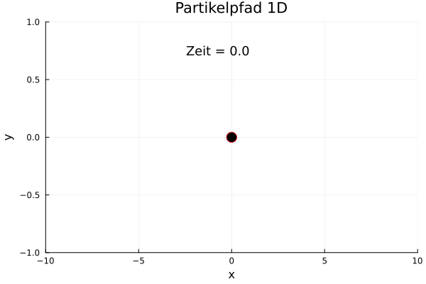

# [01 - Euler Advection(1D)](https://github.com/GeoSci-FFM/GeoModBox.jl/blob/main/exercises/01_1D_Euler_Advection.ipynb)

This exercise focuses on starting programming with `Julia` and discretizing and solving a partial differential equation. 

**Figure 1. 1-D Particle Advection.**
