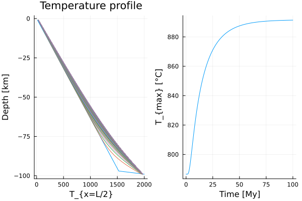

# [05 - 2D Heat Diffusion (transient, plume)](https://github.com/GeoSci-FFM/GeoModBox.jl/blob/main/exercises/05_2D_Diffusion_TD_Plume_en.ipynb)

This exercise focuses on solving the transient two-dimensional heat diffusion equation in the presence of a localized plume at the base of the domain. The setup represents a simplified geodynamic scenario where a plume head heats the lithosphere over time. The transient case is particularly useful to compare explicit and implicit time integration schemes and to understand their numerical properties.

The main objectives are:

1. Formulating and discretizing the transient 2D heat diffusion equation,  
2. Implementing explicit (Forward Euler) and implicit (Backward Euler) schemes,  
3. Applying Dirichlet and Neumann boundary conditions with ghost nodes,  
4. Exploring stability constraints of the explicit scheme versus the unconditional stability of the implicit scheme, and  
5. Visualizing the temporal evolution of the temperature field and extracting diagnostic profiles.  

The evolution of the temperature field due to plume heating is illustrated in Figure 1. The vertical profiles and the maximum temperature over time are illustrated in Figure 2. 

  

**Figure 1.** Time-dependent evolution of the two-dimensional temperature field with basal plume heating using the explicit scheme. 

**Figure 2.** Temperature-Depth profiles over time and the evolution of the maximum temperature with time. 