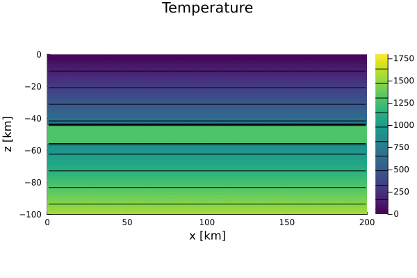

# [05 - 2D Heat Diffusion (transient, sill)](https://github.com/GeoSci-FFM/GeoModBox.jl/blob/main/exercises/05_2D_Diffusion_TD_Sill_en.ipynb)

This exercise investigates transient two-dimensional heat diffusion with a horizontally layered thermal anomaly (“sill”) at mid-depth. The setup uses a fixed surface temperature, a linear geotherm, and Neumann lateral boundaries; the sill starts hot and includes internal heat production. The case is useful for exploring the interplay between transient cooling and internal heating and how the system approaches thermal equilibrium.

The main objectives are:

1. Formulating and discretizing the transient 2D heat diffusion equation with internal heating,  
2. Implementing explicit (Forward Euler) and implicit (Backward Euler) time integration,  
3. Applying Dirichlet/Neumann boundary conditions via ghost nodes,  
4. Comparing stability constraints (explicit) versus unconditional stability and linear solves (implicit), and  
5. Visualizing the evolving temperature field and simple diagnostics (e.g., vertical profiles, maximum temperature over time).

The evolution of the temperature field is illustrated in Figure 1. The vertical profiles and the maximum temperature over time are illustrated in Figure 2. 

  

**Figure 1.** Time-dependent evolution of the two-dimensional temperature field with basal plume heating using the explicit scheme. 

**Figure 2.** Temperature-Depth profiles over time and the evolution of the maximum temperature with time. 
