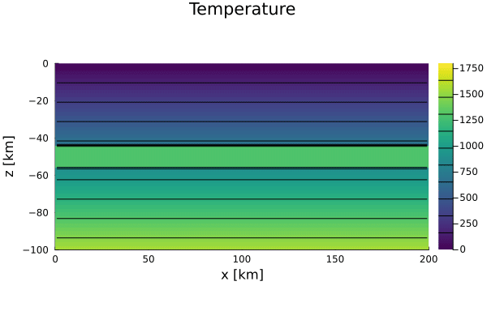
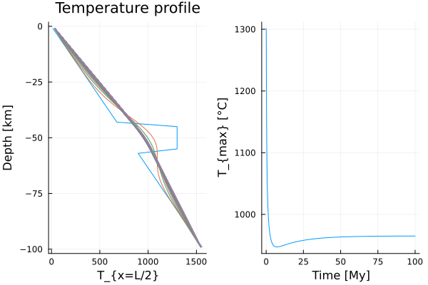

# [05 - 2D Heat Diffusion (transient, sill)](https://github.com/GeoSci-FFM/GeoModBox.jl/blob/main/exercises/05_2D_Diffusion_TD_Sill_en.ipynb)

This exercise investigates transient two-dimensional heat diffusion with a horizontally layered thermal anomaly (“sill”) at mid-depth. The setup uses a fixed surface temperature, a linear geotherm, and Neumann lateral boundaries; the sill starts hot and includes internal heat production. The case is useful for exploring the interplay between transient cooling and internal heating and how the system approaches thermal equilibrium.

The main objectives are:

1. Formulating and discretizing the transient 2D heat diffusion equation,  
2. Implementing the build-in general, combined solver for a non-linear problem using the defect correction method
3. Implementing the build-in special case solver for a linear problem using a single left matrix divison to solve the system of equations (explicit (Forward Euler) and implicit (Backward Euler))
4. Applying Dirichlet and Neumann boundary conditions with ghost nodes,  
5. Exploring stability constraints of the explicit scheme versus the unconditional stability of the implicit scheme, and  
6. Visualizing the temporal evolution of the temperature field and extracting diagnostic profiles.  

The evolution of the temperature field is illustrated in Figure 1. The vertical profiles and the maximum temperature over time are illustrated in Figure 2. 

  

**Figure 1.** Time-dependent evolution of the two-dimensional temperature field with basal plume heating using the explicit scheme. 

**Figure 2.** Temperature-Depth profiles over time and the evolution of the maximum temperature with time. 
