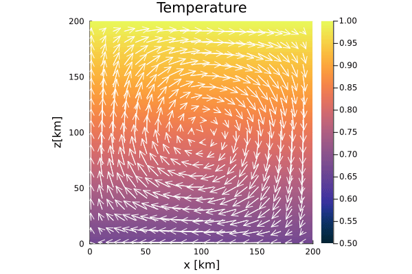

# [07 - 2D Energy Equation](https://github.com/GeoSci-FFM/GeoModBox.jl/blob/main/exercises/07_2D_Energy_Equation_en.ipynb)

This exercise focuses on solving the two-dimensional energy conservation equation, which combines both **advection** and **diffusion** processes. The main objectives are:

1. Understand the combined transport of temperature by advection and diffusion,  
2. Learn to apply different numerical schemes for advection (upwind, semi-Lagrangian, tracers, etc.) and diffusion (explicit, implicit, Crank–Nicolson, ADI, defect correction),  
3. Define different initial conditions for the temperature field (e.g., circular anomaly, Gaussian distribution, block anomaly, linear gradient),  
4. Explore prescribed velocity fields (rigid-body rotation, convection cell),  
5. Visualize and analyze the transient evolution of temperature fields and generate animations.

The example below shows the evolution of an initial linear temperature field in a constant shear cell velocity field (Figure 1).

**Figure 1.** Evolution of a 2-D temperature field unsing the Crank-Nicholson approach for diffusion and the semi-lagrangian method for advection.
