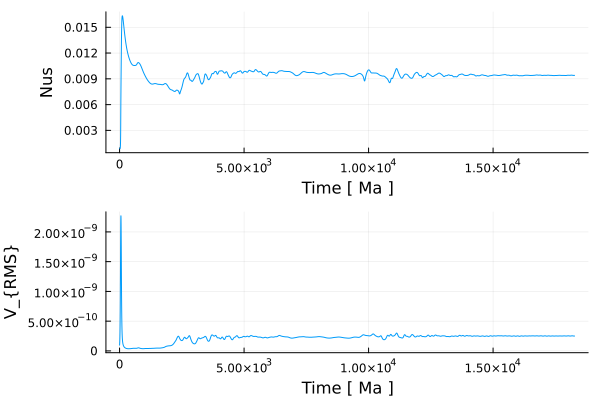
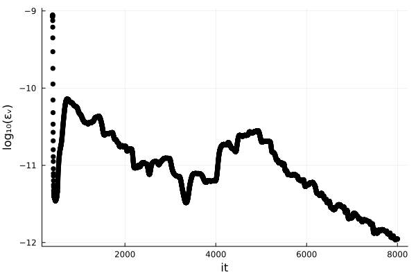

# [11 – 2D Thermal Convection](https://github.com/GeoSci-FFM/GeoModBox.jl/blob/main/exercises/11_2D_Thermal_Convection_en.ipynb)

This exercise introduces **2-D thermal convection** as an application of the three fundamental conservation laws:  

1. Conservation of energy,  
2. Conservation of momentum, and  
3. Conservation of mass.  

We focus on the **isoviscous, bottom-heated setup**, which serves as the simplest form of mantle convection. The problem demonstrates the interplay between **advection** and **diffusion** in heat transport, while density variations due to thermal expansion drive convective flow.  

The main objectives are:  

1. Understanding the governing equations for temperature, momentum, and mass conservation,  
2. Applying the **Boussinesq approximation** to simplify the system,  
3. Introducing the **Rayleigh number** as the key nondimensional control parameter,  
4. Setting up a finite-difference discretization of the model domain,  
5. Implementing thermal and velocity boundary conditions,  
6. Solving the coupled system in time, including advection and diffusion of temperature,  
7. Analyzing convection patterns for different Rayleigh numbers ($Ra = 10^4, 10^5, 10^6$),  
8. Computing diagnostic measures such as the **Nusselt number** and RMS velocity.  

The results illustrate how increasing the Rayleigh number strengthens convection, changes the scale of plumes and slabs, and increases the overall vigor of the flow.  

**Figure 1.** Isoviscous, bottom-heated thermal convection for $Ra = 10^6$ with a resolution of 150x50. The initial condition is a linearly increasing temperature profile with an elliptical anomaly on top. Thermal boundary conditions are fixed temperature at the top and bottom and zero heat flux at the sides. All velocity boundary conditions are free slip. Heat diffusion is solved using the Crank–Nicolson method, the Stokes equation using the defect correction method, and temperature advection with the semi-Lagrangian method. Models run until a steady state is reached or up to a maximum of 8000 iterations.  

**Figure 2.** Time series of the surface Nusselt number and the root mean square velocity. For details on how these diagnostics are calculated, see the [exercise](https://github.com/GeoSci-FFM/GeoModBox.jl/blob/main/exercises/11_2D_Thermal_Convection_en.ipynb).  

**Figure 3.** Variation in the root mean square velocity with numerical iterations. Empirically, a tolerance of $10^{-15}$ was chosen to define steady state. Low-$Ra$ cases typically reach steady state in fewer than 3000 iterations.  