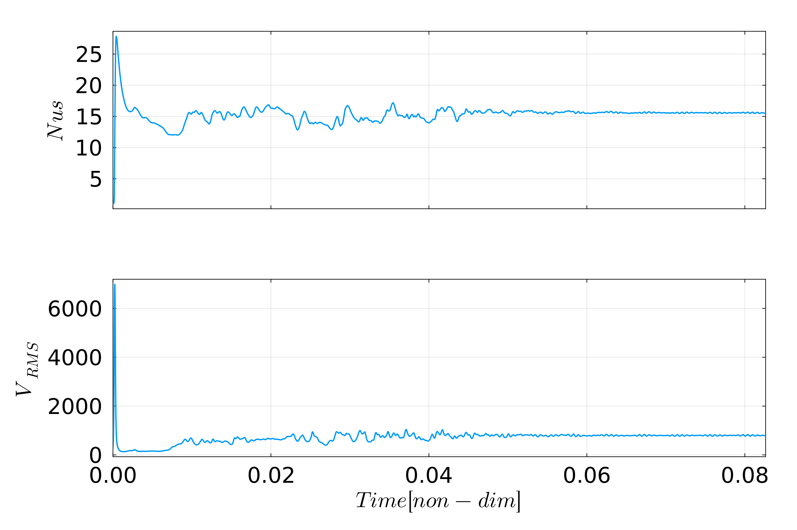
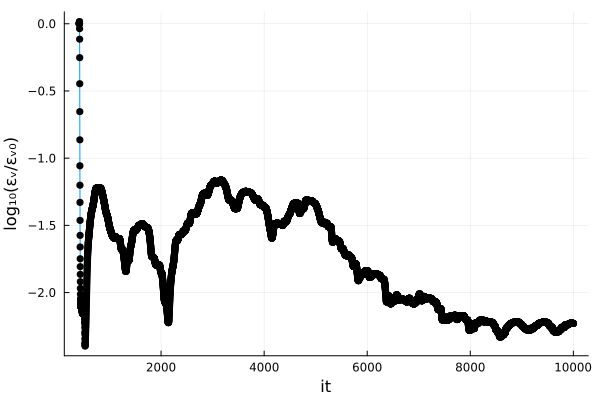

# [12 – 2D Thermal Convection (Non-Dimensional)](https://github.com/GeoSci-FFM/GeoModBox.jl/blob/main/exercises/12_2D_Thermal_Convection_scaled_en.ipynb)

This exercise revisits **2-D thermal convection** in a fully
**non-dimensional** framework. You will define characteristic scaling
constants, transform the governing equations into dimensionless form, and
investigate how the resulting flow depends on the **Rayleigh number**. The
model assumes an isoviscous rheology, bottom heating, and the
**Boussinesq approximation**.

**Objectives**

1. Define physically motivated **scaling constants** and apply the corresponding **scaling relations** to the governing equations.
2. Formulate the **dimensionless** energy, momentum, and mass conservation equations, including the buoyancy term $Ra\,T'$.
3. Implement Dirichlet and Neumann thermal boundary conditions and **free-slip** velocity boundary conditions.
4. Solve the coupled system of advection, diffusion, momentum, and mass conservation using finite-difference methods and the available `GeoModBox.jl` solvers.
5. Run and compare models for **$Ra=10^4$, $10^5$, and $10^6$**, and examine changes in plume and downwelling scales and overall flow vigor.
6. Compute diagnostic quantities such as the **surface Nusselt number** and **RMS velocity**, and assess the approach to statistical steady state.

As the Rayleigh number increases:

- the characteristic **flow velocities** increase,
- convection becomes **more vigorous**, and
- thermal plumes and downwellings become **narrower and more localized**.

The grid resolution must therefore be adjusted accordingly to maintain
numerical stability and solution accuracy.

> A finer grid, however, also substantially increases the computational cost.

The resolution prescribed here is sufficient for the investigated Rayleigh
numbers. Nevertheless, some numerical methods already show noticeable
inaccuracies at this resolution, indicating that a finer grid would provide
a more accurate solution.

**Figure 1.** Isoviscous, bottom-heated thermal convection for $Ra=10^6$
with a resolution of $150\times50$ cells. The initial condition consists of
a temperature profile that increases linearly with depth, with a small
elliptical thermal perturbation superimposed on the background field. The
top and bottom temperatures are fixed, while zero heat flux is prescribed
along the lateral boundaries. All velocity boundaries are free slip. Heat
diffusion is solved using a Crank–Nicolson discretization, the Stokes
equations using the defect-correction method, and temperature advection
using the semi-Lagrangian method. The model is run until statistical steady
state is reached or for a maximum of 8000 iterations.

**Figure 2.** Evolution of the surface Nusselt number and root mean square
(RMS) velocity. These quantities describe the efficiency of heat transport
and the overall vigor of convection. Details of their calculation are
provided in the [exercise](https://github.com/GeoSci-FFM/GeoModBox.jl/blob/main/exercises/12_2D_Thermal_Convection_scaled_en.ipynb).

**Figure 3.** Evolution of the relative variation in RMS velocity with
numerical iteration. The variation is evaluated over a moving window of
$3.8\times10^{-3}$ non-dimensional time units. A relative tolerance of
$10^{-4}$ is used to identify statistical steady state. Low-$Ra$ models
typically reach statistical steady state within fewer than 3000 iterations.