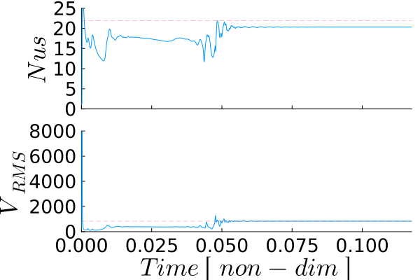
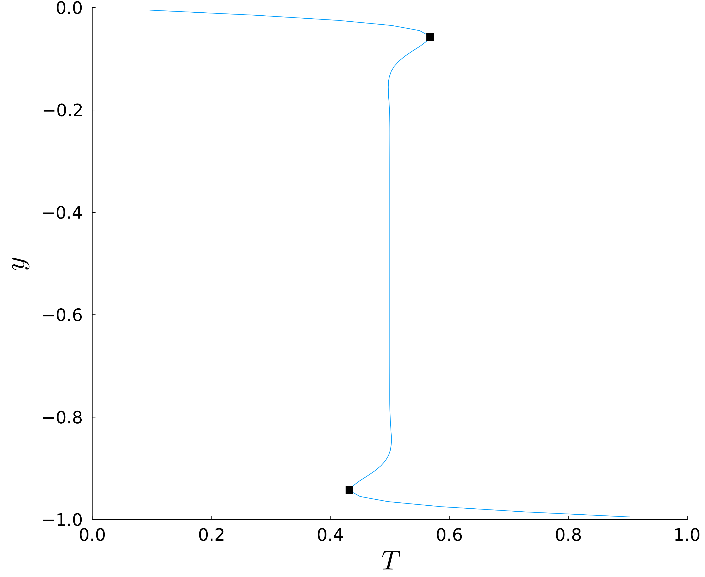
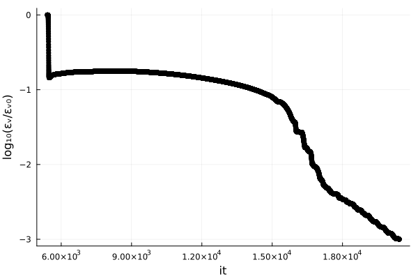
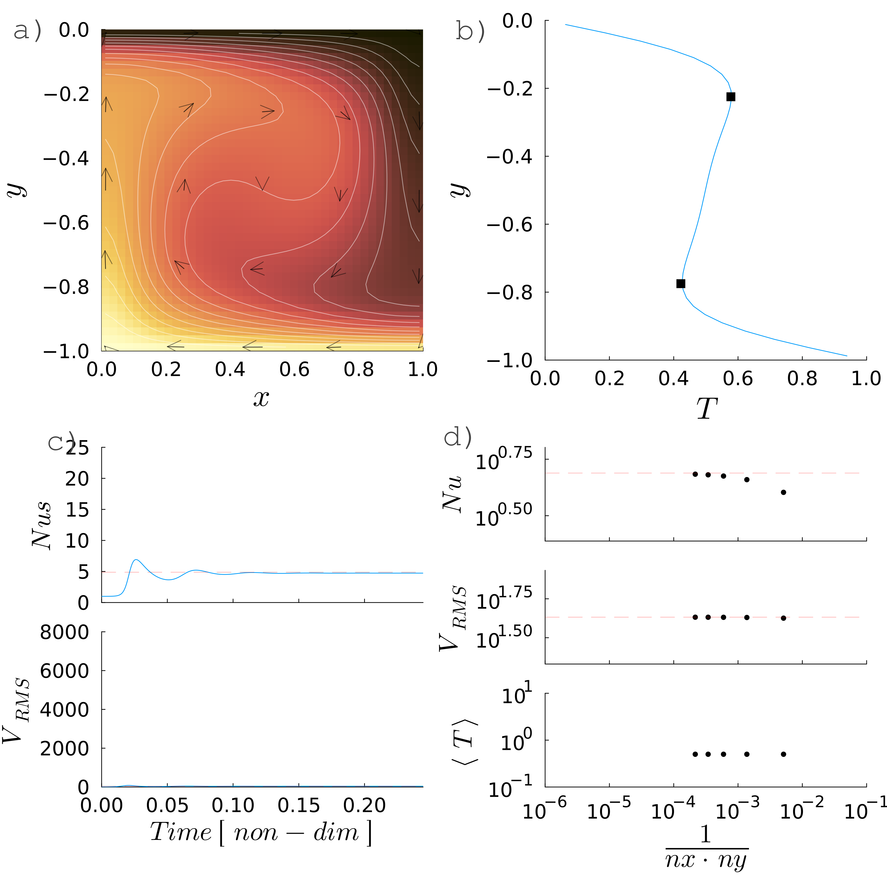
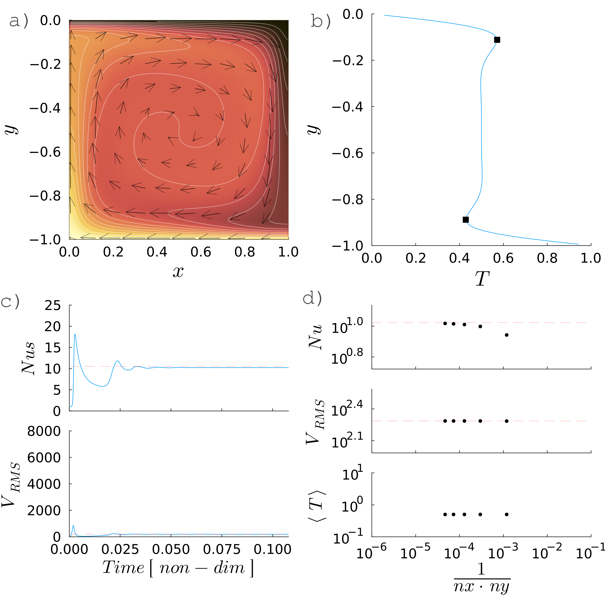

# [13 – Blankenbach Benchmark](https://github.com/GeoSci-FFM/GeoModBox.jl/blob/main/exercises/13_Blankenbach_Benchmark_en.ipynb)

This exercise introduces the **Blankenbach benchmark** (Blankenbach et al., 1989), a widely used reference test for validating numerical models of **mantle convection**. The benchmark compares results from different numerical methods by providing reference values for the **steady-state Nusselt number** and **mean velocity** at various Rayleigh numbers.

The setup consists of a **2-D rectangular box** with an aspect ratio of 1:1 (height = length = 1000 km). All boundaries are **free-slip**, while thermal boundary conditions are **fixed temperatures** at the top and bottom and **zero heat flux** along the sides. Density varies linearly with temperature according to the **Boussinesq approximation**. The initial temperature field consists of a conductive geotherm with a small sinusoidal perturbation. The conductive component establishes the background temperature gradient between the hot lower and cold upper boundaries, whereas the sinusoidal perturbation breaks the symmetry of the system and initiates the development of a single convection cell.

The main objectives are:

1. Implementing a **steady-state 2-D isoviscous convection model** under the Boussinesq approximation,  
2. Computing thermal convection for three different **Rayleigh numbers** ($Ra = 10^4, 10^5, 10^6$),  
3. Comparing the computed **Nusselt numbers** and **mean velocities** with the published benchmark values,  
4. Performing a **resolution test** to assess the convergence of numerical results, and  
5. Discussing deviations and numerical stability at higher Rayleigh numbers.

This benchmark demonstrates how increasing the Rayleigh number strengthens convection, leading to thinner thermal boundary layers and more localized upwellings and downwellings. It also highlights the importance of numerical resolution and stability in high–Rayleigh-number simulations.

**Figure 1.** Isoviscous, bottom-heated thermal convection for $Ra_b = 10^6$ with a resolution of 100×100.  
The initial condition is a sinusoidally perturbed conductive temperature field.  
The background color shows the non-dimensional temperature, overlaid by temperature isolines (every 0.05) and centroid velocity vectors. Heat diffusion is solved using the defect correction with a **Crank–Nicolson** discretization, the Stokes equation using the **defect correction** method, and temperature advection with the **semi-Lagrangian** method. Models run until a steady state is reached or up to a maximum of 8000 iterations.

**Figure 2.** Time series of the surface Nusselt number and root-mean-square (RMS) velocity. The steady-state benchmark values are shown as red dashed lines. For details on how these diagnostics are calculated, see the [exercise](https://github.com/GeoSci-FFM/GeoModBox.jl/blob/main/exercises/13_Blankenbach_Benchmark_en.ipynb).

**Figure 3.** Vertical temperature profile at the center of the model domain. Benchmark values for the local maximum and minimum temperatures are shown as black squares.

**Figure 4.** Variation in the relative root-mean-square velocity with numerical iterations. Empirically, a tolerance of $1.0^{-3}$ was chosen to define steady state.

**Figure 5.** Summary of the resolution study for a basal Rayleigh number of $Ra = 10^4$. (a) Final dimensionless temperature field with superimposed velocity vectors and temperature contours for the third model. (b) Vertical temperature profile through the center of the model. The black squares denote the published locations of the minimum and maximum temperatures reported by Blankenbach et al. (1989). (c) Evolution of the Nusselt number ($Nu$) and root-mean-square velocity ($V_{\mathrm{RMS}}$) toward steady state. The dashed red lines indicate the benchmark values. (d) Grid convergence of the Nusselt number, root-mean-square velocity, and mean temperature as a function of the inverse number of grid cells, $1/(n_x n_y)$. The dashed red lines correspond to the benchmark values.

**Figure 6.** Summary of the resolution study for a basal Rayleigh number of $Ra = 10^5$. The panels are the same as above. 

**Figure 7.** Summary of the resolution study for a basal Rayleigh number of $Ra = 10^6$. The panels are the same as above.
