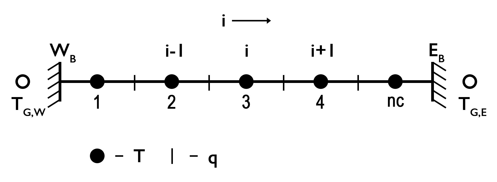
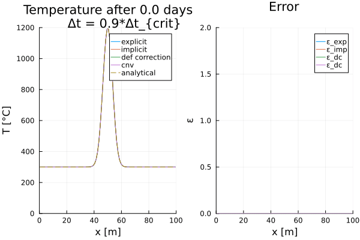

# General Information

&emsp; This directory provides several examples solving the diffusive part of the *temperature conservation equation* (in 1-D) using different numerical discretization methods. The solvers for a 1-D problem are located in [src/HeatEquation/1Dsolver.jl](../../../src/HeatEquation/1Dsolvers.jl).

[comment]: <> (Function for variable thermal parameters needed. Exlicit function available needs to be implemente here!)

## Energy Equation

In one dimension, the diffusive part of the energy equation is described by (assuming only radiogenic heating):

$$ 
\frac{\partial T}{\partial t} = -\frac{\partial q_x}{\partial x} + \rho H, \tag{1}
$$ 

or including Fourier’s law (assuming variable thermal parameters):

$$
\frac{\partial T}{\partial t} = \frac{\partial}{\partial x} k_x \frac{\partial T}{\partial x} + \rho H. \tag{2} 
$$

Assuming that the thermal parameters are constant, equation $\left(2 \right)$ simplifies to: 

$$
\frac{\partial T}{\partial t} = \kappa \frac{\partial^2 T}{\partial x^2} + \frac{Q}{\rho c_p}, \tag{3} 
$$
  
where $\kappa = k/\rho /c_p$ is the thermal diffusivity [m2/s] and $Q=\rho H$ is the heat production rate per volume [W/m3]. Equation $(3)$ is a *parabolic partial differential equation* which can be solved numerically in different manners, assuming initial and boundary conditions are defined. 

&emsp; First, we would like to discuss a simple, but effective, finite difference method to discretize and solve the equation, that is the forward in time and centered in space (FTCS) method in an *explicit* manner. This finite difference scheme will converge to the exact solution for small $\Delta x$ and $\Delta t$. The advantage of an explicit description is that it is **simple** to derive and rather **fast** computationally. However, it is only numerically stable as long as the *heat diffusive stability criterion* is fulfilled. The stability criterion can be determined by a *Von Neumann* stability analysis, which analyzes the growth of an eigenmode perturbation for a certain finite difference approach. In case of an **explicit 1-D finite difference approach**, the *heat diffusive stability criterion* is defined as $\Delta t < \frac{\Delta x^2}{2 \kappa}$ (assuming equal grid spacing), that is the time step is limited by the model’s resolution. 

## Discretization 

  
**Figure 1.** ... *Where would $\rho$ and $Q$ be defined?*

[comment]: <> (Needs to be completed)

### Explicit, FTCS (or Forward Euler Method)

Using an FTCS, explicit finite difference scheme to approximate the partial derivatives from equation $(3)$ results in:

$$
\frac{T_{i}^{n+1} - T_{i}^{n} }{\Delta t} = \kappa \frac{T_{i-1}^{n} - 2T_{i}^{n} + T_{i+1}^{n}}{(\Delta x)^2} + \frac{Q_{i}^n}{\rho c_p}, \tag{4}
$$ 

where *i* is the horizontal index of the numerical finite difference grid, *n* is the time step index, Δ*t* is the time step, and Δ*x* the width of the grid in horizontal direction. This equation contains know and unknow parameters and one can rearrange them to solve the equation for the unknowns as:

$$
T_{i}^{n+1} = T_{i}^{n} + a \left(T_{i-1}^{n} - 2T_{i}^{n} + T_{i+1}^{n} \right) + \frac{Q_{i}^n \Delta t}{\rho c_p}, \tag{5}
$$

where $a = \frac{\kappa \Delta t}{(\Delta x)^2}$. Equation $(5)$ can be solved *iteratively* for every central grid point assuming initial and boundary coniditions are defined. For more details on how this is implemented see [*1Dsolvers.jl*](../../../src/HeatEquation/1Dsolvers.jl).

#### Boundary conditions 

&emsp;Different thermal boundary conditions can be set for our model for which we now utilize the *ghost nodes*. Here, we focus on two fundamental conditions, the *Dirichlet* and *Neumann* boundary conditions. To consider both boundary conditions to solving the equations, one needs to define the temperature at the *ghost nodes* based on the assumed boundary condition. The Dirichlet boundary condition defines a constant temperature along the boundary, such that the temperatures at the left (west) and right (east) *ghost node* are defined as:

$$
T_{G,W} = 2T_{BC,W} - T_{1}, \tag{6}
$$
$$
T_{G,E} = 2T_{BC,E} - T_{nc}, \tag{7}
$$

where $T_{G,W}$, $T_{G,E}$ and $T_{BC,W}$, $T_{BC,E}$ are the temperature at the left and right *ghost nodes* and the constant temperatures at the left and right boundary, respectrively. Now one can solve equation $(5)$ for each central grid point using the defined temperature at the *ghost nodes*.  

&emsp;The Neumann boundary condition defines that the variation of a certain parameter does not change across the boundary, that is, for example, the temperature across the boundary or thermal heat flux *q* through the boundary. The temperature at the *ghost nodes* is then defined as: 

$$
T_{G,W} = T_{1} - c_{W} \Delta{x}, \tag{8}
$$
$$
T_{G,E} = T_{nc} + c_{E} \Delta{x}, \tag{9}
$$

where 

$$
\left. c_{W} = \frac{\partial{T}}{\partial{x}} \right\vert_{W}, and \ \left. c_{E} = \frac{\partial{T}}{\partial{x}} \right\vert_{E}, \tag{10}
$$

are the constant heat fluxes along the left and right boundary, respectively. Now one can solve equation $(5)$ for each central grid point using the defined temperature at the *ghost nodes*.  

## Numerical schemes

&emsp; Within the example code [Heat_1D_discretization.jl](Heat_1D_discretization.jl) different numerical schemes are used to solve the diffusive part of the temperature equation (i.e., *explicit*, *implicit*, *CNA*, and *defection correction*). In the following, we will briefly describe those well-know numerical schemes to solve the diffusive part of the temperature equation and briefly discuss their advantages and disadvantages.

### Implicit, FTCS (or Backward Euler Method)

&emsp;The fully implicit finite difference scheme is unconditionally stable and one can use time steps larger than the diffusion time criterion. In 1-D, the temperature equation is then given as: 

$$
\frac{T_{i}^{n+1}-T_{i}^n}{\Delta t} = \kappa \frac{T_{i-1}^{n+1}-2T_{i}^{n+1}+T_{i+1}^{n+1}}{\Delta x^2} + \frac{Q_{i}^n}{\rho c_p}, \tag{11}
$$

where *n* is the current and *n+1* the next time step, $\Delta{t}$ is the time step length, $\Delta{x}$ is the horizontal grid spacing, and *i* is the horizontal index, respectively. Rearranging equation $(11)$ into known and unknown variables, one obtains a linear system of equations in the form of: 

$$
- a T_{i-1}^{n+1} + \left(2a + b \right) T_{i}^{n+1} - a T_{i+1}^{n+1} = b T_{i}^n + \frac{Q_{i}^n}{\rho c_p}, \tag{12}
$$, 

where $a = \frac{\kappa}{\Delta{x^2}}$ and $b = \frac{1}{\Delta{t}}$. This is a linear system of equation in the form of $\boldsymbol{A}\cdot x = rhs$, where $\boldsymbol{A}$ is a coefficient matrix (here with three non-zero diagonals), $x$ the unknown vector, and $rhs$ the known right-hand side. The main advantage of the implicit method is that there are no restrictions on the time step, but this does not mean that it is more accurate. Taking too large time steps may result in an inaccurate solution for features with small spatial scales.

#### Boundary Conditions

&emsp;The temperature on the *ghost nodes* to solve the equations on the central grid points adjacent to the boundary are defined as before (equations $(8)$ and $(9)$). To obtain a symmetric coefficient matrix to solve the linear system of euqations, however, one needs to modify the coefficients for the inner grid points adjacent to the boundary and the corresponding right-hand side, such that the equations are defined as:  

**Dirichlet**  
*West*
$$
\left(3 a + b\right) T_{1}^{n+1} - a T_{2}^{n+1} = b T_{1}^{n} + 2 a T_{BC,W}, \tag{13}
$$
*East*
$$
- a T_{nc-1}^{n+1} + \left(3 a + b\right) T_{nc}^{n+1}  = b T_{nc}^{n} + 2 a T_{BC,E}, \tag{14}
$$

**Neumann**  
*West*
$$
\left(a + b\right) T_{1}^{n+1} - a T_{2}^{n+1} = b T_{1}^{n} - a c_{W} \Delta{x}, \tag{15}
$$
*East*
$$
- a T_{nc-1}^{n+1} + \left(a + b\right) T_{nc}^{n+1}  = b T_{nc}^{n} + a c_{E} \Delta{x}, \tag{16}
$$

### Defection Correction Method

...

<!--- 

*Theory*
$$
\boldsymbol{K} \cdot T - b = R
$$

$$
R_i = \boldsymbol{K} \cdot T_i - b
$$

$$
0 = \boldsymbol{K} \left(T_i + \delta{T} \right) - b = \boldsymbol{K} T_i - b + \boldsymbol{K} \delta{T} = R_i + \boldsymbol{K} \delta{T} 
$$

$$
R_i = -\boldsymbol{K} \delta{T}
$$

$$
\delta{T} = -\boldsymbol{K}^{-1} R_i
$$

$$
\frac{\partial{T}}{\partial{t}} - \kappa \frac{\partial^2{T}}{\partial{x}^2} = R
$$

$$
\frac{T_i^{n+1}-T_i^{n}}{\Delta{t}} - \kappa \frac{T_{i-1}^{n+1} - 2 T_{i}^{n+1} + T_{i+1}^{n+1}}{\Delta{x}^2} = R
$$

$$
- a T_{i-1}^{n+1} + \left(2 a + b \right) T_{i}^{n+1} - a T_{i+1}^{n+1} - b T_{i}^{n} = R
$$

$$
a = \frac{\kappa}{\Delta{x}^2},\ and \ b = \frac{1}{\Delta{t}}
$$

-->

### Cranck-Nicolson approach (CNA)

&emsp;The fully implicit method works well, but is only first order accurate in time. A way to modify this is to employ a Crank-Nicolson time step discretization, which is implicit and thus second order accurate in time. In 1-D, equation $(5)$ is then described as: 

$$
\frac{T_{i}^{n+1} - T_{i}^{n}}{\Delta t} = \frac{\kappa}{2}\frac{(T_{i-1}^{n+1}-2T_{i}^{n+1}+T_{i+1}^{n+1})+(T_{i-1}^{n}-2T_{i}^{n}+T_{i+1}^{n})}{\Delta x^2}
$$

&emsp;Similar to the implicit method, we need to modify the coefficients and the right-hand side using different boundary conditions to obtain a symmetric coefficient matrix. Thus, the equations for the central grid points adjacent to the boundaries are defined as: 

**Dirichlet** 
*West*
$$
\left(b + 3 a \right) T_{1}^{n+1} - a T_{2}^{n+1} = \left( b - 3 a \right) T_{1}^{n} + a T_{2}^{n} + 4 a T_{BC,W}
$$
*East*
$$
- a T_{nc-1}^{n+1} + \left(b + 3 a \right) T_{nc}^{n+1} = a T_{nc-1}^{n} + \left( b - 3 a \right) T_{nc}^{n} + 4 a T_{BC,E}
$$
**Neumann** 
*West*
$$
\left(b+a\right)T_{1}^{n+1} - a T_{2}^{n+1} = \left(b-a\right)T_{1}^{n} + a T_{2} - 2ac_{W} \Delta{x}
$$
*East*
$$
- a T_{nc-1}^{n+1} + \left(b+a\right)T_{nc}^{n+1}  = a T_{nc-1}^{n} + \left(b-a\right)T_{nc}^{n} + 2ac_{E} \Delta{x}
$$

&emsp;However, the band-width of the coefficient matrix increases as in the fully implicit case. Thus, the method becomes memory intensiv for models with a high resoltuion. For more details on how this is implemented, see [*1Dsolvers.jl*](../../../src/HeatEquation/1Dsolvers.jl).

-------------
-------------

## Examples

### Gaussian Diffusion ([Heat_1D_discretization.jl](Heat_1D_discretization.jl))

...

  
**Figure 2. Diffusion of an initial Gaussian temperature distribution.** ... 

### Geotherms

...

<!--- 

&emsp;The 1-D temperature profile is calculated by solving the diffusive part of the 1-D temperature conservation equation (so far only with a radiogenic heat source) for variable thermal parameters with a proper conserving finite difference scheme. That is, the heat flow is calculated on the centered and the remaining parameters on the regular grid points, respectively. The discretization scheme for variable thermal parameters is picked to solve for a temperature profile of a continental lithosphere with upper, lower crust, and mantle. The 1-D temperature equation is given by: 

$\rho c_{p} \frac{\partial T}{\partial t} = \frac{\partial}{\partial z}(k \frac{\partial T}{\partial z}) + \rho H$, &emsp; &emsp; &emsp; (29)

where $\rho, c_{p}, T, t, k, H, z$ are the density [kg/m3], the specific heat capacity [J/kg/K], the temperature [K], the time [s], the thermal conductivity [W/m/K], the heat generation rate per mass [W/kg], and the depth [m] respectively. For values and references of the given thermal parameters see [*OceanicGeotherm_1D.jl*]() and [*ContinentalGeotherm_1D.jl*]().

&emsp;Here, a proper conservative finite difference scheme means that the heat flux is calculated on the centered grid points (A, B, etc.). The 1-D vertical heat flux is given by the Fourier’s law:

$q_{z} = -k \frac{\partial T}{\partial z}$. &emsp; &emsp; &emsp; (30)

#### ***Solving the equation***

&emsp;Following the discretization as described above, one needs to solve the following equation (in an [implicit finite difference formulation]()):

$\rho_j c_{p,j} \frac{T_{j}^{n+1} - T_{j}^{n}}{\Delta t} = -\frac{q_{z,B}^{n+1} - q_{z,A}^{n+1} }{\Delta z} + \rho_j H_j$, &emsp;&emsp;&emsp; (31)

$\rho_j c_{p,j} \frac{T_{j}^{n+1} - T_{j}^{n}}{\Delta t} = \frac{ k_{B} \frac{T_{j+1}^{n+1} - T_{j}^{n+1}}{\Delta z} - k_{A} \frac{T_{j}^{n+1} - T_{j-1}^{n+1}}{\Delta z} }{\Delta z} + \rho_j H_j$. &emsp;&emsp;&emsp; (32)

Sorting the variables (known variables on the right-hand side, unknown on the left-hand side): 

$\frac{k_{B}}{\Delta z^2} T_{j+1}^{n+1} - \frac{k_{B}}{\Delta z^2} T_{j}^{n+1} - \frac{k_{A}}{\Delta z^2} T_{j}^{n+1} + \frac{k_{A}}{\Delta z^2} T_{j-1}^{n+1} = \frac{\rho_j c_{p,j}}{\Delta t} T_{j}^{n+1} - \frac{\rho_j c_{p,j}}{\Delta t} T_{j}^{n} - \rho_j H_j$, &emsp;&emsp;&emsp;(33)

$\frac{k_{B}}{\Delta z^2} \frac{\Delta t}{\rho_j c_{p,j}} T_{j+1}^{n+1} - \frac{\Delta t}{\rho_j c_{p,j}} (\frac{k_{B} + k_{A}}{\Delta z^2}) T_{j}^{n+1} - T_{j}^{n+1} + \frac{k_{A}}{\Delta z^2}\frac{\Delta t}{\rho_j c_{p,j}} T_{j-1}^{n+1} = -T_{j}^{n} - \frac{H_j \Delta t}{c_{p,j}}$, &emsp;&emsp;&emsp;(34)

$-\frac{k_{B}}{\Delta z^2}\frac{\Delta t}{\rho_j c_{p,j}}T_{j+1}^{n+1} + (1 + \frac{\Delta t}{\rho_j c_{p,j}} (\frac{k_{B} + k_{A}}{\Delta z^2}))T_{j}^{n+1} - \frac{k_{A}}{\Delta z^2}\frac{\Delta t}{\rho_j c_{p,j}} T_{j-1}^{n+1} = T_j^n + \frac{H_j \Delta t}{c_{p,j}}$, &emsp;&emsp;&emsp;(35)

$aT_{j-1}^{n+1} + bT_{j}^{n+1} + cT_{j+1}^{n+1} = T_j^n + \frac{H_j \Delta t}{c_{p,j}}$, &emsp;&emsp;&emsp;(36)

with

$a = -\frac{k_{A}}{\Delta z^2}\frac{\Delta t}{\rho_j c_{p,j}}$

$b = (1 + \frac{\Delta t}{\rho_j c_{p,j}} (\frac{k_{B} + k_{A}}{\Delta z^2}))$, &emsp;&emsp;&emsp; (37) 

$c = - \frac{k_{B}}{\Delta z^2}\frac{\Delta t}{\rho_j c_{p,j}}$

and

$k_{A} = \frac{k_{j-1} + k_{j}}{2}$

$k_{B} = \frac{k_j + k_{j+1}}{2}$. &emsp;&emsp;&emsp; (38)

An [*explicit*]() solver for a 1-D thermal profile with variable thermal parameters and a radiogenic heat source is also available. For an example of a 2-D model setup see the [Continental_Geotherm]() directory. While this is simply an extension of the 1-D steady-state solution into a second dimension, one could use this model to calculate the steady-state solution of more complex continental settings (e.g., by using the markers and interpolating the properties from the marker onto the grid; similar to the [RTI]) or the [viscous inclusion]().

#### Thermal boundary conditions

The thermal boundary conditions are defined as: 

1. **Constant temperature** (*Dirichlet*) 
The temperature at the top or bottom can just be set as constant to *Ttop* or *Tbot*, respectively.
      
2. **Constant temperature gradient** (*Neumann*) 
The gradient of temperature (and thus the vertical heat flux) can be defined using so called ghost nodes at the top and the bottom of the profile. Therefore, we define the condition at the top and bottom as:

   $\frac{\partial T}{\partial z} \vert_{j=1} = c_{top} = \frac{T_2-T_0}{2\Delta z}$

   $\frac{\partial T}{\partial z} \vert_{j=nz} = c_{bottom} = \frac{T_{nz+1}-T_{nz-1}}{2\Delta z}$, &emsp;&emsp;&emsp; (39)

   Where *T0* and *Tnz+1* are the ghost nodes for temperature at the top and bottom, respectively. The constants *ctop* and *cbottom* are defined as:

   $c_{top,bottom} = -\frac{q_{top,bottom}}{2\Delta z}$
   
   Using these conditions, we can define formulations for the temperature at the ghost nodes as:

   $T_0 = T_2 - 2\Delta z c_{top}$

   $T_{nz+1} = T_{nz-1} + 2\Delta z c_{bottom}$

   Now one can solve equation (31) for the top and the bottom using the formulations of the temperature at the ghost nodes with equation (39), which results in:

   $\rho_{j=1}c_{p,j=1}\frac{\partial T}{\partial t}\vert_{j=1} = \frac{\partial}{\partial z}(k\frac{\partial T}{\partial z})$

   $\rho_1c_{p,1}\frac{T_1^{n+1} - T_1^n}{\Delta t} = \frac{ k_A\frac{dT}{dz}\vert_A - k_B\frac{dT}{dz}\vert_B }{\Delta z}$

   $\rho_1c_{p,1}\frac{T_1^{n+1} - T_1^n}{\Delta t} = \frac{ k_A\frac{T_2^{n+1} - T_1^{n+1}}{\Delta z} - k_B\frac{T_1^{n+1} - T_0^{n+1}}{\Delta z} }{\Delta z}$

   $\rho_1c_{p,1}\frac{T_1^{n+1} - T_1^n}{\Delta t} = \frac{k_A}{\Delta z^2}T_2^{n+1} - \frac{k_A}{\Delta z^2}T_1^{n+1} - \frac{k_B}{\Delta z^2}T_1^{n+1} + \frac{k_B}{\Delta z^2}T_0^{n+1}$

   $\rho_1c_{p,1}\frac{T_1^{n+1} - T_1^n}{\Delta t} = \frac{k_A}{\Delta z^2}T_2^{n+1} - \frac{k_A+k_B}{\Delta z^2}T_1^{n+1} + \frac{k_B}{\Delta z^2}(T_2^{n+1} - 2\Delta z c_{top})$

   $\rho_1c_{p,1}\frac{T_1^{n+1} - T_1^n}{\Delta t} = - \frac{k_A + k_B}{\Delta z^2}T_1^{n+1} + \frac{k_A+k_B}{\Delta z^2}T_2^{n+1} - \frac{k_B}{\Delta z}2c_{top}$

   $(1 + \frac{\Delta t}{\rho_1 c_{p,1} \Delta z^2} (k_A+k_B) ) T_1^{n+1} - \frac{\Delta t}{\rho_1 c_{p,1} \Delta z^2} (k_A+k_B) T_2^{n+1} = T_1^n - \frac{2\Delta t c_{top}}{ \rho_1 c_{p,1} \Delta z} k_B$

   $aT_1^{n+1}+bT_2^{n+1}=T_1^n+Q_{top}$, &emsp;&emsp;&emsp; (40)

   with

   $a = 1+\frac{\Delta t}{\rho_1 c_{p,1} \Delta z^2}(k_A+k_B)$

   $b = -\frac{\Delta t}{\rho_1 c_{p,1} \Delta z^2}(k_A+k_B)$

   $Q_{top} = -\frac{2\Delta t c_{top}}{\rho_1 c_{p,1} \delta z}k_A$. &emsp;&emsp;&emsp; (41)

   Similar for the bottom boundary with:

   $aT_{nz}^{n+1}+bT_{nz-1}^{n+1}=T_{nz}^{n} + Q_{bottom}$

   $a = 1+\frac{\Delta t}{\rho_{nz} c_{p,nz} \Delta z^2}(k_A+k_B)$

   $b = -\frac{\Delta t}{\rho_{nz} c_{p,nz} \Delta z^2}(k_A+k_B)$

   $Q_{top} = -\frac{2\Delta t c_{bottom}}{\rho_{nz} c_{p,nz} \delta z}k_A$. &emsp;&emsp;&emsp; (42)

-------------

#### Results

#### Oceanic Geotherms
 
**Figure 1. Oceanic Lithosphere.** LEFT: Temperature profile [K]  for an oceanic lithosphere of 60 Ma of age and constant thermal boundary conditions at the top and bottom. The blue line shows the initial temperature profile. The yellow dashed line shows the solution for a half-space cooling model. RIGHT: Heat flux qz [mW/m2] with depth. The parameters of this model are defined as the default values in the routine OceanicGeotherm.m.

 
**Figure 2. Oceanic Lithosphere II**. Same as **Figure 1** but with constant heat flux boundary conditions qbottom =10 mW/m2 and qtop = 90 mW/m2.

#### Continental Geotherms
 
**Figure 3. Continental Lithosphere.** LEFT: Temperature profile for a continental lithosphere of 1000 Ma of age with constant upper and lower thermal boundary conditions. The blue line shows the initial condition, the red line shows the solution of equation (1), the yellow dashed line shows the solution of the time-independent heat equation (1-D poisson equation), and the magenta dashed line shows the solution of a [2D, staggered finite difference code](). MIDDLE: Heat flux with depth. RIGHT: Thermal parameter for the lithosphere setup: thermal conductivity [k], specific heat [cp], density [ρ], and volumetric heat generation rate [Q].

 
**Figure 5. Continental Lithosphere II**. Same as **Figure 3** but with constant upper and lower heat flux boundary conditions, qtop = 40 mW/m2 and qbottom = 10 mW/m2.

-->

-------------
-------------

# Directory Content
[Heat_1D_discretization.jl](Heat_1D_discretization.jl) 
&emsp;-> Solving the time-dependent diffusion of an initial Gaussian temperature distribution using different numerical finite difference schemes and comparing the results with the analytical solution.
    
[OceanicGeotherm_1D.jl]() 
&emsp;-> Script to calculate the 1-D oceanic geotherm.

[comment]: <> (Needs, in detail:- discretization of explicit variable thermal parameters, at some point!)

