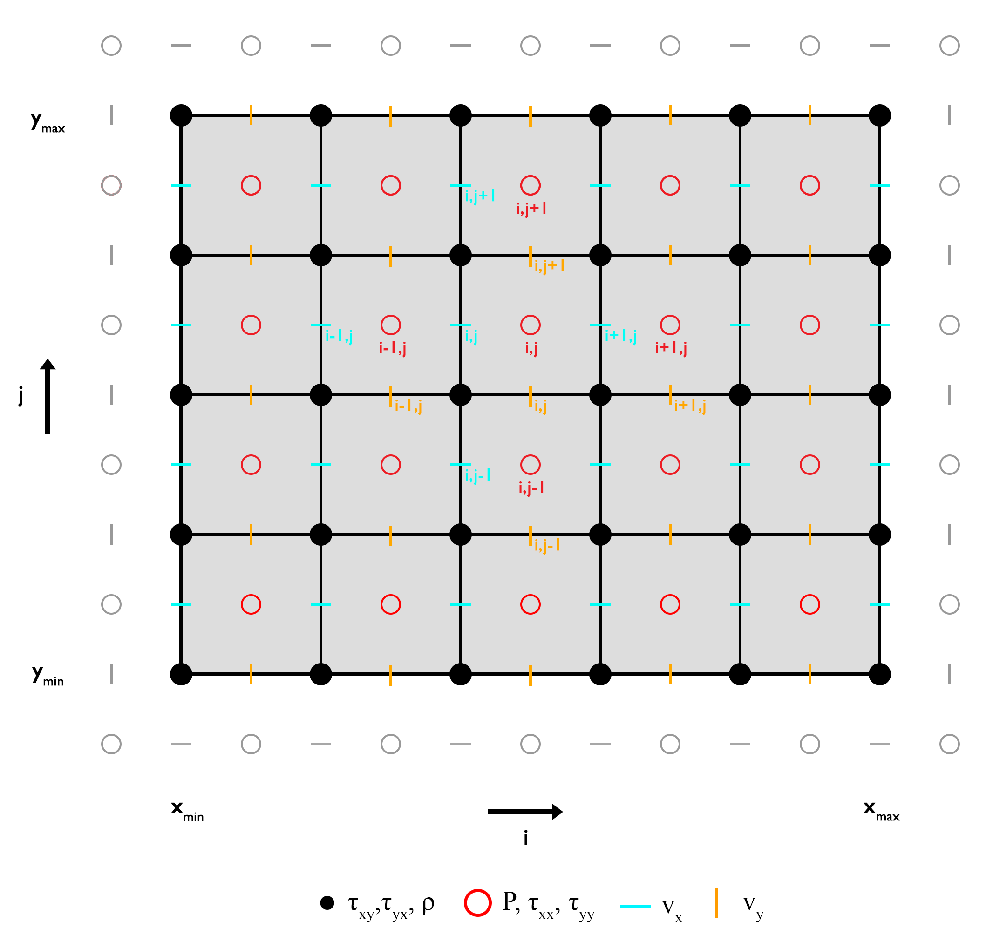
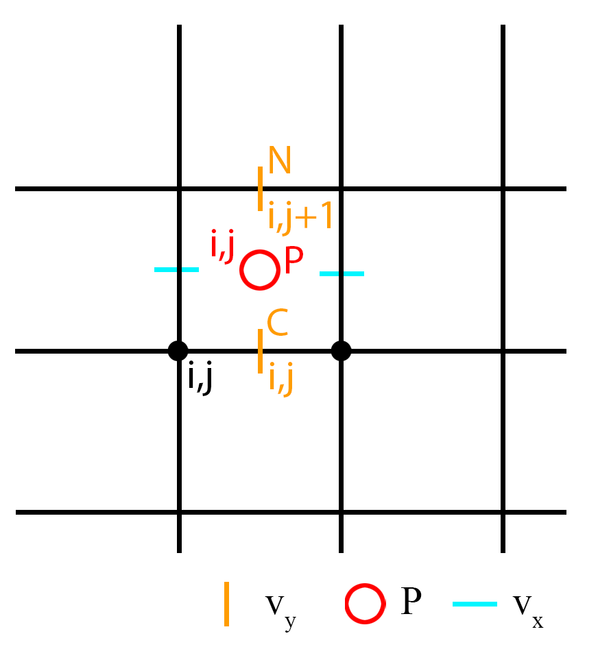
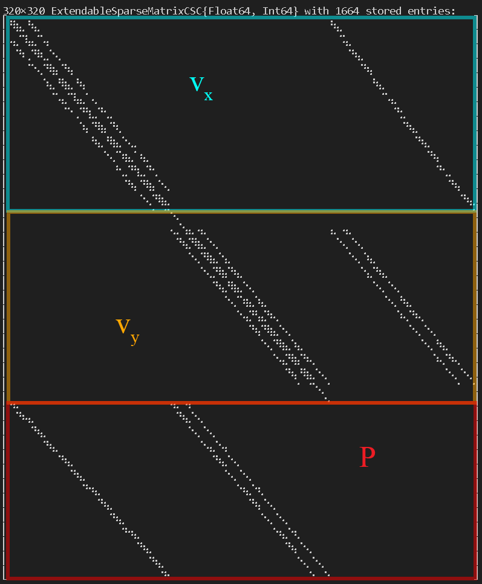

# General Information

To numerically solve for the three unknows $v_x$, $v_y$, and $P$, one needs to discretize the *x-* and *y-component* of the **momentum equation** and the **continuum equation**. Here, we assume an incompressible medium, i.e. we use the so called Boussinesq-approximation. 

---------------------
---------------------
## Stokes Equation (2D)

The Stokes equation (the **conservation equation of momentum**) in two dimensions is defined as: 

$$
\begin{equation}
0 = -\frac{\partial{P}}{\partial{x_i}} + \frac{\partial}{\partial{x_j}}\tau_{ij} + \rho \cdot g_i, 
\end{equation}
$$

where $P$ is the total pressure,  $\rho$ is the density, $g_i$ the gravitational acceleration, $\frac{\partial}{\partial{x_i}}$ the spatial derivative in the direction of $x_i$, and $\tau_{ij}$ is the deviatoric stress tensor and defined as: 

$$\begin{equation}
\tau_{ij} = 2\eta \dot{\varepsilon}_{ij}.
\end{equation}
$$

The **conservation equation of mass** is defined as: 

$$\begin{equation}
div\left(\overrightarrow{v} \right) = \left(\frac{\partial{v_i}}{\partial{x_i}}+\frac{\partial{v_j}}{\partial{x_j}}\right) = 0, 
\end{equation}
$$

where $v_i$ is the velocity in the i-th direction. 

### Discretization 

The conservation equations of *momentum* and *mass* are solved properly in two dimensions (*x* and *y*) using a staggered finite difference grid, where the horizontal (*cyan dashes*) and vertical (*orange dashes*) velocities are defined inbetween the regular grid points or *vertices*, and the pressure (*red circles*) within a finite difference cells or *centroids* (Figure 1). A staggered grid enables the conservation of the stress between adjacent grid points and one can solve equations $(1)$ and $(3)$ for the unknows.  

  
**Figure 1. Staggered finite difference grid.** Discretization of the conservation equations of momemtum and mass. The horizontal and vertical velocities require *ghost nodes* at the North and South and East and West boundary, respectively. <!-- What about the pressure ghost nodes? Are they even necessary? -->

### Constant Viscosity

Let's first assume a special case of the Stokes equation, a **constant viscosity**, which simplifies equation $(1)$ to: 

$$\begin{equation}
0 = -\frac{\partial{P}}{\partial{x_i}} + 2\eta\frac{\partial^2{v_i}}{\partial{x_i^2}} + \eta\left(\frac{\partial^2{v_i}}{\partial{x_j^2}}+\frac{\partial^2{v_j}}{\partial{x_i^2}}\right) + \rho \cdot g_i. 
\end{equation}
$$

Using equation $(3)$ and neglecting a horizontal graviational acceleration, equation $(4)$ can further be simplified to: 

*x-component* 

$$
\begin{equation}
-\frac{\partial{P}}{\partial{x}} + \eta\frac{\partial^2{v_x}}{\partial{x^2}} + \eta\frac{\partial^2{v_x}}{\partial{y^2}} = 0, 
\end{equation}
$$

*y-component*

$$
\begin{equation}
-\frac{\partial{P}}{\partial{y}} + \eta\frac{\partial^2{v_y}}{\partial{y^2}} + \eta\frac{\partial^2{v_y}}{\partial{x^2}} = - \rho g_y. 
\end{equation}
$$

For each equation, one can define a so-called numerical stencil which highlights the position of the required parameters with respect to the central point $(i,j)$, where *i* and *j* are the indices in the horizontal and vertical direction, respectively. The central point corresponds to the number of the equation in the linear system of equations. 

#### Stencil

The stencils for the momentum equation assuming a constant viscosity shows the points required to solve the equations for each component of the momentum equation using the finite difference approach (Figure 2). 

  
**Figure 2. Numerical stencils for the momentum equation.** a) *x-component*. b) *y-component*.

Using the finite difference operators, equations $(5)$ and $(6)$ are defined as: 

*x-component*

$$\begin{equation}
-\frac{P_{i,j}-P_{i-1,j}}{\Delta{x}} + \eta\frac{v_{x,(i-1,j)}-2v_{x,(i,j)}+v_{x,(i+1,j)}}{\Delta{x^2}} + \eta\frac{v_{x,(i,j-1)}-2v_{x,(i,j)}+v_{x,(i,j+1)}}{\Delta{y^2}} = 0
\end{equation}
$$

$$
\begin{equation}
P_CP_{i,j} + P_WP_{i-1,j} + Sv_{x,(i,j-1)} +  Wv_{x,(i-1,j)} + Cv_{x,(i,j)} + E v_{x,(i+1,j)} + N v_{x,(i,j+1)} = 0, 
\end{equation}
$$

where 

$$\begin{equation}
\begin{split}
P_C = -\frac{1}{\Delta{x}},  \\
P_W = \frac{1}{\Delta{x}}, \\
S = \frac{\eta}{\Delta{y^2}}, \\
W = \frac{\eta}{\Delta{x^2}}, \\
C = -2\eta\left(\frac{1}{\Delta{x^2}}+\frac{1}{\Delta{y^2}}\right), \\
E = \frac{\eta}{\Delta{x^2}}, \\
N = \frac{\eta}{\Delta{y^2}}. \\
\end{split}
\end{equation}
$$

*y-component*

$$\begin{equation}
-\frac{P_{i,j}-P_{i,j-1}}{\Delta{y}} + \eta\frac{v_{y,(i,j-1)}-2v_{y,(i,j)}+v_{x,(i,j+1)}}{\Delta{y^2}} + \eta\frac{v_{y,(i-1,j)}-2v_{y,(i,j)}+v_{y,(i+1,j)}}{\Delta{x^2}} = -\frac{\rho_{i,j}+\rho_{i+1,j}}{2} g_y
\end{equation}
$$

$$
\begin{equation}
P_SP_{i,j-1} + P_CP_{i,j} + Sv_{y,(i,j-1)} + Wv_{y,(i-1,j)} + Cv_{y,(i,j)} + E v_{y,(i+1,j)} + N v_{y,(i,j+1)} = -\frac{\rho_{i,j}+\rho_{i+1,j}}{2} g_y, 
\end{equation}
$$

where 

$$\begin{equation}
\begin{split}
P_S = \frac{1}{\Delta{y}},  \\
P_C = -\frac{1}{\Delta{y}}, \\
S = \frac{\eta}{\Delta{y^2}}, \\
W = \frac{\eta}{\Delta{x^2}}, \\
C = -2\eta\left(\frac{1}{\Delta{x^2}}+\frac{1}{\Delta{y^2}}\right), \\
E = \frac{\eta}{\Delta{x^2}}, \\
N = \frac{\eta}{\Delta{y^2}}. \\
\end{split}
\end{equation}
$$

#### Boundary Conditions

The most common boundary conditions for the momentum equation are a combination of *Dirichlet* and *Neumann* velocity boundary conditions: **free slip** and **no slip** boundary condition. 

---------------------

**Free slip** 

*Free slip* boundary conditions allow the fluid to move along the boundary assuming **no shear stress** and **no orthogonal velocity** along the boundary. That is for the lateral boundaries **(E, W)** the conditions are: 

$$\begin{equation}
\begin{split}
v_x = 0, \\
\frac{\partial{v_{y}}}{\partial{x}}=0,
\end{split}
\end{equation}
$$

and for the horizontal bounaries **(N, S)** the conditions are: 

$$\begin{equation}
\begin{split}
v_y = 0, \\
\frac{\partial{v_{x}}}{\partial{y}}=0.
\end{split}
\end{equation}
$$

Solving the system of equations using a direct solution, one needs to modify the coefficients of the required points adjacent to the boundaries using the velocities defined at the *ghost nodes* **and** the right-hand side. 

*x-component*

For *free slip* boundary conditions one needs to define the horizontal velocity $v_x$ for the *ghost nodes* at the upper (**N**) and lower (**S**) boundary which are defined as (see equation $(14)$ ): 

*South* (j = 1)

$$\begin{equation}
v_{x,(i,GS)} = v_{x,(i,1)},
\end{equation}
$$

*North* (j = ncy)

$$\begin{equation}
v_{x,(i,GN)} = v_{x,(i,ncy)}.
\end{equation}
$$

Along the lateral boundaries (**E**, **W**) we can simply set the velocities to zero (see equation $(13)$ ).

*y-component*

For the vertical velocity $v_y$ one needs to define the velocity at the *ghost nodes* for the left (**W**) and right (**E**) boundary as (see equation $(13)$ ): 

*West* (i = 1)

$$\begin{equation}
v_{y,(GW,j)} = v_{y,(1,j)},
\end{equation}
$$

*East* (i = ncx)

$$\begin{equation}
v_{y,(GE,j)} = v_{y,(ncx,j)}.
\end{equation}
$$

Along the horizontal boundaries (**N**, **S**), we can simply set the velocity $v_y$ to zero (see equation $(14)$ ). 

Using the equations $(15)$ - $(18)$ the coefficients of the equations adjacent to the corresponding boundaries changes (the right-hand side actually does not change for *free slip* boundary conditions) to: 

*x-component* 

*South* (j = 1)

$$\begin{equation}
P_WP_{i-1,j}+P_CP_{i,j}+Wv_{x,(i-1,j)}+Cv_{x,(i,j)}+Ev_{x,(i+1,j)}+Nv_{x,(i,j+1)} = 0,
\end{equation}
$$

where $C = -\frac{2\eta}{\Delta{x^2}}-\frac{\eta}{\Delta{y^2}}$.

*North* (j = ncy)

$$\begin{equation}
P_WP_{i-1,j}+P_CP_{i,j}+Sv_{x,(i,j-1)}+Wv_{x,(i-1,j)}+Cv_{x,(i,j)}+Ev_{x,(i+1,j)} = 0,
\end{equation}
$$

where $C = -\frac{2\eta}{\Delta{x^2}}-\frac{\eta}{\Delta{y^2}}$.

Along the lateral boundaries (**E**, **W**), $C=1$ and the remaining coefficients are equal to zero.

*y-component* 

*West* (i = 1)

$$\begin{equation}
P_SP_{i,j-1}+P_CP_{i,j}+Sv_{y,(i,j-1)}+Cv_{y,(i,j)}+Ev_{y,(i+1,j)}+Nv_{y,(i,j+1)} = -\frac{\rho_{i,j}+\rho_{i+1,j}}{2} g_y,
\end{equation}
$$

where $C = -\frac{\eta}{\Delta{x^2}}-\frac{2\eta}{\Delta{y^2}}$.

*East* (i = ncx)

$$\begin{equation}
P_SP_{i,j-1}+P_CP_{i,j}+Sv_{y,(i,j-1)}+Wv_{y,(i-1,j)}+Cv_{y,(i,j)}+Nv_{y,(i,j+1)} = -\frac{\rho_{i,j}+\rho_{i+1,j}}{2} g_y,
\end{equation}
$$

where $C = -\frac{\eta}{\Delta{x^2}}-\frac{2\eta}{\Delta{y^2}}$.

Along the horizontal boundaries (**N**, **S**), $C=1$ and the remaining coefficients are equal to zero.

--------------

**No slip** 

*No slip* boundary conditions fix the fluid along the boundary and set the horizontal and vertical velocity equal to zero.. 

That is, for all boundaries (**E**, **W**, **S**, **N**) the conditions are: 

$$\begin{equation}
\begin{split}
v_x = 0, \\
v_y = 0.
\end{split}
\end{equation}
$$

*x-component*

One needs the velocity at the *ghost nodes* for the horizontal velocity at the lower (**S**) and upper (**N**) boundary which are defined as: 

*South* (j = 1)

$$\begin{equation}
v_{x,(i,GS)} = 2V_{BC,S} - v_{x,(i,1)},
\end{equation}
$$

where $V_{BC,S}$ is the velocity along the boundary (here 0).

*North* (j = ncy)

$$\begin{equation}
v_{x,(i,GN)} = 2V_{BC,N} - v_{x,(i,ncy)},
\end{equation}
$$

where $V_{BC,N}$ is the velocity along the boundary (here 0). 

Along the lateral boundaries (**E**, **W**) we can simply set the velocity to zero (as in the *free slip* case). 

*y-component* 

For the vertical velocity one needs to define the velocity at the *ghost nodes* for the left (**W**) and right (**E**) boundary as: 

*West* (i = 1)

$$\begin{equation}
v_{y,(GW,j)} = 2V_{BC,W} - v_{y,(1,j)},
\end{equation}
$$

where $V_{BC,W}$ is the velocity along the boundary (here 0).

*East* (i = ncx)

$$\begin{equation}
v_{y,(GE,j)} = 2V_{BC,E} - v_{y,(ncx,j)},
\end{equation}
$$

where $V_{BC,E}$ is the velocity along the boundary (here 0). 

Along the horizontal boundaries (**N**, **S**), we can simply set the velocity to zero (as in the *free slip* case). 

Using the equations $(24)$ - $(27)$ the coefficients of the equations adjacent to the corresponding boundaries and the right-hand side changes to: 

*x-component* 

*South* (j = 1)

$$\begin{equation}
P_WP_{i-1,j}+P_CP_{i,j}+Wv_{x,(i-1,j)}+Cv_{x,(i,j)}+Ev_{x,(i+1,j)}+Nv_{x,(i,j+1)} = -2\frac{\eta}{\Delta{y^2}}V_{BC,S},
\end{equation}
$$

where $C = -\frac{2\eta}{\Delta{x^2}}-\frac{3\eta}{\Delta{y^2}}$.

*North* (j = ncy)

$$\begin{equation}
P_WP_{i-1,j}+P_CP_{i,j}+Sv_{x,(i,j-1)}+Wv_{x,(i-1,j)}+Cv_{x,(i,j)}+Ev_{x,(i+1,j)} = -2\frac{\eta}{\Delta{y^2}}V_{BC,N},
\end{equation}
$$

where $C = -\frac{2\eta}{\Delta{x^2}}-\frac{3\eta}{\Delta{y^2}}$.

Along the lateral boundaries (**E**, **W**), $C=1$ and the remaining coefficients and the right-hand side are equal to zero.

*y-component* 

*West* (i = 1)

$$\begin{equation}
P_SP_{i,j-1}+P_CP_{i,j}+Sv_{y,(i,j-1)}+Cv_{y,(i,j)}+Ev_{y,(i+1,j)}+Nv_{y,(i,j+1)} = -\frac{\rho_{i,j} + \rho_{i+1,j}}{2} g_y - 2\frac{\eta}{\Delta{x^2}}V_{BC,W},
\end{equation}
$$

where $C = -\frac{3\eta}{\Delta{x^2}}-\frac{2\eta}{\Delta{y^2}}$.

*East* (i = ncx)

$$\begin{equation}
P_SP_{i,j-1}+P_CP_{i,j}+Sv_{y,(i,j-1)}+Wv_{y,(i-1,j)}+Cv_{y,(i,j)}+Nv_{y,(i,j+1)} = -\frac{\rho_{i,j} + \rho_{i+1,j}}{2} g_y - 2\frac{\eta}{\Delta{x^2}}V_{BC,W},
\end{equation}
$$

where $C = -\frac{3\eta}{\Delta{x^2}}-\frac{2\eta}{\Delta{y^2}}$.

Along the horizontal boundaries (**E**, **W**), $C=1$ and the remaining coefficients and the right-hand side are equal to zero.

-------------

### Variable Viscosity

#### Stencil

#### Boundary Conditions

-------------

### Continuum Equation 

The continuum equation provides a third equation helping to solve for the third unknown $P$. 

#### Stencil

The corresponding numerical stencil only includes the horizontal and vertical velocities (Fig. 3).

  
**Figure 3. Numerical stencil for the continuum equation.** 

Using the finite difference operators equations $(3)$ is defined as: 

$$\begin{equation}
\frac{v_{x,(i+1,j)}-v_{x,(i,j)}}{\Delta{x}} + \frac{v_{y,(i,j+1)}-v_{y,(i,j)}}{\Delta{y}} = 0,
\end{equation}
$$

$$\begin{equation}
C_xv_{x,(i,j)} + E_xv_{x,(i+1,j)} + C_yv_{y,(i,j)} + N_yv_{y,(i,j+1)} = 0,
\end{equation}
$$

where 

$$\begin{equation}
\begin{split}
-C_x = E_x = \frac{1}{\Delta{x}}, \\
-C_y = N_y = \frac{1}{\Delta{y}}.
\end{split}
\end{equation}
$$

## Solution 

To solve the linear system of equations, one needs to collect the coefficients for the coefficient matrix $\bold{K}$ and set up the righ-hand side $\overrightharpoon{rhs}$ (at least for the direct solution). 

To set up the coefficient matrix $\bold{K}$, one needs to use a consecutive numbering for each unknown variable *node*, corresponding to one equation. Here, we first the number the equations of each corresponding central reference point $(i,j)$ for the *x-component* of the momentum equation (that is for the unknown $v_x$), followed by its *y-component* (the unknown $v_y$), and at last the equations of the conservation of mass (for the unknown $P$). The numbering for each equation is then defined as: 

*x-compnent* ($v_x$) 

$$\begin{equation}
ii_x = 1\ \textrm{--}\ \left(nv_x \cdot nc_y\right),
\end{equation}
$$

*y-component* ($v_y$)

$$\begin{equation}
ii_y = \left(nv_x \cdot nc_y + 1 \right)\ \textrm{--}\ \left(nv_x \cdot nc_y + nc_x \cdot nv_y\right),
\end{equation}
$$

*conituum equation* ($P$)

$$\begin{equation}
ii_p = \left(nv_x \cdot nc_y + nc_x \cdot nv_y + 1\right)\ \textrm{--}\ \left(nv_x \cdot nc_y + nc_x \cdot nv_y + nc_x \cdot nc_y\right),
\end{equation}
$$

where $nc_i$ and $nv_i$ are the numbers of *centroids* and *vertices* in the *i*-th direction, respectively. 

Each *line* $(ii)$ of the coefficient matrix $\bold{K}$ belongs to an equation, where the coefficients $K[ii_j,i_k]$ for the unknown variable points in the numerical stencils (Fig. 2) are located in the corresponding columns of each line (relative to the central point $\left[ii_j,i_c\right]$): 

*x-component*

$$\begin{equation}\begin{split}
i_S = ii_x - nv_x, \\
i_W = ii_x - 1, \\
i_C = ii_x, \\
i_E = ii_x + 1, \\
i_N = ii_x + nv_x. 
\end{split}\end{equation}
$$

*y-component*

$$\begin{equation}\begin{split}
i_S = ii_y - nc_x, \\
i_W = ii_y - 1, \\
i_C = ii_y, \\
i_E = ii_y + 1, \\
i_N = ii_y + nc_x. 
\end{split}\end{equation}
$$

*continuum (P)*

$$\begin{equation}\begin{split}
i_S = ii_y, \\
i_W = ii_x, \\
i_C = ii_p, \\
i_E = ii_x + 1, \\
i_N = ii_y + nc_x. 
\end{split}\end{equation}
$$

This results in a coefficient matrix $\bold{K[ii_j,i_k]}$ in the form of: 

  
**Figure 4. Coefficient matrix.** Non-zero entries of a coefficient matrix for a resolution of $nc_x=nc_y=10$ and a constant viscosity. Highlighted are the areas for the different equations: $v_x$ - *x-component* of the momentum equation, $v_y$ - *y-component* of the momentum equation, $P$ - continuum equation. 

The right-hand side vector $\overrightharpoon{rhs}$ is given by the boundary and initial conditions (see equations $(13)$ - $(31)$ ). 

### Direct 

Using a direct solution method, one simply needs to do a right division of the coefficient matrix by the right-hand side to obtain the solution vector: 

$$\begin{equation}
\bold{K} \backslash \overrightharpoon{rhs} = \overrightharpoon{x}.
\end{equation}
$$

### Defect Correction

-----------------------
-----------------------

## Examples

### [FallingBlockConstEta_DC()](FallingBlockConstEta_Dc.jl) 
&emsp; -> A sript, solving the falling block problem assuming a constant viscosity and using the defect correction method. 

<!-- 
- 2D case 
-- Discretized equations
-- Solving the equations 
--- Direct solution 
--- Defection corrections solution
-->
